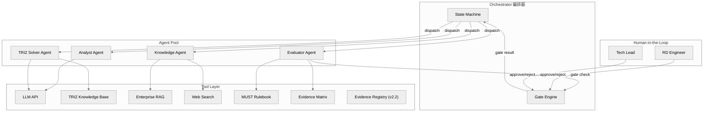

> **上游文件**：[E3--architecture-and-design.md](E3--architecture-and-design.md) (Part 1 架構總覽)
> **下游文件**：[E3--appendices-sa-perspectives.md](E3--appendices-sa-perspectives.md) (Part 3 SA 視角附錄)

# Part 2 · 詳細設計

> **說明**：Part 2 整段承接 v1.4 原 §1-§7「AI Agent 架構設計」全部內容（零遺失），作為本專案最核心的詳細設計。原章節 §1-§7 於 v2.0 重構後依下列對應降級為 §11.1-§11.6：
>
> | v1.4 章節 | v2.0 章節 |
> |----------|----------|
> | §1 Multi-Agent 架構總覽 | §11.1 |
> | §2 逐步自動化分級 | §11.2 |
> | §3 打破路徑依賴的 AI 機制 + §5 路徑依賴（詳細設計） | §11.3 |
> | §4 Agent 間協作流程 | §11.4 |
> | §6 技術實作建議（含 §6.4 API Endpoints） | §11.5 |
> | §7 驗證方式 | §11.6 |
>
> **v2.2 更新內容**（ADR-008 Auto-TRIZ v2 整合）：Analyst Agent 新增 5 個能力（`five_why`, `kt_is_is_not`, `function_analysis`, `oz_ot_analysis`, `entry_grading`）；TRIZ Solver Agent 新增 `sim_matrix`（多 TC 交互評分）、`complexity_check`（CCI 連續指標）；新增 `EvidenceRegistryService` 作為 cross-cutting 數據驗證層；§11.2 自動化對照表新增 Step 2b/2c；§11.5.4 新增 10 個 API endpoints。
> **v1.4 更新內容**（保留歷史）：Phase B 收斂掃描從 TRIZ step 移至 Decision Hub（RD 選定方案後手動觸發）；SCAMPER 改為純創意工具（不再回饋收斂掃描）；語意去重（is_confirmatory 標記）保留於 SecondaryContradiction schema，前端過濾；子系統拆解改為三層階層（System→Module→Component）；假設提取新增可證偽性篩選（evidence_level E0-E4）。（Phase A 已於 v8 退役，其職責由 L1 critic badge per-card 品質閘門取代。）
> **v1.3 更新**：收斂掃描原拆為 Phase A/B（Phase A 已於 v8 退役，由 L1 critic badge 取代）；僅保留 Phase B（Decision Hub 手動觸發，方案×矛盾交叉檢查）；Analyst Agent 新增 socratic follow-up、brief-impact、first-principles Anti-Anchor；Evaluator Agent 新增 Validation Passport 生成；Anti-Anchor 概念可晉升為 Step 5 候選方案；Step 5d 整合 TRIZ + SCAMPER + Anti-Anchor 候選；新增 3 個 API endpoints。
> **v1.2 更新**：Knowledge Agent 新增 Source Ingestion；Analyst Agent 新增 Contradiction Convergence Graph；TRIZ Solver Agent 輸出新增受影響模組清單與潛在二次矛盾。

## §11 AI Agent 協作架構

> **對齊依據**：`_domain-knowledge/DK-01--design-philosophy-and-process.md` v1.6 + `E3--appendices-sa-perspectives.md` Appendix D v1.6

---

## §11.1 Multi-Agent 架構總覽

### 1.1 Agent 角色定義

> **✅ 實作說明 (2026-04-27，對齊 ADR-006 Accepted & Implemented 2026-04-24)**：下表中的 Agent 為邏輯角色劃分。所有 Agent 已重構為 `HarnessAgent[DepsT, OutputT]` 泛型封裝（commit `3ce5738`），位於 `backend/app/harness/agent_base.py`。各 Agent 模組保留原路徑但內部改為 HarnessAgent 實例：
> - **Analyst Agent** → `backend/app/agents/analyst.py`（含 Anti-Anchor 功能，無獨立 AntiAnchorAgent 模組）
> - **TRIZ Solver Agent** → `backend/app/agents/triz_solver.py`（含 SCAMPER 和 Subsystem 功能）
> - **Evaluator Agent** → `backend/app/agents/evaluator.py`
> - **Knowledge Agent** → `backend/app/agents/knowledge.py`（action suggestions）+ `backend/app/agents/knowledge_wb.py`（6-asset writeback）
> - **Sub-agents**: `triz_critic.py`（PC 分解門控）、`scamper_feedback.py`（回饋矛盾）
> - **Harness 基礎設施**：`harness/model_adapter.py`（Pydantic AI Model → `_call_provider`）、`harness/tool_registry.py`（`@register_tool`）、`harness/orchestrator.py`（L1→Critic→L2→L3 管線）、`harness/skill_loader.py`（SKILL.md 發現）、`harness/mcp_server.py` + `mcp_client.py`（MCP 雙向）

| Agent | 職責 | 核心能力 | 綁定工具 |
|-------|------|---------|---------|
| **Analyst Agent** | 需求解構、蘇格拉底問答（含第七類「重構」提問）、**蘇格拉底追問（回答深度分析 + 後續追問生成）**、**Brief 變更影響評估**、因果迴路建模、矛盾識別、假設質疑、**約束可行性驗證 (Constraint Feasibility Check)**、**問題框架挑戰 (Problem Reframing)**、**第一性原理 Anti-Anchor（物理原則、因果鏈量化預期、邊界條件、邏輯謬誤守衛）**、**Phase B 收斂掃描（Decision Hub 手動觸發，方案×矛盾交叉檢查）+ 架構健康度監控（nodes > 5 halt）**、**(v2.2) 問題定向 (5 Why + KT Is/Is Not)**：從症狀快速挖掘可操作根因，有對照組時用 KT 大幅加速 OZ/OT 鎖定、**(v2.2) 功能建模 (Function Analysis)**：畫組件交互圖（有效/有害/不足/過度）+ SF 模型 + 子系統邊界定義，確保矛盾定義在正確系統粒度、**(v2.2) OZ-OT 分析**：鎖定操作空間 (OZ) + 操作時間 (OT) → 萃取核心物理變數 Px，為 TC→PC 轉換提供嚴謹橋樑、**(v2.2) 入口成熟度分級 (Level A/B/C)**：Level C 導向 Design Thinking/AD，Level A 必做問題定向，Level B 可跳步直接進 TRIZ | 語意理解、結構化拆解、隱含假設偵測、**物理可行性分析、問題重構、解法-模組耦合影響分析、矛盾分級判定、回答深度分析、Brief 變更追蹤**、**(v2.2) 5 Why 根因推論、KT 差異分析、功能交互建模、OZ-OT Px 鎖定** | LLM、Prompt Template、Functional Model Generator |
| **TRIZ Solver Agent** | AutoTRIZ 規則查表 + LLM 原理具體化 + SCAMPER 變形（純創意工具，產出直接進入候選池，不回饋收斂掃描）+ **子系統拆解（三層階層 System→Module→Component）**。輸出增加：**受影響模組清單 + 潛在二次矛盾**。**(v2.2) SIM 矩陣**：多 TC 場景下，對所有候選解法做 +1/0/-1 交互評分，選出最優組合（≤2 輪收斂）。**(v2.2) 複雜度檢查 (CCI)**：四問判定（組件數 / 能耗 / 認知負荷 / 演化趨勢）→ CCI 連續指標 [0,1]，分 Evolution / Weak Evolution / Patch 三級 | 矛盾矩陣查表、分離原理匹配、76 標準解映射、原理實體化、**三層子系統拆解**、**(v2.2) SIM 交互矩陣計算、CCI 複雜度判定** | TRIZ Knowledge Base (Prompt MD)、LLM、RAG |
| **Evaluator Agent** | MUST 規則驗證、KT 決策分析、證據品質評分、Gate 判定、**Validation Passport 生成**（為每個候選方案生成 assumptions[]、weak_points[]、required_verifications[]、confidence_level）、**Phase B 收斂判定**（Decision Hub 手動觸發，方案×矛盾交叉檢查） | 規則引擎、加權評分、風險評估、**驗證護照生成** | MUST Rulebook、Evidence Matrix、Risk Register、LLM |
| **Knowledge Agent** | 企業 RAG 檢索、Web 文獻搜尋、跨域類比、知識回寫、**多模態素材解讀 (Source Ingestion)** | 向量檢索、Web Scraping、文件分類、Citation 生成、**多模態文件解析 (PDF/圖片/Excel → 結構化提取)** | Vector DB、Web Search API、Document Store、**Multimodal LLM** |

### 1.2 Orchestrator（編排器）

> **✅ 實作狀態 (2026-04-27，對齊 ADR-006 Accepted & Implemented 2026-04-24)**：TRIZ Layered 管線 Orchestrator 已實作於 `backend/app/harness/orchestrator.py`（commit `3ce5738`），負責 L1→Critic→L2→L3 管線編排，含 context 隔離與 token 累計。產品級 Step 流轉仍為 **client-driven 模式**（前端路由 + React Query），後端提供 AI 計算端點。Gate 判定由 `backend/app/core/gate_registry.py` + `gate_checks.py` 實作（宣告式規則引擎），由 `GET /gates/{gate_id}/check` 端點按需呼叫。

**Orchestrator 已實作職責**：
- TRIZ Layered 管線編排：L1 Surface → Critic → L2 Root Cause → L3 Structural Check
- Context 隔離：各層間不洩漏 prompt/response
- Token 累計與監控：per-agent breakdown
- Solver registry 調度：透過 `@register_solver` 分派不同解法引擎

**尚未涵蓋（保留供未來參考）**：
- 產品級 Step 流轉（Step 1→2→...→8）仍由前端驅動
- Artifact 版本狀態管理（Draft → Reviewed → Verified → Baselined → Released）仍為手動/Gate 端點驅動
### 1.3 架構圖



---

## §11.2 逐步自動化分級

### 2.1 自動化等級定義

| 等級 | 說明 | AI 角色 | 人類角色 |
|------|------|---------|---------|
| **Fully Auto** | AI 獨立完成，人類僅在最終選擇時介入 | 執行者 | 選擇者 |
| **AI-Driven** | AI 主導產出，人類審核確認 | 主導者 | 審核者 |
| **AI-Assisted** | 人類主導決策，AI 提供分析與建議 | 顧問 | 決策者 |
| **Human-Led** | 人類主導，AI 僅做格式化或紀錄 | 記錄者 | 主導者 |

### 2.2 E2E 步驟自動化對照表

> 步驟名稱與編號完全對齊 `E3--appendices-sa-perspectives.md` Appendix D Step 編號對照表。

| Step | 正式名稱 | Phase | 自動化等級 | 主要 Agent | 人類角色 | 路徑依賴風險 | 核心工件 |
|------|---------|-------|-----------|-----------|---------|-------------|---------|
| **1** | **問題界定** (白帽 + 5W1H + **素材上傳解讀**) | I | AI-Assisted | Analyst + Knowledge | 提供原始需求、**上傳素材**、確認約束句 | 低 | Constraint |
| **2** | **理解全貌** (蘇格拉底問答) | I | **AI-Driven** | Analyst + Knowledge | 參與問答、確認假設與矛盾 | **高** — 慣用架構偏見 | Contradiction, Assumption |
| **2b** | **(v2.2) 問題定向** (5 Why + KT Is/Is Not) | I | **AI-Driven** | Analyst | 確認根因假設、補充對照組資訊 | 中 | 根因假設, Px 候選 |
| **2c** | **(v2.2) 功能建模** (FA + SF 診斷) | I | **AI-Driven** | Analyst | 確認組件交互圖、子系統邊界 | **高** — 粒度錯誤風險 | FunctionModel |
| **3** | **系統建模** (因果迴路 + TRIZ 矛盾 + 斷路點) | I | **AI-Driven** | Analyst + TRIZ Solver | 校準矛盾句、確認斷路點 | **高** — 傾向忽略矛盾 | Contradiction, Breakpoint |
| **4** | **假設與驗證規劃** (HDA + 未知集合) | II | AI-Assisted | Analyst + Knowledge | 填寫假設台帳、定義未知集合 | 中 | Assumption |
| **5-0** | **Anti-Anchor Sprint** (反路徑依賴，第一性原理 prompt，概念可晉升為 Step 5 候選) | II | **Fully Auto** | Analyst + Knowledge | 審核非典型架構 | **最高** — Anti-Anchor 核心 | — |
| **5a-0** | **(v2.2) OZ-OT 分析** (鎖定 Px + TC→PC 橋樑) | II | **AI-Driven** | Analyst | 確認 OZ/OT/Px 鎖定結果 | 中 | OzOtResult |
| **5a** | **TRIZ 解矛盾** (矩陣查表 + 原理具體化 + **架構健康度監控（nodes > 5 halt）**，Fatal/Major 完全收斂；**(v2.2) 多 TC 時觸發 SIM 矩陣**) | II | **Fully Auto** | TRIZ Solver + Knowledge | 確認矛盾分級、審核深度告警、**(v2.2) 審核 SIM 交互結果** | **高** — 解法錨定 | Concept Route (部分), SimMatrix |
| **5b** | **子系統定義** (三層階層拆解 System→Module→Component) | II | AI-Driven | Analyst | 確認子系統清單 | 中 | Concept Route (部分) |
| **5b.5** | **Spatial Discovery Validator** (Reference library 覆寫 + 算術 → Package Map SVG；overlay 為 optional) | II | AI-Driven | Analyst | 確認 spatial score、覆寫 reference data | 低 | SpatialEstimate |
| **5c** | **SCAMPER 模組變形** (純創意工具，每子系統 × 7 動作，產出直接進入候選池) | II | **Fully Auto** | TRIZ Solver + Knowledge | 僅選擇 | 高 — 變形慣性 | Concept Route (部分) |
| **5d** | **AI 方案生成 + Decision Hub** (整合 TRIZ + SCAMPER + Anti-Anchor 晉升，每方案附 Validation Passport + **(v2.2) CCI 複雜度指標**；RD 選定方案後手動觸發 **Phase B 收斂掃描**：方案×矛盾交叉檢查) | II | **AI-Driven** | Analyst + TRIZ Solver + Evaluator | 審核方案規格、**(v2.2) 檢視 CCI 判定（Evolution/Patch）**、觸發 Phase B | 中 | Concept Route, Interface, ComplexityCheckResult |
| **5e** | **MUST 快篩** (Go/No-Go 淘汰) | II | **AI-Driven** | Evaluator | 確認 MUST 判定結果 | 低 | Concept Route |
| **P** | **Pre-CAD 設計審查** (Pre-CAD Gate) | II | **AI-Driven** | Evaluator | 審核 Gate P 結果、決策保留路線 | 低 | Pre-CAD Review Report |
| **6** | **設計審查** (CAD Gate - MVP CAD Review) | III | AI-Assisted | Evaluator + Knowledge | 繪製 MVP CAD、填寫 DR EM、黑帽質疑 | 低 | Evidence Matrix, Risk, MVP CAD Model |
| **6e** | **證據補齊** (Evidence Closure) | III | AI-Assisted | Knowledge + Evaluator | 設計/執行最小實驗、收集證據 | 低 | Evidence |
| **7** | **決策與行動** (KT Decision Analysis + 最小實驗) | III | Human-Led | Evaluator | 執行 KT 決策 (MUST→WANT→AC)、簽核 | 低 | Decision Record |
| **8** | **內化與傳達** (費曼) | III | **Fully Auto** | Knowledge | 無需介入（知識回寫自動化） | 無 | Asset |

### 2.2a Gate 編號與步驟間遷移對照

| Gate | 從 | 到 | 判定條件 |
|------|----|----|---------|
| Gate 1 | Step 1 | Step 2 | Constraint: Draft → Reviewed |
| Gate 2 | Step 2c | Step 3 | FunctionModel 完成、假設與矛盾已揭露 |
| Gate 3 | Step 3 | Step 4 | Contradiction: Reviewed → Verified (TC-only) |
| Gate 4 | Step 4 | Step 5 | Assumption 台帳完成、未知集合定義 |
| Gate P | Step 5e | Step 6 | Pre-CAD 五維審查通過、Evidence Coverage ≥ 40% |
| Gate C | Step 6 | Step 7 | 證據充足，北極星 ≥ E2 |
| Gate 7 | Step 7 | Step 8 | KT Decision 簽核完成 |
| Gate 8 | Step 8 | COMPLETED | 知識回寫完成 |

> **權威定義**：Gate 判定邏輯與自動化等級見 [§11.4.3](E3--ai-agent-detailed-design.md#1143-gate-自動化判定)；State Machine 視覺化見 [Appendix D](E3--appendices-sa-perspectives.md#appendix-d-state-machine)。

### 2.2b 架構健康度回退路徑

Phase A（架構健康度監控）觸發強制停止時，採**漸進回退**而非一律回 Step 1：

| 觸發條件 | 回退策略 |
|---------|---------|
| **矛盾節點 > 5**（扣除 SIM 已收斂 TC 對後的淨節點數） | ① 回 Step 2c 重建功能模型 → ② 仍 >5 則回 Step 2b 重新根因分析 → ③ 仍無法收斂則回 Step 1 |
| **結構性循環矛盾**（組件 A↔B 互為因果） | 回 Step 2c 重建功能模型 |
| **框架性循環矛盾**（問題定義自相矛盾） | 回 Step 2b 或 Step 1 |

> **設計理由**：Step 2b（5Why/KT）和 2c（FA/SF）提供了比 Step 1 更精準的修正入口。上游功能模型或根因假設的缺陷是架構健康度異常的最常見原因，直接回 Step 1 浪費已完成的有效分析。

### 2.3 與 State Machine R&R 對照

| Step | State Machine 中的 Human R&R | State Machine 中的 AI R&R | Agent 映射 |
|------|---------------------------|-------------------------|-----------|
| 1 | 定義 Mission / Hard Constraints / Soft Objectives、**上傳素材** | 改寫約束句、生成缺口問卷、**解讀素材並提取約束/假設/數據** | Analyst + Knowledge Agent |
| 2 | 參與蘇格拉底問答、識別矛盾 | 固定執行七類提問、匯總矛盾列表 | Analyst Agent |
| 3 | 輔助因果迴路圖、正式化矛盾句 | 協助繪製因果迴路、提供 TRIZ 模板 | Analyst + TRIZ Solver |
| 4 | 填寫假設台帳、定義未知集合 | 提供模板、整理未知因子 | Analyst + Knowledge |
| 5 | 定義子系統（三層階層）、審查方案、執行 MUST、**確認矛盾分級**、**Decision Hub 觸發 Phase B** | Anti-Anchor / TRIZ / SCAMPER（純創意）/ 方案生成 / MUST 快篩 / **Phase B 收斂掃描 (Decision Hub 手動觸發，方案×矛盾交叉檢查)** + **架構健康度監控 (nodes > 5 halt)** | TRIZ Solver + Analyst + Evaluator |
| P | 依 Pre-CAD 模板審查、決策保留路線 | 提供模板、匯總審查結果 | Evaluator |
| 6 | 繪製 MVP CAD、填 DR EM、黑帽質疑 | 提供模板、失效案例比對 | Evaluator + Knowledge |
| 6e | 設計/執行最小實驗 | 協助實驗設計、歸檔證據 | Knowledge |
| 7 | KT 決策 (WANT 評分 + AC)、簽核 | 提供 KT 模板、整理風險矩陣 | Evaluator |
| 8 | 製作摘要、編寫 FAQ | 知識沉澱為可重用資產 | Knowledge |

---

## §11.3 打破路徑依賴的 AI 機制

> 本節整合 v1.4 §3（機制總論）與 §5（詳細設計）。為最小化內容搬動風險，詳細設計小節（§11.3.3 風險熱力圖、§11.3.4 機制與 Step 對應表）保留在 §11.4 後方；閱讀順序建議：11.3.1 → 11.3.2 → 11.4 → 11.3.3 → 11.3.4。

### 11.3.1 問題定義

RD 路徑依賴的典型表現：

| 症狀 | 描述 | 影響的 Step |
|------|------|-----------|
| **慣用架構偏見** | 直接套用過去成功方案的架構 | Step 2 理解全貌 |
| **矛盾盲視** | 忽略或低估技術矛盾，跳過 TRIZ | Step 3 系統建模 |
| **錨定效應** | 第一個想到的方案成為基準，後續方案僅為微調 | Step 5-0 / 5a / 5c |
| **隱含假設** | 將假設當作事實，未質疑技術前提 | Step 2-4 |
| **經驗慣性** | 只搜尋熟悉領域的解法，忽略跨域靈感 | Step 5a / 5c |

### 11.3.2 AI 對抗機制

#### 機制 1：Assumption Challenge（假設質疑）
- **觸發點**：Step 2 蘇格拉底問答過程中
- **執行者**：Analyst Agent
- **對齊**：DK-01 §Step 2 七類提問中的「假設」、「反思」與「重構」類
- **作法**：
  1. 從蘇格拉底問答中提取所有隱含假設（如「必須用齒輪傳動」）
  2. 對每個假設提出反問：「如果不用 X，還有什麼替代方案？」
  3. 產出 Assumption Register，標記 `challenged` / `confirmed`
- **產出物**：Assumption 工件（Draft），供 Step 4 假設台帳引用

#### 機制 2：Forced Divergence（強制發散）
- **觸發點**：Step 5-0 Anti-Anchor Sprint + Step 5a TRIZ 解矛盾
- **執行者**：TRIZ Solver Agent + Analyst Agent
- **對齊**：DK-01 §5.1 Anti-Anchor Sprint 規則
- **作法**：
  1. Step 5-0 產出 3 種「非典型架構」概念（整合流程原文規則）
  2. Step 5a 每個矛盾至少產出 3 條工程對映
  3. 至少 1 條必須是「跟競品在物理介面或核心機制上不相容」的路線
- **閾值**：Anti-Anchor Gate — 三條概念路線中至少一條非對標且初步通過 M1 + M4

#### 機制 3：Cross-Domain Analogical Search（跨域類比搜尋）
- **觸發點**：Step 5a / 5c 並行執行期間
- **執行者**：Knowledge Agent
- **作法**：
  1. 將核心矛盾抽象為功能語言（如「在有限空間內散熱」→「受限空間的能量轉移」）
  2. 搜尋異業專利與論文（醫療器材、航太、消費電子）
  3. 將異業解法翻譯回 eBike 領域語言
- **產出物**：≥2 條跨域類比方案，附 citation（KB-/WEB- 格式）

#### 機制 4：Anti-Anchor Gate（反錨定閘門）
- **觸發點**：Step 5-0 → Step 5a 之間（對齊 State Machine 的 Anti-Anchor Gate）
- **執行者**：Evaluator Agent
- **對齊**：DK-01 §5.1 Anti-Anchor Gate 檢查點
- **作法**：
  1. 檢查三條概念路線是否有至少一條「非對標」
  2. 非對標路線須初步通過 M1（空間約束）和 M4（解耦程度）
  3. 不通過 → 回退 Step 5-0 重新發散

---

## §11.4 Agent 間協作流程

### 11.4.1 主流程序列圖

```mermaid
%%{init: {'theme': 'neutral'}}%%
sequenceDiagram
    participant RD as RD Engineer
    participant ORC as Orchestrator
    participant AA as Analyst Agent
    participant TA as TRIZ Solver Agent
    participant EA as Evaluator Agent
    participant KA as Knowledge Agent

    Note over ORC: Phase I: 定義問題空間

    RD->>ORC: 提交設計需求 + 上傳素材 (PDF/圖片/規格書/報告)
    ORC->>KA: Step 1 - 素材解讀 (Source Ingestion) + 檢索歷史案例/產業基準
    KA-->>ORC: 素材提取結果 (約束/假設/數據/矛盾線索) + 知識補充 (KB-/WEB-)
    ORC->>AA: Step 1 問題界定 - 結構化約束句 (含素材提取結果)
    AA-->>ORC: Constraint (Draft) + Assumption (預填)
    ORC->>AA: 約束可行性驗證 (Constraint Feasibility Check)
    alt 約束物理不可能
        AA-->>ORC: 🛑 打住: 極限分析報告 + 建議放寬約束
        ORC->>RD: 要求重新定義問題
        RD-->>ORC: 修正約束
    else 約束邊界可行
        AA-->>ORC: ⚠️ 高風險約束組合 (繼續但預警)
    else 約束可行
        AA-->>ORC: ✓ 約束可行
    end
    ORC->>RD: 審核 AI 提取結果 + 可行性判定
    RD-->>ORC: 確認/修正
    ORC->>EA: Gate 1 檢查
    EA-->>ORC: Gate 1 通過 (DRAFT→PHASE_I)

    ORC->>AA: Step 2 理解全貌 - 蘇格拉底七類提問 (含「重構」類: 質疑問題框架)
    ORC->>KA: Step 2 - 歷史假設/失效機制文獻
    AA-->>ORC: Contradiction (Draft) + Assumption (Draft)
    ORC->>AA: Step 2 - Assumption Challenge (假設質疑)
    AA-->>ORC: Assumption Register
    ORC->>RD: 審核矛盾列表 + 假設清單
    RD-->>ORC: 確認/修正
    ORC->>EA: Gate 2 檢查
    EA-->>ORC: Gate 2 通過

    ORC->>AA: Step 3 系統建模 - 因果迴路圖
    ORC->>TA: Step 3 - TRIZ 矛盾正式化 (LLM翻譯 + 規則驗證)
    ORC->>KA: Step 3 - FMEA/8D 歷史因果鏈
    AA-->>ORC: 因果迴路圖 + 斷路點
    TA-->>ORC: TRIZ 矛盾句 (Contradiction Verified)
    ORC->>RD: 校準矛盾句
    RD-->>ORC: 確認
    ORC->>EA: Gate 3 檢查
    EA-->>ORC: Gate 3 通過 (PHASE_I→PHASE_II)

    Note over ORC: Phase II: 假設與發散

    ORC->>AA: Step 4 假設與驗證規劃 - 假設台帳
    ORC->>KA: Step 4 - 過往驗證方法/成本紀錄
    AA-->>ORC: Assumption (Verified)
    ORC->>RD: 確認假設台帳 + 未知集合
    RD-->>ORC: 確認
    ORC->>EA: Gate 4 檢查
    EA-->>ORC: Gate 4 通過

    ORC->>AA: Step 5-0 Anti-Anchor Sprint (第一性原理 prompt)
    ORC->>KA: Step 5-0 - 跨域架構搜尋
    AA-->>ORC: 3 種非典型架構概念 (保留 mechanism/cross_domain_source/validation_passport, 可晉升為候選)
    ORC->>EA: Anti-Anchor Gate 檢查
    EA-->>ORC: Anti-Anchor Gate 通過

    Note over ORC: Step 5 內部並行發散
    par TRIZ 解矛盾 (每條矛盾獨立)
        ORC->>TA: Step 5a - 矩陣查表 + 原理具體化
        ORC->>KA: Step 5a - 佐證搜尋 (專利/文獻)
        TA-->>ORC: 每條矛盾 ≥3 條工程對映 + 受影響模組清單
        ORC->>AA: Step 5a 架構健康度監控 (nodes > 5 halt, 循環偵測) + 矛盾分級
        alt 收斂圖節點 > 5
            AA-->>ORC: 🛑 強制暫停: 架構根本性問題
            ORC->>RD: 回到 Step 1 重新定義或換架構方向
        else 循環矛盾
            AA-->>ORC: 🛑 強制暫停: 架構內在矛盾，無法 TRIZ 解決
            ORC->>RD: 要求根本重構
        else Fatal/Major 矛盾
            AA-->>ORC: 新矛盾加入收斂圖 (必須求解到收斂)
            ORC->>TA: 繼續求解 (不設次數上限)
        else Minor 矛盾
            AA-->>ORC: 記入 Risk Register (不阻擋流程)
        else 無新矛盾
            AA-->>ORC: 收斂 ✓
        end
    and SCAMPER 變形 (每個子系統獨立, 純創意工具)
        ORC->>AA: Step 5b - 子系統定義 (三層階層 System→Module→Component)
        AA-->>ORC: 子系統清單 (3-level hierarchy)
        ORC->>TA: Step 5c - SCAMPER 模組變形 (產出直接進入候選池)
        TA-->>ORC: 每子系統 × 7 動作變形
    end

    ORC->>AA: Step 5d AI 方案生成 - 整合 TRIZ + SCAMPER + Anti-Anchor 晉升
    AA-->>ORC: Concept Route (Draft) + Interface Contract
    ORC->>EA: 為每個候選方案生成 Validation Passport
    EA-->>ORC: Validation Passport (assumptions[], weak_points[], required_verifications[], confidence_level)
    ORC->>RD: Step 5d Decision Hub - RD 選定方案
    RD-->>ORC: 選定方案清單
    ORC->>AA: Phase B 收斂掃描 (方案×矛盾交叉檢查, 手動觸發)
    AA-->>ORC: Phase B 掃描結果 (交叉矛盾報告)

    ORC->>EA: Step 5e MUST 快篩
    EA-->>ORC: 快篩結果 (保留 3-5 條路線)

    ORC->>EA: Gate P 檢查 (Pre-CAD Gate)
    EA-->>ORC: Gate P 結果
    ORC->>RD: Step P Pre-CAD 設計審查
    RD-->>ORC: 保留 3-5 條路線
    Note over ORC: Phase 轉換 (PHASE_II→PHASE_III)

    RD->>ORC: Step 6 設計審查 - MVP CAD + DR EM
    ORC->>KA: Step 6 - 歷史失效案例比對
    ORC->>EA: Step 6 - 證據品質評分

    loop 證據補齊迴圈
        ORC->>EA: 檢查證據缺口
        alt 北極星證據 < E2
            ORC->>AA: Step 6e 證據補齊 - 實驗設計
            ORC->>KA: Step 6e - 方法檢索
            RD->>ORC: 實驗數據回傳
            ORC->>EA: 更新 Evidence Matrix
        end
    end

    ORC->>EA: Gate C 檢查 (CAD Gate - Step 6 完成)
    EA-->>ORC: Gate C 通過 (北極星 ≥ E2, Evidence Matrix 達標)

    ORC->>RD: Step 7 決策與行動 - KT Decision Analysis
    ORC->>EA: Step 7 - KT 評分輔助 (WANT + AC)
    RD-->>ORC: KT 決策記錄簽核
    ORC->>EA: Gate 7 檢查
    EA-->>ORC: Gate 7 通過

    ORC->>KA: Step 8 內化與傳達 - 知識回寫
    KA-->>ORC: 回寫完成 (6 類資產)
    ORC->>EA: Gate 8 檢查
    EA-->>ORC: Gate 8 通過 (PHASE_III→COMPLETED)
```



### 11.4.2 並行處理規則

> 對齊 State Machine §平行處理說明：「不同矛盾句的 TRIZ 解法、不同子系統的 SCAMPER 變形可並行執行」。

| 可並行的組合 | 前置條件 | 說明 |
|-------------|---------|------|
| 不同矛盾句的 5a (TRIZ 解矛盾) | Gate 4 通過 + Anti-Anchor Gate 通過 | 每條矛盾獨立求解 |
| 不同子系統的 5c (SCAMPER 變形) | 5b 子系統清單已定義 | 每個子系統獨立變形 |
| 5a (TRIZ) 與 5b→5c (子系統→SCAMPER) | Anti-Anchor Gate 通過 | TRIZ 和 SCAMPER 為互補路徑 |
| Knowledge Agent 預檢索 + 主流程 | 任何 Step | Knowledge Agent 可提前快取 |

> **注意**：5b（子系統定義）依賴 5a（TRIZ 解矛盾）的解法方向指出受影響子系統，但不同矛盾的 5a 可與不同子系統的 5c 並行。所有並行產出匯聚到 5d (AI 方案生成) 做交叉組合，再由 5e (MUST 快篩) 統一淘汰。

### 11.4.3 Gate 自動化判定

> 對齊 State Machine §Gate 與 Phase 轉換對照表，完整列出所有 Gate。

| Gate | 位置 | Gate 類型 | Phase 轉換 | 可否自動 | 判定邏輯 | Fallback |
|------|------|-----------|-----------|---------|---------|---------|
| **Gate 1** | Step 1 → Step 2 | 內部 Gate | **DRAFT → PHASE_I** | AI-Driven | 三個最不能失敗指標已明確且可量測 | 人類覆審 |
| **Gate 2** | Step 2 → Step 3 | 內部 Gate | Phase I 內部 | AI-Driven | ≥10 條假設 + Top 3 致命假設 + ≥3 條核心矛盾 | 人類覆審 |
| **Gate 3** | Step 3 → Step 4 | 內部 Gate | **PHASE_I → PHASE_II** | AI-Driven | ≥1 因果迴路 + ≥3 斷路點 + 每條矛盾有 TRIZ 正式句 | 人類覆審 |
| **Gate 4** | Step 4 → Step 5 | 內部 Gate | Phase II 內部 | AI-Driven | Top 3 假設每個有 1-2 週內可完成的驗證設計 | 人類覆審 |
| **Anti-Anchor** | Step 5-0 → Step 5a | 內部 Gate | Phase II 內部 | **Fully Auto** | ≥1 非對標路線且初步通過 M1 + M4 | 自動回退 5-0 |
| **Gate P** | Step 5 → Step P | **Pre-CAD Gate** | Phase II 內部 | AI-Driven | ≥3 條架構級路線 + ≥1 Anti-Anchor + 每條有完整方案規格 + **Evidence Coverage ≥ 40%**（ADR-008 D3） | 人類覆審 |
| — | Step P → Step 6 | Phase 轉換 | **PHASE_II → PHASE_III** | Human-Led | 候選收斂至 3-5 條 + Interface Contract 已更新 + 最小 CAD 範圍明確 | N/A |
| **Gate 6** | Step 6 → Step 6e | 內部 Gate | Phase III 內部 | AI-Driven | 發現證據缺口，觸發 6e 迴圈 | 人類覆審 |
| **Gate C** | Step 6 → Step 7 | **CAD Gate** | Phase III 內部 | Human-Led | 北極星 ≥ E2 + Evidence Matrix 所有 row 達標 + Top 10 風險有緩解 | N/A |
| **Gate 7** | Step 7 → Step 8 | 內部 Gate | Phase III 內部 | Human-Led | KT 決策記錄完整已簽核 + 所有 H 風險有緩解 | N/A |
| **Gate 8** | Step 8 → Done | 內部 Gate | **PHASE_III → COMPLETED** | AI-Driven | 所有核心工件 Baselined → Released | 人類覆審 |

### 11.4.4 Artifact State 轉換（對齊 State Machine）

| Step | 核心工件 | 狀態轉換 |
|------|---------|---------|
| Step 1 → Gate 1 | Constraint | Draft → Reviewed |
| Step 2 → Gate 2 | Contradiction, Assumption | Draft → Reviewed |
| Step 3 → Gate 3 | Contradiction | Reviewed → Verified |
| Step 3 → Gate 3 | Breakpoint | Draft → Reviewed |
| Step 4 → Gate 4 | Assumption | Reviewed → Verified |
| Step 5e → Gate P | Concept Route, Interface | Draft → Reviewed |
| Step P (Pre-CAD 通過) | Concept Route | Reviewed → Verified |
| Step P (Pre-CAD 通過) | Pre-CAD Review Report | Draft → Reviewed |
| Step 6 → Gate 6 | Evidence Matrix, Risk | Draft → Reviewed |
| Step 6 → Gate C | Evidence Matrix | Reviewed → Verified |
| Step 6 → Gate C | MVP CAD Model | Draft → Reviewed |
| Step 7 → Gate 7 | Concept Route | Verified → Baselined |
| Step 7 → Gate 7 | Decision Record | Draft → Reviewed |
| Step 8 → Gate 8 | All Core Artifacts | Baselined → Released |

---

### 11.3.3 路徑依賴風險熱力圖（詳細設計）

> 本小節整合自 v1.4 §5「打破路徑依賴的 AI 機制（詳細設計）」。

```
Step:    1     2     3     4    5-0   5a    5b    5c    5d    5e     P     6    6e     7     8
Risk:   🟢   🔴   🔴   🟡   🔴   🔴   🟡   🟡   🟡   🟢   🟢   🟢   🟢   🟢   ⚪
AI介入: ◐    ●    ●    ◐    ●    ●    ●    ●    ●    ●    ●    ◐    ◐    ○    ●

圖例：🔴 高風險  🟡 中風險  🟢 低風險  ⚪ 無風險
      ● Fully Auto / AI-Driven  ◐ AI-Assisted  ○ Human-Led
```

> **設計原則**：路徑依賴風險越高的步驟，AI 介入程度越深。正是因為人類在 Step 2（慣用架構）、Step 3（矛盾盲視）、Step 5-0/5a（錨定效應）最容易陷入慣性，才需要 AI 強制介入打破錨定。

### 11.3.4 機制與 Step 對應表

| AI 機制 | 觸發 Step | Agent | 對齊整合流程章節 |
|---------|----------|-------|----------------|
| **Constraint Feasibility Check** | **Step 1** | **Analyst + Knowledge** | **§Step 1 約束可行性驗證** |
| Assumption Challenge | Step 2 | Analyst | §Step 2 蘇格拉底七類提問 |
| **Problem Reframing** | **Step 2** | **Analyst** | **§Step 2 第七類「重構」提問** |
| **Source Ingestion** | **Step 1** | **Knowledge** | **§Step 1 多模態素材輸入** |
| Forced Divergence | Step 5-0 + 5a | TRIZ Solver + Analyst | §5.1 Anti-Anchor Sprint + §5a TRIZ 解矛盾 |
| **Phase B 收斂掃描 + Architecture Health Monitor** | **Phase B: Step 5d Decision Hub (手動觸發); 架構健康度: phase-agnostic (nodes > 5 halt)** | **Analyst + Evaluator** | **Phase B (方案×矛盾交叉檢查, Decision Hub 手動觸發) + 架構健康度 (節點>5 → ArchitectureHaltOverlay) + L1 critic badge (per-card 品質閘門, 取代原 Phase A)** |
| **Validation Passport Generation** | **Step 5d** | **Evaluator** | **每個候選方案自帶 Validation Passport** |
| **Socratic Follow-up** | **Step 2** | **Analyst** | **回答深度分析 + 後續追問生成** |
| **Brief Impact Analysis** | **Step 1-2** | **Analyst** | **Brief 變更影響評估** |
| Cross-Domain Search | Step 5a/5c 並行 | Knowledge | §5.0 知識增強輸入 (Web 外部專利/新材料) |
| Anti-Anchor Gate | Step 5-0 → 5a | Evaluator | §5.1 Anti-Anchor Gate 檢查點 |

---

## §11.5 技術實作建議

### 11.5.1 框架選型

> **✅ 實作狀態 (2026-04-27，對齊 ADR-006 Accepted & Implemented 2026-04-24)**：ADR-006 Pydantic AI spine 已全面實作（commit `3ce5738`，Phase 0-5 完成，86% 工時消化）。架構如下：

**當前實作：Pydantic AI Harness spine（ADR-006 已實作）**
- 所有 Agent 已重構為 `HarnessAgent[DepsT, OutputT]` 泛型封裝（`backend/app/harness/agent_base.py`）
- Model adapter（`harness/model_adapter.py`）包裝 `_call_provider`，保留多 provider 支援
- LLM 呼叫仍集中於 `agents/base.py`（`call_llm_json` / `call_llm_structured` / `call_llm_json_parsed` / `web_search_with_llm`），由 model adapter 橋接
- 支援 5 種 LLM provider：Anthropic（預設 `claude-sonnet-4-6`）、OpenAI、Azure OpenAI、Gemini、Qwen
- Retry 邏輯內建（3 次指數退避重試）
- 呼叫路徑：Router → HarnessAgent → model_adapter → `_call_provider` → LLM API → Pydantic v2 驗證 → Response
- Tool Registry：`@register_tool` decorator + JSON Schema 自動生成（`harness/tool_registry.py`）
- Orchestrator：L1→Critic→L2→L3 管線（`harness/orchestrator.py`），含 context 隔離 + token 累計
- Solver Registry：`@register_solver` pluggable dispatcher（`harness/solver_registry.py`）
- Skill Loader：`skills/*/SKILL.md` filesystem scanning（`harness/skill_loader.py`）
- MCP 雙向：`harness/mcp_server.py`（曝露 tools）+ `harness/mcp_client.py`（消費外部 tools）
- 詳見 [ADR-006](adrs/ADR-006-harness-architecture.md)

**Legacy 架構（v1.0，已被取代）**
- ~~Agent 模組為 module-level plain functions~~ → 已轉為 HarnessAgent 實例
- ~~直接呼叫 `base.py`~~ → 透過 model adapter 間接呼叫

### 11.5.1b Multi-Provider LLM 支援（當前實作）

> 程式碼位置：`backend/app/core/config.py` (`LLMProvider` enum) + `backend/app/agents/base.py` (`_call_provider`)

| Provider | 預設模型 | 快速模型 | 環境變數 |
|----------|---------|---------|---------|
| **Anthropic** (預設) | `claude-sonnet-4-6` | `claude-haiku-4-5` | `ANTHROPIC_API_KEY` |
| OpenAI | `gpt-4o` | `gpt-4o-mini` | `OPENAI_API_KEY` |
| Azure OpenAI | 可設定 deployment name | 可設定 | `AZURE_OPENAI_API_KEY`, `AZURE_OPENAI_ENDPOINT` |
| Gemini | `gemini-2.5-flash` | `gemini-2.0-flash-lite` | `GEMINI_API_KEY` |
| Qwen | `qwen-plus` | `qwen-turbo` | `QWEN_API_KEY` |

切換方式：設定環境變數 `LLM_PROVIDER`（預設 `anthropic`）。

### 11.5.1c 後端基礎設施模組（當前實作）

| 模組 | 路徑 | 說明 |
|------|------|------|
| Auth Middleware | `backend/app/middleware/auth.py` | Supabase JWT 驗證，注入 `user_id`；Dev bypass token 支援 |
| Error Handler | `backend/app/middleware/error_handler.py` | 統一 JSON 錯誤封裝（`{"error": {"code", "message", "detail"}}` 格式） |
| Request ID | `backend/app/middleware/request_id.py` | 自動生成 `X-Request-ID` header |
| Prompts | `backend/app/prompts/*.py` | 系統 prompt 模板（analyst, evaluator, triz_solver, knowledge），與 agent 邏輯分離 |
| Observability | `backend/app/observability/metrics.py` | `emit_counter`, `phase_timer`；`POST /observability/web-vitals` beacon（無 auth） |

### 11.5.2 Agent-Tool 綁定

```yaml
analyst_agent:
  llm: claude-sonnet-4-6
  tools:
    - functional_model_generator  # Step 3 產出因果迴路圖 + 功能樹
    - assumption_extractor        # Step 2 假設質疑
    - constraint_feasibility_checker  # Step 1 約束可行性驗證 (物理極限分析)
    - problem_reframer               # Step 2 問題框架挑戰 (重構提問)
    - phase_b_cross_checker          # Phase B: Decision Hub 手動觸發 (方案×矛盾交叉檢查)
    - architecture_health_monitor    # 架構健康度監控 (nodes > 5 → ArchitectureHaltOverlay, 循環偵測, phase-agnostic)
    - scamper_checklist           # Step 5c SCAMPER 模板 (交由 TRIZ Solver 執行)
    - anti_anchor_generator       # Step 5-0 非典型架構生成 (第一性原理 prompt, 保留 mechanism/cross_domain_source/validation_passport)
    - socratic_follow_up          # Step 2 回答深度分析 + 後續追問生成
    - brief_impact_analyzer       # Step 1-2 Brief 變更影響評估
  prompts:
    - system: "你是一位機械工程系統分析師..."

triz_solver_agent:
  llm: claude-sonnet-4-6
  tools:
    - triz_parameter_mapper       # Step 3 自然語言 → 39 參數
    - contradiction_matrix_lookup # Step 5a-1 矛盾矩陣查表
    - separation_principle_match  # Step 5a-2 物理矛盾 → 分離原理
    - standard_solution_match     # Step 5a-3 Su-Field → 76 標準解
    - principle_instantiator      # Step 5a-4 抽象原理 → 工程手段
    - scamper_transformer         # Step 5c SCAMPER 模組變形
  knowledge_base:
    - triz_knowledge_base/01_39_parameters.md
    - triz_knowledge_base/02_contradiction_matrix.md
    - triz_knowledge_base/03_40_principles.md
    - triz_knowledge_base/04_separation_principles.md
    - triz_knowledge_base/05_76_standard_solutions.md

evaluator_agent:
  llm: claude-sonnet-4-6
  tools:
    - must_rule_checker           # Step 5e MUST 快篩
    - kt_scorer                   # Step 7 KT 加權評分 (WANT + AC)
    - evidence_quality_assessor   # Step 6 E-level 評估
    - pre_cad_reviewer            # Step P 5 維度審查
    - anti_anchor_gate_checker    # Step 5-0→5a 反錨定檢查
    - validation_passport_generator # Step 5d 為每個候選方案生成 Validation Passport
    - phase_b_convergence_judge     # Phase B 收斂判定 (Decision Hub 手動觸發)
  templates:
    - DK-03--kt-decision-framework.md §MUST
    - DK-01--design-philosophy-and-process.md §Step P
    - DK-01--design-philosophy-and-process.md §Step 6

knowledge_agent:
  llm: claude-haiku-4-5  # 快速檢索用輕量模型
  tools:
    - enterprise_rag_search       # 企業知識庫 (FMEA/8D/決策/規範)
    - web_patent_search           # 專利搜尋 (Google Patents / Espacenet)
    - web_literature_search       # 論文搜尋
    - cross_domain_translator     # 異業→本業翻譯
    - knowledge_writeback         # Step 8 回寫知識庫 (6 類資產)
    - source_ingestion            # Step 1 多模態素材解讀 (PDF/圖片/Excel → 結構化提取)
  citation_format:
    rag: "KB-{領域}-{序號}"       # e.g., KB-FMEA-042
    web: "WEB-{類型}-{序號}"      # e.g., WEB-PAT-003
```

### 11.5.3 State Management 對接

```yaml
process_states:
  # 對應 State Machine 的 Process State
  - DRAFT → PHASE_I → PHASE_II → PHASE_III → COMPLETED
  # Step-level
  - IDLE → STEP_1_ACTIVE → STEP_2_ACTIVE → STEP_3_ACTIVE
    → STEP_4_ACTIVE → STEP_5_ACTIVE (含 5-0/5a/5b/5c/5d/5e)
    → STEP_P_ACTIVE → STEP_6_ACTIVE → STEP_6E_ACTIVE (迴圈)
    → STEP_7_ACTIVE → STEP_8_ACTIVE → COMPLETED

artifact_states:
  # 對應 State Machine 的 Artifact State
  - Draft → Reviewed → Verified → Baselined → Released

agent_state:
  - idle → running → waiting_human → completed → error

orchestrator_state:
  current_step: "step_5a"
  current_phase: "PHASE_II"
  parallel_tasks: ["triz_c001", "triz_c002", "scamper_subsys_a"]
  gate_results:
    gate_1: "passed"
    gate_2: "passed"
    gate_3: "passed"
    gate_4: "passed"
    anti_anchor: "passed"
    gate_p: "pending"
  human_pending: []
  artifact_versions:
    constraint: "reviewed"
    contradiction: "verified"
    assumption: "verified"
    concept_route: "draft"
```

---

### 11.5.4 API Endpoints

| Method | Endpoint | Agent | 說明 |
|--------|----------|-------|------|
| POST | `/convergence/scan` | Analyst + Evaluator | Phase B 收斂掃描：方案×矛盾交叉檢查（Decision Hub 手動觸發）。`is_confirmatory` 語意去重仍存於 SecondaryContradiction schema，前端過濾。 |
| POST | `/alternatives/validation-passport` | Evaluator | 為任意候選方案生成 Validation Passport（assumptions[], weak_points[], required_verifications[], confidence_level） |
| POST | `/questions/follow-up` | Analyst | 分析蘇格拉底回答深度，生成後續追問 |
| POST | `/questions/brief-impact` | Analyst | 評估 Brief 變更對哪些蘇格拉底問題有影響 |
| POST | `/analyst/five-why` | Analyst | **(v2.2)** 5 Why 根因分析 — 從症狀挖掘到可操作因果節點，產出子系統 + 初步 TC 假設 |
| POST | `/analyst/kt-analysis` | Analyst | **(v2.2)** KT Is/Is Not 分析 — 有對照組時做差異比較，產出 Px 候選清單 + OZ/OT 初步鎖定 |
| POST | `/analyst/function-analysis` | Analyst | **(v2.2)** 功能建模 — 畫組件交互圖 (有效/有害/不足/過度) + SF 模型 + 子系統邊界定義 |
| POST | `/analyst/oz-ot-analysis` | Analyst | **(v2.2)** OZ-OT 分析 — 鎖定操作空間/時間 → Px 物理變數，為 TC→PC 轉換提供橋樑 |
| POST | `/analyst/entry-grading` | Analyst | **(v2.2)** 入口成熟度分級 — Level A/B/C 判定，路由至 TRIZ / Design Thinking / 跳步 |
| POST | `/triz/sim-matrix` | TRIZ Solver | **(v2.2)** SIM 矩陣 — 多 TC 候選解法間的 +1/0/-1 交互評分，≤2 輪收斂 |
| POST | `/triz/complexity-check` | TRIZ Solver | **(v2.2)** CCI 複雜度檢查 — 四問判定 → CCI [0,1]，Evolution / Weak Evolution / Patch 三分 |
| POST | `/evidence/register-claim` | EvidenceRegistry | **(v2.2)** 註冊數值聲明 — 含 Claim ID、來源 agent、step、原始數值 |
| POST | `/evidence/verify` | EvidenceRegistry | **(v2.2)** 驗證 claim — WebSearch (Tavily) 外部驗證，標記 VERIFIED/APPROXIMATE/UNVERIFIED |
| GET | `/evidence/coverage` | EvidenceRegistry | **(v2.2)** 取得 Evidence Coverage 統計 — VERIFIED + APPROXIMATE 佔比，Gate 退出條件用 |

---

## §11.6 驗證方式

### 11.6.1 E2E 驗證場景：eBike 馬達散熱

1. **輸入**：「eBike 中置馬達在長坡連續高負載下溫度超標，需在 150×80mm 空間內解決」
2. **預期結果**：
   - Step 1：Constraint (Draft) 含三個最不能失敗指標，Gate 1 通過
   - Step 2：蘇格拉底問答產出 ≥10 假設 + ≥3 矛盾，Assumption Challenge 至少質疑「必須用風冷」
   - **(v2.2) Step 2b**：5 Why 產出根因假設「散熱路徑被結構件遮擋」→ 初步 TC（散熱效率 vs 結構剛性）；KT 比較「爬坡 vs 平路」差異 → Px 候選「持續功率密度」
   - **(v2.2) Step 2c**：FA 組件交互圖顯示 馬達繞組→(有害熱)→殼體→(不足散熱)→環境；SF 狀態：S1(繞組) -F(熱場)→ S2(殼體) = 效能不足
   - Step 3：因果迴路圖含熱-機-振耦合，TRIZ 矛盾句正式化（改善散熱 vs 惡化空間）
   - Step 5-0：3 種非典型架構，≥1 條非對標（如磁力傳動），Anti-Anchor Gate 通過
   - **(v2.2) Step 5a-0**：OZ-OT 鎖定 Px = 殼體熱傳導係數（OZ: 馬達-殼體介面 3mm 範圍，OT: 爬坡持續 8min 內）
   - Step 5a：每條矛盾 ≥3 條 TRIZ 工程對映，含 ≥1 條非風冷方案（相變材料、液冷、熱管）；**(v2.2) 多 TC 時 SIM 矩陣顯示解法間交互（PCM + 液冷 = +1 互相強化）**
   - Step 5c：SCAMPER 對散熱子系統 × 7 動作變形
   - **(v2.2) Step 5d**：CCI 判定 — PCM 方案 CCI=0.25 (Evolution)；液冷方案 CCI=0.55 (Weak Evolution)；風冷強化方案 CCI=0.72 (Patch)
   - Step 5e：MUST 快篩後保留 3-5 條（≥1 Anti-Anchor）
   - Step P：Pre-CAD 審查收斂至 3-5 條；**(v2.2) Evidence Coverage ≥ 40%**
   - Step 8：散熱方案知識回寫至企業知識庫（6 類資產）

### 11.6.2 檢查清單

- [ ] 每個 Step 名稱與 `E3--appendices-sa-perspectives.md` Appendix D Step 編號對照表完全一致
- [ ] 每個 Gate 的判定邏輯與 `_domain-knowledge/DK-01--design-philosophy-and-process.md` Gate 檢查點一致
- [ ] Artifact State 轉換與 State Machine §Gate 與 Phase 轉換對照表一致
- [ ] Step 5 內部子步驟（5-0/5a/5b/5c/5d/5e）順序與DK-01 §5.2 流程架構圖一致
- [ ] 並行規則與 State Machine §平行處理說明一致（TRIZ 與 SCAMPER 並行，非 5a+5b+5c 全並行）
- [ ] MUST 規則 (M1-M6) 與 DK-03--kt-decision-framework.md §MUST 一致
- [ ] Pre-CAD 審查 5 維度與 DK-01--design-philosophy-and-process.md §Step P 一致
- [ ] Knowledge Agent 的 citation 格式（KB-/WEB-）與DK-01 §1.4 知識引用規範一致
- [ ] AutoTRIZ 子步驟（5a-1 至 5a-5）與DK-01 §5a AutoTRIZ 執行模式表一致
- [ ] KT 決策在 Step 7（非 Step 5e），MUST 快篩在 Step 5e（非 Step 7）

---

### 11.6.3 與現有文件的對應關係（原 v1.4 附錄 A）

| 本文件章節 | 對應的 E2E 文件 | 對應章節 |
|-----------|----------------|---------|
| §1 Agent 定義 | PRD_RD_Design_Copilot.md | §AI 角色邊界表 |
| §2.2 自動化對照表 | E3--appendices-sa-perspectives.md (Appendix D) | §Step 編號對照 + §R&R |
| §2.3 R&R 對照 | E3--appendices-sa-perspectives.md (Appendix D) | §各 Step R&R |
| §3 路徑依賴機制 | PRD_RD_Design_Copilot.md | §Pain Points |
| §4.1 序列圖 | DK-01--design-philosophy-and-process.md | §流程總覽 + 各 Step |
| §4.2 並行規則 | E3--appendices-sa-perspectives.md (Appendix D) | §平行處理說明 |
| §4.3 Gate 判定 | 整合流程.md + State_Machine.md | §Gate 與 Phase 轉換對照 |
| §4.4 Artifact 轉換 | E3--appendices-sa-perspectives.md (Appendix D) | §Gate 關鍵工件狀態轉換 |
| §5.2 機制對應 | DK-01--design-philosophy-and-process.md | §5.1 Anti-Anchor + §5a TRIZ |
| §6.2 TRIZ KB | triz_knowledge_base/README.md | §注入策略 |
| §6.3 State Management | E3--appendices-sa-perspectives.md (Appendix D) | §雙層狀態機 |
| §7.2 MUST 驗證 | DK-03--kt-decision-framework.md §MUST | 全文 |
| §7.2 Pre-CAD 驗證 | DK-01--design-philosophy-and-process.md §Step P | 全文 |
| §7.2 Evidence 驗證 | DK-01--design-philosophy-and-process.md §Step 6 | 全文 |

