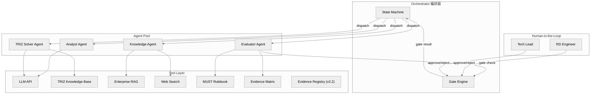

---

## doc_id: E3-part2
title: RD Design Copilot — AI Agent Detailed Design
version: v2.2
last_updated: 2026-04-23
status: Active
parent: E3--architecture-and-design.md

> **上游文件**：[E3--architecture-and-design.md](E3--architecture-and-design.md) (Part 1 架構總覽)
> **下游文件**：`diagrams/` — [Appendix A](diagrams/appendix-a--forward-subsystem-discovery.md) / [B](diagrams/appendix-b--forward-triz-solver.md) / [C](diagrams/appendix-c--reverse-anti-anchor.md) / [D](diagrams/appendix-d--state-machine.md) / [E](diagrams/appendix-e--triz-scamper-flow.md)

# Part 2 · 詳細設計

## §11 AI Agent 協作架構

> **對齊依據**：`_domain-knowledge/DK-01--design-philosophy-and-process.md` v1.6 + [`diagrams/appendix-d--state-machine.md`](diagrams/appendix-d--state-machine.md) v1.6

---

## §11.1 Multi-Agent 架構總覽

### 1.1 Agent 角色定義

> **✅ 實作說明 (2026-04-27，對齊 ADR-006 Accepted & Implemented 2026-04-24)**：下表中的 Agent 為邏輯角色劃分。所有 Agent 已重構為 `HarnessAgent[DepsT, OutputT]` 泛型封裝（commit `3ce5738`），位於 `backend/app/harness/agent_base.py`。各 Agent 模組保留原路徑但內部改為 HarnessAgent 實例：
>
> - **Analyst Agent** → `backend/app/agents/analyst.py`（含 Anti-Anchor 功能，無獨立 AntiAnchorAgent 模組）
> - **TRIZ Solver Agent** → `backend/app/agents/triz_solver.py`（含 Subsystem 功能；~~SCAMPER 已於 v9 移除~~）
> - **Evaluator Agent** → `backend/app/agents/evaluator.py`
> - **Knowledge Agent** → `backend/app/agents/knowledge.py`（action suggestions）+ `backend/app/agents/knowledge_wb.py`（6-asset writeback）
> - **Sub-agents**: `triz_critic.py`（PC 分解門控）（~~`scamper_feedback.py` 已於 v9 移除~~）
> - **Harness 基礎設施**：`harness/model_adapter.py`（Pydantic AI Model → `_call_provider`）、`harness/tool_registry.py`（`@register_tool`）、`harness/orchestrator.py`（L1→Critic→L2→L3 管線）、`harness/skill_loader.py`（SKILL.md 發現）、`harness/mcp_server.py` + `mcp_client.py`（MCP 雙向）


| Agent                 | 職責                                                                                                                                                                                                                                                                                                                                                                                                                                                                                                                                                                                                                                     | 核心能力                                                                                                                     | 綁定工具                                                       |
| --------------------- | -------------------------------------------------------------------------------------------------------------------------------------------------------------------------------------------------------------------------------------------------------------------------------------------------------------------------------------------------------------------------------------------------------------------------------------------------------------------------------------------------------------------------------------------------------------------------------------------------------------------------------------- | ------------------------------------------------------------------------------------------------------------------------ | ---------------------------------------------------------- |
| **Analyst Agent**     | 需求解構、蘇格拉底問答（含第七類「重構」提問）、**蘇格拉底追問（回答深度分析 + 後續追問生成）**、**Brief 變更影響評估**、因果迴路建模、矛盾識別、假設質疑、**約束可行性驗證 (Constraint Feasibility Check)**、**問題框架挑戰 (Problem Reframing)**、**第一性原理 Anti-Anchor（物理原則、因果鏈量化預期、邊界條件、邏輯謬誤守衛）**、**架構健康度監控（nodes > 5 halt）**（~~Phase B 收斂掃描已於 v9 退役，由 SIM + CCI 前置覆蓋~~）、**(v2.2) 問題定向 (5 Why + KT Is/Is Not)**：從症狀快速挖掘可操作根因，有對照組時用 KT 大幅加速 OZ/OT 鎖定、**(v2.2) 功能建模 (Function Analysis)**：畫組件交互圖（有效/有害/不足/過度）+ SF 模型 + 子系統邊界定義，確保矛盾定義在正確系統粒度、**(v2.2) OZ-OT 分析**：鎖定操作空間 (OZ) + 操作時間 (OT) → 萃取核心物理變數 Px，為 TC→PC 轉換提供嚴謹橋樑、**(v2.2) 入口成熟度分級 (Level A/B/C)**：Level C 導向 Design Thinking/AD，Level A 必做問題定向，Level B 可跳步直接進 TRIZ | 語意理解、結構化拆解、隱含假設偵測、**物理可行性分析、問題重構、解法-模組耦合影響分析、矛盾分級判定、回答深度分析、Brief 變更追蹤**、**(v2.2) 5 Why 根因推論、KT 差異分析、功能交互建模、OZ-OT Px 鎖定** | LLM、Prompt Template、Functional Model Generator             |
| **TRIZ Solver Agent** | AutoTRIZ 規則查表 + LLM 原理具體化 + **子系統拆解（三層階層 System→Module→Component）**。輸出增加：**受影響模組清單 + 潛在二次矛盾**。**(v2.2) SIM 矩陣**：多 TC 場景下，對所有候選解法做 +1/0/-1 交互評分，選出最優組合（≤2 輪收斂）。**(v2.2) 複雜度檢查 (CCI)**：四問判定（組件數 / 能耗 / 認知負荷 / 演化趨勢）→ CCI 連續指標 [0,1]，分 Evolution / Weak Evolution / Patch 三級。（~~SCAMPER 變形已於 v9 移除，其 7 動作為 TRIZ 40 原理子集~~）                                                                                                                                                                                                                                                                                                                | 矛盾矩陣查表、分離原理匹配、76 標準解映射、原理實體化、**三層子系統拆解**、**(v2.2) SIM 交互矩陣計算、CCI 複雜度判定**                                                 | TRIZ Knowledge Base (Prompt MD)、LLM、RAG                    |
| **Evaluator Agent**   | MUST 規則驗證、KT 決策分析、證據品質評分、Gate 判定、**Validation Passport 生成**（為每個候選方案生成 assumptions[]、weak_points[]、required_verifications[]、confidence_level）、**CCI 複雜度判定**（Evolution / Weak Evolution / Patch 三級）                                                                                                                                                                                                                                                                                                                                                                                                                                      | 規則引擎、加權評分、風險評估、**驗證護照生成**                                                                                                | MUST Rulebook、Evidence Matrix、Risk Register、LLM            |
| **Knowledge Agent**   | 企業 RAG 檢索、Web 文獻搜尋、跨域類比、知識回寫、**多模態素材解讀 (Source Ingestion)**                                                                                                                                                                                                                                                                                                                                                                                                                                                                                                                                                                            | 向量檢索、Web Scraping、文件分類、Citation 生成、**多模態文件解析 (PDF/圖片/Excel → 結構化提取)**                                                    | Vector DB、Web Search API、Document Store、**Multimodal LLM** |


### 1.2 Orchestrator（編排器）

> **✅ 實作狀態 (2026-04-27，對齊 ADR-006 Accepted & Implemented 2026-04-24)**：TRIZ Layered 管線 Orchestrator 已實作於 `backend/app/harness/orchestrator.py`（commit `3ce5738`），負責 L1→Critic→L2→L3 管線編排，含 context 隔離與 token 累計。產品級 Step 流轉仍為 **client-driven 模式**（前端路由 + React Query），後端提供 AI 計算端點。Gate 判定由 `backend/app/core/gate_registry.py` + `gate_checks.py` 實作（宣告式規則引擎），由 `GET /gates/{gate_id}/check` 端點按需呼叫。

**Orchestrator 已實作職責**：

- TRIZ Layered 管線編排：L1 Surface → Critic → L2 Root Cause → L3 Structural Check
- Context 隔離：各層間不洩漏 prompt/response
- Token 累計與監控：per-agent breakdown
- Solver registry 調度：透過 `@register_solver` 分派不同解法引擎

**尚未涵蓋（保留供未來參考）**：

- 產品級 Step 流轉（D1→D2→...→V4）仍由前端驅動
- Artifact 版本狀態管理（Draft → Reviewed → Verified → Baselined → Released）仍為手動/Gate 端點驅動

### 1.3 架構圖




---

## §11.2 逐步自動化分級

### 2.1 自動化等級定義


| 等級              | 說明                  | AI 角色 | 人類角色 |
| --------------- | ------------------- | ----- | ---- |
| **Fully Auto**  | AI 獨立完成，人類僅在最終選擇時介入 | 執行者   | 選擇者  |
| **AI-Driven**   | AI 主導產出，人類審核確認      | 主導者   | 審核者  |
| **AI-Assisted** | 人類主導決策，AI 提供分析與建議   | 顧問    | 決策者  |
| **Human-Led**   | 人類主導，AI 僅做格式化或紀錄    | 記錄者   | 主導者  |


### 2.2 E2E 步驟自動化對照表

> 步驟名稱與編號完全對齊 `[diagrams/appendix-d--state-machine.md](diagrams/appendix-d--state-machine.md)` Step 編號對照表。
>
> **v10 命名慣例**：D = Define (Phase I), X = eXplore (Phase II), V = Verify (Phase III)。


| Step | 正式名稱 | Phase | 自動化等級 | 主要 Agent | 人類角色 | 路徑依賴風險 | 核心工件 |
|------|---------|-------|-----------|-----------|---------|-------------|---------|
| **D1** | **問題界定** (白帽 + 5W1H + 素材上傳解讀) | I | AI-Assisted | Analyst + Knowledge | 提供原始需求、上傳素材、確認約束句 | 低 | Constraint |
| **D2** | **理解全貌** (蘇格拉底問答) | I | **AI-Driven** | Analyst + Knowledge | 參與問答、確認假設與矛盾 | **高** — 慣用架構偏見 | Contradiction, Assumption |
| **D3** | **根因分析與功能建模** (5Why + KT Is/Is Not + FA + SF 診斷) | I | **AI-Driven** | Analyst | 確認根因假設、組件交互圖、子系統邊界 | **高** — 粒度錯誤風險 | 根因假設, Px 候選, FunctionModel |
| **D4** | **系統建模** (因果迴路 + TRIZ 矛盾 + 斷路點) | I | **AI-Driven** | Analyst + TRIZ Solver | 校準矛盾句、確認斷路點 | **高** — 傾向忽略矛盾 | Contradiction, Breakpoint |
| **X1** | **假設與驗證規劃** (HDA + 未知集合) | II | AI-Assisted | Analyst + Knowledge | 填寫假設台帳、定義未知集合 | 中 | Assumption |
| **X2** | **TRIZ 解矛盾** (含 OZ-OT 前置 + 矩陣查表 + 原理具體化 + 架構健康度監控 + SIM 矩陣；**Anti-Anchor Sprint 並行**) | II | **Fully Auto** | TRIZ Solver + Analyst + Knowledge | 確認矛盾分級、審核 SIM 結果、審核非典型架構 | **最高** — 解法錨定 + Anti-Anchor | Concept Route (部分), SimMatrix, OzOtResult |
| **X3** | **子系統定義** (三層階層 System→Module→Component；含 optional Spatial Discovery Validator) | II | AI-Driven | Analyst | 確認子系統清單、spatial score | 中 | Concept Route (部分), SpatialEstimate |
| **X4** | **AI 方案生成 + Decision Hub** (整合 TRIZ + Anti-Anchor 晉升，每方案附 Validation Passport + CCI 複雜度指標；RD 採納方案 + CCI 標籤 + 橫向比較) | II | **AI-Driven** | Analyst + TRIZ Solver + Evaluator | 審核方案規格、檢視 CCI 判定（Evolution/Patch） | 中 | Concept Route, Interface, ComplexityCheckResult |
| **X5** | **Pre-CAD 資格審查** (MUST Go/No-Go 自動篩 + 人工 Pre-CAD Gate；Evidence Coverage ≥ 40%) | II | **AI-Driven** | Evaluator | 確認 MUST 判定、審核 Gate X5 結果、決策保留路線 | 低 | Concept Route, Pre-CAD Review Report |
| **V1** | **設計審查** (CAD Gate - MVP CAD Review) | III | AI-Assisted | Evaluator + Knowledge | 繪製 MVP CAD、填寫 DR EM、黑帽質疑 | 低 | Evidence Matrix, Risk, MVP CAD Model |
| **V2** | **證據補齊** (Evidence Closure) | III | AI-Assisted | Knowledge + Evaluator | 設計/執行最小實驗、收集證據 | 低 | Evidence |
| **V3** | **決策與行動** (KT Decision Analysis + 最小實驗) | III | Human-Led | Evaluator | 執行 KT 決策 (MUST→WANT→AC)、簽核 | 低 | Decision Record |
| **V4** | **內化與傳達** (費曼) | III | **Fully Auto** | Knowledge | 無需介入（知識回寫自動化） | 無 | Asset |

> **v10 簡化說明**（Elon 最簡路徑）：原 Step 2c（功能建模）併入 D3（根因→功能模型為同一因果鏈）；原 Step 5-0（Anti-Anchor）降為 X2 並行任務；原 Step 5a-0（OZ-OT）併入 X2 子步驟（對齊 Appendix B 實作）；原 Step 5b.5（Spatial Discovery）降為 X3 optional 子步驟；原 Step 5e（MUST 快篩）併入 X5（連續兩道門合為複合 Gate）。~~Step 5c SCAMPER 已於 v9 移除~~。


### 2.2a Gate 自動化判定

> 對齊 State Machine §Gate 與 Phase 轉換對照表，完整列出所有 Gate。視覺化見 [Appendix D](diagrams/appendix-d--state-machine.md)。


| Gate | 位置 | Gate 類型 | Phase 轉換 | 可否自動 | 判定邏輯 | Fallback |
|------|------|-----------|-----------|---------|---------|---------|
| **Gate D1** | D1 → D2 | 內部 Gate | **DRAFT → PHASE_I** | AI-Driven | 三個最不能失敗指標已明確且可量測 | 人類覆審 |
| **Gate D3** | D3 → D4 | 內部 Gate | Phase I 內部 | AI-Driven | FunctionModel 完成 + ≥10 條假設 + Top 3 致命假設 + ≥3 條核心矛盾 | 人類覆審 |
| **Gate D4** | D4 → X1 | 內部 Gate | **PHASE_I → PHASE_II** | AI-Driven | ≥1 因果迴路 + ≥3 斷路點 + 每條矛盾有 TRIZ 正式句 | 人類覆審 |
| **Gate X1** | X1 → X2 | 內部 Gate | Phase II 內部 | AI-Driven | Top 3 假設每個有 1-2 週內可完成的驗證設計 | 人類覆審 |
| **Gate X5** | X4 → X5 | **Pre-CAD Gate** | Phase II 內部 | AI-Driven | **P1 自動篩**：MUST Go/No-Go + ≥3 路線 + ≥1 Anti-Anchor；**P2 人工審**：≥3 條架構級路線 + 每條有完整方案規格 + **Evidence Coverage ≥ 40%**（ADR-008 D3） | 人類覆審 |
| — | X5 → V1 | Phase 轉換 | **PHASE_II → PHASE_III** | Human-Led | 候選收斂至 3-5 條 + Interface Contract 已更新 + 最小 CAD 範圍明確 | N/A |
| **Gate V1** | V1 → V2 | 內部 Gate | Phase III 內部 | AI-Driven | 發現證據缺口，觸發 V2 迴圈 | 人類覆審 |
| **Gate C** | V1 → V3 | **CAD Gate** | Phase III 內部 | Human-Led | 北極星 ≥ E2 + Evidence Matrix 所有 row 達標 + Top 10 風險有緩解 | N/A |
| **Gate V3** | V3 → V4 | 內部 Gate | Phase III 內部 | Human-Led | KT 決策記錄完整已簽核 + 所有 H 風險有緩解 | N/A |
| **Gate V4** | V4 → Done | 內部 Gate | **PHASE_III → COMPLETED** | AI-Driven | 所有核心工件 Baselined → Released | 人類覆審 |

> **v10 簡化**：原 Anti-Anchor Gate（5-0→5a）改為 X2 內部邏輯（≥1 非對標路線且通過 M1+M4，不通過則自動重新發散）；原 Step 5e MUST 快篩合併為 Gate X5 的 P1 自動篩階段；Gate D3 位置從 Step 2c 改為 D3（2c 已併入 D3）。


### 2.2b 架構健康度回退路徑

Phase A（架構健康度監控）觸發強制停止時，採**漸進回退**而非一律回 D1：


| 觸發條件                                | 回退策略                                                             |
| ----------------------------------- | ---------------------------------------------------------------- |
| **矛盾節點 > 5**（扣除 SIM 已收斂 TC 對後的淨節點數） | ① 回 D3 重建功能模型/根因分析 → ② 仍無法收斂則回 D1 |
| **結構性循環矛盾**（組件 A↔B 互為因果） | 回 D3 重建功能模型 |
| **框架性循環矛盾**（問題定義自相矛盾） | 回 D3 或 D1 |

> **設計理由**：D3（5Why/KT + FA/SF）提供了比 D1 更精準的修正入口。上游功能模型或根因假設的缺陷是架構健康度異常的最常見原因，直接回 D1 浪費已完成的有效分析。

---

## §11.3 打破路徑依賴的 AI 機制

> 本節整合 v1.4 §3（機制總論）與 §5（詳細設計）。

### 11.3.1 AI 對抗機制

#### 機制 1：Assumption Challenge（假設質疑）

- **觸發點**：D2 蘇格拉底問答過程中
- **執行者**：Analyst Agent
- **對齊**：DK-01 §D2 七類提問中的「假設」、「反思」與「重構」類
- **作法**：
  1. 從蘇格拉底問答中提取所有隱含假設（如「必須用齒輪傳動」）
  2. 對每個假設提出反問：「如果不用 X，還有什麼替代方案？」
  3. 產出 Assumption Register，標記 `challenged` / `confirmed`
- **產出物**：Assumption 工件（Draft），供 X1 假設台帳引用

#### 機制 2：Forced Divergence（強制發散）

- **觸發點**：X2（Anti-Anchor 並行任務 + TRIZ 正向軌）
- **執行者**：TRIZ Solver Agent + Analyst Agent
- **對齊**：DK-01 §5.1 Anti-Anchor Sprint 規則
- **作法**：
  1. Anti-Anchor 並行任務產出 3 種「非典型架構」概念（直入 X4 候選池）
  2. TRIZ 正向軌每個矛盾至少產出 3 條工程對映
  3. 至少 1 條必須是「跟競品在物理介面或核心機制上不相容」的路線
- **閾值**：Anti-Anchor 內部檢查 — 三條概念路線中至少一條非對標且初步通過 M1 + M4（不通過則自動重新發散）

#### 機制 3：Cross-Domain Analogical Search（跨域類比搜尋）

- **觸發點**：X2 並行執行期間
- **執行者**：Knowledge Agent
- **作法**：
  1. 將核心矛盾抽象為功能語言（如「在有限空間內散熱」→「受限空間的能量轉移」）
  2. 搜尋異業專利與論文（醫療器材、航太、消費電子）
  3. 將異業解法翻譯回 eBike 領域語言
- **產出物**：≥2 條跨域類比方案，附 citation（KB-/WEB- 格式）

#### 機制 4：Anti-Anchor 內部檢查（反錨定）

- **觸發點**：X2 Anti-Anchor 並行任務完成時（X2 內部邏輯）
- **執行者**：Analyst Agent（Anti-Anchor 任務內自動判定）
- **對齊**：DK-01 §5.1 Anti-Anchor Sprint 規則
- **作法**：
  1. 檢查三條概念路線是否有至少一條「非對標」
  2. 非對標路線須初步通過 M1（空間約束）和 M4（解耦程度）
  3. 不通過 → 自動重新發散（X2 內部迴圈，不影響 TRIZ 正向軌）

#### 機制與 Step 對應總表


| AI 機制                                     | 觸發 Step                                                                           | Agent                                 | 對齊整合流程章節                                                                                                                                                             |
| ----------------------------------------- | --------------------------------------------------------------------------------- | ------------------------------------- | -------------------------------------------------------------------------------------------------------------------------------------------------------------------- |
| **Constraint Feasibility Check**          | **D1**                                                                            | **Analyst + Knowledge**               | **§D1 約束可行性驗證**                                                                                                                                                      |
| Assumption Challenge                      | D2                                                                                | Analyst                               | §D2 蘇格拉底七類提問                                                                                                                                                         |
| **Problem Reframing**                     | **D2**                                                                            | **Analyst**                           | **§D2 第七類「重構」提問**                                                                                                                                                    |
| **Source Ingestion**                      | **D1**                                                                            | **Knowledge**                         | **§D1 多模態素材輸入**                                                                                                                                                      |
| Forced Divergence                         | X2 (Anti-Anchor 並行 + TRIZ 正向)                                                     | TRIZ Solver + Analyst                 | §5.1 Anti-Anchor Sprint (X2 並行任務) + §X2 TRIZ 解矛盾                                                                                                                    |
| **Architecture Health Monitor + SIM/CCI** | **架構健康度: phase-agnostic (nodes > 5 halt); SIM: X2 (≥2 TC 前置); CCI: X4**           | **Analyst + TRIZ Solver + Evaluator** | **架構健康度 (節點>5 → ArchitectureHaltOverlay) + SIM 矩陣 (跨矛盾衝突前置, ADR-008 D5) + CCI 複雜度 (ADR-008 D4) + L1 critic badge (per-card 品質閘門, 取代原 Phase A)。~~Phase B 已於 v9 退役**~~ |
| **Validation Passport Generation**        | **X4**                                                                            | **Evaluator**                         | **每個候選方案自帶 Validation Passport**                                                                                                                                     |
| **Socratic Follow-up**                    | **D2**                                                                            | **Analyst**                           | **回答深度分析 + 後續追問生成**                                                                                                                                                  |
| **Brief Impact Analysis**                 | **D1-D2**                                                                         | **Analyst**                           | **Brief 變更影響評估**                                                                                                                                                     |
| Cross-Domain Search                       | X2 並行                                                                             | Knowledge                             | §5.0 知識增強輸入 (Web 外部專利/新材料)                                                                                                                                           |


---

## §11.4 Agent 間協作流程

### 11.4.1 主流程序列圖

```mermaid
%%{init: {'theme': 'neutral'}}%%
sequenceDiagram
    participant RD as RD Engineer
    participant ORC as Orchestrator
    participant AA as Analyst Agent
    participant TA as TRIZ Solver Agent
    participant EA as Evaluator Agent
    participant KA as Knowledge Agent

    Note over ORC: Phase I: 定義問題空間

    RD->>ORC: 提交設計需求 + 上傳素材 (PDF/圖片/規格書/報告)
    ORC->>KA: D1 - 素材解讀 (Source Ingestion) + 檢索歷史案例/產業基準
    KA-->>ORC: 素材提取結果 (約束/假設/數據/矛盾線索) + 知識補充 (KB-/WEB-)
    ORC->>AA: D1 問題界定 - 結構化約束句 (含素材提取結果)
    AA-->>ORC: Constraint (Draft) + Assumption (預填)
    ORC->>AA: 約束可行性驗證 (Constraint Feasibility Check)
    alt 約束物理不可能
        AA-->>ORC: 🛑 打住: 極限分析報告 + 建議放寬約束
        ORC->>RD: 要求重新定義問題
        RD-->>ORC: 修正約束
    else 約束邊界可行
        AA-->>ORC: ⚠️ 高風險約束組合 (繼續但預警)
    else 約束可行
        AA-->>ORC: ✓ 約束可行
    end
    ORC->>RD: 審核 AI 提取結果 + 可行性判定
    RD-->>ORC: 確認/修正
    ORC->>EA: Gate D1 檢查
    EA-->>ORC: Gate D1 通過 (DRAFT→PHASE_I)

    ORC->>AA: D2 理解全貌 - 蘇格拉底七類提問 (含「重構」類: 質疑問題框架)
    ORC->>KA: D2 - 歷史假設/失效機制文獻
    AA-->>ORC: Contradiction (Draft) + Assumption (Draft)
    ORC->>AA: D2 - Assumption Challenge (假設質疑)
    AA-->>ORC: Assumption Register
    ORC->>RD: 審核矛盾列表 + 假設清單
    RD-->>ORC: 確認/修正

    ORC->>AA: D3 根因分析與功能建模 (5Why + KT + FA + SF)
    AA-->>ORC: 根因假設 + Px 候選 + FunctionModel (Draft)
    ORC->>RD: 確認根因 + 組件交互圖 + 子系統邊界
    RD-->>ORC: 確認/修正
    ORC->>EA: Gate D3 檢查
    EA-->>ORC: Gate D3 通過

    ORC->>AA: D4 系統建模 - 因果迴路圖
    ORC->>TA: D4 - TRIZ 矛盾正式化 (LLM翻譯 + 規則驗證)
    ORC->>KA: D4 - FMEA/8D 歷史因果鏈
    AA-->>ORC: 因果迴路圖 + 斷路點
    TA-->>ORC: TRIZ 矛盾句 (Contradiction Verified)
    ORC->>RD: 校準矛盾句
    RD-->>ORC: 確認
    ORC->>EA: Gate D4 檢查
    EA-->>ORC: Gate D4 通過 (PHASE_I→PHASE_II)

    Note over ORC: Phase II: 假設與發散

    ORC->>AA: X1 假設與驗證規劃 - 假設台帳
    ORC->>KA: X1 - 過往驗證方法/成本紀錄
    AA-->>ORC: Assumption (Verified)
    ORC->>RD: 確認假設台帳 + 未知集合
    RD-->>ORC: 確認
    ORC->>EA: Gate X1 檢查
    EA-->>ORC: Gate X1 通過

    Note over ORC: X2-X4 內部並行發散
    par Anti-Anchor Sprint (並行任務)
        ORC->>AA: Anti-Anchor - 第一性原理 prompt
        ORC->>KA: Anti-Anchor - 跨域架構搜尋
        AA-->>ORC: 3 種非典型架構概念 (附 Validation Passport, 直入 X4 候選池)
    and TRIZ 正向軌 (每條矛盾獨立)
        ORC->>AA: X2 - OZ-OT 分析 (鎖定 Px)
        AA-->>ORC: OzOtResult (OZ/OT/Px)
        ORC->>TA: X2 - 矩陣查表 + 原理具體化
        ORC->>KA: X2 - 佐證搜尋 (專利/文獻)
        TA-->>ORC: 每條矛盾 ≥3 條工程對映 + 受影響模組清單
        ORC->>AA: X2 架構健康度監控 (nodes > 5 halt, 循環偵測) + 矛盾分級
        alt 收斂圖節點 > 5
            AA-->>ORC: 🛑 強制暫停: 架構根本性問題
            ORC->>RD: 漸進回退 (D3→D1)
        else 循環矛盾
            AA-->>ORC: 🛑 強制暫停: 架構內在矛盾
            ORC->>RD: 回退至功能建模或問題定向
        else Fatal/Major 矛盾
            AA-->>ORC: 新矛盾加入收斂圖 (必須求解到收斂)
            ORC->>TA: 繼續求解 (不設次數上限)
        else Minor 矛盾
            AA-->>ORC: 記入 Risk Register (不阻擋流程)
        else 無新矛盾
            AA-->>ORC: 收斂 ✓
        end
    and 子系統定義 (獨立於 TRIZ 求解)
        ORC->>AA: X3 - 子系統定義 (三層階層 System→Module→Component)
        AA-->>ORC: 子系統清單 (3-level hierarchy)
    end

    ORC->>AA: X4 AI 方案生成 - 整合 TRIZ + Anti-Anchor 晉升
    AA-->>ORC: Concept Route (Draft) + Interface Contract
    ORC->>EA: 為每個候選方案生成 Validation Passport + CCI 複雜度判定
    EA-->>ORC: Validation Passport + CCI 標籤 (Evolution/Weak Evolution/Patch)
    ORC->>RD: X4 Decision Hub - RD 選定方案 + CCI 標籤 + 橫向比較
    RD-->>ORC: 選定方案清單

    ORC->>EA: Gate X5 檢查 (P1 自動: MUST Go/No-Go + ≥3 路線 + ≥1 AA; P2 人工: Pre-CAD 審查)
    EA-->>ORC: Gate X5 結果
    ORC->>RD: X5 Pre-CAD 資格審查 (Evidence Coverage ≥ 40%)
    RD-->>ORC: 保留 3-5 條路線
    Note over ORC: Phase 轉換 (PHASE_II→PHASE_III)

    RD->>ORC: V1 設計審查 - MVP CAD + DR EM
    ORC->>KA: V1 - 歷史失效案例比對
    ORC->>EA: V1 - 證據品質評分

    loop 證據補齊迴圈
        ORC->>EA: 檢查證據缺口
        alt 北極星證據 < E2
            ORC->>AA: V2 證據補齊 - 實驗設計
            ORC->>KA: V2 - 方法檢索
            RD->>ORC: 實驗數據回傳
            ORC->>EA: 更新 Evidence Matrix
        end
    end

    ORC->>EA: Gate C 檢查 (CAD Gate - V1 完成)
    EA-->>ORC: Gate C 通過 (北極星 ≥ E2, Evidence Matrix 達標)

    ORC->>RD: V3 決策與行動 - KT Decision Analysis
    ORC->>EA: V3 - KT 評分輔助 (WANT + AC)
    RD-->>ORC: KT 決策記錄簽核
    ORC->>EA: Gate V3 檢查
    EA-->>ORC: Gate V3 通過

    ORC->>KA: V4 內化與傳達 - 知識回寫
    KA-->>ORC: 回寫完成 (6 類資產)
    ORC->>EA: Gate V4 檢查
    EA-->>ORC: Gate V4 通過 (PHASE_III→COMPLETED)
```


### 11.4.2 並行處理規則

> 對齊 State Machine §平行處理說明：「不同矛盾句的 TRIZ 解法可並行執行」。


| 可並行的組合 | 前置條件 | 說明 |
|-------------|---------|------|
| Anti-Anchor Sprint ∥ TRIZ 正向軌 (X2) | Gate X1 通過 | 反向創意與正向 TRIZ 並行發散，候選匯流至 X4 |
| 不同矛盾句的 X2 (TRIZ 解矛盾) | Gate X1 通過 | 每條矛盾獨立求解 |
| X2 (TRIZ) 與 X3 (子系統定義) | Gate X1 通過 | TRIZ 和子系統定義為互補路徑 |
| Knowledge Agent 預檢索 + 主流程 | 任何 Step | Knowledge Agent 可提前快取 |

> **注意**：Anti-Anchor Sprint 為 X2 的並行任務（非獨立 Step），其產出直接進入 X4 候選池。X3 依賴 X2 解法方向指出受影響子系統，但不同矛盾的 X2 可與 X3 並行。所有並行產出匯聚到 X4 (AI 方案生成) 做交叉組合，再由 Gate X5 統一篩選。

### 11.4.3 Artifact State 轉換（對齊 State Machine）


| Step                | 核心工件                      | 狀態轉換                 |
| ------------------- | ------------------------- | -------------------- |
| D1 → Gate D1        | Constraint                | Draft → Reviewed     |
| D2 → Gate D3        | Contradiction, Assumption | Draft → Reviewed     |
| D4 → Gate D4        | Contradiction             | Reviewed → Verified  |
| D4 → Gate D4        | Breakpoint                | Draft → Reviewed     |
| X1 → Gate X1        | Assumption                | Reviewed → Verified  |
| X4 → Gate X5        | Concept Route, Interface  | Draft → Reviewed     |
| X5 (Pre-CAD 通過)    | Concept Route             | Reviewed → Verified  |
| X5 (Pre-CAD 通過)    | Pre-CAD Review Report     | Draft → Reviewed     |
| V1 → Gate V1        | Evidence Matrix, Risk     | Draft → Reviewed     |
| V1 → Gate C         | Evidence Matrix           | Reviewed → Verified  |
| V1 → Gate C         | MVP CAD Model             | Draft → Reviewed     |
| V3 → Gate V3        | Concept Route             | Verified → Baselined |
| V3 → Gate V3        | Decision Record           | Draft → Reviewed     |
| V4 → Gate V4        | All Core Artifacts        | Baselined → Released |


---

## §11.5 技術實作建議

### 11.5.1 框架選型

> **✅ 實作狀態 (2026-04-27，對齊 ADR-006 Accepted & Implemented 2026-04-24)**：ADR-006 Pydantic AI spine 已全面實作（commit `3ce5738`，Phase 0-5 完成，86% 工時消化）。架構如下：

**當前實作：Pydantic AI Harness spine（ADR-006 已實作）**

- 所有 Agent 已重構為 `HarnessAgent[DepsT, OutputT]` 泛型封裝（`backend/app/harness/agent_base.py`）
- Model adapter（`harness/model_adapter.py`）包裝 `_call_provider`，保留多 provider 支援
- LLM 呼叫仍集中於 `agents/base.py`（`call_llm_json` / `call_llm_structured` / `call_llm_json_parsed` / `web_search_with_llm`），由 model adapter 橋接
- 支援 5 種 LLM provider：Anthropic（預設 `claude-sonnet-4-6`）、OpenAI、Azure OpenAI、Gemini、Qwen
- Retry 邏輯內建（3 次指數退避重試）
- 呼叫路徑：Router → HarnessAgent → model_adapter → `_call_provider` → LLM API → Pydantic v2 驗證 → Response
- Tool Registry：`@register_tool` decorator + JSON Schema 自動生成（`harness/tool_registry.py`）
- Orchestrator：L1→Critic→L2→L3 管線（`harness/orchestrator.py`），含 context 隔離 + token 累計
- Solver Registry：`@register_solver` pluggable dispatcher（`harness/solver_registry.py`）
- Skill Loader：`skills/*/SKILL.md` filesystem scanning（`harness/skill_loader.py`）
- MCP 雙向：`harness/mcp_server.py`（曝露 tools）+ `harness/mcp_client.py`（消費外部 tools）
- 詳見 [ADR-006](adrs/ADR-006-harness-architecture.md)

### 11.5.2 Agent-Tool 綁定

```yaml
analyst_agent:
  llm: claude-sonnet-4-6
  tools:
    - functional_model_generator  # D4 產出因果迴路圖 + 功能樹
    - assumption_extractor        # D2 假設質疑
    - constraint_feasibility_checker  # D1 約束可行性驗證 (物理極限分析)
    - problem_reframer               # D2 問題框架挑戰 (重構提問)
    # phase_b_cross_checker — v9 退役，由 SIM 矩陣 (ADR-008 D5) 前置覆蓋
    - architecture_health_monitor    # 架構健康度監控 (nodes > 5 → ArchitectureHaltOverlay, 循環偵測, phase-agnostic)
    # scamper_checklist — v9 移除（SCAMPER 7 動作為 TRIZ 40 原理子集）
    - anti_anchor_generator       # X2 並行任務: 非典型架構生成 (第一性原理 prompt, 保留 mechanism/cross_domain_source/validation_passport)
    - socratic_follow_up          # D2 回答深度分析 + 後續追問生成
    - brief_impact_analyzer       # D1-D2 Brief 變更影響評估
  prompts:
    - system: "你是一位機械工程系統分析師..."

triz_solver_agent:
  llm: claude-sonnet-4-6
  tools:
    - triz_parameter_mapper       # D4 自然語言 → 39 參數
    - contradiction_matrix_lookup # Step 5a-1 矛盾矩陣查表
    - separation_principle_match  # Step 5a-2 物理矛盾 → 分離原理
    - standard_solution_match     # Step 5a-3 Su-Field → 76 標準解
    - principle_instantiator      # Step 5a-4 抽象原理 → 工程手段
    # scamper_transformer — v9 移除（SCAMPER 7 動作為 TRIZ 40 原理子集）
  knowledge_base:
    - triz_knowledge_base/01_39_parameters.md
    - triz_knowledge_base/02_contradiction_matrix.md
    - triz_knowledge_base/03_40_principles.md
    - triz_knowledge_base/04_separation_principles.md
    - triz_knowledge_base/05_76_standard_solutions.md

evaluator_agent:
  llm: claude-sonnet-4-6
  tools:
    - must_rule_checker           # Gate X5 (P1 自動篩) MUST Go/No-Go
    - kt_scorer                   # V3 KT 加權評分 (WANT + AC)
    - evidence_quality_assessor   # V1 E-level 評估
    - pre_cad_reviewer            # X5 5 維度審查
    - anti_anchor_gate_checker    # X2 內部: Anti-Anchor 反錨定檢查 (並行任務完成時自動判定)
    - validation_passport_generator # X4 為每個候選方案生成 Validation Passport
    # phase_b_convergence_judge — v9 退役，由 CCI (ADR-008 D4) 取代
  templates:
    - DK-03--kt-decision-framework.md §MUST
    - DK-01--design-philosophy-and-process.md §X5
    - DK-01--design-philosophy-and-process.md §V1

knowledge_agent:
  llm: claude-haiku-4-5  # 快速檢索用輕量模型
  tools:
    - enterprise_rag_search       # 企業知識庫 (FMEA/8D/決策/規範)
    - web_patent_search           # 專利搜尋 (Google Patents / Espacenet)
    - web_literature_search       # 論文搜尋
    - cross_domain_translator     # 異業→本業翻譯
    - knowledge_writeback         # V4 回寫知識庫 (6 類資產)
    - source_ingestion            # D1 多模態素材解讀 (PDF/圖片/Excel → 結構化提取)
  citation_format:
    rag: "KB-{領域}-{序號}"       # e.g., KB-FMEA-042
    web: "WEB-{類型}-{序號}"      # e.g., WEB-PAT-003
```

### 11.5.3 State Management 對接

```yaml
process_states:
  # 對應 State Machine 的 Process State
  - DRAFT → PHASE_I → PHASE_II → PHASE_III → COMPLETED
  # Step-level
  - IDLE → STEP_D1_ACTIVE → STEP_D2_ACTIVE → STEP_D3_ACTIVE → STEP_D4_ACTIVE
    → STEP_X1_ACTIVE → STEP_X2_ACTIVE (含 X2 + Anti-Anchor 並行 / X3 / X4)
    → STEP_X5_ACTIVE → STEP_V1_ACTIVE → STEP_V2_ACTIVE (迴圈)
    → STEP_V3_ACTIVE → STEP_V4_ACTIVE → COMPLETED

artifact_states:
  # 對應 State Machine 的 Artifact State
  - Draft → Reviewed → Verified → Baselined → Released

agent_state:
  - idle → running → waiting_human → completed → error

orchestrator_state:
  current_step: "step_x2"
  current_phase: "PHASE_II"
  parallel_tasks: ["triz_c001", "triz_c002"]
  gate_results:
    gate_d1: "passed"
    gate_d3: "passed"
    gate_d4: "passed"
    gate_x1: "passed"
    anti_anchor: "passed"
    gate_x5: "pending"
  human_pending: []
  artifact_versions:
    constraint: "reviewed"
    contradiction: "verified"
    assumption: "verified"
    concept_route: "draft"
```

---

### 11.5.4 API Endpoints


| Method   | Endpoint                            | Agent                   | 說明                                                                                                                                                        |
| -------- | ----------------------------------- | ----------------------- | --------------------------------------------------------------------------------------------------------------------------------------------------------- |
| ~~POST~~ | ~~`/convergence/scan`~~             | ~~Analyst + Evaluator~~ | ~~Phase B 收斂掃描~~ — **v9 退役**：由 SIM 矩陣 (`/triz/sim-matrix`) 和 CCI (`/triz/complexity-check`) 前置覆蓋。`is_confirmatory` 語意去重仍存於 SecondaryContradiction schema。 |
| POST     | `/alternatives/validation-passport` | Evaluator               | 為任意候選方案生成 Validation Passport（assumptions[], weak_points[], required_verifications[], confidence_level）                                                   |
| POST     | `/questions/follow-up`              | Analyst                 | 分析蘇格拉底回答深度，生成後續追問                                                                                                                                         |
| POST     | `/questions/brief-impact`           | Analyst                 | 評估 Brief 變更對哪些蘇格拉底問題有影響                                                                                                                                   |
| POST     | `/analyst/five-why`                 | Analyst                 | **(v2.2)** 5 Why 根因分析 — 從症狀挖掘到可操作因果節點，產出子系統 + 初步 TC 假設                                                                                                    |
| POST     | `/analyst/kt-analysis`              | Analyst                 | **(v2.2)** KT Is/Is Not 分析 — 有對照組時做差異比較，產出 Px 候選清單 + OZ/OT 初步鎖定                                                                                           |
| POST     | `/analyst/function-analysis`        | Analyst                 | **(v2.2)** 功能建模 — 畫組件交互圖 (有效/有害/不足/過度) + SF 模型 + 子系統邊界定義                                                                                                  |
| POST     | `/analyst/oz-ot-analysis`           | Analyst                 | **(v2.2)** OZ-OT 分析 — 鎖定操作空間/時間 → Px 物理變數，為 TC→PC 轉換提供橋樑                                                                                                  |
| POST     | `/analyst/entry-grading`            | Analyst                 | **(v2.2)** 入口成熟度分級 — Level A/B/C 判定，路由至 TRIZ / Design Thinking / 跳步                                                                                       |
| POST     | `/triz/sim-matrix`                  | TRIZ Solver             | **(v2.2)** SIM 矩陣 — 多 TC 候選解法間的 +1/0/-1 交互評分，≤2 輪收斂                                                                                                       |
| POST     | `/triz/complexity-check`            | TRIZ Solver             | **(v2.2)** CCI 複雜度檢查 — 四問判定 → CCI [0,1]，Evolution / Weak Evolution / Patch 三分                                                                             |
| POST     | `/evidence/register-claim`          | EvidenceRegistry        | **(v2.2)** 註冊數值聲明 — 含 Claim ID、來源 agent、step、原始數值                                                                                                         |
| POST     | `/evidence/verify`                  | EvidenceRegistry        | **(v2.2)** 驗證 claim — WebSearch (Tavily) 外部驗證，標記 VERIFIED/APPROXIMATE/UNVERIFIED                                                                          |
| GET      | `/evidence/coverage`                | EvidenceRegistry        | **(v2.2)** 取得 Evidence Coverage 統計 — VERIFIED + APPROXIMATE 佔比，Gate 退出條件用                                                                                 |


---

## §11.6 驗證方式

### 11.6.1 E2E 驗證場景：eBike 馬達散熱

1. **輸入**：「eBike 中置馬達在長坡連續高負載下溫度超標，需在 150×80mm 空間內解決」
2. **預期結果**：
  - D1：Constraint (Draft) 含三個最不能失敗指標，Gate D1 通過
  - D2：蘇格拉底問答產出 ≥10 假設 + ≥3 矛盾，Assumption Challenge 至少質疑「必須用風冷」
  - D3：5 Why 產出根因假設「散熱路徑被結構件遮擋」→ 初步 TC（散熱效率 vs 結構剛性）；KT 比較「爬坡 vs 平路」差異 → Px 候選「持續功率密度」；FA 組件交互圖顯示 馬達繞組→(有害熱)→殼體→(不足散熱)→環境；SF 狀態：S1(繞組) -F(熱場)→ S2(殼體) = 效能不足
  - D4：因果迴路圖含熱-機-振耦合，TRIZ 矛盾句正式化（改善散熱 vs 惡化空間）
  - X2：Anti-Anchor 並行產出 3 種非典型架構（≥1 非對標，如磁力傳動）；OZ-OT 鎖定 Px = 殼體熱傳導係數（OZ: 馬達-殼體介面 3mm 範圍，OT: 爬坡持續 8min 內）；每條矛盾 ≥3 條 TRIZ 工程對映，含 ≥1 條非風冷方案（相變材料、液冷、熱管）；多 TC 時 SIM 矩陣顯示解法間交互（PCM + 液冷 = +1 互相強化）
  - X4：CCI 判定 — PCM 方案 CCI=0.25 (Evolution)；液冷方案 CCI=0.55 (Weak Evolution)；風冷強化方案 CCI=0.72 (Patch)
  - X5：MUST 快篩 + Pre-CAD 審查收斂至 3-5 條（≥1 Anti-Anchor）；Evidence Coverage ≥ 40%
  - V4：散熱方案知識回寫至企業知識庫（6 類資產）

### 11.6.2 檢查清單

- 每個 Step 名稱與 `diagrams/appendix-d--state-machine.md` Step 編號對照表完全一致
- 每個 Gate 的判定邏輯與 `_domain-knowledge/DK-01--design-philosophy-and-process.md` Gate 檢查點一致
- Artifact State 轉換與 State Machine §Gate 與 Phase 轉換對照表一致
- X2-X4 內部子步驟（X2 含 Anti-Anchor 並行 + OZ-OT / X3 / X4）順序與DK-01 §5.2 流程架構圖一致
- 並行規則與 State Machine §平行處理說明一致（TRIZ 與子系統定義並行）
- MUST 規則 (M1-M6) 與 DK-03--kt-decision-framework.md §MUST 一致
- Pre-CAD 審查 5 維度與 DK-01--design-philosophy-and-process.md §X5 一致
- Knowledge Agent 的 citation 格式（KB-/WEB-）與DK-01 §1.4 知識引用規範一致
- AutoTRIZ 子步驟（5a-1 至 5a-5）與DK-01 §X2 AutoTRIZ 執行模式表一致
- KT 決策在 V3（非 Gate X5），MUST 快篩在 Gate X5 P1 自動篩（非 V3）

---

## 版本歷史

> **說明**：Part 2 整段承接 v1.4 原 §1-§7「AI Agent 架構設計」全部內容（零遺失），作為本專案最核心的詳細設計。原章節 §1-§7 於 v2.0 重構後依下列對應降級為 §11.1-§11.6：
>
>
> | v1.4 章節                          | v2.0 章節 |
> | -------------------------------- | ------- |
> | §1 Multi-Agent 架構總覽              | §11.1   |
> | §2 逐步自動化分級                       | §11.2   |
> | §3 打破路徑依賴的 AI 機制 + §5 路徑依賴（詳細設計） | §11.3   |
> | §4 Agent 間協作流程                   | §11.4   |
> | §6 技術實作建議（含 §6.4 API Endpoints）  | §11.5   |
> | §7 驗證方式                          | §11.6   |
>
>
> **v2.2 更新內容**（ADR-008 Auto-TRIZ v2 整合）：Analyst Agent 新增 5 個能力（`five_why`, `kt_is_is_not`, `function_analysis`, `oz_ot_analysis`, `entry_grading`）；TRIZ Solver Agent 新增 `sim_matrix`（多 TC 交互評分）、`complexity_check`（CCI 連續指標）；新增 `EvidenceRegistryService` 作為 cross-cutting 數據驗證層；§11.2 自動化對照表新增 D3（原 Step 2b/2c）；§11.5.4 新增 10 個 API endpoints。
> **v1.4 更新內容**（保留歷史）：~~Phase B 收斂掃描從 TRIZ step 移至 Decision Hub~~（v9 已退役，見下方）；~~SCAMPER 改為純創意工具~~（**v9 已移除** — SCAMPER 7 動作為 TRIZ 40 原理的子集，由 TRIZ L1/L2/L3 + Anti-Anchor 完全覆蓋）；語意去重（is_confirmatory 標記）保留於 SecondaryContradiction schema，前端過濾；子系統拆解改為三層階層（System→Module→Component）；假設提取新增可證偽性篩選（evidence_level E0-E4）。（Phase A 已於 v8 退役，其職責由 L1 critic badge per-card 品質閘門取代。**Phase B 已於 v9 退役**，其 5 項檢查由 SIM 矩陣（ADR-008 D5）和 CCI（ADR-008 D4）前置覆蓋——PC 衝突 ⊂ TC 衝突（ADR-007），SIM -1 即捕捉。）
> **v1.3 更新**：收斂掃描原拆為 Phase A/B（Phase A 已於 v8 退役，由 L1 critic badge 取代；**Phase B 已於 v9 退役**，由 SIM + CCI 取代）；Analyst Agent 新增 socratic follow-up、brief-impact、first-principles Anti-Anchor；Evaluator Agent 新增 Validation Passport 生成；Anti-Anchor 概念可晉升為 X2-X4（原 Step 5）候選方案；X4（原 Step 5d）整合 TRIZ + Anti-Anchor 候選；新增 3 個 API endpoints。（SCAMPER 已於 v9 移除 — 其 7 動作為 TRIZ 40 原理的子集，由 TRIZ L1/L2/L3 + Anti-Anchor 完全覆蓋。）
> **v1.2 更新**：Knowledge Agent 新增 Source Ingestion；Analyst Agent 新增 Contradiction Convergence Graph；TRIZ Solver Agent 輸出新增受影響模組清單與潛在二次矛盾。

