---

## doc_id: E3-part3
title: RD Design Copilot — SA Perspective Appendices (A-E)
version: v2.0
last_updated: 2026-04-21
status: Active
parent: [E3--architecture-and-design.md](http://E3--architecture-and-design.md)

> **上游文件**：[E3--architecture-and-design.md](E3--architecture-and-design.md) (Part 1) · [E3--ai-agent-detailed-design.md](E3--ai-agent-detailed-design.md) (Part 2)

# Part 3 · 附錄（SA 視角架構細節）

> 以下 5 份附錄以 SA 視角描述系統各子系統的架構面向（actors、use cases、context、container、component、data、sequence、state、deployment）。

- [Appendix A: Forward Subsystem Discovery Architecture](#appendix-a-forward-subsystem-discovery-architecture)
- [Appendix B: Forward TRIZ Solver Architecture](#appendix-b-forward-triz-solver-architecture)
- [Appendix C: Reverse Anti-Anchor Architecture](#appendix-c-reverse-anti-anchor-architecture)
- [Appendix D: State Machine](#appendix-d-state-machine)
- [Appendix E: TRIZ → SCAMPER Flow](#appendix-e-triz--scamper-flow)

---

## Appendix A: Forward Subsystem Discovery Architecture

> 錨點：`#appendix-a-forward-subsystem-discovery-architecture`

## 正向分析・子系統定義：系統架構說明書（SA 視角）

> **觀點**：Systems Analyst
> **相關文件**：`E3--ai-agent-detailed-design.md`、`_domain-knowledge/DK-01--design-philosophy-and-process.md`、`../02-design/specs/triz/E5x--triz-layered-drilldown-optimization.md`
> **文件目的**：以 SA 視角拆解「正向分析・子系統定義」階段（F2 + F2.5）的所有架構面向——actors、use cases、context、container、component、data、sequence、state、deployment——每張圖以 Mermaid 呈現，供開發、測試、維運與後續迭代共同對齊。
>
> **ADR-008 擴充 (2026-04-27)**：Auto-TRIZ v2 引入 Function Analysis (FA) 作為子系統定義的上游輸入。FA 由 Analyst Agent `function_analysis()` 執行，產出組件交互圖（有效/有害/不足/過度交互）+ SF 模型 + 子系統邊���定義，確保 F2 子系統拆解在正確的系統粒度上進行。FA 結果持久化於 `function_models` 表，F2 應消費 `subsystem_boundary` JSONB 欄位作為三層階層的初始化輸入。

---

### §0 文件導讀

本文件按 SA 標準分析順序排列，由「外部關係」逐步收斂到「內部結構」：


| 章節   | 觀點                 | 回答的問題                                              |
| ---- | ------------------ | -------------------------------------------------- |
| §1   | 業務情境               | 為什麼這個系統存在？解決誰的什麼問題？                                |
| §2   | Actors & Use Cases | 誰在用？做什麼事？                                          |
| §3   | Context Diagram    | 系統與外部世界的邊界在哪？                                      |
| §3.1 | F1→F2 契約           | 分層 TRIZ 輸入、`LayeredTrizSolution[]`、術語區分（樹階 vs 分析層） |
| §4   | Container Diagram  | 系統內部由哪些可獨立部署的元件組成？                                 |
| §5   | Component Diagram  | 每個 Container 內部的職責切分？                              |
| §6   | Data Model         | 核心資料實體與關係？                                         |
| §7   | Sequence Diagrams  | 主要 use case 的執行時序？                                 |
| §8   | State Machine      | 關鍵 artifact 的生命週期？                                 |
| §9   | 資料準確性與冷啟動策略        | 系統如何保證輸出可信？                                        |
| §10  | 風險、限制、迭代方向         | 系統的已知邊界？                                           |


---

### §1 業務情境（Business Context）

#### 1.1 問題陳述

E-bike RD 在 CAD 階段才發現幾何衝突、熱路徑被破壞、零件對位超差，這些問題的根因都可以追溯到「子系統定義」階段：當時對介面的描述只有自然語言，沒有可機器驗證的尺寸與物理參數。傳統作法讓 LLM 全權決定子系統拆分與介面契約，產出的數字「在 LLM 的想像裡」，下游 Pre-CAD 評分變成拍腦袋。

#### 1.2 系統使命

> **建立一個「LLM 負責創造、純算術負責驗證、資料庫負責累積」的子系統定義系統，讓每一次 RD 的設計決策都比上一次更接近真實，並把產出資料以可被 SCAMPER 變形與 Pre-CAD 評分直接消費的結構提供下游。**

#### 1.3 三個關鍵約束

| 約束面向 | 規則 |
|---------|------|
| **資料準確性** | LLM 數字必須可被真值覆寫；引用幻覺必須能被偵測；anchor 與 bbox 必須分離保護 |
| **冷啟動** | 第一次跑就要能用；Seed 不需要完整；退化路徑永遠保證有結果 |
| **下游可用性** | SCAMPER 變形需要結構化契約；Pre-CAD 需要算術驗證的分數；Package Map 需要可比對的基線 |


---

### §2 Actors & Use Cases

#### 2.1 Actor 識別


| Actor                            | 類型            | 與系統的關係                                                                                                        |
| -------------------------------- | ------------- | ------------------------------------------------------------------------------------------------------------- |
| **RD 工程師**                       | 主要人類 actor    | 觸發子系統定義、檢視 Package Map、做 inline override、簽核估計值                                                                |
| **AI Orchestrator**              | 系統內 actor     | 在 E2E 流程中銜接 F1（分層 TRIZ）與 F3（SCAMPER），以 `LayeredTrizSolution[]`（或退化輸入）+ Brief 觸發 F2                            |
| **TRIZ Solver Agent**            | 系統內 LLM actor | 消費 F1 分層產出與 Brief，產生子系統樹（System / Module / Component）與六維介面契約；prompt 應優先使用採納路線上的 PC 根因與 SF 結構診斷（見 §3.1、§6.4.4） |
| **Spatial Validator**            | 系統內純算術 actor  | 計算 Package Map，不呼叫 LLM                                                                                        |
| **Layered Spatial Resolver**     | 系統內查詢 actor   | 跨五層查找真值                                                                                                       |
| **Web Search Provider (Tavily)** | 外部系統          | 提供 datasheet 即時抓取                                                                                             |
| **Supabase**                     | 外部系統          | 持久化所有 artifact 與 learned 資料                                                                                   |
| **下游消費者：SCAMPER Agent**          | 系統內 actor     | 消費結構化介面契約進行變形                                                                                                 |
| **下游消費者：Pre-CAD Evaluator**      | 系統內 actor     | 消費 Package Map 與 spatial 評分                                                                                   |


#### 2.2 Use Case Diagram

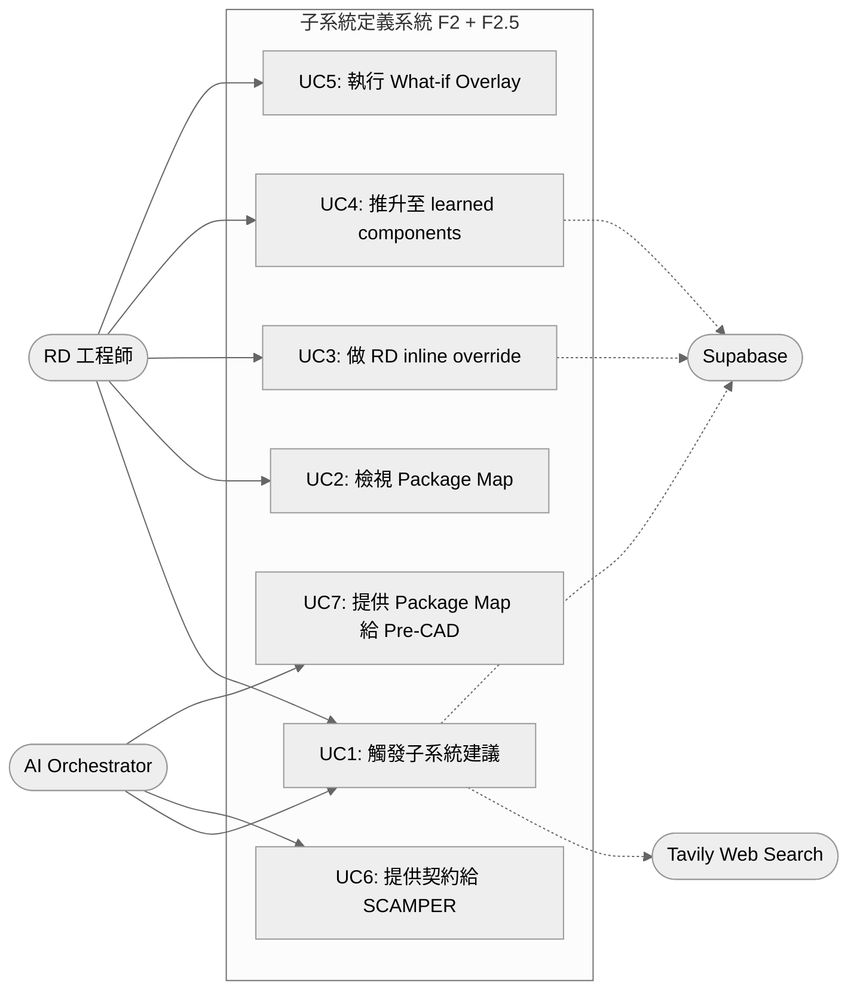


#### 2.3 主要 Use Case 摘要


| ID  | 名稱                 | 主要流程                                                               | 成功條件                                         |
| --- | ------------------ | ------------------------------------------------------------------ | -------------------------------------------- |
| UC1 | 觸發子系統建議            | RD 點 Suggest → Agent 跑 LLM → resolver 覆寫 → validator 算 package map | 回傳含 spatial 的子系統樹 + Package Map              |
| UC2 | 檢視 Package Map     | RD 看 SVG 包絡圖、clash 標示、總質量                                          | 視覺化呈現可指著討論                                   |
| UC3 | RD inline override | RD 對單一 component 寫死 bbox + mass                                    | 寫入 `project_component_overrides`             |
| UC4 | 推升 learned         | RD 確認某估計可信 → 推升至全域表                                                | 寫入 `learned_components`, `confirmed_count++` |
| UC5 | What-if Overlay    | RD 套上假設性車架 envelope 試 trade-off                                    | 回傳 overlay PackageMap，原始不變                   |
| UC6 | 餵 SCAMPER          | F3 讀取結構化介面契約做變形                                                    | 機器可讀的影響範圍                                    |
| UC7 | 餵 Pre-CAD          | 評分階段讀 Package Map 算 spatial_score                                  | Deterministic 評分                             |


---

### §3 Context Diagram（C4 Level 1）

```mermaid
%%{init: {'theme': 'neutral'}}%%
graph TB
    RD([RD 工程師<br/>人類使用者])

    subgraph BoundedContext[Design Copilot 系統邊界]
        F2[正向分析・子系統定義<br/>F2 + F2.5<br/>本文件範圍]
    end

    F1[F1: TRIZ 解矛盾<br/>輸出 LayeredTrizSolution[]<br/>+ differential_analysis]
    F3[F3: SCAMPER 變形<br/>下游：消費介面契約]
    PreCAD[Pre-CAD 五維評分<br/>下游：消費 Package Map]

    Tavily[Tavily Web Search<br/>外部 SaaS]
    Supabase[(Supabase<br/>外部資料庫)]
    LLM[LLM Provider<br/>Claude / GPT]

    RD <--> F2
    F1 -->|LayeredTrizSolution[]<br/>+ Brief| F2
    F2 -->|結構化子系統樹<br/>+ 介面契約 + Package Map| F3
    F2 -->|Package Map<br/>+ spatial 評分| PreCAD
    F2 <-->|datasheet 抓取| Tavily
    F2 <-->|讀寫 artifact| Supabase
    F2 -->|prompt + 規格| LLM
    LLM -->|JSON 回應| F2
```


#### §3.1 F1→F2 契約（與分層 TRIZ 銜接）

F1 與本文件所述 F2 之間的**正式 hand-off** 對齊 `../02-design/specs/triz/E5x--triz-layered-drilldown-optimization.md` §8.1：


| 項目          | 規格                                                                                                                           |
| ----------- | ---------------------------------------------------------------------------------------------------------------------------- |
| **主要輸入**    | `LayeredTrizSolution[]`：每個矛盾一個聚合體，含 L1（TC 現象）/ L2（PC 本質，可缺）/ L3（SF 結構旁路）及 `differential_analysis`                            |
| **Brief**   | 專案任務與邊界敘述（與現行一致）                                                                                                             |
| **F2 預設行為** | 子系統建議與 `related_contradictions` 的**主綁定**預設跟隨 `differential_analysis.recommended_route`；RD 在決策中心採納後以 `adopted_route`（或等價欄位）覆寫 |
| **向後相容**    | 若管線尚未升級，可僅傳「矛盾清單 + 扁平 TRIZ 候選」：視為僅有 L1、無 `deepen_link`；F2 仍須能跑通，但不享有分層訊號                                                     |


**術語區分（必讀）**：本文件 §6.4 的 **System / Module / Component** 是 **F2 子系統樹的階層（tree tier）**，勿與 F1 的 **TC / PC / SF 分析層（phenomenon → essence → structural lens）** 混用。後者在 TRIZ 分層文件中以 L1/L2/L3 表示；本文件之後稱 F2 三階為 **樹階** 或直呼 System/Module/Component，避免與 F1 代號並列時產生歧義。

**與 Phase B**：同矛盾、同一 `LayeredTrizSolution` 內多層解之組合為合法採納；跨矛盾衝突仍依 `triz-to-scamper-flow.md` v11 檢查。F2 的 `related_contradictions` 不將「同 LTS 跨層」當成互斥候選（見 §6.4.4）。

---

### §4 Container Diagram（C4 Level 2）

把系統內部按「可獨立部署 / 可獨立失敗」的單位拆分：

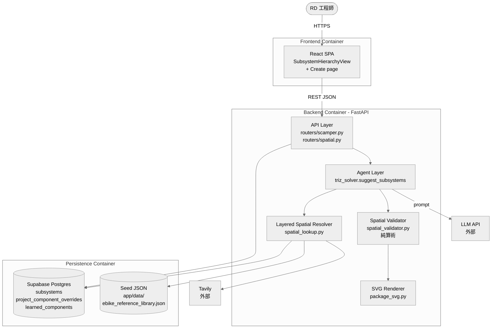


#### 4.1 Container 職責表


| Container         | 技術棧                | 失敗時影響                   | 恢復策略            |
| ----------------- | ------------------ | ----------------------- | --------------- |
| Frontend SPA      | React + TypeScript | 使用者無法觸發；後端不受影響          | 無狀態，重啟即可        |
| Backend API/Agent | FastAPI + Python   | F2 全面停擺；F1/F3 不受影響      | 無狀態，可水平擴展       |
| Layered Resolver  | Python (Backend 內) | 退化到 seed + llm_estimate | 每層獨立 try/except |
| Spatial Validator | Python 純算術         | LLM 結果保留，無 Package Map  | 不影響主流程          |
| Supabase          | Postgres           | 無法持久化，但 in-memory 結果仍可回 | 連線重試            |
| Tavily            | 外部 SaaS            | 退化到 seed + llm_estimate | 超時 fail-fast    |
| LLM Provider      | 外部 API             | F2 無法跑                  | 重試 + 降級提示       |


---

### §5 Component Diagram（C4 Level 3）

聚焦在 Backend Container 內部的職責切分：

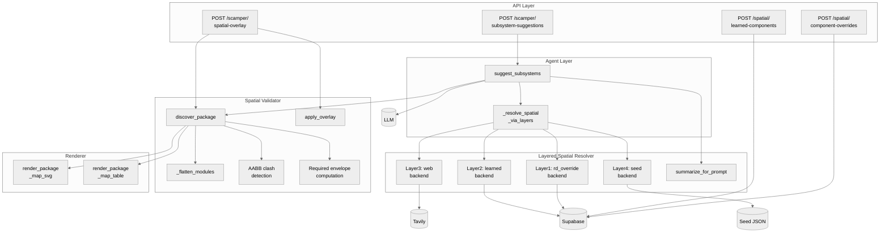


#### 5.1 Component 職責表


| Component                     | 純度  | 是否呼叫 LLM | 是否可獨立測試            |
| ----------------------------- | --- | -------- | ------------------ |
| `suggest_subsystems`          | 編排  | ✅        | 需 mock LLM         |
| `_resolve_spatial_via_layers` | 純函式 | ❌        | ✅ 注入 fake resolver |
| `Resolver L1-L4`              | 純資料 | ❌        | ✅ 各層獨立測試           |
| `discover_package`            | 純算術 | ❌        | ✅ 已有 617 行測試       |
| `apply_overlay`               | 純算術 | ❌        | ✅                  |
| `render_package_map_svg`      | 純函式 | ❌        | ✅ string 比對        |


> **設計原則**：除了 `suggest_subsystems` 必須呼叫 LLM，其他所有 component 都是 pure function，可以在沒有任何外部依賴的情況下單元測試。

---

### §6 資料模型（Data Model）

#### 6.1 核心實體關係

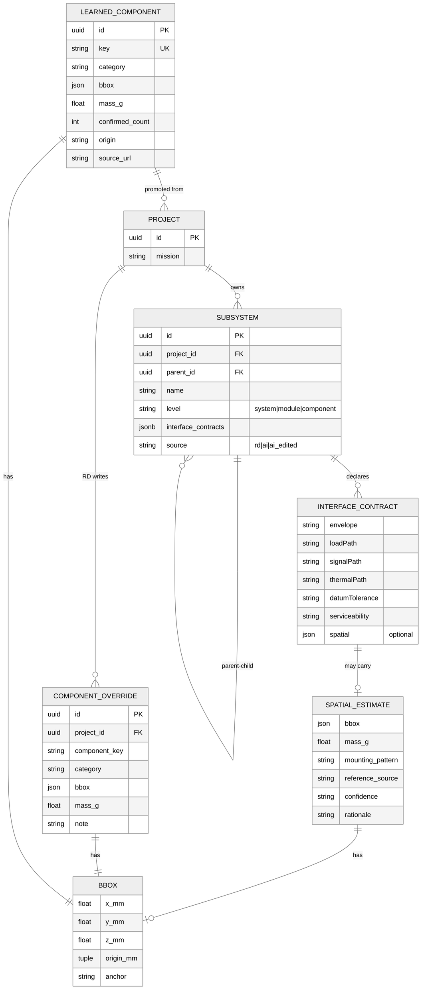


#### 6.2 reference_source 命名空間


| 前綴                  | 來源層                    | 信任度    | 寫入主體     |
| ------------------- | ---------------------- | ------ | -------- |
| `rd_override:<key>` | 本專案 RD inline override | **最高** | RD 手動    |
| `learned:<key>`     | 跨專案 learned component  | 高      | 系統推升     |
| `web:<query>`       | 即時 web lookup          | 中      | LLM 引用觸發 |
| `seed:<key>`        | 手工 backstop JSON       | 中      | 開發者維護    |
| `llm_estimate`      | LLM 自己的數字              | 低      | LLM 兜底   |


#### 6.3 JSON 範例：完整介面契約

```jsonc
{
  "Gearbox": {
    "envelope":       "Ø65mm shaft coupling flange",
    "loadPath":       "80Nm via involute spline",
    "thermalPath":    "Conductive through housing",
    "signalPath":     "3x Hall + thermistor",
    "datumTolerance": "±0.02mm shaft concentricity",
    "serviceability": "Removable without disassembly",
    "spatial": {
      "bbox": { "x_mm": 180, "y_mm": 140, "z_mm": 120, "anchor": "BB_center" },
      "mass_g": 3900,
      "mounting_pattern": "BB_shell_BSA_68mm",
      "reference_source": "learned:bafang_m600_mid_drive",
      "confidence": "library",
      "rationale": "Closest production analogue"
    }
  }
}
```

---

### §6.4 三層樹（System / Module / Component）的定義來源

「三層樹」不是任意分層，而是一個刻意設計的拆解框架，目的是讓 **TRIZ 矛盾、SCAMPER 變形、Pre-CAD 評分** 三個下游階段都有對應的操作粒度。

> **命名提醒**：此處三階為 **F2 子系統樹（tree tier）**，與 F1 `LayeredTrizSolution` 的 TC/PC/SF **分析層**（TRIZ 文件中的 L1/L2/L3）為不同維度；下文圖中子圖標題使用「樹階」以避免與 F1 代號混淆。

#### 6.4.1 為什麼是三層

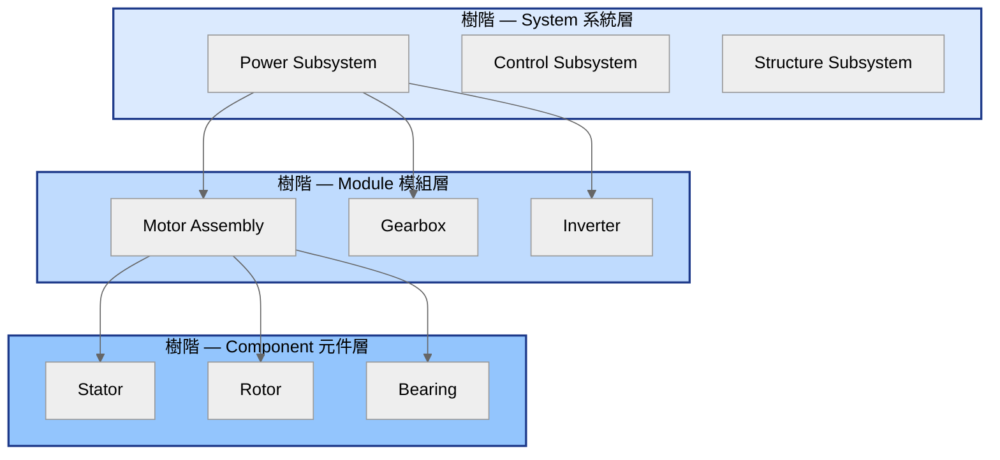


| 層級               | 數量約束              | 對應 TRIZ 角色 | 對應 SCAMPER 操作          | 對應 Pre-CAD 評分      |
| ---------------- | ----------------- | ---------- | ---------------------- | ------------------ |
| **System 系統**    | 2-4 個             | 矛盾分佈的最高觀察層 | 不直接被變形（會牽動全機）          | 整機 envelope 與總質量   |
| **Module 模組**    | 每個 system 下 2-4 個 | 矛盾的承載單位    | **SCAMPER 七動作的主要操作對象** | 模組 bbox 與 clash 偵測 |
| **Component 元件** | 每個 module 下 2-5 個 | 矛盾的根因單位    | 不被 SCAMPER 操作（粒度太細）    | 不單獨評分              |


#### 6.4.2 拆解規則（由 prompt 強制）

定義來源：`backend/app/prompts/triz_solver.py` 的 `SUBSYSTEM_SUGGESTION` prompt instructions 1-3：

```
1. Identify 2–4 system-level subsystems
   (e.g., Power, Control, Structure)
2. Break each system into 2–4 modules
   (e.g., Power → Motor, Gearbox, Inverter)
3. For each module, list 2–5 components
   (e.g., Motor → Stator, Rotor, Bearing)
```

**為什麼是這些上下界**：

- **System 上限 4**：太多 system 會讓矛盾分佈過於分散，TRIZ 收斂困難
- **Module 下限 2**：少於 2 個 module 的 system 沒有「介面契約」可言（沒有鄰居）
- **Module 上限 4**：超過 4 個會讓 SCAMPER 變形組合爆炸（C(7,2) × N²）
- **Component 上限 5**：超過 5 個代表 module 拆得不夠細，應該升級為新 module
- **Component 不參與介面契約**：契約只在 module 層存在，避免層級錯亂

#### 6.4.3 拆解的判斷準則

```mermaid
%%{init: {'theme': 'neutral'}}%%
flowchart TB
    Brief[Brief + F1 產出<br/>LayeredTrizSolution[]<br/>或退化：矛盾清單] --> Q1{是否為<br/>能量轉換 / 控制 / 結構<br/>三大功能群?}
    Q1 -->|是| SYS[標為 system level]
    Q1 -->|否| Q2{是否為<br/>可被 SCAMPER 整體替換的<br/>功能單元?}
    Q2 -->|是| MOD[標為 module level]
    Q2 -->|否| Q3{是否為<br/>無法獨立替換的<br/>實體零件?}
    Q3 -->|是| COMP[標為 component level]
    Q3 -->|否| REJ[拒絕此節點<br/>要求重新拆解]

    style SYS fill:#dbeafe,stroke:#1e3a8a,stroke-width:2px,color:#000
    style MOD fill:#bfdbfe,stroke:#1e3a8a,stroke-width:2px,color:#000
    style COMP fill:#93c5fd,stroke:#1e3a8a,stroke-width:2px,color:#000
    style REJ fill:#fecaca,stroke:#7f1d1d,stroke-width:2px,color:#000
```


#### 6.4.4 與矛盾的綁定

每個節點都帶 `related_contradictions` 欄位，列出與該節點相關的**矛盾 ID**。在分層 TRIZ 管線下，綁定規則對齊 `../02-design/specs/triz/E5x--triz-layered-drilldown-optimization.md` §8.1：

1. **主綁定（給 SCAMPER / 二次矛盾預測用）**：預設僅將節點關聯到 RD 已採納路線（`adopted_route`，若尚未採納則用 `differential_analysis.recommended_route`）上所標示的**承載模組 / 根因元件**。同一 `LayeredTrizSolution` 內未採納的層（例如僅作說明的 L1 折衷解）**不**自動等同於「待變形依據」，避免 Phase B 與 F2 預測誤把 drill-down 堆疊當成互斥多解。
2. **追溯與說明（可選欄位）**：可另存 `related_contradictions_context`（或等價結構）記錄「同矛盾下其餘層曾提及的模組／元件」，僅供 UI 與稽核，不參與預設 SCAMPER 影響範圍計算。
3. **向後相容**：若輸入僅有扁平矛盾清單而無 `LayeredTrizSolution`，`related_contradictions` 維持「該節點曾由舊版 F1 關聯到的矛盾 ID 清單」語意，不區分主綁定與 context。

此設計支援兩個既有目標：

1. **TRIZ 反向追蹤**：給定一個矛盾，能立刻找到所有受影響的 module（與採納路線一致時最精準）。
2. **SCAMPER 影響範圍預測**：對某 module 做變形時，以**主綁定**矛盾預測是否牽動已採納的跨層設計，降低與「同 LTS 跨層合法組合」的語意衝突。

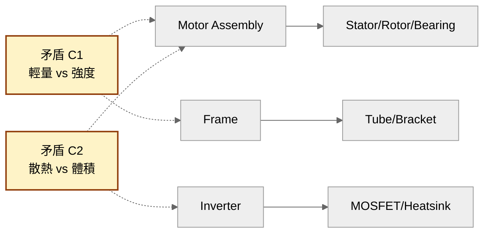


---

### §6.5 六維介面契約的定義來源

「六維」不是隨便挑的，而是窮舉「兩個 module 之間可能發生介面破壞的所有物理通道」的結果。設計目標是 **用最少維度覆蓋所有破壞成因**。

#### 6.5.1 六維對應的物理場

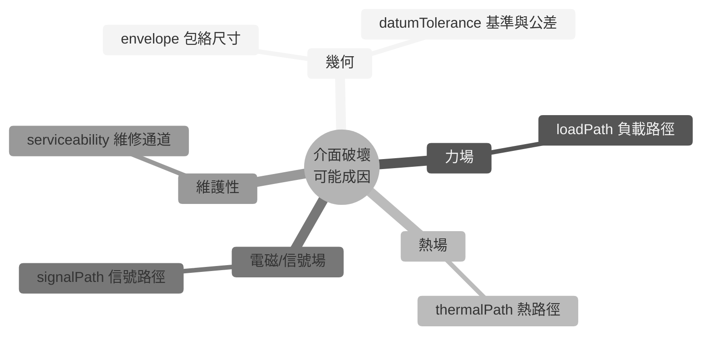


#### 6.5.2 六維定義表


| 維度                 | 物理意義                           | 為什麼要存在                         | 沒有它會發生什麼                 |
| ------------------ | ------------------------------ | ------------------------------ | ------------------------ |
| **envelope**       | 包絡尺寸 / mounting                | 對應 spatial validator 的 bbox 輸入 | CAD 才發現幾何衝突              |
| **loadPath**       | 力 / 力矩 / 電流路徑                  | SCAMPER 替代材料後鄰居承不住負載           | 馬達換 GaN 後峰值電流燒掉 BMS      |
| **signalPath**     | 控制 / 感測 / 通訊（CAN/SPI/I²C/Hall） | 重排控制板後 latency / 雜訊耦合超出容忍      | MCU 與 Gate driver SPI 拍頻 |
| **thermalPath**    | 熱從哪裡進、經過誰、從哪裡出                 | 散熱片被消除後熱流改走 PCB                | 鄰居電容被烤掉                  |
| **datumTolerance** | 基準與公差（datum + tolerance）       | 機械對位錯位會造成裝配良率崩潰                | 馬達軸對齒輪箱同軸度沒講清楚，量產良率崩     |
| **serviceability** | 拆裝順序、可達性、可換件粒度                 | 整機組裝完才發現要換 IMS 必須拆掉外殼+電池       | 維修工時爆炸                   |


#### 6.5.3 為什麼是這六維（不是五、不是七）

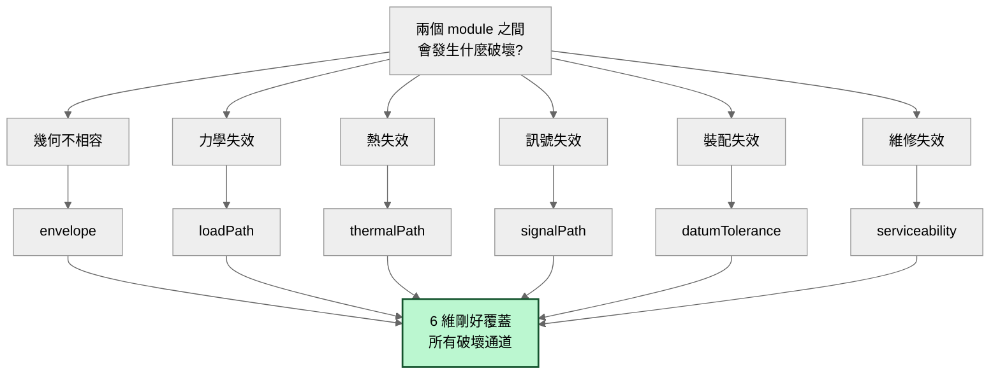


- **不到六維會漏**：例如拿掉 datumTolerance 後，公差問題沒地方寫，量產良率風險被埋藏
- **超過六維會冗**：再分會落入「envelope 細節 / loadPath 細節」等子維度，應該寫在欄位內容而非變新維度
- **每一維對應 TRIZ 物理場**：力場 / 熱場 / 電磁場 / 空間幾何 / 時間（serviceability 隱含維修時序）

#### 6.5.4 六維的綁定對象：「對誰」的契約

介面契約**不是對 module 自身的描述**，而是「**這個 module 對某個鄰居 module 的承諾**」。資料結構是 `Record<鄰居名稱, SixDimContract>`：

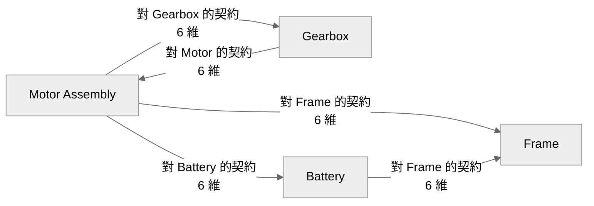


**為什麼一定要綁定對象**：

- 同一個 module 對不同鄰居的契約是不同的（馬達對齒輪箱有 loadPath，對電池只有 signalPath）
- SCAMPER 變形時要知道「替換馬達會破壞它對哪些鄰居的契約」
- 如果只描述自身屬性，下游無法計算影響範圍

#### 6.5.5 六維 + spatial：v10 的擴充

v10 之前六維都是自然語言。v10 在介面契約上掛了一個 optional 的 `spatial` 區塊（見 §6.1 的 JSON 範例），目的是把「envelope 自然語言描述」與「機器可讀的 bbox + mass」對應起來：

```
envelope:  "Ø65mm shaft coupling flange"   ← 給人讀
spatial:   { bbox: {x:180, y:140, z:120}, mass_g: 3900 }  ← 給機器算
```

兩者並存，**自然語言給 RD 與 LLM 互相理解，結構化資料給 validator 算 clash 與 envelope**。

---

### §7 Sequence Diagrams

#### 7.1 主流程：UC1 觸發子系統建議

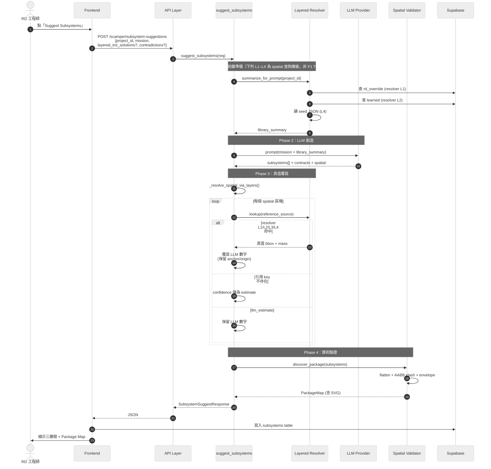


#### 7.2 UC3：RD inline override

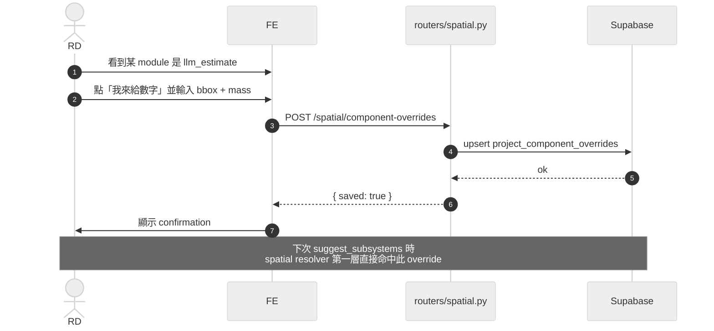


#### 7.3 UC4：推升至 learned components

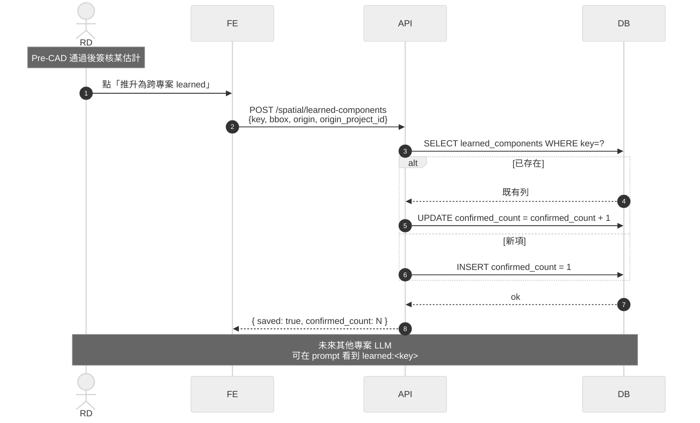


#### 7.4 UC5：What-if Overlay

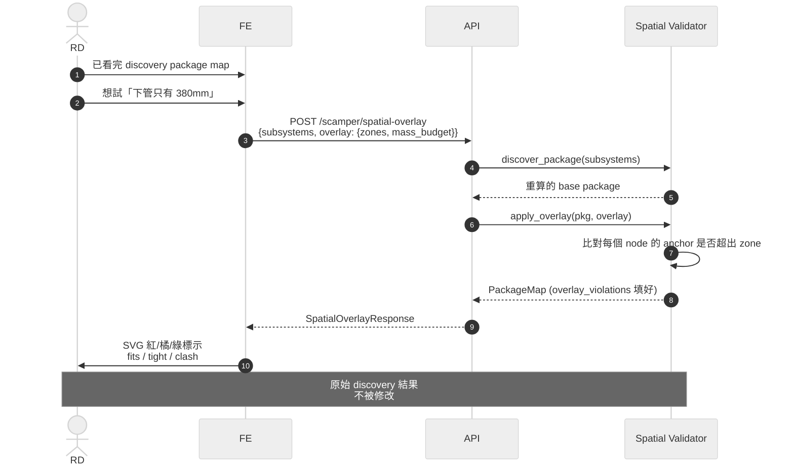


---

### §8 State Machine

#### 8.1 子系統 Artifact 狀態流轉

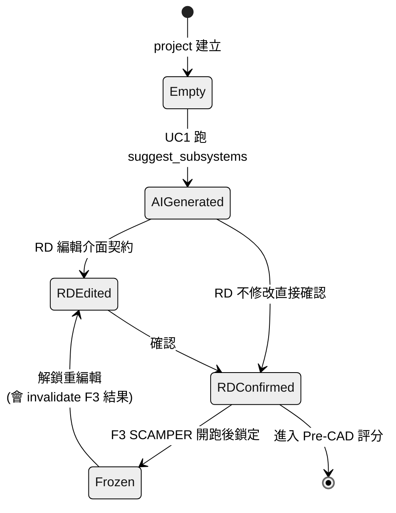


#### 8.2 SpatialEstimate confidence 流轉

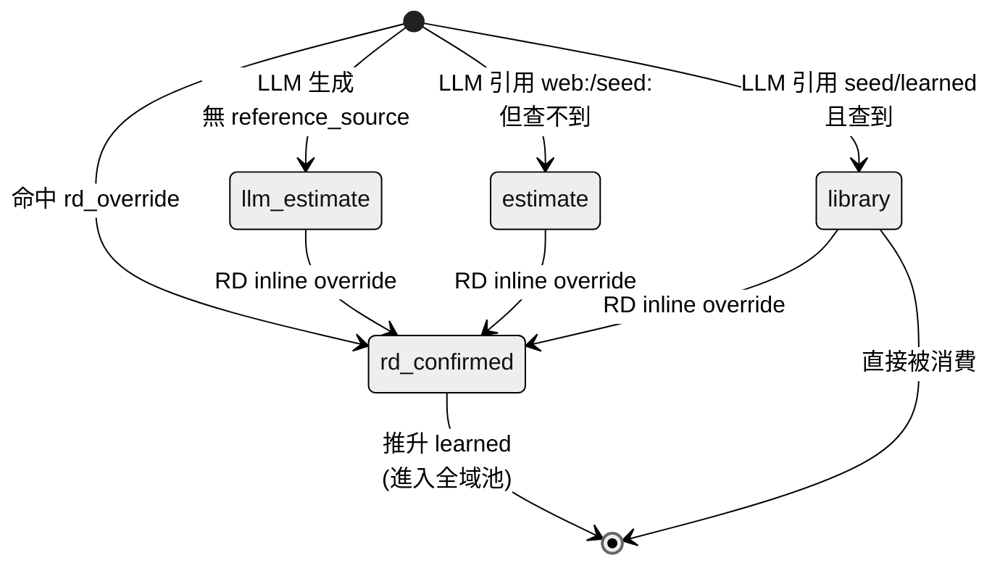


#### 8.3 LearnedComponent 累積週期

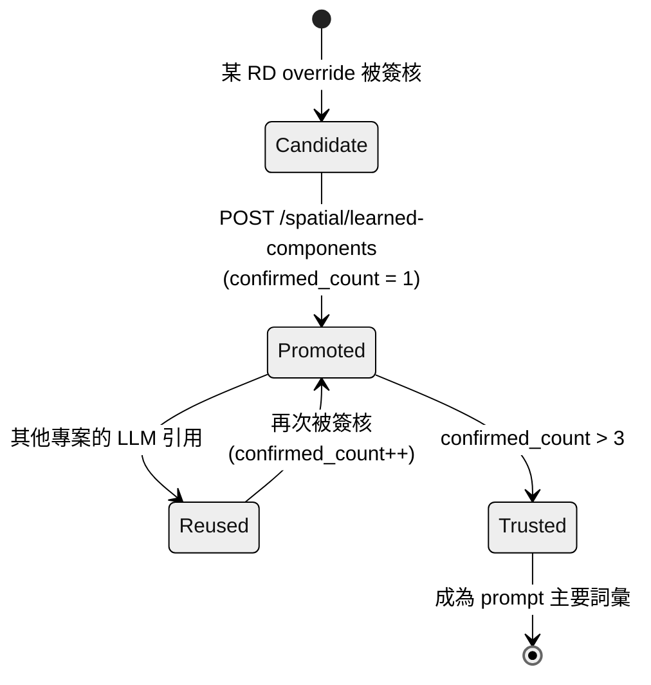


---

### §9 資料準確性與冷啟動策略

#### 9.1 五道防線（Defence-in-Depth）

```mermaid
%%{init: {'theme': 'neutral'}}%%
flowchart LR
    LLM[LLM 產出] --> D1[D1 Prompt 詞彙注入<br/>summarize_for_prompt]
    D1 --> D2[D2 後處理覆寫<br/>真值覆寫 LLM 數字]
    D2 --> D3[D3 引用查不到<br/>降級 confidence]
    D3 --> D4[D4 anchor origin 保留<br/>零件 vs 擺放分離]
    D4 --> D5[D5 算術驗證<br/>AABB clash + 質量加總]
    D5 --> OUT[可信輸出]

    style D1 fill:#e0f2fe,stroke:#0c4a6e,stroke-width:2px,color:#000
    style D2 fill:#bae6fd,stroke:#0c4a6e,stroke-width:2px,color:#000
    style D3 fill:#7dd3fc,stroke:#0c4a6e,stroke-width:2px,color:#000
    style D4 fill:#38bdf8,stroke:#0c4a6e,stroke-width:2px,color:#000
    style D5 fill:#0ea5e9,stroke:#0c4a6e,stroke-width:2px,color:#fff
```


| 防線             | 處理什麼                                            |
| -------------- | ----------------------------------------------- |
| D1 Prompt 詞彙注入 | LLM 知道有哪些 key 可引用，減少編造                          |
| D2 後處理覆寫       | LLM 引用 `seed:/learned:/rd_override:/web:` 都會被換掉 |
| D3 引用降級        | 防止 LLM 引用幻覺 key 卻保留高 confidence                 |
| D4 anchor 保留   | 零件本身 = 事實；擺放位置 = 設計選擇                           |
| D5 算術驗證        | 即使數字準確，組合能否共存仍要算                                |


#### 9.2 冷啟動五層退化保證

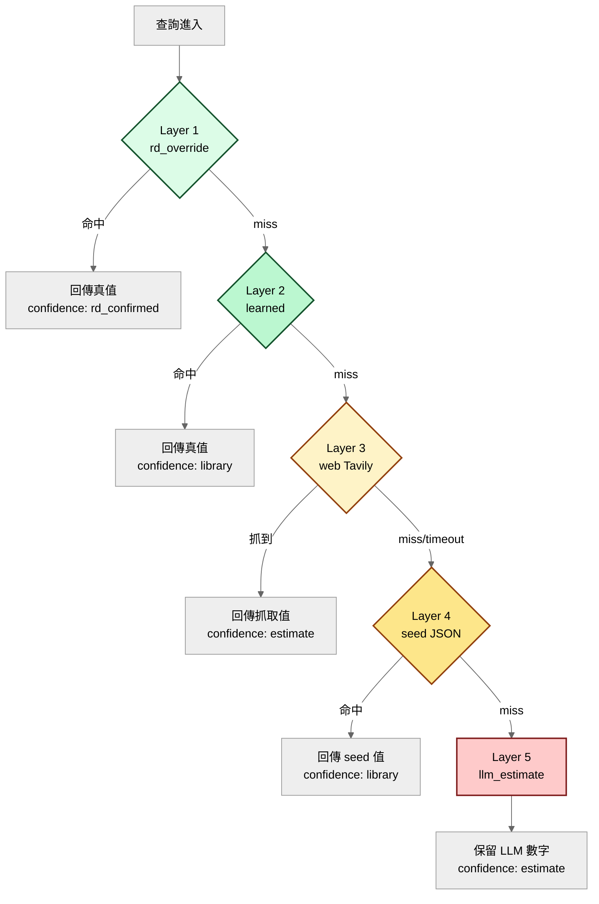


**冷啟動保證**：即使 L1-L4 全部 miss，系統仍然回傳結果（L5 兜底），confidence 標為 estimate。RD 看到低 confidence 即知道要 override。

#### 9.3 冷→熱遷移時間軸

```mermaid
%%{init: {'theme': 'neutral'}}%%
gantt
    title 資料庫從冷啟動到自我維護的演化
    dateFormat YYYY-MM-DD
    axisFormat %m月

    section Day 0
    全靠 seed + web + llm_estimate           :a1, 2026-04-08, 7d
    confidence 普遍 estimate                  :a2, after a1, 14d
    RD 大量 inline override                   :a3, after a1, 21d

    section Month 1
    learned 表累積 ~50 條                     :b1, 2026-05-08, 30d
    80% 常見元件查得到                         :b2, after b1, 30d
    confidence 普遍 library                   :b3, after b1, 30d

    section Month 6
    learned 表累積 ~300 條                    :c1, 2026-10-08, 60d
    seed JSON 幾乎不再被命中                   :c2, after c1, 60d
    web lookup 只在新元件出現時觸發             :c3, after c1, 60d

    section Year 1+
    learned + rd_override 主導                :d1, 2027-04-08, 90d
    seed JSON 可開始 archive                  :d2, after d1, 90d
    系統進入自我維護狀態                        :d3, after d1, 90d
```


---

### §10 對下游 SCAMPER 的契約

#### 10.1 F2 → F3 hand-off 三件套

```mermaid
%%{init: {'theme': 'neutral'}}%%
graph LR
    F2[F2 + F2.5<br/>子系統定義] --> A[結構化子系統樹<br/>System/Module/Component]
    F2 --> B[機器可讀介面契約<br/>6 維 + spatial]
    F2 --> C[Package Map 基線<br/>SVG + clash + envelope]

    A --> F3[F3 SCAMPER 變形]
    B --> F3
    C --> F3

    F3 --> D[新 module 組合]
    F3 --> E[新介面契約]
    F3 --> Cmp[與基線對比]

    style F2 fill:#dbeafe,stroke:#1e3a8a,stroke-width:2px,color:#000
    style F3 fill:#fef3c7,stroke:#92400e,stroke-width:2px,color:#000
```


| Hand-off 物件    | SCAMPER 如何使用                                               |
| -------------- | ---------------------------------------------------------- |
| 結構化子系統樹        | 7 個變形動作的操作對象（哪個 module 被 substitute / combine / eliminate） |
| 6 維介面契約        | 變形後判斷哪些 path 被破壞、產生哪些二次矛盾                                  |
| Package Map 基線 | 變形後重算 package map，與基線對比決定是否更好                              |


#### 10.2 為什麼介面契約不能只有自然語言

```mermaid
%%{init: {'theme': 'neutral'}}%%
graph TB
    Bad[只有自然語言契約] --> B1[SCAMPER 替換 module 後<br/>無法計算對鄰居影響]
    Bad --> B2[二次矛盾無法被機器偵測]
    Bad --> B3[Pre-CAD 評分變成 LLM 拍腦袋]

    Good[結構化 6 維 + spatial] --> G1[替換後可計算 path 破壞]
    Good --> G2[二次矛盾可被算術偵測]
    Good --> G3[Pre-CAD 評分可被算術產出]

    style Bad fill:#fecaca,stroke:#7f1d1d,stroke-width:2px,color:#000
    style Good fill:#bbf7d0,stroke:#14532d,stroke-width:2px,color:#000
```


---

### §11 部署視角（Deployment）

```mermaid
%%{init: {'theme': 'neutral'}}%%
graph TB
    subgraph Browser[使用者瀏覽器]
        SPA[React SPA<br/>Static 部署]
    end

    subgraph Cloud[Backend 部署環境]
        FA[FastAPI 容器<br/>水平可擴展]
    end

    subgraph SaaS[外部 SaaS]
        SBSaaS[Supabase<br/>託管 Postgres]
        TavSaaS[Tavily Search API]
        LLMSaaS[Claude / GPT API]
    end

    Browser -->|HTTPS| Cloud
    Cloud -->|HTTPS| SBSaaS
    Cloud -->|HTTPS| TavSaaS
    Cloud -->|HTTPS| LLMSaaS
```


#### 11.1 部署單元


| 部署單元              | 狀態              | 擴展策略         |
| ----------------- | --------------- | ------------ |
| React SPA         | 無狀態             | CDN          |
| FastAPI Backend   | 無狀態             | 水平擴展         |
| Spatial Validator | 內嵌於 Backend     | 隨 Backend 擴展 |
| Resolver          | 內嵌於 Backend     | 隨 Backend 擴展 |
| Supabase          | 託管              | 由 SaaS 處理    |
| Seed JSON         | 隨 Backend image | 重 deploy 更新  |


---

### §12 風險、限制、迭代方向

#### 12.1 已知風險

```mermaid
%%{init: {'theme': 'neutral'}}%%
mindmap
  root((已知風險))
    技術
      AABB clash 過於粗略
      anchor 命名靠約定
      web regex 提取脆弱
    資料
      learned 表同零件不同名稱
      LLM 引用幻覺 key
      seed 過時但仍被命中
    流程
      RD 不主動 override
      confirmed_count 不代表正確
      冷啟動初期信任度低
    營運
      Tavily quota 用罄
      LLM API 變動
      Supabase 連線斷
```


#### 12.2 後續迭代方向


| 方向                               | 動機                                                        | 優先級 |
| -------------------------------- | --------------------------------------------------------- | --- |
| Learned component fuzzy dedup    | 解決同零件不同名稱碎片化                                              | 高   |
| Anchor coordinate system         | 把字串 anchor 改為車架坐標系                                        | 中   |
| Confidence-aware Pre-CAD scoring | 全 llm_estimate 的 5 分 vs 全 learned 的 5 分應該不同               | 中   |
| 跨專案 spatial 對比                   | 發現業界平均下管長度等模式                                             | 低   |
| CAD 回灌                           | RD 完成 CAD 後把實際 bbox 寫回 learned，confidence 升為 cad_verified | 高   |
| OBB / 簡化網格 clash                 | 取代粗略 AABB                                                 | 低   |


#### 12.3 資料迴圈閉合方向

```mermaid
%%{init: {'theme': 'neutral'}}%%
flowchart LR
    A[F2 子系統定義] --> B[F3 SCAMPER 變形]
    B --> C[Pre-CAD 評分]
    C --> D[RD 簽核]
    D --> E[實際 CAD 設計]
    E --> F[實際 bbox 量測]
    F -.->|未來：CAD 回灌| G[learned_components]
    G -.->|被未來專案查詢| A

    style F fill:#fde68a,stroke:#92400e,stroke-width:2px,color:#000
    style G fill:#bbf7d0,stroke:#14532d,stroke-width:2px,color:#000
```


---

### §13 摘要表：本架構解決什麼


| 問題             | 解法                                  | 章節      |
| -------------- | ----------------------------------- | ------- |
| LLM 數字是想像      | Layered resolver + 後處理覆寫            | §5 §9.1 |
| 介面契約只有自然語言     | spatial 區塊 + Package Map            | §6 §10  |
| 沒有資料累積         | learned_components + RD override 推升 | §6 §8.3 |
| 冷啟動沒資料         | 五層退化保證 + seed backstop              | §9.2    |
| Pre-CAD 評分拍腦袋  | validator 算術接管                      | §10     |
| 預算上限限制創意       | discovery 與 overlay 分離              | §7.4    |
| Validator 失敗會炸 | try/except + 永遠回傳                   | §4.1 §5 |
| SCAMPER 無法機器驗證 | 結構化契約 + 基線對比                        | §10     |


---

### §14 對齊既有 E2E 文件


| 文件                                                                         | 對齊點                                                      |
| -------------------------------------------------------------------------- | -------------------------------------------------------- |
| `E3--ai-agent-detailed-design.md` v1.4                                     | TRIZ Solver Agent 的「子系統拆解（三層階層）」職責即本文件 §5                |
| `_domain-knowledge/DK-01--design-philosophy-and-process.md` v1.6           | 本文件補充 F2.5 作為 F2 的後置子步                                   |
| `E3--appendices-sa-perspectives.md` Appendix D v1.6                        | 子系統 Artifact 狀態機見本文件 §8.1                                |
| `E3--appendices-sa-perspectives.md` Appendix E v11                         | 本文件是該流程圖的 SA 視角文字化；F1 分層輸出與 Phase B 規則見該檔 v11 摘要         |
| `../02-design/specs/triz/E5x--triz-layered-drilldown-optimization.md` v1.0 | F1→F2 hand-off、`LayeredTrizSolution` 與本文件 §3.1、§6.4.4 對齊 |
| `../_domain-knowledge/DK-01--design-philosophy-and-process.md` §Step P     | spatial_score 算術化，見本文件 §10                               |


---

**主要實作檔案索引**：

- `backend/app/agents/triz_solver.py` (suggest_subsystems + _resolve_spatial_via_layers)
- `backend/app/services/spatial_validator.py` (純算術核心)
- `backend/app/services/spatial_lookup.py` (Layered resolver)
- `backend/app/services/reference_library.py` (seed 層)
- `backend/app/services/package_svg.py` (SVG 渲染)
- `backend/app/routers/spatial.py` (RD override + learned 推升 API)
- `backend/app/routers/scamper.py` (主入口 + overlay 端點)
- `backend/app/models/schemas.py` (BBox / SpatialEstimate / PackageMap / ...)
- `supabase/migrations/006_spatial_estimate.sql`
- `supabase/migrations/007_learned_components.sql`
- `src/components/create/SubsystemHierarchyView.tsx` (FE 顯示)
- `backend/tests/test_spatial_validator.py` (617 行測試)

---

## Appendix B: Forward TRIZ Solver Architecture

> 2026-04-15 更新：依 [ADR-007](adrs/ADR-007-tc-only-explore-pc-sf-derivation-in-create.md)，Explore 階段限縮為 TC-only；PC/SF 於 Create 階段自 TC 派生。詳見下方「TC-Only Contract（ADR-007）」段。

> 錨點：`#appendix-b-forward-triz-solver-architecture`

### §B.0 TC-Only Contract（ADR-007, 2026-04-15）

依 [ADR-007](adrs/ADR-007-tc-only-explore-pc-sf-derivation-in-create.md)，Explore 與 Create 兩階段的矛盾處理契約調整如下：

#### formalize_contradiction 新合約


| 方向                   | 合約                                                                                        |
| -------------------- | ----------------------------------------------------------------------------------------- |
| **Input**            | 自然語言矛盾敘述（`ContradictionFormalizeRequest.natural_description`）                             |
| **Output (success)** | `type="TC"` + `improving_param` ∈ [1,39] + `worsening_param` ∈ [1,39] + `rationale`（非空說明） |
| **Output (reject)**  | `type=null` + `rationale`（解釋為何無法映射到 39 參數，並建議 Socratic 追問方向）                              |
| **移除**               | PC 降級分支、SF 分類分支 — Explore 不再輸出 PC/SF                                                      |


> 新寫入強制 TC-only；歷史資料 row 仍可讀取。

#### solve_triz_layered 入口派生流程

```mermaid
%%{init: {'theme': 'neutral'}}%%
flowchart TD
    REQ[SolveTrizLayeredRequest<br/>可能僅帶 TC 欄位] --> CHK{PC / SF 欄位<br/>是否缺失?}
    CHK -->|PC 缺| DPC[analyst.decompose_tc_to_pcs<br/>產生 PC 列表]
    CHK -->|SF 缺| DSF[analyst.derive_su_field_from_tc<br/>產生 S1/S2/F]
    CHK -->|皆齊| SKIP[跳過派生]
    DPC --> L12
    DSF --> L3D
    SKIP --> L12
    L12[L1 surface + L2 root cause] --> OUT
    L3D[L3 Su-Field 旁路<br/>派生失敗則 warn + 降級] --> OUT
    OUT[LayeredTrizSolution]
```


**規則**：

1. 派生產物**不回寫** `contradictions` 表（避免污染 Explore source of truth），僅於本次 response 帶回。
2. `derive_su_field_from_tc` 失敗（LLM 無法推出有意義 S1/S2/F）→ L3 以 warning 降級，L1/L2 不受影響。
3. 前端 `Create.tsx` 移除 `cType === 'TC'` 互斥閘門，`improving/worsening_param` 無條件傳出。

### §B.0.1 OZ-OT / SIM / CCI 擴充合約（ADR-008, 2026-04-27）

> 以下擴充項由 ADR-008 Auto-TRIZ v2 Closed-Loop Integration 引入，補充 §B.0 TC-Only 合約。

**OZ-OT 作為 L2 前置條件**

`solve_triz_layered()` 進入 L2 Root Cause 前，**必須**先完成 OZ-OT 分析並鎖定 Px 物理變數。流程：

1. Analyst Agent 呼叫 `oz_ot_analysis(contradiction_id)` → 產出 `OzOtResult { oz_zone, ot_time, px_variable }`
2. `OzOtResult.px_variable` 回寫至 `contradictions` 表（`oz_zone`, `ot_time`, `px_variable` 三欄）
3. L2 `_solve_pc()` 接收 Px 做為分離原理搜尋的錨點 → 比純 TC 翻譯更精準
4. Px 鎖定失敗時提供 3 種回退策略：`broaden_oz`（放寬操作空間）、`split_tc`（拆分矛盾）、`reframe`（重新框架問題）

**SIM 矩陣（多 TC 場景）**

當專案含 ≥2 條已正式化的 TC 時，自動觸發 SIM 矩陣評估：

1. TRIZ Solver Agent 呼叫 `sim_matrix(contradiction_ids)` → 產出 `SimMatrixResult { matrix, conflict_pairs, optimal_combination }`
2. 矩陣每格為 +1（互利）/ 0（無關）/ -1（衝突）
3. -1 交互升級為新 TC，回流至 Step 3（≤2 輪收斂）
4. 結果持久化至 `sim_matrices` 表

**CCI 複雜度檢查（取代二元 Evolution/Patch）**

`complexity_check()` 在方案候選確認後執行：

1. 四維計算：組件數變化 / 能耗變化 / 認知負荷 / 演化趨勢對齊度
2. CCI ∈ [0, 1]：≤0.3 Evolution / 0.3-0.6 Weak Evolution / >0.6 Patch
3. Patch 不阻塞出貨，但必須記錄技術債
4. 結果持久化至方案的 `complexity_check_result` 欄位

**Evidence Registry（跨層服務）**

所有 Agent 的 LLM 數值聲明必須透過 `EvidenceRegistryService.register_claim()` 註冊：

1. 自動 Tavily WebSearch 驗證 → 標記 VERIFIED / APPROXIMATE / UNVERIFIED
2. Gate P 退出條件：Evidence Coverage（VERIFIED + APPROXIMATE 佔比）≥ 40%

## 正向分析・TRIZ 解矛盾：系統架構說明書（SA 視角）

> **觀點**：Systems Analyst
> **相關文件**：`E3--ai-agent-detailed-design.md`、`_domain-knowledge/DK-01--design-philosophy-and-process.md`、`../02-design/specs/triz/E5x--triz-layered-drilldown-optimization.md`、`../04-deliver/operations/TRIZ_Layered_Rollout_Runbook.md`
> **文件目的**：以 SA 視角拆解「正向分析・TRIZ 解矛盾」階段（F1）的所有架構面向。F1 是正向路徑的第一站，輸入為 Step 3 識別出的矛盾，輸出為**同一矛盾的分層 drill-down 診斷**（L1 現象 / L2 本質 / L3 結構），聚合為 `LayeredTrizSolution[]` 供下游 F2 子系統定義消費。每張圖以 Mermaid 呈現。

---

### §0 文件導讀


| 章節  | 觀點                  | 回答的問題                                   |
| --- | ------------------- | --------------------------------------- |
| §1  | 業務情境                | 為什麼 TRIZ 解矛盾這個階段存在？                     |
| §2  | Actors & Use Cases  | 誰在用？做什麼事？                               |
| §3  | Context Diagram     | 系統與外部世界的邊界？                             |
| §4  | Container Diagram   | 內部由哪些可獨立部署元件組成？                         |
| §5  | Component Diagram   | 三條 solver 路徑的內部切分？                      |
| §6  | Data Model + 三條路徑定義 | TC / PC / SF 怎麼被定義？                     |
| §7  | Sequence Diagrams   | 三條路徑的執行時序？                              |
| §8  | State Machine       | 矛盾與建議的生命週期？                             |
| §9  | 知識庫注入策略             | 如何在 LLM context window 限制下注入完整 TRIZ KB？ |
| §10 | 對下游 F2 的契約          | 給 F2 子系統定義什麼？                           |
| §11 | 部署視角                | 部署單元與失敗影響？                              |
| §12 | 風險、限制、迭代方向          | 已知邊界？                                   |


---

### §1 業務情境（Business Context）

#### 1.1 問題陳述

E-bike RD 在面對「輕量 vs 強度」「散熱 vs 體積」「成本 vs 效能」這類工程矛盾時，傳統作法是憑直覺選一個折衷點，或在 CAD 階段才發現另一邊崩掉。TRIZ（俄文 Теория Решения Изобретательских Задач, Theory of Inventive Problem Solving）提供了一套形式化方法把這些矛盾抽象成 **39 個工程參數的衝突**，再用 **40 個發明原理**、**4 個分離原則**、或 **76 個標準解** 給出對應的破解方向。

但 TRIZ 知識庫有兩個落地痛點：


| 痛點                                               | 後果                                                           |
| ------------------------------------------------ | ------------------------------------------------------------ |
| 知識庫太大（39 參數 + 40 原理 + 76 標準解 + 矩陣）≈ 6 萬字         | 全部塞進 LLM prompt 會超出 context 預算                               |
| 三類矛盾（TC/PC/SF）的處理機制不同，但 user 往往講「我有個矛盾」就希望系統自己分流 | Explore 已改為 TC-only（ADR-007）；PC/SF 於 Create 階段自 TC 派生，見 §B.0 |


#### 1.2 系統使命

> **建立一個「規則引擎做精準查表 + LLM 做原理具體化 + 知識庫按需注入」的 TRIZ Solver，對同一矛盾同時提供現象層（TC）、本質層（PC）、結構層（SF）的 drill-down 建議組合，輸出為 `LayeredTrizSolution`，讓 RD 收到的不是單一表面解法，而是「表象 → 根因 → 結構旁證」的遞進式診斷報告。**

**v1.1 關鍵轉變**：TC / PC / SF 不再是互斥的分類標籤，而是**同一矛盾的三層視角**。TC 是現象、PC 是核心、SF 是結構 — 這不是選擇題，是診斷報告的三層。完整論述見 `../02-design/specs/triz/E5x--triz-layered-drilldown-optimization.md`。

#### 1.3 三個關鍵約束

```mermaid
%%{init: {'theme': 'neutral'}}%%
mindmap
  root((TRIZ 解矛盾系統))
    分層 drill-down
      L1 TC 現象層必跑
      L2 PC 本質層有條件觸發
      L3 SF 結構層必跑平行旁路
      以 LayeredTrizSolution 聚合輸出
    知識注入
      KB 6 萬字無法全塞 prompt
      需 RAG 風格按需抽取
      矩陣 lookup 用程式而非 LLM
    跨域具體化
      TRIZ 原理是抽象的
      LLM 負責把抽象原理對應到 e-bike 場景
      至少一個必須跨域
```


---

### §2 Actors & Use Cases

#### 2.1 Actor 識別


| Actor                   | 類型              | 與系統的關係                                         |
| ----------------------- | --------------- | ---------------------------------------------- |
| **RD 工程師**              | 主要人類 actor      | 在矛盾識別頁面標記矛盾類型、檢視 TRIZ 建議、選擇採用                  |
| **AI Orchestrator**     | 系統內 actor       | 在 E2E 流程中銜接 Step 3（矛盾識別）與 F2（子系統定義）            |
| **Analyst Agent**       | 系統內上游 LLM actor | 把自然語言矛盾形式化為 TC/PC/SF 並標記參數                     |
| **TRIZ Solver Agent**   | 系統內 LLM actor   | 把抽象原理具體化為工程建議                                  |
| **TRIZ Knowledge Base** | 系統內靜態資源         | 39 參數 / 矩陣 / 40 原理 / 分離原則 / 76 標準解（5 份 MD）     |
| **下游消費者：F2 子系統定義**      | 系統內 actor       | 消費 affected_modules 與 secondary_contradictions |
| **下游消費者：候選方案決策中心**      | 系統內 actor       | 把每條建議當成候選方案                                    |


#### 2.2 Use Case Diagram

```mermaid
%%{init: {'theme': 'neutral'}}%%
graph LR
    RD([RD 工程師])
    Orch([AI Orchestrator])

    subgraph SYS[TRIZ 解矛盾系統 F1]
        UC1[UC1: 觸發 TC 解矛盾]
        UC2[UC2: 觸發 PC 解矛盾]
        UC3[UC3: 觸發 SF 解矛盾]
        UC4[UC4: 檢視候選原理]
        UC5[UC5: 採用建議]
        UC6[UC6: 提供建議給 F2]
    end

    RD --> UC1
    RD --> UC2
    RD --> UC3
    RD --> UC4
    RD --> UC5
    Orch --> UC1
    Orch --> UC2
    Orch --> UC3
    Orch --> UC6

    KB([TRIZ KB Markdown])
    LLM([LLM Provider])
    UC1 -.-> KB
    UC2 -.-> KB
    UC3 -.-> KB
    UC1 -.-> LLM
    UC2 -.-> LLM
    UC3 -.-> LLM
```


#### 2.3 主要 Use Case 摘要


| ID  | 名稱     | 主要流程                                             | 成功條件                |
| --- | ------ | ------------------------------------------------ | ------------------- |
| UC1 | TC 解矛盾 | 用 (improving, worsening) 查矩陣 → 過濾候選原理 → LLM 具體化  | 至少 3 條建議，至少 1 條跨域   |
| UC2 | PC 解矛盾 | 用 separation_type 過濾原理子集 → LLM 套分離原則             | 每條建議引用物理定律          |
| UC3 | SF 解矛盾 | 從 system_state 推導相關 Class → 注入子集 → LLM 套標準解      | 每條建議標 standard_id   |
| UC4 | 檢視候選原理 | RD 看 candidate_principles 與 suggestions          | 視覺化顯示可指著討論          |
| UC5 | 採用建議   | RD 把某條建議標 adopted → 進入候選池                        | 寫入 triz_solutions 表 |
| UC6 | 餵 F2   | F2 讀 affected_modules + secondary_contradictions | 結構化交付給子系統定義         |


---

### §3 Context Diagram（C4 Level 1）

```mermaid
%%{init: {'theme': 'neutral'}}%%
graph TB
    RD([RD 工程師<br/>人類使用者])

    subgraph BoundedContext[Design Copilot 系統邊界]
        F1[正向分析・TRIZ 解矛盾<br/>F1<br/>本文件範圍]
    end

    Step3[Step 3: 矛盾識別<br/>上游：提供 TC 矛盾 ADR-007<br/>PC/SF 於 F1 入口派生]
    F2[F2: 子系統定義<br/>下游：消費建議與 affected_modules]
    Hub[候選方案決策中心<br/>下游：每條建議成為候選]

    KB[(TRIZ Knowledge Base<br/>5 份 Markdown 檔)]
    LLM[LLM Provider<br/>Claude / GPT]
    Supabase[(Supabase<br/>外部資料庫)]

    RD <--> F1
    Step3 -->|TC 矛盾 + improving/worsening_param<br/>ADR-007: PC/SF 於 F1 入口派生| F1
    F1 -->|TrizSuggestion 清單<br/>+ affected_modules| F2
    F1 -->|每條建議成為候選| Hub
    F1 <-->|讀取 KB Markdown| KB
    F1 -->|prompt + KB 子集| LLM
    LLM -->|JSON 回應| F1
    F1 <-->|寫入 triz_solutions| Supabase
```


---

### §4 Container Diagram（C4 Level 2）

```mermaid
%%{init: {'theme': 'neutral'}}%%
graph TB
    RD([RD 工程師])

    subgraph Frontend[Frontend Container]
        FE[React SPA<br/>矛盾識別頁面<br/>+ TRIZ 建議檢視]
    end

    subgraph Backend[Backend Container - FastAPI]
        API[API Layer<br/>routers/triz.py]
        AGENT[Agent Layer<br/>triz_solver.py<br/>solve_triz dispatcher]
        TC[TC Solver<br/>_solve_tc]
        PC[PC Solver<br/>_solve_pc]
        SF[SF Solver<br/>_solve_sf<br/>analyze_sufield]
        TOOLS[KB Tools<br/>tools/triz_kb.py]
    end

    subgraph KB[TRIZ Knowledge Base - Static MD]
        K1[01_39_parameters.md]
        K2[02_contradiction_matrix.md]
        K3[03_40_principles.md]
        K4[04_separation_principles.md]
        K5[05_76_standard_solutions.md]
    end

    LLM[LLM API<br/>外部]
    DB[(Supabase Postgres<br/>triz_solutions)]

    RD -->|HTTPS| FE
    FE -->|REST JSON| API
    API --> AGENT
    AGENT --> TC
    AGENT --> PC
    AGENT --> SF
    TC --> TOOLS
    PC --> TOOLS
    SF --> TOOLS
    TOOLS --> KB
    TC -->|prompt + KB 子集| LLM
    PC -->|prompt + KB 子集| LLM
    SF -->|prompt + KB 子集| LLM
    API --> DB
```


#### 4.1 Container 職責表


| Container         | 技術棧                | 失敗時影響                      | 恢復策略               |
| ----------------- | ------------------ | -------------------------- | ------------------ |
| Frontend SPA      | React + TypeScript | RD 無法觸發；後端不受影響             | 無狀態，重啟即可           |
| Backend API/Agent | FastAPI + Python   | F1 全面停擺；Step 3 與 F2 不受影響   | 無狀態，可水平擴展          |
| KB Tools          | Python + lru_cache | 無法注入 KB；solver 退化為純 LLM 直答 | 啟動時即載入並快取          |
| TRIZ KB MD        | 靜態檔案               | 同上                         | 隨 Backend image 部署 |
| LLM Provider      | 外部 API             | 三條 solver 全部無法跑            | 重試 + 降級提示          |
| Supabase          | Postgres           | 無法持久化建議，但 in-memory 結果仍可回  | 連線重試               |


---

### §5 Component Diagram（C4 Level 3）

聚焦在 Backend Container 內部的職責切分：

```mermaid
%%{init: {'theme': 'neutral'}}%%
graph TB
    subgraph API[API Layer]
        R1[POST /triz/solve]
        R2[POST /triz/sufield]
    end

    subgraph Dispatcher[Dispatcher Layer]
        SOLVE[solve_triz<br/>type 路由]
    end

    subgraph Solvers[Three Solver Paths]
        TC[_solve_tc<br/>TC 路徑]
        PC[_solve_pc<br/>PC 路徑]
        SF[_solve_sf<br/>SF 路徑]
        SFA[analyze_sufield<br/>SF 共用]
    end

    subgraph KBT[KB Tools - 純算術 + 字串處理]
        LM[lookup_matrix<br/>矩陣查表]
        BTC[build_triz_tc_context<br/>TC 上下文]
        BPC[build_triz_pc_context<br/>PC 上下文]
        BSF[build_sufield_context<br/>SF 上下文]
        EX1[_extract_class_sections<br/>76 標準解過濾]
        EX2[_extract_principles_by_ids<br/>40 原理過濾]
    end

    subgraph KB[Static MD Files]
        F1[01_39_params]
        F2[02_matrix]
        F3[03_40_principles]
        F4[04_separation]
        F5[05_76_solutions]
    end

    LLM[(LLM)]
    DB[(Supabase)]

    R1 --> SOLVE
    R2 --> SFA
    SOLVE --> TC
    SOLVE --> PC
    SOLVE --> SF
    SF --> SFA

    TC --> LM
    TC --> BTC
    PC --> BPC
    SFA --> BSF

    BTC --> F1
    BTC --> F3
    LM --> F2
    BPC --> F4
    BPC --> EX2
    EX2 --> F3
    BSF --> F5
    BSF --> EX1
    EX1 --> F5

    TC --> LLM
    PC --> LLM
    SFA --> LLM

    R1 --> DB
    R2 --> DB
```


#### 5.1 Component 職責表


| Component                    | 純度      | 是否呼叫 LLM | 是否可獨立測試    |
| ---------------------------- | ------- | -------- | ---------- |
| `solve_triz` (dispatcher)    | 純路由     | ❌        | ✅          |
| `_solve_tc`                  | 編排      | ✅        | 需 mock LLM |
| `_solve_pc`                  | 編排      | ✅        | 需 mock LLM |
| `_solve_sf`                  | 編排      | ✅        | 需 mock LLM |
| `lookup_matrix`              | 純函式     | ❌        | ✅          |
| `build_triz_tc_context`      | 純字串     | ❌        | ✅          |
| `build_triz_pc_context`      | 純字串     | ❌        | ✅          |
| `build_sufield_context`      | 純字串     | ❌        | ✅          |
| `_extract_class_sections`    | 純 regex | ❌        | ✅          |
| `_extract_principles_by_ids` | 純 regex | ❌        | ✅          |


> **設計原則**：除了三條 `_solve_`* 必須呼叫 LLM，其他所有 component 都是 pure function 並用 `lru_cache` 快取，可在沒有外部依賴下單元測試。**矩陣查表用程式而非 LLM**——這是 TRIZ 規則引擎落地的關鍵。

---

### §6 資料模型與三條路徑的定義來源

#### 6.1 核心實體關係

```mermaid
%%{init: {'theme': 'neutral'}}%%
erDiagram
    PROJECT ||--o{ CONTRADICTION : owns
    CONTRADICTION ||--o{ TRIZ_SOLUTION : "resolved by"
    TRIZ_SOLUTION ||--o{ AFFECTED_MODULE : "predicts"
    TRIZ_SOLUTION ||--o{ SECONDARY_CONTRADICTION : "may introduce"

    CONTRADICTION {
        uuid id PK
        uuid project_id FK
        string natural_description
        string type "TC|PC|SF"
        int improving_param "TC only"
        int worsening_param "TC only"
        string physical_contradiction "PC only"
        string sf_substance_1 "SF only"
        string sf_substance_2 "SF only"
        string sf_field "SF only"
    }
    TRIZ_SOLUTION {
        uuid id PK
        uuid contradiction_id FK
        string path "TC|PC|SuField"
        int principle_number "TC: 1-40"
        string principle_name
        string suggestion
        string separation_principle "PC: time|space|condition|whole_part"
        string standard_id "SF: e.g. 1.1.1"
        string status "pending|adopted|rejected"
    }
    AFFECTED_MODULE {
        string module_name
    }
    SECONDARY_CONTRADICTION {
        string description
    }
```


#### 6.2 三類矛盾的層次關係（TC / PC / SF）

> **v1.1 重寫說明**：舊版本用決策樹把矛盾互斥分類為 TC 或 PC 或 SF，這是 category error —— 把「分析視角選擇」誤編成「矛盾類型單選題」。TC / PC / SF 在 TRIZ 經典理論中是**同一矛盾的三層視角**（現象 / 本質 / 結構），應以 drill-down 方式遞進使用，不是三選一。完整診斷見 `../02-design/specs/triz/E5x--triz-layered-drilldown-optimization.md` §2。

**新設計：預設三層分析 + L2 有條件觸發**

```mermaid
%%{init: {'theme': 'neutral'}}%%
graph TB
    M[一個工程矛盾<br/>C-EBIKE-012]

    M --> L1[L1 — TC 現象層<br/>必跑<br/>矩陣查表 + 40 原理]
    M -.平行旁路.-> L3[L3 — SF 結構層<br/>必跑<br/>Su-Field 模型 + 76 標準解<br/>role: structural_lens]

    L1 --> J{L1 是否<br/>足夠深?}
    J -->|critic: trade-off 折衷<br/>或 hits ≤ 2<br/>或 RD 點擊深挖<br/>或 severity ≥ major| L2[L2 — PC 本質層<br/>有條件跑<br/>deepen_link 從 TC 推導<br/>+ 分離原則]
    J -->|是| SKIP[L2 skipped]

    L1 --> LTS[LayeredTrizSolution<br/>+ differential_analysis]
    L2 --> LTS
    SKIP --> LTS
    L3 --> LTS

    style L1 fill:#dbeafe,stroke:#1e3a8a,stroke-width:2px,color:#000
    style L2 fill:#fef3c7,stroke:#92400e,stroke-width:2px,color:#000
    style L3 fill:#bbf7d0,stroke:#14532d,stroke-width:2px,color:#000
    style LTS fill:#F3E8FF,stroke:#8B5CF6,stroke-width:2px,color:#000
```


| 層      | 類型  | 角色      | 必跑    | 觸發條件（L2 專用）                                                                                        |
| ------ | --- | ------- | ----- | -------------------------------------------------------------------------------------------------- |
| **L1** | TC  | 現象層（表象） | ✅     | —                                                                                                  |
| **L2** | PC  | 本質層（根因） | ⛔ 有條件 | (a) L1 產出全被 critic 判為 trade-off 折衷；(b) L1 principle hits ≤ 2；(c) RD 手動點擊深挖；(d) 矛盾 severity ≥ major |
| **L3** | SF  | 結構層（旁路） | ✅     | —                                                                                                  |


**退場條件**：若 L1 的 improving/worsening 參數都無法抽取（資訊不完整）→ 退回 Step 3 補資訊；L3 仍可嘗試用自然語言推 Su-Field 模型。

#### 6.3 TC 路徑的定義來源

**結構**：兩個 TRIZ 39 工程參數的衝突，一個要改善、一個會惡化。

**範例**：

- 改善：#1 移動物件的重量（馬達輕量化）
- 惡化：#14 強度（馬達散熱片變薄會降低結構強度）

**解法來源**：TRIZ 矛盾矩陣 39×39，每格列出 1-4 個推薦原理（共 40 個發明原理）。

```mermaid
%%{init: {'theme': 'neutral'}}%%
graph LR
    Imp[改善參數 #1<br/>weight] --> M
    Wor[惡化參數 #14<br/>strength] --> M
    M[矛盾矩陣<br/>cell 1,14] --> P[候選原理<br/>例: 1, 8, 15, 40]
    P --> LLM[LLM 把抽象原理<br/>具體化為工程建議]

    style M fill:#dbeafe,stroke:#1e3a8a,stroke-width:2px,color:#000
    style P fill:#bfdbfe,stroke:#1e3a8a,stroke-width:2px,color:#000
```


**定義來源**：`backend/triz_knowledge_base/02_contradiction_matrix.md`（39×39 表格）+ `01_39_parameters.md`（參數定義）+ `03_40_principles.md`（原理詳細）。

#### 6.4 PC 路徑的定義來源

**結構**：同一個物件需要互斥的物理屬性。

**範例**：

- 矛盾：齒輪要硬（耐磨）但又要軟（吸震）
- PC 描述：「同一個齒輪表面，在接觸瞬間需要硬，在受衝擊時需要軟」

**解法來源**：4 個分離原則，每個對應一組 40 原理的子集。

```mermaid
%%{init: {'theme': 'neutral'}}%%
graph TB
    PC[Physical Contradiction]

    PC --> S1[時間分離<br/>time]
    PC --> S2[空間分離<br/>space]
    PC --> S3[條件分離<br/>condition]
    PC --> S4[整體與局部分離<br/>whole_part]

    S1 --> P1[相關原理<br/>9, 10, 11, 15, 19, 20, 21]
    S2 --> P2[相關原理<br/>1, 2, 3, 4, 7, 17]
    S3 --> P3[相關原理<br/>15, 35, 36, 37, 38, 39]
    S4 --> P4[相關原理<br/>1, 5, 6, 7, 31, 40]

    style PC fill:#fef3c7,stroke:#92400e,stroke-width:2px,color:#000
    style S1 fill:#fef3c7,stroke:#92400e,stroke-width:2px,color:#000
    style S2 fill:#fef3c7,stroke:#92400e,stroke-width:2px,color:#000
    style S3 fill:#fef3c7,stroke:#92400e,stroke-width:2px,color:#000
    style S4 fill:#fef3c7,stroke:#92400e,stroke-width:2px,color:#000
```


**定義來源**：`backend/triz_knowledge_base/04_separation_principles.md`（4 個分離原則的策略） + `03_40_principles.md` 的子集。每個分離原則對應的子集寫死在 `tools/triz_kb.py` 的 `_SEPARATION_RELEVANT_PRINCIPLES` dict。

#### 6.5 SF 路徑的定義來源

**結構**：Su-Field 模型把系統抽象為「物質 1（S1）+ 物質 2（S2）+ 場（F）」三元組。

**範例**：

- S1：散熱片（Object）
- S2：MOSFET（Tool）
- F：熱場（Thermal field, Fourier heat conduction）
- 系統狀態：insufficient（散熱量不夠）

**解法來源**：76 個標準解，依系統狀態映射到對應 Class。

```mermaid
%%{init: {'theme': 'neutral'}}%%
graph TB
    SF[Su-Field 模型<br/>S1 S2 F]

    SF --> ST{系統狀態?}
    ST -->|incomplete<br/>缺元素| C1[Class 1.1<br/>建構 Su-Field]
    ST -->|harmful<br/>有害效應| C12[Class 1.2<br/>消除有害效應]
    ST -->|insufficient<br/>強度不夠| C13[Class 1.3 + Class 2<br/>增強或轉化]
    ST -->|effective<br/>正常運作| C23[Class 2 + Class 3<br/>轉化或升級]
    ST -->|measurement<br/>感測問題| C4[Class 4<br/>偵測與量測]
    ST -->|simplify<br/>簡化| C5[Class 5<br/>簡化策略]

    style SF fill:#bbf7d0,stroke:#14532d,stroke-width:2px,color:#000
    style C1 fill:#dcfce7,stroke:#14532d,stroke-width:2px,color:#000
    style C12 fill:#dcfce7,stroke:#14532d,stroke-width:2px,color:#000
    style C13 fill:#dcfce7,stroke:#14532d,stroke-width:2px,color:#000
    style C23 fill:#dcfce7,stroke:#14532d,stroke-width:2px,color:#000
    style C4 fill:#dcfce7,stroke:#14532d,stroke-width:2px,color:#000
    style C5 fill:#dcfce7,stroke:#14532d,stroke-width:2px,color:#000
```


**定義來源**：`backend/triz_knowledge_base/05_76_standard_solutions.md`（76 標準解依 Class 1-5 分類）。系統狀態到 Class 的映射寫死在 `tools/triz_kb.py` 的 `_SUFIELD_STATE_TO_CLASSES` dict。

#### 6.6 三條 solver 實作獨立，但 F1 輸出必須分層聚合

> **v1.1 重寫說明**：舊版本說「三路徑不能合併」並以此排除 ARIZ — 但 ARIZ 本質就是 TC → PC 深挖的算法，這段論述自相矛盾。真正的設計原則應區分「solver 實作層」與「F1 輸出層」。

```mermaid
%%{init: {'theme': 'neutral'}}%%
graph TB
    Q[一個矛盾如何被解?]

    Q --> A1[查表型<br/>已知參數對應原理]
    Q --> A2[拆分型<br/>把矛盾在某維度切開]
    Q --> A3[建模型<br/>把系統抽象再套標準解]

    A1 --> TC2[TC solver<br/>L1 現象層]
    A2 --> PC2[PC solver<br/>L2 本質層]
    A3 --> SF2[SF solver<br/>L3 結構層]

    TC2 --> R[三 solver 獨立實作<br/>F1 輸出為 LayeredTrizSolution 聚合]
    PC2 --> R
    SF2 --> R

    style R fill:#F3E8FF,stroke:#8B5CF6,stroke-width:2px,color:#000
```


| 層級             | 原則                                                                                                                     |
| -------------- | ---------------------------------------------------------------------------------------------------------------------- |
| **Solver 實作層** | TC / PC / SF 三個 solver 各自保有獨立 schema（兩參數 / 矛盾陳述 / 三元組），互不耦合，可獨立單元測試。此為工程實作選擇。                                          |
| **F1 輸出層**     | 不是三條 pending 候選並列，而是 `LayeredTrizSolution` 分層聚合體。同一矛盾的 L1 / L2 / L3 透過 `deepen_link` 與 `structural_lens` 建立關係。此為方法論要求。 |
| **ARIZ 的地位**   | ARIZ 精神「TC 不夠深 → 深挖為 PC」由 §6.7 的 deepen_link 契約落地；L2 的觸發由 §6.2 的條件樹管理。                                                 |
| **何時仍要新增路徑**   | 進階 TRIZ 工具（Trends of Evolution、Function Analysis、Trimming）若要納入，屬於新 solver 的擴充，不與本架構衝突。                                 |


#### 6.7 TC → PC 深挖契約（deepen_link / ARIZ 落地）

當 §6.2 判斷要觸發 L2 時，系統必須從 L1 的 TC 資訊**自動**產出 PC 候選，而不是要 RD 重新輸入。這是 ARIZ 精神工程化的關鍵。

**深挖演算法**（rule + LLM 複合）：

```
輸入:
  L1.improving_param: int   # TRIZ 39 參數 ID
  L1.worsening_param: int   # TRIZ 39 參數 ID
  L1.natural_description: str

Step 1 — 推導物理根因變數（LLM）:
  prompt: "在 e-bike 工程脈絡下，#{improving_param} 與 #{worsening_param}
          的 trade-off 通常由哪個單一物理參數導致？"
  output: derived_physical_parameter: str  # e.g. "瞬時功率 P(t)"

Step 2 — 構造矛盾陳述（LLM）:
  "derived_physical_parameter 必須 {high spec}（滿足 improving）
                              且必須 {low spec}（滿足 worsening）"

Step 3 — 判定分離類型候選（rule）:
  for each separation_type in [time, space, condition, whole_part]:
    if 該類型在此物理場景可行 → 加入候選清單
  通常 time / condition 會優先（e.g. 動態負載）
  space / whole_part 次之（e.g. 結構設計）

Step 4 — 交由 _solve_pc 具體化:
  _solve_pc(
    physical_contradiction=Step2 陳述,
    separation_type=Step3 候選之一,
    context=L1.natural_description,
  )
```

**資料契約**：

```python
class DeepenLink(BaseModel):
    from_layer: Literal["L1_surface"]
    from_tc_pair: tuple[int, int]              # (improving, worsening)
    derived_physical_parameter: str
    contradiction_statement: str
    separation_type_candidates: list[SeparationCandidate]

class SeparationCandidate(BaseModel):
    type: Literal["time", "space", "condition", "whole_part"]
    rationale: str
    confidence: float  # 0-1, LLM 自評
```

**範例**（e-bike 馬達散熱，接續 §6.3）：

```
L1: (#21 功率, #17 溫度)
  ↓ deepen
L2.derived_physical_parameter: "瞬時功率 P(t)"
L2.contradiction_statement: "P(t) 必須 ≥ P_peak（爬坡）且必須 ≤ P_thermal（散熱上限）"
L2.separation_type_candidates:
  - time: "爬坡 10 秒允許 P_peak；巡航降回 P_thermal"         confidence=0.85
  - condition: "T < 100°C 允許 P_peak；T ≥ 100°C 降額"       confidence=0.80
```

**為什麼這是 ARIZ 精神的落地**：

- ARIZ 要求「把 TC 追到單一物理參數的兩難」— Step 1-2 正是這件事
- ARIZ 要求「套分離原則解決」— Step 3-4 正是這件事
- 舊架構把 TC / PC 編為互斥類型，ARIZ 無處安放；新架構用 `deepen_link` 把兩者建立 drill-down 關係，ARIZ 成為架構的原生能力

---

### §7 Sequence Diagrams

> F1 對外的主入口為 `solve_triz_layered` orchestrator。原 `solve_triz` dispatcher 與三條 `_solve_`* 保留為底層 primitive，不由 UI 直接呼叫。完整時序見 §7.0。

#### 7.0 主入口：solve_triz_layered orchestrator（v1.1 新增）

```mermaid
%%{init: {'theme': 'neutral'}}%%
sequenceDiagram
    autonumber
    actor RD
    participant FE
    participant API as POST /triz/solve-layered
    participant ORCH as solve_triz_layered
    participant TC as _solve_tc (L1)
    participant CRITIC as L1 critic<br/>(rule + LLM)
    participant DEEPEN as _derive_pc_from_tc
    participant PC as _solve_pc (L2)
    participant SF as _solve_sf (L3)
    participant DIFF as differential_analyzer

    RD->>FE: 提交矛盾 (含 improving/worsening)
    FE->>API: POST {contradiction}
    API->>ORCH: solve_triz_layered(req)

    par L1 必跑
        ORCH->>TC: _solve_tc(req)
        TC-->>ORCH: L1_surface
    and L3 必跑（平行旁路）
        ORCH->>SF: _solve_sf(req)
        SF-->>ORCH: L3_structural_check
    end

    ORCH->>CRITIC: should_trigger_L2(L1_surface, severity)
    CRITIC-->>ORCH: trigger=true/false + reason

    alt trigger == true
        ORCH->>DEEPEN: derive_pc_from_tc(L1.improving, L1.worsening)
        DEEPEN-->>ORCH: deepen_link (derived_param + separation_candidates)
        ORCH->>PC: _solve_pc(deepen_link.contradiction_statement, ...)
        PC-->>ORCH: L2_root_cause
    else trigger == false
        Note over ORCH: L2 skipped
    end

    ORCH->>DIFF: analyze({L1, L2?, L3})
    DIFF-->>ORCH: differential_analysis (含 recommended_route)

    ORCH-->>API: LayeredTrizSolution
    API-->>FE: JSON
    FE->>RD: 顯示分層卡片 + 推薦路線
```


**L2 觸發判斷邏輯**（critic）：

```python
def should_trigger_L2(L1: TrizLookupResponse, severity: str) -> tuple[bool, str]:
    # 規則層
    if severity in ("fatal", "major"):
        return True, "severity ≥ major，預設深挖"
    if len(L1.candidate_principles) <= 2:
        return True, "L1 principle hits ≤ 2，原理覆蓋不足"
    if L1.rd_manual_deepen_request:
        return True, "RD 主動要求深挖"

    # LLM 層：判斷 L1 建議是否屬於 trade-off 折衷
    judgment = llm_critic(L1.suggestions, prompt=L1_TRADE_OFF_CRITIC)
    if judgment.all_trade_off:
        return True, f"critic: {judgment.reason}"

    return False, "L1 已足夠深"
```

#### 7.1 底層 primitive：solve_triz dispatcher

```mermaid
%%{init: {'theme': 'neutral'}}%%
sequenceDiagram
    autonumber
    actor RD
    participant FE
    participant API as routers/triz.py
    participant DSP as solve_triz<br/>dispatcher
    participant TC as _solve_tc
    participant PC as _solve_pc
    participant SF as _solve_sf

    RD->>FE: 在矛盾識別頁標記類型
    FE->>API: POST /triz/solve<br/>{type, ...params}
    API->>DSP: solve_triz(req)

    alt type == "TC"
        DSP->>DSP: 檢查 improving/worsening 是否齊全
        DSP->>TC: _solve_tc(req)
        TC-->>DSP: TrizLookupResponse
    else type == "PC"
        DSP->>PC: _solve_pc(req)
        PC-->>DSP: TrizLookupResponse
    else type == "SF"
        DSP->>SF: _solve_sf(req)
        SF-->>DSP: TrizLookupResponse
    else 其他
        DSP-->>API: ValueError
    end

    DSP-->>API: response
    API-->>FE: JSON
    FE->>RD: 顯示候選原理 + 建議
```


#### 7.2 UC1：TC 路徑詳細時序

```mermaid
%%{init: {'theme': 'neutral'}}%%
sequenceDiagram
    autonumber
    participant TC as _solve_tc
    participant LM as lookup_matrix
    participant BTC as build_triz_tc_context
    participant KB as KB Files
    participant LLM

    TC->>LM: lookup_matrix(improving, worsening)
    LM->>KB: 讀 02_contradiction_matrix.md
    LM->>LM: 解析表格找對應 cell
    LM-->>TC: candidate_principles 例 [1, 8, 15, 40]

    TC->>BTC: build_triz_tc_context(improving, worsening)
    BTC->>KB: 讀 01_39_parameters.md (全文)
    BTC->>KB: 讀 03_40_principles.md (全文)
    BTC->>BTC: 用 regex 過濾出候選原理段落
    BTC-->>TC: 完整 prompt context (≈ 5500 tokens)

    TC->>LLM: prompt(natural_desc + filtered context)
    LLM-->>TC: JSON suggestions

    TC->>TC: 補 path="TC" 給每條建議
    TC-->>TC: TrizLookupResponse
```


#### 7.3 UC2：PC 路徑詳細時序

```mermaid
%%{init: {'theme': 'neutral'}}%%
sequenceDiagram
    autonumber
    participant PC as _solve_pc
    participant BPC as build_triz_pc_context
    participant KB as KB Files
    participant LLM

    Note over PC: 注意 PC 路徑不查矩陣<br/>因為物理矛盾沒有兩個惡化參數

    PC->>BPC: build_triz_pc_context(separation_type)
    BPC->>KB: 讀 04_separation_principles.md (全文)

    alt separation_type 已知
        BPC->>BPC: 用 _SEPARATION_RELEVANT_PRINCIPLES dict<br/>查到對應的原理 ID 子集
        BPC->>KB: 讀 03_40_principles.md
        BPC->>BPC: _extract_principles_by_ids 提取子集
        BPC-->>PC: 完整 context ≈ 1800 tokens
    else separation_type 未知
        BPC->>KB: 讀 03_40_principles.md (全文)
        BPC-->>PC: 完整 context ≈ 5000 tokens
    end

    PC->>LLM: prompt(natural_desc + physical_contradiction + context)
    LLM-->>PC: JSON suggestions
    PC->>PC: 補 path="PC" 給每條建議
    PC-->>PC: TrizLookupResponse
```


#### 7.4 UC3：SF 路徑詳細時序

```mermaid
%%{init: {'theme': 'neutral'}}%%
sequenceDiagram
    autonumber
    participant SF as analyze_sufield
    participant INF as _infer_sufield_state
    participant BSF as build_sufield_context
    participant KB as KB Files
    participant LLM

    SF->>INF: 從 sf_completeness/sf_interaction 推斷 state
    INF-->>SF: state hint (incomplete/harmful/insufficient/...)

    SF->>BSF: build_sufield_context(state_hint)
    BSF->>KB: 讀 05_76_standard_solutions.md (全文)

    alt state 已知
        BSF->>BSF: 用 _SUFIELD_STATE_TO_CLASSES 查對應 Class
        BSF->>BSF: _extract_class_sections 只保留相關 Class
        BSF-->>SF: filtered context ≈ 1500 tokens
    else state 未知
        BSF-->>SF: 全文 context ≈ 6000 tokens
    end

    SF->>SF: enrich system_description with S1/S2/F
    SF->>LLM: prompt(desc + issues + filtered KB)
    LLM-->>SF: JSON {su_field, system_state, matched_solutions}

    alt LLM 回應為空或非 JSON
        SF->>SF: 回傳 empty_fallback (避免阻斷主流程)
    end

    SF-->>SF: SuFieldResponse
```


#### 7.5 三條路徑的差異總覽

```mermaid
%%{init: {'theme': 'neutral'}}%%
graph LR
    subgraph TCPath[TC 路徑 / L1]
        TC1[lookup_matrix<br/>程式查表] --> TC2[filter principles<br/>regex 提取] --> TC3[LLM<br/>具體化]
    end

    subgraph PCPath[PC 路徑 / L2]
        PC1[separation_type<br/>路由] --> PC2[filter principles<br/>regex 提取] --> PC3[LLM<br/>套分離原則]
    end

    subgraph SFPath[SF 路徑 / L3]
        SF1[infer system_state] --> SF2[filter classes<br/>regex 提取] --> SF3[LLM<br/>套標準解]
    end

    style TCPath fill:#dbeafe,stroke:#1e3a8a,stroke-width:2px,color:#000
    style PCPath fill:#fef3c7,stroke:#92400e,stroke-width:2px,color:#000
    style SFPath fill:#bbf7d0,stroke:#14532d,stroke-width:2px,color:#000
```


#### 7.6 Layered Orchestrator 總圖（v1.1 新增）

三條 solver 在 v1.1 後不再被 RD 直接觸發，而是被 `solve_triz_layered` 調度：

```mermaid
%%{init: {'theme': 'neutral'}}%%
graph TB
    REQ[矛盾輸入] --> ORCH[solve_triz_layered]

    ORCH -->|必跑| L1[L1 = _solve_tc<br/>現象層]
    ORCH -->|必跑 平行| L3[L3 = _solve_sf<br/>結構層 lens]

    L1 --> CRIT{L2 critic<br/>是否觸發?}
    CRIT -->|severity ≥ major<br/>or hits ≤ 2<br/>or trade-off 折衷<br/>or RD 手動| DPN[_derive_pc_from_tc<br/>deepen_link]
    CRIT -->|否| SKIP[L2 skipped]
    DPN --> L2[L2 = _solve_pc<br/>本質層]

    L1 --> AGG[LayeredTrizSolution<br/>聚合]
    L2 --> AGG
    SKIP --> AGG
    L3 --> AGG

    AGG --> DIFF[differential_analyzer<br/>跨層比較 + 推薦路線]
    DIFF --> OUT[LayeredTrizSolution<br/>+ differential_analysis]

    style ORCH fill:#F3E8FF,stroke:#8B5CF6,stroke-width:2px,color:#000
    style L1 fill:#dbeafe,stroke:#1e3a8a,stroke-width:2px,color:#000
    style L2 fill:#fef3c7,stroke:#92400e,stroke-width:2px,color:#000
    style L3 fill:#bbf7d0,stroke:#14532d,stroke-width:2px,color:#000
    style OUT fill:#D1FAE5,stroke:#059669,stroke-width:2px,color:#000
```


> **設計關鍵**：L1 與 L3 並行（無依賴），L2 序列依賴 L1（critic + deepen）。三層匯流後由 `differential_analyzer` 產生跨層比較與推薦路線，這是 v1.1 新增的核心元件。

---

### §8 State Machine

#### 8.1 矛盾的生命週期

```mermaid
%%{init: {'theme': 'neutral'}}%%
stateDiagram-v2
    [*] --> Identified: Step 3 矛盾識別
    Identified --> Classified: Analyst 標記 TC/PC/SF
    Classified --> Solving: 觸發 solve_triz
    Solving --> Solved: solver 回傳建議
    Solving --> Failed: LLM 超時/失敗
    Failed --> Solving: 重試
    Solved --> [*]: 進入下游 F2
```


#### 8.2 TrizSuggestion 狀態流轉

```mermaid
%%{init: {'theme': 'neutral'}}%%
stateDiagram-v2
    [*] --> Pending: solver 產出
    Pending --> Adopted: RD 採用
    Pending --> Rejected: RD 拒絕
    Adopted --> Implemented: 進入 F2 子系統定義
    Implemented --> Validated: Pre-CAD 通過
    Validated --> [*]
    Rejected --> [*]
```


#### 8.3 三類矛盾路由的決策狀態

```mermaid
%%{init: {'theme': 'neutral'}}%%
stateDiagram-v2
    [*] --> Routing: solve_triz dispatcher
    Routing --> TCPath: type==TC + 兩參數齊全
    Routing --> EmptyTC: type==TC 但缺參數
    Routing --> PCPath: type==PC
    Routing --> SFPath: type==SF
    Routing --> Error: 未知 type

    TCPath --> [*]: 正常產出
    PCPath --> [*]: 正常產出
    SFPath --> [*]: 正常產出
    EmptyTC --> [*]: 回傳空 suggestions
    Error --> [*]: ValueError
```


---

### §9 知識庫注入策略

TRIZ 知識庫總大小約 6 萬字（39 參數 + 矩陣 + 40 原理 + 分離原則 + 76 標準解），全部塞進 prompt 會用掉 LLM 大半 context window。系統採用 **「規則引擎做精準提取 + 子集注入」** 的策略，讓每條 solver 只注入它真正需要的部分。

#### 9.1 三條路徑的注入大小對比

```mermaid
%%{init: {'theme': 'neutral'}}%%
flowchart LR
    KB[TRIZ KB 全文<br/>≈ 60000 字] --> TC[TC 路徑<br/>≈ 5500 tokens]
    KB --> PC[PC 路徑<br/>≈ 1800 tokens]
    KB --> SF[SF 路徑<br/>≈ 1500 tokens]
    KB --> Bad[全塞策略<br/>≈ 25000 tokens<br/>不採用]

    style KB fill:#dbeafe,stroke:#1e3a8a,stroke-width:2px,color:#000
    style TC fill:#bfdbfe,stroke:#1e3a8a,stroke-width:2px,color:#000
    style PC fill:#fef3c7,stroke:#92400e,stroke-width:2px,color:#000
    style SF fill:#bbf7d0,stroke:#14532d,stroke-width:2px,color:#000
    style Bad fill:#fecaca,stroke:#7f1d1d,stroke-width:2px,color:#000
```


#### 9.2 注入策略的三層篩選

```mermaid
%%{init: {'theme': 'neutral'}}%%
flowchart TB
    Q[Solver 請求] --> L1[Layer 1: Path 路由<br/>TC/PC/SF 分開處理]
    L1 --> L2[Layer 2: 規則查表<br/>matrix lookup / state mapping]
    L2 --> L3[Layer 3: Regex 子集提取<br/>只保留相關原理或 Class]
    L3 --> OUT[最小化 prompt context]

    style L1 fill:#e0f2fe,stroke:#0c4a6e,stroke-width:2px,color:#000
    style L2 fill:#7dd3fc,stroke:#0c4a6e,stroke-width:2px,color:#000
    style L3 fill:#0ea5e9,stroke:#0c4a6e,stroke-width:2px,color:#fff
    style OUT fill:#bbf7d0,stroke:#14532d,stroke-width:2px,color:#000
```


| 層級          | 機制                   | 在三條路徑上的差異                                                    |
| ----------- | -------------------- | ------------------------------------------------------------ |
| L1 Path 路由  | dispatcher 用 type 分流 | 三條完全分開                                                       |
| L2 規則查表     | 程式查表得出「相關 ID 清單」     | TC: 矩陣 cell；PC: separation→principle ids；SF: state→class ids |
| L3 Regex 提取 | 從 KB MD 抽取對應段落       | 過濾後 token 數降到原本 1/4 - 1/15                                   |


#### 9.3 規則引擎 vs LLM 的職責切分

```mermaid
%%{init: {'theme': 'neutral'}}%%
graph LR
    Rule[規則引擎做的事] --> R1[參數對應]
    Rule --> R2[矩陣查表]
    Rule --> R3[原理 ID 過濾]
    Rule --> R4[Class 過濾]
    Rule --> R5[KB 段落抽取]

    LLM2[LLM 做的事] --> M1[抽象原理具體化]
    LLM2 --> M2[跨域類比]
    LLM2 --> M3[預測二次矛盾]
    LLM2 --> M4[預測 affected modules]

    style Rule fill:#dbeafe,stroke:#1e3a8a,stroke-width:2px,color:#000
    style LLM2 fill:#fef3c7,stroke:#92400e,stroke-width:2px,color:#000
```


> **設計原則**：**確定性的事情交給規則引擎，創造性的事情交給 LLM**。矩陣查表是確定性的（給定兩參數一定有同一組原理），用 LLM 反而容易出錯；具體化抽象原理是創造性的（同一個原理在 e-bike 和半導體有完全不同的實作），這是 LLM 的強項。

---

### §10 對下游 F2 子系統定義的契約

> **v1.1 升級**：hand-off 從 `TrizSuggestion[]` 升級為 `LayeredTrizSolution[]`，每個 LTS 攜帶完整的 L1/L2/L3 分層 + `differential_analysis.recommended_route`。F2 預設依推薦路線綁定，RD 可覆寫。

#### 10.1 F1 → F2 hand-off（v1.1）

```mermaid
%%{init: {'theme': 'neutral'}}%%
graph LR
    F1[F1 TRIZ 解矛盾<br/>solve_triz_layered] --> LTS[LayeredTrizSolution 清單<br/>L1 + L2? + L3 分層]
    F1 --> DIFF[differential_analysis<br/>跨層比較 + recommended_route]
    F1 --> AM[affected_modules<br/>來自各層 suggestions 聚合]
    F1 --> SC[secondary_contradictions<br/>各層可能引發的二次矛盾]

    LTS --> F2[F2 子系統定義]
    DIFF --> F2
    AM --> F2
    SC --> F2

    F2 --> D[子系統樹節點<br/>綁定到 LTS 推薦層或自訂組合]
    F2 --> E[介面契約<br/>套用 drill-down 組合的影響]
    F2 --> Cmp[secondary 矛盾<br/>進入新一輪 F1]

    style F1 fill:#dbeafe,stroke:#1e3a8a,stroke-width:2px,color:#000
    style F2 fill:#fef3c7,stroke:#92400e,stroke-width:2px,color:#000
    style LTS fill:#F3E8FF,stroke:#8B5CF6,stroke-width:2px,color:#000
    style DIFF fill:#D1FAE5,stroke:#059669,stroke-width:2px,color:#000
```


| Hand-off 物件                               | F2 如何使用                                                                   |
| ----------------------------------------- | ------------------------------------------------------------------------- |
| `LayeredTrizSolution[]`                   | 每個 LTS 包含 L1/L2/L3 分層；F2 樹節點的 `related_contradictions` 欄位記錄 LTS id + 採納的層 |
| `differential_analysis.recommended_route` | F2 預設綁定到推薦路線（primary）；RD 可在 F2 切換為 fallback 或自訂組合                         |
| `affected_modules`                        | 來自各層 suggestions 的聚合；協助 F2 命名                                             |
| `secondary_contradictions`                | 透過 `is_confirmatory` 語意去重追蹤，不再觸發額外收斂掃描。L2 深挖可能引發的二次矛盾通常比 L1 多，需特別追蹤                  |


#### 10.1a 與既有單路徑 API 的相容性

底層 `POST /triz/solve`（單路徑 dispatcher）保留作為 primitive，回傳 `TrizLookupResponse`（單條 path）。只有舊的內部測試與 feature flag 關閉的情境會走這條路徑。新的 UI 與 F2 集成一律走 `POST /triz/solve-layered`。

#### 10.2 為什麼需要 affected_modules

```mermaid
%%{init: {'theme': 'neutral'}}%%
graph TB
    Bad[只有建議<br/>沒有 affected_modules] --> B1[F2 不知道<br/>哪些 module 受影響]
    Bad --> B2[F2 拆完後<br/>無法回頭 trace]
    Bad --> B3[secondary 矛盾<br/>無法定位到模組]

    Good[建議 + affected_modules] --> G1[F2 拆解時<br/>主動納入這些模組]
    Good --> G2[每個模組可 trace<br/>到原始矛盾]
    Good --> G3[secondary 矛盾<br/>有明確歸屬]

    style Bad fill:#fecaca,stroke:#7f1d1d,stroke-width:2px,color:#000
    style Good fill:#bbf7d0,stroke:#14532d,stroke-width:2px,color:#000
```


#### 10.3 與 secondary_contradictions 的迴圈

每條 TrizSuggestion 都可能引發新矛盾，這些 secondary 矛盾透過 `is_confirmatory` 語意去重在 schema 層級追蹤，不再觸發獨立的收斂掃描。Secondary 矛盾在 Decision Hub 的 Phase B 交叉檢查中統一處理。


---

### §11 部署視角

```mermaid
%%{init: {'theme': 'neutral'}}%%
graph TB
    subgraph Browser[使用者瀏覽器]
        SPA[React SPA<br/>Static 部署]
    end

    subgraph Cloud[Backend 部署環境]
        FA[FastAPI 容器<br/>含 KB MD 檔案<br/>水平可擴展]
    end

    subgraph SaaS[外部 SaaS]
        SBSaaS[Supabase<br/>託管 Postgres]
        LLMSaaS[Claude / GPT API]
    end

    Browser -->|HTTPS| Cloud
    Cloud -->|HTTPS| SBSaaS
    Cloud -->|HTTPS| LLMSaaS
```


#### 11.1 部署單元


| 部署單元            | 狀態              | 擴展策略         |
| --------------- | --------------- | ------------ |
| React SPA       | 無狀態             | CDN          |
| FastAPI Backend | 無狀態             | 水平擴展         |
| TRIZ Solver     | 內嵌於 Backend     | 隨 Backend 擴展 |
| KB MD 檔案        | 隨 Backend image | 重 deploy 更新  |
| KB 快取           | `lru_cache` 進程內 | 啟動時即載入       |
| Supabase        | 託管              | 由 SaaS 處理    |


> **特別注意**：TRIZ KB 是 5 份 Markdown 檔，靠 `lru_cache(maxsize=1)` 在 Backend 啟動時讀進記憶體。**修改 KB 必須重 deploy backend**——這是 TRIZ 知識相對穩定的合理取捨（39 參數、40 原理、76 標準解都是經典理論，數十年不變）。

---

### §12 風險、限制、迭代方向

#### 12.1 已知風險

```mermaid
%%{init: {'theme': 'neutral'}}%%
mindmap
  root((已知風險))
    分層 orchestrator
      L2 critic 觸發門檻誤判
        過於敏感 → L2 過度觸發 token 浪費
        過於遲鈍 → 表面解被當成最終解
      deepen_link 推導物理參數錯誤
      differential_analysis LLM 推薦路線偏頗
      L2 + L3 secondary 矛盾爆量
    知識庫
      矩陣表 cell 解析脆弱
      Class 段落 regex 過濾失敗
      KB MD 變更需重 deploy
    LLM
      具體化原理偏離工程現實
      跨域類比過於牽強
      回應非 JSON
    流程
      secondary 矛盾無限迴圈
      RD 直接拒絕全部建議
      adopted 後無法 trace 影響
```


**v1.1 新增風險細節**：


| 風險                       | 觸發情境                        | 緩解                                                                |
| ------------------------ | --------------------------- | ----------------------------------------------------------------- |
| L2 critic 過度觸發           | LLM 把所有 L1 都判為「trade-off」   | 規則優先（severity / hits 數）；LLM judgment 須附 reason；統計觸發率 > 80% 自動回看門檻 |
| L2 critic 過度遲鈍           | 規則 + LLM 都判 L1 已足夠          | RD 提供「強制深挖」按鈕作為人為兜底                                               |
| deepen_link 推導錯誤         | LLM 把 (#21, #17) 推成不相關的物理參數 | deepen_link 必須附信心分數；< 0.6 時 UI 提示 RD 確認                           |
| differential_analysis 偏頗 | LLM 永遠推薦 L2+L3 而忽略 effort   | recommended_route 必須附 rationale 欄位且引用各層 effort 估計                 |
| secondary 矛盾爆量           | L2 深挖比 L1 更容易引發二次矛盾         | 每個矛盾的 secondary 數有上限；透過 `is_confirmatory` 語意去重控制                   |


#### 12.2 後續迭代方向


| 方向                     | 動機                                                | 優先級 |
| ---------------------- | ------------------------------------------------- | --- |
| Analyst 自動分流           | 減少 RD 手動標記 TC/PC/SF 的負擔                           | 高   |
| KB 版本化                 | 讓不同專案可指定 TRIZ KB 版本                               | 低   |
| 矩陣 cell 結構化            | 把 02_contradiction_matrix.md 改為 JSON 或 SQL，避免解析脆弱 | 中   |
| Cross-domain 案例庫       | 累積真實的跨域具體化案例，注入 prompt 提升品質                       | 中   |
| Suggestion → CAD trace | 從 adopted 建議追蹤到實際 CAD 變更                          | 低   |


#### 12.3 與 F2 的資料迴圈

```mermaid
%%{init: {'theme': 'neutral'}}%%
flowchart LR
    A[F1 解矛盾] --> B[F2 子系統定義]
    B --> C[F3 SCAMPER 變形]
    C --> D[Pre-CAD 評分]
    D --> E[RD 簽核]
    E -.->|secondary 矛盾| A
    E -.->|新發現的矛盾| F[Step 3 矛盾識別]
    F --> A

    style A fill:#dbeafe,stroke:#1e3a8a,stroke-width:2px,color:#000
    style B fill:#fef3c7,stroke:#92400e,stroke-width:2px,color:#000
    style E fill:#bbf7d0,stroke:#14532d,stroke-width:2px,color:#000
```


---

### §13 摘要表：本架構解決什麼


| 問題                                      | 解法                                                                                          | 章節                                                     |
| --------------------------------------- | ------------------------------------------------------------------------------------------- | ------------------------------------------------------ |
| TRIZ KB 太大塞不下 prompt                    | 三層篩選 + 子集注入                                                                                 | §9                                                     |
| 三類矛盾混在一起會錯解                             | dispatcher 路由 + 三條獨立 solver                                                                 | §6.2 §7.1                                              |
| 矩陣查表 LLM 容易出錯                           | 規則引擎查表 + LLM 只負責具體化                                                                         | §9.3                                                   |
| 抽象原理 RD 不會用                             | LLM 在工程脈絡下具體化（≥80 字 + 至少 1 跨域）                                                              | §6.3                                                   |
| 建議無法 trace 到 module                     | 強制 affected_modules 欄位                                                                      | §10.2                                                  |
| secondary 矛盾被遺漏                         | 強制 secondary_contradictions 欄位 + `is_confirmatory` 語意去重追蹤                                    | §10.3                                                  |
| KB regex 解析脆弱                           | 啟動時 lru_cache 一次性解析 + 退化 fallback                                                           | §11                                                    |
| LLM 回應非 JSON                            | 三條 solver 都有 empty_fallback                                                                 | §7.4                                                   |
| 表面解與根因解被同級競爭（v1.1）                      | 分層 drill-down + LayeredTrizSolution + differential_analysis                                 | §6.2 §6.7 §7.0 §7.6                                    |
| ARIZ 精神無處安放（v1.1）                       | deepen_link 契約自動把 TC 深挖為 PC                                                                 | §6.7                                                   |
| Phase B 同矛盾誤判為衝突（v1.2 — WBS 6.3/6.4）    | `evaluator.check_phase_b_conflict` 結構化 helper：同一 LTS 跨層 SKIP、跨 LTS 同矛盾 WARN、跨矛盾 CHECK       | §6.2 [TRIZ_Layered_DrillDown_Optimization.md §8.3]     |
| 後端升級擋到既有 `/triz/solve` 消費者（v1.2）        | `POST /triz/solve-layered` 為新入口；舊 `/triz/solve` 保留為 primitive 並由 orchestrator 內部復用          | §7.1 §10 [TRIZ_Layered_Rollout_Runbook.md §5]          |
| 下游 F2 無法區分舊/新 hand-off（v1.2 — WBS 11.1） | `SubsystemSuggestRequest.layered_triz_solutions[]` optional 欄位；空 → 向後相容走 `contradictions[]` | §10 [Forward_Subsystem_Discovery_Architecture.md §3.1] |


---

### §14 對齊既有 E2E 文件


| 文件                                                                         | 對齊點                                  |
| -------------------------------------------------------------------------- | ------------------------------------ |
| `E3--ai-agent-detailed-design.md` v1.4                                     | TRIZ Solver Agent §1.1 與本文件 §5 對應    |
| `_domain-knowledge/DK-01--design-philosophy-and-process.md` v1.6           | 本文件補充 F1 內部三條路徑的細節                   |
| `E3--appendices-sa-perspectives.md` Appendix D v1.6                        | 本文件 §8 補充矛盾與建議的狀態流轉                  |
| `E3--appendices-sa-perspectives.md` Appendix E                             | 本文件是該流程圖中 F1 節點的 SA 視角文字化；分層化設計與本文同步 |
| `E3--appendices-sa-perspectives.md` Appendix A v2.0                        | 本文件是 F1 → F2 hand-off 的上游側，與該文件互補    |
| `TRIZ_Multi_Solution_Adoption_Strategy.md`                                 | 本文件 §10 採用流程的上游                      |
| `../02-design/specs/triz/E5x--triz-layered-drilldown-optimization.md` v1.0 | 本文件 v1.1 的方法論依據（蘇格拉底診斷與分層架構提案）       |


---

**主要實作檔案索引**：

- `backend/app/agents/triz_solver.py` (solve_triz dispatcher + 三條 *solve**；v1.1 將新增 `solve_triz_layered` orchestrator)
- `backend/app/tools/triz_kb.py` (lookup_matrix + 三個 build_*_context + regex 提取)
- `backend/app/prompts/triz_solver.py` (TRIZ_TC_INSTANTIATION / TRIZ_PC_INSTANTIATION / SUFIELD_ANALYSIS；v1.1 將新增 L1_TRADE_OFF_CRITIC 與 differential_analyzer prompt)
- `backend/app/routers/triz.py` (POST /triz/solve + POST /triz/sufield；v1.1 將新增 POST /triz/solve-layered)
- `backend/app/models/schemas.py` (TrizLookupRequest/Response, SuFieldRequest/Response, TrizSuggestion；v1.1 將新增 LayeredTrizSolution + DeepenLink)
- `backend/triz_knowledge_base/01_39_parameters.md`
- `backend/triz_knowledge_base/02_contradiction_matrix.md`
- `backend/triz_knowledge_base/03_40_principles.md`
- `backend/triz_knowledge_base/04_separation_principles.md`
- `backend/triz_knowledge_base/05_76_standard_solutions.md`

---

## Appendix C: Reverse Anti-Anchor Architecture

> 錨點：`#appendix-c-reverse-anti-anchor-architecture`

## 反向探索・Anti-Anchor：系統架構說明書（SA 視角）

> **觀點**：Systems Analyst
> **相關文件**：`E3--ai-agent-detailed-design.md`、`_domain-knowledge/DK-01--design-philosophy-and-process.md`
> **文件目的**：以 SA 視角拆解「反向探索・Anti-Anchor」階段（F0 反向路徑）的所有架構面向。
> **與正向路徑的關係**：Appendix A 描述「正向路徑」如何把 TRIZ 矛盾拆成子系統；本附錄描述「反向路徑」如何跳過矛盾、直接從第一原理產生非典型架構。兩者最終在候選方案決策中心匯流。

---

### §0 文件導讀

本文件按 SA 標準分析順序排列，由「外部關係」逐步收斂到「內部結構」：


| 章節  | 觀點                 | 回答的問題                                        |
| --- | ------------------ | -------------------------------------------- |
| §1  | 業務情境               | 為什麼需要反向探索？它解決的是什麼「看不到的」問題？                   |
| §2  | Actors & Use Cases | 誰觸發 Anti-Anchor？他在整個流程中坐在哪？                  |
| §3  | Context Diagram    | Anti-Anchor 與外部世界、正向路徑的邊界？                   |
| §4  | Container Diagram  | 反向路徑由哪些可獨立部署的元件組成？                           |
| §5  | Component Diagram  | Analyst Agent 內部如何切分職責？                      |
| §6  | Data Model         | Route / ValidationPassport / Assumption 的關係？ |
| §7  | Sequence Diagrams  | 觸發到落入決策中心的完整時序？                              |
| §8  | State Machine      | Route 與 Assumption 的生命週期？                    |
| §9  | 資料準確性與幻覺防線         | 如何避免「聽起來很厲害但物理不可行」？                          |
| §10 | 對下游決策中心的契約         | Anti-Anchor 的產出要長什麼樣才能被消費？                   |
| §11 | 部署視角               | 跟正向路徑共用哪些容器？                                 |
| §12 | 風險、限制、迭代方向         | 已知邊界與下一步？                                    |
| §13 | 摘要表                | 本架構解決什麼？                                     |
| §14 | 對齊既有 E2E 文件        | 與其他文件的交叉點？                                   |


---

### §1 業務情境（Business Context）

#### 1.1 問題陳述

E-bike RD 在解題時有一個隱形陷阱：**路徑依賴**（path dependency）。RD 會無意識地從「現有主流架構微調」出發——看過 Bosch 就想做 Bosch、看過 Bafang 就做 Bafang，TRIZ 再怎麼解也只是在同一條 S-curve 上優化。當 mission 需要跳出 S-curve 時（例如低成本、無稀土、非對標），傳統「矛盾→TRIZ→子系統」正向路徑會產出「更好的舊架構」，而不是「新架構」。

第二個問題：LLM 本身也有路徑依賴。直接問 LLM「有什麼創新方案」，它會把訓練資料裡最常出現的產品重新包裝。沒有 prompt 規則強制它從**物理層**而不是**產品層**推理，它會生成看起來像創新、實際是 survivorship bias 的候選。

#### 1.2 系統使命

> **建立一個「從第一原理出發、強制跨領域類比、自我標記假設強度」的非典型架構產生器，讓 RD 在進入正向分析之前先被強制暴露於「這題還有哪些物理路徑可走」，並把每一條路線包裝成可被決策中心統一消費的 Validation Passport。**

#### 1.3 三個關鍵約束

```mermaid
%%{init: {'theme': 'neutral'}}%%
mindmap
  root((反向探索系統))
    破路徑依賴
      強制至少 1 條與競品物理不相容
      prompt 規則：不准從現有產品微調
      不准用模糊詞彙包裝老答案
    自我誠實
      每條路線自帶 Validation Passport
      每個 assumption 掛 E0 到 E4 證據等級
      confidence 不是 LLM 說了算，而是 assumption 強度自動推算
    可被下游消費
      與正向路徑共用 ValidationPassport schema
      可直接「晉升為候選方案」進入決策中心
      不需二次轉檔
```


---

### §2 Actors & Use Cases

#### 2.1 Actor 識別


| Actor               | 類型            | 與系統的關係                                          |
| ------------------- | ------------- | ----------------------------------------------- |
| **RD 工程師**          | 主要人類 actor    | 觸發 Anti-Anchor 生成、閱讀路線、晉升候選、刪除不適合的路線            |
| **AI Orchestrator** | 系統內 actor     | 在 E2E 流程中把 Anti-Anchor 排在 TRIZ 前（反向路徑 step 0）   |
| **Analyst Agent**   | 系統內 LLM actor | 執行 `ANTI_ANCHOR_GENERATION` prompt              |
| **LLM Provider**    | 外部系統          | Claude / GPT API，產生 JSON 結構                     |
| **Supabase**        | 外部系統          | 持久化 `anti_anchor_routes` 與其 Validation Passport |
| **下游：候選方案決策中心**     | 系統內 actor     | 消費 Route + ValidationPassport，與正向方案攤平比較         |
| **下游：MUST 快篩**      | 系統內 actor     | 以 M1-M6 篩掉不可行路線                                 |


#### 2.2 Use Case Diagram

```mermaid
%%{init: {'theme': 'neutral'}}%%
graph LR
    RD([RD 工程師])
    Orch([AI Orchestrator])

    subgraph SYS[反向探索系統 F0]
        UC1[UC1: 觸發 Anti-Anchor 生成]
        UC2[UC2: 閱讀路線細節]
        UC3[UC3: 展開 Validation Passport]
        UC4[UC4: 晉升為候選方案]
        UC5[UC5: 刪除路線]
        UC6[UC6: 重新生成]
        UC7[UC7: 提供路線給決策中心]
    end

    RD --> UC1
    RD --> UC2
    RD --> UC3
    RD --> UC4
    RD --> UC5
    RD --> UC6
    Orch --> UC1
    Orch --> UC7

    LLM([LLM Provider])
    SB([Supabase])
    UC1 -.-> LLM
    UC1 -.-> SB
    UC4 -.-> SB
    UC5 -.-> SB
```


#### 2.3 主要 Use Case 摘要


| ID  | 名稱                     | 主要流程                                                                                    | 成功條件                              |
| --- | ---------------------- | --------------------------------------------------------------------------------------- | --------------------------------- |
| UC1 | 觸發 Anti-Anchor 生成      | RD 點「生成非典型架構」→ Analyst Agent 跑 LLM → Pydantic schema 驗證 → 寫入 DB                         | 回傳 ≥3 條路線，每條帶 Validation Passport |
| UC2 | 閱讀路線細節                 | RD 展開 Collapsible → 看 Physical Principle / Causal Chain / Boundary / Why Unconventional | RD 可指著某一段討論                       |
| UC3 | 展開 Validation Passport | RD 看 Assumptions / Weak Points / Required Verifications / Confidence                    | RD 知道「這條路線還要驗證什麼才能採用」             |
| UC4 | 晉升為候選方案                | 路線直接以 `source=anti_anchor` 寫入 `solution_candidates`                                     | 決策中心出現此條目，與 TRIZ 候選並列             |
| UC5 | 刪除路線                   | RD 認為該路線不值得保留                                                                           | `anti_anchor_routes` 對應 row 刪除    |
| UC6 | 重新生成                   | RD 不滿意現有路線，要求 AI 重試                                                                     | 舊路線刪除，新一批 ≥3 條寫入                  |
| UC7 | 餵決策中心                  | `source=anti_anchor` 的 route 被決策中心讀取，攤平與 TRIZ 候選並列                                      | 單一 hub 表格                         |


---

### §3 Context Diagram（C4 Level 1）

```mermaid
%%{init: {'theme': 'neutral'}}%%
graph TB
    RD([RD 工程師<br/>人類使用者])

    subgraph BoundedContext[Design Copilot 系統邊界]
        F0[反向路徑：Anti-Anchor<br/>F0<br/>本文件範圍]
    end

    Brief[Brief 階段<br/>上游：提供 mission + constraints]
    F1[F1: TRIZ 解矛盾<br/>平行的正向路徑]
    F2[F2: 子系統定義<br/>正向路徑下一步]
    Hub[候選方案決策中心<br/>下游：Route 與 TRIZ 候選匯流]
    MUST[MUST 快篩<br/>下游：以 M1-M6 淘汰]

    Supabase[(Supabase<br/>外部資料庫)]
    LLM[LLM Provider<br/>Claude / GPT]

    Brief -->|mission + constraints| F0
    RD <--> F0
    F0 -->|Route + Validation Passport| Hub
    F1 -.->|平行執行| Hub
    F2 -.->|平行執行| Hub
    Hub --> MUST
    F0 <-->|讀寫 anti_anchor_routes| Supabase
    F0 -->|prompt + schema| LLM
    LLM -->|JSON 回應| F0
```


> **關鍵對比**：正向路徑（F1 → F2 → F3）必須從矛盾出發、一步步拆解；反向路徑（F0）**跳過矛盾**，直接從 mission + constraints 走到候選。兩者在 Hub 匯流。

---

### §4 Container Diagram（C4 Level 2）

```mermaid
%%{init: {'theme': 'neutral'}}%%
graph TB
    RD([RD 工程師])

    subgraph Frontend[Frontend Container]
        FE[React SPA<br/>Create.tsx → renderAntiAnchor<br/>+ Collapsible 路線卡]
    end

    subgraph Backend[Backend Container - FastAPI]
        API[API Layer<br/>routers/anti_anchor.py]
        AGENT[Agent Layer<br/>agents/analyst.py<br/>→ generate_anti_anchor]
        PROMPT[Prompt Layer<br/>prompts/analyst.py<br/>→ ANTI_ANCHOR_GENERATION]
        NORM[Post-processing<br/>_flatten_to_str<br/>dict → string]
    end

    subgraph Data[Persistence Container]
        DB[(Supabase Postgres<br/>anti_anchor_routes<br/>solution_candidates)]
    end

    LLM[LLM API<br/>外部]

    RD -->|HTTPS| FE
    FE -->|REST JSON| API
    API --> AGENT
    AGENT --> PROMPT
    AGENT -->|prompt + JSON mode| LLM
    LLM -->|raw JSON| NORM
    NORM --> AGENT
    AGENT --> API
    API -->|response| FE
    FE --> DB
```


#### 4.1 Container 職責表


| Container       | 技術棧                | 失敗時影響                         | 恢復策略                 |
| --------------- | ------------------ | ----------------------------- | -------------------- |
| Frontend SPA    | React + TypeScript | 使用者無法觸發；後端不受影響                | 無狀態，重載頁面             |
| Backend API     | FastAPI            | F0 停擺；F1/F2 不受影響              | 無狀態，水平擴展             |
| Analyst Agent   | Python             | 無路線產出                         | 無狀態，可重試              |
| Prompt Layer    | 字串模板（純函式）          | 若模板被誤改，JSON 結構會崩              | Pydantic schema 擋    |
| Post-processing | Python 純函式         | 若 LLM 回傳 dict 而非 string，前端顯示亂 | `_flatten_to_str` 兜底 |
| Supabase        | Postgres           | 無法持久化，但 in-memory 結果仍可回前端     | 連線重試                 |
| LLM Provider    | 外部 API             | F0 無法跑                        | 重試 + 降級提示            |


> **與正向路徑共用**：Backend Container、Supabase、LLM Provider 與正向路徑共用。Anti-Anchor 不額外引入 container，僅在 Agent / Prompt 層新增模組。

---

### §5 Component Diagram（C4 Level 3）

聚焦在 Backend Container 內部的職責切分：

```mermaid
%%{init: {'theme': 'neutral'}}%%
graph TB
    subgraph API[API Layer]
        R1[POST /alternatives/<br/>anti-anchor]
    end

    subgraph Agent[Analyst Agent]
        GEN[generate_anti_anchor]
        FLAT[_flatten_to_str]
    end

    subgraph Prompt[Prompt Layer]
        SYS[ANALYST_SYSTEM<br/>role + 禁忌詞]
        AA[ANTI_ANCHOR_GENERATION<br/>thinking_framework<br/>+ instructions 1-7<br/>+ logical_fallacy_guard<br/>+ output_schema]
    end

    subgraph Schema[Pydantic 驗證]
        REQ[AntiAnchorRequest]
        RESP[AntiAnchorResponse]
        ROUTE[AntiAnchorRoute]
        VP[ValidationPassport]
        VPA[ValidationPassportAssumption]
    end

    subgraph LLMCall[Base Agent]
        CALL[call_llm_json<br/>JSON mode + retry]
    end

    LLM[(LLM)]
    DB[(Supabase)]

    R1 --> REQ
    REQ --> GEN
    GEN --> SYS
    GEN --> AA
    GEN --> CALL
    CALL --> LLM
    LLM --> CALL
    CALL --> GEN
    GEN --> FLAT
    FLAT --> GEN
    GEN --> RESP
    RESP --> ROUTE
    ROUTE --> VP
    VP --> VPA
    RESP --> R1
    R1 --> DB
```


#### 5.1 Component 職責表


| Component                                | 純度             | 是否呼叫 LLM | 是否可獨立測試    |
| ---------------------------------------- | -------------- | -------- | ---------- |
| `generate_anti_anchor`                   | 編排             | ✅        | 需 mock LLM |
| `_flatten_to_str`                        | 純函式            | ❌        | ✅          |
| `ANTI_ANCHOR_GENERATION` 模板              | 字串資料           | ❌        | ✅ 渲染比對     |
| `AntiAnchorRoute` / `ValidationPassport` | Pydantic model | ❌        | ✅ 欄位驗證     |
| `call_llm_json`                          | 共用基底           | ✅        | 需 mock     |


> **設計原則**：除了 `generate_anti_anchor` 編排呼叫 LLM，其他所有 component 都是 pure function。LLM 的「不穩定面」被壓縮到一個函式裡，schema 層是防線，純函式層是兜底。

---

### §6 資料模型（Data Model）

#### 6.1 核心實體關係

```mermaid
%%{init: {'theme': 'neutral'}}%%
erDiagram
    PROJECT ||--o{ ANTI_ANCHOR_ROUTE : owns
    ANTI_ANCHOR_ROUTE ||--o| VALIDATION_PASSPORT : has
    VALIDATION_PASSPORT ||--o{ VP_ASSUMPTION : contains
    VALIDATION_PASSPORT ||--o{ VP_WEAK_POINT : contains
    VALIDATION_PASSPORT ||--o{ VP_REQUIRED_VERIFICATION : contains
    ANTI_ANCHOR_ROUTE ||--o| SOLUTION_CANDIDATE : "promoted to"

    PROJECT {
        uuid id PK
        string mission
    }
    ANTI_ANCHOR_ROUTE {
        uuid id PK
        uuid project_id FK
        string name
        string mechanism
        string why_unconventional
        string potential_advantage
        string cross_domain_source
        bool is_non_typical
    }
    VALIDATION_PASSPORT {
        float confidence_level
        string cross_domain_source
    }
    VP_ASSUMPTION {
        string content
        string category
        string evidence_level "E0-E4"
        string worst_consequence
        string worst_severity "critical|high|medium|low"
        string suggested_experiment
    }
    SOLUTION_CANDIDATE {
        uuid id PK
        string source "anti_anchor|triz_tc|triz_pc|scamper|manual"
        uuid origin_route_id FK
    }
```


#### 6.2 Route 的六大欄位（對應 prompt instructions 2-5）


| 欄位                    | 對應 prompt 要求  | 給誰看       | 失敗的表現                             |
| --------------------- | ------------- | --------- | --------------------------------- |
| **mechanism**         | Instruction 2 | RD        | 只有一句「用 axial-flux」沒有 causal chain |
| `why_unconventional`  | Instruction 3 | RD        | 只寫「這很新」沒說主流為何做不到                  |
| `potential_advantage` | Instruction 4 | RD        | 出現「大幅、顯著、better」等禁忌詞              |
| `cross_domain_source` | Instruction 5 | RD        | 只寫「參考航太」沒指定產品                     |
| `validation_passport` | Instruction 7 | RD + 決策中心 | 無 assumption 或全 E0                |
| `is_non_typical`      | Instruction 1 | 系統        | 全部 false → 沒達到反對標目標               |


#### 6.3 mechanism 的三層結構（前端解析依據）

mechanism 是一個字串，但 prompt 強制它依序出現三個標記：

```
Physical principle: <name the law or equation>
Causal chain: input → mechanism → output，每步帶數字
Boundary conditions: 有效條件 / 失效條件
```

前端 `Create.tsx:1111-1143` 用 regex 把這三段切出來獨立顯示：

```mermaid
%%{init: {'theme': 'neutral'}}%%
flowchart LR
    RAW[mechanism 原始字串] --> REGEX{regex 尋找<br/>三個 marker}
    REGEX -->|找到| SEC[sections:<br/>Physical Principle<br/>Causal Chain<br/>Boundary Conditions]
    REGEX -->|沒找到| FALL[fallback:<br/>整段當 Mechanism]
    SEC --> UI[逐段渲染<br/>每段帶 uppercase label]
    FALL --> UI

    style SEC fill:#bbf7d0,stroke:#14532d,stroke-width:2px,color:#000
    style FALL fill:#fef3c7,stroke:#92400e,stroke-width:2px,color:#000
```


> **設計取捨**：為什麼 mechanism 是單一字串不是三個欄位？
> 答：LLM 常把三段混寫或順序倒置，如果設成三個 required field，model 一漏就整個 JSON 失敗。用單一字串 + 前端 regex 切段，**LLM 產出容錯性最高**，前端仍能分段顯示。

#### 6.4 Validation Passport 的五個子區塊

```mermaid
%%{init: {'theme': 'neutral'}}%%
graph TB
    VP[ValidationPassport]
    VP --> A[assumptions 2-4 條<br/>必要、有 schema]
    VP --> W[weak_points 1-3 條<br/>承認的代價]
    VP --> R[required_verifications<br/>優先序實驗清單]
    VP --> C[cross_domain_source<br/>同 Route 的欄位]
    VP --> L[confidence_level 0-1<br/>由 assumption 強度推算]

    style A fill:#dbeafe,stroke:#1e3a8a,stroke-width:2px,color:#000
    style W fill:#fef3c7,stroke:#92400e,stroke-width:2px,color:#000
    style R fill:#bbf7d0,stroke:#14532d,stroke-width:2px,color:#000
```


#### 6.5 Assumption 的六個欄位（新手最常卡在這）


| 欄位                     | 值                                                                    | 給誰看      |
| ---------------------- | -------------------------------------------------------------------- | -------- |
| `content`              | **可證偽**的命題，例如「ferrite Halbach 在 120 mm OD 內 B_gap ≥ 0.35 T」          | RD + 實驗員 |
| `category`             | physics / material / cost / manufacturing / regulatory / integration | 分類用      |
| `evidence_level`       | E0-E4（見 §6.6）                                                        | 風險判斷     |
| `worst_consequence`    | 「如果錯 → 立即影響 → 下游 KPI X 崩」的鏈                                          | 風險傳遞     |
| `worst_severity`       | critical / high / medium / low                                       | 排序用      |
| `suggested_experiment` | 方法 + 時間 + 成功判據 + 成本等級                                                | 直接可執行    |


#### 6.6 Evidence Level（證據等級）定義 — 這是新手最常看錯的一欄


| 等級     | 定義                       | 白話翻譯        | 範例                              |
| ------ | ------------------------ | ----------- | ------------------------------- |
| **E0** | speculation              | 純臆測         | 「我覺得應該可以」                       |
| **E1** | physics reasoning        | 第一原理 / 公式推導 | 用 Ohm + core loss 模型估出 η ≥ 93 % |
| **E2** | measured analogy         | 別的領域有量測資料   | Tesla hairpin 量產 8 年 → 套用到自行車   |
| **E3** | test data in similar app | 同類應用已有測試    | 某 e-bike 原型曾測過                  |
| **E4** | production-proven        | 本應用已量產      | 某現有產品已在用                        |


```mermaid
%%{init: {'theme': 'neutral'}}%%
graph LR
    E0[E0 speculation] --> E1[E1 reasoning]
    E1 --> E2[E2 analogy]
    E2 --> E3[E3 test]
    E3 --> E4[E4 production]

    style E0 fill:#fecaca,stroke:#7f1d1d,stroke-width:2px,color:#000
    style E1 fill:#fde68a,stroke:#92400e,stroke-width:2px,color:#000
    style E2 fill:#fef3c7,stroke:#92400e,stroke-width:2px,color:#000
    style E3 fill:#bbf7d0,stroke:#14532d,stroke-width:2px,color:#000
    style E4 fill:#86efac,stroke:#14532d,stroke-width:2px,color:#000
```


#### 6.7 Confidence 的計算規則（prompt 強制）

`backend/app/prompts/analyst.py:739-740`：

```
confidence_level:
  ≥ 0.7  if most assumptions at E2+
  0.4-0.7 if mix of E1/E2
  < 0.4  if mostly E0/E1
```

所以 **confidence 不是 LLM 自由寫的**，而是 assumption 分布的函數。使用者看到 63 % 就代表：「這條路線大約 1×E2 + 2×E1，LLM 自己也覺得 assumption 證據不太夠」。

#### 6.8 JSON 範例：完整 Route

```jsonc
{
  "name": "Axial-Flux Ferrite Halbach Mid-Drive",
  "mechanism": "Physical principle: Axial-flux topology with ferrite Halbach array ... Causal chain: 48V 20A → 960W @ 92% η → 5:1 → 80Nm ... Boundary conditions: Valid for T_winding < 130°C; degrades 2%/20°C above 25°C.",
  "why_unconventional": "Dominant approach uses radial-flux NdFeB. Ferrite bypasses supply-chain and Curie-point risk. Industry hasn't adopted because ferrite B_r historically too low — Halbach recovers 60-70%.",
  "potential_advantage": "BOM cost reduction 40-50% ($8-12 vs $20-30). Mass penalty ≈15%. Supply chain: 12+ countries vs 2.",
  "cross_domain_source": "Magnax AXF225 (Belgium) — axial-flux yokeless, 96% peak η, production since 2021.",
  "validation_passport": {
    "assumptions": [
      {
        "content": "Ferrite Halbach achieves ≥0.35T average air-gap flux in 120mm OD",
        "category": "physics",
        "evidence_level": "E1",
        "worst_consequence": "If B_gap < 0.3T → torque -15% → motor +15% rpm → noise ↑ → fails NVH",
        "worst_severity": "high",
        "suggested_experiment": "2D FEA (FEMM); 3 days; success: B_gap ≥ 0.35T; cost: low (<$500)"
      }
    ],
    "weak_points": ["+15% mass vs NdFeB", "Halbach magnetisation tooling $5-10k NRE"],
    "required_verifications": ["FEA (3d, low)", "Winding trial (5d, mid)", "Thermal steady-state (7d, mid)"],
    "cross_domain_source": "Magnax AXF225",
    "confidence_level": 0.55
  }
}
```

---

### §7 Sequence Diagrams

#### 7.1 主流程：UC1 觸發 Anti-Anchor 生成

```mermaid
%%{init: {'theme': 'neutral'}}%%
sequenceDiagram
    autonumber
    actor RD as RD 工程師
    participant FE as Frontend
    participant API as routers/anti_anchor.py
    participant AG as generate_anti_anchor
    participant PRM as prompts/analyst.py
    participant LLM as LLM Provider
    participant DB as Supabase

    RD->>FE: 點「生成非典型架構」
    FE->>API: POST /alternatives/anti-anchor<br/>{mission, current_constraints, existing_alternatives}

    Note over API,PRM: Phase 1：構造 prompt
    API->>AG: generate_anti_anchor(req)
    AG->>PRM: ANTI_ANCHOR_GENERATION.format(...)
    PRM-->>AG: prompt string

    Note over AG,LLM: Phase 2：LLM 創造
    AG->>LLM: call_llm_json(ANALYST_SYSTEM, prompt)
    LLM-->>AG: raw JSON

    Note over AG,AG: Phase 3：後處理兜底
    AG->>AG: json.loads(raw)
    loop 每個 alternative
        AG->>AG: 檢查 mechanism/why_unconventional/<br/>potential_advantage/cross_domain_source
        alt LLM 回傳 dict 而非 string
            AG->>AG: _flatten_to_str() 合併成字串
        end
    end

    Note over AG,DB: Phase 4：schema 驗證 + 落盤
    AG->>AG: AntiAnchorResponse(**data)
    AG-->>API: AntiAnchorResponse
    API-->>FE: JSON routes[]
    FE->>DB: 逐條寫入 anti_anchor_routes
    FE->>RD: 顯示 Collapsible 路線卡
```


#### 7.2 UC3：展開 Validation Passport

```mermaid
%%{init: {'theme': 'neutral'}}%%
sequenceDiagram
    autonumber
    actor RD
    participant FE as Create.tsx
    participant COL as Collapsible UI

    RD->>FE: 點擊路線 header
    FE->>COL: toggle state=open
    COL->>FE: 渲染 CardContent
    FE->>FE: regex 切 Physical/Causal/Boundary 三段
    FE->>FE: 渲染 Validation Passport 區塊
    FE->>RD: 顯示 Assumptions (E 等級 badge)<br/>Weak Points / Required Verifications

    Note over RD,FE: 純前端互動，不觸發後端
```


#### 7.3 UC4：晉升為候選方案

```mermaid
%%{init: {'theme': 'neutral'}}%%
sequenceDiagram
    autonumber
    actor RD
    participant FE
    participant DB as Supabase

    RD->>FE: 點「晉升為候選方案」
    FE->>DB: INSERT solution_candidates<br/>(source='anti_anchor', origin_route_id=r.id)
    DB-->>FE: ok
    FE->>RD: toast「已加入候選方案決策中心」

    Note over FE,DB: Validation Passport 不複製一份<br/>候選方案透過 origin_route_id 反查
```


#### 7.4 UC6：重新生成

```mermaid
%%{init: {'theme': 'neutral'}}%%
sequenceDiagram
    autonumber
    actor RD
    participant FE
    participant API
    participant LLM
    participant DB

    RD->>FE: 點「重新生成」
    loop 每條舊 route
        FE->>DB: deleteAntiAnchorRouteMut
    end
    FE->>API: POST /alternatives/anti-anchor<br/>(existing_alternatives 清空)
    API->>LLM: 同 7.1
    LLM-->>API: 新 routes[]
    API-->>FE: response
    FE->>DB: 寫入新 routes
    FE->>RD: 顯示新一批

    Note over FE: existing_alternatives 之所以要傳<br/>是為了讓 LLM 避開已存在的路線
```


---

### §8 State Machine

#### 8.1 Anti-Anchor Route 狀態流轉

```mermaid
%%{init: {'theme': 'neutral'}}%%
stateDiagram-v2
    [*] --> Empty: project 建立
    Empty --> Generated: UC1 跑 generate_anti_anchor
    Generated --> Reviewed: RD 展開 Collapsible 看細節
    Reviewed --> Promoted: UC4 晉升為候選方案
    Reviewed --> Deleted: UC5 刪除路線
    Reviewed --> Regenerated: UC6 重新生成
    Regenerated --> Generated: 新一批 routes
    Promoted --> [*]: 進入候選方案決策中心
    Deleted --> [*]
```


#### 8.2 Assumption 的證據等級流轉（目前是靜態）

```mermaid
%%{init: {'theme': 'neutral'}}%%
stateDiagram-v2
    [*] --> E0: LLM 初產
    E0 --> E1: 補 first-principles 計算
    E1 --> E2: 找到跨領域量測類比
    E2 --> E3: 本應用已有測試
    E3 --> E4: 本應用已量產
    E4 --> [*]: 假設升為事實
```


> **當前限制**：流轉全靠 LLM 一次產出，沒有機制讓 RD 回填實驗結果來推升等級。這是 §12 迭代方向的首要候選。

#### 8.3 Route → SolutionCandidate 繼承關係

```mermaid
%%{init: {'theme': 'neutral'}}%%
stateDiagram-v2
    [*] --> AntiAnchorRoute: 由 F0 產出
    AntiAnchorRoute --> SolutionCandidate_AntiAnchor: UC4 晉升<br/>source=anti_anchor
    SolutionCandidate_AntiAnchor --> MUST_Passed: 通過 M1-M6
    SolutionCandidate_AntiAnchor --> MUST_Rejected: 被 M1-M6 淘汰
    MUST_Passed --> [*]: 進入 Pre-CAD
    MUST_Rejected --> [*]
```


---

### §9 資料準確性與幻覺防線

#### 9.1 六道防線（Defence-in-Depth）

```mermaid
%%{init: {'theme': 'neutral'}}%%
flowchart LR
    LLM[LLM 產出] --> D1[D1 thinking_framework<br/>強制 first-principles]
    D1 --> D2[D2 instructions 2-5<br/>強制結構化欄位]
    D2 --> D3[D3 logical_fallacy_guard<br/>禁忌詞與謬誤檢查]
    D3 --> D4[D4 output_schema<br/>JSON mode + Pydantic]
    D4 --> D5[D5 _flatten_to_str<br/>dict → string 兜底]
    D5 --> D6[D6 confidence 由 evidence 推算<br/>LLM 不能自由說高]
    D6 --> OUT[可信輸出]

    style D1 fill:#e0f2fe,stroke:#0c4a6e,stroke-width:2px,color:#000
    style D2 fill:#bae6fd,stroke:#0c4a6e,stroke-width:2px,color:#000
    style D3 fill:#7dd3fc,stroke:#0c4a6e,stroke-width:2px,color:#000
    style D4 fill:#38bdf8,stroke:#0c4a6e,stroke-width:2px,color:#000
    style D5 fill:#0ea5e9,stroke:#0c4a6e,stroke-width:2px,color:#fff
    style D6 fill:#0369a1,stroke:#0c4a6e,stroke-width:2px,color:#fff
```


| 防線  | 處理什麼                                                                                            |
| --- | ----------------------------------------------------------------------------------------------- |
| D1  | 強制從物理層推理，而非從產品層微調                                                                               |
| D2  | 每個欄位必須結構化，不能用自然語言兜混                                                                             |
| D3  | Appeal to novelty / False analogy / Vague quantifier / Survivorship bias / Anchoring — 五種謬誤明文禁止 |
| D4  | Pydantic 驗證欄位齊全與型別                                                                              |
| D5  | LLM 有時把 mechanism 寫成 dict，`_flatten_to_str` 合併成字串                                               |
| D6  | confidence 由 assumption 分布決定，防止 LLM 自吹                                                          |


#### 9.2 logical_fallacy_guard 的五個檢查項

`backend/app/prompts/analyst.py:743-755`：

```mermaid
%%{init: {'theme': 'neutral'}}%%
mindmap
  root((logical_fallacy_guard))
    Appeal to novelty
      新 不等於 好
      每個優勢要有因果機制
    False analogy
      跨領域類比需說明物理相似性
      同一 Reynolds 範圍
      同一熱通量量級
    Vague quantifiers
      禁止高 低 大幅 顯著
      禁止 better improved
      必須出現數字或區間
    Survivorship bias
      不能只引同領域成功案例
      要承認失敗模式
    Anchoring on problem
      不能把 mission 重述為 solution
      mechanism 必須是物理設計
```


#### 9.3 幻覺容忍策略


| 幻覺型態                  | 出現機率 | 防線                           | 後果                              |
| --------------------- | ---- | ---------------------------- | ------------------------------- |
| 杜撰產品名稱                | 中    | D3（要求 specific product）      | 即使杜撰也會有後續 verification 抓出       |
| 數字亂湊                  | 中高   | D3 禁忌詞 + 要求 causal chain     | 使用者可比對 causal chain 合理性         |
| 把 causal chain 寫成模糊句  | 高    | D2 + 前端 regex 切段             | 切不出段就顯示 fallback，視覺提醒           |
| 對自己的 assumption 過度樂觀  | 高    | D6（confidence 由 evidence 推算） | LLM 標 E1 但自稱 95% → 會被 §6.7 規則打臉 |
| 把 PC dict 回傳而非 string | 低    | D5 `_flatten_to_str`         | 前端可正常顯示                         |


---

### §10 對下游決策中心的契約

#### 10.1 F0 → Hub hand-off 三件套

```mermaid
%%{init: {'theme': 'neutral'}}%%
graph LR
    F0[F0 Anti-Anchor] --> A[Route 基本資訊<br/>name + 4 欄 structured]
    F0 --> B[Validation Passport<br/>assumptions + weak_points + required]
    F0 --> C[Confidence level<br/>由 evidence 推算]

    A --> HUB[候選方案決策中心]
    B --> HUB
    C --> HUB

    HUB --> D[攤平表格與 TRIZ 候選並列]
    HUB --> E[MUST 快篩 M1-M6]
    HUB --> F[Phase B 交叉檢查]

    style F0 fill:#fef3c7,stroke:#92400e,stroke-width:2px,color:#000
    style HUB fill:#dbeafe,stroke:#1e3a8a,stroke-width:2px,color:#000
```


#### 10.2 與 TRIZ 候選 schema 對齊

```mermaid
%%{init: {'theme': 'neutral'}}%%
graph TB
    F0R[AntiAnchorRoute] --> VP[ValidationPassport]
    TRIZ[TrizSuggestion] -.-> VP2[ValidationPassport<br/>by on-demand generate]
    SCM[ScamperVariant] -.-> VP3[ValidationPassport<br/>by on-demand generate]
    F0R --> CAND[SolutionCandidate<br/>source=anti_anchor]
    TRIZ --> CAND2[SolutionCandidate<br/>source=triz_tc/pc/sf]
    SCM --> CAND3[SolutionCandidate<br/>source=scamper]

    CAND --> HUB[決策中心]
    CAND2 --> HUB
    CAND3 --> HUB

    style VP fill:#bbf7d0,stroke:#14532d,stroke-width:2px,color:#000
    style HUB fill:#dbeafe,stroke:#1e3a8a,stroke-width:2px,color:#000
```


> **關鍵**：Anti-Anchor 是**唯一**一條路徑，其路線**天生自帶** Validation Passport。TRIZ / SCAMPER 的候選需要事後呼叫 `validation_passport_generate` 才會產出 Passport。這是 Anti-Anchor 在決策中心的相對優勢（資料更齊）。

#### 10.3 為什麼反向路徑天生有 Passport，正向路徑沒有？


| 路徑          | 產出時機               | 是否天生帶 Passport | 原因                                |
| ----------- | ------------------ | -------------- | --------------------------------- |
| Anti-Anchor | 一次 LLM call 產 3+ 條 | ✅              | prompt 把 passport 包進 schema       |
| TRIZ TC     | 逐矛盾生成              | ❌              | Prompt 只要求 principle + suggestion |
| TRIZ PC     | 逐矛盾生成              | ❌              | 分離原則結構複雜，Passport 另外要             |
| TRIZ SF     | 逐矛盾生成              | ❌              | 76 標準解結構複雜，Passport 另外要           |
| SCAMPER     | 逐子系統逐動作生成          | ❌              | 組合爆炸，Passport 另外要                 |


---

### §11 部署視角（Deployment）

```mermaid
%%{init: {'theme': 'neutral'}}%%
graph TB
    subgraph Browser[使用者瀏覽器]
        SPA[React SPA<br/>Static 部署]
    end

    subgraph Cloud[Backend 部署環境]
        FA[FastAPI 容器<br/>水平可擴展<br/>含 anti_anchor 與正向路徑]
    end

    subgraph SaaS[外部 SaaS]
        SBSaaS[Supabase<br/>託管 Postgres]
        LLMSaaS[Claude / GPT API]
    end

    Browser -->|HTTPS| Cloud
    Cloud -->|HTTPS| SBSaaS
    Cloud -->|HTTPS| LLMSaaS
```


#### 11.1 部署單元


| 部署單元          | 狀態          | 擴展策略      | 與正向路徑共用            |
| ------------- | ----------- | --------- | ------------------ |
| React SPA     | 無狀態         | CDN       | ✅                  |
| FastAPI       | 無狀態         | 水平擴展      | ✅                  |
| Analyst Agent | 內嵌於 Backend | 隨 Backend | ✅ 共用 call_llm_json |
| Supabase      | 託管          | 由 SaaS 處理 | ✅                  |
| LLM Provider  | 外部          | 由 SaaS 處理 | ✅                  |


> **Anti-Anchor 不額外引入部署單元**。所有增量都壓在 `agents/analyst.py` 與 `prompts/analyst.py` 的既有模組裡。

---

### §12 風險、限制、迭代方向

#### 12.1 已知風險

```mermaid
%%{init: {'theme': 'neutral'}}%%
mindmap
  root((已知風險))
    技術
      mechanism regex 切段脆弱
      dict 回傳兜底仍可能亂序
      confidence 與 evidence 分布不完全一致
    資料
      LLM 編造產品名稱
      cross_domain_source 未被檢索驗證
      E1 與 E2 的界線主觀
    流程
      RD 看不懂 Physical Principle
      assumption content 太長不易掃讀
      Passport 開合造成資訊密度過高
    營運
      LLM JSON mode 變更
      Prompt token 超標
      logical_fallacy_guard 被繞過
```


#### 12.2 後續迭代方向


| 方向                                       | 動機                              | 優先級   |
| ---------------------------------------- | ------------------------------- | ----- |
| Assumption 推升機制                          | 讓 RD 回填實驗結果把 E1 → E2 → E3       | **高** |
| cross_domain_source 連回 reference_library | 防止 LLM 編造產品名稱                   | **高** |
| 新手 hint UI                               | 本文件 §6 的解說透過 UI tooltip 曝露      | **高** |
| Regex 切段替換為結構化 mechanism                 | LLM 穩定度提升後升為 required 欄位        | 中     |
| Confidence 顯示公式                          | 讓使用者看到「E2×1 + E1×2 → 0.63」的計算過程 | 中     |
| Anti-Anchor 與 TRIZ 衝突探測                  | 反向路線若與正向 TC 路徑高度重疊，自動標註         | 低     |
| Passport 推升機制（跨專案）                       | learned_assumption 表            | 低     |


#### 12.3 資料迴圈閉合方向

```mermaid
%%{init: {'theme': 'neutral'}}%%
flowchart LR
    A[F0 Anti-Anchor 產路線] --> B[RD 晉升候選]
    B --> C[MUST 快篩]
    C --> D[Pre-CAD]
    D --> E[實測結果]
    E -.->|未來：回填實驗| F[Assumption 升等級]
    F -.->|進 learned_assumptions| A

    style E fill:#fde68a,stroke:#92400e,stroke-width:2px,color:#000
    style F fill:#bbf7d0,stroke:#14532d,stroke-width:2px,color:#000
```


---

### §13 摘要表：本架構解決什麼


| 問題               | 解法                                     | 章節       |
| ---------------- | -------------------------------------- | -------- |
| RD 路徑依賴          | thinking_framework 強制 first-principles | §9.1     |
| LLM 路徑依賴         | logical_fallacy_guard + 禁忌詞            | §9.2     |
| 模糊優勢包裝           | 禁忌詞 + 強制數字或區間                          | §9.1-D3  |
| LLM 自己吹信心        | confidence 由 evidence 分布推算             | §6.7     |
| Route 結構化困難      | mechanism 單一字串 + 前端 regex 切段           | §6.3     |
| 不同路徑的候選結構不一致     | 共用 ValidationPassport schema           | §10.2    |
| 新手看不懂 E0-E4      | 本文件 §6.6 + 未來 UI hint                  | §6.6 §12 |
| LLM 偶爾把字串寫成 dict | `_flatten_to_str` 後處理兜底                | §9.1-D5  |


---

### §14 對齊既有 E2E 文件


| 文件                                                               | 對齊點                                              |
| ---------------------------------------------------------------- | ------------------------------------------------ |
| `E3--appendices-sa-perspectives.md` Appendix A                   | 本文件為「反向路徑」的姊妹文件；兩者在決策中心匯流（本文件 §10）               |
| `E3--ai-agent-detailed-design.md` v1.4                           | Analyst Agent 的「Anti-Anchor Generation」職責即本文件 §5 |
| `_domain-knowledge/DK-01--design-philosophy-and-process.md` v1.6 | 本文件補充 F0 為 TRIZ (F1) 之前的反向路徑                     |
| `E3--appendices-sa-perspectives.md` Appendix D v1.6              | Route Artifact 狀態機見本文件 §8.1                      |
| `E3--appendices-sa-perspectives.md` Appendix E v10               | 本文件是平行反向流程的 SA 視角文字化                             |
| `TRIZ_Multi_Solution_Adoption_Strategy.md`                       | ValidationPassport 共用 schema 見本文件 §10.2          |


---

**主要實作檔案索引**：

- `backend/app/routers/anti_anchor.py` — POST `/alternatives/anti-anchor`
- `backend/app/agents/analyst.py` — `generate_anti_anchor` + `_flatten_to_str`
- `backend/app/prompts/analyst.py` — `ANTI_ANCHOR_GENERATION` (~150 行 prompt)
- `backend/app/models/schemas.py` — `AntiAnchorRequest` / `AntiAnchorRoute` / `AntiAnchorResponse` / `ValidationPassport` / `ValidationPassportAssumption`
- `backend/app/agents/base.py` — `call_llm_json` (共用 LLM 呼叫基底)
- `src/pages/Create.tsx` — `renderAntiAnchor`（含 regex 切段邏輯）
- `src/hooks/api/useCreate.ts` — `useAntiAnchorRoutes` / `useCreateAntiAnchorRoute` / `useUpdateAntiAnchorRoute` / `useDeleteAntiAnchorRoute`
- `src/lib/api.ts` — `antiAnchorGenerate` client wrapper

---

## Appendix D: State Machine

> 錨點：`#appendix-d-state-machine`

## RD Design Copilot 整合流程狀態機與 R&R (E2E)

本附錄以程式設計角度繪製 `RD Design Copilot 整合流程 (E2E)` 的狀態機圖，並說明每個階段的 Roles & Responsibilities (R&R)。
核心概念為 **雙層狀態機 (Dual-Layer State Machine)**，同時管理 **流程狀態 (Process State)** 與 **工件狀態 (Artifact State)**。

### Step 編號對照


| 新編號            | 名稱                                             | Phase   | 核心工件類型                                   |
| -------------- | ---------------------------------------------- | ------- | ---------------------------------------- |
| Step 1         | 問題界定（白帽 + 5W1H + 素材上傳解讀）                      | I       | Constraint                               |
| Step 2         | 理解全貌（蘇格拉底問答）                                   | I       | Contradiction, Assumption                |
| **Step 2b**    | **(v2.2) 問題定向（5 Why + KT Is/Is Not）**          | **I**   | 根因假設, Px 候選                              |
| **Step 2c**    | **(v2.2) 功能建模（FA + SF 診斷）**                    | **I**   | FunctionModel                            |
| Step 3         | 系統建模（因果迴路+TRIZ矛盾+斷路點）                          | I       | Contradiction, Breakpoint                |
| Step 4         | 假設與驗證規劃（HDA+未知集合）                              | II      | Assumption                               |
| **Step 5-0**   | **Anti-Anchor Sprint（反路徑依賴，第一性原理）**            | **II**  | —                                        |
| **Step 5a-0**  | **(v2.2) OZ-OT 分析（鎖定 Px + TC→PC 橋樑）**         | **II**  | OzOtResult                               |
| **Step 5a**    | **TRIZ 解矛盾（矩陣查表 + 原理具體化 + Phase A 掃描）**       | **II**  | Concept Route (部分), SimMatrix             |
| **Step 5b**    | **子系統定義（三層階層 System→Module→Component）**         | **II**  | Concept Route (部分)                       |
| **Step 5c**    | **SCAMPER 模組變形（純創意工具）**                        | **II**  | Concept Route (部分)                       |
| **Step 5d**    | **AI 方案生成 + Decision Hub（整合 + CCI 複雜度指標）**     | **II**  | Concept Route, Interface, ComplexityCheckResult |
| **Step 5e**    | **MUST 快篩（Go/No-Go 淘汰）**                      | **II**  | Concept Route                            |
| **Step P**     | **Pre-CAD 設計審查 (Pre-CAD Gate)**                | **II**  | Pre-CAD Review Report                    |
| **Step 6**     | **設計審查 (CAD Gate - MVP CAD Review)**           | **III** | Concept Route, Evidence Matrix, Risk     |
| Step 6e        | 證據補齊 (Evidence Closure)                        | III     | Evidence                                 |
| Step 7         | 決策與行動（KT Decision Analysis+最小實驗）               | III     | Concept Route, Decision Record, Evidence |
| Step 8         | 內化與傳達（費曼）                                      | III     | Asset                                    |


### 核心流程狀態機 (Process State Machine)

```mermaid
%%{init: {'theme': 'neutral'}}%%
stateDiagram-v2
    state "Phase I: 定義問題空間" as PhaseI {
        state "Step 1: 問題界定" as S1
        state "Step 2: 理解全貌（蘇格拉底）" as S2
        state "Step 2b: 問題定向（5Why+KT）" as S2b
        state "Step 2c: 功能建模（FA+SF）" as S2c
        state "Step 3: 系統建模" as S3

        S1 --> S2 : Gate 1
        S2 --> S2b : 揭露假設後
        S2b --> S2c : 根因鎖定後
        S2c --> S3 : Gate 2
    }

    state "Phase II: 假設與發散" as PhaseII {
        state "Step 4: 假設與驗證規劃" as S4
        state "Step 5: 創造與調整" as S5
        state "Step P: Pre-CAD 設計審查" as S_P
        S4 --> S5 : Gate 4
        S5 --> S_P : Gate P
    }

    state "Phase III: 收斂與驗證" as PhaseIII {
        state "Step 6: 設計審查" as S6
        state "Step 6e: 證據補齊" as S6e
        state "Step 7: 決策與行動" as S7
        state "Step 8: 內化與傳達" as S8

        S6 --> S6e : 證據缺口
        S6e --> S6 : 證據更新
        S6 --> S7 : Gate C (證據充足，北極星 ≥ E2)
        S7 --> S8 : Gate 7
    }

    [*] --> S1 : DRAFT to PHASE_I
    S3 --> S4 : Gate 3 (PHASE_I to PHASE_II)
    S_P --> S6 : Pre-CAD 通過 (PHASE_II to PHASE_III)
    S8 --> [*] : Gate 8 (COMPLETED)
```


> **Note**: Step 5 採雙軌架構：反向創意（Anti-Anchor）直入候選池，正向演繹（TRIZ → 子系統 → SCAMPER）生成候選。所有路徑匯流至決策中心 (Decision Hub)，由 RD 做 adopt/skip，Phase B 手動觸發。最終通過 MUST 快篩進入 Pre-CAD。

##### Step 5 內部子流程

```mermaid
%%{init: {'theme': 'neutral'}}%%
stateDiagram-v2
    state "反向創意軌 (Reverse Track)" as ReverseTrack {
        state "5-0: Anti-Anchor Sprint" as S5_0
        note right of S5_0 : 直入候選池\n附 Validation Passport\n不經 TRIZ/子系統/SCAMPER
    }

    state "正向演繹軌 (Forward Track)" as ForwardTrack {
        state "5a-0: OZ-OT 分析 (Px 鎖定)" as S5a_0
        state "5a: TRIZ 三路徑候選生成" as S5a
        state "Architecture Health Monitor" as S5a_health
        state "5b: 子系統定義 (3-level)" as S5b
        state "5c: SCAMPER 創意工具" as S5c

        note right of S5a_0 : OZ + OT → Px 物理變數\nL2 PC 深挖的前置條件\n(v2.2 ADR-008)
        note right of S5a : TC/PC/SF 三路徑\n全部 pending 生成
        note right of S5a_health : nodes > 5 → critical → halt\n循環矛盾 → halt\n(phase-agnostic)
        note right of S5b : System → Module → Component\n+ 6-dim interface contracts
        note right of S5c : 創意工具，無收斂回饋\n風險為資訊性備註

        S5a_0 --> S5a : Px locked → TRIZ 求解
        S5a --> S5a_health : 三路徑產出
        S5a_health --> S5a : warning/critical → 繼續求解
        S5a_health --> S2c : 🛑 結構性循環 → 回功能建模
        S5a_health --> S2b : 🛑 框架性循環 → 回問題定向
        S5a_health --> S5b : healthy/minor → 進入子系統
        S5b --> S5c : 每個子系統執行 SCAMPER
    }

    state "5d: Decision Hub (決策中心)" as S5d
    state "5e: MUST 快篩" as S5e

    note right of S5d : 候選池匯流\nRD adopt/skip\nPhase B 手動觸發\n同矛盾多路徑警告

    [*] --> S5_0
    [*] --> S5a_0
    S5_0 --> S5d : Anti-Anchor 候選 (附 VP)
    S5c --> S5d : SCAMPER 候選
    S5a_health --> S5d : TRIZ 候選 (healthy)
    S5d --> S5e : RD adopted 候選 → MUST Go/No-Go
    S5e --> [*] : 通過 → Pre-CAD
```


> **矛盾收斂圖 + 架構健康度監控**：
>
> - **Architecture Health Monitor（phase-agnostic）**：nodes > 5 → critical → halt。L1 critic badge 取代舊版全域收斂掃描。`is_confirmatory` 語意去重仍存在於 schema。
> - **Phase B（方案交叉檢查，由 RD 在 Decision Hub 手動觸發）**：完整的 alternative × contradiction 交叉比對，檢查二次矛盾。收斂分數公式使用 `resolved`、`fatal`、`major`、`clean_alts` 權重。**Phase B 不再自動啟動，改由 RD 在決策中心明確觸發**。
>
> 新矛盾分級為 Fatal/Major/Minor：
>
> - **Fatal + Major**：必須回到 5a 繼續求解，直到完全收斂。**不設硬性次數上限**。
> - **Minor**：記入 Risk Register，不阻擋流程。
> - **架構健康度監控**（非告警，是強制停止；v1.3 改為漸進回退）：
>   - 節點 > 5（扣除 SIM 已收斂 TC 對）→ 🛑 **漸進回退**：① 回 Step 2c 重建功能模型 → ② 仍 >5 則回 Step 2b 重新根因分析 → ③ 仍無法收斂則回 Step 1 重新問題界定。「矛盾級聯超過 5 個節點。這不是 TRIZ 問題，是架構問題。」
>   - 循環矛盾 → 🛑 **依循環類型回退**：結構性循環（組件 A↔B 互為因果）→ 回 Step 2c 重建功能模型；框架性循環（問題定義自相矛盾）→ 回 Step 2b 或 Step 1。「架構內在矛盾，無法透過 TRIZ 解決。必須根本重構。」
> - **Pre-CAD Confidence Score**：`已收斂 (Fatal+Major) / 總 (Fatal+Major) × 100%`，Gate P 門檻 = 100%。
>
> **核心洞察**：矛盾數量是架構健康度的診斷信號。健康架構有 1-3 個矛盾；>5 個矛盾意味著在給錯誤架構打補丁。最好的設計流程不是「解矛盾最厲害」，而是「選到矛盾最少的架構」。

### Gate 與 Phase 轉換對照

> **權威定義見** [E3--ai-agent-detailed-design.md §11.4.3](E3--ai-agent-detailed-design.md#1143-gate-自動化判定)（含自動化等級與 Fallback）。
> 以下僅保留狀態機視覺化。

### 雙層狀態機概念圖 (Process State + Artifact State)

```mermaid
%%{init: {'theme': 'neutral'}}%%
stateDiagram-v2
    state "Step 6: 設計審查" as Process6 {
        state "EM: Draft" as EM_Draft
        state "EM: Reviewed" as EM_Reviewed
        state "EM: Verified" as EM_Verified
        state "CR: Reviewed" as CR_Reviewed
        state "CR: Verified" as CR_Verified
        state "Risk: Draft" as Risk_Draft
        state "Risk: Reviewed" as Risk_Reviewed
        state "CAD: Draft" as MVP_CAD_Draft
        state "CAD: Reviewed" as MVP_CAD_Reviewed

        EM_Draft --> EM_Reviewed : 填寫 EM
        EM_Reviewed --> EM_Verified : 證據補齊 (S6e)
        EM_Verified --> EM_Reviewed : 發現新缺口
        CR_Reviewed --> CR_Verified : 證據充足
        Risk_Draft --> Risk_Reviewed : 風險登錄
        MVP_CAD_Draft --> MVP_CAD_Reviewed : 繪製 MVP CAD
    }

    state "Step 6e: 證據補齊" as Process6e {
        state "Evidence: Draft" as Evid_Draft
        state "Evidence: Verified" as Evid_Verified
        Evid_Draft --> Evid_Verified : 執行最小實驗
    }

    state "Step 7: 決策與行動" as Process7 {
        state "DR: Draft" as DR_Draft
        state "DR: Reviewed" as DR_Reviewed
        DR_Draft --> DR_Reviewed : 完成 KT Decision
    }

    Process6 --> Process6e : 發現證據缺口
    Process6e --> Process6 : 證據更新
    Process6 --> Process7 : Gate C (證據充足，北極星 ≥ E2)
```


> **權威定義見** [E3--ai-agent-detailed-design.md §11.4.2](E3--ai-agent-detailed-design.md#1142-並行處理規則)。

### 階段與狀態說明 (R&R)

> **Steps 1-8 的完整 R&R 定義已移至** [E3--ai-agent-detailed-design.md §11.2](E3--ai-agent-detailed-design.md#112-逐步自動化分級)（自動化等級 + Agent 分配）及 [DK-01](../_domain-knowledge/DK-01--design-philosophy-and-process.md)（流程層 Gate 條件）。
>
> 本附錄僅保留上方的狀態機視覺化圖。

### ADR-008 新增 Artifact 生命週期（2026-04-27）

以下 5 個 artifact 由 ADR-008 Auto-TRIZ v2 引入。

> **編號對照**：「TRIZ Step」為 Auto-TRIZ Skill 內部步驟（`/triz-model` = Step 1、`/triz-solve` = Step 2+3、`/triz-verify` = Step 4）；「E2E Step」為本文件 Appendix D 定義的整合流程步驟。兩套編號互不相同，請依上下文區分。

| Artifact | TRIZ Skill Step | E2E Step | 建立者 | 生命週期 | 持久化 |
|----------|----------------|----------|--------|---------|--------|
| **FunctionModel** | TRIZ Step 1 (FA) | E2E Step 2c 功能建模 | Analyst Agent `function_analysis()` | Draft → Reviewed（Gate 3 出口） | `function_models` 表 |
| **OzOtResult** | TRIZ Step 2 (OZ-OT) | E2E Step 5a-0 OZ-OT 分析 | Analyst Agent `oz_ot_analysis()` | Draft → Reviewed（L2 入口前鎖定） | `contradictions` 表 `oz_zone/ot_time/px_variable` 欄 |
| **SimMatrixResult** | TRIZ Step 2+3 (SIM) | E2E Step 5a TRIZ 解矛盾 | TRIZ Solver `sim_matrix()`，≥2 TC 觸發 | Draft → Final（≤2 輪收斂後凍結） | `sim_matrices` 表 |
| **ComplexityCheckResult** | TRIZ Step 4 (CCI) | E2E Step 5d Decision Hub | TRIZ Solver `complexity_check()` | — （一次性計算，不可變） | 方案 `complexity_check_result` 欄 |
| **EvidenceClaim** | — （跨步驟） | — （跨步驟） | 所有 Agent LLM 輸出時自動註冊 | Registered → VERIFIED / APPROXIMATE / UNVERIFIED | `evidence_claims` 表 |

**EvidenceClaim 驗證流程**：
```
Agent LLM 輸出含數值聲明
  → EvidenceRegistryService.register_claim()
  → Tavily WebSearch 交叉驗證
  → 標記 VERIFIED / APPROXIMATE / UNVERIFIED
  → Gate P 退出: Evidence Coverage ≥ 40%
```

---

## Appendix E: TRIZ → SCAMPER Flow

> 錨點：`#appendix-e-triz-to-scamper-flow`
> **相關文件**：`../02-design/specs/triz/E5x--triz-layered-drilldown-optimization.md`

## 雙軌分析 → 候選方案決策中心：設計概念與流程圖

---

### 0. 第一性原理：TC/PC/SF 是分層 drill-down，不是互斥三路徑

#### TRIZ 三層的本質


| 層           | 角色          | 問題表述             | 解法方向              |
| ----------- | ----------- | ---------------- | ----------------- |
| **L1 — TC** | **現象層**     | 改善 A 會惡化 B       | 40 原理打破 trade-off |
| **L2 — PC** | **本質層**     | 同一物理參數同時要 X 和 ¬X | 時間/空間/條件/整體-局部分離  |
| **L3 — SF** | **結構層**（旁路） | 物場交互不完整或有害       | 修改物質-場模型          |


**這三者不是「三個獨立醫生對同一病人開不同處方」，而是「同一份分層診斷報告的三層 — 表象 / 根因 / 結構」。** TC 是現象層、PC 是本質層（對 TC 的深挖）、SF 是結構層（平行的功能鏈旁證）。完整論述見 `../02-design/specs/triz/E5x--triz-layered-drilldown-optimization.md`。

#### 當前設計：分層 drill-down orchestrator

```
矛盾 C1 → solve_triz_layered orchestrator
       → L1 必跑 + L3 必跑（平行）
       → L2 critic 觸發判斷 → 必要時 deepen_link 推導 PC
       → 聚合為 LayeredTrizSolution（含 differential_analysis）
→ 決策中心：RD 採納整個 drill-down 組合 或 單層
→ Phase B 收斂掃描：
       同 LTS 內的跨層 → SKIP（同矛盾的不同層本來就應該協同）
       跨矛盾 → 正常檢查衝突
```

**設計原則**：TC/PC/SF 是同一矛盾的分層診斷（表象/根因/結構），不是互斥候選。Phase B 只比對跨矛盾衝突，同 LTS 內跨層自動跳過互斥檢查。

---

### 1. 主流程總覽

**設計哲學**：Phase 2 是 **雙軌產出 → 人類選擇 → 交叉檢查 → 統一評估**。

```mermaid
%%{init: {'theme': 'neutral'}}%%
flowchart TB
    subgraph Phase2["Phase 2: 雙軌分析 → 匯流決策"]
        direction TB

        subgraph REVERSE["反向路徑 — 打破框架（創意發散）"]
            direction TB
            R1["Anti-Anchor Sprint<br/>AI 非典型架構探索<br/>Output: AntiAnchorRoute[] ≥3<br/>每條自帶 Validation Passport<br/>(assumptions + weak_points +<br/>required_verifications + confidence)"]
            RP["反向候選池<br/>Anti-Anchor routes<br/>直接進入，不經 TRIZ 收斂"]
            R1 --> RP
        end

        subgraph FORWARD["正向路徑 — 系統化解矛盾"]
            direction TB
            F1["F1: TRIZ 解矛盾 (v11 分層化)<br/>solve_triz_layered orchestrator<br/>L1 (TC 必跑) + L2 (PC 條件觸發) + L3 (SF 必跑旁路)<br/>輸出: LayeredTrizSolution[] + differential_analysis<br/>Architecture Health Monitor"]
            F2["F2: 子系統定義<br/>System→Module→Component 3 層<br/>+ 6 維介面契約"]
            F2S["F2.5: Spatial Discovery Validator<br/>Reference library 覆寫 + 算術<br/>→ Package Map (SVG)<br/>(overlay 為 optional，不限制創意)"]
            F3["F3: SCAMPER 變形（創意工具）<br/>7 創意行動 × 子系統<br/>風險標註，不觸發 re-scan"]
            FP["正向路徑候選池<br/>LayeredTrizSolution[]<br/>+ SCAMPER 候選"]
            F1 --> F2 --> F2S --> F3 --> FP
        end

        subgraph HUB["候選方案決策中心"]
            direction TB
            SELECT["RD 採納：drill-down 組合或單層<br/>預設依 differential_analysis.recommended_route<br/>同 LTS 跨層為合法組合，不再警告"]
            PHASE_B["Phase B 收斂掃描 (v11)<br/>同 LTS 內跨層 → SKIP<br/>跨矛盾 → 正常衝突檢查"]
            COMPARE["橫向比較<br/>來源 / 機制 / 假設 / 驗證需求 / 信心<br/>+ 跨層 differential_analysis"]
            SELECT --> PHASE_B --> COMPARE
        end

        RP --> SELECT
        FP --> SELECT

        MUST["MUST 快篩 (M1-M6)<br/>pass | fail | marginal"]
        PRECAD["Pre-CAD 審查 (5維)<br/>must / decoupling / testability /<br/>failureMech / mvpCadEffort"]
        COMPARE --> MUST --> PRECAD
    end

    GATE["Phase Gate 2<br/>≥1 alternative overallPass"]
    PRECAD --> GATE

    style REVERSE fill:#FEF3C7,stroke:#F59E0B
    style FORWARD fill:#DBEAFE,stroke:#3B82F6
    style HUB fill:#F3E8FF,stroke:#8B5CF6
    style GATE fill:#F0FDF4,stroke:#22C55E
```


#### 設計決策說明


| 決策                        | 說明                                                                                |
| ------------------------- | --------------------------------------------------------------------------------- |
| **方法獨立**                  | 反向（創意）和正向（演繹）是兩種本質不同的方法，不應讓創意工具再跑演繹收斂                                             |
| **正向路徑分層** (v11)          | F1 內部 TC/PC/SF 是同一矛盾的三層 drill-down，不是互斥三選一。由 `solve_triz_layered` orchestrator 調度 |
| **反向路徑簡化**                | Anti-Anchor 自帶 Validation Passport，直接進候選池。不需要 R2-R4（TRIZ/子系統/SCAMPER）             |
| **產出與選擇分離**               | 正向路徑：TRIZ 步驟產出 `LayeredTrizSolution`（含 Architecture Health Monitor），採納在決策中心（Phase B） |
| Phase B = 方案交叉檢查          | 決策中心 RD 採納後手動觸發 `startPhaseB()`，只送 adopted 解法                                     |
| **同 LTS 跨層 = 合法組合** (v11) | Phase B 對同一 LayeredTrizSolution 內的多層解 SKIP 互斥檢查；只有跨矛盾才比對                          |
| ~~同矛盾多路徑警告~~ (v10 規則)     | **v11 已下線**。drill-down 是合法路徑而非缺陷                                                  |


---

### 2. TRIZ 狀態機（含轉換守衛）

**設計意圖**：每條 TRIZ 解法有獨立的生命週期。`edited` 狀態保留「人類修正 AI 建議」的追溯性，因此禁止從 `edited` 退回 `pending`。

```mermaid
%%{init: {'theme': 'neutral'}}%%
stateDiagram-v2
    [*] --> pending

    state "TrizActionStatus 狀態機" as FSM {
        pending --> adopted: 採用
        pending --> skipped: 跳過
        pending --> edited: RD 修改文字後確認

        adopted --> pending: 反悔
        adopted --> skipped: 改為跳過

        skipped --> pending: 重新考慮

        edited --> adopted: 確認修改版
        edited --> skipped: 放棄修改版
    }

    note right of FSM
        守衛規則:
        edited → pending 禁止
        (保留人類編輯追溯性)
    end note
```


#### 合法轉換矩陣


| from ＼ to   | pending | adopted | skipped | edited |
| ----------- | ------- | ------- | ------- | ------ |
| **pending** | -       | V       | V       | V      |
| **adopted** | V       | -       | V       | -      |
| **skipped** | V       | -       | -       | -      |
| **edited**  | **X**   | V       | V       | -      |


---

### 3. 收斂迴圈：Phase B

> **v8 變更**：Phase A 收斂掃描已退役。矛盾空間健康度改由 Architecture Health Monitor（phase-agnostic，nodes > 5 → critical → halt）監控。L1 critic badge 取代 Phase A 的全域收斂功能。`is_confirmatory` 語意去重仍存在於 schema 層級。

#### Phase B：方案交叉檢查（決策中心使用）

```mermaid
%%{init: {'theme': 'neutral'}}%%
flowchart TB
    subgraph PHASE_B["Phase B — startPhaseB()"]
        direction TB
        B_START["決策中心：RD 按「執行收斂掃描」"]
        B_COLLECT["收集 adopted alternatives<br/>（RD 已挑選的解法）"]
        B_SCAN["POST /convergence/scan<br/>phase: B<br/>送 contradictions + adopted alternatives"]
        B_CHECK["檢查項 (v11)：<br/>1. 跨矛盾解法衝突<br/>2. 參數影響分析<br/>3. PC 狀態衝突<br/>4. 跨方案干涉<br/>5. (v11 移除) 同矛盾多路徑風險<br/>→ 同 LTS 跨層 SKIP 互斥檢查"]
        B_RESULT["converged → 進入 MUST<br/>halted → 人類審核調整方案"]
        B_START --> B_COLLECT --> B_SCAN --> B_CHECK --> B_RESULT
    end

    style PHASE_B fill:#F3E8FF,stroke:#8B5CF6
```


#### 收斂判定邏輯

```
converged = iteration > 0
    AND allResolved (fatal + major 全部 resolved)
    AND (confidence >= 80 OR noNewBlocking)

halted = forcePause
    OR health = critical / circular
    OR (noNewInfo AND hasUnresolvedBlocking)
    → 觸發人類審核
```

#### 人為介入點


| 動作          | 方法                                | 效果                                      |
| ----------- | --------------------------------- | --------------------------------------- |
| 強制停止        | `forceHalt()`                     | 立即取消 timer + abort flag，status → halted |
| 強制繼續        | `forceContinue()`                 | health 降級為 warning，排程下一輪 scan           |
| 重試分支        | `retryBranch(id)`                 | 該分支 status → exploring，排程下一輪            |
| 注入新矛盾       | `addContradiction()`              | 加入 graph，若 fatal/major 自動觸發 re-scan     |
| 覆寫 severity | `confirmSeverity()`               | 手動修正 AI 判定的 severity                    |
| 重新執行        | `startPhaseB()`                   | generation counter 防舊回呼污染               |


---

### 4. 資料流向

```mermaid
%%{init: {'theme': 'neutral'}}%%
flowchart TB
    subgraph DUAL_TRACK["雙軌資料流"]
        direction TB

        subgraph REV_DATA["反向路徑資料（創意發散）"]
            AA["AntiAnchorRoute[]<br/>mechanism / cross_domain_source<br/>validation_passport<br/>(assumptions + weak_points +<br/>required_verifications + confidence)"]
            R_POOL["反向候選池<br/>直接進入，不經 TRIZ 收斂"]
            AA --> R_POOL
        end

        subgraph FWD_DATA["正向路徑資料"]
            F_EC["CLD Contradiction[]<br/>(from Phase 1 Explore)"]
            F_TS["正向 TrizSolution[]<br/>TC候選 + PC候選 + SF候選<br/>全部 pending"]
            F_SS["正向 Subsystem[]<br/>System→Module→Component"]
            F_SV["正向 ScamperVariant[]"]
            F_POOL["正向候選池"]
            F_EC -->|"1:N 求解"| F_TS
            F_TS -->|"矛盾親和性"| F_SS
            F_SS -->|"FK"| F_SV -->|"整合"| F_POOL
        end

        subgraph HUB_DATA["候選方案決策中心"]
            SELECT_DATA["RD 挑選<br/>每矛盾選一條路徑"]
            PHASE_B_DATA["Phase B 收斂掃描<br/>只送 adopted alternatives"]
            ADOPTED["被選方案集<br/>Alternative[]"]
            SELECT_DATA --> PHASE_B_DATA --> ADOPTED
        end
        R_POOL --> SELECT_DATA
        F_POOL --> SELECT_DATA

        EVAL["統一評估<br/>mustScores: Record M1-M6<br/>preCadScores: 5維<br/>overallPass: boolean"]
        ADOPTED --> EVAL
    end

    style REV_DATA fill:#FEF3C7,stroke:#F59E0B
    style FWD_DATA fill:#DBEAFE,stroke:#3B82F6
    style HUB_DATA fill:#F3E8FF,stroke:#8B5CF6
```


---

### 5. SCAMPER 定位：創意發散工具（不回饋收斂迴圈）

**設計意圖**：SCAMPER 與 Anti-Anchor 同屬**創意發散工具**。潛在風險以標註方式顯示，不自動觸發 re-scan。所有產出直接進入候選方案池，在決策中心由 RD 統一評估。

```mermaid
%%{init: {'theme': 'neutral'}}%%
flowchart TB
    A["SCAMPER Variant 採用"] --> B{"AI 標註潛在風險?"}
    B -->|"否"| C["直接進入候選池"]
    B -->|"是"| D["風險標註<br/>（severity badge + 描述）<br/>供決策中心參考"]
    D --> C
    C --> E["候選方案決策中心<br/>統一做 Phase B 交叉檢查"]

    style A fill:#D1FAE5,stroke:#10B981
    style D fill:#FEF3C7,stroke:#F59E0B
    style E fill:#F3E8FF,stroke:#8B5CF6
```


**與 v7 的差異**：


|                   | v7（舊）                                               | v8（現在）                            |
| ----------------- | --------------------------------------------------- | --------------------------------- |
| newContradictions | fatal/major → 自動 addContradiction + re-scan         | 顯示為風險標註，不觸發 re-scan               |
| 確認流程              | 有未回饋矛盾 → 警告阻擋                                       | 無阻擋，所有風險在決策中心統一處理                 |
| 定位                | 分析工具（產出需要收斂驗證）                                      | **創意工具**（產出直接進池，與 Anti-Anchor 同級） |


---

### 6. 候選方案追溯六要素

每個進入決策中心的方案必須攜帶：


| #   | 要素    | 欄位                                                            | 說明                                                                           |
| --- | ----- | ------------------------------------------------------------- | ---------------------------------------------------------------------------- |
| 1   | 來源路徑  | `track: 'reverse' | 'forward'`                                | 從哪條分析鏈來                                                                      |
| 2   | 來源步驟  | `source: triz_tc | triz_pc | triz_sf | scamper | anti_anchor` | 具體產出步驟                                                                       |
| 3   | 解的矛盾  | `contradiction_ids: string[]`                                 | 追溯至原始矛盾                                                                      |
| 4   | 涉及子系統 | `subsystem_ids: string[]`                                     | 影響範圍                                                                         |
| 5   | 基於假設  | `validation_passport.assumptions[]`                           | 方案成立的前提。每項含 `evidence_level` (E0-E4)、`is_falsifiable`、`falsification_method` |
| 6   | 缺少驗證  | `validation_passport.required_verifications[]`                | 還需要什麼實驗                                                                      |


#### 假設可證偽性（P4）

每個 assumption 必須攜帶以下欄位，決策中心依此篩選低品質假設：


| 欄位                     | 型別                               | 說明                                        |
| ---------------------- | -------------------------------- | ----------------------------------------- |
| `evidence_level`       | `E0` | `E1` | `E2` | `E3` | `E4` | E0=純猜測, E1=類比, E2=文獻, E3=模擬, E4=實測        |
| `is_falsifiable`       | `boolean`                        | 此假設是否可被反證                                 |
| `falsification_method` | `string | null`                  | 具體的反證實驗或方法。`is_falsifiable=false` 時為 null |


**篩選規則**：`evidence_level ≤ E1` 且 `is_falsifiable = false` 的假設標記為 `low_quality`，決策中心顯示警告。

---

### 7. 完整狀態轉換表


| 階段                   | 輸入                          | 處理                                                                                      | 輸出                                                       | 連鎖效果                             |
| -------------------- | --------------------------- | --------------------------------------------------------------------------------------- | -------------------------------------------------------- | -------------------------------- |
| Anti-Anchor 生成       | mission + constraints       | AI 產出非典型架構（創意工具，自帶 Validation Passport）                                                 | `AntiAnchorRoute[].length ≥ 3`                           | **直接進反向候選池**，不經 TRIZ/子系統/SCAMPER |
| **TRIZ 分層求解** (v11)  | 矛盾集 + severity              | `solve_triz_layered`：L1 必跑 + L3 必跑 + L2 critic 觸發 + deepen_link + differential_analyzer | `LayeredTrizSolution[]`（含 L1/L2?/L3 + recommended_route） | 不做 Phase B                       |
| 子系統定義                | TRIZ 矛盾親和性                  | RD/AI 定義 System→Module→Component 3 層 + 6 維介面契約                                          | `Subsystem[confirmed]`                                   | 解鎖 SCAMPER                       |
| SCAMPER 展開           | 已確認子系統                      | 7 行動 × N 子系統（創意工具，不觸發 re-scan）                                                          | `ScamperVariant[adopted]` + 風險標註                         | 直接進候選池                           |
| **決策中心採納** (v11)     | 所有候選池                       | **RD 採納 LTS 推薦組合 / 自訂組合 / 單層**                                                          | adopted Alternative[]（標註層級）                              | —                                |
| **Phase B 掃描** (v11) | `startPhaseB()`             | **跨矛盾衝突檢查；同 LTS 跨層 SKIP 互斥**                                                            | converged / halted                                       | 人類審核                             |
| MUST 篩選              | adopted Alternative + M1-M6 | AI + RD 評分                                                                              | pass / fail / marginal                                   | 淘汰不可行方案                          |
| Pre-CAD 審查           | 通過 MUST 的方案                 | 五維評分                                                                                    | overallPass                                              | Phase Gate 2 判定                  |


---

### 8. Health 閾值定義


| 狀態         | 條件                     | UI 表現 | 流程影響              |
| ---------- | ---------------------- | ----- | ----------------- |
| `healthy`  | nodeCount < 4 且無循環     | 綠燈    | 正常通行              |
| `warning`  | 4 ≤ nodeCount ≤ 5 且無循環 | 黃燈    | 提示檢視，不阻斷          |
| `critical` | nodeCount > 5          | 紅燈    | 收斂迴圈 halted，建議回退  |
| `circular` | 偵測到循環矛盾依賴              | 紅燈    | 收斂迴圈 halted，需架構重構 |


---

### 9. Gate 條件

#### 路徑完成 Gate


| Gate           | 條件                                           |
| -------------- | -------------------------------------------- |
| **反向路徑**       | Anti-Anchor routes.length ≥ 3（完成即可，無後續步驟）    |
| 正向: F1 TRIZ    | health != critical/circular 且 trizSolutions.length > 0 |
| 正向: F2 子系統     | confirmed subsystems > 0                     |
| 正向: F3 SCAMPER | SCAMPER adopted > 0                          |


#### 決策中心 Gate


| Gate         | 條件                                   |
| ------------ | ------------------------------------ |
| 進入決策中心       | 任一路徑候選池 > 0                          |
| Phase B 可執行  | ≥1 alternative adopted               |
| MUST         | Phase B converged + 所有候選方案 M1-M6 已評分 |
| Pre-CAD      | 通過 MUST 者 5 維全評分                     |
| Phase Gate 2 | ≥1 alternative overallPass           |


---

### 10. 關鍵元件對照


| 元件                        | 職責                                                 | 性質        |
| ------------------------- | -------------------------------------------------- | --------- |
| `useConvergenceLoop`      | 收斂迴圈 driver。`startPhaseB()` 觸發                       | 狀態 hook   |
| `/convergence/scan` API   | Phase B: 方案交叉檢查（同 LTS 跨層 SKIP 互斥）                    | 後端 AI     |
| `ConvergenceDashboard`    | 顯示 confidence %、fatal/major/minor 計數               | 純展示       |
| `BranchExplorationPanel`  | 顯示各矛盾分支的探索輪次                                       | 純展示       |
| `HumanReviewPanel`        | converged / halted 時的人類審查介面                        | 純展示       |
| `ArchitectureHaltOverlay` | health critical/circular 時的 overlay                | 互動        |
| `HealthMonitor`           | 渲染 health 燈號                                       | 純展示       |
| `ConvergenceGraph`        | 渲染矛盾 DAG                                           | 純展示       |
| **Decision Hub**          | 攤平所有候選、RD 路徑選擇、Phase B 觸發、橫向比較                     | **核心互動區** |

### ADR-008 擴充：SIM 分支與 Evidence Registry 整合（2026-04-27）

ADR-008 在雙軌流程中新增兩個跨切面：

**1. SIM 矩陣分支（Forward 路徑 F1 後）**

當 Forward TRIZ (F1) ���出涵蓋 ≥2 條 TC 的解法候選時，觸發 SIM 矩陣評估：
- 位置：F1 → **SIM 評估** → F2（取代直接 F1→F2）
- SIM +1/0/-1 評分 → -1 衝突回流為��� TC → ≤2 輪收斂
- 結果影響 Decision Hub 橫向比較（最優組合排序）

**2. Evidence Registry 覆蓋檢查（Gate P 前）**

在推送 Gate P 審查前，新增 Evidence Coverage 門檻：
- 所有 Agent 產出的 LLM 數值聲明已透��� `register_claim()` 註冊
- VERIFIED + APPROXIMATE 佔比 ≥ 40% 方可進入 Gate P
- 未達標時 Decision Hub 顯示 Evidence 缺口報告，引導 RD 補充


