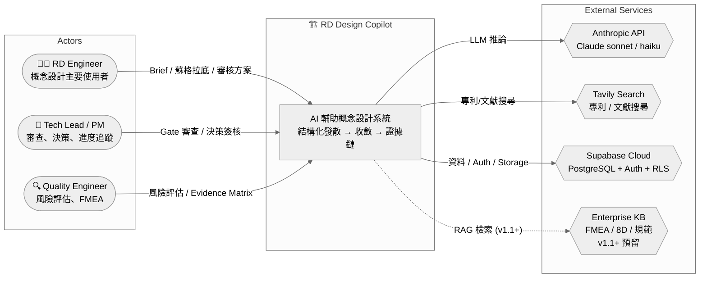
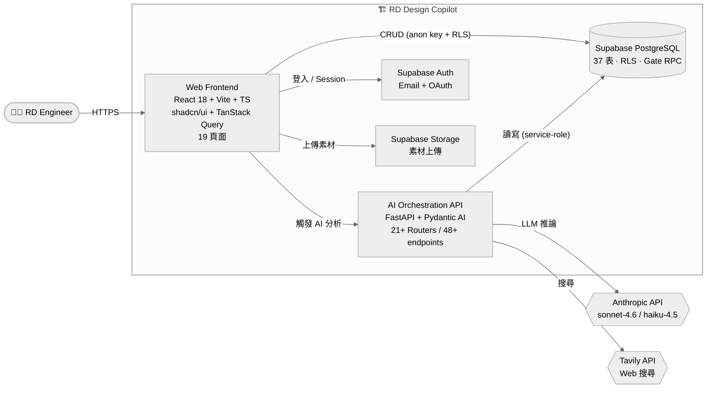
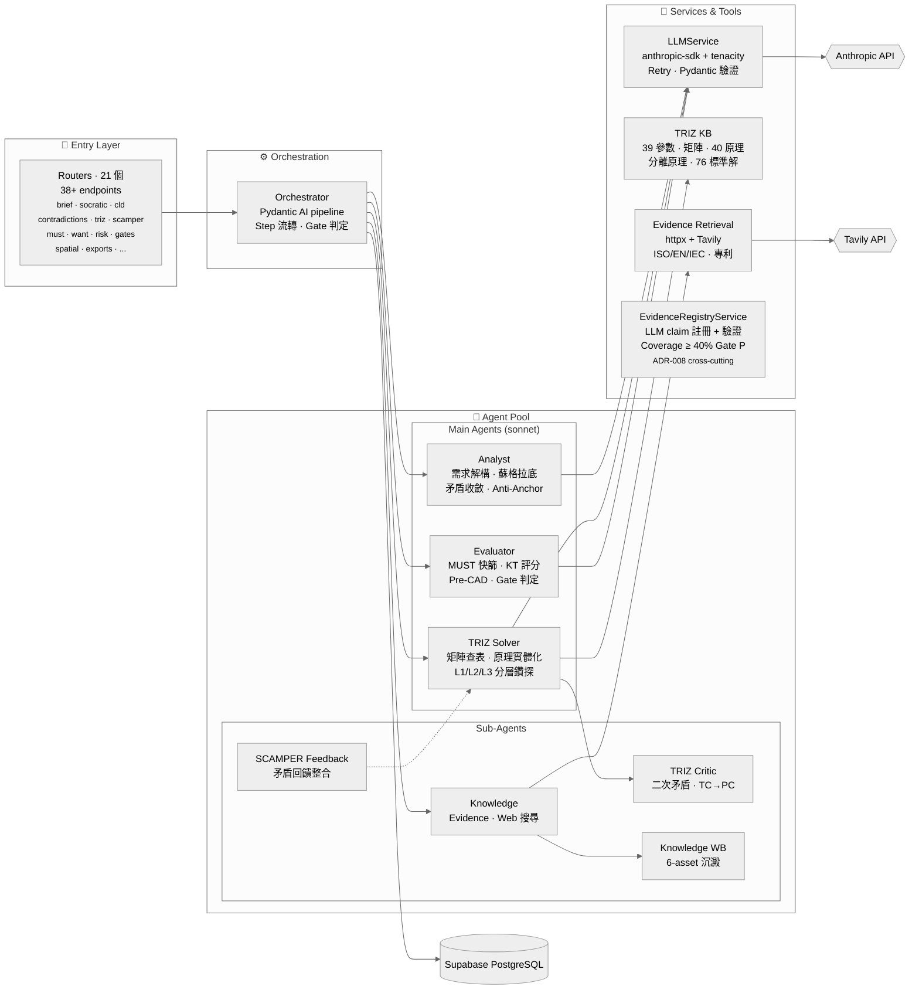

---

## doc_id: E3
title: RD Design Copilot — Architecture and Design
version: v2.0
last_updated: 2026-04-15
status: Active
template: VibeCoding 05 (Architecture & Design)
gate: TR3
authors: [ARCH, TL]
supersedes: E3 v1.4 (2026-03-26)

# E3 — Architecture and Design

> **版本**：v2.0（重構後對齊 VibeCoding Template 05 三部分/十章節骨架） | **最後更新**：2026-04-15 | **狀態**：Active
> **重構說明**：v2.0 保留 v1.4 全部 AI Agent 敘事內容（現納入「第 2 部分 · 詳細設計 §11」），新增第 1 部分「架構總覽」(§1-§10) 補齊 C4 圖、技術選型、數據架構、部署、NFR、風險、路線圖等標準章節，並保留 Appendix A-E 原樣作為第 3 部分。
> **v1.4 / v1.3 / v1.2 歷史更新摘要**：見 §11 首段記錄。

## 文檔導覽

本文件按 VibeCoding Template 05 「整合性架構與設計文檔」骨架組織成三部分：


| 部分                | 範圍                                                                                                         | 對應章節           |
| ----------------- | ---------------------------------------------------------------------------------------------------------- | -------------- |
| **Part 1 · 架構總覽** | 需求摘要、C4 高層架構、技術選型、數據、部署、NFR、風險、路線圖                                                                         | §1 – §10       |
| **Part 2 · 詳細設計** | AI Agent 協作架構（本產品核心，多代理 + 狀態機 + Anti-Anchor 機制）                                                            | §11            |
| **Part 3 · 附錄**   | 5 份 SA 視角架構說明書（Forward Subsystem / Forward TRIZ / Reverse Anti-Anchor / State Machine / TRIZ→SCAMPER Flow） | Appendix A – E |


---

# Part 1 · 架構總覽

## §1 文件目的與範圍

### 1.1 文件目的

本文件為 RD Design Copilot v1.0 的整合性架構與設計文檔，負責回答「系統由哪些元件構成？彼此如何互動？為何如此選型？」三個問題。文件同時服務下列讀者：


| 讀者               | 關心的章節                                        |
| ---------------- | -------------------------------------------- |
| 新進開發者            | §3（C4 圖）、§4（技術棧）、§11（Agent 詳細設計）             |
| Tech Lead / ARCH | §4（選型理由）、§7（NFR）、§8（風險）、§9（路線圖）、Appendix A-E |
| Product / PM     | §2（需求摘要）、§9（路線圖）                             |
| SRE / DevOps     | §6（部署）、§7（NFR：可觀測性/安全）                       |
| QA               | §7（NFR）、§11.6（驗證場景）、§3（接口邊界）                 |


### 1.2 範圍

**In Scope**

- RD Design Copilot 產品的軟體架構（前端 + 後端 + BaaS + LLM 服務）
- Multi-Agent 編排、狀態機、TRIZ / SCAMPER / Anti-Anchor 三條分析路徑
- 部署拓撲（Docker Compose + Supabase SaaS + Anthropic API）
- 關鍵非功能需求與對應緩解設計

**Out of Scope**

- 詳細 API Spec（見 `docs/02-design/E5--api-design-specification.md`）
- 完整 ERD（見 E4 ERD — TBD owner TBD by 2026-Q2 TBD，暫以 Supabase migrations 001-010 + `backend/app/models/schemas.py` 為事實來源）
- Module-level 程式結構（見 `docs/02-design/specs/modules/`）
- 使用者介面細節（見 `docs/02-design/E5x--frontend-architecture.md`）

### 1.3 相關文件


| 類別   | 文件                                                                                                                  |
| ---- | ------------------------------------------------------------------------------------------------------------------- |
| 上游輸入 | `docs/00-discover/E1--project-brief-and-prd.md`（需求來源）、`docs/00-discover/E1x--assumption-risk-register.md`           |
| 決策紀錄 | `docs/01-define/adrs/ADR-001..008`（含 ADR-006 Harness Architecture、ADR-008 Auto-TRIZ v2 Integration）                |
| 下游展開 | `docs/02-design/E5--api-design-specification.md`、`docs/02-design/E5x--frontend-architecture.md`                     |
| 交付文件 | `docs/04-deliver/E9--deployment-and-operations-guide.md`、`docs/04-deliver/E8--security-and-readiness-checklists.md` |
| 計劃文件 | `docs/01-define/E3--wbs-development-plan.md`                                                                        |


---

## §2 需求摘要 (Requirements Summary)

> 需求來源：`docs/00-discover/E1--project-brief-and-prd.md` v3.0（2026-04-13）。以下為架構相關摘要，完整內容以 E1 為準。

### 2.1 Customer Promise

> RD Design Copilot 讓 RD 工程師在概念設計階段，用結構化的 AI 輔助發散與收斂流程，在更短的時間內探索更多可能性、更早暴露風險，使每一個設計決策都有可追溯的證據鏈。

### 2.2 主要用戶與場景


| 用戶     | 架構相關需求                                 |
| ------ | -------------------------------------- |
| RD 工程師 | 結構化輸入、AI 預填、發散/收斂工作流、可追溯決策             |
| RD 主管  | Gate Review 彙整、Evidence Matrix、KT 決策記錄 |
| PM     | 專案儀表板、進度追蹤、Brief 變更影響評估                |
| 品質工程師  | Risk Register、FMEA 比對                  |
| 高階主管   | 一頁式摘要、決策追溯                             |


### 2.3 核心功能對應架構能力


| PRD Goal     | 對應架構能力                                       | 主要 Agent / 元件                     |
| ------------ | -------------------------------------------- | --------------------------------- |
| G1 擴大設計可能性空間 | Anti-Anchor Sprint + TRIZ + SCAMPER 三路發散     | Analyst + TRIZ Solver + Knowledge |
| G2 未知可見可追蹤   | 假設台帳 + Validation Passport + Evidence Matrix | Analyst + Evaluator               |
| G3 前置風險驗證    | Phase B 收斂交叉檢查（Decision Hub 手動觸發）+ 架構健康度監控 + 最小實驗設計 | Analyst + Evaluator               |
| G4 決策可審查可複用  | KT Decision Analysis + 6 類資產知識回寫             | Evaluator + Knowledge             |
| G5 提升溝通效率    | Gate 自動化 + 一頁式報告                             | Orchestrator + Evaluator          |
| G6 用戶願意使用    | 漸進式負擔 + AI 預填                                | Frontend UX                       |
| G7 證據缺口可見    | Evidence Matrix + 北極星證據追蹤                    | Evaluator                         |


### 2.4 產品原則（架構守欄）

源自 PRD §5：**AI 建議，人決策；證據先行；結構化但不僵化；打破錨定；透明可解釋；漸進式負擔；知識可沉澱**。這七條原則直接約束後續所有 ADR 與設計決策（見 §8 風險與 §11.3 Anti-Anchor 機制）。

### 2.5 Scope Boundaries


| This Product IS | This Product IS NOT     |
| --------------- | ----------------------- |
| 概念設計 AI 輔助工具    | 詳細設計工具（CAD/CAE/CAM）     |
| 結構化發散收斂引擎       | 自動設計系統（不產生最終圖面）         |
| 證據驅動 Gate 決策支援  | 專案管理工具（Jira/MS Project） |
| 設計知識沉澱平台        | 通用 AI 聊天機器人             |
| —               | PLM / PDM 系統            |


---

## §3 高層次架構設計 (High-Level Architectural Design)

採用 C4 Model 三層視圖（Context / Container / Component）。更細節的 Component 視圖見 Appendix A（子系統）、Appendix B（TRIZ）、Appendix C（Anti-Anchor）。

### 3.1 Context Diagram (C4 Level 1)




### 3.2 Container Diagram (C4 Level 2)




### 3.3 Component Diagram (C4 Level 3 — API Container 內部)




> **深入閱讀**：三條分析路徑（正向子系統 / 正向 TRIZ / 反向 Anti-Anchor）的 Component 細節見 Appendix A / B / C；狀態機見 Appendix D；TRIZ→SCAMPER 流程見 Appendix E。

### 3.4 關鍵架構風格與決策


| 風格                                           | 說明                                                                                                        | 依據                                      |
| -------------------------------------------- | --------------------------------------------------------------------------------------------------------- | --------------------------------------- |
| **BaaS-First**                               | 前端直連 Supabase 做 CRUD，後端只做 AI 編排                                                                           | ADR-001                                 |
| **Server-side guardrails via FastAPI**       | Gate 檢查由 gate_registry.py 宣告式定義 + gates.py 強制                                                             | ADR-002 (實作方式已改)                        |
| **Multi-Agent + Pydantic AI**                | Analyst / TRIZ Solver / Evaluator / Knowledge 四主 + triz_critic / scamper_feedback / knowledge_wb 三副 Agent | §11.1 + §11.5 + ADR-006                 |
| **Evidence-first outputs**                   | 所有 AI 輸出附 `EvidenceReference`（KB-/WEB-/DOC-/REASONING-）                                                   | ADR-005 + schemas.py §EvidenceReference |
| **Prompt-as-code（Phase 2 轉 prompt-as-data）** | 目前 Prompt 模板在 Python 模組，Phase 2 遷至 `prompts/templates/*.md`                                               | ADR-003                                 |


---

## §4 技術選型詳述 (Technology Stack Details)

### 4.1 技術棧總覽


| 層級                     | 技術                                        | 版本                                 | 選型理由 / 來源                                                                                              |
| ---------------------- | ----------------------------------------- | ---------------------------------- | ------------------------------------------------------------------------------------------------------ |
| **Frontend Framework** | React + Vite + TypeScript                 | React 18.3 / Vite 5.4 / TS 5.8     | SPA、快速 HMR、生態成熟；`package.json`                                                                         |
| **UI Component Lib**   | shadcn/ui + Radix UI + Tailwind           | Radix 1.x-2.x / Tailwind 3.4       | Headless、可組合、與 design tokens 整合                                                                        |
| **Frontend State**     | TanStack Query v5 + React Hook Form + Zod | 5.83 / 7.61 / 3.25                 | 伺服器狀態快取、表單驗證                                                                                           |
| **Frontend Graph**     | @xyflow/react + @dagrejs/dagre + Recharts | 12.10 / 2.0 / 2.15                 | 收斂圖、狀態機視覺化、KPI 圖表                                                                                      |
| **Backend Framework**  | FastAPI + Uvicorn                         | FastAPI 0.115+ / uvicorn 0.34+     | async、自動 OpenAPI、Pydantic 整合；`backend/pyproject.toml`                                                  |
| **Backend Runtime**    | Python                                    | 3.12+                              | Pydantic AI 生態、pydantic 2.10+                                                                          |
| **LLM Orchestration**  | Pydantic AI + anthropic SDK               | pydantic-ai 0.1+ / anthropic 0.42+ | Typed Agent[Deps, Output]、DI support、hand-written pipeline (ADR-006)；LangGraph 保留於 pyproject.toml 但未使用 |
| **LLM Provider**       | Anthropic Claude                          | sonnet-4.6（主）+ haiku-4.5（輕量）       | 長上下文、JSON mode、tool use                                                                                |
| **LLM Resilience**     | tenacity                                  | >=9.0                              | 指數退避重試 (`retry_on_transient` in `base.py`)；ADR-003 Phase 1 已實作                                         |
| **Schema Validation**  | Pydantic                                  | >=2.10                             | LLM 輸出結構化、型別安全；ADR-003                                                                                 |
| **BaaS / DB**          | Supabase (PostgreSQL)                     | 2.97（JS）/ 2.12+（py）                | ADR-001：Auth + RLS + Realtime + PostgreSQL Day-1                                                       |
| **DB Migrations**      | Supabase CLI SQL                          | —                                  | `supabase/migrations/000-011` (12 files, 37 tables)                                                    |
| **Web Search**         | Tavily                                    | >=0.5（optional）                    | ADR-005：ISO/EN/IEC 標準引用；`backend/app/services/web_search.py`                                           |
| **Frontend Testing**   | Vitest + Testing Library + jsdom          | 3.2 / 16.0 / 20                    | ADR-004                                                                                                |
| **Backend Testing**    | pytest + pytest-asyncio                   | 8+ / 0.25+                         | ADR-004                                                                                                |
| **E2E Testing**        | Playwright（計畫中）                           | TBD — QA Owner TBD by 2026-W17 TBD | ADR-004                                                                                                |
| **Packaging**          | Docker + docker-compose + nginx           | —                                  | ADR-004；`Dockerfile`、`docker-compose.yml`、`nginx.conf`                                                 |
| **Auth**               | Supabase Auth（Email/OAuth）                | —                                  | ADR-001                                                                                                |
| **Lint / Format**      | ESLint 9 + TypeScript ESLint / Ruff 0.9   | —                                  | `eslint.config.js` / `pyproject.toml [tool.ruff]`                                                      |


### 4.2 選型關聯 ADR 交叉表


| ADR         | 主要技術決策                                                         | 影響範圍                                                                    |
| ----------- | -------------------------------------------------------------- | ----------------------------------------------------------------------- |
| **ADR-001** | BaaS-First — Supabase 取代 SQLAlchemy ORM                        | 消除 ~35 CRUD 端點、RLS 取代自訂權限、PostgreSQL Day-1                              |
| **ADR-002** | Server-side 業務邏輯 — 實際改用 FastAPI endpoints (非 DB triggers)      | gate_registry.py、gates.py、exports.py、knowledge_wb.py、unknown_factors.py |
| **ADR-003** | LLM 服務層強化 — Phase 1 完成 (Retry + Pydantic 驗證 + Prompt 分離)       | tenacity、call_llm_structured、prompts/*.py                               |
| **ADR-004** | 務實測試策略 — 38+ AI 端點、Docker 部署、Playwright deferred               | pytest (84 tests)、Vitest (92 tests)、docker-compose                      |
| **ADR-005** | 範圍擴充 — Evidence Retrieval + Multi-Solution + Configurable MUST | Tavily API、concept_routes/compatibility_pairs 2 張新表、MustCriterionConfig |
| **ADR-006** | Harness Architecture — Pydantic AI spine + MCP + Skills（Accepted & Implemented 2026-04-24） | `backend/app/harness/` 全模組（agent_base, model_adapter, tool_registry, solver_registry, orchestrator, skill_loader, mcp_server, mcp_client）；所有 Agent 重構為 HarnessAgent |
| **ADR-008** | Auto-TRIZ v2 Closed-Loop Integration — FA/OZ-OT/SIM/CCI/Evidence Registry | 3 張新表（function_models, evidence_claims, sim_matrices）；contradictions 增欄；10 個新 API endpoints；Conditional Stepper UI |


### 4.3 關鍵相依與替換成本


| 相依              | 替換成本                    | 緩解                                                     |
| --------------- | ----------------------- | ------------------------------------------------------ |
| Anthropic API   | 高（Prompt 與模型行為耦合）       | ADR-003 Phase 3 智慧模型路由 + 風險 BR-05：抽象 LLM 介面層           |
| Supabase JS SDK | 極高（前端直接 import）         | 短期不動；v1.1 評估 supabase-compatible 替代（e.g. PostgREST）    |
| Tavily API      | 低（僅 Knowledge Agent 使用） | 可切換 SerpAPI / Google Custom Search                     |
| Pydantic AI     | 低                       | 手寫 pipeline，無 framework lock-in；ADR-006 已遷移離 LangGraph |


---

## §5 數據架構 (Data Architecture)

> **E4 ERD 狀態**：完整 ERD 圖尚未產出 — **TBD — E4 ERD Owner TBD by 2026-Q2 TBD**。本節以 Supabase migrations（`supabase/migrations/000-010`）+ `backend/app/models/schemas.py` Pydantic 類別作為事實來源（source of truth）。

### 5.1 資料儲存分層


| 層             | 技術                                                                | 用途                                      | 存取方式                                               |
| ------------- | ----------------------------------------------------------------- | --------------------------------------- | -------------------------------------------------- |
| 結構化資料         | Supabase PostgreSQL（29 表）                                         | 專案、Artifact、Gate 結果、決策紀錄                | 前端：Supabase JS + RLS / 後端：supabase-py service-role |
| 二進位檔          | Supabase Storage                                                  | Brief 素材（PDF/圖片/Excel）、匯出報告             | 前端直傳                                               |
| 會話狀態          | PostgreSQL + TanStack Query 快取                                    | Orchestrator state、Agent 中間狀態           | 後端寫入、前端讀取（Supabase Realtime 可選）                    |
| 知識庫           | Markdown 檔（`rd_assistant_design_system/triz_knowledge_base/*.md`） | TRIZ 39 參數 / 矩陣 / 40 原理 / 分離原理 / 76 標準解 | 後端載入 in-memory                                     |
| Embedding 向量庫 | —                                                                 | RAG（v1.1+ 預留）                           | TBD — Vector DB Owner TBD by 2026-Q3 TBD           |


### 5.2 核心資料實體（概要）

以下為 Supabase migrations 與 Pydantic schema 對應之主要實體群組。欄位細節以檔為準。


| 實體群組                                           | Supabase 表（代表）                                                                                    | Pydantic 類別（代表）                                                                                                              | 關聯 E3 章節                       |
| ---------------------------------------------- | ------------------------------------------------------------------------------------------------- | ---------------------------------------------------------------------------------------------------------------------------- | ------------------------------ |
| **Project & Phase**                            | `projects`（phase/status/must_criteria_config JSONB）                                               | —                                                                                                                            | §11.1 / ADR-002                |
| **Brief & Requirements**                       | `constraints`, `kpis`, `brief_assets`                                                             | `BriefExtractionResponse`, `ExtractedConstraint`, `ExtractedKpi`                                                             | Step 1 (§11.2)                 |
| **Socratic & Assumptions**                     | `socratic_questions`, `assumptions`                                                               | `SocraticResponse`, `ExtractedAssumption`, `ValidationPassportAssumption`                                                    | Step 2/4 (§11.2)               |
| **Causal Loop & Contradictions**               | `cld_nodes`, `cld_edges`, `contradictions`                                                        | `CldGenerationResponse`, `ContradictionFormalize`*                                                                           | Step 3 (§11.2)                 |
| **Subsystem Hierarchy（3-level）**               | `subsystems`（migration 003 / 007 / 008）                                                           | `SubsystemSuggestResponse`, `SuggestedSubsystem`, `InterfaceContract`, `PackageMap`, `SpatialEstimate`                       | Step 5b (§11.2) + Appendix A   |
| **TRIZ Layered**（TC/PC/SF 分層）                  | migration 010 (`triz_layered_drilldown`), `contradictions.kind`（migration 009 `pc_decomposition`） | `LayeredTrizSolution`, `L1Surface`, `L2RootCause`, `L3StructuralCheck`, `SuFieldModel`, `DeepenLink`, `DifferentialAnalysis` | Step 5a (§11.2) + Appendix B   |
| **Anti-Anchor & Passport**（migration 001）      | `anti_anchor_routes`, `validation_passports`                                                      | `AntiAnchorRoute`, `ValidationPassport`                                                                                      | Step 5-0 (§11.2) + Appendix C  |
| **SCAMPER**                                    | `scamper_variants`                                                                                | `ScamperVariant`, `ScamperResponse`                                                                                          | Step 5c (§11.2)                |
| **Concept Routes & Compatibility（ADR-005 新增）** | `concept_routes`, `compatibility_pairs`                                                           | `ConvergenceAlternativeInput`, `ConvergenceContradictionInput`, `SecondaryContradiction`                                     | Step 5d (§11.2)                |
| **MUST Evaluation**                            | `must_evaluations`                                                                                | `MustEvaluationRequest`, `MustCriterionConfig`, `MustCriterionResult`                                                        | Step 5e (§11.2)                |
| **Pre-CAD Review**                             | `pre_cad_reviews`                                                                                 | `PreCadAnalyzeResponse`, `SpatialTrace`                                                                                      | Step P (§11.2)                 |
| **Evidence & Risk**                            | `evidence_matrix`, `risks`                                                                        | `EvidenceReference`, `RiskSuggestion`                                                                                        | Step 6 / 6e (§11.2)            |
| **Decision & Actions**                         | `decision_records`, `actions`, `want_criteria`                                                    | `ActionSuggestion`, `SuggestedWantCriterion`                                                                                 | Step 7 (§11.2)                 |
| **Knowledge Assets**                           | `knowledge_entries`, `learned_components`                                                         | `LearnedComponentPromote`*                                                                                                   | Step 8 (§11.2) + Appendix A §9 |
| **Gate & Traceability**                        | `gate_checks`, `traceability_links`（migration 002）                                                | `GateCheckResponse`, `GateCheckItem`                                                                                         | §11.4 Gate 判定                  |
| **Unknown Factors & LLM Usage**（ADR-002/003）   | `unknown_factors`, `llm_usage_logs`                                                               | `DiscoveredUnknownFactor`                                                                                                    | P1 (§11.5)                     |
| **Function Models（ADR-008 新增）**               | `function_models`（project_id, component_interactions JSONB, sf_diagnosis JSONB, subsystem_boundary JSONB） | `FunctionModel`, `ComponentInteraction`, `SfDiagnosis`                                                                       | Step 1 FA (§11.2 v2.2)         |
| **Evidence Claims（ADR-008 新增）**               | `evidence_claims`（claim_id, claim_text, status VERIFIED/APPROXIMATE/UNVERIFIED, verification_sources JSONB） | `EvidenceClaim`                                                                                                              | Cross-cutting (§11.5 v2.2)     |
| **SIM Matrices（ADR-008 新增）**                  | `sim_matrices`（project_id, contradiction_ids JSONB, matrix JSONB, optimal_combination JSONB, rounds_used INT） | `SimMatrixResult`                                                                                                            | Step 3 SIM (§11.2 v2.2)        |
| **Contradictions 增欄（ADR-008）**                | `contradictions` 新增 `oz_zone TEXT`, `ot_time TEXT`, `px_variable TEXT`（nullable）                   | `OzOtResult`, `ComplexityCheckResult`                                                                                        | Step 2 OZ-OT (§11.2 v2.2)      |


### 5.3 資料存取模式

```
前端 CRUD 路徑 (ADR-001)：
  Browser → @supabase/supabase-js (anon key) → RLS 過濾 → PostgreSQL

後端 AI 路徑 (ADR-001/002/003)：
  Browser → FastAPI (JWT header) → supabase-py (service-role) → PostgreSQL
                                  ↘ Anthropic API (LLMService with retry)
                                  ↘ Tavily API (Evidence Retrieval Service)
```

### 5.4 資料治理與保留


| 項目        | 策略                                                                                                 | 來源                                 |
| --------- | -------------------------------------------------------------------------------------------------- | ---------------------------------- |
| RLS 策略    | 27 張表皆有 tenant/owner-based RLS（`supabase/migrations/002_rls_policies.sql`）                         | ADR-001                            |
| Schema 遷移 | Supabase migrations 000-010，僅 forward-migration                                                    | ADR-001                            |
| 業務規則強制    | DB BEFORE UPDATE trigger（phase 轉換）+ `check_gate(project_id, gate_id)` RPC                          | ADR-002                            |
| 資料保留期     | TBD — Legal/Privacy Owner TBD by 2026-Q2 TBD（見 `docs/00-discover/E1x--privacy-compliance-seed.md`） | —                                  |
| 備份        | Supabase 自動 Point-in-Time Recovery（Pro plan）                                                       | TBD — SRE Owner TBD by Release TBD |


---

## §6 部署與基礎設施架構

> 本節為概述；完整部署/運維程序見 `docs/04-deliver/E9--deployment-and-operations-guide.md`。

### 6.1 部署拓撲

```
┌──────────────────────────────────────────────────────┐
│  Dev / Prod Host (docker-compose.yml — ADR-004)      │
│  ┌────────────────────┐   ┌────────────────────┐    │
│  │ frontend container │   │ backend container  │    │
│  │ nginx + Vite build │   │ FastAPI + uvicorn  │    │
│  │ :80                │   │ :8000              │    │
│  └─────────┬──────────┘   └─────────┬──────────┘    │
│            │                         │               │
│            │ (HTTPS)                 │ (HTTPS)       │
└────────────┼─────────────────────────┼───────────────┘
             │                         │
             ▼                         ▼
   ┌──────────────────┐       ┌──────────────────┐
   │ Supabase Cloud   │       │ Anthropic API    │
   │ (PG+Auth+Store)  │       │ Tavily API       │
   └──────────────────┘       └──────────────────┘
```

### 6.2 環境配置


| 環境         | Host                                         | Supabase            | LLM Key           | 來源                                  |
| ---------- | -------------------------------------------- | ------------------- | ----------------- | ----------------------------------- |
| Local Dev  | Developer laptop docker-compose              | Cloud (dev project) | Anthropic dev key | `.env.example`（ADR-004 action item） |
| Staging    | TBD — SRE Owner TBD by M5 (2026-W18) TBD     | Cloud (staging)     | Anthropic staging | TBD                                 |
| Production | TBD — SRE Owner TBD by M6 (Release v1.0) TBD | Cloud (prod)        | Anthropic prod    | TBD                                 |


### 6.3 相關 ADR

- **ADR-001**：BaaS SaaS 取代自建 DB，運維邊界大幅縮小
- **ADR-004**：Docker + docker-compose 一鍵啟動；不納入 v1.0：CI/CD pipeline、全頁面 Playwright

### 6.4 CI/CD 狀態

手動部署於 v1.0 可接受（ADR-004 §不納入 v1.0）；v1.1 建立 pipeline — **TBD — DevOps Owner TBD by v1.1 TBD**。

---

## §7 跨領域考量 (Cross-Cutting Concerns / NFR)

### 7.1 效能 (Performance)


| 指標                     | 目標                  | 策略                                                                               |
| ---------------------- | ------------------- | -------------------------------------------------------------------------------- |
| AI 端點單次回應 P50          | < 8 秒               | Haiku for 輕量檢索、Sonnet for 推理；ADR-003 Phase 3 模型路由                                |
| AI 端點單次回應 P99（含 retry） | < 30 秒              | tenacity max 3 retries、指數退避 min=1s max=10s                                       |
| 前端首屏 TTI               | < 3 秒               | Vite build + code splitting + lazy-solve（近期 commit `feat(frontend): lazy-solve`） |
| 收斂圖渲染                  | ≤ 200 節點流暢          | @xyflow + dagre layout                                                           |
| 批次 Agent 並行度           | 5a 每條矛盾 + 5c 每子系統獨立 | §11.4 並行處理規則                                                                     |


### 7.2 安全 (Security)


| 項目              | 機制                                                                                   | 來源                             |
| --------------- | ------------------------------------------------------------------------------------ | ------------------------------ |
| 身份認證            | Supabase Auth（Email/Password + OAuth）                                                | ADR-001                        |
| 授權              | Row-Level Security（27 表）                                                             | ADR-001；`002_rls_policies.sql` |
| 後端權限            | Service-role key 僅伺服器持有、環境變數注入                                                       | ADR-001                        |
| 業務規則強制          | Supabase BEFORE UPDATE trigger + `check_gate` RPC                                    | ADR-002                        |
| LLM Prompt 注入防護 | Pydantic 輸出驗證、系統 prompt 與使用者輸入隔離                                                     | ADR-003                        |
| 敏感資料隱私          | 客戶設計資料隔離 — **TBD — Legal Owner TBD by v1.0 TBD**；見 `E1x--privacy-compliance-seed.md` |                                |
| 依賴安全性           | Dependabot / pip-audit — **TBD — Security Owner TBD by v1.1 TBD**                    |                                |


詳見 `docs/04-deliver/E8--security-and-readiness-checklists.md`。

### 7.3 可觀測性 (Observability)


| 面向             | 現況                         | 計畫                                                    |
| -------------- | -------------------------- | ----------------------------------------------------- |
| 結構化日誌          | FastAPI uvicorn access log | 集中化日誌聚合 — TBD — SRE Owner TBD by v1.1 TBD             |
| LLM 使用量追蹤      | 計畫 `llm_usage_logs` 表      | ADR-003 Phase 2                                       |
| Token 成本監控     | —                          | ADR-003 Phase 3（per-project 預算）                       |
| Error tracking | —                          | Sentry / equivalent — TBD — SRE Owner TBD by v1.1 TBD |
| 健康檢查           | `GET /health`              | ✅ 已實作（ADR-004）                                        |


### 7.4 可靠性 (Reliability)


| 項目            | 策略                                                    | 來源              |
| ------------- | ----------------------------------------------------- | --------------- |
| LLM API 暫時性錯誤 | tenacity 指數退避 3 retries                               | ADR-003 Phase 1 |
| LLM 輸出異常      | Pydantic `.model_validate()` + JSON markdown fence 容錯 | ADR-003         |
| Supabase 失效   | SaaS SLA；無跨區 failover（v1.0 接受）                        | —               |
| DB 一致性        | PostgreSQL ACID + 狀態機觸發器                              | ADR-002         |


### 7.5 可維護性 (Maintainability)


| 項目      | 策略                                                                              |
| ------- | ------------------------------------------------------------------------------- |
| 模組邊界    | Frontend pages / hooks / components；Backend routers / agents / services / tools |
| 型別      | TS 5.8（frontend）+ Pydantic 2.10（backend）雙端型別安全                                  |
| OpenAPI | FastAPI 自動產生 `/docs`；v1.1 前端型別自動同步 — TBD — DevOps Owner TBD by v1.1 TBD         |
| Linting | ESLint 9 + Ruff 0.9                                                             |
| ADR     | `docs/01-define/adrs/ADR-001..005`，架構變更必留 ADR                                   |


### 7.6 可測試性 (Testability)


| 層              | 工具                         | 目標（ADR-004）                                                    |
| -------------- | -------------------------- | -------------------------------------------------------------- |
| Backend AI     | pytest + LLM mock fixtures | 38+ AI 端點全覆蓋（Happy / Invalid LLM / Validation）                 |
| Backend 規則     | pytest                     | TRIZ matrix 確定性測試                                              |
| Frontend hooks | Vitest                     | 核心業務 hook（contradictionScan / convergenceLoop / supabaseQuery） |
| E2E            | Playwright smoke           | 1 條 Happy Path（Brief → Explore → Create）                       |


### 7.7 國際化 (i18n)

v1.0：繁體中文介面、Prompt 中英混用。i18n 多語切換 — **TBD — PM Owner TBD by v1.1+ TBD**。

### 7.8 可及性 (Accessibility)

Radix UI 提供 WAI-ARIA 基礎；a11y 審計 — **TBD — UX Owner TBD by v1.1 TBD**。

---

## §8 風險與緩解策略

本節整合來自 §11.3（路徑依賴 AI 機制）以及 `docs/00-discover/E1x--assumption-risk-register.md` 的架構相關風險。風險分數 = P × I（1-5）。

### 8.1 架構與技術風險（Top）


| ID    | 風險                          | P   | I   | 分數  | 緩解                                                                                            | 關聯                 |
| ----- | --------------------------- | --- | --- | --- | --------------------------------------------------------------------------------------------- | ------------------ |
| TR-01 | AI 幻覺導致錯誤建議                 | 4   | 5   | 20  | 強制證據鏈 + Pydantic 驗證 + Validation Passport + Confidence Score；長期 Hallucination Detection Agent | ADR-003 / §11.3    |
| TR-02 | 用戶抗拒結構化輸入                   | 4   | 4   | 16  | AI 預填、漸進輸入、最小欄位                                                                               | PRD G6             |
| TR-04 | 知識庫資料品質不佳                   | 3   | 4   | 12  | Evidence Retrieval (ADR-005) + 資料清洗 + 知識回寫品質控制                                                | ADR-005            |
| TR-05 | 與現有 PLM/CAD 整合困難            | 3   | 3   | 9   | 標準 API + 階段性整合；v1.1+ 評估                                                                       | E1x-risk           |
| TR-06 | AutoTRIZ 規則引擎覆蓋率不足          | 3   | 3   | 9   | LLM 補足 + 規則庫持續擴充                                                                              | §11.5 + Appendix B |
| TR-08 | LLM API 成本失控                | 3   | 3   | 9   | Token logging (Phase 2) + 模型路由 (Phase 3) + Caching                                            | ADR-003            |
| BR-05 | Vendor Lock-in on Anthropic | 3   | 4   | 12  | 抽象 LLM 介面層；定期評估 OpenAI/Gemini                                                                 | ADR-003            |


### 8.2 路徑依賴風險（產品特性風險，由 AI 機制緩解）


| 症狀     | 影響 Step        | 緩解機制                                                | 來源                        |
| ------ | -------------- | --------------------------------------------------- | ------------------------- |
| 慣用架構偏見 | Step 2 理解全貌    | Socratic 七類提問 + Problem Reframing                   | §11.3 機制 1                |
| 矛盾盲視   | Step 3 系統建模    | Forced Divergence + Contradiction Convergence Graph | §11.3 機制 2 + 6            |
| 錨定效應   | Step 5-0/5a/5c | Anti-Anchor Sprint（第一性原理 prompt） + Anti-Anchor Gate | §11.3 機制 2/4 + Appendix C |
| 隱含假設   | Step 2-4       | Assumption Challenge（質疑回寫）                          | §11.3 機制 1                |
| 經驗慣性   | Step 5a/5c     | Cross-Domain Analogical Search                      | §11.3 機制 3                |


### 8.3 資料完整性風險


| 風險                                | 緩解                                 | 來源                  |
| --------------------------------- | ---------------------------------- | ------------------- |
| `projects.phase` 被前端任意設值          | Supabase BEFORE UPDATE trigger（P0） | ADR-002 / WBS A-6.1 |
| Gate 檢查可被繞過                       | `check_gate()` RPC + 前端呼叫門禁        | ADR-002             |
| `unknown_factors` localStorage 遺失 | 遷移至 Supabase 表（P1）                 | ADR-002 / WBS       |


### 8.4 商業風險（架構連動）


| ID    | 風險                          | 架構應對                        |
| ----- | --------------------------- | --------------------------- |
| BR-01 | 市場採納速度低於預期                  | 漸進式負擔（PRD P6）+ AI 預填最小化輸入成本 |
| BR-02 | 法規 / IP 風險（PDPA/GDPR）       | 租戶隔離架構 + 資料加密 — TBD         |
| BR-05 | Vendor Lock-in on Anthropic | §4.3 抽象 LLM 介面層             |


完整清單見 `docs/00-discover/E1x--assumption-risk-register.md`。

---

## §9 架構演進路線圖

> 里程碑來源：`docs/01-define/E3--wbs-development-plan.md` §6 關鍵里程碑 + ADR-003/005 階段規劃 + ADR-002 P0/P1/P2。

### 9.1 近期里程碑（v1.0 收尾）


| 里程碑                              | 日期                | 架構意義                                      | 狀態          |
| -------------------------------- | ----------------- | ----------------------------------------- | ----------- |
| M1 WS-B 主差距修正完成                  | 2026-03-12        | 42 工作包完成，E2E 骨幹 live                      | Done        |
| M2 API 端點對齊 + 501 清零             | 2026-04-07        | 21 routers / 38+ endpoints，路徑 100% 對齊 SOW | Done        |
| M3 Sprint 3 審查決策 live            | 2026-04-07        | Evidence / Risks / Decision 全 hook 化      | Done        |
| M4 Sprint 4 知識 + Mock 清零         | 2026-W17          | 7 mock 移除 + Playwright smoke 通過           | In Progress |
| **M5 P0 closure（phase trigger）** | **2026-W18**      | ADR-002 P0 狀態機觸發器 + Gate RPC 上線           | Pending     |
| **M6 Release v1.0**              | **TBD by PM TBD** | Gate 1.1→PG3 全流程可重現走查                     | Pending     |


### 9.2 中期（v1.0 Hardening → v1.1）


| 項目                                         | 來源               | 預期                                   |
| ------------------------------------------ | ---------------- | ------------------------------------ |
| ADR-003 Phase 2：Token logging + Prompt 外部化 | ADR-003          | v1.0 Hardening                       |
| Knowledge Writeback 管線（6 類資產自動沉澱）          | ADR-002 P2 + WBS | v1.1                                 |
| Export 端點（Markdown + JSON + PDF）           | ADR-002 P2       | v1.0 Hardening（已標 Done in WBS A-4.5） |
| Assumption Disprove 串聯影響分析                 | ADR-002 P2       | v1.1                                 |
| 前端型別自動同步（OpenAPI → TS）                     | WBS 品質指標         | v1.1                                 |
| CI/CD pipeline                             | ADR-004          | v1.1                                 |
| i18n 多語                                    | §7.7             | v1.1+                                |


### 9.3 長期（v1.1+ → v2.0）


| 項目                                              | 驅動                        | 階段                                             |
| ----------------------------------------------- | ------------------------- | ---------------------------------------------- |
| ADR-003 Phase 3：智慧模型路由 + per-project token 預算告警 | ADR-003                   | v1.1                                           |
| Vector DB 接入（企業 RAG）                            | §5.1 + PRD Q2             | v1.1+                                          |
| PLM/CAD API 整合（TR-05）                           | E1x-risk                  | v1.1+                                          |
| Hallucination Detection Agent                   | TR-01 長期                  | v2.0                                           |
| LLM 介面層抽象（緩解 BR-05 Vendor Lock-in）              | ADR-003 + §4.3            | v1.1                                           |
| 多產業領域擴展（non-eBike）                              | ADR-005 Configurable MUST | 持續                                             |
| On-premise / Hybrid 部署模式                        | PRD Q6                    | TBD — Deployment Owner TBD by Customer Ask TBD |


### 9.4 範圍擴充歷史（ADR-005）


| 擴充                                  | 時點       | 架構影響                                                                       |
| ----------------------------------- | -------- | -------------------------------------------------------------------------- |
| Evidence Retrieval Service + Tavily | 已 Accept | `backend/app/services/evidence_retrieval.py`、ISO/EN/IEC 引用                 |
| Multi-Solution Adoption (M1-M5)     | 已 Accept | `concept_routes`、`compatibility_pairs` 新增；共 37 表 (含 migrations 001-011 增量) |
| Configurable MUST                   | 已 Accept | `projects.must_criteria_config` JSONB                                      |


---

## §10 附錄（Part 1）

### 10.1 術語表


| 術語                       | 說明                                                                                                 |
| ------------------------ | -------------------------------------------------------------------------------------------------- |
| **BaaS**                 | Backend-as-a-Service（Supabase）                                                                     |
| **RLS**                  | Row-Level Security（Supabase/PostgreSQL）                                                            |
| **Agent**                | Multi-Agent 架構中的角色：Analyst / TRIZ Solver / Evaluator / Knowledge（§11.1）                            |
| **Artifact**             | 流程產出的核心工件：Constraint / Contradiction / Assumption / Concept Route 等（§11.4.4）                       |
| **Gate**                 | Phase/Step 之間的品質關卡（Gate 1-8 + Anti-Anchor / Gate P / Gate C；§11.4.3）                               |
| **Phase / Step**         | Phase I-III + Step 1-8 的雙層狀態機（Appendix D）                                                          |
| **Validation Passport**  | 每個候選方案自帶的驗證護照（assumptions[], weak_points[], required_verifications[], confidence_level）；§11.3 機制 7 |
| **Phase B 收斂**            | 方案×矛盾交叉檢查（Decision Hub 手動觸發；Appendix E §3）。Phase A 已於 v8 退役，其職責由 L1 critic badge 取代              |
| **北極星證據**                | Evidence Matrix 中最關鍵的證據列，Gate C 要求 E2+                                                             |
| **TRIZ TC / PC / SF**    | Technical Contradiction / Physical Contradiction / Su-Field 三層 drill-down（Appendix B / E）          |


### 10.2 圖例與 C4 標記

- `C4Context` / `C4Container` / `C4Component`：Mermaid C4 plugin 語法
- `SolidLine → Sync HTTPS`；`DashedLine → Async / Optional`（本文件一律 solid）

### 10.3 變更記錄


| 版本       | 日期             | 變更                                                                                           | 作者        |
| -------- | -------------- | -------------------------------------------------------------------------------------------- | --------- |
| v1.2     | —              | Knowledge Source Ingestion + Contradiction Convergence Graph                                 | —         |
| v1.3     | —              | 收斂掃描 + Socratic Follow-up + Validation Passport（Phase A 已於 v8 退役，僅保留 Phase B）              | —         |
| v1.4     | 2026-03-26     | Phase B 改為 Decision Hub 手動觸發、SCAMPER 純創意、3-level 子系統、可證偽性                                    | —         |
| **v2.0** | **2026-04-15** | **重構對齊 VibeCoding 05 三部分/十章節骨架；新增 §1-§10 Part 1；原 §1-§7 降為 §11.x；Appendix A-E 保留原樣為 Part 3** | ARCH + TL |


### 10.4 相關文件清單

- 需求：`docs/00-discover/E1--project-brief-and-prd.md`
- 風險：`docs/00-discover/E1x--assumption-risk-register.md`
- 決策：`docs/01-define/adrs/ADR-001..005`
- 計劃：`docs/01-define/E3--wbs-development-plan.md`
- 系統互動：`docs/01-define/E3--system-interaction-flow.md`
- 下游 API Spec：`docs/02-design/E5--api-design-specification.md`
- 部署：`docs/04-deliver/E9--deployment-and-operations-guide.md`
- 安全：`docs/04-deliver/E8--security-and-readiness-checklists.md`

---

## 延伸閱讀

本文件為 E3 三部曲之第一部。完整架構設計分為：


| 文件                                                                     | 內容                                                      | 行數    |
| ---------------------------------------------------------------------- | ------------------------------------------------------- | ----- |
| **E3--architecture-and-design.md** (本文)                                | Part 1: 架構總覽 (C4, Tech Stack, Data, NFR, Risk, Roadmap) | ~634  |
| [E3--ai-agent-detailed-design.md](E3--ai-agent-detailed-design.md)     | Part 2: AI Agent 協作架構詳細設計 (§11)                         | ~625  |
| [E3--appendices-sa-perspectives.md](E3--appendices-sa-perspectives.md) | Part 3: SA 視角附錄 (Appendix A-E)                          | ~4156 |


