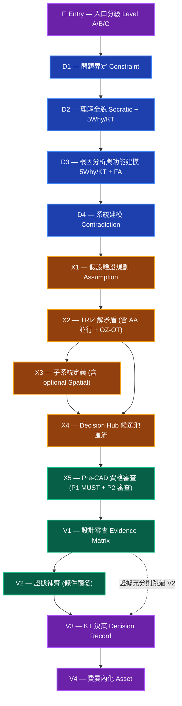
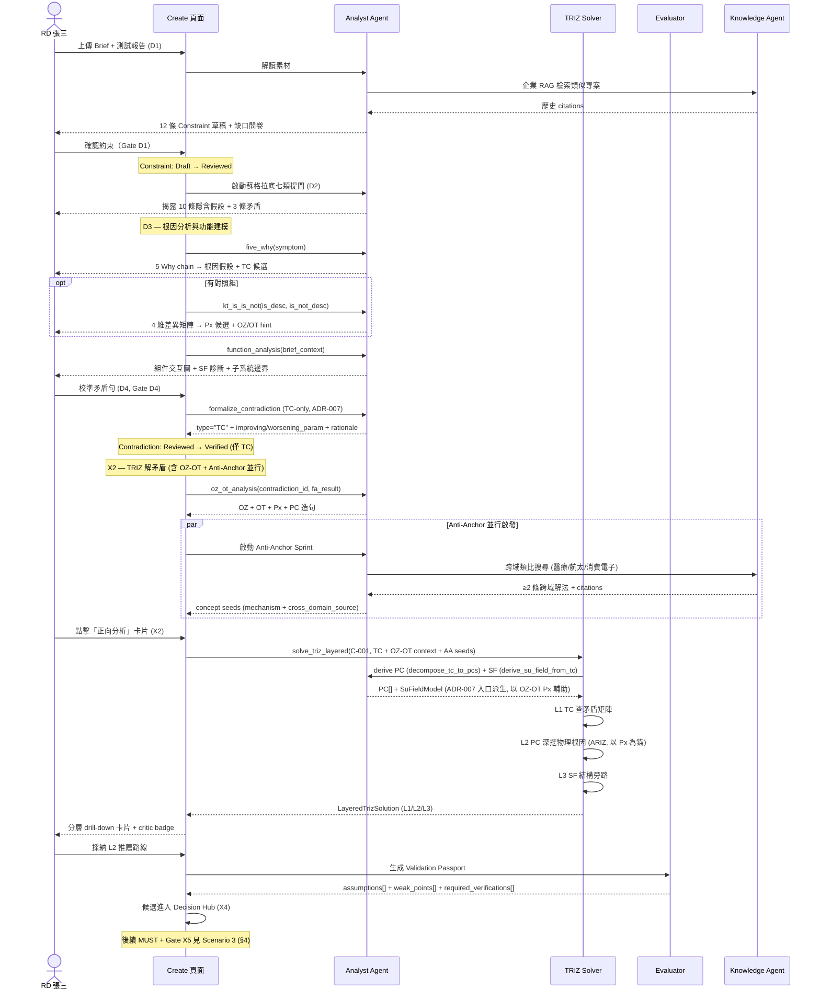
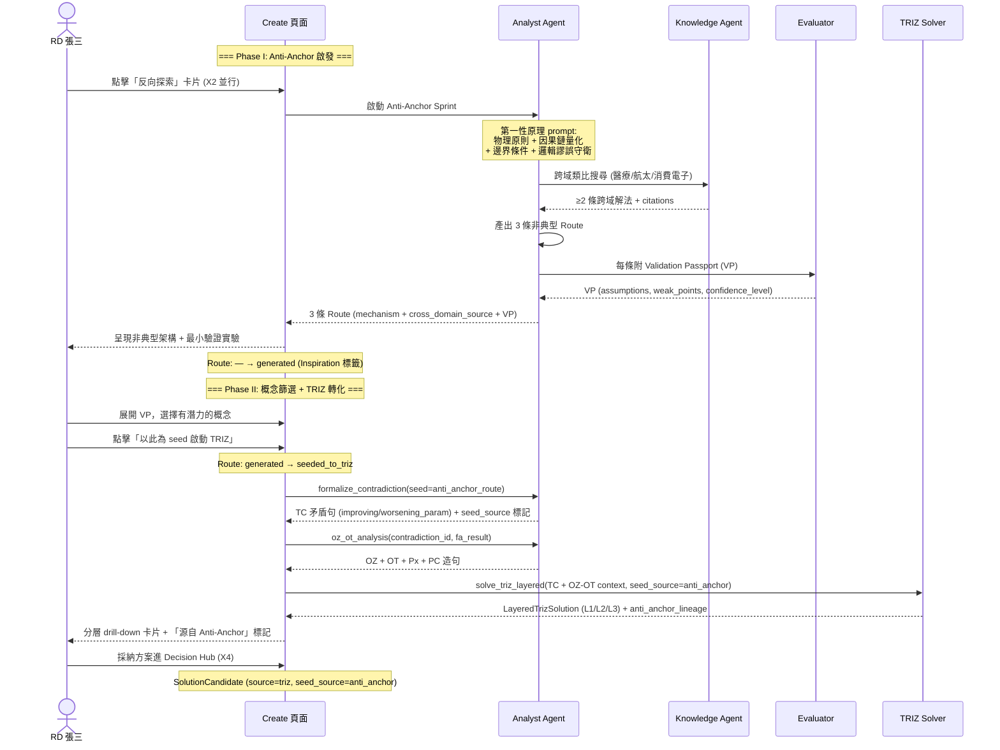
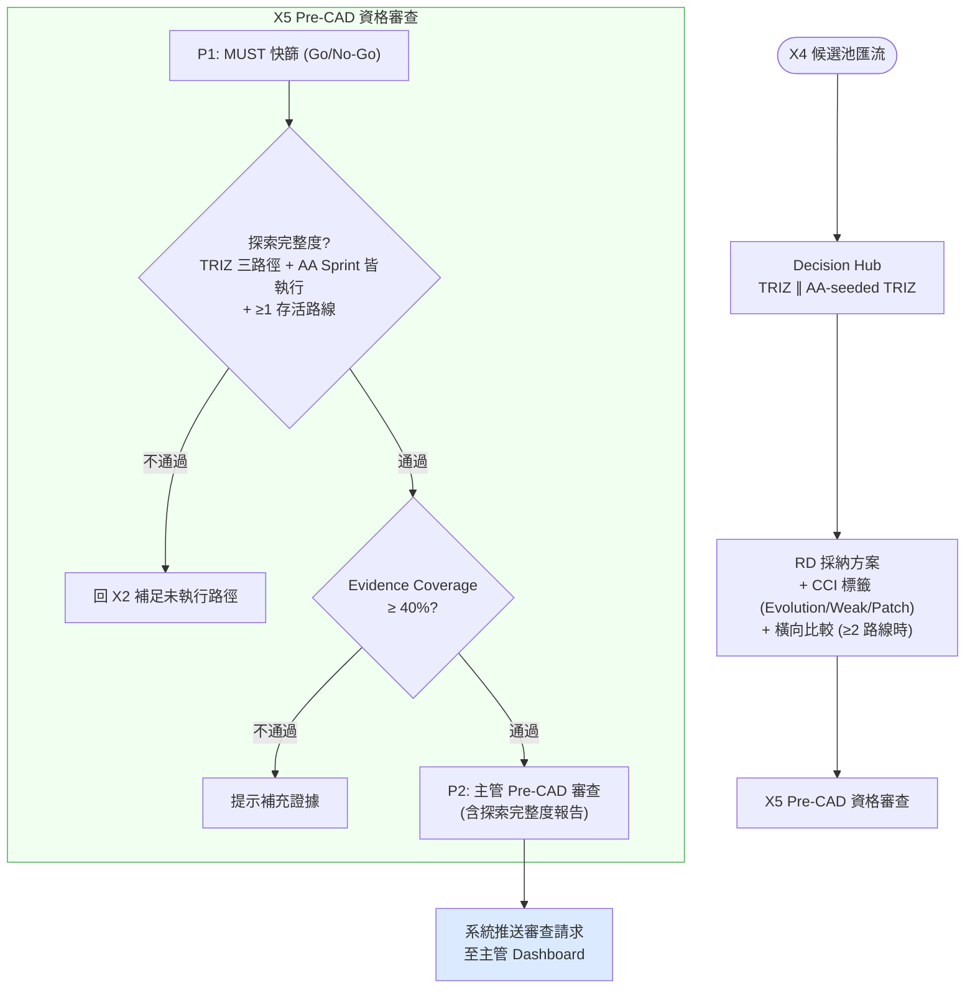
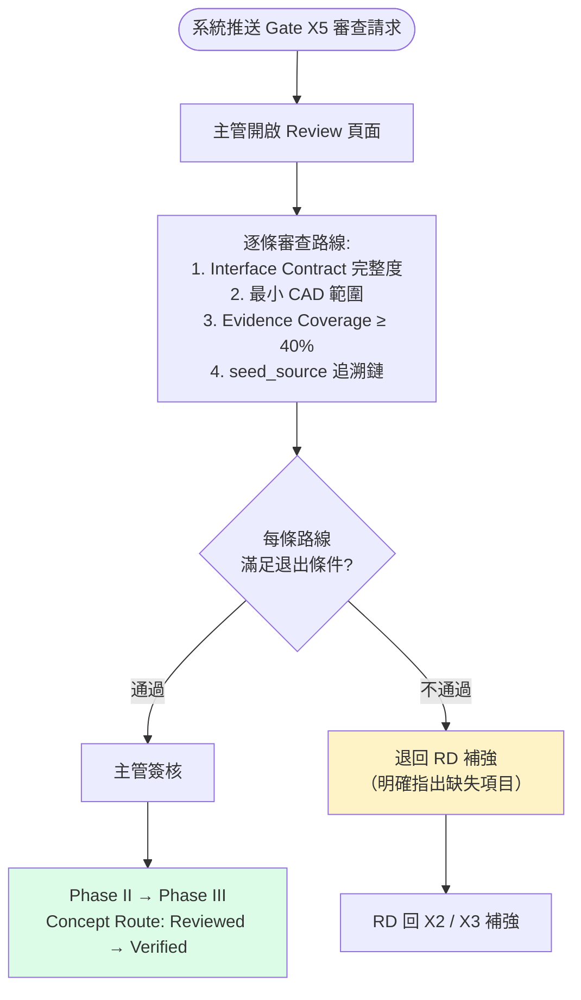

# E3 — 系統互動流程 (System Interaction Flow)

> **版本**: v2.0 | **日期**: 2026-04-27
> **定位**: 本文檔是 [E3 架構](E3--architecture-and-design.md) 的 **user-facing 視角**，對照 [00-discover/E1x--user-journey-map](../00-discover/E1x--user-journey-map.md)（現狀痛點）描繪 **設計後的目標體驗流**。
> **範疇**: 從使用者動作 → 跨子系統互動 → State Machine 狀態轉換的 end-to-end 任務流程。
> **來源**: 從 `../00-discover/E1--project-brief-and-prd.md` §2.4 Day-in-the-Life 與 `E3--architecture-and-design.md` Appendix A–E 推導，不引入新流程設計。
>
> **v2.0 變更 (2026-04-27)**：
> - 採用 D/X/V 三段式步驟編號（D = Define、X = eXplore、V = Verify），取代舊 Step 1–8 編號
> - 對齊 `E3--ai-agent-detailed-design.md` v2.2/v10 簡化：2c 併入 D3、Anti-Anchor/OZ-OT 併入 X2、MUST 併入 X5
> - Scenario 2 重新定位：Anti-Anchor 為 X2 的並行 seed 來源（非獨立步驟）

---

## §0 為什麼需要這份文件

| 現有文件 | 視角 | 回答的問題 |
|---------|------|-----------|
| `00-discover/E1x--user-journey-map` | **現狀痛點** | 使用者今天怎麼痛苦？ |
| `01-define/E3--architecture-and-design` Appendix A-E | **SA 架構** | 系統內部如何運作？（子系統、Container、Component） |
| `01-define/E3--architecture-and-design` Appendix D State Machine | **流程狀態機** | Artifact 如何流轉？ |
| `02-design/specs/ux/E5x--create-ux-spec` | **UI 規格** | 單一頁面長什麼樣？ |
| **本文件 (E3)** | **目標使用者流** | 使用者在設計後系統上**怎麼走完一個任務**？跨了哪些子系統？觸發哪些狀態？ |

**缺口補齊**：E3 附錄描述「系統本身怎麼設計」，本文件描述「使用者如何使用設計後的系統」，連接 WHY（痛點）與 HOW（架構）。

---

## §0.1 步驟編號對照表

> 對齊 `E3--ai-agent-detailed-design.md` v2.2 §11.2 步驟表。

| 新編號 | 名稱 | 舊編號 | 階段 |
|--------|------|--------|------|
| **D1** | 問題界定 | Step 1 | Define |
| **D2** | 理解全貌 | Step 2 | Define |
| **D3** | 根因分析與功能建模 | Step 2b *(含舊 2c FA)* | Define |
| **D4** | 系統建模 | Step 3 | Define |
| **X1** | 假設與驗證規劃 | Step 4 | eXplore |
| **X2** | TRIZ 解矛盾 (含 Anti-Anchor 並行 + OZ-OT) | Step 5a *(含舊 5-0, 5a-0)* | eXplore |
| **X3** | 子系統定義 | Step 5b | eXplore |
| **X4** | Decision Hub | Step 5d | eXplore |
| **X5** | Pre-CAD 資格審查 | Step P *(含舊 5e MUST)* | eXplore |
| **V1** | 設計審查 | Step 6 | Verify |
| **V2** | 證據補齊（條件觸發） | Step 6e | Verify |
| **V3** | 決策與行動 | Step 7 | Verify |
| **V4** | 內化與傳達 | Step 8 | Verify |

---

## §1 目標狀態旅程總覽

對照 00-discover 痛點旅程的情緒低谷（發想 → 審查區間），以下是設計後的目標體驗。

> **v2.0 變更**：
> - 舊 Step 2c (FA) 併入 D3；舊 Step 5-0 (AA) 與 Step 5a-0 (OZ-OT) 併入 X2；舊 Step 5e (MUST) 併入 X5
> - X3（子系統定義）加入主流程圖（舊版遺漏）
> - V2（證據補齊）為條件觸發（V1→V3 直通 或 V1→V2→V3）

**設計後情緒曲線對比現狀**：發想階段（X2）情緒由焦躁 → 有工具支撐；審查階段（V1-V3）由緊張 → 有證據鏈可溯。

---

## §2 Scenario 1 — RD 用 Forward TRIZ 解矛盾

> **角色**: Persona 1 資深 RD 張三
> **觸發**: 收到 Brief，識別出「功率密度 vs. 散熱面積」矛盾
> **對齊痛點**: PP-1 經驗鎖定、PP-2 假設隱藏
> **對應 PRD**: §2.4 Day-in-the-Life 場景 + E3 Appendix B (Forward TRIZ Solver)
> **合約更新**: 依 [ADR-007](adrs/ADR-007-tc-only-explore-pc-sf-derivation-in-create.md)（2026-04-15），Explore 階段矛盾識別改為 **TC-only**；PC/SF 於 Create 階段 `solve_triz_layered` 入口自 TC 派生，使用者不再需要「選擇 TC/PC/SF」。
> **ADR-008 補充 (2026-04-27)**：所有 Agent LLM 輸出中的數值聲明會透過 `EvidenceRegistryService.register_claim()` 自動註冊並交叉驗證（Tavily WebSearch），標記 VERIFIED / APPROXIMATE / UNVERIFIED。此為跨步驟 cross-cutting 行為，不逐一標示於下方序列圖中。
> **ADR-006 補充 (2026-04-27)**：TRIZ Layered 解題管線（L1→Critic→L2→L3）已由 `harness/orchestrator.py` 後端編排（非 client-driven），前端仍驅動產品級 Step 流轉。

### 2.1 Sequence Diagram

### 2.2 跨子系統互動對照

> **頁面軌跡**：P01 Auth → P03 ProjectList → P04 Dashboard → P08 Create (Step 0–4)

| 使用者動作 | 觸發子系統 (Appendix) | 觸發狀態轉換 (State Machine) |
|-----------|---------------------|----------------------------|
| 上傳 Brief (D1) | Knowledge Agent (E3--architecture-and-design.md §11.5.2) | DRAFT → PHASE_I |
| 確認約束 (D1) | Analyst Agent | Constraint: Draft → Reviewed (Gate D1) |
| 執行 5 Why / KT (D3) | Analyst Agent | — (中間產物，不觸發狀態轉換) |
| 執行 FA 功能建模 (D3) | Analyst Agent | FunctionModel: — → Generated |
| 校準矛盾 (D4) | Analyst + TRIZ Solver | Contradiction: Reviewed → Verified (Gate D4) |
| 執行 OZ-OT 分析 (X2) | Analyst Agent | OzOtResult: — → Px Locked / Px Not Found |
| Anti-Anchor 並行啟發 (X2) | Analyst + Knowledge | Route: — → generated (Inspiration) |
| 啟動 TRIZ (X2) | Forward TRIZ Solver (Appendix B) | TrizSuggestion: pending → generated |
| 採納 L2 路線 | Evaluator (VP 生成) | Concept Route: — → Draft |
| CCI 複雜度檢查 | TRIZ Solver | ComplexityCheck: — → Evolution / Weak Evolution / Patch |
| 候選進入 Decision Hub (X4) | Decision Hub | SolutionCandidate: — → adopted（後續 X5 見 §4） |

---

## §3 Scenario 2 — RD 用 Anti-Anchor 啟發非典型概念，經 TRIZ 轉化為工程方案

> **角色**: Persona 1 資深 RD 張三（或新人）
> **觸發**: 想避免「太快收斂到安全牌」
> **對齊痛點**: PP-1 經驗鎖定（最高優先級）
> **對應**: E3 Appendix C (Reverse Anti-Anchor) → Appendix B (Forward TRIZ Solver)
> **v2.0 說明**: Anti-Anchor 為 X2 的並行 seed 來源（非獨立步驟）。本 Scenario 描述 AA-seeded TRIZ 的完整子流程。

### 3.1 Sequence Diagram

### 3.2 跨子系統互動對照

> **頁面軌跡**：P04 Dashboard → P08 Create (Step 0 Anti-Anchor → Step 1 TRIZ) → P07 Track

| 使用者動作 | 觸發子系統 | 觸發狀態轉換 |
|-----------|-----------|-------------|
| 點擊反向探索 | Reverse Anti-Anchor (Appendix C) | Route: — → pending |
| AI 產出 Route | Analyst + Knowledge | Route: pending → generated (Inspiration) |
| VP 生成 | Evaluator | VP 附加至 Route |
| 展開 VP 篩選概念 | UI (Create 頁面) | 檢視 assumptions/confidence |
| **以概念為 seed 啟動 TRIZ** | **Analyst (formalize_contradiction)** | **Route: generated → seeded_to_triz; Contradiction: — → Verified** |
| **OZ-OT 分析** | **Analyst Agent** | **OzOtResult: — → Px Locked** |
| **TRIZ 三層求解** | **Forward TRIZ Solver (Appendix B)** | **LayeredTrizSolution: — → generated** |
| 進入 Decision Hub | Decision Hub | SolutionCandidate (source=triz, seed_source=anti_anchor) |

**Anti-Anchor 啟發閾值**：三條概念路線中至少一條「非對標」（物理機制與現有方案不同源）；若全部為同源變形，回退重新發散。篩選後的 seed 進入 TRIZ 流程，不再需要獨立通過 M1/M4 — 品質檢查由 TRIZ 流程的 Critic + CCI 負責。

### 3.3 設計決策：為什麼 Anti-Anchor 不直接進 Decision Hub

> **v1.2 變更** (2026-04-27)：Anti-Anchor 路線從「直入 Decision Hub」改為「seed → TRIZ 轉化 → Decision Hub」。

**根因分析（第一性原理）**：

Anti-Anchor 的定位是啟發工具（打破路徑依賴），但 v1.0/v1.1 的流程將其產出直接放入 Decision Hub 與 TRIZ 方案並列比較。Decision Hub 下游的 Gate X5 要求 Interface Contract + 最小 CAD 範圍 + Evidence Coverage ≥ 40%，Anti-Anchor 路線天生缺乏這些交付物（因為它跳過了 OZ-OT、子系統分解、Evidence Registry 等步驟），導致下游審查迴圈浪費預估 10-18 天，且 PP-3（風險後置）、PP-4（決策不可追溯）迴歸。

**修正原則**：讓啟發歸啟發、工程歸工程。Anti-Anchor 負責「看到不一樣的」，TRIZ 負責「做得出來的」。

**保留的 Anti-Anchor 價值**：
- `seed_source` 標記全程可追溯（`SolutionCandidate.seed_source = "anti_anchor"`）
- VP 的 `cross_domain_source` 欄位保留，在 TRIZ L1 查矩陣時作為額外 context
- `seed_source=anti_anchor` 的 TRIZ 方案在候選池中可追溯，確保不全部收斂為同源方案

---

## §4 Scenario 3 — Decision Hub 品質評估 + Pre-CAD Gate 審查

> **v1.3 變更**：Phase B 收斂掃描已退役（v9）。其 5 項檢查全部由 SIM 矩陣（ADR-008 D5）和 CCI（ADR-008 D4）前置覆蓋。Decision Hub 流程簡化為：RD 採納 → CCI 標籤 → 橫向比較（≥2 路線時） → MUST 快篩 → 探索完整度 → Evidence Coverage → Gate X5。
> **v2.0 變更**：MUST 快篩從獨立步驟（舊 Step 5e）併入 X5 作為 P1 自動篩階段。
> **v2.1 變更**：Architecture Health Monitor 回歸 X2（對齊 Appendix D state machine `SX2_health`）；X4 移除循環矛盾分支（SIM §5.3 + Section 7 已前置攔截）；X5 RouteCheck 從「≥3 路線」改為「探索完整度」（衡量 process 而非 output count）+ 移除矛盾數分流（Pre-CAD Confidence = 100% 使「矛盾≥2」不可達）。
> `seed_source=anti_anchor` 的 TRIZ 方案在候選池中保留追溯標記。

### 4.1 Decision Hub 品質評估（RD 張三 主導）

> **角色**: Persona 1 RD 張三
> **觸發**: Decision Hub 已匯流候選路線（TRIZ-only + AA-seeded TRIZ）
> **對齊痛點**: PP-3 風險後置
> **對應**: E3 Appendix D State Machine + Appendix E Decision Hub

**Decision Hub 品質評估互動對照**

> **頁面軌跡**：P08 Create (Step 4 Decision Hub → Step 5 MUST) → P09 PreCadReview → P12 DecisionRecord

| 使用者動作 | 角色 | 觸發子系統 | 觸發狀態轉換 |
|-----------|------|-----------|-------------|
| 採納方案 + 檢視 CCI 標籤 | RD 張三 | Decision Hub (CCI overlay) | SolutionCandidate: — → adopted；CCI 標籤為資訊性（Evolution / Weak Evolution / Patch） |
| P1: MUST 快篩 | 系統自動 | Evaluator | Concept Route 逐條 Go/No-Go |
| 探索完整度檢查 | 系統自動 | Evaluator | TRIZ 三路徑 + AA Sprint 皆執行 + ≥1 存活路線；不通過 → 回 X2 補足未執行路徑 |
| Evidence Coverage 檢查 | 系統自動 | EvidenceRegistryService | **Evidence Coverage ≥ 40%**（VERIFIED + APPROXIMATE 佔比，ADR-008 D3）；未達標則提示補充證據 |
| 檢視 CCI 標籤 | RD 張三 | Decision Hub (CCI overlay) | — （資訊性，不觸發狀態轉換；顯示 Evolution / Weak Evolution / Patch 分類） |
| 推送審查請求 | 系統自動 | Notification Service | Gate X5: — → Pending Review（探索完整度 + Evidence Coverage 均通過後觸發） |

### 4.2 Gate X5 審查（RD 主管 李四 主導）

> **角色**: Persona 2 RD 主管 李四
> **觸發**: 系統在探索完整度 + Evidence Coverage 通過後，自動推送 Gate X5 審查請求至主管 Dashboard
> **使用介面**: Review 頁面（非 Create 頁面）
> **對齊痛點**: PP-4 決策不可追溯、PP-6 證據缺口不可見
> **對應**: E3 Appendix D State Machine (Gate X5) + `Pre_CAD_Review_Template`

**Gate X5 審查互動對照**

| 使用者動作 | 角色 | 觸發子系統 | 觸發狀態轉換 |
|-----------|------|-----------|-------------|
| 收到審查通知 | 系統 → 主管 | Notification Service | — |
| 開啟 Review 頁面 | RD 主管 李四 | UI (Review 頁面) | — |
| 逐條審查 Interface Contract + CAD 範圍 | RD 主管 李四 | Human-in-the-Loop | — |
| 簽核 Pre-CAD | RD 主管 李四 | Human-in-the-Loop | Concept Route: Reviewed → Verified; Pre-CAD Report: Draft → Reviewed; **PHASE_II → PHASE_III** |
| 退回補強 | RD 主管 李四 | Human-in-the-Loop | Gate X5: Pending Review → Returned（附退回理由） |

---

## §5 跨子系統互動總表

彙整本文件三個 scenario 中使用者動作與子系統/State Machine 的完整對應。

| Step | 使用者動作 | 頁面 | Primary Subsystem | 觸發 Agent | Artifact 狀態轉換 | 參照 (`E3--architecture-and-design.md`) |
|------|-----------|-------------------|-----------|------------------|---------------------------------------|
| D1 | 上傳 Brief 與素材 | P05 | — | Knowledge + Analyst | Constraint: — → Draft → Reviewed | §11.5.2 Agent-Tool 綁定 |
| D2 | 參與蘇格拉底問答 | P06 | — | Analyst | Contradiction: Draft → Reviewed | §11.4.1 主流程序列圖 |
| D3 | 根因分析 (5Why/KT) + 功能建模 (FA) | P06 | — | Analyst | FunctionModel: — → Generated | §11.2 逐步自動化分級 |
| D4 | 校準 TRIZ 矛盾句 | P06 | Forward TRIZ Solver | TRIZ Solver + Analyst | Contradiction: Reviewed → Verified | Appendix B |
| X1 | 填寫假設台帳 | P07 | — | Analyst + Knowledge | Assumption: Reviewed → Verified | §11.2 逐步自動化分級 |
| X2 並行 | 啟動 Anti-Anchor 啟發 | P08 | Reverse Anti-Anchor | Analyst + Knowledge | Route: — → generated (Inspiration) | Appendix C |
| X2 (AA seed) | 以 AA 概念為 seed 啟動 TRIZ | P08 | Forward TRIZ (seeded) | Analyst + TRIZ Solver | Route: generated → seeded_to_triz; LayeredTrizSolution: — → generated | Appendix B + C |
| X2 | 啟動 TRIZ 三路徑 | P08 | Forward TRIZ | TRIZ Solver | LayeredTrizSolution: — → generated | Appendix B |
| X3 | 定義子系統 | P08 | Forward Subsystem Discovery | Analyst | Subsystem: — → Draft (3-level) | Appendix A |
| ~~5c~~ | ~~SCAMPER 變形~~ | — | — | — | *(v9 移除)* | — |
| X4 | Decision Hub 採納 | P08 | 決策中心 | Evaluator | SolutionCandidate: — → adopted | Appendix E |
| X5 | P1 MUST 快篩 + P2 Pre-CAD 審查 | P09 | — | Evaluator + Human | Concept Route: Draft → Reviewed → Verified；**Phase II → III** | §11.2 + Appendix D |
| V1 | CAD 審查 + DR EM | P11 | — | Evaluator + Knowledge | Evidence Matrix: Draft → Verified | Appendix D |
| V2 | 證據補齊迴圈 | P11 | — | Knowledge | Evidence: Draft → Verified | Appendix D |
| V3 | KT 決策簽核 | P12 | — | Evaluator + Human | Decision Record: Draft → Reviewed；Concept Route: Verified → Baselined | Appendix D |
| V4 | 費曼內化 | P13 | — | Knowledge | Asset: — → Released；**Phase III → COMPLETED** | Appendix D |

---

## §6 對照 00-discover 痛點 → 設計後體驗

| 現狀痛點 (PP) | 現狀表現 | 目標體驗流對應點 | 緩解機制 |
|--------------|---------|-----------------|---------|
| PP-1 經驗鎖定 | 直覺搜尋過去方案 | Scenario 2 Anti-Anchor 啟發 → TRIZ 轉化 | Forced Divergence（啟發）+ TRIZ 收斂（工程化） |
| PP-2 假設隱藏 | 預設答案未明說 | Scenario 1 蘇格拉底七類提問 | Assumption Challenge (E3--architecture-and-design.md §11.3.2 機制 1) |
| PP-3 風險後置 | Proto 才爆問題 | Scenario 3 Decision Hub 品質評估 (X4) + X5 (P1 MUST + P2 Gate P) | SIM 矩陣前置跨矛盾衝突檢查 + CCI 複雜度判定 + 架構健康度（X2 SIM 出口，淨節點 >5 → 漸進回退 D3→D2→D1）；Anti-Anchor 經 TRIZ 工程化確保 OZ-OT + CCI 完備 |
| PP-4 決策不可追溯 | 半年後無法回溯 | Scenario 3 Validation Passport + KT Decision Record | 自動留痕（Artifact 狀態流轉） |
| PP-5 溝通斷層 | PM/RD/主管語言不同 | D1 約束改寫 + V4 費曼摘要 | 統一 Artifact schema |
| PP-6 證據缺口不可見 | 不知哪些需補數據 | Scenario 3 DR Evidence Matrix + Gate C | Evidence Level E0-E4 自動標記 |

---

## §7 連結與下一步

### 相關文件

| 文件 | 路徑 | 用途 |
|------|------|------|
| E3 架構主文件 | `E3--architecture-and-design.md` | §11.4.1 主流程序列圖、Appendix A–E |
| E1x 現狀使用者旅程 | `../00-discover/E1x--user-journey-map.md` | 痛點對照基準 |
| Create UX Spec | `../02-design/specs/ux/E5x--create-ux-spec.md` | UI 規格細節 |

### 下一步

- [ ] 訪談驗證後，更新 §6 痛點緩解對照表的實際效益量測
- [ ] Scenario 新增：PM 王五（跨部門對齊）與 RD 主管（多專案儀表板）
- [ ] 與 02-design 其他頁面規格對齊（review / dashboard / gate pages）
