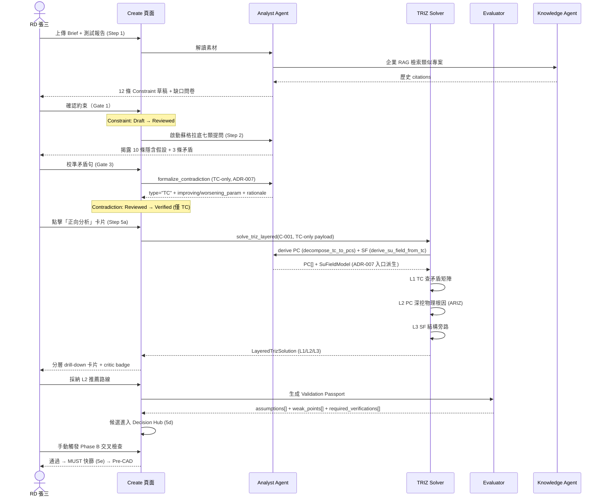
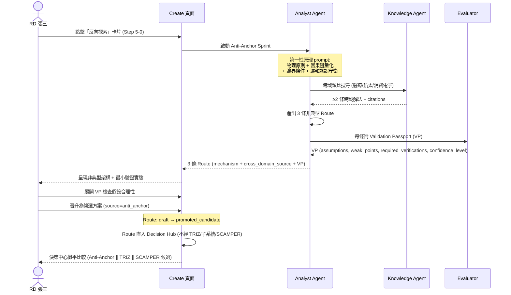
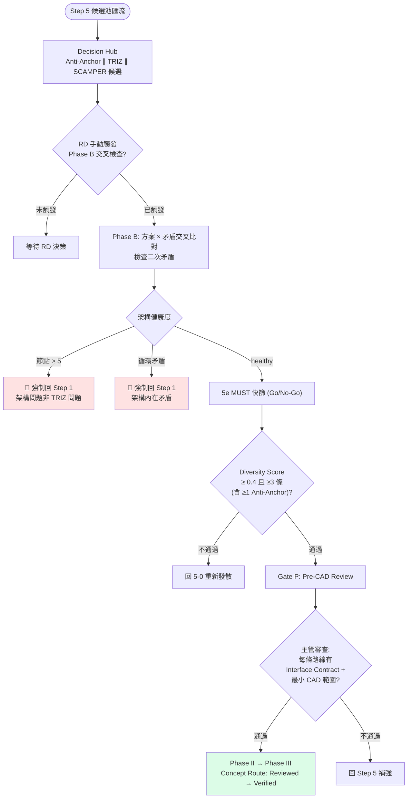

# E3 — 系統互動流程 (System Interaction Flow)

> **版本**: v1.0 | **日期**: 2026-04-15
> **定位**: 本文檔是 [E3 架構](E3--architecture-and-design.md) 的 **user-facing 視角**，對照 [00-discover/E1x--user-journey-map](../00-discover/E1x--user-journey-map.md)（現狀痛點）描繪 **設計後的目標體驗流**。
> **範疇**: 從使用者動作 → 跨子系統互動 → State Machine 狀態轉換的 end-to-end 任務流程。
> **來源**: 從 `../00-discover/E1--project-brief-and-prd.md` §2.4 Day-in-the-Life 與 `E3--architecture-and-design.md` Appendix A–E 推導，不引入新流程設計。

---

## §0 為什麼需要這份文件

| 現有文件 | 視角 | 回答的問題 |
|---------|------|-----------|
| `00-discover/E1x--user-journey-map` | **現狀痛點** | 使用者今天怎麼痛苦？ |
| `01-define/E3--architecture-and-design` Appendix A-E | **SA 架構** | 系統內部如何運作？（子系統、Container、Component） |
| `01-define/E3--architecture-and-design` Appendix D State Machine | **流程狀態機** | Artifact 如何流轉？ |
| `02-design/specs/ux/E5x--create-ux-spec` | **UI 規格** | 單一頁面長什麼樣？ |
| **本文件 (E3)** | **目標使用者流** | 使用者在設計後系統上**怎麼走完一個任務**？跨了哪些子系統？觸發哪些狀態？ |

**缺口補齊**：E3 附錄描述「系統本身怎麼設計」，本文件描述「使用者如何使用設計後的系統」，連接 WHY（痛點）與 HOW（架構）。

---

## §1 目標狀態旅程總覽

對照 00-discover 痛點旅程的情緒低谷（發想 → 審查區間），以下是設計後的目標體驗。

```mermaid
graph LR
    S1["Step 1<br/>問題界定<br/>Constraint"] --> S2["Step 2-3<br/>理解全貌+建模<br/>Contradiction"]
    S2 --> S4["Step 4<br/>假設驗證規劃<br/>Assumption"]
    S4 --> S5["Step 5<br/>雙軌分析<br/>Anti-Anchor ∥ TRIZ"]
    S5 --> S5d["Step 5d<br/>Decision Hub<br/>候選池匯流"]
    S5d --> SP["Step P<br/>Pre-CAD 審查<br/>Concept Route"]
    SP --> S6["Step 6<br/>CAD 審查<br/>Evidence Matrix"]
    S6 --> S7["Step 7<br/>KT 決策<br/>Decision Record"]
    S7 --> S8["Step 8<br/>費曼內化<br/>Asset"]

    style S1 fill:#E0F2FE
    style S5 fill:#FEF3C7
    style S5d fill:#FEF3C7
    style SP fill:#DCFCE7
    style S6 fill:#DCFCE7
    style S7 fill:#E9D5FF
```

**設計後情緒曲線對比現狀**：發想階段（Step 5）情緒由 😤 焦躁 → 😊 有工具支撐；審查階段（Step 6-7）由 😰 緊張 → 😌 有證據鏈可溯。

---

## §2 Scenario 1 — RD 用 Forward TRIZ 解矛盾

> **角色**: Persona 1 資深 RD 張三
> **觸發**: 收到 Brief，識別出「功率密度 vs. 散熱面積」矛盾
> **對齊痛點**: PP-1 經驗鎖定、PP-2 假設隱藏
> **對應 PRD**: §2.4 Day-in-the-Life 場景 + E3 Appendix B (Forward TRIZ Solver)
> **合約更新**: 依 [ADR-007](adrs/ADR-007-tc-only-explore-pc-sf-derivation-in-create.md)（2026-04-15），Explore 階段矛盾識別改為 **TC-only**；PC/SF 於 Create 階段 `solve_triz_layered` 入口自 TC 派生，使用者不再需要「選擇 TC/PC/SF」。

### 2.1 Sequence Diagram

### 2.2 跨子系統互動對照

| 使用者動作 | 觸發子系統 (Appendix) | 觸發狀態轉換 (State Machine) |
|-----------|---------------------|----------------------------|
| 上傳 Brief | Knowledge Agent (E3--architecture-and-design.md §11.5.2) | DRAFT → PHASE_I |
| 確認約束 | Analyst Agent | Constraint: Draft → Reviewed (Gate 1) |
| 校準矛盾 | Analyst + TRIZ Solver | Contradiction: Reviewed → Verified (Gate 3) |
| 啟動 TRIZ | Forward TRIZ Solver (Appendix B) | TrizSuggestion: pending → generated |
| 採納 L2 路線 | Evaluator (VP 生成) | Concept Route: — → Draft |
| 觸發 Phase B | Decision Hub | Convergence Phase B 執行 |
| 通過 MUST | Evaluator | Concept Route: Draft → Reviewed (Gate P 前置) |

---

## §3 Scenario 2 — RD 用 Reverse Anti-Anchor 探索非典型架構

> **角色**: Persona 1 資深 RD 張三（或新人）
> **觸發**: 想避免「太快收斂到安全牌」
> **對齊痛點**: PP-1 經驗鎖定（最高優先級）、PP-3 風險後置
> **對應**: E3 Appendix C (Reverse Anti-Anchor Architecture)

### 3.1 Sequence Diagram

### 3.2 跨子系統互動對照

| 使用者動作 | 觸發子系統 | 觸發狀態轉換 |
|-----------|-----------|-------------|
| 點擊反向探索 | Reverse Anti-Anchor (Appendix C) | Route: — → pending |
| AI 產出 Route | Analyst + Knowledge | Route: pending → generated |
| VP 生成 | Evaluator | VP 附加至 Route |
| 展開 VP | UI (Create 頁面) | 檢視 assumptions/weak_points |
| 晉升候選 | Decision Hub | Route: generated → promoted_candidate |
| 進入決策中心 | Decision Hub | SolutionCandidate (source=anti_anchor) 建立 |

**Anti-Anchor Gate 閾值**：三條概念路線中至少一條「非對標」且通過 M1（空間約束）+ M4（解耦程度）；否則回退重新發散。

---

## §4 Scenario 3 — RD 主管在 Pre-CAD Gate 做收斂審查

> **角色**: Persona 2 RD 主管 李四
> **觸發**: Step 5 候選池已匯流 3+ 條路線，需縮至 3-5 條進入 CAD
> **對齊痛點**: PP-4 決策不可追溯、PP-6 證據缺口不可見
> **對應**: E3 Appendix D State Machine (Gate P) + `Pre_CAD_Review_Template`

### 4.1 Flow Diagram

### 4.2 跨子系統互動對照

| 使用者動作 | 觸發子系統 | 觸發狀態轉換 |
|-----------|-----------|-------------|
| RD 觸發 Phase B | Decision Hub + Analyst (收斂圖) | Convergence Phase B 啟動 |
| 架構健康度監控 | Analyst Agent | 節點>5 或循環 → 🛑 回 Step 1 |
| MUST 快篩 | Evaluator | Concept Route 逐條 Go/No-Go |
| Diversity Score 計算 | Evaluator | DS ≥ 0.4 門檻檢查 |
| 主管簽核 Pre-CAD | Human-in-the-Loop | Concept Route: Reviewed → Verified；Pre-CAD Report: Draft → Reviewed；**PHASE_II → PHASE_III** |

---

## §5 跨子系統互動總表

彙整本文件三個 scenario 中使用者動作與子系統/State Machine 的完整對應。

| Step | 使用者動作 | Primary Subsystem | 觸發 Agent | Artifact 狀態轉換 | 參照 (`E3--architecture-and-design.md`) |
|------|-----------|-------------------|-----------|------------------|---------------------------------------|
| 1 | 上傳 Brief 與素材 | — | Knowledge + Analyst | Constraint: — → Draft → Reviewed | §11.5.2 Agent-Tool 綁定 |
| 2 | 參與蘇格拉底問答 | — | Analyst | Contradiction: Draft → Reviewed | §11.4.1 主流程序列圖 |
| 3 | 校準 TRIZ 矛盾句 | Forward TRIZ Solver | TRIZ Solver + Analyst | Contradiction: Reviewed → Verified | Appendix B |
| 4 | 填寫假設台帳 | — | Analyst + Knowledge | Assumption: Reviewed → Verified | §11.2 逐步自動化分級 |
| 5-0 | 啟動 Anti-Anchor | Reverse Anti-Anchor | Analyst + Knowledge | Route: — → generated → promoted_candidate | Appendix C |
| 5a | 啟動 TRIZ 三路徑 | Forward TRIZ | TRIZ Solver | LayeredTrizSolution: — → generated | Appendix B |
| 5b | 定義子系統 | Forward Subsystem Discovery | Analyst | Subsystem: — → Draft (3-level) | Appendix A |
| 5c | SCAMPER 變形 | Forward Subsystem | TRIZ Solver + Knowledge | SCAMPER Candidate: — → generated | Appendix E |
| 5d | Decision Hub 採納 | 決策中心 | Evaluator | SolutionCandidate: — → adopted | Appendix E |
| 5e | MUST 快篩 | — | Evaluator | Concept Route: Draft → Reviewed | §11.2 逐步自動化分級 |
| P | Pre-CAD 審查 | — | Evaluator + Human | Concept Route: Reviewed → Verified；**Phase II → III** | Appendix D |
| 6 | CAD 審查 + DR EM | — | Evaluator + Knowledge | Evidence Matrix: Draft → Verified | Appendix D |
| 6e | 證據補齊迴圈 | — | Knowledge | Evidence: Draft → Verified | Appendix D |
| 7 | KT 決策簽核 | — | Evaluator + Human | Decision Record: Draft → Reviewed；Concept Route: Verified → Baselined | Appendix D |
| 8 | 費曼內化 | — | Knowledge | Asset: — → Released；**Phase III → COMPLETED** | Appendix D |

---

## §6 對照 00-discover 痛點 → 設計後體驗

| 現狀痛點 (PP) | 現狀表現 | 目標體驗流對應點 | 緩解機制 |
|--------------|---------|-----------------|---------|
| PP-1 經驗鎖定 | 直覺搜尋過去方案 | Scenario 2 Anti-Anchor + Scenario 1 TRIZ 跨域類比 | Forced Divergence + Anti-Anchor Gate |
| PP-2 假設隱藏 | 預設答案未明說 | Scenario 1 蘇格拉底七類提問 | Assumption Challenge (E3--architecture-and-design.md §11.3.2 機制 1) |
| PP-3 風險後置 | Proto 才爆問題 | Scenario 3 Pre-CAD Gate + 架構健康度監控 | Phase B 交叉檢查 + 節點>5 強停 |
| PP-4 決策不可追溯 | 半年後無法回溯 | Scenario 3 Validation Passport + KT Decision Record | 自動留痕（Artifact 狀態流轉） |
| PP-5 溝通斷層 | PM/RD/主管語言不同 | Step 1 約束改寫 + Step 8 費曼摘要 | 統一 Artifact schema |
| PP-6 證據缺口不可見 | 不知哪些需補數據 | Scenario 3 DR Evidence Matrix + Gate C | Evidence Level E0-E4 自動標記 |

---

## §7 連結與下一步

### 相關文件

| 文件 | 路徑 | 用途 |
|------|------|------|
| E3 架構主文件 | `E3--architecture-and-design.md` | §11.4.1 主流程序列圖、Appendix A–E |
| E1x 現狀使用者旅程 | `../00-discover/E1x--user-journey-map.md` | 痛點對照基準 |
| Create UX Spec | `../02-design/specs/ux/E5x--create-ux-spec.md` | UI 規格細節 |

### 下一步

- [ ] 訪談驗證後，更新 §6 痛點緩解對照表的實際效益量測
- [ ] Scenario 新增：PM 王五（跨部門對齊）與 RD 主管（多專案儀表板）
- [ ] 與 02-design 其他頁面規格對齊（review / dashboard / gate pages）
