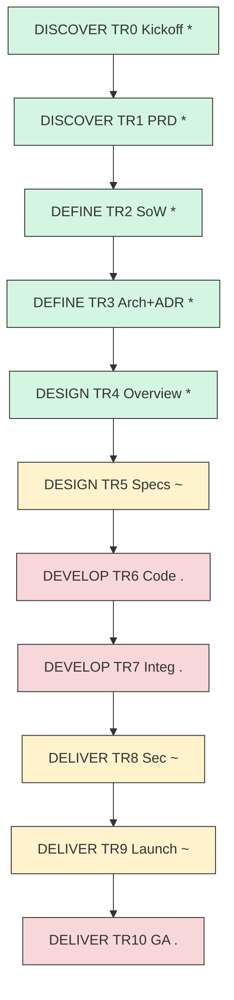

# 產品開發流程使用說明書 (Dual-Mode: Full Process / Lean MVP) — RD Design Copilot

---

**文件版本 (Document Version):** `v1.0`
**最後更新 (Last Updated):** `2026-04-15`
**主要作者 (Lead Author):** RD Copilot Core Team
**狀態 (Status):** `活躍 (Active)`

> 本文件為 VibeCoding 模板 `00_workflow_manual.md` 的專案落地版，將 Full Process / MVP 雙模式映射到本專案 5D 框架（DISCOVER → DEFINE → DESIGN → DEVELOP → DELIVER）。
> 原始模板：[`rd_assistant_design_system/VibeCoding_Workflow_Templates/00_workflow_manual.md`](../../rd_assistant_design_system/VibeCoding_Workflow_Templates/00_workflow_manual.md)
> 專案 gate 總覽：[`docs/README.md`](../README.md)

---

## 目錄 (Table of Contents)

- [1. 使用原則](#1-使用原則適用於兩種模式)
- [2. 模式選擇建議與升級規則](#2-模式選擇建議與升級規則)
- [3. 模式 A：完整流程 (Full Process)](#3-模式-a完整流程-full-process)
- [4. 模式 B：MVP 快速迭代 (Lean)](#4-模式-b-mvp-快速迭代-lean)
- [5. 文檔產出清單與模板映射](#5-文檔產出清單與模板映射)
- [6. Gate 準入/準出與度量](#6-gate-準入準出與度量兩種模式通用)
- [7. 附錄：檢查清單（摘錄）](#7-附錄檢查清單摘錄)
- [8. MVP 產出與格式規範](#8-mvp-產出與格式規範對齊-mvp_tech_specmd-與-development_progress_reportmd)

---

## 1. 使用原則（適用於兩種模式）

- **以文檔為契約**：本專案以 `docs/` 為 SSOT；所有 gate 決策回溯至對應 E1–E9 / GRx 文件。
- **小步快跑、可回溯**：ADR-001～ADR-005 已建立決策脈絡，見 [`01-define/adrs/`](../01-define/adrs/)。
- **風險前置、代價後置**：Pre-CAD Gate（見 [`02-design/specs/review-templates/E5x--pre-cad-review-template`](../02-design/specs/review-templates/E5x--pre-cad-review-template.md)）在開發前攔截設計偏差。
- **模式可升降級**：專案主幹採完整流程（E1–E9 齊備）；子模組（如 WS-G L3 Su-Field 平行旁路）允許 MVP 節奏。

**角色縮寫（RACI）：** PM、TL、ARCH、DEV、QA、SRE、SEC、OPS、DATA

**本專案模板映射（VibeCoding → 5D）：**
- 02 PRD → [`00-discover/E1--project-brief-and-prd.md`](../00-discover/E1--project-brief-and-prd.md)
- 04 ADR → [`01-define/adrs/`](../01-define/adrs/)
- 05 Architecture → [`01-define/E3--architecture-and-design.md`](../01-define/E3--architecture-and-design.md)
- 06 API / 07 Module Spec → [`02-design/specs/`](../02-design/_MOC.md)
- 08 Project Structure → TBD — <owner TBD> by <YYYY-MM-DD TBD>
- 13 Security & Readiness → `04-deliver/E8--security-and-readiness-checklists` (Planned)
- 14 Deployment & Ops → [`04-deliver/operations/`](../04-deliver/operations/) + `E9--deployment-and-operations-guide` (Draft)

---

## 2. 模式選擇建議與升級規則

- **本專案選擇：模式 A（完整流程）**，理由：
  - 涉及 RD 研發方法論專業知識（TRIZ/SCAMPER/KT）與企業內跨團隊協作
  - 長期維運需求（灰度上線 Runbook 已建立）
  - 需接入 BaaS（ADR-001）與 LLM 服務（ADR-003），含隱私種子文件審查
- **子模組 MVP 允許範圍**：WS-G L3 Su-Field 平行旁路、WS-F TC→多 PC 分解等探索性 workstream。
- 升級準則（MVP → 完整）：
  - 觸及使用者內容／專案資料外流風險（見 [`E1x--privacy-compliance-seed`](../00-discover/E1x--privacy-compliance-seed.md)）
  - 導入新外部 API 或跨團隊依賴
  - 產品由 PoC 轉為 BD 銷售標的（見 [`RD_Copilot_BD_Pitch_v1`](../00-discover/presentations/RD_Copilot_BD_Pitch_v1.md)）

---

## 3. 模式 A：完整流程（Full Process）

### A0 啟動與對齊（Kickoff）— 對應 DISCOVER TR0
- 目標：對齊商業目標、成功指標、邊界與風險。
- 產出：
  - [`E1x--stakeholder-brief`](../00-discover/E1x--stakeholder-brief.md)（合併自 Executive Summary + BD Pitch）
  - [`E1x--assumption-risk-register`](../00-discover/E1x--assumption-risk-register.md)
- 狀態：**已通過 TR0**（`*` 於 README gate view）

### A1 構想與規劃（PRD）— 對應 DISCOVER TR1
- 產出：[`00-discover/E1--project-brief-and-prd.md`](../00-discover/E1--project-brief-and-prd.md)（v3.0, Approved）
- 支援文件：
  - [`E1x--user-journey-map`](../00-discover/E1x--user-journey-map.md)
  - [`E1x--competitive-landscape`](../00-discover/E1x--competitive-landscape.md)
  - [`E1x--market-sizing`](../00-discover/E1x--market-sizing.md)（Draft — 待數據驗證）
  - [`E1x--user-research-synthesis`](../00-discover/E1x--user-research-synthesis.md)（Draft — 待訪談）
- Gate：**已通過 TR1**
- RACI：PM R/A, TL/ARCH C

### A2 高層次架構（SA + ADR）— 對應 DEFINE TR2/TR3
- 產出：
  - [`01-define/E2--statement-of-work.md`](../01-define/E2--statement-of-work.md)（Approved, TR2 passed）
  - [`01-define/E3--architecture-and-design.md`](../01-define/E3--architecture-and-design.md)（Approved, TR3 passed；含 Appendix A–E：Forward Subsystem Discovery / Forward TRIZ Solver / Reverse Anti-Anchor / State Machine / TRIZ→SCAMPER Flow）
  - ADR-001..005 見 [`01-define/adrs/`](../01-define/adrs/)
- 相關互動流：[`E3x--system-interaction-flow`](../01-define/E3--system-interaction-flow.md)
- Gate：**已通過 TR2、TR3**
- 待補：E4 ERD（Planned — [`01-define/diagrams/E4--06_erd`](../01-define/) TBD — <owner TBD> by <YYYY-MM-DD TBD>）

### A3 詳細設計（SDD + API）— 對應 DESIGN TR4/TR5
- 主文檔：[`02-design/E5--system-design-overview.md`](../02-design/E5--system-design-overview.md)（Active，TR4 Gate 主文）
- Specs（依領域）：
  - UX：[`specs/ux/E5x--create-ux-spec`](../02-design/specs/ux/E5x--create-ux-spec.md)
  - TRIZ：[`specs/triz/E5x--triz-layered-drilldown-optimization`](../02-design/specs/triz/E5x--triz-layered-drilldown-optimization.md)、[`E5x--triz-multi-solution-adoption-strategy`](../02-design/specs/triz/E5x--triz-multi-solution-adoption-strategy.md)
  - Explore：[`specs/explore/`](../02-design/_MOC.md)（TC↔PC 型別對照 / Subsystem 持久化 / 三層樹 review）
  - Review Templates：[`specs/review-templates/`](../02-design/_MOC.md)（MUST Rulebook / Pre-CAD / Evidence Matrix）
- Workflow：[`E6x--schema-codegen-workflow`](../02-design/E6x--schema-codegen-workflow.md)、[`E7x--e2e-manual-scripts/`](../02-design/E7x--e2e-manual-scripts/)
- Gate：**TR4 已通過；TR5 進行中（`~`）**

### A4 開發與驗證（Build & Verify）— 對應 DEVELOP TR6/TR7
- WBS：
  - 主 WBS（release 軸）[`E3--wbs-development-plan`](../01-define/E3--wbs-development-plan.md)
  - Feature workstreams：[`wbs-workstreams/`](../01-define/wbs-workstreams/README.md) — WS-D..H
- Migrations：[`03-develop/migrations/`](../03-develop/) (001 MUST criteria, 002 KPI current value, 003 evidence entries)
- Gate：**TR6 / TR7 尚未啟動（`.`）**；GR6 / GR7 模板待填
- RACI：DEV R、TL/QA A

### A5 安全與上線審查 (Quality Gate) — 對應 DELIVER TR8
- 產出：`04-deliver/E8--security-and-readiness-checklists` — **Planned**
- 種子：[`E1x--privacy-compliance-seed`](../00-discover/E1x--privacy-compliance-seed.md)
- Gate：進行中（`~`）；owner TBD — <owner TBD> by <YYYY-MM-DD TBD>

### A6 上線 (Launch) — 對應 DELIVER TR9/TR10
- 產出：
  - `04-deliver/E9--deployment-and-operations-guide`（Draft）
  - Runbooks：[`runbook_pc_decomposition`](../04-deliver/operations/runbook_pc_decomposition.md)、[`TRIZ_Layered_Rollout_Runbook`](../04-deliver/operations/TRIZ_Layered_Rollout_Runbook.md)
  - User Docs：[`E9x--user-manual-v0.1`](../04-deliver/E9x--user-manual-v0.1.md)
- Gate：TR9 進行中（`~`）、TR10 未啟動（`.`）；GR10 模板待填

### A* 跨階段：變更管理與文件治理
- ADR 與 Superseded：見 [`_superseded/_MOC`](../_superseded/_MOC.md)
- 會議決策：[`_meeting-minutes/`](../_meeting-minutes/)
- Gap 驗證：[`_gap-analysis/`](../_gap-analysis/)



---

## 4. 模式 B：MVP 快速迭代（Lean）

> 本專案整體不採 MVP 模式，但允許於探索性 workstream（WS-F / WS-G）採用。

### B0 Sprint 0：範圍界定與 Tech Spec
- 已發生案例：
  - WS-F TC→多 PC 分解，Tech Spec 內嵌於 [`specs/explore/E5x--tc-to-multipc-type-alignment`](../02-design/specs/explore/E5x--tc-to-multipc-type-alignment.md)
  - WS-G L3 Su-Field 平行旁路，設計內嵌於 [`specs/triz/E5x--triz-layered-drilldown-optimization`](../02-design/specs/triz/E5x--triz-layered-drilldown-optimization.md)
- RACI：TL R/A、DEV C

### B1-Bn 迭代循環
- 迭代節奏：以 workstream 為單位，定期同步於 `_meeting-minutes/`
- 最小可觀測性：log + `/api/v1/health` 健康檢查（狀態 TBD — <owner TBD> by <YYYY-MM-DD TBD>）
- 最小安全：Secrets 管理（ADR-001 BaaS 配置中心）

### Bx MVP 上線 Gate
- 輕量 Runbook 已就緒：見 [`04-deliver/operations/`](../04-deliver/operations/)
- 完整 E8 Security Checklist 仍為 Planned，升級為完整流程前不得正式上線。

升級提示：任一 WS 觸及使用者資料外流、跨團隊合約、或進入 BD 銷售軌道，立即回歸完整流程 A5/A6。

---

## 5. 文檔產出清單與模板映射

| 階段 (5D) | Gate | 模式 A（完整）實際產出 | 模式 B（MVP）退化產出 |
| :-- | :-- | :-- | :-- |
| DISCOVER | TR0-1 | E1 PRD + E1x 系列 | （不適用，主幹專案） |
| DEFINE | TR2-3 | E2 SoW、E3 Arch、ADR-001..005、WBS 主+Addendum | 內嵌於 spec |
| DESIGN | TR4-5 | E5 Overview、specs/{ux,triz,explore,review-templates} | spec 內 Tech Spec 區塊 |
| DEVELOP | TR6-7 | GR6 / GR7（Template）、migrations 001-003 | 手寫 diff + PR 說明 |
| DELIVER | TR8-10 | E8（Planned）、E9（Draft）、Runbooks、GR10 | MVP 輕量 checklist |

---

## 6. Gate 準入/準出與度量（兩種模式通用）

- **準入**：輸入文檔齊備、owner 已指派、風險已登記於 [`E1x--assumption-risk-register`](../00-discover/E1x--assumption-risk-register.md)
- **準出**：文檔完成度 ≥ 90%、審查簽核於 `_meeting-minutes/`、KPI 可驗證
- **本專案當前度量**（2026-04-15）：
  - Gates passed：TR0, TR1, TR2, TR3, TR4（5/11）
  - In progress：TR5, TR8, TR9（3/11）
  - Not started：TR6, TR7, TR10（3/11）
  - 需求變更：ADR-005 scope expansion 已記錄
  - 缺陷密度 / Lead Time / MTTR：TBD — <owner TBD> by <YYYY-MM-DD TBD>

---

## 7. 附錄：檢查清單（摘錄）

- **PRD**：E1 v3.0 已包含問題陳述、非目標、KPI。下一步為 market sizing 數據驗證。
- **架構**：ADR-001..005 + E3 Appendix A–E 已記錄權衡；NFR 可測性 TBD。
- **設計**：E5 overview + specs/triz/explore 已涵蓋；ERD (E4) 待補。
- **安全**：隱私種子已立，E8 checklist 未開工。
- **上線**：Runbook 已就緒，備份/告警演練 TBD — <owner TBD> by <YYYY-MM-DD TBD>。

---

本文件為本專案評審與交付的操作指南。預設採「模式 A：完整流程」，子模組允許「模式 B：MVP」，並明確標注升級機制。

---

## 8. MVP 產出與格式規範（對齊 `mvp_tech_spec.md` 與 `development_progress_report.md`）

> 本專案未採 MVP 主路徑，本節僅供子 workstream 採用 MVP 模式時使用。

### 8.1 核心文件總覽 (Core MVP Documents)

| 文件 (File) | 目的 | 本專案對應 | 主要負責人 |
| :--- | :--- | :--- | :--- |
| `docs/planning/mvp_tech_spec.md` | 子 WS 的唯一契約 | 內嵌於 `02-design/specs/<domain>/` | TL / PM |
| `docs/dev/development_progress_report.md` | 進度透明化 | 以 WBS 表格 + `_meeting-minutes/` 同步 | TL / DEV |
| `docs/launch/mvp_launch_checklist.md` | 輕量上線門禁 | [`04-deliver/operations/*Runbook.md`](../04-deliver/operations/) | SRE / OPS / TL |

### 8.2 通用規範 (General Specifications)

#### 8.2.1 命名與路徑
- 本專案命名慣例為 `E<n>[x]--kebab-case.md`，與 VibeCoding MVP 的 `kebab-case.md` 相容。
- 子 WS MVP 文件存放於 `02-design/specs/<domain>/`。

#### 8.2.2 文件標頭
- 本專案標頭範例（對齊 VibeCoding）：
  ```markdown
  > Version: 1.0.0
  > Date: 2026-04-15
  > Status: Active
  > Owner(s): TBD — <owner TBD>
  > Reviewers: TBD — <owner TBD>
  ```

#### 8.2.3 一致性規則
- API 契約以 `E5--system-design-overview.md` §2-3 為準。
- 指標名稱統一（例如 `API Response Time`、`Gate Pass Rate`）。

#### 8.2.4 版本與變更治理
- 語義化版本 + Git 提交訊息，重大變更寫入 `01-define/adrs/`。

### 8.3 文件結構範本
- `mvp_tech_spec.md` / `development_progress_report.md` / `mvp_launch_checklist.md` 骨架：見原模板 [`VibeCoding_Workflow_Templates/00_workflow_manual.md`](../../rd_assistant_design_system/VibeCoding_Workflow_Templates/00_workflow_manual.md) §8.3，本專案不重複。
