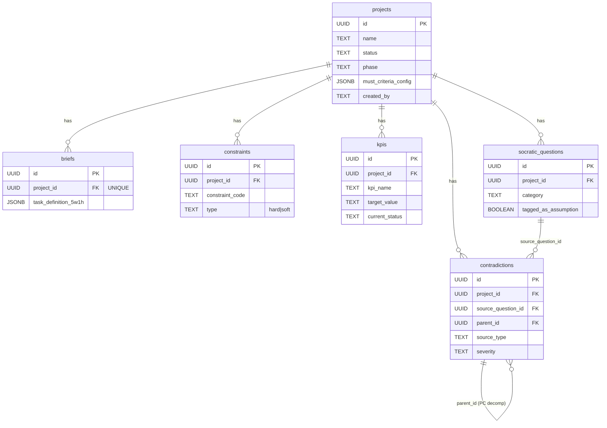
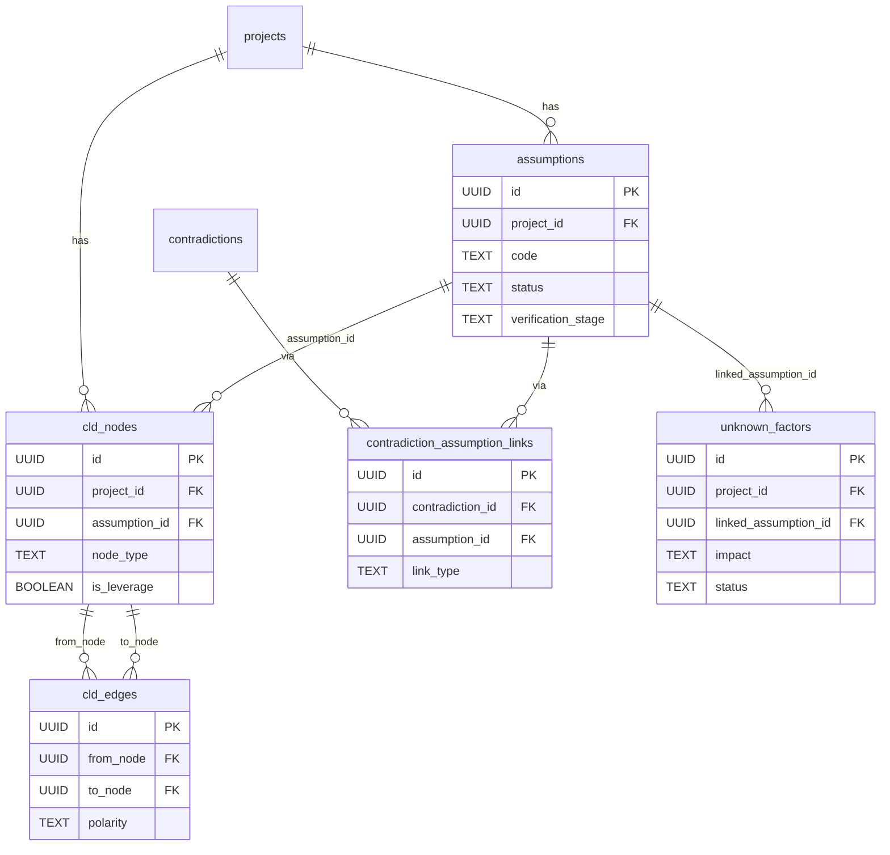
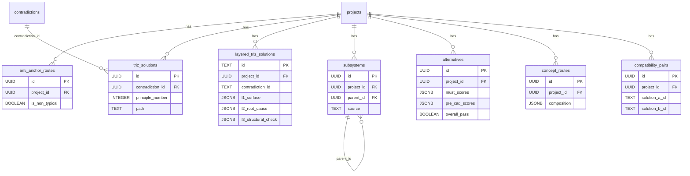
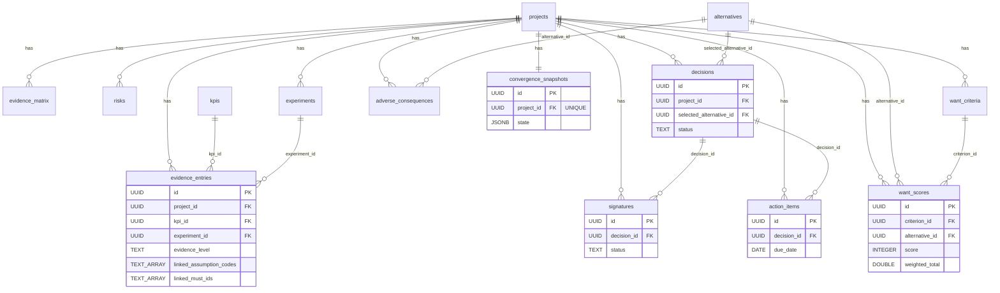
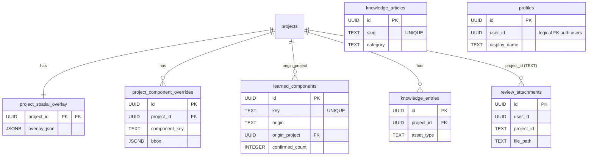

# E4 — Entity Relationship Diagram (ERD)

| Field     | Value                                                                 |
|-----------|-----------------------------------------------------------------------|
| Version   | v1.0                                                                  |
| Date      | 2026-04-15                                                            |
| Status    | Draft                                                                 |
| Gate      | TR3                                                                   |
| Owner     | Backend Lead TBD — by 2026-04-30 TBD                                   |
| 對應模板  | VibeCoding 05 · §5 數據架構（[E3 §5](../E3--architecture-and-design.md#5-數據架構)） |
| 素材來源  | `supabase/migrations/000_full_deploy.sql` + 增量 `001`–`010`          |

---

## §1 目的與範圍

本文件依 **Supabase migration SQL 實際欄位定義**（非 Pydantic 類別、非設計意圖）整理 RD Design Copilot 的資料模型 ERD。它回答三個問題：

1. 系統有哪些實體？依領域如何分組？
2. 實體之間的外鍵與參照關係為何？
3. 哪些表套用 RLS？政策模式是什麼？

**範圍**：
- 權威來源：`supabase/migrations/000_full_deploy.sql`（31 表一鍵部署）+ `001`–`010`（增量變更，3 張新表、若干 ALTER TABLE）。
- 不在範圍：Pydantic schemas.py 衍生模型（見 [E5 §Schema 映射](../../02-design/E5--api-design-specification.md)）、前端 TS 型別（見 [E6x codegen](../../02-design/E6x--schema-codegen-workflow.md)）。
- Supabase `auth.users` 被視為外部系統，不展開；`profiles.user_id` 邏輯上指向它。

**統計（以 migration 為準）**：
- Base 表：31（000_full_deploy）
- 增量新表：4（`contradiction_assumption_links`、`project_spatial_overlay`、`project_component_overrides`、`learned_components`、`layered_triz_solutions`）
- 總實體：約 36 張表（不含 `storage.*` 與 `auth.*`）

---

## §2 主要實體分組

依領域分 6 組。每組內的表共享 `project_id` scoping（除明確標註共享者外）。

### 2.1 Core（專案核心）
- `projects` — 專案根實體（含 MUST criteria config / phase / progress / gates_*）
- `profiles` — 使用者展示資料（`user_id` 邏輯 FK 指向 `auth.users`）
- `review_attachments` — Pre-CAD review 附件（對應 Supabase storage bucket `review-attachments`）

### 2.2 Problem Definition（Layer 1）
- `briefs` — 任務定義 5W1H（每專案唯一）
- `constraints` — 硬/軟約束
- `kpis` — KPI 目標 × 當前值 × 狀態
- `socratic_questions` — Socratic 問答 + AI 標籤建議
- `contradictions` — TRIZ 矛盾（含 `source_question_id`、`parent_id` PC 分解、su-field 欄位）

### 2.3 Assumption Management（Layer 2）
- `assumptions` — 假設冊（worst_consequence / validation / status / verification_stage）
- `cld_nodes` / `cld_edges` — 因果迴路圖（CLD）
- `contradiction_assumption_links` — N:N 矛盾↔假設 link（`depends_on` / `challenges` / `derived_from`）
- `unknown_factors` — 未知集合（持久化自 localStorage）

### 2.4 Solution Exploration（Layer 3）
- `anti_anchor_routes` — 反錨定路線（含 validation_passport 欄位，見 001 migration）
- `triz_solutions` — TRIZ 經典解矛盾輸出
- `layered_triz_solutions` — v7 分層 drill-down（L1/L2/L3 JSONB，見 010 migration）
- `subsystems` — 子系統樹（`parent_id` 自參照、interfaces）
- ~~`scamper_variants`~~ — ~~SCAMPER 七動作變體~~ **(v9 移除 — TRIZ 40 原理完全覆蓋)**
- `alternatives` — 備選方案（MUST/WANT scores、pre_cad_scores、CAD status）
- `concept_routes` — 概念路線組合
- `compatibility_pairs` — 解耦相容性檢查結果

### 2.5 Review & Decision（Layer 4）
- `evidence_matrix` — E0–E5 evidence level 矩陣
- `evidence_entries` — 量測值 entry（FK 到 kpis / experiments）
- `risks` — 風險（probability × severity）
- `experiments` — 實驗計畫與結果
- `decisions` — 決策記錄（FK 選定 alternative）
- `want_criteria` / `want_scores` — WANT 權重 + 評分
- `adverse_consequences` — 不利後果（FK alternatives）
- `signatures` — 電子簽核（FK decisions）
- `action_items` — 會議行動項（FK decisions）
- `convergence_snapshots` — 收斂迴圈狀態快照（每專案唯一）

### 2.6 Knowledge & Spatial（Layer 5 + 空間資源）
- `knowledge_articles` — 全域共享文章（category / slug / tags）
- `knowledge_entries` — 專案內知識 entry
- `project_spatial_overlay` — what-if 空間包絡（每專案唯一）
- `project_component_overrides` — RD 手動覆寫元件尺寸（per project）
- `learned_components` — 全域學習到的元件尺寸庫

---

## §3 Mermaid ERD 圖

拆成 5 張子圖避免單張過大。每張只畫該領域主要外鍵；跨領域關聯在 §4 清單列出。

### 3.1 Core × Problem Definition

### 3.2 Assumption Management

### 3.3 Solution Exploration

### 3.4 Review & Decision

### 3.5 Knowledge × Spatial × Auth

---

## §4 關鍵關聯與外鍵清單

只列跨表 FK（自參照 + 一般 FK），依 migration 實際 `REFERENCES` 子句整理。

| # | From (table.column)                                | To (table.column)                  | On Delete     | Notes                               |
|---|----------------------------------------------------|------------------------------------|---------------|-------------------------------------|
| 1 | `briefs.project_id`                                 | `projects.id`                      | CASCADE       | UNIQUE(project_id) 一對一           |
| 2 | `constraints.project_id`                            | `projects.id`                      | CASCADE       |                                     |
| 3 | `kpis.project_id`                                   | `projects.id`                      | CASCADE       |                                     |
| 4 | `socratic_questions.project_id`                     | `projects.id`                      | CASCADE       |                                     |
| 5 | `contradictions.project_id`                         | `projects.id`                      | CASCADE       |                                     |
| 6 | `contradictions.source_question_id`                 | `socratic_questions.id`            | (default)     | migration 002                       |
| 7 | `contradictions.parent_id`                          | `contradictions.id`                | (default)     | migration 009 PC decomposition      |
| 8 | `assumptions.project_id`                            | `projects.id`                      | CASCADE       |                                     |
| 9 | `cld_nodes.project_id`                              | `projects.id`                      | CASCADE       |                                     |
| 10 | `cld_nodes.assumption_id`                          | `assumptions.id`                   | (default)     |                                     |
| 11 | `cld_edges.from_node` / `to_node`                  | `cld_nodes.id`                     | CASCADE       |                                     |
| 12 | `contradiction_assumption_links.contradiction_id`  | `contradictions.id`                | CASCADE       | migration 002                       |
| 13 | `contradiction_assumption_links.assumption_id`     | `assumptions.id`                   | CASCADE       | migration 002                       |
| 14 | `unknown_factors.project_id`                       | `projects.id`                      | CASCADE       |                                     |
| 15 | `unknown_factors.linked_assumption_id`             | `assumptions.id`                   | (default)     |                                     |
| 16 | `anti_anchor_routes.project_id`                    | `projects.id`                      | CASCADE       |                                     |
| 17 | `triz_solutions.project_id` / `contradiction_id`   | `projects.id` / `contradictions.id`| CASCADE / (default) |                               |
| 18 | `layered_triz_solutions.project_id`                | `projects.id`                      | CASCADE       | migration 010；`contradiction_id` 是 TEXT FK-by-name |
| 19 | `subsystems.project_id` / `parent_id`              | `projects.id` / `subsystems.id`    | CASCADE / (default) | 樹狀層級                      |
| ~~20~~ | ~~`scamper_variants.project_id` / `subsystem_id`~~ | ~~`projects.id` / `subsystems.id`~~ | ~~CASCADE / (default)~~ | **(v9 移除)** |
| 21 | `alternatives.project_id`                          | `projects.id`                      | CASCADE       |                                     |
| 22 | `concept_routes.project_id`                        | `projects.id`                      | CASCADE       |                                     |
| 23 | `compatibility_pairs.project_id`                   | `projects.id`                      | CASCADE       | `solution_a_id`/`solution_b_id` 是 TEXT FK-by-name |
| 24 | `evidence_matrix.project_id`                       | `projects.id`                      | CASCADE       |                                     |
| 25 | `evidence_entries.project_id`                      | `projects.id`                      | CASCADE       |                                     |
| 26 | `evidence_entries.kpi_id`                          | `kpis.id`                          | SET NULL      |                                     |
| 27 | `evidence_entries.experiment_id`                   | `experiments.id`                   | SET NULL      |                                     |
| 28 | `risks.project_id`                                 | `projects.id`                      | CASCADE       |                                     |
| 29 | `experiments.project_id`                           | `projects.id`                      | CASCADE       |                                     |
| 30 | `decisions.project_id` / `selected_alternative_id` | `projects.id` / `alternatives.id`  | CASCADE / (default) |                               |
| 31 | `want_criteria.project_id`                         | `projects.id`                      | CASCADE       |                                     |
| 32 | `want_scores.project_id` / `criterion_id` / `alternative_id` | `projects.id` / `want_criteria.id` / `alternatives.id` | CASCADE / (default) / (default) |      |
| 33 | `adverse_consequences.project_id` / `alternative_id` | `projects.id` / `alternatives.id`| CASCADE / (default) | `risk_artifact_id` 未設 FK 約束 |
| 34 | `signatures.project_id` / `decision_id`            | `projects.id` / `decisions.id`     | CASCADE / (default) |                               |
| 35 | `action_items.project_id` / `decision_id`          | `projects.id` / `decisions.id`     | CASCADE / (default) |                               |
| 36 | `convergence_snapshots.project_id`                 | `projects.id`                      | CASCADE       | UNIQUE(project_id)                  |
| 37 | `knowledge_entries.project_id`                     | `projects.id`                      | CASCADE       |                                     |
| 38 | `project_spatial_overlay.project_id` (PK)          | `projects.id`                      | CASCADE       | migration 006；PK 即 FK             |
| 39 | `project_component_overrides.project_id`           | `projects.id`                      | CASCADE       | migration 007；UNIQUE(project_id, component_key) |
| 40 | `learned_components.origin_project`                | `projects.id`                      | SET NULL      | migration 007                       |
| 41 | `profiles.user_id`                                 | `auth.users.id` (logical)          | —             | 由 `handle_new_user()` trigger 填入 |

**FK-by-name 節點**（非 DB FK 約束但語意上指向）：
- `layered_triz_solutions.contradiction_id` → `contradictions.id`（TEXT 型別）
- `compatibility_pairs.solution_a_id` / `solution_b_id` → `triz_solutions.id` 或 `alternatives.id`
- `review_attachments.project_id` → `projects.id`（TEXT 型別，historical reason）

---

## §5 RLS 政策概述

所有專案子表套用統一模式（`000_full_deploy.sql` Part 11）；新增表多半為 "authenticated USING(true)" 共享讀寫。

### 5.1 統一 project-child 模式（24 張表）

套用於：`briefs, constraints, kpis, socratic_questions, contradictions, assumptions, cld_nodes, cld_edges, anti_anchor_routes, triz_solutions, subsystems, alternatives, concept_routes, compatibility_pairs, evidence_matrix, risks, decisions, want_criteria, want_scores, adverse_consequences, signatures, action_items, knowledge_entries` *(v9: `scamper_variants` 已移除)*

| Action | Policy                                                                                 |
|--------|----------------------------------------------------------------------------------------|
| SELECT | 所有 authenticated 可讀全部（`USING (true)`）                                          |
| INSERT | 只能插入 `project_id IN (SELECT id FROM projects WHERE created_by = auth.uid()::text)` |
| UPDATE | 同上，USING + WITH CHECK                                                               |
| DELETE | 同上                                                                                   |

### 5.2 專案根 `projects`

- SELECT：所有 authenticated 可讀
- INSERT / UPDATE / DELETE：`created_by = auth.uid()::text`

### 5.3 共享表（寬鬆讀寫）

| Table                          | Policy                                        |
|--------------------------------|-----------------------------------------------|
| `knowledge_articles`            | authenticated 可全部 CRUD（全球知識庫）       |
| `evidence_entries`              | `USING (true)` 全開（多人協作證據登記）       |
| `convergence_snapshots`         | `authenticated` 皆可管理                      |
| `unknown_factors`               | `authenticated` 皆可管理                      |
| `contradiction_assumption_links`| `authenticated` SELECT/INSERT/DELETE（無 UPDATE）|
| `layered_triz_solutions`        | `authenticated` SELECT/INSERT/UPDATE/DELETE 全開 |

### 5.4 特例

| Table                           | Policy                                                                |
|---------------------------------|-----------------------------------------------------------------------|
| `profiles`                       | SELECT / UPDATE 限 `user_id = auth.uid()`                              |
| `review_attachments`             | SELECT auth.uid() IS NOT NULL；INSERT/DELETE 限 `user_id = auth.uid()` |
| `storage.objects` (review-attachments bucket) | INSERT 限 authenticated；SELECT 公開；DELETE 限 owner folder prefix |

### 5.5 未啟用 RLS 的表

以下 migration 新增表未顯式 `ENABLE ROW LEVEL SECURITY`，**TBD** — Backend Lead TBD by 2026-04-30 TBD 補齊：
- `experiments`（000_full_deploy 未加 RLS；但在 project-child array 外）
- `project_spatial_overlay` / `project_component_overrides` / `learned_components`（006/007 migration 未顯式啟用）

> **Risk**：未啟用 RLS 的表可能洩漏跨租戶資料。E8 AI-14（Supabase RLS 測試覆蓋跨租戶）行動項涵蓋此風險。

---

## §6 交叉連結

| 關聯文件                                                                                      | 連結用途                                             |
|-----------------------------------------------------------------------------------------------|------------------------------------------------------|
| [E3 §5 數據架構](../E3--architecture-and-design.md#5-數據架構)                                 | 架構層級的描述；本文件是其完整 ERD 展開                |
| [E5 API Design Spec](../../02-design/E5--api-design-specification.md)                         | Pydantic schemas 與 endpoints 映射                    |
| [E5x Class Relationships](../../02-design/specs/E5x--class-relationships.md)                  | 類別關係圖（應用層面），與本 ERD 的資料層面互補        |
| [E6x Schema Codegen Workflow](../../02-design/E6x--schema-codegen-workflow.md)                | SQL → Pydantic → TS 型別產生流程                      |
| [E8 §F AI-14](../../04-deliver/E8--security-and-readiness-checklists.md)                       | RLS 跨租戶測試行動項                                   |
| `supabase/migrations/*.sql`                                                                   | 本文件唯一權威素材                                     |

---

## §7 變更記錄

| Version | Date       | Author     | Changes                                     |
|---------|------------|------------|---------------------------------------------|
| v1.0    | 2026-04-15 | Backend TBD | 初稿：依 migration 000–010 抽出 36 張表、41 條 FK、5 張子 ERD、RLS 矩陣 |
