## Appendix A: Forward Subsystem Discovery Architecture

> 錨點：`#appendix-a-forward-subsystem-discovery-architecture`

## 正向分析・子系統定義：系統架構說明書（SA 視角）

> **觀點**：Systems Analyst
> **相關文件**：`E3--ai-agent-detailed-design.md`、`_domain-knowledge/DK-01--design-philosophy-and-process.md`、`../../02-design/specs/triz/E5x--triz-layered-drilldown-optimization.md`
> **文件目的**：以 SA 視角拆解「正向分析・子系統定義」階段（F2 + F2.5）的所有架構面向——actors、use cases、context、container、component、data、sequence、state、deployment——每張圖以 Mermaid 呈現，供開發、測試、維運與後續迭代共同對齊。
>
> **ADR-008 擴充 (2026-04-27)**：Auto-TRIZ v2 引入 Function Analysis (FA) 作為子系統定義的上游輸入。FA 由 Analyst Agent `function_analysis()` 執行，產出組件交互圖（有效/有害/不足/過度交互）+ SF 模型 + 子系統邊���定義，確保 F2 子系統拆解在正確的系統粒度上進行。FA 結果持久化於 `function_models` 表，F2 應消費 `subsystem_boundary` JSONB 欄位作為三層階層的初始化輸入。

---

### §0 文件導讀

本文件按 SA 標準分析順序排列，由「外部關係」逐步收斂到「內部結構」：


| 章節   | 觀點                 | 回答的問題                                              |
| ---- | ------------------ | -------------------------------------------------- |
| §1   | 業務情境               | 為什麼這個系統存在？解決誰的什麼問題？                                |
| §2   | Actors & Use Cases | 誰在用？做什麼事？                                          |
| §3   | Context Diagram    | 系統與外部世界的邊界在哪？                                      |
| §3.1 | F1→F2 契約           | 分層 TRIZ 輸入、`LayeredTrizSolution[]`、術語區分（樹階 vs 分析層） |
| §4   | Container Diagram  | 系統內部由哪些可獨立部署的元件組成？                                 |
| §5   | Component Diagram  | 每個 Container 內部的職責切分？                              |
| §6   | Data Model         | 核心資料實體與關係？                                         |
| §7   | Sequence Diagrams  | 主要 use case 的執行時序？                                 |
| §8   | State Machine      | 關鍵 artifact 的生命週期？                                 |
| §9   | 資料準確性與冷啟動策略        | 系統如何保證輸出可信？                                        |
| §10  | 風險、限制、迭代方向         | 系統的已知邊界？                                           |


---

### §1 業務情境（Business Context）

#### 1.1 問題陳述

E-bike RD 在 CAD 階段才發現幾何衝突、熱路徑被破壞、零件對位超差，這些問題的根因都可以追溯到「子系統定義」階段：當時對介面的描述只有自然語言，沒有可機器驗證的尺寸與物理參數。傳統作法讓 LLM 全權決定子系統拆分與介面契約，產出的數字「在 LLM 的想像裡」，下游 Pre-CAD 評分變成拍腦袋。

#### 1.2 系統使命

> **建立一個「LLM 負責創造、純算術負責驗證、資料庫負責累積」的子系統定義系統，讓每一次 RD 的設計決策都比上一次更接近真實，並把產出資料以可被 SCAMPER 變形與 Pre-CAD 評分直接消費的結構提供下游。**

#### 1.3 三個關鍵約束

| 約束面向 | 規則 |
|---------|------|
| **資料準確性** | LLM 數字必須可被真值覆寫；引用幻覺必須能被偵測；anchor 與 bbox 必須分離保護 |
| **冷啟動** | 第一次跑就要能用；Seed 不需要完整；退化路徑永遠保證有結果 |
| **下游可用性** | SCAMPER 變形需要結構化契約；Pre-CAD 需要算術驗證的分數；Package Map 需要可比對的基線 |


---

### §2 Actors & Use Cases

#### 2.1 Actor 識別


| Actor                            | 類型            | 與系統的關係                                                                                                        |
| -------------------------------- | ------------- | ------------------------------------------------------------------------------------------------------------- |
| **RD 工程師**                       | 主要人類 actor    | 觸發子系統定義、檢視 Package Map、做 inline override、簽核估計值                                                                |
| **AI Orchestrator**              | 系統內 actor     | 在 E2E 流程中銜接 F1（分層 TRIZ）與 F3（SCAMPER），以 `LayeredTrizSolution[]`（或退化輸入）+ Brief 觸發 F2                            |
| **TRIZ Solver Agent**            | 系統內 LLM actor | 消費 F1 分層產出與 Brief，產生子系統樹（System / Module / Component）與六維介面契約；prompt 應優先使用採納路線上的 PC 根因與 SF 結構診斷（見 §3.1、§6.4.4） |
| **Spatial Validator**            | 系統內純算術 actor  | 計算 Package Map，不呼叫 LLM                                                                                        |
| **Layered Spatial Resolver**     | 系統內查詢 actor   | 跨五層查找真值                                                                                                       |
| **Web Search Provider (Tavily)** | 外部系統          | 提供 datasheet 即時抓取                                                                                             |
| **Supabase**                     | 外部系統          | 持久化所有 artifact 與 learned 資料                                                                                   |
| **下游消費者：SCAMPER Agent**          | 系統內 actor     | 消費結構化介面契約進行變形                                                                                                 |
| **下游消費者：Pre-CAD Evaluator**      | 系統內 actor     | 消費 Package Map 與 spatial 評分                                                                                   |


#### 2.2 Use Case Diagram

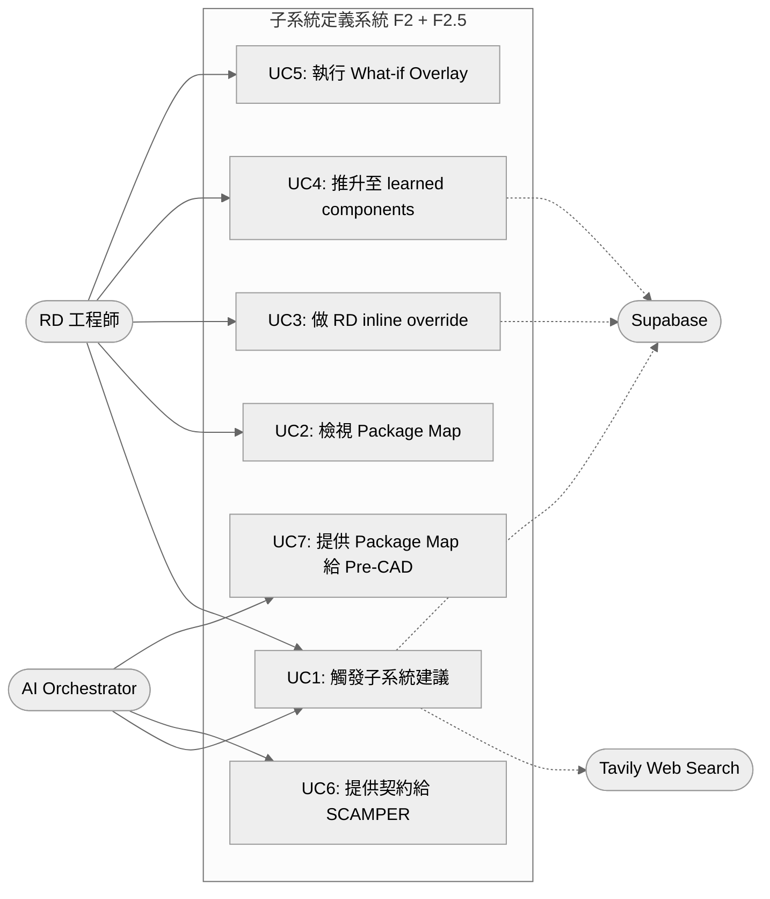


#### 2.3 主要 Use Case 摘要


| ID  | 名稱                 | 主要流程                                                               | 成功條件                                         |
| --- | ------------------ | ------------------------------------------------------------------ | -------------------------------------------- |
| UC1 | 觸發子系統建議            | RD 點 Suggest → Agent 跑 LLM → resolver 覆寫 → validator 算 package map | 回傳含 spatial 的子系統樹 + Package Map              |
| UC2 | 檢視 Package Map     | RD 看 SVG 包絡圖、clash 標示、總質量                                          | 視覺化呈現可指著討論                                   |
| UC3 | RD inline override | RD 對單一 component 寫死 bbox + mass                                    | 寫入 `project_component_overrides`             |
| UC4 | 推升 learned         | RD 確認某估計可信 → 推升至全域表                                                | 寫入 `learned_components`, `confirmed_count++` |
| UC5 | What-if Overlay    | RD 套上假設性車架 envelope 試 trade-off                                    | 回傳 overlay PackageMap，原始不變                   |
| UC6 | 餵 SCAMPER          | F3 讀取結構化介面契約做變形                                                    | 機器可讀的影響範圍                                    |
| UC7 | 餵 Pre-CAD          | 評分階段讀 Package Map 算 spatial_score                                  | Deterministic 評分                             |


---

### §3 Context Diagram（C4 Level 1）

```mermaid
%%{init: {'theme': 'neutral'}}%%
graph TB
    RD([RD 工程師<br/>人類使用者])

    subgraph BoundedContext[Design Copilot 系統邊界]
        F2[正向分析・子系統定義<br/>F2 + F2.5<br/>本文件範圍]
    end

    F1[F1: TRIZ 解矛盾<br/>輸出 LayeredTrizSolution[]<br/>+ differential_analysis]
    F3[F3: SCAMPER 變形<br/>下游：消費介面契約]
    PreCAD[Pre-CAD 五維評分<br/>下游：消費 Package Map]

    Tavily[Tavily Web Search<br/>外部 SaaS]
    Supabase[(Supabase<br/>外部資料庫)]
    LLM[LLM Provider<br/>Claude / GPT]

    RD <--> F2
    F1 -->|LayeredTrizSolution[]<br/>+ Brief| F2
    F2 -->|結構化子系統樹<br/>+ 介面契約 + Package Map| F3
    F2 -->|Package Map<br/>+ spatial 評分| PreCAD
    F2 <-->|datasheet 抓取| Tavily
    F2 <-->|讀寫 artifact| Supabase
    F2 -->|prompt + 規格| LLM
    LLM -->|JSON 回應| F2
```


#### §3.1 F1→F2 契約（與分層 TRIZ 銜接）

F1 與本文件所述 F2 之間的**正式 hand-off** 對齊 `../../02-design/specs/triz/E5x--triz-layered-drilldown-optimization.md` §8.1：


| 項目          | 規格                                                                                                                           |
| ----------- | ---------------------------------------------------------------------------------------------------------------------------- |
| **主要輸入**    | `LayeredTrizSolution[]`：每個矛盾一個聚合體，含 L1（TC 現象）/ L2（PC 本質，可缺）/ L3（SF 結構旁路）及 `differential_analysis`                            |
| **Brief**   | 專案任務與邊界敘述（與現行一致）                                                                                                             |
| **F2 預設行為** | 子系統建議與 `related_contradictions` 的**主綁定**預設跟隨 `differential_analysis.recommended_route`；RD 在決策中心採納後以 `adopted_route`（或等價欄位）覆寫 |
| **向後相容**    | 若管線尚未升級，可僅傳「矛盾清單 + 扁平 TRIZ 候選」：視為僅有 L1、無 `deepen_link`；F2 仍須能跑通，但不享有分層訊號                                                     |


**術語區分（必讀）**：本文件 §6.4 的 **System / Module / Component** 是 **F2 子系統樹的階層（tree tier）**，勿與 F1 的 **TC / PC / SF 分析層（phenomenon → essence → structural lens）** 混用。後者在 TRIZ 分層文件中以 L1/L2/L3 表示；本文件之後稱 F2 三階為 **樹階** 或直呼 System/Module/Component，避免與 F1 代號並列時產生歧義。

**跨矛盾衝突處理**：同矛盾、同一 `LayeredTrizSolution` 內多層解之組合為合法採納；跨矛盾衝突由 SIM 矩陣（ADR-008 D5）在 TRIZ 求解階段前置處理（~~Phase B 已於 v9 退役~~）。F2 的 `related_contradictions` 不將「同 LTS 跨層」當成互斥候選（見 §6.4.4）。

---

### §4 Container Diagram（C4 Level 2）

把系統內部按「可獨立部署 / 可獨立失敗」的單位拆分：

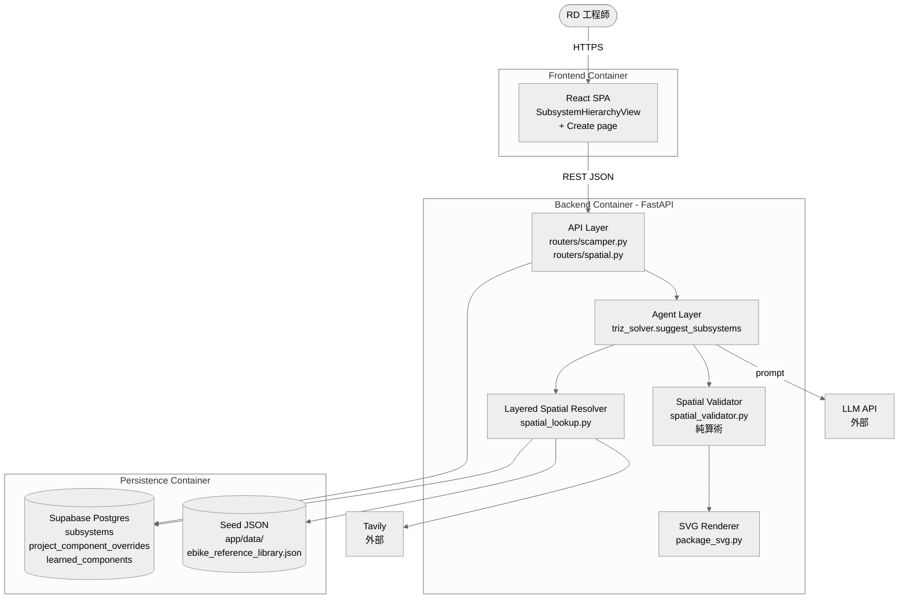


#### 4.1 Container 職責表


| Container         | 技術棧                | 失敗時影響                   | 恢復策略            |
| ----------------- | ------------------ | ----------------------- | --------------- |
| Frontend SPA      | React + TypeScript | 使用者無法觸發；後端不受影響          | 無狀態，重啟即可        |
| Backend API/Agent | FastAPI + Python   | F2 全面停擺；F1/F3 不受影響      | 無狀態，可水平擴展       |
| Layered Resolver  | Python (Backend 內) | 退化到 seed + llm_estimate | 每層獨立 try/except |
| Spatial Validator | Python 純算術         | LLM 結果保留，無 Package Map  | 不影響主流程          |
| Supabase          | Postgres           | 無法持久化，但 in-memory 結果仍可回 | 連線重試            |
| Tavily            | 外部 SaaS            | 退化到 seed + llm_estimate | 超時 fail-fast    |
| LLM Provider      | 外部 API             | F2 無法跑                  | 重試 + 降級提示       |


---

### §5 Component Diagram（C4 Level 3）

聚焦在 Backend Container 內部的職責切分：

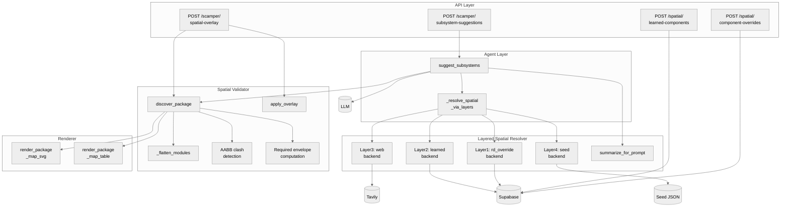


#### 5.1 Component 職責表


| Component                     | 純度  | 是否呼叫 LLM | 是否可獨立測試            |
| ----------------------------- | --- | -------- | ------------------ |
| `suggest_subsystems`          | 編排  | ✅        | 需 mock LLM         |
| `_resolve_spatial_via_layers` | 純函式 | ❌        | ✅ 注入 fake resolver |
| `Resolver L1-L4`              | 純資料 | ❌        | ✅ 各層獨立測試           |
| `discover_package`            | 純算術 | ❌        | ✅ 已有 617 行測試       |
| `apply_overlay`               | 純算術 | ❌        | ✅                  |
| `render_package_map_svg`      | 純函式 | ❌        | ✅ string 比對        |


> **設計原則**：除了 `suggest_subsystems` 必須呼叫 LLM，其他所有 component 都是 pure function，可以在沒有任何外部依賴的情況下單元測試。

---

### §6 資料模型（Data Model）

#### 6.1 核心實體關係

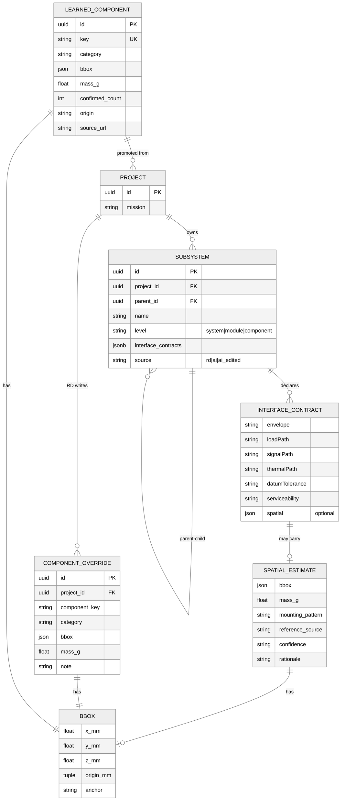


#### 6.2 reference_source 命名空間


| 前綴                  | 來源層                    | 信任度    | 寫入主體     |
| ------------------- | ---------------------- | ------ | -------- |
| `rd_override:<key>` | 本專案 RD inline override | **最高** | RD 手動    |
| `learned:<key>`     | 跨專案 learned component  | 高      | 系統推升     |
| `web:<query>`       | 即時 web lookup          | 中      | LLM 引用觸發 |
| `seed:<key>`        | 手工 backstop JSON       | 中      | 開發者維護    |
| `llm_estimate`      | LLM 自己的數字              | 低      | LLM 兜底   |


#### 6.3 JSON 範例：完整介面契約

```jsonc
{
  "Gearbox": {
    "envelope":       "Ø65mm shaft coupling flange",
    "loadPath":       "80Nm via involute spline",
    "thermalPath":    "Conductive through housing",
    "signalPath":     "3x Hall + thermistor",
    "datumTolerance": "±0.02mm shaft concentricity",
    "serviceability": "Removable without disassembly",
    "spatial": {
      "bbox": { "x_mm": 180, "y_mm": 140, "z_mm": 120, "anchor": "BB_center" },
      "mass_g": 3900,
      "mounting_pattern": "BB_shell_BSA_68mm",
      "reference_source": "learned:bafang_m600_mid_drive",
      "confidence": "library",
      "rationale": "Closest production analogue"
    }
  }
}
```

---

### §6.4 三層樹（System / Module / Component）的定義來源

「三層樹」不是任意分層，而是一個刻意設計的拆解框架，目的是讓 **TRIZ 矛盾、SCAMPER 變形、Pre-CAD 評分** 三個下游階段都有對應的操作粒度。

> **命名提醒**：此處三階為 **F2 子系統樹（tree tier）**，與 F1 `LayeredTrizSolution` 的 TC/PC/SF **分析層**（TRIZ 文件中的 L1/L2/L3）為不同維度；下文圖中子圖標題使用「樹階」以避免與 F1 代號混淆。

#### 6.4.1 為什麼是三層

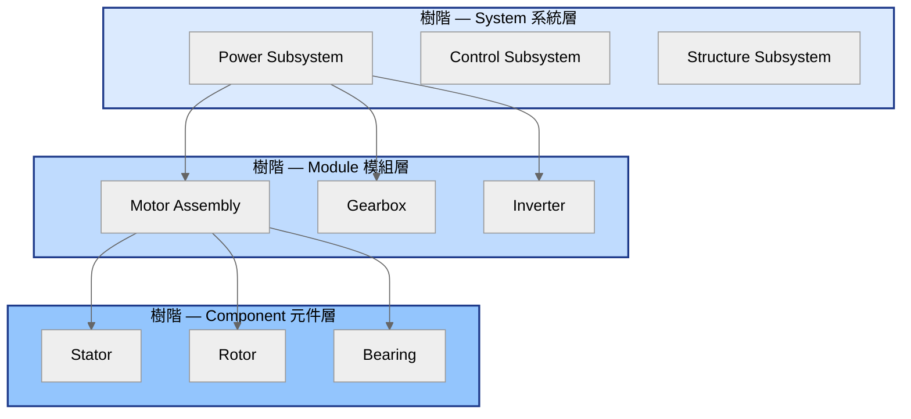


| 層級               | 數量約束              | 對應 TRIZ 角色 | 對應 SCAMPER 操作          | 對應 Pre-CAD 評分      |
| ---------------- | ----------------- | ---------- | ---------------------- | ------------------ |
| **System 系統**    | 2-4 個             | 矛盾分佈的最高觀察層 | 不直接被變形（會牽動全機）          | 整機 envelope 與總質量   |
| **Module 模組**    | 每個 system 下 2-4 個 | 矛盾的承載單位    | **SCAMPER 七動作的主要操作對象** | 模組 bbox 與 clash 偵測 |
| **Component 元件** | 每個 module 下 2-5 個 | 矛盾的根因單位    | 不被 SCAMPER 操作（粒度太細）    | 不單獨評分              |


#### 6.4.2 拆解規則（由 prompt 強制）

定義來源：`backend/app/prompts/triz_solver.py` 的 `SUBSYSTEM_SUGGESTION` prompt instructions 1-3：

```
1. Identify 2–4 system-level subsystems
   (e.g., Power, Control, Structure)
2. Break each system into 2–4 modules
   (e.g., Power → Motor, Gearbox, Inverter)
3. For each module, list 2–5 components
   (e.g., Motor → Stator, Rotor, Bearing)
```

**為什麼是這些上下界**：

- **System 上限 4**：太多 system 會讓矛盾分佈過於分散，TRIZ 收斂困難
- **Module 下限 2**：少於 2 個 module 的 system 沒有「介面契約」可言（沒有鄰居）
- **Module 上限 4**：超過 4 個會讓 SCAMPER 變形組合爆炸（C(7,2) × N²）
- **Component 上限 5**：超過 5 個代表 module 拆得不夠細，應該升級為新 module
- **Component 不參與介面契約**：契約只在 module 層存在，避免層級錯亂

#### 6.4.3 拆解的判斷準則

```mermaid
%%{init: {'theme': 'neutral'}}%%
flowchart TB
    Brief[Brief + F1 產出<br/>LayeredTrizSolution[]<br/>或退化：矛盾清單] --> Q1{是否為<br/>能量轉換 / 控制 / 結構<br/>三大功能群?}
    Q1 -->|是| SYS[標為 system level]
    Q1 -->|否| Q2{是否為<br/>可被 SCAMPER 整體替換的<br/>功能單元?}
    Q2 -->|是| MOD[標為 module level]
    Q2 -->|否| Q3{是否為<br/>無法獨立替換的<br/>實體零件?}
    Q3 -->|是| COMP[標為 component level]
    Q3 -->|否| REJ[拒絕此節點<br/>要求重新拆解]

    style SYS fill:#dbeafe,stroke:#1e3a8a,stroke-width:2px,color:#000
    style MOD fill:#bfdbfe,stroke:#1e3a8a,stroke-width:2px,color:#000
    style COMP fill:#93c5fd,stroke:#1e3a8a,stroke-width:2px,color:#000
    style REJ fill:#fecaca,stroke:#7f1d1d,stroke-width:2px,color:#000
```


#### 6.4.4 與矛盾的綁定

每個節點都帶 `related_contradictions` 欄位，列出與該節點相關的**矛盾 ID**。在分層 TRIZ 管線下，綁定規則對齊 `../../02-design/specs/triz/E5x--triz-layered-drilldown-optimization.md` §8.1：

1. **主綁定（給 SCAMPER / 二次矛盾預測用）**：預設僅將節點關聯到 RD 已採納路線（`adopted_route`，若尚未採納則用 `differential_analysis.recommended_route`）上所標示的**承載模組 / 根因元件**。同一 `LayeredTrizSolution` 內未採納的層（例如僅作說明的 L1 折衷解）**不**自動等同於「待變形依據」，避免 SIM 矩陣與 F2 預測誤把 drill-down 堆疊當成互斥多解。
2. **追溯與說明（可選欄位）**：可另存 `related_contradictions_context`（或等價結構）記錄「同矛盾下其餘層曾提及的模組／元件」，僅供 UI 與稽核，不參與預設 SCAMPER 影響範圍計算。
3. **向後相容**：若輸入僅有扁平矛盾清單而無 `LayeredTrizSolution`，`related_contradictions` 維持「該節點曾由舊版 F1 關聯到的矛盾 ID 清單」語意，不區分主綁定與 context。

此設計支援兩個既有目標：

1. **TRIZ 反向追蹤**：給定一個矛盾，能立刻找到所有受影響的 module（與採納路線一致時最精準）。
2. **SCAMPER 影響範圍預測**：對某 module 做變形時，以**主綁定**矛盾預測是否牽動已採納的跨層設計，降低與「同 LTS 跨層合法組合」的語意衝突。

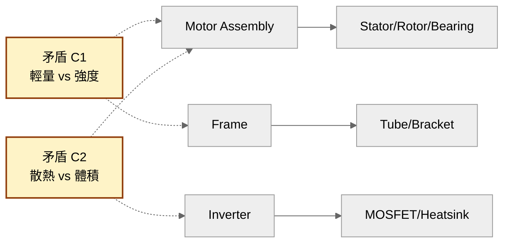


---

### §6.5 六維介面契約的定義來源

「六維」不是隨便挑的，而是窮舉「兩個 module 之間可能發生介面破壞的所有物理通道」的結果。設計目標是 **用最少維度覆蓋所有破壞成因**。

#### 6.5.1 六維對應的物理場

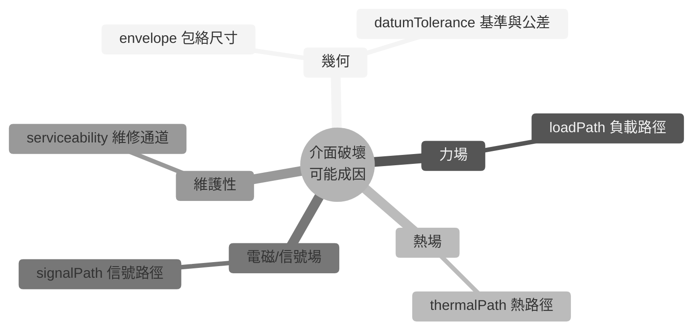


#### 6.5.2 六維定義表


| 維度                 | 物理意義                           | 為什麼要存在                         | 沒有它會發生什麼                 |
| ------------------ | ------------------------------ | ------------------------------ | ------------------------ |
| **envelope**       | 包絡尺寸 / mounting                | 對應 spatial validator 的 bbox 輸入 | CAD 才發現幾何衝突              |
| **loadPath**       | 力 / 力矩 / 電流路徑                  | SCAMPER 替代材料後鄰居承不住負載           | 馬達換 GaN 後峰值電流燒掉 BMS      |
| **signalPath**     | 控制 / 感測 / 通訊（CAN/SPI/I²C/Hall） | 重排控制板後 latency / 雜訊耦合超出容忍      | MCU 與 Gate driver SPI 拍頻 |
| **thermalPath**    | 熱從哪裡進、經過誰、從哪裡出                 | 散熱片被消除後熱流改走 PCB                | 鄰居電容被烤掉                  |
| **datumTolerance** | 基準與公差（datum + tolerance）       | 機械對位錯位會造成裝配良率崩潰                | 馬達軸對齒輪箱同軸度沒講清楚，量產良率崩     |
| **serviceability** | 拆裝順序、可達性、可換件粒度                 | 整機組裝完才發現要換 IMS 必須拆掉外殼+電池       | 維修工時爆炸                   |


#### 6.5.3 為什麼是這六維（不是五、不是七）

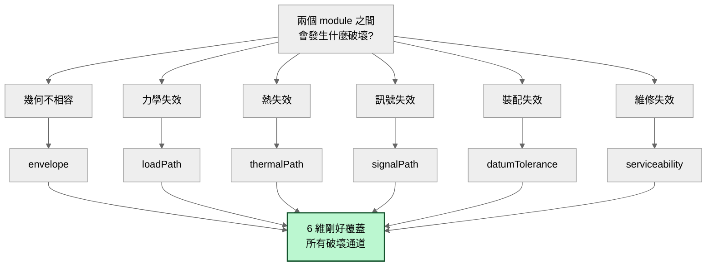


- **不到六維會漏**：例如拿掉 datumTolerance 後，公差問題沒地方寫，量產良率風險被埋藏
- **超過六維會冗**：再分會落入「envelope 細節 / loadPath 細節」等子維度，應該寫在欄位內容而非變新維度
- **每一維對應 TRIZ 物理場**：力場 / 熱場 / 電磁場 / 空間幾何 / 時間（serviceability 隱含維修時序）

#### 6.5.4 六維的綁定對象：「對誰」的契約

介面契約**不是對 module 自身的描述**，而是「**這個 module 對某個鄰居 module 的承諾**」。資料結構是 `Record<鄰居名稱, SixDimContract>`：

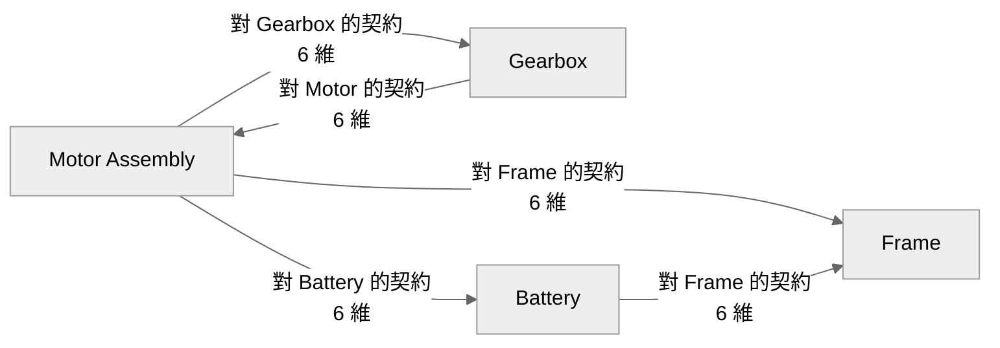


**為什麼一定要綁定對象**：

- 同一個 module 對不同鄰居的契約是不同的（馬達對齒輪箱有 loadPath，對電池只有 signalPath）
- SCAMPER 變形時要知道「替換馬達會破壞它對哪些鄰居的契約」
- 如果只描述自身屬性，下游無法計算影響範圍

#### 6.5.5 六維 + spatial：v10 的擴充

v10 之前六維都是自然語言。v10 在介面契約上掛了一個 optional 的 `spatial` 區塊（見 §6.1 的 JSON 範例），目的是把「envelope 自然語言描述」與「機器可讀的 bbox + mass」對應起來：

```
envelope:  "Ø65mm shaft coupling flange"   ← 給人讀
spatial:   { bbox: {x:180, y:140, z:120}, mass_g: 3900 }  ← 給機器算
```

兩者並存，**自然語言給 RD 與 LLM 互相理解，結構化資料給 validator 算 clash 與 envelope**。

---

### §7 Sequence Diagrams

#### 7.1 主流程：UC1 觸發子系統建議

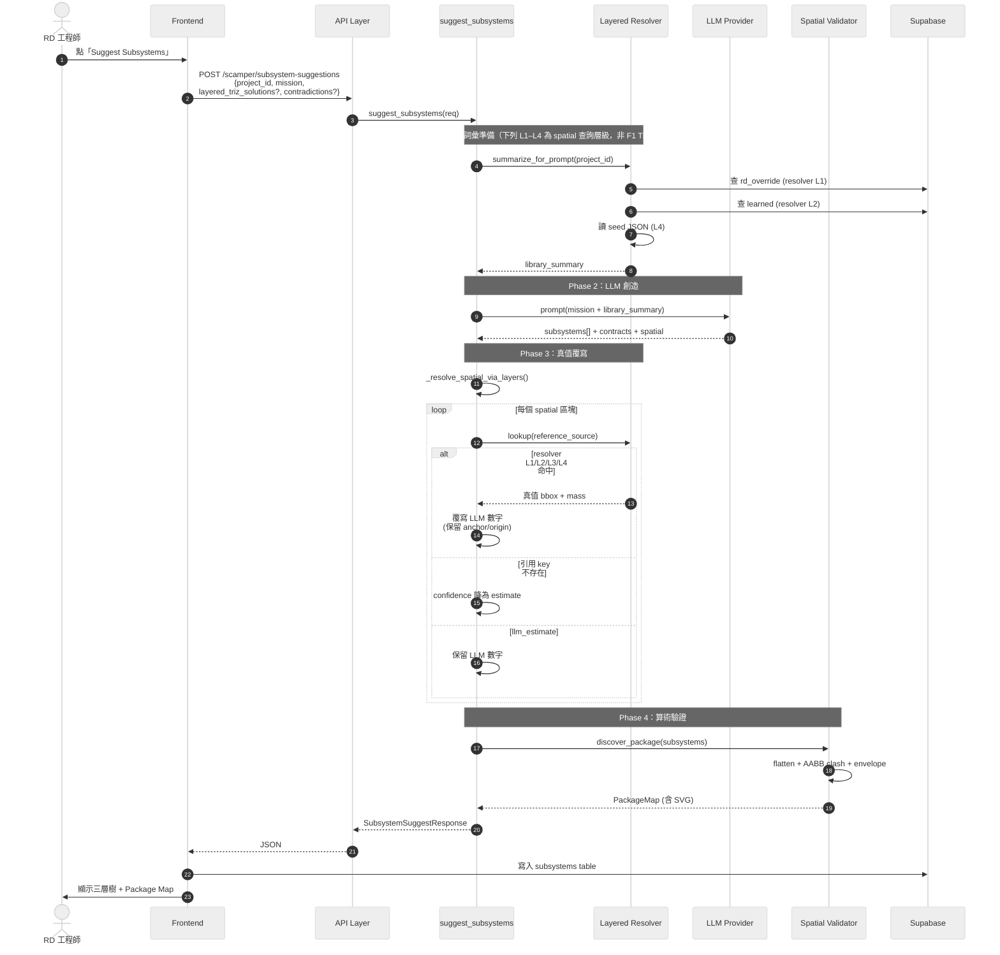


#### 7.2 UC3：RD inline override

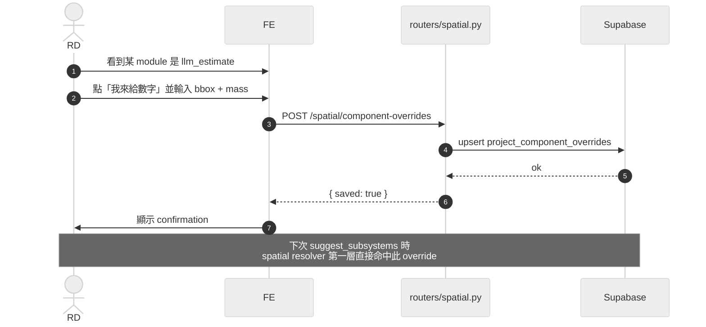


#### 7.3 UC4：推升至 learned components

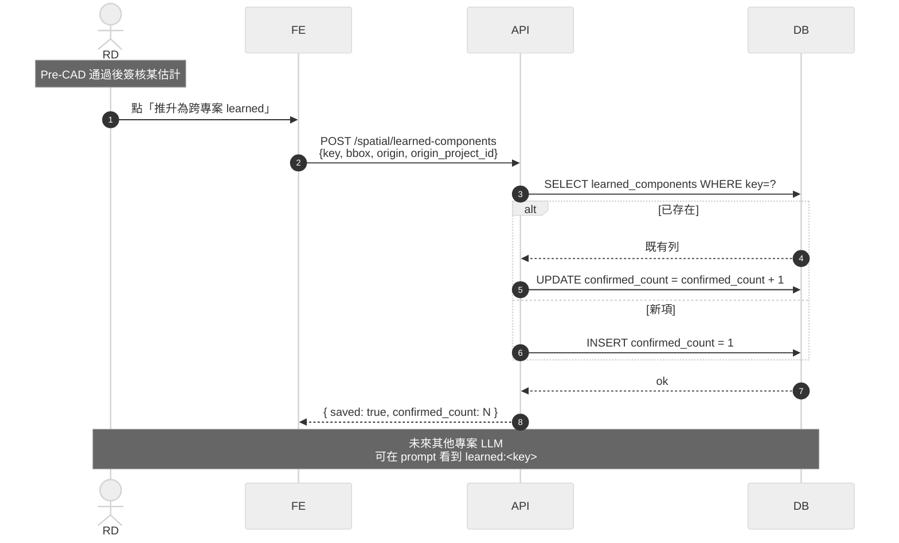


#### 7.4 UC5：What-if Overlay

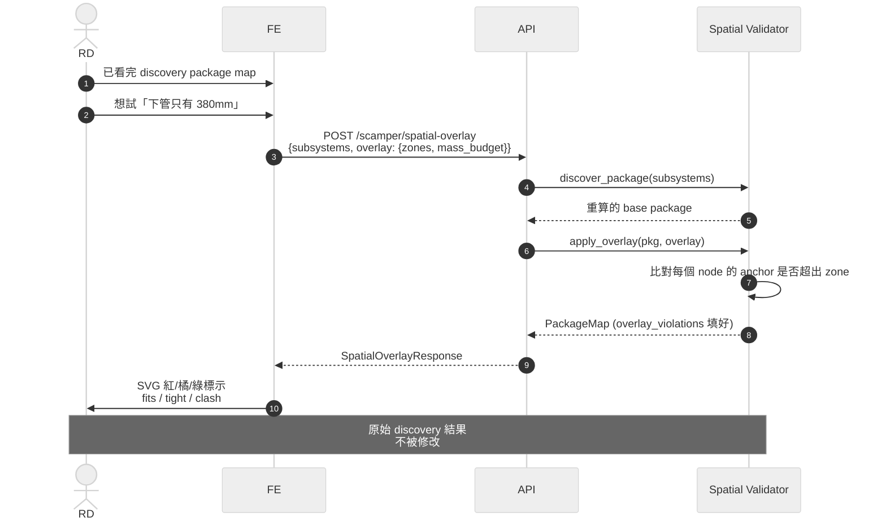


---

### §8 State Machine

#### 8.1 子系統 Artifact 狀態流轉

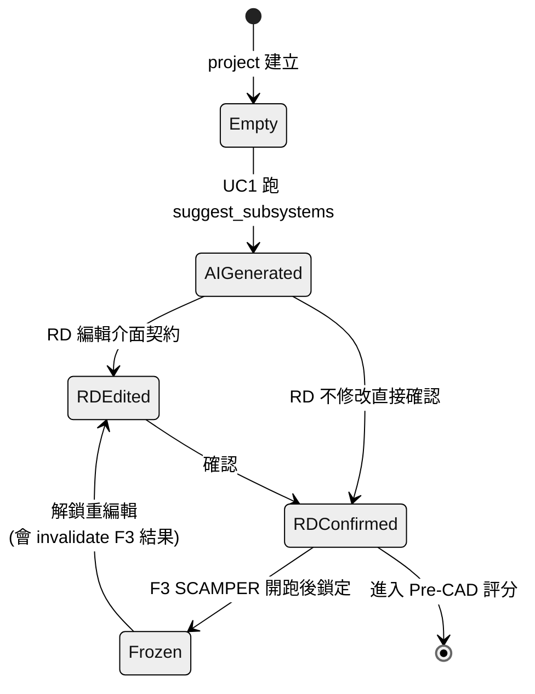


#### 8.2 SpatialEstimate confidence 流轉

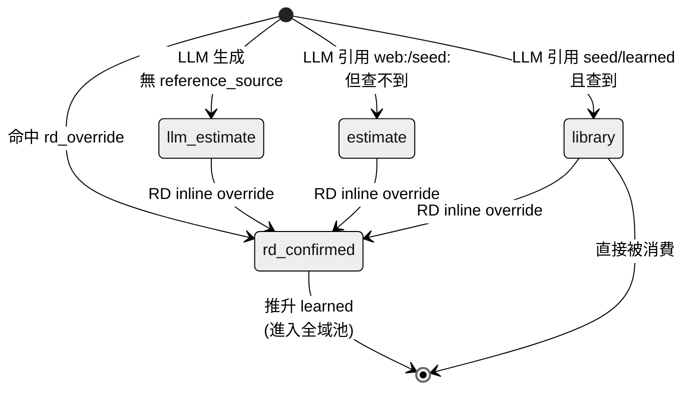


#### 8.3 LearnedComponent 累積週期

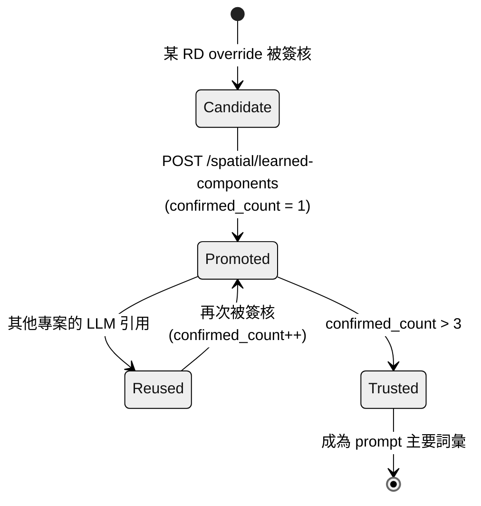


---

### §9 資料準確性與冷啟動策略

#### 9.1 五道防線（Defence-in-Depth）

```mermaid
%%{init: {'theme': 'neutral'}}%%
flowchart LR
    LLM[LLM 產出] --> D1[D1 Prompt 詞彙注入<br/>summarize_for_prompt]
    D1 --> D2[D2 後處理覆寫<br/>真值覆寫 LLM 數字]
    D2 --> D3[D3 引用查不到<br/>降級 confidence]
    D3 --> D4[D4 anchor origin 保留<br/>零件 vs 擺放分離]
    D4 --> D5[D5 算術驗證<br/>AABB clash + 質量加總]
    D5 --> OUT[可信輸出]

    style D1 fill:#e0f2fe,stroke:#0c4a6e,stroke-width:2px,color:#000
    style D2 fill:#bae6fd,stroke:#0c4a6e,stroke-width:2px,color:#000
    style D3 fill:#7dd3fc,stroke:#0c4a6e,stroke-width:2px,color:#000
    style D4 fill:#38bdf8,stroke:#0c4a6e,stroke-width:2px,color:#000
    style D5 fill:#0ea5e9,stroke:#0c4a6e,stroke-width:2px,color:#fff
```


| 防線             | 處理什麼                                            |
| -------------- | ----------------------------------------------- |
| D1 Prompt 詞彙注入 | LLM 知道有哪些 key 可引用，減少編造                          |
| D2 後處理覆寫       | LLM 引用 `seed:/learned:/rd_override:/web:` 都會被換掉 |
| D3 引用降級        | 防止 LLM 引用幻覺 key 卻保留高 confidence                 |
| D4 anchor 保留   | 零件本身 = 事實；擺放位置 = 設計選擇                           |
| D5 算術驗證        | 即使數字準確，組合能否共存仍要算                                |


#### 9.2 冷啟動五層退化保證

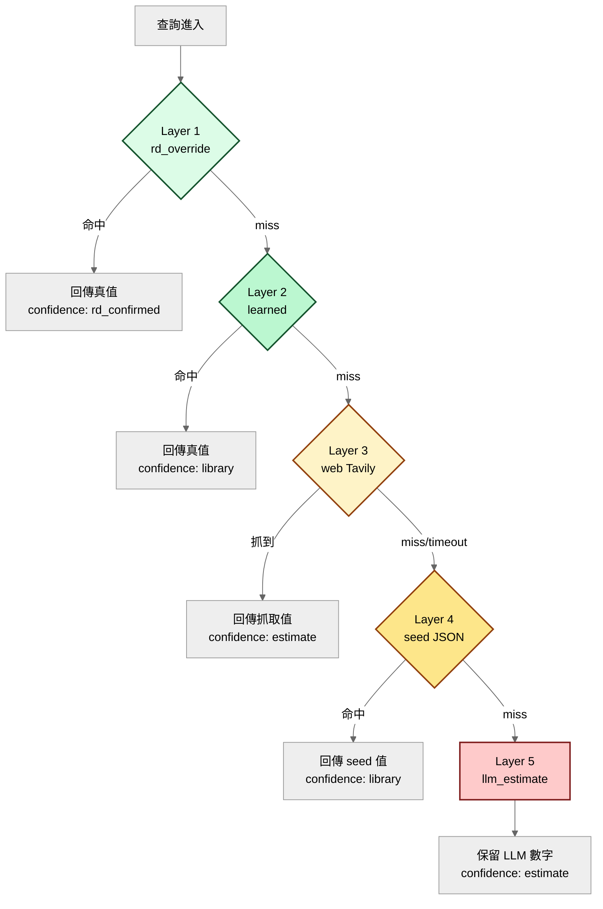


**冷啟動保證**：即使 L1-L4 全部 miss，系統仍然回傳結果（L5 兜底），confidence 標為 estimate。RD 看到低 confidence 即知道要 override。

#### 9.3 冷→熱遷移時間軸

```mermaid
%%{init: {'theme': 'neutral'}}%%
gantt
    title 資料庫從冷啟動到自我維護的演化
    dateFormat YYYY-MM-DD
    axisFormat %m月

    section Day 0
    全靠 seed + web + llm_estimate           :a1, 2026-04-08, 7d
    confidence 普遍 estimate                  :a2, after a1, 14d
    RD 大量 inline override                   :a3, after a1, 21d

    section Month 1
    learned 表累積 ~50 條                     :b1, 2026-05-08, 30d
    80% 常見元件查得到                         :b2, after b1, 30d
    confidence 普遍 library                   :b3, after b1, 30d

    section Month 6
    learned 表累積 ~300 條                    :c1, 2026-10-08, 60d
    seed JSON 幾乎不再被命中                   :c2, after c1, 60d
    web lookup 只在新元件出現時觸發             :c3, after c1, 60d

    section Year 1+
    learned + rd_override 主導                :d1, 2027-04-08, 90d
    seed JSON 可開始 archive                  :d2, after d1, 90d
    系統進入自我維護狀態                        :d3, after d1, 90d
```


---

### §10 對下游 SCAMPER 的契約

#### 10.1 F2 → F3 hand-off 三件套

```mermaid
%%{init: {'theme': 'neutral'}}%%
graph LR
    F2[F2 + F2.5<br/>子系統定義] --> A[結構化子系統樹<br/>System/Module/Component]
    F2 --> B[機器可讀介面契約<br/>6 維 + spatial]
    F2 --> C[Package Map 基線<br/>SVG + clash + envelope]

    A --> F3[F3 SCAMPER 變形]
    B --> F3
    C --> F3

    F3 --> D[新 module 組合]
    F3 --> E[新介面契約]
    F3 --> Cmp[與基線對比]

    style F2 fill:#dbeafe,stroke:#1e3a8a,stroke-width:2px,color:#000
    style F3 fill:#fef3c7,stroke:#92400e,stroke-width:2px,color:#000
```


| Hand-off 物件    | SCAMPER 如何使用                                               |
| -------------- | ---------------------------------------------------------- |
| 結構化子系統樹        | 7 個變形動作的操作對象（哪個 module 被 substitute / combine / eliminate） |
| 6 維介面契約        | 變形後判斷哪些 path 被破壞、產生哪些二次矛盾                                  |
| Package Map 基線 | 變形後重算 package map，與基線對比決定是否更好                              |


#### 10.2 為什麼介面契約不能只有自然語言

```mermaid
%%{init: {'theme': 'neutral'}}%%
graph TB
    Bad[只有自然語言契約] --> B1[SCAMPER 替換 module 後<br/>無法計算對鄰居影響]
    Bad --> B2[二次矛盾無法被機器偵測]
    Bad --> B3[Pre-CAD 評分變成 LLM 拍腦袋]

    Good[結構化 6 維 + spatial] --> G1[替換後可計算 path 破壞]
    Good --> G2[二次矛盾可被算術偵測]
    Good --> G3[Pre-CAD 評分可被算術產出]

    style Bad fill:#fecaca,stroke:#7f1d1d,stroke-width:2px,color:#000
    style Good fill:#bbf7d0,stroke:#14532d,stroke-width:2px,color:#000
```


---

### §11 部署視角（Deployment）

```mermaid
%%{init: {'theme': 'neutral'}}%%
graph TB
    subgraph Browser[使用者瀏覽器]
        SPA[React SPA<br/>Static 部署]
    end

    subgraph Cloud[Backend 部署環境]
        FA[FastAPI 容器<br/>水平可擴展]
    end

    subgraph SaaS[外部 SaaS]
        SBSaaS[Supabase<br/>託管 Postgres]
        TavSaaS[Tavily Search API]
        LLMSaaS[Claude / GPT API]
    end

    Browser -->|HTTPS| Cloud
    Cloud -->|HTTPS| SBSaaS
    Cloud -->|HTTPS| TavSaaS
    Cloud -->|HTTPS| LLMSaaS
```


#### 11.1 部署單元


| 部署單元              | 狀態              | 擴展策略         |
| ----------------- | --------------- | ------------ |
| React SPA         | 無狀態             | CDN          |
| FastAPI Backend   | 無狀態             | 水平擴展         |
| Spatial Validator | 內嵌於 Backend     | 隨 Backend 擴展 |
| Resolver          | 內嵌於 Backend     | 隨 Backend 擴展 |
| Supabase          | 託管              | 由 SaaS 處理    |
| Seed JSON         | 隨 Backend image | 重 deploy 更新  |


---

### §12 風險、限制、迭代方向

#### 12.1 已知風險

```mermaid
%%{init: {'theme': 'neutral'}}%%
mindmap
  root((已知風險))
    技術
      AABB clash 過於粗略
      anchor 命名靠約定
      web regex 提取脆弱
    資料
      learned 表同零件不同名稱
      LLM 引用幻覺 key
      seed 過時但仍被命中
    流程
      RD 不主動 override
      confirmed_count 不代表正確
      冷啟動初期信任度低
    營運
      Tavily quota 用罄
      LLM API 變動
      Supabase 連線斷
```


#### 12.2 後續迭代方向


| 方向                               | 動機                                                        | 優先級 |
| -------------------------------- | --------------------------------------------------------- | --- |
| Learned component fuzzy dedup    | 解決同零件不同名稱碎片化                                              | 高   |
| Anchor coordinate system         | 把字串 anchor 改為車架坐標系                                        | 中   |
| Confidence-aware Pre-CAD scoring | 全 llm_estimate 的 5 分 vs 全 learned 的 5 分應該不同               | 中   |
| 跨專案 spatial 對比                   | 發現業界平均下管長度等模式                                             | 低   |
| CAD 回灌                           | RD 完成 CAD 後把實際 bbox 寫回 learned，confidence 升為 cad_verified | 高   |
| OBB / 簡化網格 clash                 | 取代粗略 AABB                                                 | 低   |


#### 12.3 資料迴圈閉合方向

```mermaid
%%{init: {'theme': 'neutral'}}%%
flowchart LR
    A[F2 子系統定義] --> B[F3 SCAMPER 變形]
    B --> C[Pre-CAD 評分]
    C --> D[RD 簽核]
    D --> E[實際 CAD 設計]
    E --> F[實際 bbox 量測]
    F -.->|未來：CAD 回灌| G[learned_components]
    G -.->|被未來專案查詢| A

    style F fill:#fde68a,stroke:#92400e,stroke-width:2px,color:#000
    style G fill:#bbf7d0,stroke:#14532d,stroke-width:2px,color:#000
```


---

### §13 摘要表：本架構解決什麼


| 問題             | 解法                                  | 章節      |
| -------------- | ----------------------------------- | ------- |
| LLM 數字是想像      | Layered resolver + 後處理覆寫            | §5 §9.1 |
| 介面契約只有自然語言     | spatial 區塊 + Package Map            | §6 §10  |
| 沒有資料累積         | learned_components + RD override 推升 | §6 §8.3 |
| 冷啟動沒資料         | 五層退化保證 + seed backstop              | §9.2    |
| Pre-CAD 評分拍腦袋  | validator 算術接管                      | §10     |
| 預算上限限制創意       | discovery 與 overlay 分離              | §7.4    |
| Validator 失敗會炸 | try/except + 永遠回傳                   | §4.1 §5 |
| SCAMPER 無法機器驗證 | 結構化契約 + 基線對比                        | §10     |


---

### §14 對齊既有 E2E 文件


| 文件                                                                         | 對齊點                                                      |
| -------------------------------------------------------------------------- | -------------------------------------------------------- |
| `E3--ai-agent-detailed-design.md` v1.4                                     | TRIZ Solver Agent 的「子系統拆解（三層階層）」職責即本文件 §5                |
| `_domain-knowledge/DK-01--design-philosophy-and-process.md` v1.6           | 本文件補充 F2.5 作為 F2 的後置子步                                   |
| [Appendix D](appendix-d--state-machine.md) v1.6                        | 子系統 Artifact 狀態機見本文件 §8.1                                |
| [Appendix E](appendix-e--triz-scamper-flow.md) v11                         | 本文件是該流程圖的 SA 視角文字化；F1 分層輸出與 SIM/CCI 規則見該檔 v11 摘要（~~Phase B 已 v9 ���役~~） |
| `../../02-design/specs/triz/E5x--triz-layered-drilldown-optimization.md` v1.0 | F1→F2 hand-off、`LayeredTrizSolution` 與本文件 §3.1、§6.4.4 對齊 |
| `../_domain-knowledge/DK-01--design-philosophy-and-process.md` §Step P     | spatial_score 算術化，見本文件 §10                               |


---

**主要實作檔案索引**：

- `backend/app/agents/triz_solver.py` (suggest_subsystems + _resolve_spatial_via_layers)
- `backend/app/services/spatial_validator.py` (純算術核心)
- `backend/app/services/spatial_lookup.py` (Layered resolver)
- `backend/app/services/reference_library.py` (seed 層)
- `backend/app/services/package_svg.py` (SVG 渲染)
- `backend/app/routers/spatial.py` (RD override + learned 推升 API)
- `backend/app/routers/scamper.py` (主入口 + overlay 端點)
- `backend/app/models/schemas.py` (BBox / SpatialEstimate / PackageMap / ...)
- `supabase/migrations/006_spatial_estimate.sql`
- `supabase/migrations/007_learned_components.sql`
- `src/components/create/SubsystemHierarchyView.tsx` (FE 顯示)
- `backend/tests/test_spatial_validator.py` (617 行測試)

---
