## Appendix B: Forward TRIZ Solver Architecture

> 2026-04-15 更新：依 [ADR-007](../adrs/ADR-007-tc-only-explore-pc-sf-derivation-in-create.md)，Explore 階段限縮為 TC-only；PC/SF 於 Create 階段自 TC 派生。詳見下方「TC-Only Contract（ADR-007）」段。

> 錨點：`#appendix-b-forward-triz-solver-architecture`

### §B.0 TC-Only Contract（ADR-007, 2026-04-15）

依 [ADR-007](../adrs/ADR-007-tc-only-explore-pc-sf-derivation-in-create.md)，Explore 與 Create 兩階段的矛盾處理契約調整如下：

#### formalize_contradiction 新合約


| 方向                   | 合約                                                                                        |
| -------------------- | ----------------------------------------------------------------------------------------- |
| **Input**            | 自然語言矛盾敘述（`ContradictionFormalizeRequest.natural_description`）                             |
| **Output (success)** | `type="TC"` + `improving_param` ∈ [1,39] + `worsening_param` ∈ [1,39] + `rationale`（非空說明） |
| **Output (reject)**  | `type=null` + `rationale`（解釋為何無法映射到 39 參數，並建議 Socratic 追問方向）                              |
| **移除**               | PC 降級分支、SF 分類分支 — Explore 不再輸出 PC/SF                                                      |


> 新寫入強制 TC-only；歷史資料 row 仍可讀取。

#### solve_triz_layered 入口派生流程

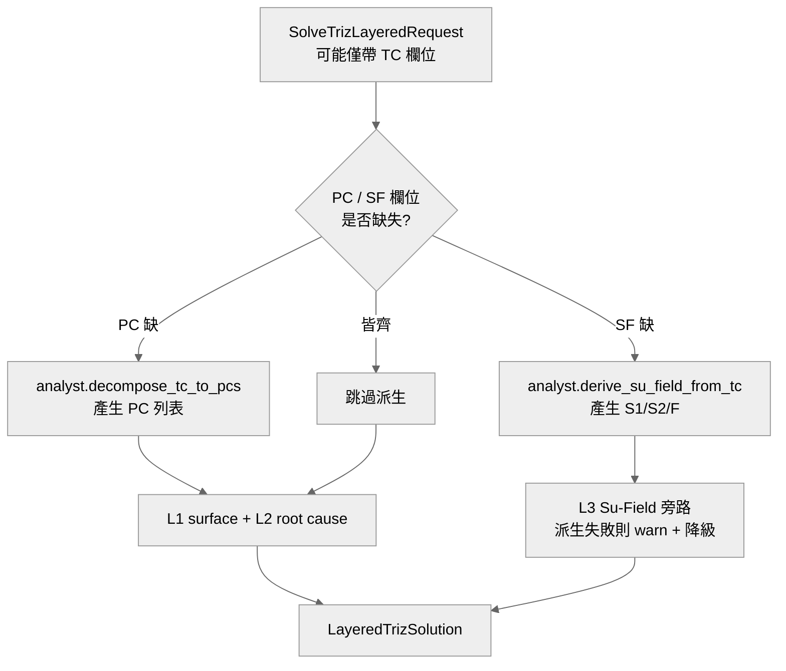
```mermaid
%%{init: {'theme': 'neutral'}}%%
flowchart TD
    REQ[SolveTrizLayeredRequest<br/>可能僅帶 TC 欄位] --> CHK{PC / SF 欄位<br/>是否缺失?}
    CHK -->|PC 缺| DPC[analyst.decompose_tc_to_pcs<br/>產生 PC 列表]
    CHK -->|SF 缺| DSF[analyst.derive_su_field_from_tc<br/>產生 S1/S2/F]
    CHK -->|皆齊| SKIP[跳過派生]
    DPC --> L12
    DSF --> L3D
    SKIP --> L12
    L12[L1 surface + L2 root cause] --> OUT
    L3D[L3 Su-Field 旁路<br/>派生失敗則 warn + 降級] --> OUT
    OUT[LayeredTrizSolution]
```


**規則**：

1. 派生產物**不回寫** `contradictions` 表（避免污染 Explore source of truth），僅於本次 response 帶回。
2. `derive_su_field_from_tc` 失敗（LLM 無法推出有意義 S1/S2/F）→ L3 以 warning 降級，L1/L2 不受影響。
3. 前端 `Create.tsx` 移除 `cType === 'TC'` 互斥閘門，`improving/worsening_param` 無條件傳出。

### §B.0.1 OZ-OT / SIM / CCI 擴充合約（ADR-008, 2026-04-27）

> 以下擴充項由 ADR-008 Auto-TRIZ v2 Closed-Loop Integration 引入，補充 §B.0 TC-Only 合約。

**OZ-OT 作為 L2 前置條件**

`solve_triz_layered()` 進入 L2 Root Cause 前，**必須**先完成 OZ-OT 分析並鎖定 Px 物理變數。流程：

1. Analyst Agent 呼叫 `oz_ot_analysis(contradiction_id)` → 產出 `OzOtResult { oz_zone, ot_time, px_variable }`
2. `OzOtResult.px_variable` 回寫至 `contradictions` 表（`oz_zone`, `ot_time`, `px_variable` 三欄）
3. L2 `_solve_pc()` 接收 Px 做為分離原理搜尋的錨點 → 比純 TC 翻譯更精準
4. Px 鎖定失敗時提供 3 種回退策略：`broaden_oz`（放寬操作空間）、`split_tc`（拆分矛盾）、`reframe`（重新框架問題）

**SIM 矩陣（多 TC 場景）**

當專案含 ≥2 條已正式化的 TC 時，自動觸發 SIM 矩陣評估：

1. TRIZ Solver Agent 呼叫 `sim_matrix(contradiction_ids)` → 產出 `SimMatrixResult { matrix, conflict_pairs, optimal_combination }`
2. 矩陣每格為 +1（互利）/ 0（無關）/ -1（衝突）
3. -1 交互升級為新 TC，回流至 Step 3（≤2 輪收斂）
4. 結果持久化至 `sim_matrices` 表

**CCI 複雜度檢查（取代二元 Evolution/Patch）**

`complexity_check()` 在方案候選確認後執行：

1. 四維計算：組件數變化 / 能耗變化 / 認知負荷 / 演化趨勢對齊度
2. CCI ∈ [0, 1]：≤0.3 Evolution / 0.3-0.6 Weak Evolution / >0.6 Patch
3. Patch 不阻塞出貨，但必須記錄技術債
4. 結果持久化至方案的 `complexity_check_result` 欄位

**Evidence Registry（跨層服務）**

所有 Agent 的 LLM 數值聲明必須透過 `EvidenceRegistryService.register_claim()` 註冊：

1. 自動 Tavily WebSearch 驗證 → 標記 VERIFIED / APPROXIMATE / UNVERIFIED
2. Gate P 退出條件：Evidence Coverage（VERIFIED + APPROXIMATE 佔比）≥ 40%

## 正向分析・TRIZ 解矛盾：系統架構說明書（SA 視角）

> **觀點**：Systems Analyst
> **相關文件**：`E3--ai-agent-detailed-design.md`、`_domain-knowledge/DK-01--design-philosophy-and-process.md`、`../../02-design/specs/triz/E5x--triz-layered-drilldown-optimization.md`、`../../04-deliver/operations/TRIZ_Layered_Rollout_Runbook.md`
> **文件目的**：以 SA 視角拆解「正向分析・TRIZ 解矛盾」階段（F1）的所有架構面向。F1 是正向路徑的第一站，輸入為 Step 3 識別出的矛盾，輸出為**同一矛盾的分層 drill-down 診斷**（L1 現象 / L2 本質 / L3 結構），聚合為 `LayeredTrizSolution[]` 供下游 F2 子系統定義消費。每張圖以 Mermaid 呈現。

---

### §0 文件導讀


| 章節  | 觀點                  | 回答的問題                                   |
| --- | ------------------- | --------------------------------------- |
| §1  | 業務情境                | 為什麼 TRIZ 解矛盾這個階段存在？                     |
| §2  | Actors & Use Cases  | 誰在用？做什麼事？                               |
| §3  | Context Diagram     | 系統與外部世界的邊界？                             |
| §4  | Container Diagram   | 內部由哪些可獨立部署元件組成？                         |
| §5  | Component Diagram   | 三條 solver 路徑的內部切分？                      |
| §6  | Data Model + 三條路徑定義 | TC / PC / SF 怎麼被定義？                     |
| §7  | Sequence Diagrams   | 三條路徑的執行時序？                              |
| §8  | State Machine       | 矛盾與建議的生命週期？                             |
| §9  | 知識庫注入策略             | 如何在 LLM context window 限制下注入完整 TRIZ KB？ |
| §10 | 對下游 F2 的契約          | 給 F2 子系統定義什麼？                           |
| §11 | 部署視角                | 部署單元與失敗影響？                              |
| §12 | 風險、限制、迭代方向          | 已知邊界？                                   |


---

### §1 業務情境（Business Context）

#### 1.1 問題陳述

E-bike RD 在面對「輕量 vs 強度」「散熱 vs 體積」「成本 vs 效能」這類工程矛盾時，傳統作法是憑直覺選一個折衷點，或在 CAD 階段才發現另一邊崩掉。TRIZ（俄文 Теория Решения Изобретательских Задач, Theory of Inventive Problem Solving）提供了一套形式化方法把這些矛盾抽象成 **39 個工程參數的衝突**，再用 **40 個發明原理**、**4 個分離原則**、或 **76 個標準解** 給出對應的破解方向。

但 TRIZ 知識庫有兩個落地痛點：


| 痛點                                               | 後果                                                           |
| ------------------------------------------------ | ------------------------------------------------------------ |
| 知識庫太大（39 參數 + 40 原理 + 76 標準解 + 矩陣）≈ 6 萬字         | 全部塞進 LLM prompt 會超出 context 預算                               |
| 三類矛盾（TC/PC/SF）的處理機制不同，但 user 往往講「我有個矛盾」就希望系統自己分流 | Explore 已改為 TC-only（ADR-007）；PC/SF 於 Create 階段自 TC 派生，見 §B.0 |


#### 1.2 系統使命

> **建立一個「規則引擎做精準查表 + LLM 做原理具體化 + 知識庫按需注入」的 TRIZ Solver，對同一矛盾同時提供現象層（TC）、本質層（PC）、結構層（SF）的 drill-down 建議組合，輸出為 `LayeredTrizSolution`，讓 RD 收到的不是單一表面解法，而是「表象 → 根因 → 結構旁證」的遞進式診斷報告。**

**v1.1 關鍵轉變**：TC / PC / SF 不再是互斥的分類標籤，而是**同一矛盾的三層視角**。TC 是現象、PC 是核心、SF 是結構 — 這不是選擇題，是診斷報告的三層。完整論述見 `../../02-design/specs/triz/E5x--triz-layered-drilldown-optimization.md`。

#### 1.3 三個關鍵約束

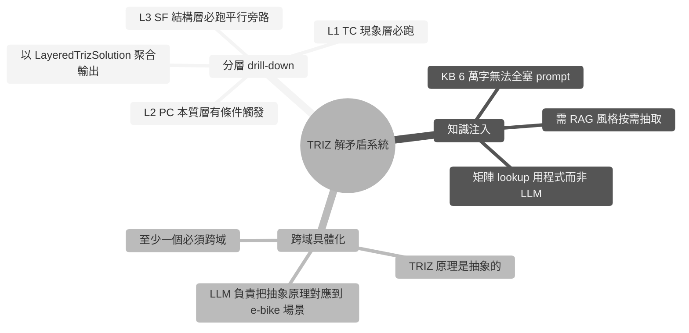
```mermaid
%%{init: {'theme': 'neutral'}}%%
mindmap
  root((TRIZ 解矛盾系統))
    分層 drill-down
      L1 TC 現象層必跑
      L2 PC 本質層有條件觸發
      L3 SF 結構層必跑平行旁路
      以 LayeredTrizSolution 聚合輸出
    知識注入
      KB 6 萬字無法全塞 prompt
      需 RAG 風格按需抽取
      矩陣 lookup 用程式而非 LLM
    跨域具體化
      TRIZ 原理是抽象的
      LLM 負責把抽象原理對應到 e-bike 場景
      至少一個必須跨域
```


---

### §2 Actors & Use Cases

#### 2.1 Actor 識別


| Actor                   | 類型              | 與系統的關係                                         |
| ----------------------- | --------------- | ---------------------------------------------- |
| **RD 工程師**              | 主要人類 actor      | 在矛盾識別頁面標記矛盾類型、檢視 TRIZ 建議、選擇採用                  |
| **AI Orchestrator**     | 系統內 actor       | 在 E2E 流程中銜接 Step 3（矛盾識別）與 F2（子系統定義）            |
| **Analyst Agent**       | 系統內上游 LLM actor | 把自然語言矛盾形式化為 TC/PC/SF 並標記參數                     |
| **TRIZ Solver Agent**   | 系統內 LLM actor   | 把抽象原理具體化為工程建議                                  |
| **TRIZ Knowledge Base** | 系統內靜態資源         | 39 參數 / 矩陣 / 40 原理 / 分離原則 / 76 標準解（5 份 MD）     |
| **下游消費者：F2 子系統定義**      | 系統內 actor       | 消費 affected_modules 與 secondary_contradictions |
| **下游消費者：候選方案決策中心**      | 系統內 actor       | 把每條建議當成候選方案                                    |


#### 2.2 Use Case Diagram

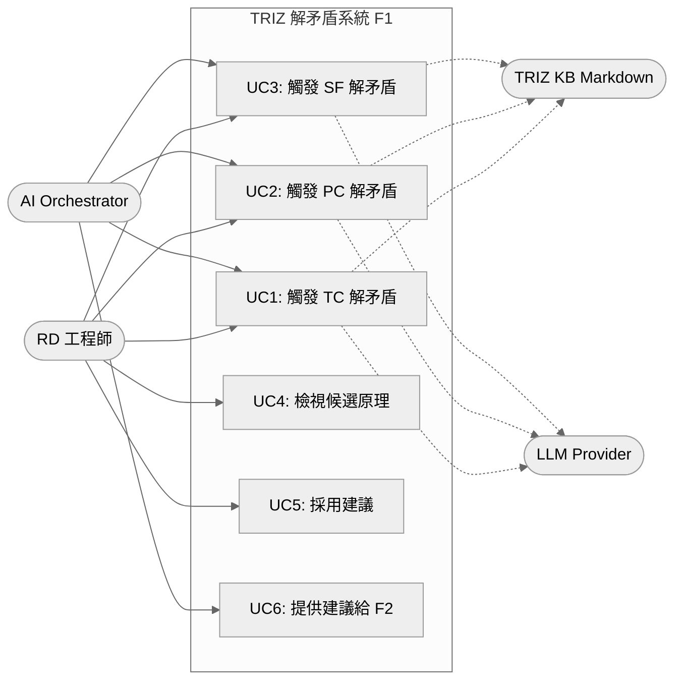
```mermaid
%%{init: {'theme': 'neutral'}}%%
graph LR
    RD([RD 工程師])
    Orch([AI Orchestrator])

    subgraph SYS[TRIZ 解矛盾系統 F1]
        UC1[UC1: 觸發 TC 解矛盾]
        UC2[UC2: 觸發 PC 解矛盾]
        UC3[UC3: 觸發 SF 解矛盾]
        UC4[UC4: 檢視候選原理]
        UC5[UC5: 採用建議]
        UC6[UC6: 提供建議給 F2]
    end

    RD --> UC1
    RD --> UC2
    RD --> UC3
    RD --> UC4
    RD --> UC5
    Orch --> UC1
    Orch --> UC2
    Orch --> UC3
    Orch --> UC6

    KB([TRIZ KB Markdown])
    LLM([LLM Provider])
    UC1 -.-> KB
    UC2 -.-> KB
    UC3 -.-> KB
    UC1 -.-> LLM
    UC2 -.-> LLM
    UC3 -.-> LLM
```


#### 2.3 主要 Use Case 摘要


| ID  | 名稱     | 主要流程                                             | 成功條件                |
| --- | ------ | ------------------------------------------------ | ------------------- |
| UC1 | TC 解矛盾 | 用 (improving, worsening) 查矩陣 → 過濾候選原理 → LLM 具體化  | 至少 3 條建議，至少 1 條跨域   |
| UC2 | PC 解矛盾 | 用 separation_type 過濾原理子集 → LLM 套分離原則             | 每條建議引用物理定律          |
| UC3 | SF 解矛盾 | 從 system_state 推導相關 Class → 注入子集 → LLM 套標準解      | 每條建議標 standard_id   |
| UC4 | 檢視候選原理 | RD 看 candidate_principles 與 suggestions          | 視覺化顯示可指著討論          |
| UC5 | 採用建議   | RD 把某條建議標 adopted → 進入候選池                        | 寫入 triz_solutions 表 |
| UC6 | 餵 F2   | F2 讀 affected_modules + secondary_contradictions | 結構化交付給子系統定義         |


---

### §3 Context Diagram（C4 Level 1）

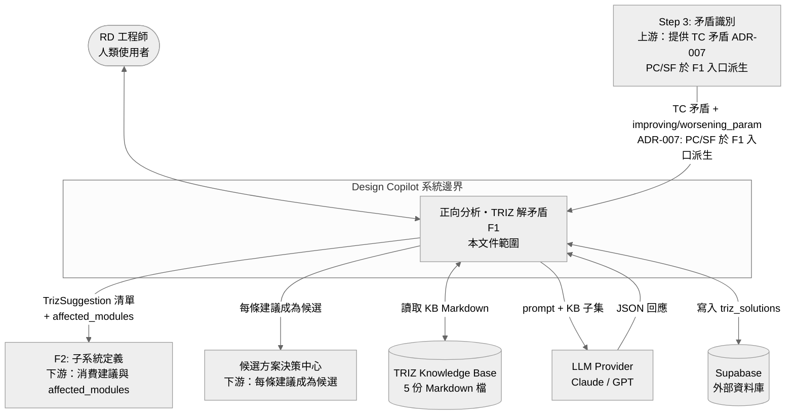
```mermaid
%%{init: {'theme': 'neutral'}}%%
graph TB
    RD([RD 工程師<br/>人類使用者])

    subgraph BoundedContext[Design Copilot 系統邊界]
        F1[正向分析・TRIZ 解矛盾<br/>F1<br/>本文件範圍]
    end

    Step3[Step 3: 矛盾識別<br/>上游：提供 TC 矛盾 ADR-007<br/>PC/SF 於 F1 入口派生]
    F2[F2: 子系統定義<br/>下游：消費建議與 affected_modules]
    Hub[候選方案決策中心<br/>下游：每條建議成為候選]

    KB[(TRIZ Knowledge Base<br/>5 份 Markdown 檔)]
    LLM[LLM Provider<br/>Claude / GPT]
    Supabase[(Supabase<br/>外部資料庫)]

    RD <--> F1
    Step3 -->|TC 矛盾 + improving/worsening_param<br/>ADR-007: PC/SF 於 F1 入口派生| F1
    F1 -->|TrizSuggestion 清單<br/>+ affected_modules| F2
    F1 -->|每條建議成為候選| Hub
    F1 <-->|讀取 KB Markdown| KB
    F1 -->|prompt + KB 子集| LLM
    LLM -->|JSON 回應| F1
    F1 <-->|寫入 triz_solutions| Supabase
```


---

### §4 Container Diagram（C4 Level 2）

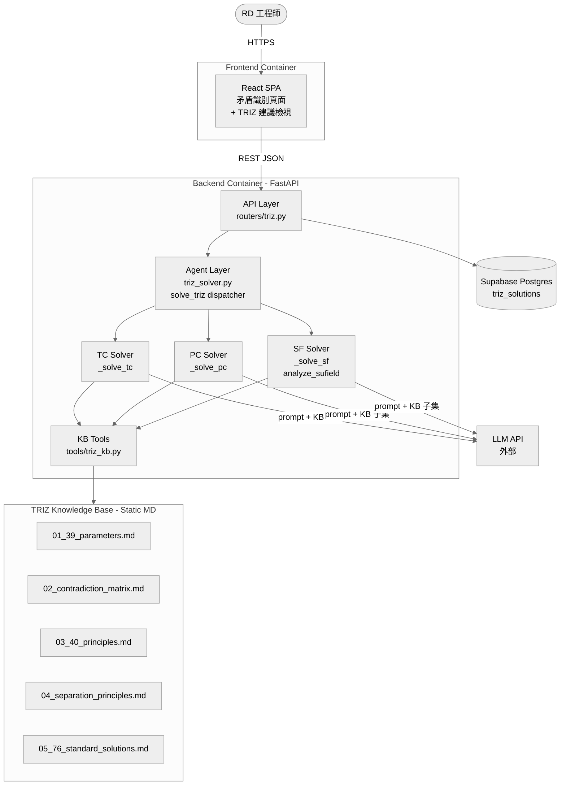
```mermaid
%%{init: {'theme': 'neutral'}}%%
graph TB
    RD([RD 工程師])

    subgraph Frontend[Frontend Container]
        FE[React SPA<br/>矛盾識別頁面<br/>+ TRIZ 建議檢視]
    end

    subgraph Backend[Backend Container - FastAPI]
        API[API Layer<br/>routers/triz.py]
        AGENT[Agent Layer<br/>triz_solver.py<br/>solve_triz dispatcher]
        TC[TC Solver<br/>_solve_tc]
        PC[PC Solver<br/>_solve_pc]
        SF[SF Solver<br/>_solve_sf<br/>analyze_sufield]
        TOOLS[KB Tools<br/>tools/triz_kb.py]
    end

    subgraph KB[TRIZ Knowledge Base - Static MD]
        K1[01_39_parameters.md]
        K2[02_contradiction_matrix.md]
        K3[03_40_principles.md]
        K4[04_separation_principles.md]
        K5[05_76_standard_solutions.md]
    end

    LLM[LLM API<br/>外部]
    DB[(Supabase Postgres<br/>triz_solutions)]

    RD -->|HTTPS| FE
    FE -->|REST JSON| API
    API --> AGENT
    AGENT --> TC
    AGENT --> PC
    AGENT --> SF
    TC --> TOOLS
    PC --> TOOLS
    SF --> TOOLS
    TOOLS --> KB
    TC -->|prompt + KB 子集| LLM
    PC -->|prompt + KB 子集| LLM
    SF -->|prompt + KB 子集| LLM
    API --> DB
```


#### 4.1 Container 職責表


| Container         | 技術棧                | 失敗時影響                      | 恢復策略               |
| ----------------- | ------------------ | -------------------------- | ------------------ |
| Frontend SPA      | React + TypeScript | RD 無法觸發；後端不受影響             | 無狀態，重啟即可           |
| Backend API/Agent | FastAPI + Python   | F1 全面停擺；Step 3 與 F2 不受影響   | 無狀態，可水平擴展          |
| KB Tools          | Python + lru_cache | 無法注入 KB；solver 退化為純 LLM 直答 | 啟動時即載入並快取          |
| TRIZ KB MD        | 靜態檔案               | 同上                         | 隨 Backend image 部署 |
| LLM Provider      | 外部 API             | 三條 solver 全部無法跑            | 重試 + 降級提示          |
| Supabase          | Postgres           | 無法持久化建議，但 in-memory 結果仍可回  | 連線重試               |


---

### §5 Component Diagram（C4 Level 3）

聚焦在 Backend Container 內部的職責切分：

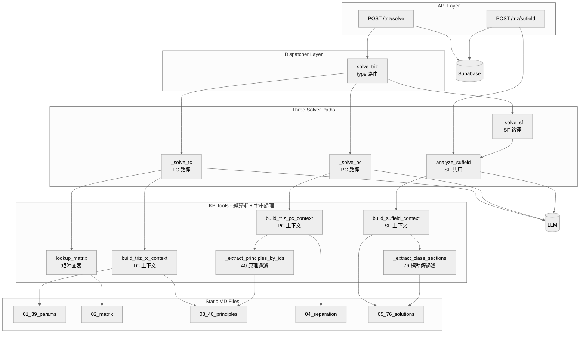
```mermaid
%%{init: {'theme': 'neutral'}}%%
graph TB
    subgraph API[API Layer]
        R1[POST /triz/solve]
        R2[POST /triz/sufield]
    end

    subgraph Dispatcher[Dispatcher Layer]
        SOLVE[solve_triz<br/>type 路由]
    end

    subgraph Solvers[Three Solver Paths]
        TC[_solve_tc<br/>TC 路徑]
        PC[_solve_pc<br/>PC 路徑]
        SF[_solve_sf<br/>SF 路徑]
        SFA[analyze_sufield<br/>SF 共用]
    end

    subgraph KBT[KB Tools - 純算術 + 字串處理]
        LM[lookup_matrix<br/>矩陣查表]
        BTC[build_triz_tc_context<br/>TC 上下文]
        BPC[build_triz_pc_context<br/>PC 上下文]
        BSF[build_sufield_context<br/>SF 上下文]
        EX1[_extract_class_sections<br/>76 標準解過濾]
        EX2[_extract_principles_by_ids<br/>40 原理過濾]
    end

    subgraph KB[Static MD Files]
        F1[01_39_params]
        F2[02_matrix]
        F3[03_40_principles]
        F4[04_separation]
        F5[05_76_solutions]
    end

    LLM[(LLM)]
    DB[(Supabase)]

    R1 --> SOLVE
    R2 --> SFA
    SOLVE --> TC
    SOLVE --> PC
    SOLVE --> SF
    SF --> SFA

    TC --> LM
    TC --> BTC
    PC --> BPC
    SFA --> BSF

    BTC --> F1
    BTC --> F3
    LM --> F2
    BPC --> F4
    BPC --> EX2
    EX2 --> F3
    BSF --> F5
    BSF --> EX1
    EX1 --> F5

    TC --> LLM
    PC --> LLM
    SFA --> LLM

    R1 --> DB
    R2 --> DB
```


#### 5.1 Component 職責表


| Component                    | 純度      | 是否呼叫 LLM | 是否可獨立測試    |
| ---------------------------- | ------- | -------- | ---------- |
| `solve_triz` (dispatcher)    | 純路由     | ❌        | ✅          |
| `_solve_tc`                  | 編排      | ✅        | 需 mock LLM |
| `_solve_pc`                  | 編排      | ✅        | 需 mock LLM |
| `_solve_sf`                  | 編排      | ✅        | 需 mock LLM |
| `lookup_matrix`              | 純函式     | ❌        | ✅          |
| `build_triz_tc_context`      | 純字串     | ❌        | ✅          |
| `build_triz_pc_context`      | 純字串     | ❌        | ✅          |
| `build_sufield_context`      | 純字串     | ❌        | ✅          |
| `_extract_class_sections`    | 純 regex | ❌        | ✅          |
| `_extract_principles_by_ids` | 純 regex | ❌        | ✅          |


> **設計原則**：除了三條 `_solve_`* 必須呼叫 LLM，其他所有 component 都是 pure function 並用 `lru_cache` 快取，可在沒有外部依賴下單元測試。**矩陣查表用程式而非 LLM**——這是 TRIZ 規則引擎落地的關鍵。

---

### §6 資料模型與三條路徑的定義來源

#### 6.1 核心實體關係

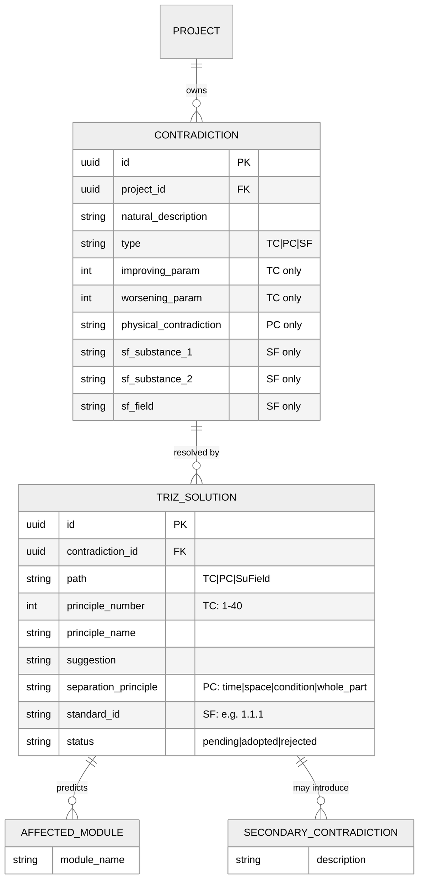
```mermaid
%%{init: {'theme': 'neutral'}}%%
erDiagram
    PROJECT ||--o{ CONTRADICTION : owns
    CONTRADICTION ||--o{ TRIZ_SOLUTION : "resolved by"
    TRIZ_SOLUTION ||--o{ AFFECTED_MODULE : "predicts"
    TRIZ_SOLUTION ||--o{ SECONDARY_CONTRADICTION : "may introduce"

    CONTRADICTION {
        uuid id PK
        uuid project_id FK
        string natural_description
        string type "TC|PC|SF"
        int improving_param "TC only"
        int worsening_param "TC only"
        string physical_contradiction "PC only"
        string sf_substance_1 "SF only"
        string sf_substance_2 "SF only"
        string sf_field "SF only"
    }
    TRIZ_SOLUTION {
        uuid id PK
        uuid contradiction_id FK
        string path "TC|PC|SuField"
        int principle_number "TC: 1-40"
        string principle_name
        string suggestion
        string separation_principle "PC: time|space|condition|whole_part"
        string standard_id "SF: e.g. 1.1.1"
        string status "pending|adopted|rejected"
    }
    AFFECTED_MODULE {
        string module_name
    }
    SECONDARY_CONTRADICTION {
        string description
    }
```


#### 6.2 三類矛盾的層次關係（TC / PC / SF）

> **v1.1 重寫說明**：舊版本用決策樹把矛盾互斥分類為 TC 或 PC 或 SF，這是 category error —— 把「分析視角選擇」誤編成「矛盾類型單選題」。TC / PC / SF 在 TRIZ 經典理論中是**同一矛盾的三層視角**（現象 / 本質 / 結構），應以 drill-down 方式遞進使用，不是三選一。完整診斷見 `../../02-design/specs/triz/E5x--triz-layered-drilldown-optimization.md` §2。

**新設計：預設三層分析 + L2 有條件觸發**

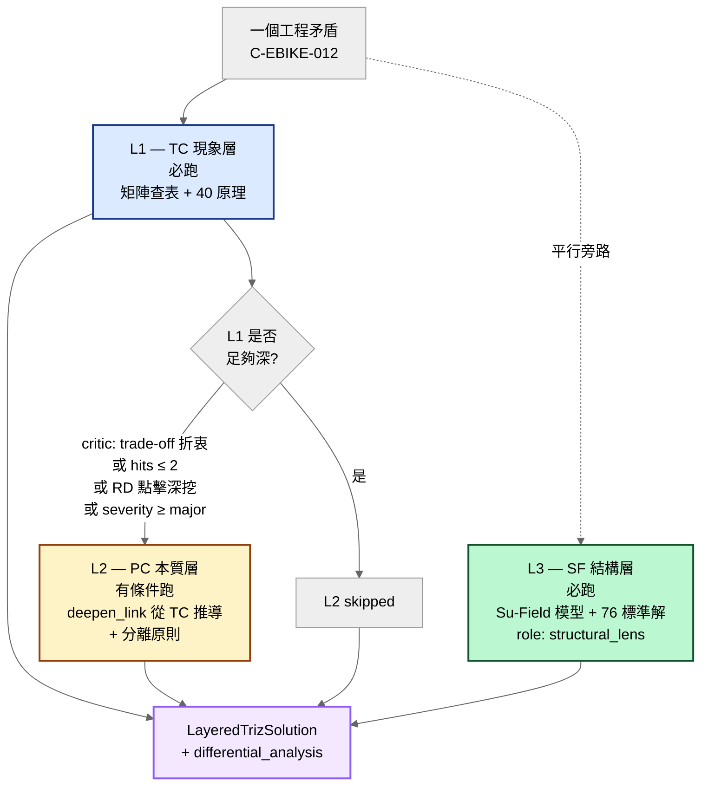
```mermaid
%%{init: {'theme': 'neutral'}}%%
graph TB
    M[一個工程矛盾<br/>C-EBIKE-012]

    M --> L1[L1 — TC 現象層<br/>必跑<br/>矩陣查表 + 40 原理]
    M -.平行旁路.-> L3[L3 — SF 結構層<br/>必跑<br/>Su-Field 模型 + 76 標準解<br/>role: structural_lens]

    L1 --> J{L1 是否<br/>足夠深?}
    J -->|critic: trade-off 折衷<br/>或 hits ≤ 2<br/>或 RD 點擊深挖<br/>或 severity ≥ major| L2[L2 — PC 本質層<br/>有條件跑<br/>deepen_link 從 TC 推導<br/>+ 分離原則]
    J -->|是| SKIP[L2 skipped]

    L1 --> LTS[LayeredTrizSolution<br/>+ differential_analysis]
    L2 --> LTS
    SKIP --> LTS
    L3 --> LTS

    style L1 fill:#dbeafe,stroke:#1e3a8a,stroke-width:2px,color:#000
    style L2 fill:#fef3c7,stroke:#92400e,stroke-width:2px,color:#000
    style L3 fill:#bbf7d0,stroke:#14532d,stroke-width:2px,color:#000
    style LTS fill:#F3E8FF,stroke:#8B5CF6,stroke-width:2px,color:#000
```


| 層      | 類型  | 角色      | 必跑    | 觸發條件（L2 專用）                                                                                        |
| ------ | --- | ------- | ----- | -------------------------------------------------------------------------------------------------- |
| **L1** | TC  | 現象層（表象） | ✅     | —                                                                                                  |
| **L2** | PC  | 本質層（根因） | ⛔ 有條件 | (a) L1 產出全被 critic 判為 trade-off 折衷；(b) L1 principle hits ≤ 2；(c) RD 手動點擊深挖；(d) 矛盾 severity ≥ major |
| **L3** | SF  | 結構層（旁路） | ✅     | —                                                                                                  |


**退場條件**：若 L1 的 improving/worsening 參數都無法抽取（資訊不完整）→ 退回 Step 3 補資訊；L3 仍可嘗試用自然語言推 Su-Field 模型。

#### 6.3 TC 路徑的定義來源

**結構**：兩個 TRIZ 39 工程參數的衝突，一個要改善、一個會惡化。

**範例**：

- 改善：#1 移動物件的重量（馬達輕量化）
- 惡化：#14 強度（馬達散熱片變薄會降低結構強度）

**解法來源**：TRIZ 矛盾矩陣 39×39，每格列出 1-4 個推薦原理（共 40 個發明原理）。

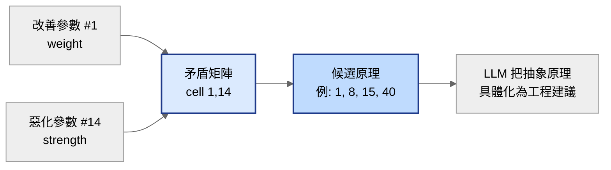
```mermaid
%%{init: {'theme': 'neutral'}}%%
graph LR
    Imp[改善參數 #1<br/>weight] --> M
    Wor[惡化參數 #14<br/>strength] --> M
    M[矛盾矩陣<br/>cell 1,14] --> P[候選原理<br/>例: 1, 8, 15, 40]
    P --> LLM[LLM 把抽象原理<br/>具體化為工程建議]

    style M fill:#dbeafe,stroke:#1e3a8a,stroke-width:2px,color:#000
    style P fill:#bfdbfe,stroke:#1e3a8a,stroke-width:2px,color:#000
```


**定義來源**：`backend/triz_knowledge_base/02_contradiction_matrix.md`（39×39 表格）+ `01_39_parameters.md`（參數定義）+ `03_40_principles.md`（原理詳細）。

#### 6.4 PC 路徑的定義來源

**結構**：同一個物件需要互斥的物理屬性。

**範例**：

- 矛盾：齒輪要硬（耐磨）但又要軟（吸震）
- PC 描述：「同一個齒輪表面，在接觸瞬間需要硬，在受衝擊時需要軟」

**解法來源**：4 個分離原則，每個對應一組 40 原理的子集。

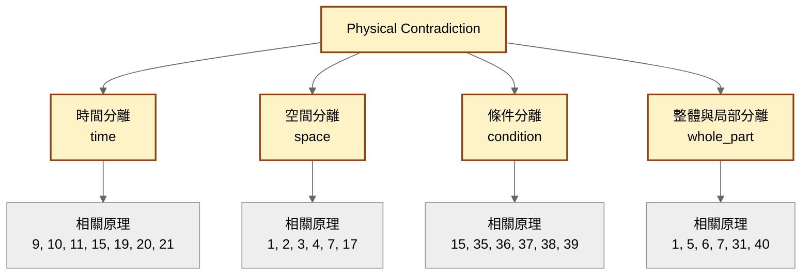
```mermaid
%%{init: {'theme': 'neutral'}}%%
graph TB
    PC[Physical Contradiction]

    PC --> S1[時間分離<br/>time]
    PC --> S2[空間分離<br/>space]
    PC --> S3[條件分離<br/>condition]
    PC --> S4[整體與局部分離<br/>whole_part]

    S1 --> P1[相關原理<br/>9, 10, 11, 15, 19, 20, 21]
    S2 --> P2[相關原理<br/>1, 2, 3, 4, 7, 17]
    S3 --> P3[相關原理<br/>15, 35, 36, 37, 38, 39]
    S4 --> P4[相關原理<br/>1, 5, 6, 7, 31, 40]

    style PC fill:#fef3c7,stroke:#92400e,stroke-width:2px,color:#000
    style S1 fill:#fef3c7,stroke:#92400e,stroke-width:2px,color:#000
    style S2 fill:#fef3c7,stroke:#92400e,stroke-width:2px,color:#000
    style S3 fill:#fef3c7,stroke:#92400e,stroke-width:2px,color:#000
    style S4 fill:#fef3c7,stroke:#92400e,stroke-width:2px,color:#000
```


**定義來源**：`backend/triz_knowledge_base/04_separation_principles.md`（4 個分離原則的策略） + `03_40_principles.md` 的子集。每個分離原則對應的子集寫死在 `tools/triz_kb.py` 的 `_SEPARATION_RELEVANT_PRINCIPLES` dict。

#### 6.5 SF 路徑的定義來源

**結構**：Su-Field 模型把系統抽象為「物質 1（S1）+ 物質 2（S2）+ 場（F）」三元組。

**範例**：

- S1：散熱片（Object）
- S2：MOSFET（Tool）
- F：熱場（Thermal field, Fourier heat conduction）
- 系統狀態：insufficient（散熱量不夠）

**解法來源**：76 個標準解，依系統狀態映射到對應 Class。

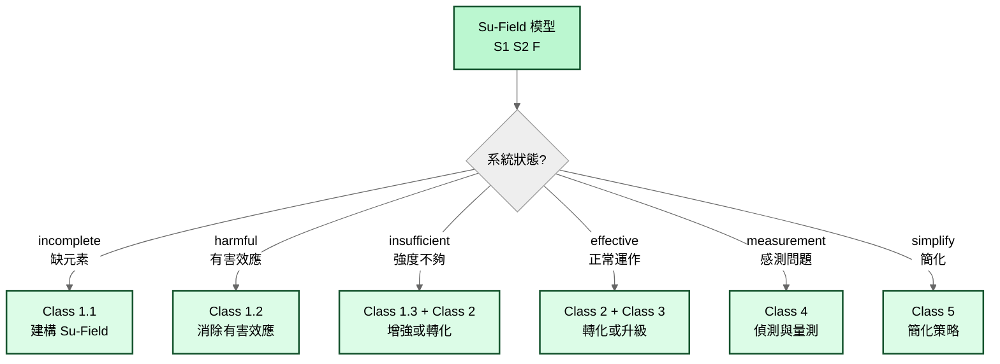
```mermaid
%%{init: {'theme': 'neutral'}}%%
graph TB
    SF[Su-Field 模型<br/>S1 S2 F]

    SF --> ST{系統狀態?}
    ST -->|incomplete<br/>缺元素| C1[Class 1.1<br/>建構 Su-Field]
    ST -->|harmful<br/>有害效應| C12[Class 1.2<br/>消除有害效應]
    ST -->|insufficient<br/>強度不夠| C13[Class 1.3 + Class 2<br/>增強或轉化]
    ST -->|effective<br/>正常運作| C23[Class 2 + Class 3<br/>轉化或升級]
    ST -->|measurement<br/>感測問題| C4[Class 4<br/>偵測與量測]
    ST -->|simplify<br/>簡化| C5[Class 5<br/>簡化策略]

    style SF fill:#bbf7d0,stroke:#14532d,stroke-width:2px,color:#000
    style C1 fill:#dcfce7,stroke:#14532d,stroke-width:2px,color:#000
    style C12 fill:#dcfce7,stroke:#14532d,stroke-width:2px,color:#000
    style C13 fill:#dcfce7,stroke:#14532d,stroke-width:2px,color:#000
    style C23 fill:#dcfce7,stroke:#14532d,stroke-width:2px,color:#000
    style C4 fill:#dcfce7,stroke:#14532d,stroke-width:2px,color:#000
    style C5 fill:#dcfce7,stroke:#14532d,stroke-width:2px,color:#000
```


**定義來源**：`backend/triz_knowledge_base/05_76_standard_solutions.md`（76 標準解依 Class 1-5 分類）。系統狀態到 Class 的映射寫死在 `tools/triz_kb.py` 的 `_SUFIELD_STATE_TO_CLASSES` dict。

#### 6.6 三條 solver 實作獨立，但 F1 輸出必須分層聚合

> **v1.1 重寫說明**：舊版本說「三路徑不能合併」並以此排除 ARIZ — 但 ARIZ 本質就是 TC → PC 深挖的算法，這段論述自相矛盾。真正的設計原則應區分「solver 實作層」與「F1 輸出層」。

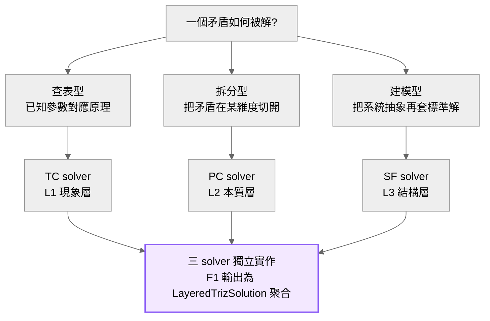
```mermaid
%%{init: {'theme': 'neutral'}}%%
graph TB
    Q[一個矛盾如何被解?]

    Q --> A1[查表型<br/>已知參數對應原理]
    Q --> A2[拆分型<br/>把矛盾在某維度切開]
    Q --> A3[建模型<br/>把系統抽象再套標準解]

    A1 --> TC2[TC solver<br/>L1 現象層]
    A2 --> PC2[PC solver<br/>L2 本質層]
    A3 --> SF2[SF solver<br/>L3 結構層]

    TC2 --> R[三 solver 獨立實作<br/>F1 輸出為 LayeredTrizSolution 聚合]
    PC2 --> R
    SF2 --> R

    style R fill:#F3E8FF,stroke:#8B5CF6,stroke-width:2px,color:#000
```


| 層級             | 原則                                                                                                                     |
| -------------- | ---------------------------------------------------------------------------------------------------------------------- |
| **Solver 實作層** | TC / PC / SF 三個 solver 各自保有獨立 schema（兩參數 / 矛盾陳述 / 三元組），互不耦合，可獨立單元測試。此為工程實作選擇。                                          |
| **F1 輸出層**     | 不是三條 pending 候選並列，而是 `LayeredTrizSolution` 分層聚合體。同一矛盾的 L1 / L2 / L3 透過 `deepen_link` 與 `structural_lens` 建立關係。此為方法論要求。 |
| **ARIZ 的地位**   | ARIZ 精神「TC 不夠深 → 深挖為 PC」由 §6.7 的 deepen_link 契約落地；L2 的觸發由 §6.2 的條件樹管理。                                                 |
| **何時仍要新增路徑**   | 進階 TRIZ 工具（Trends of Evolution、Function Analysis、Trimming）若要納入，屬於新 solver 的擴充，不與本架構衝突。                                 |


#### 6.7 TC → PC 深挖契約（deepen_link / ARIZ 落地）

當 §6.2 判斷要觸發 L2 時，系統必須從 L1 的 TC 資訊**自動**產出 PC 候選，而不是要 RD 重新輸入。這是 ARIZ 精神工程化的關鍵。

**深挖演算法**（rule + LLM 複合）：

```
輸入:
  L1.improving_param: int   # TRIZ 39 參數 ID
  L1.worsening_param: int   # TRIZ 39 參數 ID
  L1.natural_description: str

Step 1 — 推導物理根因變數（LLM）:
  prompt: "在 e-bike 工程脈絡下，#{improving_param} 與 #{worsening_param}
          的 trade-off 通常由哪個單一物理參數導致？"
  output: derived_physical_parameter: str  # e.g. "瞬時功率 P(t)"

Step 2 — 構造矛盾陳述（LLM）:
  "derived_physical_parameter 必須 {high spec}（滿足 improving）
                              且必須 {low spec}（滿足 worsening）"

Step 3 — 判定分離類型候選（rule）:
  for each separation_type in [time, space, condition, whole_part]:
    if 該類型在此物理場景可行 → 加入候選清單
  通常 time / condition 會優先（e.g. 動態負載）
  space / whole_part 次之（e.g. 結構設計）

Step 4 — 交由 _solve_pc 具體化:
  _solve_pc(
    physical_contradiction=Step2 陳述,
    separation_type=Step3 候選之一,
    context=L1.natural_description,
  )
```

**資料契約**：

```python
class DeepenLink(BaseModel):
    from_layer: Literal["L1_surface"]
    from_tc_pair: tuple[int, int]              # (improving, worsening)
    derived_physical_parameter: str
    contradiction_statement: str
    separation_type_candidates: list[SeparationCandidate]

class SeparationCandidate(BaseModel):
    type: Literal["time", "space", "condition", "whole_part"]
    rationale: str
    confidence: float  # 0-1, LLM 自評
```

**範例**（e-bike 馬達散熱，接續 §6.3）：

```
L1: (#21 功率, #17 溫度)
  ↓ deepen
L2.derived_physical_parameter: "瞬時功率 P(t)"
L2.contradiction_statement: "P(t) 必須 ≥ P_peak（爬坡）且必須 ≤ P_thermal（散熱上限）"
L2.separation_type_candidates:
  - time: "爬坡 10 秒允許 P_peak；巡航降回 P_thermal"         confidence=0.85
  - condition: "T < 100°C 允許 P_peak；T ≥ 100°C 降額"       confidence=0.80
```

**為什麼這是 ARIZ 精神的落地**：

- ARIZ 要求「把 TC 追到單一物理參數的兩難」— Step 1-2 正是這件事
- ARIZ 要求「套分離原則解決」— Step 3-4 正是這件事
- 舊架構把 TC / PC 編為互斥類型，ARIZ 無處安放；新架構用 `deepen_link` 把兩者建立 drill-down 關係，ARIZ 成為架構的原生能力

---

### §7 Sequence Diagrams

> F1 對外的主入口為 `solve_triz_layered` orchestrator。原 `solve_triz` dispatcher 與三條 `_solve_`* 保留為底層 primitive，不由 UI 直接呼叫。完整時序見 §7.0。

#### 7.0 主入口：solve_triz_layered orchestrator（v1.1 新增）

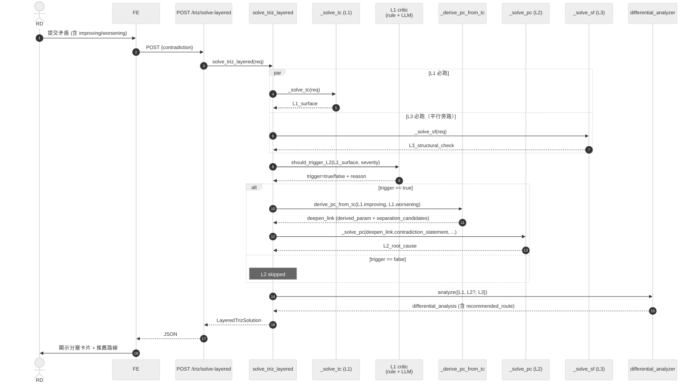
```mermaid
%%{init: {'theme': 'neutral'}}%%
sequenceDiagram
    autonumber
    actor RD
    participant FE
    participant API as POST /triz/solve-layered
    participant ORCH as solve_triz_layered
    participant TC as _solve_tc (L1)
    participant CRITIC as L1 critic<br/>(rule + LLM)
    participant DEEPEN as _derive_pc_from_tc
    participant PC as _solve_pc (L2)
    participant SF as _solve_sf (L3)
    participant DIFF as differential_analyzer

    RD->>FE: 提交矛盾 (含 improving/worsening)
    FE->>API: POST {contradiction}
    API->>ORCH: solve_triz_layered(req)

    par L1 必跑
        ORCH->>TC: _solve_tc(req)
        TC-->>ORCH: L1_surface
    and L3 必跑（平行旁路）
        ORCH->>SF: _solve_sf(req)
        SF-->>ORCH: L3_structural_check
    end

    ORCH->>CRITIC: should_trigger_L2(L1_surface, severity)
    CRITIC-->>ORCH: trigger=true/false + reason

    alt trigger == true
        ORCH->>DEEPEN: derive_pc_from_tc(L1.improving, L1.worsening)
        DEEPEN-->>ORCH: deepen_link (derived_param + separation_candidates)
        ORCH->>PC: _solve_pc(deepen_link.contradiction_statement, ...)
        PC-->>ORCH: L2_root_cause
    else trigger == false
        Note over ORCH: L2 skipped
    end

    ORCH->>DIFF: analyze({L1, L2?, L3})
    DIFF-->>ORCH: differential_analysis (含 recommended_route)

    ORCH-->>API: LayeredTrizSolution
    API-->>FE: JSON
    FE->>RD: 顯示分層卡片 + 推薦路線
```


**L2 觸發判斷邏輯**（critic）：

```python
def should_trigger_L2(L1: TrizLookupResponse, severity: str) -> tuple[bool, str]:
    # 規則層
    if severity in ("fatal", "major"):
        return True, "severity ≥ major，預設深挖"
    if len(L1.candidate_principles) <= 2:
        return True, "L1 principle hits ≤ 2，原理覆蓋不足"
    if L1.rd_manual_deepen_request:
        return True, "RD 主動要求深挖"

    # LLM 層：判斷 L1 建議是否屬於 trade-off 折衷
    judgment = llm_critic(L1.suggestions, prompt=L1_TRADE_OFF_CRITIC)
    if judgment.all_trade_off:
        return True, f"critic: {judgment.reason}"

    return False, "L1 已足夠深"
```

#### 7.1 底層 primitive：solve_triz dispatcher

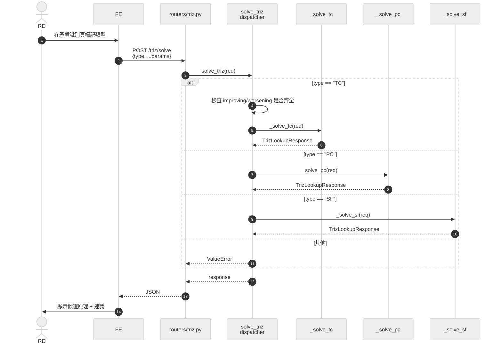
```mermaid
%%{init: {'theme': 'neutral'}}%%
sequenceDiagram
    autonumber
    actor RD
    participant FE
    participant API as routers/triz.py
    participant DSP as solve_triz<br/>dispatcher
    participant TC as _solve_tc
    participant PC as _solve_pc
    participant SF as _solve_sf

    RD->>FE: 在矛盾識別頁標記類型
    FE->>API: POST /triz/solve<br/>{type, ...params}
    API->>DSP: solve_triz(req)

    alt type == "TC"
        DSP->>DSP: 檢查 improving/worsening 是否齊全
        DSP->>TC: _solve_tc(req)
        TC-->>DSP: TrizLookupResponse
    else type == "PC"
        DSP->>PC: _solve_pc(req)
        PC-->>DSP: TrizLookupResponse
    else type == "SF"
        DSP->>SF: _solve_sf(req)
        SF-->>DSP: TrizLookupResponse
    else 其他
        DSP-->>API: ValueError
    end

    DSP-->>API: response
    API-->>FE: JSON
    FE->>RD: 顯示候選原理 + 建議
```


#### 7.2 UC1：TC 路徑詳細時序

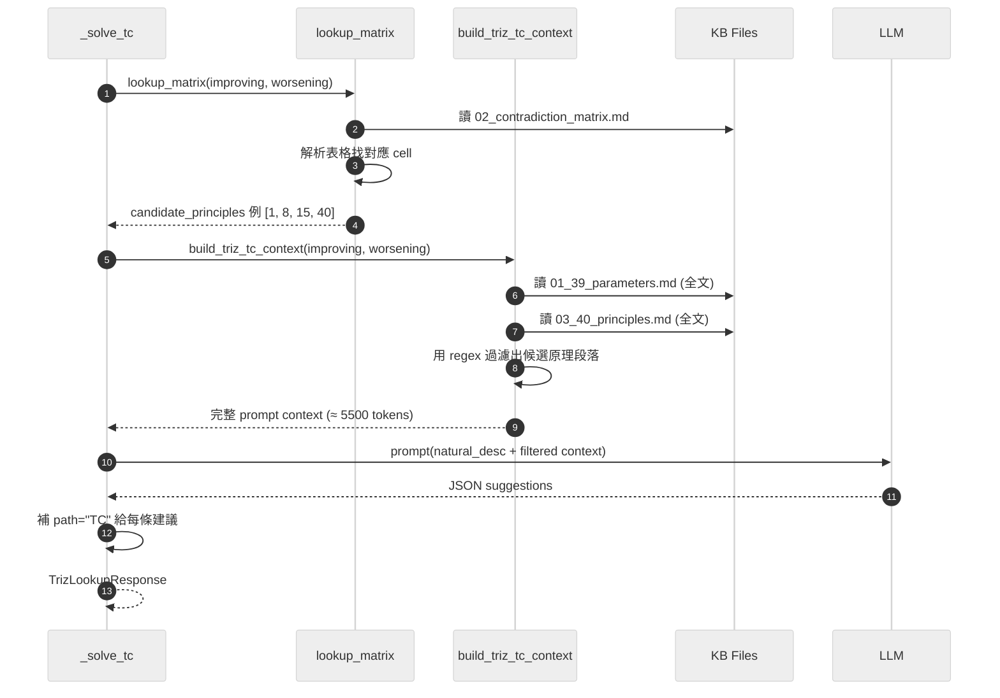
```mermaid
%%{init: {'theme': 'neutral'}}%%
sequenceDiagram
    autonumber
    participant TC as _solve_tc
    participant LM as lookup_matrix
    participant BTC as build_triz_tc_context
    participant KB as KB Files
    participant LLM

    TC->>LM: lookup_matrix(improving, worsening)
    LM->>KB: 讀 02_contradiction_matrix.md
    LM->>LM: 解析表格找對應 cell
    LM-->>TC: candidate_principles 例 [1, 8, 15, 40]

    TC->>BTC: build_triz_tc_context(improving, worsening)
    BTC->>KB: 讀 01_39_parameters.md (全文)
    BTC->>KB: 讀 03_40_principles.md (全文)
    BTC->>BTC: 用 regex 過濾出候選原理段落
    BTC-->>TC: 完整 prompt context (≈ 5500 tokens)

    TC->>LLM: prompt(natural_desc + filtered context)
    LLM-->>TC: JSON suggestions

    TC->>TC: 補 path="TC" 給每條建議
    TC-->>TC: TrizLookupResponse
```


#### 7.3 UC2：PC 路徑詳細時序

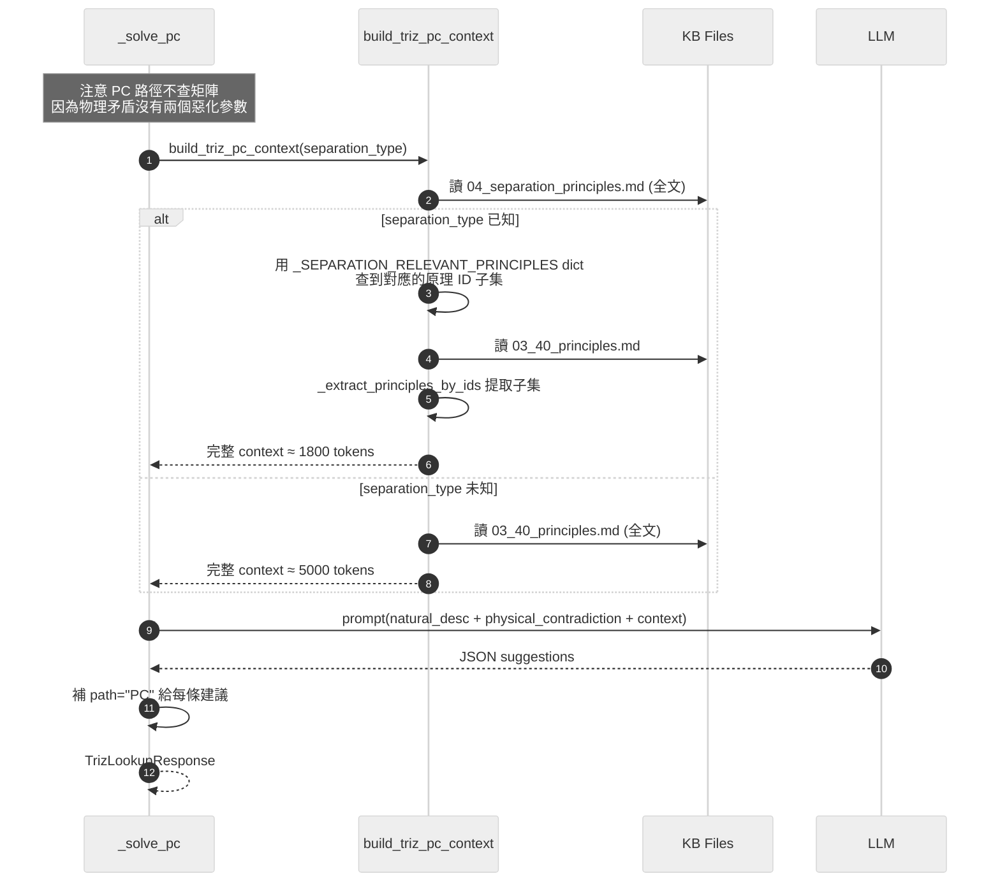
```mermaid
%%{init: {'theme': 'neutral'}}%%
sequenceDiagram
    autonumber
    participant PC as _solve_pc
    participant BPC as build_triz_pc_context
    participant KB as KB Files
    participant LLM

    Note over PC: 注意 PC 路徑不查矩陣<br/>因為物理矛盾沒有兩個惡化參數

    PC->>BPC: build_triz_pc_context(separation_type)
    BPC->>KB: 讀 04_separation_principles.md (全文)

    alt separation_type 已知
        BPC->>BPC: 用 _SEPARATION_RELEVANT_PRINCIPLES dict<br/>查到對應的原理 ID 子集
        BPC->>KB: 讀 03_40_principles.md
        BPC->>BPC: _extract_principles_by_ids 提取子集
        BPC-->>PC: 完整 context ≈ 1800 tokens
    else separation_type 未知
        BPC->>KB: 讀 03_40_principles.md (全文)
        BPC-->>PC: 完整 context ≈ 5000 tokens
    end

    PC->>LLM: prompt(natural_desc + physical_contradiction + context)
    LLM-->>PC: JSON suggestions
    PC->>PC: 補 path="PC" 給每條建議
    PC-->>PC: TrizLookupResponse
```


#### 7.4 UC3：SF 路徑詳細時序

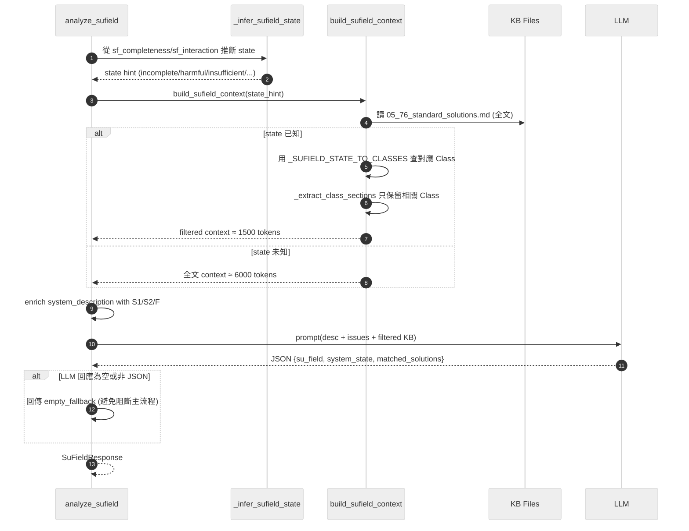
```mermaid
%%{init: {'theme': 'neutral'}}%%
sequenceDiagram
    autonumber
    participant SF as analyze_sufield
    participant INF as _infer_sufield_state
    participant BSF as build_sufield_context
    participant KB as KB Files
    participant LLM

    SF->>INF: 從 sf_completeness/sf_interaction 推斷 state
    INF-->>SF: state hint (incomplete/harmful/insufficient/...)

    SF->>BSF: build_sufield_context(state_hint)
    BSF->>KB: 讀 05_76_standard_solutions.md (全文)

    alt state 已知
        BSF->>BSF: 用 _SUFIELD_STATE_TO_CLASSES 查對應 Class
        BSF->>BSF: _extract_class_sections 只保留相關 Class
        BSF-->>SF: filtered context ≈ 1500 tokens
    else state 未知
        BSF-->>SF: 全文 context ≈ 6000 tokens
    end

    SF->>SF: enrich system_description with S1/S2/F
    SF->>LLM: prompt(desc + issues + filtered KB)
    LLM-->>SF: JSON {su_field, system_state, matched_solutions}

    alt LLM 回應為空或非 JSON
        SF->>SF: 回傳 empty_fallback (避免阻斷主流程)
    end

    SF-->>SF: SuFieldResponse
```


#### 7.5 三條路徑的差異總覽

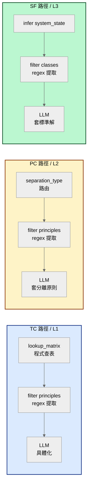
```mermaid
%%{init: {'theme': 'neutral'}}%%
graph LR
    subgraph TCPath[TC 路徑 / L1]
        TC1[lookup_matrix<br/>程式查表] --> TC2[filter principles<br/>regex 提取] --> TC3[LLM<br/>具體化]
    end

    subgraph PCPath[PC 路徑 / L2]
        PC1[separation_type<br/>路由] --> PC2[filter principles<br/>regex 提取] --> PC3[LLM<br/>套分離原則]
    end

    subgraph SFPath[SF 路徑 / L3]
        SF1[infer system_state] --> SF2[filter classes<br/>regex 提取] --> SF3[LLM<br/>套標準解]
    end

    style TCPath fill:#dbeafe,stroke:#1e3a8a,stroke-width:2px,color:#000
    style PCPath fill:#fef3c7,stroke:#92400e,stroke-width:2px,color:#000
    style SFPath fill:#bbf7d0,stroke:#14532d,stroke-width:2px,color:#000
```


#### 7.6 Layered Orchestrator 總圖（v1.1 新增）

三條 solver 在 v1.1 後不再被 RD 直接觸發，而是被 `solve_triz_layered` 調度：

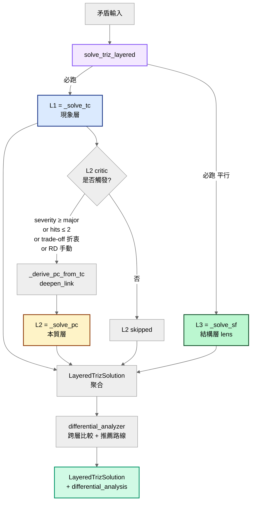
```mermaid
%%{init: {'theme': 'neutral'}}%%
graph TB
    REQ[矛盾輸入] --> ORCH[solve_triz_layered]

    ORCH -->|必跑| L1[L1 = _solve_tc<br/>現象層]
    ORCH -->|必跑 平行| L3[L3 = _solve_sf<br/>結構層 lens]

    L1 --> CRIT{L2 critic<br/>是否觸發?}
    CRIT -->|severity ≥ major<br/>or hits ≤ 2<br/>or trade-off 折衷<br/>or RD 手動| DPN[_derive_pc_from_tc<br/>deepen_link]
    CRIT -->|否| SKIP[L2 skipped]
    DPN --> L2[L2 = _solve_pc<br/>本質層]

    L1 --> AGG[LayeredTrizSolution<br/>聚合]
    L2 --> AGG
    SKIP --> AGG
    L3 --> AGG

    AGG --> DIFF[differential_analyzer<br/>跨層比較 + 推薦路線]
    DIFF --> OUT[LayeredTrizSolution<br/>+ differential_analysis]

    style ORCH fill:#F3E8FF,stroke:#8B5CF6,stroke-width:2px,color:#000
    style L1 fill:#dbeafe,stroke:#1e3a8a,stroke-width:2px,color:#000
    style L2 fill:#fef3c7,stroke:#92400e,stroke-width:2px,color:#000
    style L3 fill:#bbf7d0,stroke:#14532d,stroke-width:2px,color:#000
    style OUT fill:#D1FAE5,stroke:#059669,stroke-width:2px,color:#000
```


> **設計關鍵**：L1 與 L3 並行（無依賴），L2 序列依賴 L1（critic + deepen）。三層匯流後由 `differential_analyzer` 產生跨層比較與推薦路線，這是 v1.1 新增的核心元件。

---

### §8 State Machine

#### 8.1 矛盾的生命週期

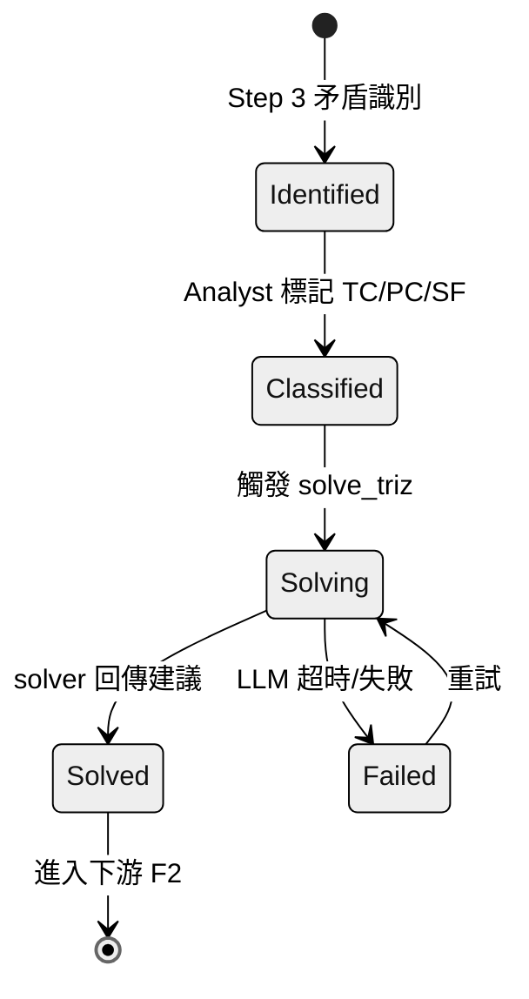
```mermaid
%%{init: {'theme': 'neutral'}}%%
stateDiagram-v2
    [*] --> Identified: Step 3 矛盾識別
    Identified --> Classified: Analyst 標記 TC/PC/SF
    Classified --> Solving: 觸發 solve_triz
    Solving --> Solved: solver 回傳建議
    Solving --> Failed: LLM 超時/失敗
    Failed --> Solving: 重試
    Solved --> [*]: 進入下游 F2
```


#### 8.2 TrizSuggestion 狀態流轉

```mermaid
%%{init: {'theme': 'neutral'}}%%
stateDiagram-v2
    [*] --> Pending: solver 產出
    Pending --> Adopted: RD 採用
    Pending --> Rejected: RD 拒絕
    Adopted --> Implemented: 進入 F2 子系統定義
    Implemented --> Validated: Pre-CAD 通過
    Validated --> [*]
    Rejected --> [*]
```


#### 8.3 三類矛盾路由的決策狀態

```mermaid
%%{init: {'theme': 'neutral'}}%%
stateDiagram-v2
    [*] --> Routing: solve_triz dispatcher
    Routing --> TCPath: type==TC + 兩參數齊全
    Routing --> EmptyTC: type==TC 但缺參數
    Routing --> PCPath: type==PC
    Routing --> SFPath: type==SF
    Routing --> Error: 未知 type

    TCPath --> [*]: 正常產出
    PCPath --> [*]: 正常產出
    SFPath --> [*]: 正常產出
    EmptyTC --> [*]: 回傳空 suggestions
    Error --> [*]: ValueError
```


---

### §9 知識庫注入策略

TRIZ 知識庫總大小約 6 萬字（39 參數 + 矩陣 + 40 原理 + 分離原則 + 76 標準解），全部塞進 prompt 會用掉 LLM 大半 context window。系統採用 **「規則引擎做精準提取 + 子集注入」** 的策略，讓每條 solver 只注入它真正需要的部分。

#### 9.1 三條路徑的注入大小對比

```mermaid
%%{init: {'theme': 'neutral'}}%%
flowchart LR
    KB[TRIZ KB 全文<br/>≈ 60000 字] --> TC[TC 路徑<br/>≈ 5500 tokens]
    KB --> PC[PC 路徑<br/>≈ 1800 tokens]
    KB --> SF[SF 路徑<br/>≈ 1500 tokens]
    KB --> Bad[全塞策略<br/>≈ 25000 tokens<br/>不採用]

    style KB fill:#dbeafe,stroke:#1e3a8a,stroke-width:2px,color:#000
    style TC fill:#bfdbfe,stroke:#1e3a8a,stroke-width:2px,color:#000
    style PC fill:#fef3c7,stroke:#92400e,stroke-width:2px,color:#000
    style SF fill:#bbf7d0,stroke:#14532d,stroke-width:2px,color:#000
    style Bad fill:#fecaca,stroke:#7f1d1d,stroke-width:2px,color:#000
```


#### 9.2 注入策略的三層篩選

```mermaid
%%{init: {'theme': 'neutral'}}%%
flowchart TB
    Q[Solver 請求] --> L1[Layer 1: Path 路由<br/>TC/PC/SF 分開處理]
    L1 --> L2[Layer 2: 規則查表<br/>matrix lookup / state mapping]
    L2 --> L3[Layer 3: Regex 子集提取<br/>只保留相關原理或 Class]
    L3 --> OUT[最小化 prompt context]

    style L1 fill:#e0f2fe,stroke:#0c4a6e,stroke-width:2px,color:#000
    style L2 fill:#7dd3fc,stroke:#0c4a6e,stroke-width:2px,color:#000
    style L3 fill:#0ea5e9,stroke:#0c4a6e,stroke-width:2px,color:#fff
    style OUT fill:#bbf7d0,stroke:#14532d,stroke-width:2px,color:#000
```


| 層級          | 機制                   | 在三條路徑上的差異                                                    |
| ----------- | -------------------- | ------------------------------------------------------------ |
| L1 Path 路由  | dispatcher 用 type 分流 | 三條完全分開                                                       |
| L2 規則查表     | 程式查表得出「相關 ID 清單」     | TC: 矩陣 cell；PC: separation→principle ids；SF: state→class ids |
| L3 Regex 提取 | 從 KB MD 抽取對應段落       | 過濾後 token 數降到原本 1/4 - 1/15                                   |


#### 9.3 規則引擎 vs LLM 的職責切分

```mermaid
%%{init: {'theme': 'neutral'}}%%
graph LR
    Rule[規則引擎做的事] --> R1[參數對應]
    Rule --> R2[矩陣查表]
    Rule --> R3[原理 ID 過濾]
    Rule --> R4[Class 過濾]
    Rule --> R5[KB 段落抽取]

    LLM2[LLM 做的事] --> M1[抽象原理具體化]
    LLM2 --> M2[跨域類比]
    LLM2 --> M3[預測二次矛盾]
    LLM2 --> M4[預測 affected modules]

    style Rule fill:#dbeafe,stroke:#1e3a8a,stroke-width:2px,color:#000
    style LLM2 fill:#fef3c7,stroke:#92400e,stroke-width:2px,color:#000
```


> **設計原則**：**確定性的事情交給規則引擎，創造性的事情交給 LLM**。矩陣查表是確定性的（給定兩參數一定有同一組原理），用 LLM 反而容易出錯；具體化抽象原理是創造性的（同一個原理在 e-bike 和半導體有完全不同的實作），這是 LLM 的強項。

---

### §10 對下游 F2 子系統定義的契約

> **v1.1 升級**：hand-off 從 `TrizSuggestion[]` 升級為 `LayeredTrizSolution[]`，每個 LTS 攜帶完整的 L1/L2/L3 分層 + `differential_analysis.recommended_route`。F2 預設依推薦路線綁定，RD 可覆寫。

#### 10.1 F1 → F2 hand-off（v1.1）

```mermaid
%%{init: {'theme': 'neutral'}}%%
graph LR
    F1[F1 TRIZ 解矛盾<br/>solve_triz_layered] --> LTS[LayeredTrizSolution 清單<br/>L1 + L2? + L3 分層]
    F1 --> DIFF[differential_analysis<br/>跨層比較 + recommended_route]
    F1 --> AM[affected_modules<br/>來自各層 suggestions 聚合]
    F1 --> SC[secondary_contradictions<br/>各層可能引發的二次矛盾]

    LTS --> F2[F2 子系統定義]
    DIFF --> F2
    AM --> F2
    SC --> F2

    F2 --> D[子系統樹節點<br/>綁定到 LTS 推薦層或自訂組合]
    F2 --> E[介面契約<br/>套用 drill-down 組合的影響]
    F2 --> Cmp[secondary 矛盾<br/>進入新一輪 F1]

    style F1 fill:#dbeafe,stroke:#1e3a8a,stroke-width:2px,color:#000
    style F2 fill:#fef3c7,stroke:#92400e,stroke-width:2px,color:#000
    style LTS fill:#F3E8FF,stroke:#8B5CF6,stroke-width:2px,color:#000
    style DIFF fill:#D1FAE5,stroke:#059669,stroke-width:2px,color:#000
```


| Hand-off 物件                               | F2 如何使用                                                                   |
| ----------------------------------------- | ------------------------------------------------------------------------- |
| `LayeredTrizSolution[]`                   | 每個 LTS 包含 L1/L2/L3 分層；F2 樹節點的 `related_contradictions` 欄位記錄 LTS id + 採納的層 |
| `differential_analysis.recommended_route` | F2 預設綁定到推薦路線（primary）；RD 可在 F2 切換為 fallback 或自訂組合                         |
| `affected_modules`                        | 來自各層 suggestions 的聚合；協助 F2 命名                                             |
| `secondary_contradictions`                | 透過 `is_confirmatory` 語意去重追蹤，不再觸發額外收斂掃描。L2 深挖可能引發的二次矛盾通常比 L1 多，需特別追蹤                  |


#### 10.1a 與既有單路徑 API 的相容性

底層 `POST /triz/solve`（單路徑 dispatcher）保留作為 primitive，回傳 `TrizLookupResponse`（單條 path）。只有舊的內部測試與 feature flag 關閉的情境會走這條路徑。新的 UI 與 F2 集成一律走 `POST /triz/solve-layered`。

#### 10.2 為什麼需要 affected_modules

```mermaid
%%{init: {'theme': 'neutral'}}%%
graph TB
    Bad[只有建議<br/>沒有 affected_modules] --> B1[F2 不知道<br/>哪些 module 受影響]
    Bad --> B2[F2 拆完後<br/>無法回頭 trace]
    Bad --> B3[secondary 矛盾<br/>無法定位到模組]

    Good[建議 + affected_modules] --> G1[F2 拆解時<br/>主動納入這些模組]
    Good --> G2[每個模組可 trace<br/>到原始矛盾]
    Good --> G3[secondary 矛盾<br/>有明確歸屬]

    style Bad fill:#fecaca,stroke:#7f1d1d,stroke-width:2px,color:#000
    style Good fill:#bbf7d0,stroke:#14532d,stroke-width:2px,color:#000
```


#### 10.3 與 secondary_contradictions 的迴圈

每條 TrizSuggestion 都可能引發新矛盾，這些 secondary 矛盾透過 `is_confirmatory` 語意去重在 schema 層級追蹤，不再觸發獨立的收斂掃描。Secondary 矛盾在 SIM 矩陣（ADR-008 D5）的跨 TC 交互評分中前置處理（~~Phase B 已於 v9 退役~~）。


---

### §11 部署視角

```mermaid
%%{init: {'theme': 'neutral'}}%%
graph TB
    subgraph Browser[使用者瀏覽器]
        SPA[React SPA<br/>Static 部署]
    end

    subgraph Cloud[Backend 部署環境]
        FA[FastAPI 容器<br/>含 KB MD 檔案<br/>水平可擴展]
    end

    subgraph SaaS[外部 SaaS]
        SBSaaS[Supabase<br/>託管 Postgres]
        LLMSaaS[Claude / GPT API]
    end

    Browser -->|HTTPS| Cloud
    Cloud -->|HTTPS| SBSaaS
    Cloud -->|HTTPS| LLMSaaS
```


#### 11.1 部署單元


| 部署單元            | 狀態              | 擴展策略         |
| --------------- | --------------- | ------------ |
| React SPA       | 無狀態             | CDN          |
| FastAPI Backend | 無狀態             | 水平擴展         |
| TRIZ Solver     | 內嵌於 Backend     | 隨 Backend 擴展 |
| KB MD 檔案        | 隨 Backend image | 重 deploy 更新  |
| KB 快取           | `lru_cache` 進程內 | 啟動時即載入       |
| Supabase        | 託管              | 由 SaaS 處理    |


> **特別注意**：TRIZ KB 是 5 份 Markdown 檔，靠 `lru_cache(maxsize=1)` 在 Backend 啟動時讀進記憶體。**修改 KB 必須重 deploy backend**——這是 TRIZ 知識相對穩定的合理取捨（39 參數、40 原理、76 標準解都是經典理論，數十年不變）。

---

### §12 風險、限制、迭代方向

#### 12.1 已知風險

```mermaid
%%{init: {'theme': 'neutral'}}%%
mindmap
  root((已知風險))
    分層 orchestrator
      L2 critic 觸發門檻誤判
        過於敏感 → L2 過度觸發 token 浪費
        過於遲鈍 → 表面解被當成最終解
      deepen_link 推導物理參數錯誤
      differential_analysis LLM 推薦路線偏頗
      L2 + L3 secondary 矛盾爆量
    知識庫
      矩陣表 cell 解析脆弱
      Class 段落 regex 過濾失敗
      KB MD 變更需重 deploy
    LLM
      具體化原理偏離工程現實
      跨域類比過於牽強
      回應非 JSON
    流程
      secondary 矛盾無限迴圈
      RD 直接拒絕全部建議
      adopted 後無法 trace 影響
```


**v1.1 新增風險細節**：


| 風險                       | 觸發情境                        | 緩解                                                                |
| ------------------------ | --------------------------- | ----------------------------------------------------------------- |
| L2 critic 過度觸發           | LLM 把所有 L1 都判為「trade-off」   | 規則優先（severity / hits 數）；LLM judgment 須附 reason；統計觸發率 > 80% 自動回看門檻 |
| L2 critic 過度遲鈍           | 規則 + LLM 都判 L1 已足夠          | RD 提供「強制深挖」按鈕作為人為兜底                                               |
| deepen_link 推導錯誤         | LLM 把 (#21, #17) 推成不相關的物理參數 | deepen_link 必須附信心分數；< 0.6 時 UI 提示 RD 確認                           |
| differential_analysis 偏頗 | LLM 永遠推薦 L2+L3 而忽略 effort   | recommended_route 必須附 rationale 欄位且引用各層 effort 估計                 |
| secondary 矛盾爆量           | L2 深挖比 L1 更容易引發二次矛盾         | 每個矛盾的 secondary 數有上限；透過 `is_confirmatory` 語意去重控制                   |


#### 12.2 後續迭代方向


| 方向                     | 動機                                                | 優先級 |
| ---------------------- | ------------------------------------------------- | --- |
| Analyst 自動分流           | 減少 RD 手動標記 TC/PC/SF 的負擔                           | 高   |
| KB 版本化                 | 讓不同專案可指定 TRIZ KB 版本                               | 低   |
| 矩陣 cell 結構化            | 把 02_contradiction_matrix.md 改為 JSON 或 SQL，避免解析脆弱 | 中   |
| Cross-domain 案例庫       | 累積真實的跨域具體化案例，注入 prompt 提升品質                       | 中   |
| Suggestion → CAD trace | 從 adopted 建議追蹤到實際 CAD 變更                          | 低   |


#### 12.3 與 F2 的資料迴圈

```mermaid
%%{init: {'theme': 'neutral'}}%%
flowchart LR
    A[F1 解矛盾] --> B[F2 子系統定義]
    B --> C[F3 SCAMPER 變形]
    C --> D[Pre-CAD 評分]
    D --> E[RD 簽核]
    E -.->|secondary 矛盾| A
    E -.->|新發現的矛盾| F[Step 3 矛盾識別]
    F --> A

    style A fill:#dbeafe,stroke:#1e3a8a,stroke-width:2px,color:#000
    style B fill:#fef3c7,stroke:#92400e,stroke-width:2px,color:#000
    style E fill:#bbf7d0,stroke:#14532d,stroke-width:2px,color:#000
```


---

### §13 摘要表：本架構解決什麼


| 問題                                      | 解法                                                                                          | 章節                                                     |
| --------------------------------------- | ------------------------------------------------------------------------------------------- | ------------------------------------------------------ |
| TRIZ KB 太大塞不下 prompt                    | 三層篩選 + 子集注入                                                                                 | §9                                                     |
| 三類矛盾混在一起會錯解                             | dispatcher 路由 + 三條獨立 solver                                                                 | §6.2 §7.1                                              |
| 矩陣查表 LLM 容易出錯                           | 規則引擎查表 + LLM 只負責具體化                                                                         | §9.3                                                   |
| 抽象原理 RD 不會用                             | LLM 在工程脈絡下具體化（≥80 字 + 至少 1 跨域）                                                              | §6.3                                                   |
| 建議無法 trace 到 module                     | 強制 affected_modules 欄位                                                                      | §10.2                                                  |
| secondary 矛盾被遺漏                         | 強制 secondary_contradictions 欄位 + `is_confirmatory` 語意去重追蹤                                    | §10.3                                                  |
| KB regex 解析脆弱                           | 啟動時 lru_cache 一次性解析 + 退化 fallback                                                           | §11                                                    |
| LLM 回應非 JSON                            | 三條 solver 都有 empty_fallback                                                                 | §7.4                                                   |
| 表面解與根因解被同級競爭（v1.1）                      | 分層 drill-down + LayeredTrizSolution + differential_analysis                                 | §6.2 §6.7 §7.0 §7.6                                    |
| ARIZ 精神無處安放（v1.1）                       | deepen_link 契約自動把 TC 深挖為 PC                                                                 | §6.7                                                   |
| ~~Phase B 同矛盾誤判為衝突~~（v1.2 — v9 退役）      | ~~`evaluator.check_phase_b_conflict`~~ — Phase B 已退役，由 SIM 矩陣（ADR-008 D5）前置覆蓋               | §6.2                                                   |
| 後端升級擋到既有 `/triz/solve` 消費者（v1.2）        | `POST /triz/solve-layered` 為新入口；舊 `/triz/solve` 保留為 primitive 並由 orchestrator 內部復用          | §7.1 §10 [TRIZ_Layered_Rollout_Runbook.md §5]          |
| 下游 F2 無法區分舊/新 hand-off（v1.2 — WBS 11.1） | `SubsystemSuggestRequest.layered_triz_solutions[]` optional 欄位；空 → 向後相容走 `contradictions[]` | §10 [Forward_Subsystem_Discovery_Architecture.md §3.1] |


---

### §14 對齊既有 E2E 文件


| 文件                                                                         | 對齊點                                  |
| -------------------------------------------------------------------------- | ------------------------------------ |
| `E3--ai-agent-detailed-design.md` v1.4                                     | TRIZ Solver Agent §1.1 與本文件 §5 對應    |
| `_domain-knowledge/DK-01--design-philosophy-and-process.md` v1.6           | 本文件補充 F1 內部三條路徑的細節                   |
| [Appendix D](appendix-d--state-machine.md) v1.6                        | 本文件 §8 補充矛盾與建議的狀態流轉                  |
| [Appendix E](appendix-e--triz-scamper-flow.md)                             | 本文件是該流程圖中 F1 節點的 SA 視角文字化；分層化設計與本文同步 |
| [Appendix A](appendix-a--forward-subsystem-discovery.md) v2.0                        | 本文件是 F1 → F2 hand-off 的上游側，與該文件互補    |
| `TRIZ_Multi_Solution_Adoption_Strategy.md`                                 | 本文件 §10 採用流程的上游                      |
| `../../02-design/specs/triz/E5x--triz-layered-drilldown-optimization.md` v1.0 | 本文件 v1.1 的方法論依據（蘇格拉底診斷與分層架構提案）       |


---

**主要實作檔案索引**：

- `backend/app/agents/triz_solver.py` (solve_triz dispatcher + 三條 *solve**；v1.1 將新增 `solve_triz_layered` orchestrator)
- `backend/app/tools/triz_kb.py` (lookup_matrix + 三個 build_*_context + regex 提取)
- `backend/app/prompts/triz_solver.py` (TRIZ_TC_INSTANTIATION / TRIZ_PC_INSTANTIATION / SUFIELD_ANALYSIS；v1.1 將新增 L1_TRADE_OFF_CRITIC 與 differential_analyzer prompt)
- `backend/app/routers/triz.py` (POST /triz/solve + POST /triz/sufield；v1.1 將新增 POST /triz/solve-layered)
- `backend/app/models/schemas.py` (TrizLookupRequest/Response, SuFieldRequest/Response, TrizSuggestion；v1.1 將新增 LayeredTrizSolution + DeepenLink)
- `backend/triz_knowledge_base/01_39_parameters.md`
- `backend/triz_knowledge_base/02_contradiction_matrix.md`
- `backend/triz_knowledge_base/03_40_principles.md`
- `backend/triz_knowledge_base/04_separation_principles.md`
- `backend/triz_knowledge_base/05_76_standard_solutions.md`

---
