## Appendix C: Reverse Anti-Anchor Architecture

> 錨點：`#appendix-c-reverse-anti-anchor-architecture`

## 反向探索・Anti-Anchor：系統架構說明書（SA 視角）

> **觀點**：Systems Analyst
> **相關文件**：`E3--ai-agent-detailed-design.md`、`_domain-knowledge/DK-01--design-philosophy-and-process.md`
> **文件目的**：以 SA 視角拆解「反向探索・Anti-Anchor」階段（F0 反向路徑）的所有架構面向。
> **與正向路徑的關係**：Appendix A 描述「正向路徑」如何把 TRIZ 矛盾拆成子系統；本附錄描述「反向路徑」如何跳過矛盾、直接從第一原理產生非典型架構。兩者最終在候選方案決策中心匯流。

---

### §0 文件導讀

本文件按 SA 標準分析順序排列，由「外部關係」逐步收斂到「內部結構」：


| 章節  | 觀點                 | 回答的問題                                        |
| --- | ------------------ | -------------------------------------------- |
| §1  | 業務情境               | 為什麼需要反向探索？它解決的是什麼「看不到的」問題？                   |
| §2  | Actors & Use Cases | 誰觸發 Anti-Anchor？他在整個流程中坐在哪？                  |
| §3  | Context Diagram    | Anti-Anchor 與外部世界、正向路徑的邊界？                   |
| §4  | Container Diagram  | 反向路徑由哪些可獨立部署的元件組成？                           |
| §5  | Component Diagram  | Analyst Agent 內部如何切分職責？                      |
| §6  | Data Model         | Route / ValidationPassport / Assumption 的關係？ |
| §7  | Sequence Diagrams  | 觸發到落入決策中心的完整時序？                              |
| §8  | State Machine      | Route 與 Assumption 的生命週期？                    |
| §9  | 資料準確性與幻覺防線         | 如何避免「聽起來很厲害但物理不可行」？                          |
| §10 | 對下游決策中心的契約         | Anti-Anchor 的產出要長什麼樣才能被消費？                   |
| §11 | 部署視角               | 跟正向路徑共用哪些容器？                                 |
| §12 | 風險、限制、迭代方向         | 已知邊界與下一步？                                    |
| §13 | 摘要表                | 本架構解決什麼？                                     |
| §14 | 對齊既有 E2E 文件        | 與其他文件的交叉點？                                   |


---

### §1 業務情境（Business Context）

#### 1.1 問題陳述

E-bike RD 在解題時有一個隱形陷阱：**路徑依賴**（path dependency）。RD 會無意識地從「現有主流架構微調」出發——看過 Bosch 就想做 Bosch、看過 Bafang 就做 Bafang，TRIZ 再怎麼解也只是在同一條 S-curve 上優化。當 mission 需要跳出 S-curve 時（例如低成本、無稀土、非對標），傳統「矛盾→TRIZ→子系統」正向路徑會產出「更好的舊架構」，而不是「新架構」。

第二個問題：LLM 本身也有路徑依賴。直接問 LLM「有什麼創新方案」，它會把訓練資料裡最常出現的產品重新包裝。沒有 prompt 規則強制它從**物理層**而不是**產品層**推理，它會生成看起來像創新、實際是 survivorship bias 的候選。

#### 1.2 系統使命

> **建立一個「從第一原理出發、強制跨領域類比、自我標記假設強度」的非典型架構產生器，讓 RD 在進入正向分析之前先被強制暴露於「這題還有哪些物理路徑可走」，並把每一條路線包裝成可被決策中心統一消費的 Validation Passport。**

#### 1.3 三個關鍵約束

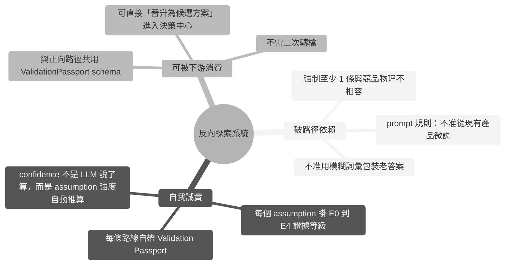


---

### §2 Actors & Use Cases

#### 2.1 Actor 識別


| Actor               | 類型            | 與系統的關係                                          |
| ------------------- | ------------- | ----------------------------------------------- |
| **RD 工程師**          | 主要人類 actor    | 觸發 Anti-Anchor 生成、閱讀路線、晉升候選、刪除不適合的路線            |
| **AI Orchestrator** | 系統內 actor     | 在 E2E 流程中把 Anti-Anchor 排在 TRIZ 前（反向路徑 step 0）   |
| **Analyst Agent**   | 系統內 LLM actor | 執行 `ANTI_ANCHOR_GENERATION` prompt              |
| **LLM Provider**    | 外部系統          | Claude / GPT API，產生 JSON 結構                     |
| **Supabase**        | 外部系統          | 持久化 `anti_anchor_routes` 與其 Validation Passport |
| **下游：候選方案決策中心**     | 系統內 actor     | 消費 Route + ValidationPassport，與正向方案攤平比較         |
| **下游：MUST 快篩**      | 系統內 actor     | 以 M1-M6 篩掉不可行路線                                 |


#### 2.2 Use Case Diagram

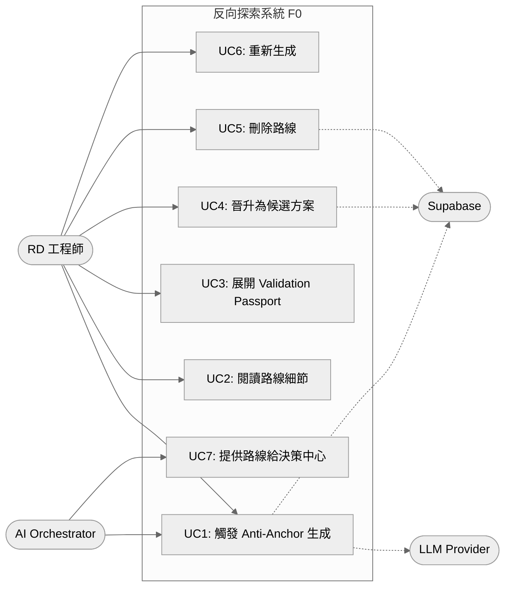


#### 2.3 主要 Use Case 摘要


| ID  | 名稱                     | 主要流程                                                                                    | 成功條件                              |
| --- | ---------------------- | --------------------------------------------------------------------------------------- | --------------------------------- |
| UC1 | 觸發 Anti-Anchor 生成      | RD 點「生成非典型架構」→ Analyst Agent 跑 LLM → Pydantic schema 驗證 → 寫入 DB                         | 回傳 ≥3 條路線，每條帶 Validation Passport |
| UC2 | 閱讀路線細節                 | RD 展開 Collapsible → 看 Physical Principle / Causal Chain / Boundary / Why Unconventional | RD 可指著某一段討論                       |
| UC3 | 展開 Validation Passport | RD 看 Assumptions / Weak Points / Required Verifications / Confidence                    | RD 知道「這條路線還要驗證什麼才能採用」             |
| UC4 | 晉升為候選方案                | 路線直接以 `source=anti_anchor` 寫入 `solution_candidates`                                     | 決策中心出現此條目，與 TRIZ 候選並列             |
| UC5 | 刪除路線                   | RD 認為該路線不值得保留                                                                           | `anti_anchor_routes` 對應 row 刪除    |
| UC6 | 重新生成                   | RD 不滿意現有路線，要求 AI 重試                                                                     | 舊路線刪除，新一批 ≥3 條寫入                  |
| UC7 | 餵決策中心                  | `source=anti_anchor` 的 route 被決策中心讀取，攤平與 TRIZ 候選並列                                      | 單一 hub 表格                         |


---

### §3 Context Diagram（C4 Level 1）

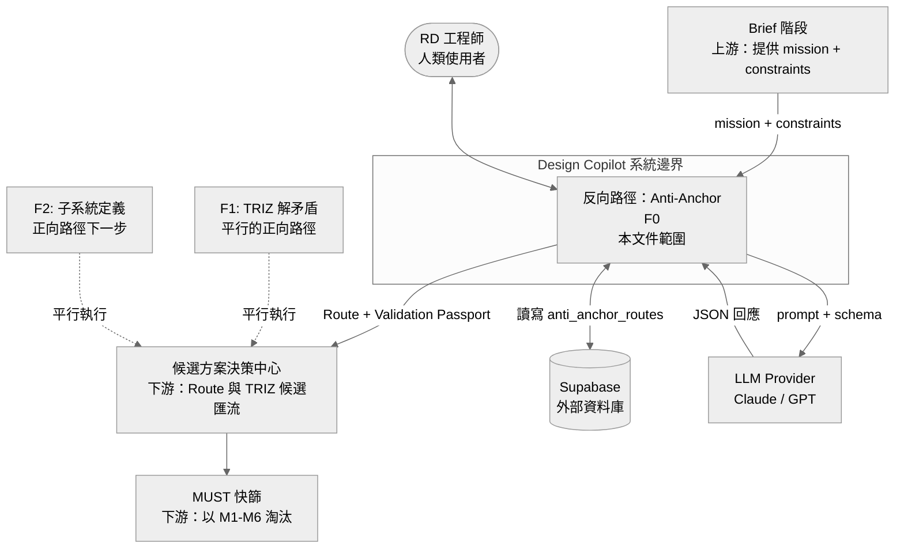


> **關鍵對比**：正向路徑（F1 → F2 → F3）必須從矛盾出發、一步步拆解；反向路徑（F0）**跳過矛盾**，直接從 mission + constraints 走到候選。兩者在 Hub 匯流。

---

### §4 Container Diagram（C4 Level 2）

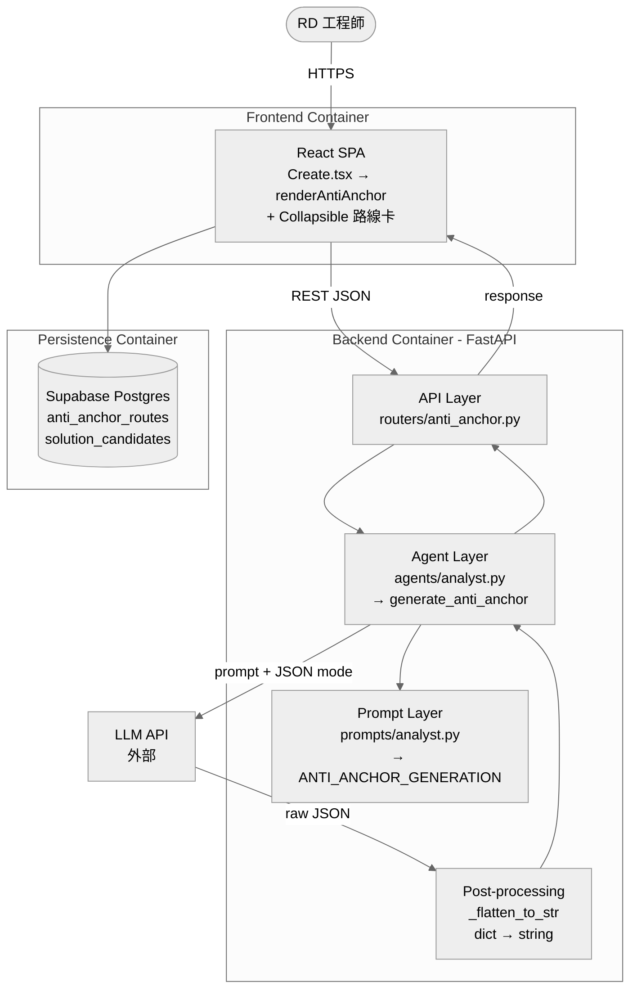


#### 4.1 Container 職責表


| Container       | 技術棧                | 失敗時影響                         | 恢復策略                 |
| --------------- | ------------------ | ----------------------------- | -------------------- |
| Frontend SPA    | React + TypeScript | 使用者無法觸發；後端不受影響                | 無狀態，重載頁面             |
| Backend API     | FastAPI            | F0 停擺；F1/F2 不受影響              | 無狀態，水平擴展             |
| Analyst Agent   | Python             | 無路線產出                         | 無狀態，可重試              |
| Prompt Layer    | 字串模板（純函式）          | 若模板被誤改，JSON 結構會崩              | Pydantic schema 擋    |
| Post-processing | Python 純函式         | 若 LLM 回傳 dict 而非 string，前端顯示亂 | `_flatten_to_str` 兜底 |
| Supabase        | Postgres           | 無法持久化，但 in-memory 結果仍可回前端     | 連線重試                 |
| LLM Provider    | 外部 API             | F0 無法跑                        | 重試 + 降級提示            |


> **與正向路徑共用**：Backend Container、Supabase、LLM Provider 與正向路徑共用。Anti-Anchor 不額外引入 container，僅在 Agent / Prompt 層新增模組。

---

### §5 Component Diagram（C4 Level 3）

聚焦在 Backend Container 內部的職責切分：

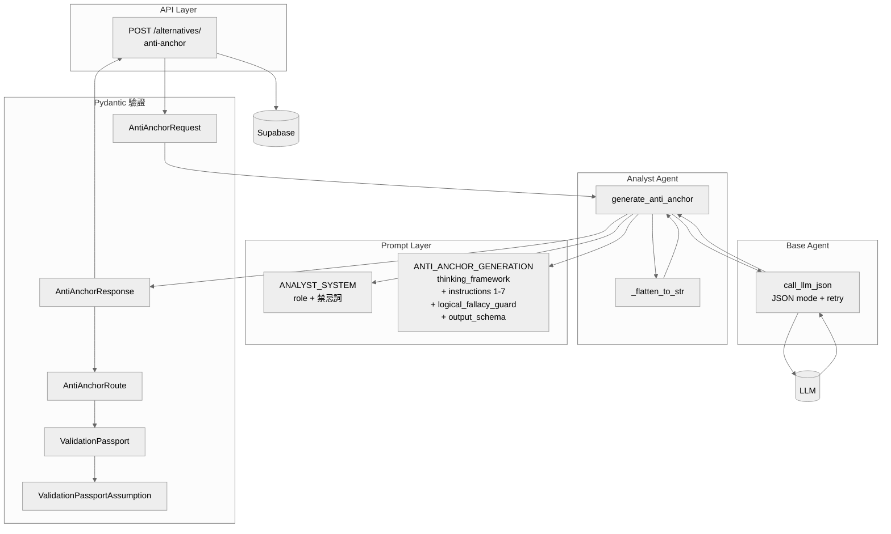


#### 5.1 Component 職責表


| Component                                | 純度             | 是否呼叫 LLM | 是否可獨立測試    |
| ---------------------------------------- | -------------- | -------- | ---------- |
| `generate_anti_anchor`                   | 編排             | ✅        | 需 mock LLM |
| `_flatten_to_str`                        | 純函式            | ❌        | ✅          |
| `ANTI_ANCHOR_GENERATION` 模板              | 字串資料           | ❌        | ✅ 渲染比對     |
| `AntiAnchorRoute` / `ValidationPassport` | Pydantic model | ❌        | ✅ 欄位驗證     |
| `call_llm_json`                          | 共用基底           | ✅        | 需 mock     |


> **設計原則**：除了 `generate_anti_anchor` 編排呼叫 LLM，其他所有 component 都是 pure function。LLM 的「不穩定面」被壓縮到一個函式裡，schema 層是防線，純函式層是兜底。

---

### §6 資料模型（Data Model）

#### 6.1 核心實體關係

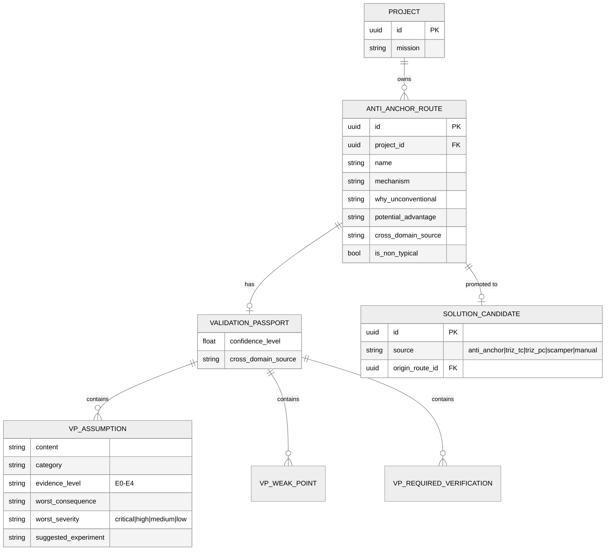


#### 6.2 Route 的六大欄位（對應 prompt instructions 2-5）


| 欄位                    | 對應 prompt 要求  | 給誰看       | 失敗的表現                             |
| --------------------- | ------------- | --------- | --------------------------------- |
| **mechanism**         | Instruction 2 | RD        | 只有一句「用 axial-flux」沒有 causal chain |
| `why_unconventional`  | Instruction 3 | RD        | 只寫「這很新」沒說主流為何做不到                  |
| `potential_advantage` | Instruction 4 | RD        | 出現「大幅、顯著、better」等禁忌詞              |
| `cross_domain_source` | Instruction 5 | RD        | 只寫「參考航太」沒指定產品                     |
| `validation_passport` | Instruction 7 | RD + 決策中心 | 無 assumption 或全 E0                |
| `is_non_typical`      | Instruction 1 | 系統        | 全部 false → 沒達到反對標目標               |


#### 6.3 mechanism 的三層結構（前端解析依據）

mechanism 是一個字串，但 prompt 強制它依序出現三個標記：

```
Physical principle: <name the law or equation>
Causal chain: input → mechanism → output，每步帶數字
Boundary conditions: 有效條件 / 失效條件
```

前端 `Create.tsx:1111-1143` 用 regex 把這三段切出來獨立顯示：

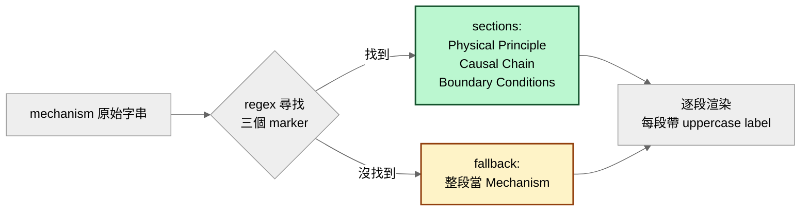


> **設計取捨**：為什麼 mechanism 是單一字串不是三個欄位？
> 答：LLM 常把三段混寫或順序倒置，如果設成三個 required field，model 一漏就整個 JSON 失敗。用單一字串 + 前端 regex 切段，**LLM 產出容錯性最高**，前端仍能分段顯示。

#### 6.4 Validation Passport 的五個子區塊

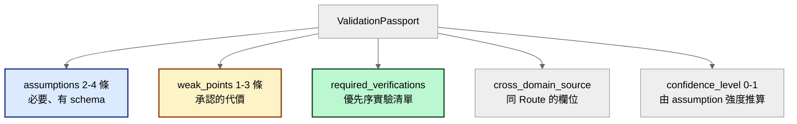


#### 6.5 Assumption 的六個欄位（新手最常卡在這）


| 欄位                     | 值                                                                    | 給誰看      |
| ---------------------- | -------------------------------------------------------------------- | -------- |
| `content`              | **可證偽**的命題，例如「ferrite Halbach 在 120 mm OD 內 B_gap ≥ 0.35 T」          | RD + 實驗員 |
| `category`             | physics / material / cost / manufacturing / regulatory / integration | 分類用      |
| `evidence_level`       | E0-E4（見 §6.6）                                                        | 風險判斷     |
| `worst_consequence`    | 「如果錯 → 立即影響 → 下游 KPI X 崩」的鏈                                          | 風險傳遞     |
| `worst_severity`       | critical / high / medium / low                                       | 排序用      |
| `suggested_experiment` | 方法 + 時間 + 成功判據 + 成本等級                                                | 直接可執行    |


#### 6.6 Evidence Level（證據等級）定義 — 這是新手最常看錯的一欄


| 等級     | 定義                       | 白話翻譯        | 範例                              |
| ------ | ------------------------ | ----------- | ------------------------------- |
| **E0** | speculation              | 純臆測         | 「我覺得應該可以」                       |
| **E1** | physics reasoning        | 第一原理 / 公式推導 | 用 Ohm + core loss 模型估出 η ≥ 93 % |
| **E2** | measured analogy         | 別的領域有量測資料   | Tesla hairpin 量產 8 年 → 套用到自行車   |
| **E3** | test data in similar app | 同類應用已有測試    | 某 e-bike 原型曾測過                  |
| **E4** | production-proven        | 本應用已量產      | 某現有產品已在用                        |


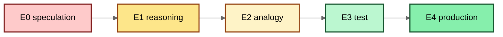


#### 6.7 Confidence 的計算規則（prompt 強制）

`backend/app/prompts/analyst.py:739-740`：

```
confidence_level:
  ≥ 0.7  if most assumptions at E2+
  0.4-0.7 if mix of E1/E2
  < 0.4  if mostly E0/E1
```

所以 **confidence 不是 LLM 自由寫的**，而是 assumption 分布的函數。使用者看到 63 % 就代表：「這條路線大約 1×E2 + 2×E1，LLM 自己也覺得 assumption 證據不太夠」。

#### 6.8 JSON 範例：完整 Route

```jsonc
{
  "name": "Axial-Flux Ferrite Halbach Mid-Drive",
  "mechanism": "Physical principle: Axial-flux topology with ferrite Halbach array ... Causal chain: 48V 20A → 960W @ 92% η → 5:1 → 80Nm ... Boundary conditions: Valid for T_winding < 130°C; degrades 2%/20°C above 25°C.",
  "why_unconventional": "Dominant approach uses radial-flux NdFeB. Ferrite bypasses supply-chain and Curie-point risk. Industry hasn't adopted because ferrite B_r historically too low — Halbach recovers 60-70%.",
  "potential_advantage": "BOM cost reduction 40-50% ($8-12 vs $20-30). Mass penalty ≈15%. Supply chain: 12+ countries vs 2.",
  "cross_domain_source": "Magnax AXF225 (Belgium) — axial-flux yokeless, 96% peak η, production since 2021.",
  "validation_passport": {
    "assumptions": [
      {
        "content": "Ferrite Halbach achieves ≥0.35T average air-gap flux in 120mm OD",
        "category": "physics",
        "evidence_level": "E1",
        "worst_consequence": "If B_gap < 0.3T → torque -15% → motor +15% rpm → noise ↑ → fails NVH",
        "worst_severity": "high",
        "suggested_experiment": "2D FEA (FEMM); 3 days; success: B_gap ≥ 0.35T; cost: low (<$500)"
      }
    ],
    "weak_points": ["+15% mass vs NdFeB", "Halbach magnetisation tooling $5-10k NRE"],
    "required_verifications": ["FEA (3d, low)", "Winding trial (5d, mid)", "Thermal steady-state (7d, mid)"],
    "cross_domain_source": "Magnax AXF225",
    "confidence_level": 0.55
  }
}
```

---

### §7 Sequence Diagrams

#### 7.1 主流程：UC1 觸發 Anti-Anchor 生成

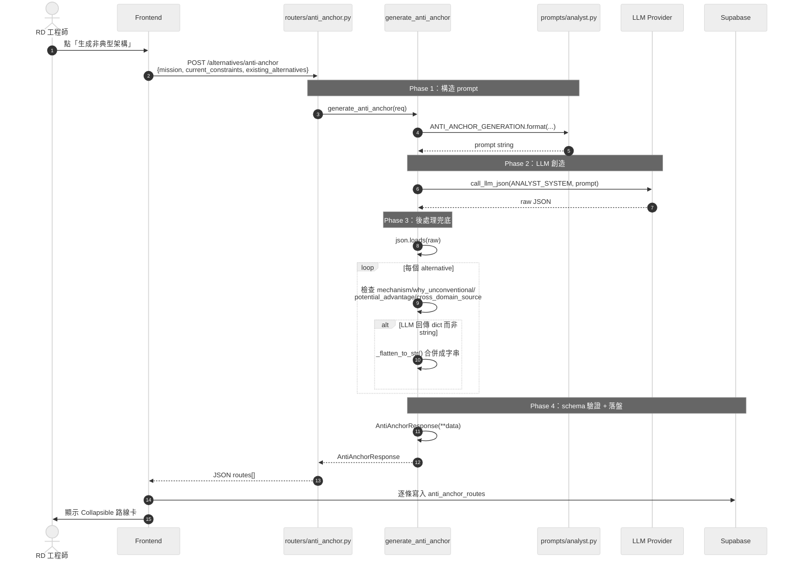


#### 7.2 UC3：展開 Validation Passport

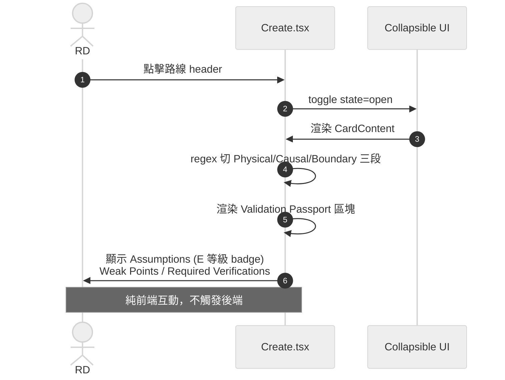


#### 7.3 UC4：晉升為候選方案

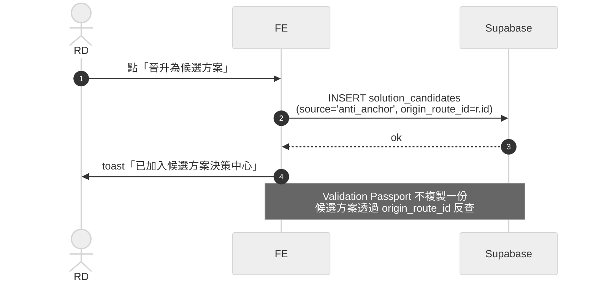


#### 7.4 UC6：重新生成

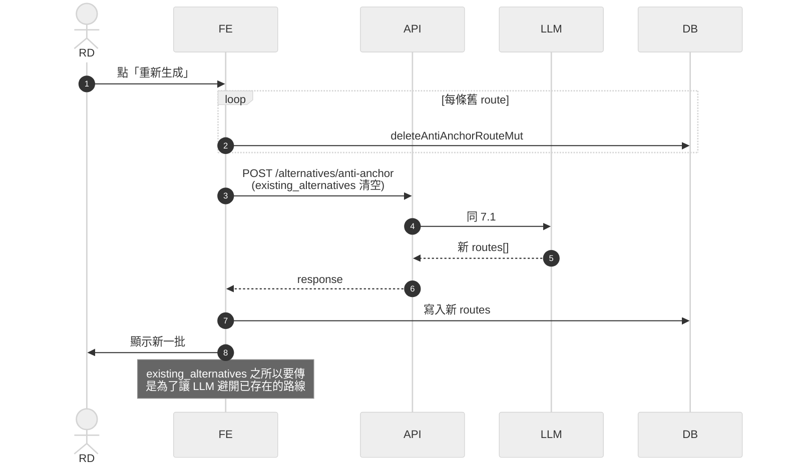


---

### §8 State Machine

#### 8.1 Anti-Anchor Route 狀態流轉

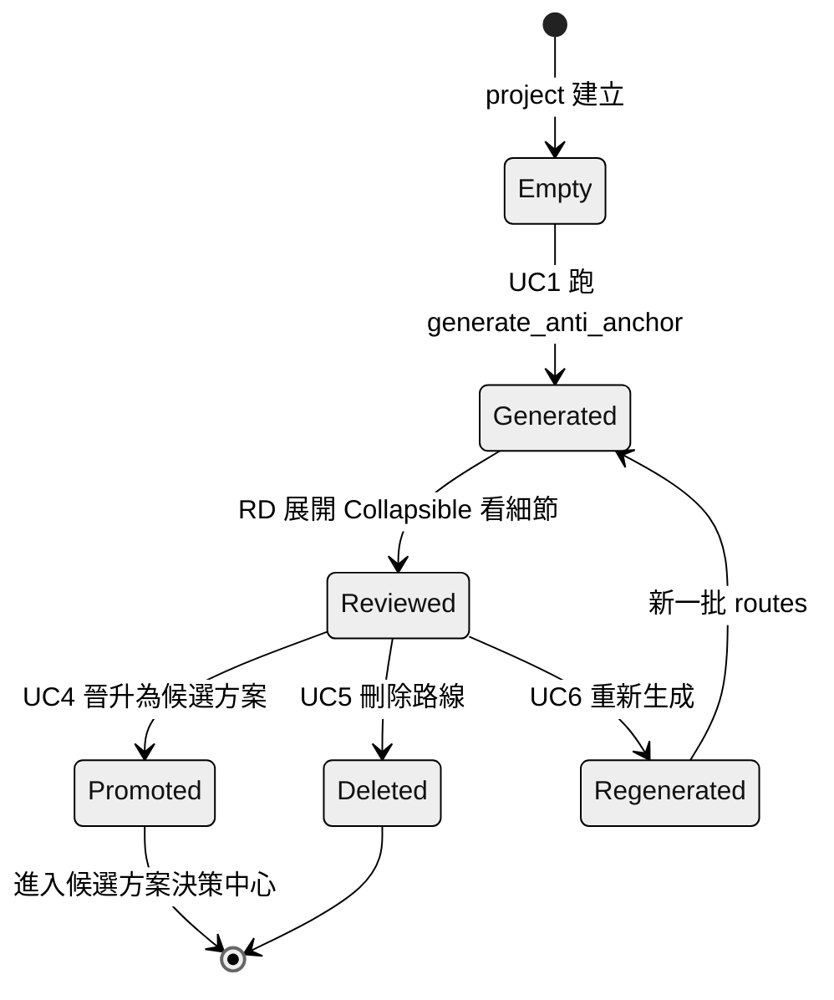


#### 8.2 Assumption 的證據等級流轉（目前是靜態）

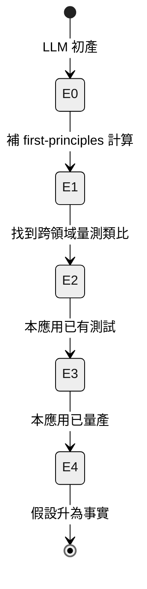


> **當前限制**：流轉全靠 LLM 一次產出，沒有機制讓 RD 回填實驗結果來推升等級。這是 §12 迭代方向的首要候選。

#### 8.3 Route → SolutionCandidate 繼承關係

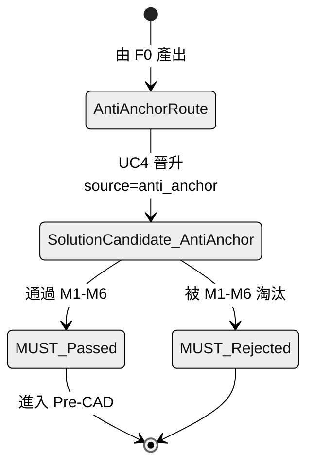


---

### §9 資料準確性與幻覺防線

#### 9.1 六道防線（Defence-in-Depth）

```mermaid
%%{init: {'theme': 'neutral'}}%%
flowchart LR
    LLM[LLM 產出] --> D1[D1 thinking_framework<br/>強制 first-principles]
    D1 --> D2[D2 instructions 2-5<br/>強制結構化欄位]
    D2 --> D3[D3 logical_fallacy_guard<br/>禁忌詞與謬誤檢查]
    D3 --> D4[D4 output_schema<br/>JSON mode + Pydantic]
    D4 --> D5[D5 _flatten_to_str<br/>dict → string 兜底]
    D5 --> D6[D6 confidence 由 evidence 推算<br/>LLM 不能自由說高]
    D6 --> OUT[可信輸出]

    style D1 fill:#e0f2fe,stroke:#0c4a6e,stroke-width:2px,color:#000
    style D2 fill:#bae6fd,stroke:#0c4a6e,stroke-width:2px,color:#000
    style D3 fill:#7dd3fc,stroke:#0c4a6e,stroke-width:2px,color:#000
    style D4 fill:#38bdf8,stroke:#0c4a6e,stroke-width:2px,color:#000
    style D5 fill:#0ea5e9,stroke:#0c4a6e,stroke-width:2px,color:#fff
    style D6 fill:#0369a1,stroke:#0c4a6e,stroke-width:2px,color:#fff
```


| 防線  | 處理什麼                                                                                            |
| --- | ----------------------------------------------------------------------------------------------- |
| D1  | 強制從物理層推理，而非從產品層微調                                                                               |
| D2  | 每個欄位必須結構化，不能用自然語言兜混                                                                             |
| D3  | Appeal to novelty / False analogy / Vague quantifier / Survivorship bias / Anchoring — 五種謬誤明文禁止 |
| D4  | Pydantic 驗證欄位齊全與型別                                                                              |
| D5  | LLM 有時把 mechanism 寫成 dict，`_flatten_to_str` 合併成字串                                               |
| D6  | confidence 由 assumption 分布決定，防止 LLM 自吹                                                          |


#### 9.2 logical_fallacy_guard 的五個檢查項

`backend/app/prompts/analyst.py:743-755`：

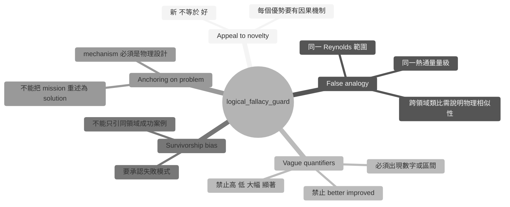


#### 9.3 幻覺容忍策略


| 幻覺型態                  | 出現機率 | 防線                           | 後果                              |
| --------------------- | ---- | ---------------------------- | ------------------------------- |
| 杜撰產品名稱                | 中    | D3（要求 specific product）      | 即使杜撰也會有後續 verification 抓出       |
| 數字亂湊                  | 中高   | D3 禁忌詞 + 要求 causal chain     | 使用者可比對 causal chain 合理性         |
| 把 causal chain 寫成模糊句  | 高    | D2 + 前端 regex 切段             | 切不出段就顯示 fallback，視覺提醒           |
| 對自己的 assumption 過度樂觀  | 高    | D6（confidence 由 evidence 推算） | LLM 標 E1 但自稱 95% → 會被 §6.7 規則打臉 |
| 把 PC dict 回傳而非 string | 低    | D5 `_flatten_to_str`         | 前端可正常顯示                         |


---

### §10 對下游決策中心的契約

#### 10.1 F0 → Hub hand-off 三件套

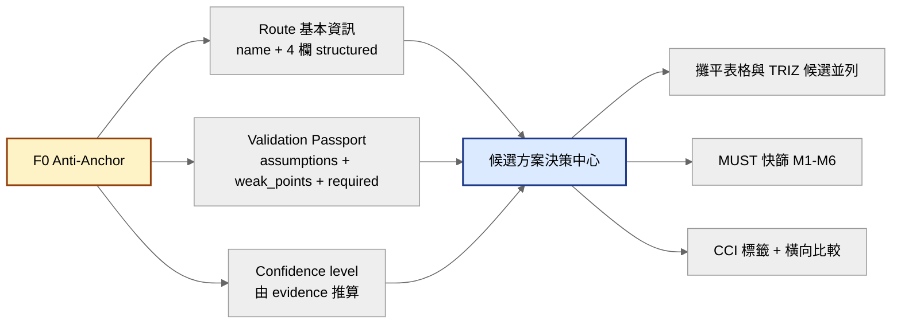


#### 10.2 與 TRIZ 候選 schema 對齊

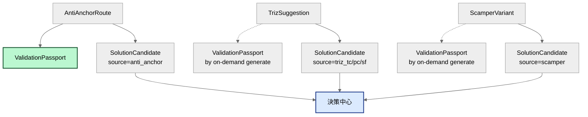


> **關鍵**：Anti-Anchor 是**唯一**一條路徑，其路線**天生自帶** Validation Passport。TRIZ / SCAMPER 的候選需要事後呼叫 `validation_passport_generate` 才會產出 Passport。這是 Anti-Anchor 在決策中心的相對優勢（資料更齊）。

#### 10.3 為什麼反向路徑天生有 Passport，正向路徑沒有？


| 路徑          | 產出時機               | 是否天生帶 Passport | 原因                                |
| ----------- | ------------------ | -------------- | --------------------------------- |
| Anti-Anchor | 一次 LLM call 產 3+ 條 | ✅              | prompt 把 passport 包進 schema       |
| TRIZ TC     | 逐矛盾生成              | ❌              | Prompt 只要求 principle + suggestion |
| TRIZ PC     | 逐矛盾生成              | ❌              | 分離原則結構複雜，Passport 另外要             |
| TRIZ SF     | 逐矛盾生成              | ❌              | 76 標準解結構複雜，Passport 另外要           |
| SCAMPER     | 逐子系統逐動作生成          | ❌              | 組合爆炸，Passport 另外要                 |


---

### §11 部署視角（Deployment）

```mermaid
%%{init: {'theme': 'neutral'}}%%
graph TB
    subgraph Browser[使用者瀏覽器]
        SPA[React SPA<br/>Static 部署]
    end

    subgraph Cloud[Backend 部署環境]
        FA[FastAPI 容器<br/>水平可擴展<br/>含 anti_anchor 與正向路徑]
    end

    subgraph SaaS[外部 SaaS]
        SBSaaS[Supabase<br/>託管 Postgres]
        LLMSaaS[Claude / GPT API]
    end

    Browser -->|HTTPS| Cloud
    Cloud -->|HTTPS| SBSaaS
    Cloud -->|HTTPS| LLMSaaS
```


#### 11.1 部署單元


| 部署單元          | 狀態          | 擴展策略      | 與正向路徑共用            |
| ------------- | ----------- | --------- | ------------------ |
| React SPA     | 無狀態         | CDN       | ✅                  |
| FastAPI       | 無狀態         | 水平擴展      | ✅                  |
| Analyst Agent | 內嵌於 Backend | 隨 Backend | ✅ 共用 call_llm_json |
| Supabase      | 託管          | 由 SaaS 處理 | ✅                  |
| LLM Provider  | 外部          | 由 SaaS 處理 | ✅                  |


> **Anti-Anchor 不額外引入部署單元**。所有增量都壓在 `agents/analyst.py` 與 `prompts/analyst.py` 的既有模組裡。

---

### §12 風險、限制、迭代方向

#### 12.1 已知風險

```mermaid
%%{init: {'theme': 'neutral'}}%%
mindmap
  root((已知風險))
    技術
      mechanism regex 切段脆弱
      dict 回傳兜底仍可能亂序
      confidence 與 evidence 分布不完全一致
    資料
      LLM 編造產品名稱
      cross_domain_source 未被檢索驗證
      E1 與 E2 的界線主觀
    流程
      RD 看不懂 Physical Principle
      assumption content 太長不易掃讀
      Passport 開合造成資訊密度過高
    營運
      LLM JSON mode 變更
      Prompt token 超標
      logical_fallacy_guard 被繞過
```


#### 12.2 後續迭代方向


| 方向                                       | 動機                              | 優先級   |
| ---------------------------------------- | ------------------------------- | ----- |
| Assumption 推升機制                          | 讓 RD 回填實驗結果把 E1 → E2 → E3       | **高** |
| cross_domain_source 連回 reference_library | 防止 LLM 編造產品名稱                   | **高** |
| 新手 hint UI                               | 本文件 §6 的解說透過 UI tooltip 曝露      | **高** |
| Regex 切段替換為結構化 mechanism                 | LLM 穩定度提升後升為 required 欄位        | 中     |
| Confidence 顯示公式                          | 讓使用者看到「E2×1 + E1×2 → 0.63」的計算過程 | 中     |
| Anti-Anchor 與 TRIZ 衝突探測                  | 反向路線若與正向 TC 路徑高度重疊，自動標註         | 低     |
| Passport 推升機制（跨專案）                       | learned_assumption 表            | 低     |


#### 12.3 資料迴圈閉合方向

```mermaid
%%{init: {'theme': 'neutral'}}%%
flowchart LR
    A[F0 Anti-Anchor 產路線] --> B[RD 晉升候選]
    B --> C[MUST 快篩]
    C --> D[Pre-CAD]
    D --> E[實測結果]
    E -.->|未來：回填實驗| F[Assumption 升等級]
    F -.->|進 learned_assumptions| A

    style E fill:#fde68a,stroke:#92400e,stroke-width:2px,color:#000
    style F fill:#bbf7d0,stroke:#14532d,stroke-width:2px,color:#000
```


---

### §13 摘要表：本架構解決什麼


| 問題               | 解法                                     | 章節       |
| ---------------- | -------------------------------------- | -------- |
| RD 路徑依賴          | thinking_framework 強制 first-principles | §9.1     |
| LLM 路徑依賴         | logical_fallacy_guard + 禁忌詞            | §9.2     |
| 模糊優勢包裝           | 禁忌詞 + 強制數字或區間                          | §9.1-D3  |
| LLM 自己吹信心        | confidence 由 evidence 分布推算             | §6.7     |
| Route 結構化困難      | mechanism 單一字串 + 前端 regex 切段           | §6.3     |
| 不同路徑的候選結構不一致     | 共用 ValidationPassport schema           | §10.2    |
| 新手看不懂 E0-E4      | 本文件 §6.6 + 未來 UI hint                  | §6.6 §12 |
| LLM 偶爾把字串寫成 dict | `_flatten_to_str` 後處理兜底                | §9.1-D5  |


---

### §14 對齊既有 E2E 文件


| 文件                                                               | 對齊點                                              |
| ---------------------------------------------------------------- | ------------------------------------------------ |
| [Appendix A](appendix-a--forward-subsystem-discovery.md)                   | 本文件為「反向路徑」的姊妹文件；兩者在決策中心匯流（本文件 §10）               |
| `E3--ai-agent-detailed-design.md` v1.4                           | Analyst Agent 的「Anti-Anchor Generation」職責即本文件 §5 |
| `_domain-knowledge/DK-01--design-philosophy-and-process.md` v1.6 | 本文件補充 F0 為 TRIZ (F1) 之前的反向路徑                     |
| [Appendix D](appendix-d--state-machine.md) v1.6              | Route Artifact 狀態機見本文件 §8.1                      |
| [Appendix E](appendix-e--triz-scamper-flow.md) v10               | 本文件是平行反向流程的 SA 視角文字化                             |
| `TRIZ_Multi_Solution_Adoption_Strategy.md`                       | ValidationPassport 共用 schema 見本文件 §10.2          |


---

**主要實作檔案索引**：

- `backend/app/routers/anti_anchor.py` — POST `/alternatives/anti-anchor`
- `backend/app/agents/analyst.py` — `generate_anti_anchor` + `_flatten_to_str`
- `backend/app/prompts/analyst.py` — `ANTI_ANCHOR_GENERATION` (~150 行 prompt)
- `backend/app/models/schemas.py` — `AntiAnchorRequest` / `AntiAnchorRoute` / `AntiAnchorResponse` / `ValidationPassport` / `ValidationPassportAssumption`
- `backend/app/agents/base.py` — `call_llm_json` (共用 LLM 呼叫基底)
- `src/pages/Create.tsx` — `renderAntiAnchor`（含 regex 切段邏輯）
- `src/hooks/api/useCreate.ts` — `useAntiAnchorRoutes` / `useCreateAntiAnchorRoute` / `useUpdateAntiAnchorRoute` / `useDeleteAntiAnchorRoute`
- `src/lib/api.ts` — `antiAnchorGenerate` client wrapper

---
