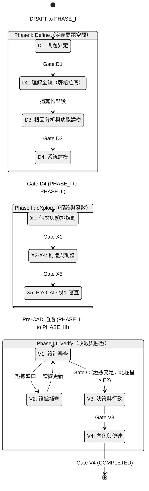
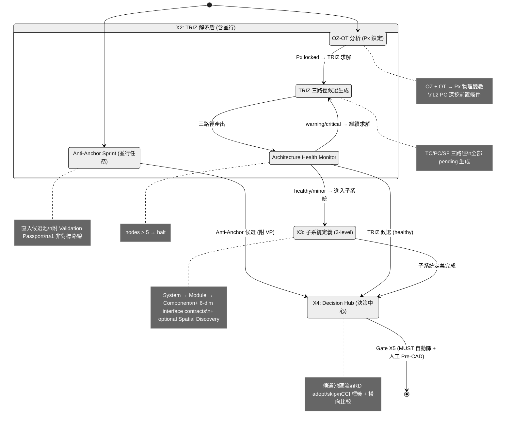
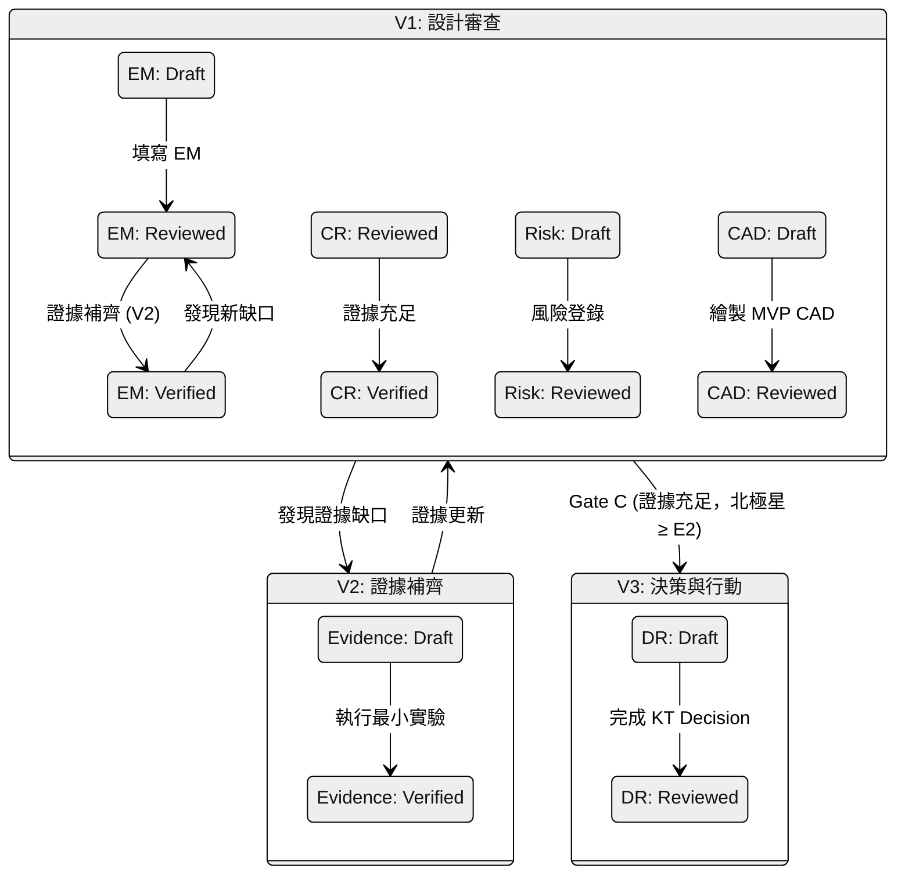

## Appendix D: State Machine

> 錨點：`#appendix-d-state-machine`

## RD Design Copilot 整合流程狀態機與 R&R (E2E)

本附錄以程式設計角度繪製 `RD Design Copilot 整合流程 (E2E)` 的狀態機圖，並說明每個階段的 Roles & Responsibilities (R&R)。
核心概念為 **雙層狀態機 (Dual-Layer State Machine)**，同時管理 **流程狀態 (Process State)** 與 **工件狀態 (Artifact State)**。

### Step 編號對照


| 編號 | 名稱 | Phase | 核心工件類型 |
|------|------|-------|-----------|
| D1 | 問題界定（白帽 + 5W1H + 素材上傳解讀） | I (Define) | Constraint |
| D2 | 理解全貌（蘇格拉底問答） | I (Define) | Contradiction, Assumption |
| **D3** | **根因分析與功能建模**（5Why + KT + FA + SF） | **I (Define)** | 根因假設, Px 候選, FunctionModel |
| D4 | 系統建模（因果迴路+TRIZ矛盾+斷路點） | I (Define) | Contradiction, Breakpoint |
| X1 | 假設與驗證規劃（HDA+未知集合） | II (eXplore) | Assumption |
| **X2** | **TRIZ 解矛盾**（含 OZ-OT 前置 + 矩陣查表 + 原理具體化 + Architecture Health Monitor + SIM；**Anti-Anchor Sprint 並行**） | **II (eXplore)** | Concept Route (部分), SimMatrix, OzOtResult |
| **X3** | **子系統定義**（三層階層 System→Module→Component；含 optional Spatial Discovery） | **II (eXplore)** | Concept Route (部分), SpatialEstimate |
| **X4** | **AI 方案生成 + Decision Hub**（整合 + CCI 複雜度指標） | **II (eXplore)** | Concept Route, Interface, ComplexityCheckResult |
| **X5** | **Pre-CAD 資格審查**（MUST Go/No-Go 自動篩 + 人工 Pre-CAD Gate） | **II (eXplore)** | Concept Route, Pre-CAD Review Report |
| **V1** | **設計審查** (CAD Gate - MVP CAD Review) | **III (Verify)** | Concept Route, Evidence Matrix, Risk |
| V2 | 證據補齊 (Evidence Closure) | III (Verify) | Evidence |
| V3 | 決策與行動（KT Decision Analysis+最小實驗） | III (Verify) | Concept Route, Decision Record, Evidence |
| V4 | 內化與傳達（費曼） | III (Verify) | Asset |

> **v10 簡化**：原 Step 2c 併入 D3（原 2b）；原 Step 5-0 降為 X2（原 5a）並行任務；原 Step 5a-0 併入 X2 子步驟；原 Step 5b.5 降為 X3（原 5b）optional；原 Step 5e 併入 X5（原 Step P）。~~Step 5c SCAMPER 已於 v9 移除~~。


### 核心流程狀態機 (Process State Machine)




> **Note**: X2 採雙軌架構：反向創意（Anti-Anchor，並行任務）直入候選池，正向演繹（OZ-OT → TRIZ → 子系統）生成候選。所有路徑匯流至 X4 決策中心 (Decision Hub)，由 RD 做 adopt/skip + CCI 標籤 + 橫向比較。最終通過 Gate X5（含 MUST 自動篩 + 人工 Pre-CAD 審查）進入 Phase III。（~~Phase B 已於 v9 退役~~，由 SIM + CCI 前置覆蓋。~~SCAMPER 已於 v9 移除~~。）

##### X2-X4 內部子流程




> **矛盾收斂圖 + 架構健康度監控**：
>
> - **Architecture Health Monitor（X2 SIM 出口，`SX2_health`）**：nodes > 5 → critical → halt。L1 critic badge 取代舊版全域收斂掃描。`is_confirmatory` 語意去重仍存在於 schema。
> - **~~Phase B~~（v9 退役）**：原方案交叉檢查已退役。其 5 項檢查全部由 SIM 矩陣（ADR-008 D5，TC 層跨矛盾衝突前置）和 CCI（ADR-008 D4，解法品質判定）覆蓋。PC 衝突 ⊂ TC 衝突（ADR-007），SIM -1 即捕捉。
> - **~~循環矛盾~~（v2.1 退役）**：循環矛盾由 SIM §5.3 診斷（合併為 PC 或分離）+ Section 7 喊停（Px 不可行時）前置攔截，不再於 X4 重複檢查。
>
> 新矛盾分級為 Fatal/Major/Minor：
>
> - **Fatal + Major**：必須回到 X2 繼續求解，直到完全收斂。**不設硬性次數上限**。
> - **Minor**：記入 Risk Register，不阻擋流程。
> - **架構健康度監控**（X2 SIM 出口執行；非告警，是強制停止；v1.3 改為漸進回退）：
>   - 節點 > 5（扣除 SIM 已收斂 TC 對）→ 🛑 **漸進回退**：① 回 D3 重建功能模型/根因分析 → ② 仍無法收斂則回 D1 重新問題界定。「矛盾級聯超過 5 個節點。這不是 TRIZ 問題，是架構問題。」
> - **Pre-CAD Confidence Score**：`已收斂 (Fatal+Major) / 總 (Fatal+Major) × 100%`，Gate X5 門檻 = 100%。
>
> **核心洞察**：矛盾數量是架構健康度的診斷信號。健康架構有 1-3 個矛盾；>5 個矛盾意味著在給錯誤架構打補丁。最好的設計流程不是「解矛盾最厲害」，而是「選到矛盾最少的架構」。

### Gate 與 Phase 轉換對照

> **權威定義見** [E3--ai-agent-detailed-design.md §2.2a](../E3--ai-agent-detailed-design.md#22a-gate-自動化判定)（含自動化等級與 Fallback）。
> 以下僅保留狀態機視覺化。

### 雙層狀態機概念圖 (Process State + Artifact State)




> **權威定義見** [E3--ai-agent-detailed-design.md §11.4.2](../E3--ai-agent-detailed-design.md#1142-並行處理規則)。

### 階段與狀態說明 (R&R)

> **D1-V4 的完整 R&R 定義已移至** [E3--ai-agent-detailed-design.md §11.2](../E3--ai-agent-detailed-design.md#112-逐步自動化分級)（自動化等級 + Agent 分配）及 [DK-01](../_domain-knowledge/DK-01--design-philosophy-and-process.md)（流程層 Gate 條件）。
>
> 本附錄僅保留上方的狀態機視覺化圖。

### ADR-008 新增 Artifact 生命週期（2026-04-27）

以下 5 個 artifact 由 ADR-008 Auto-TRIZ v2 引入。

> **編號對照**：「TRIZ Step」為 Auto-TRIZ Skill 內部步驟（`/triz-model` = Step 1、`/triz-solve` = Step 2+3、`/triz-verify` = Step 4）；「E2E Step」為本文件 Appendix D 定義的整合流程步驟。兩套編號互不相同，請依上下文區分。

| Artifact | TRIZ Skill Step | E2E Step | 建立者 | 生命週期 | 持久化 |
|----------|----------------|----------|--------|---------|--------|
| **FunctionModel** | TRIZ Step 1 (FA) | E2E D3 根因分析與功能建模 | Analyst Agent `function_analysis()` | Draft → Reviewed（Gate D3 出口） | `function_models` 表 |
| **OzOtResult** | TRIZ Step 2 (OZ-OT) | E2E X2 OZ-OT 子步驟 | Analyst Agent `oz_ot_analysis()` | Draft → Reviewed（L2 入口前鎖定） | `contradictions` 表 `oz_zone/ot_time/px_variable` 欄 |
| **SimMatrixResult** | TRIZ Step 2+3 (SIM) | E2E X2 TRIZ 解矛盾 | TRIZ Solver `sim_matrix()`，≥2 TC 觸發 | Draft → Final（≤2 輪收斂後凍結） | `sim_matrices` 表 |
| **ComplexityCheckResult** | TRIZ Step 4 (CCI) | E2E X4 Decision Hub | TRIZ Solver `complexity_check()` | — （一次性計算，不可變） | 方案 `complexity_check_result` 欄 |
| **EvidenceClaim** | — （跨步驟） | — （跨步驟） | 所有 Agent LLM 輸出時自動註冊 | Registered → VERIFIED / APPROXIMATE / UNVERIFIED | `evidence_claims` 表 |

**EvidenceClaim 驗證流程**：
```
Agent LLM 輸出含數值聲明
  → EvidenceRegistryService.register_claim()
  → Tavily WebSearch 交叉驗證
  → 標記 VERIFIED / APPROXIMATE / UNVERIFIED
  → Gate X5 退出: Evidence Coverage ≥ 40%
```

---
