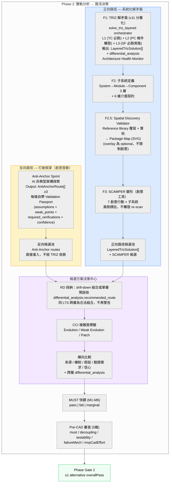
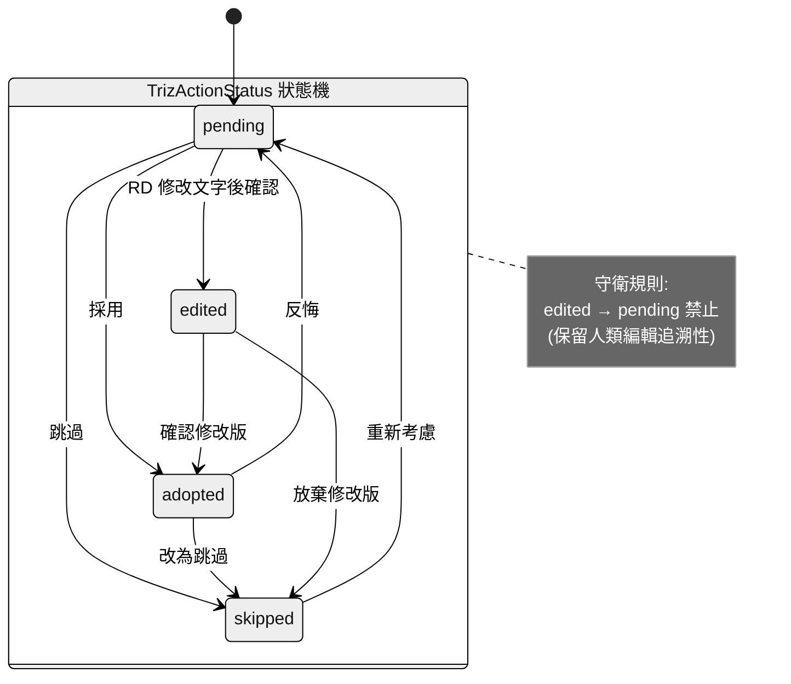
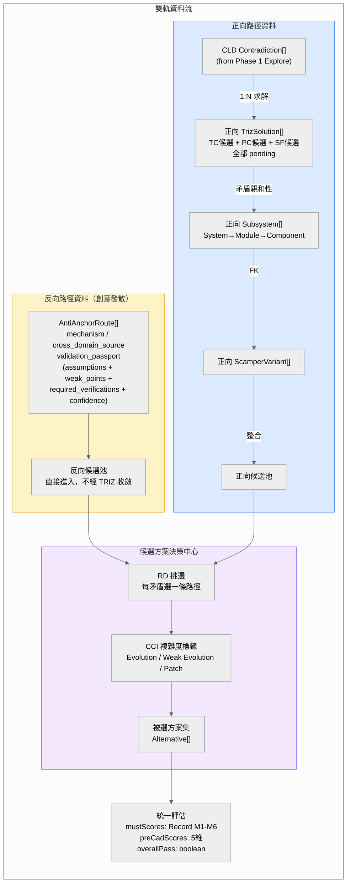
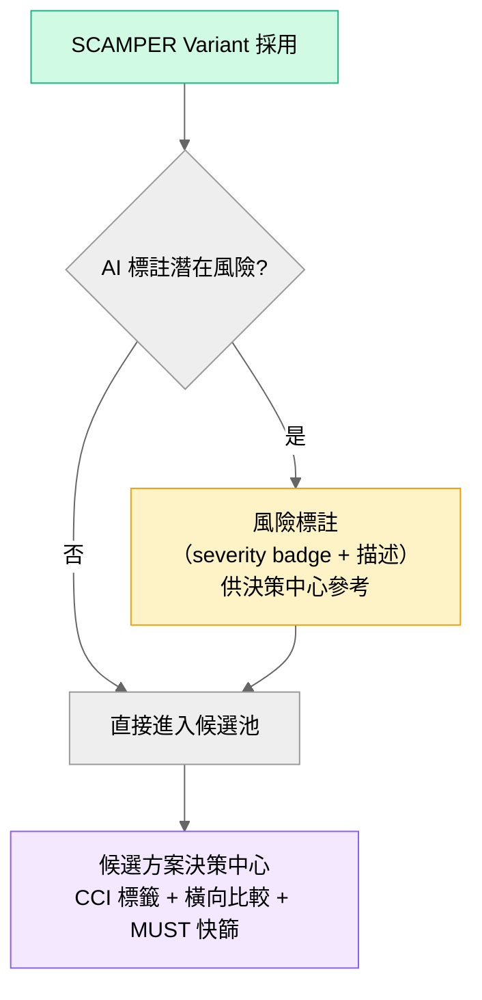

## Appendix E: TRIZ → SCAMPER Flow

> 錨點：`#appendix-e-triz-to-scamper-flow`
> **相關文件**：`../../02-design/specs/triz/E5x--triz-layered-drilldown-optimization.md`

## 雙軌分析 → 候選方案決策中心：設計概念與流程圖

---

### 0. 第一性原理：TC/PC/SF 是分層 drill-down，不是互斥三路徑

#### TRIZ 三層的本質


| 層           | 角色          | 問題表述             | 解法方向              |
| ----------- | ----------- | ---------------- | ----------------- |
| **L1 — TC** | **現象層**     | 改善 A 會惡化 B       | 40 原理打破 trade-off |
| **L2 — PC** | **本質層**     | 同一物理參數同時要 X 和 ¬X | 時間/空間/條件/整體-局部分離  |
| **L3 — SF** | **結構層**（旁路） | 物場交互不完整或有害       | 修改物質-場模型          |


**這三者不是「三個獨立醫生對同一病人開不同處方」，而是「同一份分層診斷報告的三層 — 表象 / 根因 / 結構」。** TC 是現象層、PC 是本質層（對 TC 的深挖）、SF 是結構層（平行的功能鏈旁證）。完整論述見 `../../02-design/specs/triz/E5x--triz-layered-drilldown-optimization.md`。

#### 當前設計：分層 drill-down orchestrator

```
矛盾 C1 → solve_triz_layered orchestrator
       → L1 必跑 + L3 必跑（平行）
       → L2 critic 觸發判斷 → 必要時 deepen_link 推導 PC
       → 聚合為 LayeredTrizSolution（含 differential_analysis）
→ 決策中心：RD 採納整個 drill-down 組合 或 單層
→ SIM 矩陣（≥2 TC 時）：+1/0/-1 交互評分，-1 衝突回流為新 TC
→ CCI 複雜度檢查：四問判定 → [0,1] 連續指標
```

**設計原則**：TC/PC/SF 是同一矛盾的分層診斷（表象/根因/結構），不是互斥候選。跨矛盾衝突由 SIM 矩陣（ADR-008 D5）在 TRIZ 求解階段前置處理；同 LTS 內跨層為合法組合。

> **v9 變更**：Phase B 收斂掃描已退役。其 5 項檢查（跨矛盾衝突、參數影響、PC 狀態衝突、跨方案干涉、同矛盾多路徑）全部由 SIM 矩陣（TC 層跨矛盾衝突，ADR-008 D5）和 CCI（解法品質判定，ADR-008 D4）前置覆蓋。PC 衝突 ⊂ TC 衝突（ADR-007：PC 由 TC 派生），SIM -1 即捕捉。

---

### 1. 主流程總覽

**設計哲學**：Phase 2 是 **雙軌產出 → 人類選擇 → SIM/CCI 品質評估 → MUST 快篩 → 統一評估**。




#### 設計決策說明


| 決策                        | 說明                                                                                |
| ------------------------- | --------------------------------------------------------------------------------- |
| **方法獨立**                  | 反向（創意）和正向（演繹）是兩種本質不同的方法，不應讓創意工具再跑演繹收斂                                             |
| **正向路徑分層** (v11)          | F1 內部 TC/PC/SF 是同一矛盾的三層 drill-down，不是互斥三選一。由 `solve_triz_layered` orchestrator 調度 |
| **反向路徑簡化**                | Anti-Anchor 自帶 Validation Passport，直接進候選池。不需要 R2-R4（TRIZ/子系統/SCAMPER）             |
| **產出與選擇分離**               | 正向路徑：TRIZ 步驟產出 `LayeredTrizSolution`（含 Architecture Health Monitor），採納在決策中心       |
| **SIM 前置衝突檢查** (v9)       | 跨矛盾衝突在 TRIZ 求解階段由 SIM 矩陣 -1 評分前置捕捉（ADR-008 D5），不再需要後置交叉檢查                       |
| **CCI 品質判定** (v9)          | 每條解法附 CCI [0,1] 指標（ADR-008 D4），Decision Hub 顯示 Evolution/Weak Evolution/Patch       |
| **同 LTS 跨層 = 合法組合** (v11) | 同一 LayeredTrizSolution 內的多層解為合法 drill-down 組合                                       |
| ~~Phase B~~ (v9 退役)         | SIM 覆蓋 TC 層跨矛盾衝突，PC 衝突 ⊂ TC 衝突（ADR-007），CCI 覆蓋品質判定。Phase B 零殘餘價值             |
| ~~同矛盾多路徑警告~~ (v10 規則)     | **v11 已下線**。drill-down 是合法路徑而非缺陷                                                  |


---

### 2. TRIZ 狀態機（含轉換守衛）

**設計意圖**：每條 TRIZ 解法有獨立的生命週期。`edited` 狀態保留「人類修正 AI 建議」的追溯性，因此禁止從 `edited` 退回 `pending`。




#### 合法轉換矩陣


| from ＼ to   | pending | adopted | skipped | edited |
| ----------- | ------- | ------- | ------- | ------ |
| **pending** | -       | V       | V       | V      |
| **adopted** | V       | -       | V       | -      |
| **skipped** | V       | -       | -       | -      |
| **edited**  | **X**   | V       | V       | -      |


---

### 3. ~~收斂迴圈：Phase B~~ (v9 退役)

> **v8 變更**：Phase A 收斂掃描已退役。矛盾空間健康度改由 Architecture Health Monitor（phase-agnostic，nodes > 5 → critical → halt）監控。L1 critic badge 取代 Phase A 的全域收斂功能。`is_confirmatory` 語意去重仍存在於 schema 層級。
>
> **v9 變更**：Phase B 收斂掃描已退役。其 5 項檢查全部由上游機制前置覆蓋：
>
> | 原 Phase B 檢查項 | 替代機制 | 說明 |
> |:-----------------|:---------|:-----|
> | 1. 跨矛盾解法衝突 | **SIM 矩陣** (ADR-008 D5) | SIM -1 評分在 Step 5a TRIZ 求解階段前置捕捉 |
> | 2. 參數影響分析 | **SIM 矩陣** | TC 層參數交互已由 SIM +1/0/-1 覆蓋 |
> | 3. PC 狀態衝突 | **SIM 矩陣** | PC 衝突 ⊂ TC 衝突（ADR-007：PC 由 TC 派生，同 Px 反向衝突在 SIM TC 層即為 -1） |
> | 4. 跨方案干涉 | **CCI** (ADR-008 D4) | CCI 連續指標 [0,1] 判定解法組合複雜度 |
> | 5. 同矛盾多路徑風險 | **v11 已下線** | drill-down 為合法路徑 |
>
> Decision Hub 流程簡化為：RD 採納 → CCI 標籤 → 橫向比較 → MUST 快篩 → Evidence Coverage → Gate P。


---

### 4. 資料流向




---

### 5. SCAMPER 定位：創意發散工具（不回饋收斂迴圈）

**設計意圖**：SCAMPER 與 Anti-Anchor 同屬**創意發散工具**。潛在風險以標註方式顯示，不自動觸發 re-scan。所有產出直接進入候選方案池，在決策中心由 RD 統一評估。




**與 v7 的差異**：


|                   | v7（舊）                                               | v8（現在）                            |
| ----------------- | --------------------------------------------------- | --------------------------------- |
| newContradictions | fatal/major → 自動 addContradiction + re-scan         | 顯示為風險標註，不觸發 re-scan               |
| 確認流程              | 有未回饋矛盾 → 警告阻擋                                       | 無阻擋，所有風險在決策中心統一處理                 |
| 定位                | 分析工具（產出需要收斂驗證）                                      | **創意工具**（產出直接進池，與 Anti-Anchor 同級） |


---

### 6. 候選方案追溯六要素

每個進入決策中心的方案必須攜帶：


| #   | 要素    | 欄位                                                            | 說明                                                                           |
| --- | ----- | ------------------------------------------------------------- | ---------------------------------------------------------------------------- |
| 1   | 來源路徑  | `track: 'reverse' | 'forward'`                                | 從哪條分析鏈來                                                                      |
| 2   | 來源步驟  | `source: triz_tc | triz_pc | triz_sf | scamper | anti_anchor` | 具體產出步驟                                                                       |
| 3   | 解的矛盾  | `contradiction_ids: string[]`                                 | 追溯至原始矛盾                                                                      |
| 4   | 涉及子系統 | `subsystem_ids: string[]`                                     | 影響範圍                                                                         |
| 5   | 基於假設  | `validation_passport.assumptions[]`                           | 方案成立的前提。每項含 `evidence_level` (E0-E4)、`is_falsifiable`、`falsification_method` |
| 6   | 缺少驗證  | `validation_passport.required_verifications[]`                | 還需要什麼實驗                                                                      |


#### 假設可證偽性（P4）

每個 assumption 必須攜帶以下欄位，決策中心依此篩選低品質假設：


| 欄位                     | 型別                               | 說明                                        |
| ---------------------- | -------------------------------- | ----------------------------------------- |
| `evidence_level`       | `E0` | `E1` | `E2` | `E3` | `E4` | E0=純猜測, E1=類比, E2=文獻, E3=模擬, E4=實測        |
| `is_falsifiable`       | `boolean`                        | 此假設是否可被反證                                 |
| `falsification_method` | `string | null`                  | 具體的反證實驗或方法。`is_falsifiable=false` 時為 null |


**篩選規則**：`evidence_level ≤ E1` 且 `is_falsifiable = false` 的假設標記為 `low_quality`，決策中心顯示警告。

---

### 7. 完整狀態轉換表


| 階段                   | 輸入                          | 處理                                                                                      | 輸出                                                       | 連鎖效果                             |
| -------------------- | --------------------------- | --------------------------------------------------------------------------------------- | -------------------------------------------------------- | -------------------------------- |
| Anti-Anchor 生成       | mission + constraints       | AI 產出非典型架構（創意工具，自帶 Validation Passport）                                                 | `AntiAnchorRoute[].length ≥ 3`                           | **直接進反向候選池**，不經 TRIZ/子系統/SCAMPER |
| **TRIZ 分層求解** (v11)  | 矛盾集 + severity              | `solve_triz_layered`：L1 必跑 + L3 必跑 + L2 critic 觸發 + deepen_link + differential_analyzer | `LayeredTrizSolution[]`（含 L1/L2?/L3 + recommended_route） | SIM 矩陣（≥2 TC 時）                  |
| 子系統定義                | TRIZ 矛盾親和性                  | RD/AI 定義 System→Module→Component 3 層 + 6 維介面契約                                          | `Subsystem[confirmed]`                                   | 解鎖 SCAMPER                       |
| SCAMPER 展開           | 已確認子系統                      | 7 行動 × N 子系統（創意工具，不觸發 re-scan）                                                          | `ScamperVariant[adopted]` + 風險標註                         | 直接進候選池                           |
| **決策中心採納** (v11)     | 所有候選池                       | **RD 採納 LTS 推薦組合 / 自訂組合 / 單層 + CCI 標籤**                                                  | adopted Alternative[]（標註層級 + CCI）                        | —                                |
| MUST 篩選              | adopted Alternative + M1-M6 | AI + RD 評分                                                                              | pass / fail / marginal                                   | 淘汰不可行方案                          |
| Pre-CAD 審查           | 通過 MUST 的方案                 | 五維評分                                                                                    | overallPass                                              | Phase Gate 2 判定                  |


---

### 8. Health 閾值定義


| 狀態         | 條件                     | UI 表現 | 流程影響              |
| ---------- | ---------------------- | ----- | ----------------- |
| `healthy`  | nodeCount < 4 且無循環     | 綠燈    | 正常通行              |
| `warning`  | 4 ≤ nodeCount ≤ 5 且無循環 | 黃燈    | 提示檢視，不阻斷          |
| `critical` | nodeCount > 5          | 紅燈    | 收斂迴圈 halted，建議回退  |
| `circular` | 偵測到循環矛盾依賴              | 紅燈    | 收斂迴圈 halted，需架構重構 |


---

### 9. Gate 條件

#### 路徑完成 Gate


| Gate           | 條件                                           |
| -------------- | -------------------------------------------- |
| **反向路徑**       | Anti-Anchor routes.length ≥ 3（完成即可，無後續步驟）    |
| 正向: F1 TRIZ    | health != critical/circular 且 trizSolutions.length > 0 |
| 正向: F2 子系統     | confirmed subsystems > 0                     |
| 正向: F3 SCAMPER | SCAMPER adopted > 0                          |


#### 決策中心 Gate


| Gate         | 條件                                   |
| ------------ | ------------------------------------ |
| 進入決策中心       | 任一路徑候選池 > 0                          |
| MUST         | ≥1 alternative adopted + 所有候選方案 M1-M6 已評分 |
| Evidence Coverage | VERIFIED + APPROXIMATE ≥ 40% (ADR-008 D3) |
| Pre-CAD      | 通過 MUST 者 5 維全評分                     |
| Phase Gate 2 | ≥1 alternative overallPass           |


---

### 10. 關鍵元件對照


| 元件                        | 職責                                                 | 性質        |
| ------------------------- | -------------------------------------------------- | --------- |
| `ArchitectureHaltOverlay` | health critical/circular 時的 overlay                | 互動        |
| `HealthMonitor`           | 渲染 health 燈號                                       | 純展示       |
| `ConvergenceGraph`        | 渲染矛盾 DAG                                           | 純展示       |
| `HumanReviewPanel`        | halted 時的人類審查介面                                    | 純展示       |
| **Decision Hub**          | 攤平所有候選、RD 路徑選擇、CCI 標籤、橫向比較                       | **核心互動區** |

### ADR-008 擴充：SIM 分支與 Evidence Registry 整合（2026-04-27）

ADR-008 在雙軌流程中新增兩個跨切面：

**1. SIM 矩陣分支（Forward 路徑 F1 後）**

當 Forward TRIZ (F1) ���出涵蓋 ≥2 條 TC 的解法候選時，觸發 SIM 矩陣評估：
- 位置：F1 → **SIM 評估** → F2（取代直接 F1→F2）
- SIM +1/0/-1 評分 → -1 衝突回流為��� TC → ≤2 輪收斂
- 結果影響 Decision Hub 橫向比較（最優組合排序）

**2. Evidence Registry 覆蓋檢查（Gate P 前）**

在推送 Gate P 審查前，新增 Evidence Coverage 門檻：
- 所有 Agent 產出的 LLM 數值聲明已透��� `register_claim()` 註冊
- VERIFIED + APPROXIMATE 佔比 ≥ 40% 方可進入 Gate P
- 未達標時 Decision Hub 顯示 Evidence 缺口報告，引導 RD 補充


