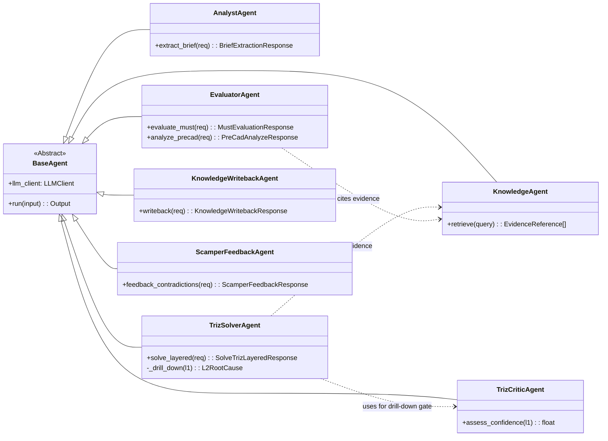
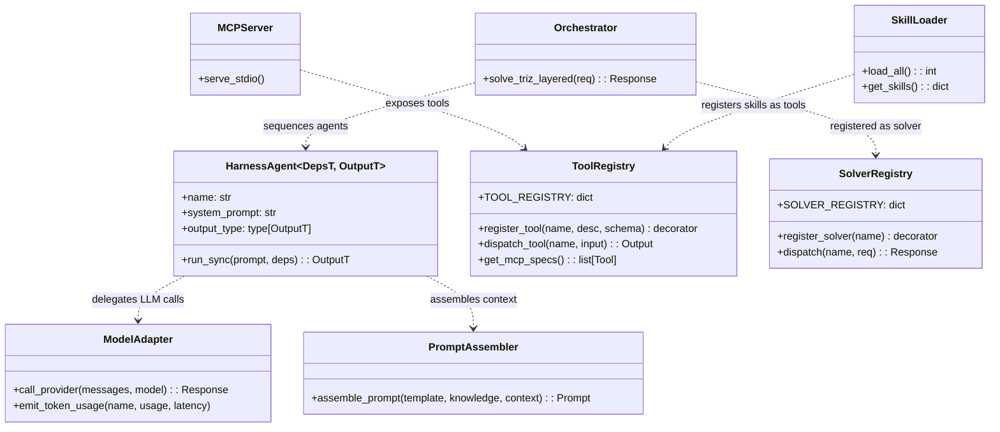
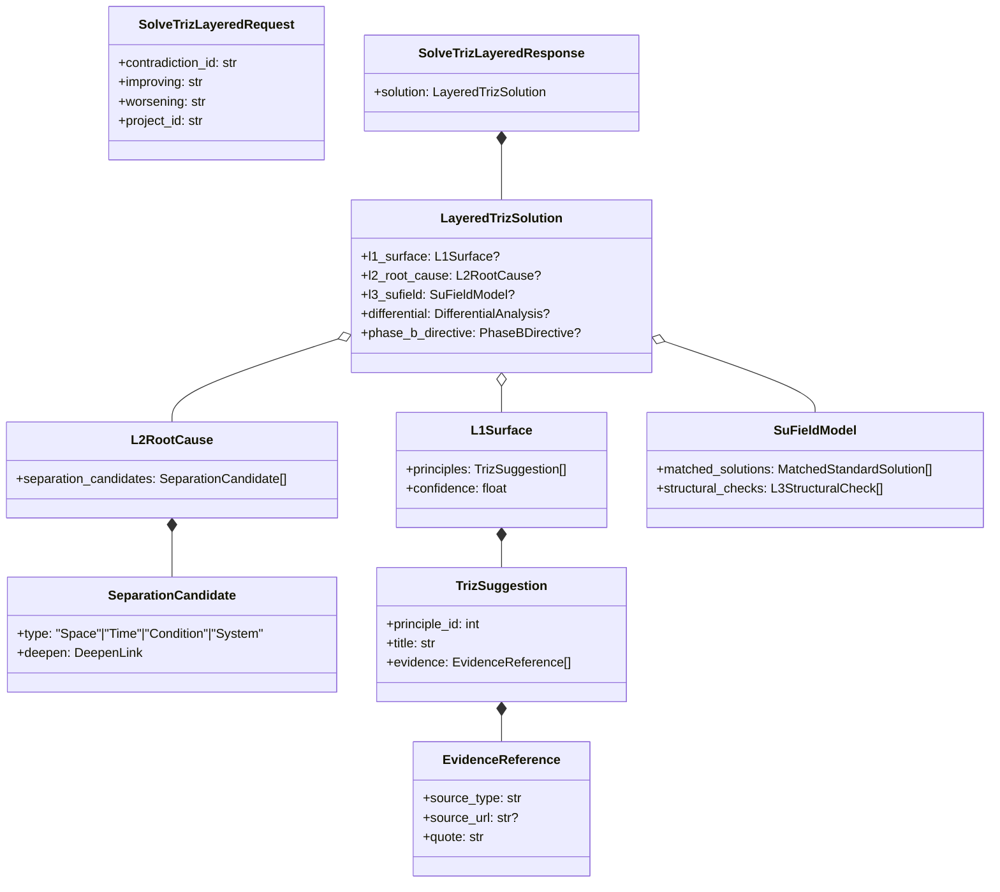
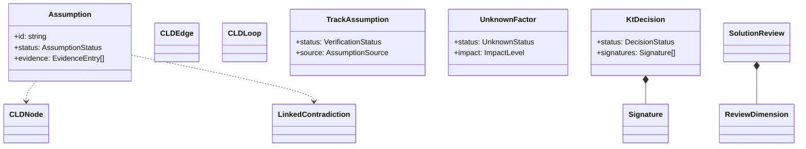
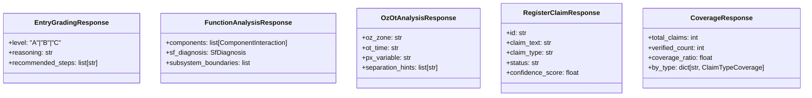

# E5x — 類別/組件關係 (Class / Component Relationships)

---

**文件版本 (Document Version):** `v2.0`
**最後更新 (Last Updated):** `2026-04-27`
**主要作者 (Lead Author):** `Architecture Team`
**審核者 (Reviewers):** `Backend Lead, Frontend Lead`
**狀態 (Status):** `Active`
**對應 VibeCoding 模板:** `10_class_relationships_template.md`
**相關設計文檔:** [`01-define/E3--architecture-and-design.md`](../../01-define/E3--architecture-and-design.md) · [`E5--api-design-specification.md`](../E5--api-design-specification.md) · [`E5x--file-dependencies.md`](E5x--file-dependencies.md)

---

## 目錄

1. [概述](#1-概述)
2. [核心類別圖](#2-核心類別圖)
3. [主要類別/組件職責](#3-主要類別組件職責)
4. [關係詳解](#4-關係詳解)
5. [設計模式應用](#5-設計模式應用)
6. [SOLID 原則遵循情況](#6-solid-原則遵循情況)
7. [接口契約](#7-接口契約)
8. [技術選型與依賴](#8-技術選型與依賴)
9. [附錄](#9-附錄)

---

## 1. 概述

### 1.1 文檔目的
呈現 **RD Design Copilot** 核心 Pydantic/TS 類別結構與主要 Agent 類別之間的關係。

### 1.2 建模範圍
- **包含**：`backend/app/agents/*.py` 核心 Agent 類別；`backend/app/harness/*.py` Harness 架構層（v2.0 新增）；`backend/app/models/schemas.py` 核心 Pydantic 類別；`backend/app/services/*.py` 關鍵服務；`src/types/*.ts` 前端鏡像類型。
- **排除**：第三方 SDK 類別、測試類、UI 純展示組件。
- **抽象層級**：公開介面與主要欄位。

### 1.3 UML 符號
`--|>` 繼承 · `..|>` 實現 · `*--` 組合 · `o--` 聚合 · `..>` 依賴 · `-->` 關聯。

---

## 2. 核心類別圖

### 2.1 Backend Agent 類別圖

### 2.1b Harness 架構層類別圖（v2.0 新增，ADR-006）

> **遷移狀態**：`AnalystAgent`、`EvaluatorAgent`、`TrizSolverAgent`、`TrizCriticAgent`、`KnowledgeAgent`、`KnowledgeWritebackAgent` 已透過 `harness_call()` / `HarnessAgent` 呼叫 LLM。`ScamperFeedbackAgent` 尚未遷移，仍直接使用 `BaseAgent.call_llm_json`。雙路徑並存期間，`BaseAgent` 保留為 legacy 基底。

### 2.2 Backend Pydantic 核心 Schema 圖（TRIZ 分層）

### 2.3 Frontend Type 鏡像圖（節錄）

### 2.4 Auto-TRIZ v2 新增 Schema 圖（v2.0 新增，ADR-008）

---

## 3. 主要類別/組件職責

| 類別/組件 | 核心職責 | 主要協作者 | 所屬模組 |
|---|---|---|---|
| `BaseAgent` | 所有 agent 抽象基底；封裝 LLM client、logging、retry | `LLMClient`, `Metrics` | `agents/base.py` |
| `TrizSolverAgent` | 分層 drill-down TRIZ 解矛盾 | `TrizCriticAgent`, `KnowledgeAgent`, `triz_kb` | `agents/triz_solver.py` |
| `TrizCriticAgent` | L1 信心評估，決定是否 drill-down | `BaseAgent` | `agents/triz_critic.py` |
| `EvaluatorAgent` | MUST/WANT/AC/Pre-CAD 六維評分 | `evaluator_registry`, `evidence_retrieval` | `agents/evaluator.py` |
| `KnowledgeAgent` | RAG 證據檢索 | `evidence_retrieval`, `web_search` | `agents/knowledge.py` |
| `LayeredTrizSolution` | 分層解答容器（Pydantic） | `L1/L2/L3/Phase B` 子結構 | `models/schemas.py` |
| `EvidenceReference` | 所有 AI 回答 citation 標準結構 | 被幾乎所有 response 引用 | `models/schemas.py` |
| `Assumption` (FE) | 假設模型 | `CLDNode`, `LinkedContradiction` | `src/types/assumption.ts` |
| `KtDecision` (FE) | KT 決策記錄 | `Signature`, `ActionItem`, `AdverseConsequence` | `src/types/decisionRecord.ts` |
| **v2.0 新增 — Harness 架構層（ADR-006）** | | | |
| `HarnessAgent` | 型別安全 LLM 呼叫封裝；取代直接 `call_llm_json` | `ModelAdapter`, `PromptAssembler` | `harness/agent_base.py` |
| `ModelAdapter` | Pydantic AI Model → 多 provider dispatch | `BaseAgent._call_provider` | `harness/model_adapter.py` |
| `ToolRegistry` | `@register_tool` 裝飾器；自動 JSON Schema + MCP spec | MCP Server | `harness/tool_registry.py` |
| `SolverRegistry` | `@register_solver` 可插拔解題器 | Orchestrator | `harness/solver_registry.py` |
| `SkillLoader` | 掃描 `skills/*/SKILL.md` frontmatter 載入知識 | `ToolRegistry` | `harness/skill_loader.py` |
| `Orchestrator` | L1→critic→L2→L3 管線 + Supabase 持久化 | `HarnessAgent`, `SolverRegistry` | `harness/orchestrator.py` |
| `PromptAssembler` | Cache-aware 上下文組裝 | `SkillLoader` | `harness/prompt_assembler.py` |
| **v2.0 新增 — Evidence Registry（ADR-008）** | | | |
| `EvidenceRegistryService` | 證據主張註冊 + WebSearch 驗證 + 覆蓋率統計 | `web_search`, Supabase | `services/evidence_registry.py` |

---

## 4. 關係詳解

### 4.1 繼承/實現
- **`*Agent --|> BaseAgent`**：所有 agent 繼承共通 LLM client 與 retry 邏輯。新增 agent 必須透過 BaseAgent，禁止直接 import `anthropic`/`openai`。

### 4.2 組合/聚合
- **`LayeredTrizSolution o-- L1Surface|L2RootCause|SuFieldModel`**：聚合（optional，依 drill-down 結果而定）；子結構生命週期獨立。
- **`KtDecision *-- Signature`**：組合；Signature 生命週期綁 KtDecision。
- **`L1Surface *-- TrizSuggestion *-- EvidenceReference`**：組合鏈。

### 4.3 依賴
- **`TrizSolverAgent ..> TrizCriticAgent`**：僅在 drill-down decision 點使用；透過 DI 注入。
- **`TrizSolverAgent ..> KnowledgeAgent`**：每則建議需 citation。

---

## 5. 設計模式應用

| 設計模式 | 應用場景 | 動機 |
|---|---|---|
| **Strategy** | `BaseAgent` 抽象 + 具體 `*Agent` 實作 | 不同分析策略可插拔 |
| **Template Method** | `BaseAgent.run()` 編排，子類實作 `_build_prompt` / `_parse_output` | 統一 LLM 呼叫流程 |
| **Registry** | `core/gate_registry.py`, `core/evaluator_registry.py` | 動態註冊 gate/evaluator |
| **Adapter** | `src/integrations/` snake↔camel 欄位轉換 | 隔離 BE/FE 命名差 |
| **Codegen** | `pydantic2ts`：`schemas.py → src/types/generated/` | 單一事實來源 |
| **Dependency Injection** | FastAPI `Depends(...)` 注入 agents / supabase client | 可測試性 |
| **v2.0 新增 — Harness 模式** | | |
| **Decorator Registry** | `@register_tool` / `@register_solver` 裝飾器自動註冊 | 零配置新增工具/解題器 |
| **Plugin (SKILL.md)** | `skills/*/SKILL.md` frontmatter 定義知識 bundle | 啟動時自動發現，hot-reload |
| **Typed Agent Wrapper** | `HarnessAgent[DepsT, OutputT]` 泛型封裝 | Pydantic 輸出保證型別安全 |
| **MCP Bridge** | ToolRegistry → FastMCP stdio server | 同一工具集可被 API + Claude Code 消費 |

---

## 6. SOLID 原則遵循情況

- **[x] S — 單一職責**：agents / services / tools 各司其職；`schemas.py` 單純聲明型別。
- **[x] O — 開放/封閉**：新增 agent 或 endpoint 無需改既有檔；新增 separation principle 於 `tools/separation_principles.py` 即可。
- **[x] L — Liskov**：所有 `*Agent` 可替換 `BaseAgent` 呼叫點。
- **[~] I — 介面隔離**：`BaseAgent` 目前單一 `run()` 介面；若 agent 功能膨脹應拆。`TBD — <be-lead TBD>`。
- **[x] D — 依賴反轉**：agent 層依賴 `LLMClient` Protocol 而非具體 SDK。

---

## 7. 接口契約

### 7.1 `BaseAgent.run(input) -> Output`
- **描述**：統一 agent 入口；內部執行 prompt build → LLM 呼叫 → parse → citation 驗證。
- **Preconditions**：`input` 已通過對應 Request Pydantic 驗證。
- **Postconditions**：輸出符合對應 Response Pydantic；若 LLM 失敗 → 拋 `LlmUpstreamError`（對應 HTTP 502）。

### 7.2 `LayeredTrizSolution`（Pydantic）
- 欄位見 §2.2。
- **契約**：至少 `l1_surface` 非 None；`phase_b_directive` 僅在多解情況下設定。

### 7.3 Frontend `Assumption`（TS）
- 見 `src/types/assumption.ts`；與 backend `ValidationPassportAssumption` 對齊。

---

## 8. 技術選型與依賴

| 類別/組件 | 語言/框架 | 關鍵庫 | 版本 | 適用範圍 | 選擇理由 | 備選 | 風險 | 關聯 ADR |
|---|---|---|---|---|---|---|---|---|
| `BaseAgent` + 衍生 | Python 3.11 / FastAPI | Pydantic v2, anthropic, openai | 對應 `pyproject.toml` | 後端 agent | 型別安全 + async | LangChain | 成熟度中 | ADR-002 TBD |
| `schemas.py` 模型 | Python | Pydantic v2 | ^2.7 | API contract | 單一事實來源 + codegen | attrs | 低 | ADR-003 (schema codegen) |
| `src/types/generated/` | TypeScript | pydantic2ts | TBD | FE 鏡像 | 自動同步 | 手寫 | 中（codegen 工具穩定度） | ADR-003 |
| `components/ui/` | React 19 | shadcn/ui + radix-ui | latest | UI 原子 | 可客製 + 無 vendor lock | MUI | 低 | ADR-004 TBD |
| `integrations/` adapter | TypeScript | zod (optional) | — | API 邊界 | snake↔camel 轉換 | 手寫 | 低 | ADR-003 |

- **外部基礎設施**：Supabase Postgres（含 RLS）、Anthropic API、OpenAI API。
- **NFR**：結構化日誌 (`core/logging.py`)、`/healthz`（TBD — 未確認端點名）、metrics (`observability/metrics.py`)。

> 技術權衡如有重大變更，新增 ADR 於 `docs/01-define/adrs/`。

---

## 9. 附錄

- **完整 schema 清單**：參考 `backend/app/models/schemas.py`（~80+ 類別），並透過 `/openapi.json` 檢視 OpenAPI。
- **更詳細類別圖**：可按需拆分「Pre-CAD 評分子圖」等子系統類別圖 — `TBD — <be-lead TBD>`。*(v9: SCAMPER 子圖已移除)*

---

**文件審核記錄:**

| 日期 | 審核人 | 版本 | 變更摘要 |
|---|---|---|---|
| 2026-04-15 | Architecture Team | v1.0 | 初稿；對齊 VibeCoding 10 模板 |
| 2026-04-27 | Architecture Team | v2.0 | 新增 Harness 架構層類別圖（ADR-006）；新增 ADR-008 schemas；新增 EvidenceRegistryService；更新設計模式表 |
