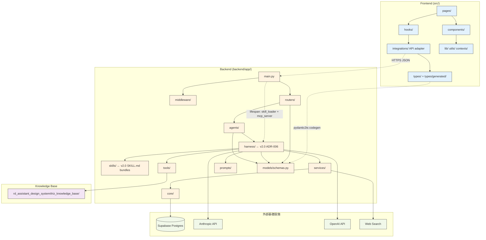
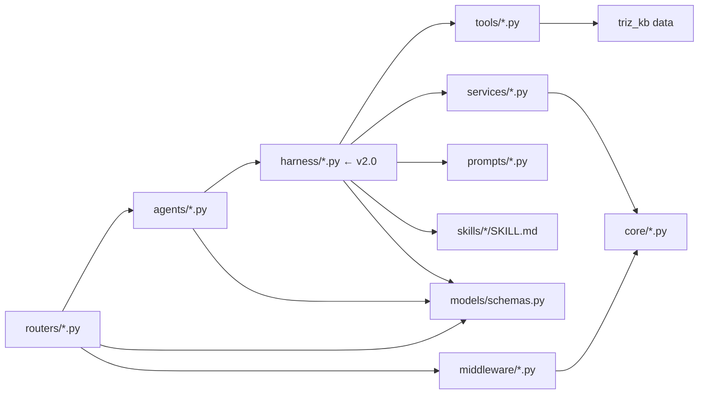

# E5x — 模組依賴關係分析 (File / Module Dependencies)

---

**文件版本 (Document Version):** `v2.0`
**最後更新 (Last Updated):** `2026-04-27`
**主要作者 (Lead Author):** `Architecture Team`
**審核者 (Reviewers):** `Backend Lead, Frontend Lead`
**狀態 (Status):** `Active`
**對應 VibeCoding 模板:** `09_file_dependencies_template.md`

---

## 目錄

1. [概述](#1-概述)
2. [核心依賴原則](#2-核心依賴原則)
3. [高層級模組依賴](#3-高層級模組依賴)
4. [模組/層級職責定義](#4-模組層級職責定義)
5. [關鍵依賴路徑分析](#5-關鍵依賴路徑分析)
6. [依賴風險與管理](#6-依賴風險與管理)
7. [外部依賴管理](#7-外部依賴管理)

---

## 1. 概述

### 1.1 文檔目的
呈現 **RD Design Copilot Blueprint** monorepo 的檔案群組依賴關係，指導 PR review 時判斷變更是否破壞分層。

### 1.2 分析範圍
- **層級**：模組級（`backend/app/*` 子目錄 + `src/*` 子目錄）
- **包含**：prod code + shared utility + UI 層
- **排除**：tests、第三方套件內部、generated files（`src/types/generated/*`）

---

## 2. 核心依賴原則

- **依賴倒置 (DIP)**：`agents/` 與 `routers/` 均依賴 `models/schemas.py`（抽象契約），不依賴具體 LLM client。
- **無循環 (ADP)**：`routers → agents → harness → tools/services → models`；模型層為葉節點，禁止回依賴。（v2.0：新增 `harness/` 層）
- **穩定依賴 (SDP)**：`models/schemas.py`（最穩定）被全專案依賴；`routers/`（最不穩定，常增端點）不被其他層依賴。
- **前端獨立性**：`src/` 僅依賴 `backend` 的 OpenAPI schema（透過 `pydantic2ts` 產生的 `src/types/generated/`），**不**直接 import backend code。

---

## 3. 高層級模組依賴

### 3.1 整體架構分層依賴圖

### 3.2 Backend 內部依賴（更細）

> **v2.0 變更**：`agents/` 不再直接依賴 `tools/` / `services/`，改透過 `harness/` 層（`HarnessAgent` + `ToolRegistry` + `PromptAssembler`）間接存取。`ScamperFeedbackAgent` 為例外，尚未遷移。

### 3.3 依賴規則說明

- **單向性**：所有依賴嚴格從上層指向下層；`schemas.py` 為純葉節點（只依賴 `pydantic`）。
- **依賴倒置**：`agents/` 定義 Protocol/ABC（如 `base.py`），具體 LLM client 由 `core/` 注入。
- **前後端解耦**：`src/types/generated/` 由 codegen 產生，絕不手改；前端代碼對 schema 的依賴等同對 OpenAPI contract 的依賴。

---

## 4. 模組/層級職責定義

| 層級/模組 | 主要職責 | 程式碼路徑 |
|---|---|---|
| **FE Pages** | Route 宣告、頁面級 layout | `src/pages/` |
| **FE Components** | UI 組合（feature + ui/） | `src/components/` |
| **FE Hooks** | 資料抓取 + 狀態管理（React Query/Zustand TBD） | `src/hooks/` |
| **FE Integrations** | API 呼叫封裝 + snake↔camel adapter | `src/integrations/` |
| **FE Types** | 型別（手寫 + pydantic2ts 產出） | `src/types/` |
| **BE Routers** | HTTP endpoint 定義、Pydantic 驗證 | `backend/app/routers/` |
| **BE Agents** | 多 agent 編排、LLM 呼叫（透過 harness） | `backend/app/agents/` |
| **BE Harness** | Agent 基底（`HarnessAgent`）、tool/solver registry、MCP server、orchestrator、prompt assembler | `backend/app/harness/` |
| **BE Skills** | TRIZ 知識 bundle（SKILL.md frontmatter + 靜態資料） | `backend/app/skills/` |
| **BE Services** | evidence registry、evidence retrieval、web search、spatial 計算 | `backend/app/services/` |
| **BE Tools** | TRIZ KB、矛盾樹、分離原理（靜態或半靜態） | `backend/app/tools/` |
| **BE Models** | Pydantic schemas（★唯一事實來源） | `backend/app/models/schemas.py` |
| **BE Core** | config, auth, supabase client, gate registry | `backend/app/core/` |
| **BE Prompts** | LLM prompt template 集中管理 | `backend/app/prompts/` |
| **Knowledge Base** | 靜態 TRIZ 資料、VibeCoding 模板 | `rd_assistant_design_system/` |

---

## 5. 關鍵依賴路徑分析

### 5.1 場景：RD 點擊「Solve Layered」
路徑：
1. `src/pages/Create.tsx` → `src/components/create/LayeredTrizPanel.tsx`
2. 呼叫 `src/hooks/useLayeredTrizSolve.ts`
3. 透過 `src/integrations/api.ts` 發出 `POST /triz/solve-layered`（payload type from `src/types/generated/`）
4. Backend `routers/triz.py` → 驗證 `SolveTrizLayeredRequest` (schemas.py)
5. → `harness/orchestrator.py` (v2.0) → 序列化 L1→critic→L2→L3 管線
6. → `agents/triz_solver.py` → `harness/agent_base.py` (HarnessAgent) → `harness/prompt_assembler.py` + `tools/triz_kb.py`
7. → `harness/model_adapter.py` → Anthropic/OpenAI 呼叫
8. 每層 Supabase 持久化 → 返回 `SolveTrizLayeredResponse` → router → adapter → hook → 元件

**結論**：單向、遵循 DIP；路徑無循環。v2.0 新增 `harness/` 中介層但不改變單向性。

### 5.3 場景：Entry Grading + Evidence Coverage（v2.0 新增）

**Entry Grading**：
`routers/analyst_v2.py` → `agents/analyst.py::analyze_entry_grading` → `harness/agent_base.py::harness_call` → `harness/model_adapter.py` → LLM

**Evidence Coverage**：
`routers/evidence.py` → `services/evidence_registry.py::get_coverage` → `core/supabase.py` → Supabase

### 5.2 場景：Pre-CAD Gate 六維評分
`routers/pre_cad.py` → `agents/evaluator.py` → `core/evaluator_registry.py` + `services/evidence_retrieval.py` → `models/schemas.py`。符合分層。

---

## 6. 依賴風險與管理

### 6.1 循環依賴
- **檢測**：`pydeps` (Python) + `madge` (TS) 加入 CI — `TBD — <infra TBD> by 2026-05-15 TBD`。
- **已知風險**：`agents/triz_solver.py` 與 `agents/triz_critic.py` 可能互 import；以 `base.py` 的抽象接口隔離。

### 6.2 不穩定依賴
- **LLM 客戶端**：直接 import `anthropic` / `openai` SDK 集中於 `agents/base.py`；其他 agent 透過注入。
- **Supabase client**：僅 `core/supabase.py` 直接 import；router/agent 透過 DI fixture。

---

## 7. 外部依賴管理

### 7.1 外部依賴清單（節錄）

| 外部依賴 | 版本 | 用途 | 風險 |
|---|---|---|---|
| `fastapi` | ^0.110 | Web 框架 | 低 |
| `pydantic` | ^2.7 | Schema / 驗證 | 低 |
| `anthropic` | TBD | Claude API | 中（rate limit/價格） |
| `openai` | TBD | GPT API | 中 |
| `supabase` | TBD | DB + Auth | 低 |
| `pydantic-ai` | >=0.0.14 | Harness Agent spine（v2.0 ADR-006） | 中（pre-1.0 API） |
| `mcp` | >=1.0 | MCP server/client protocol（v2.0 ADR-006） | 中（Anthropic 維護） |
| `react` | ^19 | UI | 中（19 為新版） |
| `vite` | latest | 打包 | 低 |
| `@tanstack/react-query` | TBD | 前端資料 | 低 |
| `shadcn/ui` + `radix-ui` | latest | UI 原子 | 低 |
| `tailwindcss` | ^3 | CSS | 低 |
| `pydantic2ts` | TBD | Codegen | 中（社群維護） |

詳見 `backend/pyproject.toml` 與 `package.json`。

### 7.2 依賴更新策略
- Dependabot/Renovate — `TBD — <infra TBD>`。
- LLM SDK 升級：必須跑完 `backend/tests/` + E7x smoke 才合併。

---

## 📝 使用指南
- 每次重大架構變更同步更新 §3 Mermaid 圖。
- PR 若新增跨層依賴（如 router 直接呼叫 service 跳過 agent），必須在 PR 描述中解釋並考慮開 ADR。
