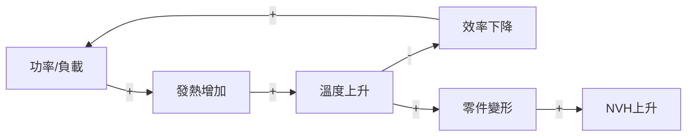

# RD Design Copilot — 系統規格定義書

**版本**: v2.0
**日期**: 2026-04-27
**範圍**: MVP (v0.5) — D1-V4 全流程之 API + UI 規格

> **v2.0 更新**（2026-04-27）：
> - 修正技術堆疊（Supabase Postgres / React 19 / Harness 架構）
> - 新增 Entry Level A/B/C 條件式路徑（ADR-008）
> - 新增 Harness 架構層概述（ADR-006）
> - Project 表加入 `entry_level`；Contradiction 表加入 `oz_zone` / `ot_time` / `px_variable`
> - 新增 function_models / evidence_claims / sim_matrices 資料表
> - 新增 Analyst v2 (5 endpoints) + Evidence Registry (3 endpoints) API
>
> **v1.1 更新**（2026-02-24）：Step 編號按實際執行順序重新編排（原 Step 6→Step 5、原 Step 5→Step 6）；新增 X2 內部流程（TRIZ→子系統→方案→MUST）詳細說明。（~~SCAMPER 已於 v9 移除~~）

---

## 1. 文件目的

本文件定義 RD Design Copilot 系統中每一個階段（Step）的：
- **輸入**（資料結構與來源）
- **處理邏輯**（AI 任務邊界 vs 人工決策邊界）
- **輸出**（資料結構與儲存）
- **Gate 條件**（進入下一階段的必要條件）
- **API 端點**（REST 路由）

---

## 2. 全域資料模型

### 2.1 Project（專案）

| 欄位 | 型別 | 說明 |
|------|------|------|
| id | UUID | PK |
| name | String(200) | 專案名稱 |
| description | Text | 專案描述 |
| phase | String(20) | DRAFT → PHASE_I → PHASE_II → PHASE_III → COMPLETED |
| entry_level | String(1) | **A** / **B** / **C**（問題複雜度分級，影響 Step 流程路徑）|
| created_at | DateTime | 建立時間 |
| updated_at | DateTime | 更新時間 |

### 2.2 狀態機

系統有 8 個 Step-level Gate（每步一個）。其中 4 個 Gate 同時觸發 Phase 轉換：

```
                    Define                     eXplore                 Verify
                  (D1→D2→D4)                (X1→X2)              (V1→V3→V4)
                       │                          │                       │
DRAFT ──Gate D1──▶ DEFINE ──Gate D4──▶ EXPLORE ──Gate X5──▶ VERIFY ──Gate V4──▶ COMPLETED
                       │                          │                       │
                   Gate D3 (內部)            Gate X1 (內部)         Gate V1,V3 (內部)
```

| Gate | 位置 | Phase 轉換？ |
|------|------|-------------|
| Gate D1 | D1 完成後 | DRAFT → DEFINE |
| Gate D3 | D2 完成後 | — (Define 內部) |
| Gate D4 | D4 完成後 | **DEFINE → EXPLORE** |
| Gate X1 | X1 完成後 | — (eXplore 內部) |
| Gate X5 | X2 完成後 | **EXPLORE → VERIFY** |
| Gate V1 | V1 完成後 | — (Verify 內部) |
| Gate V3 | V3 完成後 | — (Verify 內部) |
| Gate V4 | V4 完成後 | **VERIFY → COMPLETED** |

Gate 條件�� `gate_service.py` 自動檢查，不滿足則拒絕推進。

### 2.3 Entry Level 條件式路徑（v2.0 新增，ADR-008）

專案建立時由 AI 分級（`POST /analyst/entry-grading`），決定 Explore 階段的流程深度：

| Level | 條件 | Explore 流程 | 適用情境 |
|-------|------|-------------|----------|
| **A** | 症狀模糊，需引導 | 5 步 Stepper：Problem Scoping → FA → Socratic → Contradictions → CLD | 新手 / 初次接觸問題 |
| **B** | 已知 TC，專家級 | 原 3 Tab（FA 為 side panel） | 熟練 RD 工程師 |
| **C** | 功能缺失，無 trade-off | SF-only 快速路徑 | 補功能需求 |

Level 由 `EntryGradingResponse.level` 決定，存入 `projects.entry_level`。前端根據此值切換 Conditional Stepper 或 3-Tab UI。

### 2.4 Auto-TRIZ v2 新增資料表（ADR-008）

#### FunctionModel（功能模型）

| 欄位 | 型別 | 說明 |
|------|------|------|
| id | UUID | PK |
| project_id | FK → Project | |
| components | JSON | 組件交互清單 `[{name, role, interactions[]}]` |
| sf_diagnosis | JSON | 物質-場診斷結果 |
| subsystem_boundaries | JSON | 子系統邊界定義 |

#### EvidenceClaim（證據註冊）

| 欄位 | 型別 | 說明 |
|------|------|------|
| id | String | CLM-{proj}-{seq:04d} |
| project_id | FK → Project | |
| claim_text | Text | 主張內容 |
| claim_type | String | assumption / hypothesis / result / constraint |
| status | String | unverified → verified / refuted / partial |
| verification_sources | JSON | 驗證來源清單 |
| confidence_score | Float [0,1] | 可信度 |
| linked_artifact_id | String (nullable) | 關聯工件 ID |
| linked_artifact_type | String (nullable) | 關聯工件類型 |

#### SimMatrix（多 TC 交互矩陣）

| 欄位 | 型別 | 說��� |
|------|------|------|
| id | UUID | PK |
| project_id | FK → Project | |
| matrix_data | JSON | N×N 交互矩陣 (+1/0/−1) |
| contradiction_ids | JSON | 參與矛盾 ID 清單 |

### 2.5 Step 執行順序

| Step | 名稱 | Phase | 說明 |
|------|------|-------|------|
| D1 | 問題界定 | Define | 任務定義表 |
| D2 | 理解全貌 | Define | 蘇格拉底問答 |
| D4 | 系統建模 | Define | 因果迴路 + TRIZ 矛盾 + 斷路點 |
| X1 | 假設與驗證規劃 | eXplore | 假設台帳 + 未知集合 (U) |
| **X2** | **創造與調整** | **eXplore** | **TRIZ 解矛盾 → 子系統定義 → AI 方案生成 → MUST 快篩**（~~SCAMPER v9 移除~~） |
| **V1** | **全方位檢視** | **Verify** | **SWOT + 黑帽質疑 + 風險登錄** |
| V3 | 決策與行動 | Verify | KT Decision Analysis + 最小實驗 |
| V4 | 內化與傳達 | Verify | 匯出報告 + 費曼 |

---

## 3. Define: 定義問題空間

### D1 — 問題界定（任務定義表）

#### 輸入

| 來源 | 欄位 | 說明 |
|------|------|------|
| 使用者 | mission | 一句話任務聲明 |
| 使用者 | hard_constraints[] | `{name, value, source}` 硬約束清單 |
| 使用者 | soft_objectives[] | `{name, priority}` 可 trade-off 目標 |
| 使用者 | non_goals[] | `{item}` 明確不追求 |
| 使用者 | critical_metrics[] | `{name, target, method}` 三個最不能失敗指標 |

#### AI 協助

| 端點 | 功能 | 邊界 |
|------|------|------|
| `POST /definitions/generate` | 根據 mission + constraints 生成建議的 critical_metrics、soft_objectives | AI 建議，人工確認/修改 |

#### 輸出 — TaskDefinition

| 欄位 | 型別 |
|------|------|
| id | UUID |
| project_id | FK → Project |
| mission | Text |
| hard_constraints | JSON `[{name, value, source}]` |
| soft_objectives | JSON `[{name, priority}]` |
| non_goals | JSON `[{item}]` |
| critical_metrics | JSON `[{name, target, method}]` |

#### API 端點

| Method | Path | 說明 |
|--------|------|------|
| POST | `/api/v1/projects/{pid}/definitions` | 建立任務定義 |
| GET | `/api/v1/projects/{pid}/definitions` | 取得任務定義 |
| PUT | `/api/v1/projects/{pid}/definitions/{id}` | 更新任務定義 |
| POST | `/api/v1/projects/{pid}/definitions/generate` | AI 生成建議 |

#### Gate D1 條件

- [x] `critical_metrics` 長度 ≥ 3
- [x] 每個 metric 皆有 `target` 與 `method`

---

### D2 — 蘇格拉底問答

#### 輸入

| 來源 | 欄位 | 說明 |
|------|------|------|
| AI | questions[] | 蘇格拉底六類提問（澄清/假設/證據/觀點/後果/反思） |
| 使用者 | answers[] | 使用者回答 |

#### AI 協助

| 端點 | 功能 | 邊界 |
|------|------|------|
| `POST /questions/generate` | 根據 TaskDefinition 生成 6 類問題 | AI 產出問題，人工回答 |

#### 輸出 — SocraticQuestion

| 欄位 | 型別 |
|------|------|
| id | UUID |
| project_id | FK |
| category | String (clarify/assumption/evidence/perspective/consequence/reflection) |
| question | Text |
| answer | Text (使用者填入) |

#### API 端點

| Method | Path | 說明 |
|--------|------|------|
| POST | `/api/v1/projects/{pid}/questions/generate` | AI 生成問題 |
| GET | `/api/v1/projects/{pid}/questions` | 取得所有問題 |
| PUT | `/api/v1/projects/{pid}/questions/{id}` | 填入回答 |

---

### D4 — 系統建模（因果迴路 + TRIZ 矛盾正式化 + 斷路點）

D4 包含三個子產出：**因果迴路圖**、**TRIZ 矛盾句**、**斷路點識別**。

---

#### D4a — 因果迴路圖 + 斷路點（AI 可建模）

##### AI 協助

| 端點 | 功能 | 邊界 |
|------|------|------|
| `POST /causal-loops/generate` | 從 TaskDefinition + 蘇格拉底問答 + 矛盾句中自動抽取因果節點/邊，建立因果迴路圖並識別斷路點 | AI 建模初稿，人工審核/修改/補充 |

**AI 建模邏輯**：
- 從蘇格拉底回答中抽取因果關係（e.g. 「轉速提高會導致 NVH 惡化」→ 邊 `轉速 --+→ NVH`）
- 從矛盾句中抽取耦合關係（e.g. C-001「改善速度，惡化噪音」→ 邊 `功率密度 --+→ 振動`）
- 識別正/負回饋迴路（增強迴路 vs 平衡迴路）
- 識別斷路點：耦合度高（連接邊多）、介入成本低、效果可驗證的位置
- 每個斷路點附帶 TRIZ 原理提示

**Prompt 模板**: `causal_loop_generate.md`

##### 輸入（手動建立）

| 來源 | 欄位 | 說明 |
|------|------|------|
| 使用者/AI | name | 迴路名稱 (e.g. "熱-機-振 耦合迴路") |
| 使用者/AI | nodes[] | `[{id, label}]` 因果節點 |
| 使用者/AI | edges[] | `[{from, to, polarity: "+"/"-", label}]` 因果邊 |
| 使用者/AI | description | 迴路說明 |

##### 輸出 — CausalLoop

| 欄位 | 型別 |
|------|------|
| id | UUID |
| project_id | FK |
| name | String(200) |
| nodes | JSON `[{id, label}]` |
| edges | JSON `[{from, to, polarity, label}]` |
| description | Text |
| created_at | DateTime |
| updated_at | DateTime |

##### API 端點

| Method | Path | 說明 |
|--------|------|------|
| POST | `/api/v1/projects/{pid}/causal-loops/generate` | **AI 建模因果迴路 + 斷路點** |
| POST | `/api/v1/projects/{pid}/causal-loops` | 手動建立因果迴路 |
| GET | `/api/v1/projects/{pid}/causal-loops` | 列出因果迴路 |
| PUT | `/api/v1/projects/{pid}/causal-loops/{id}` | 更新因果迴路 |
| DELETE | `/api/v1/projects/{pid}/causal-loops/{id}` | 刪除因果迴路 |

##### 因果迴路圖範例



---

#### D4b — TRIZ 矛盾正式化

##### 輸入

| 來源 | 欄位 | 說明 |
|------|------|------|
| AI + 人工 | improve_param | 改善參數（TRIZ 39 參數） |
| AI + 人工 | worsen_param | 惡化參數 |
| AI + 人工 | engineering_desc | 工程表述：「當 X 時，A 改善，但 B 惡化」 |
| AI + 人工 | physical_contradiction | 物理矛盾表述 |

##### AI 協助

| 端點 | 功能 | 邊界 |
|------|------|------|
| `POST /contradictions/identify` | 從蘇格拉底回答中識別矛盾 | AI 初識別，人工審核/修改 |

##### 輸出 — Contradiction

| 欄位 | 型別 |
|------|------|
| id | UUID |
| project_id | FK |
| code | String (C-001, C-002...) |
| improve_param | String |
| worsen_param | String |
| engineering_desc | Text |
| physical_contradiction | Text |
| source | Text |
| oz_zone | String (nullable) | 操作區域（v2.0 新增，ADR-008 OZ-OT 分析） |
| ot_time | String (nullable) | 操作時間（v2.0 新增） |
| px_variable | String (nullable) | 物理矛盾變數（v2.0 新增） |

##### API 端點

| Method | Path | 說明 |
|--------|------|------|
| POST | `/api/v1/projects/{pid}/contradictions` | 建立矛盾 |
| POST | `/api/v1/projects/{pid}/contradictions/identify` | AI 識別矛盾 |
| GET | `/api/v1/projects/{pid}/contradictions` | 列出矛盾 |
| DELETE | `/api/v1/projects/{pid}/contradictions/{id}` | 刪除矛盾 |

---

#### D4c — 斷路點識別

##### 輸入

| 來源 | 欄位 | 說明 |
|------|------|------|
| 使用者/AI | code | 斷路點編號 (BP-001) |
| 使用者/AI | causal_loop_id | 所屬因果迴路 |
| 使用者/AI | location | 斷路位置 (e.g. "馬達-減速機界面") |
| 使用者/AI | description | 斷路點說明 |
| 使用者/AI | solution_direction | 可能解法方向 (e.g. "隔熱隔振分區") |
| 使用者/AI | triz_principles | TRIZ 原理提示 (e.g. "#1分割, #2分離") |

##### 輸出 — Breakpoint

| 欄位 | 型別 |
|------|------|
| id | UUID |
| project_id | FK |
| causal_loop_id | FK → CausalLoop |
| code | String(10) |
| location | String(200) |
| description | Text |
| solution_direction | Text |
| triz_principles | Text |
| created_at | DateTime |

##### API 端點

| Method | Path | 說明 |
|--------|------|------|
| POST | `/api/v1/projects/{pid}/breakpoints` | 建立斷路點 |
| GET | `/api/v1/projects/{pid}/breakpoints` | 列出斷路點 |
| PUT | `/api/v1/projects/{pid}/breakpoints/{id}` | 更新斷路點 |
| DELETE | `/api/v1/projects/{pid}/breakpoints/{id}` | 刪除斷路點 |

##### 斷路點範例

| 斷路點 | 位置 | 可能解法方向 | TRIZ 原理提示 |
|--------|------|-------------|--------------|
| BP-001 | 熱-振解耦：馬達-減速機界面 | 隔熱隔振分區 | #1分割, #2分離 |
| BP-002 | 冗餘散熱：控制器 | 雙路徑散熱 | #40複合材料 |
| BP-003 | 自校正：裝配界面 | 浮動支撐 | #15動態化 |

---

#### Gate D3 條件

- [x] Contradiction 數量 ≥ 3
- [x] SocraticQuestion 中有回答的數量 ≥ 10
- [x] CausalLoop 至少 1 個
- [x] Breakpoint 數量 ≥ 3

---

## 4. eXplore: 假設與發散

### X1 — 假設與驗證規劃（HDA + 未知集合）

#### X1a — 假設台帳

##### 輸入

| 來源 | 欄位 | 說明 |
|------|------|------|
| 使用者 | code | 假設編號 (A-001) |
| 使用者 | content | 假設內容 |
| 使用者 | assumption_type | 類型：介面/包絡、系統邊界/架構、可靠度/壽命、NVH/體驗、環境可靠度、低溫性能、製程/DFM、成本 |
| 使用者 | source | 來源：規格需求、案例/競品、工程常識、初算/推估、供應商資料 |
| 使用者 | worst_consequence | 若錯了最壞後果 |
| 使用者 | risk_level | High / Medium-High / Medium / Low |
| 使用者 | verification_method | 最小驗證方法 |
| 使用者 | acceptance_criteria | 驗收/判定標準 |
| 使用者 | owner | 責任人 |
| 使用者 | due_date | 期限 (e.g. Gate 2 前) |

##### AI 協助

無直接 AI 生成。假設由 RD 工程師根據 D2 蘇格拉底問答與工程經驗填入。

##### 輸出 — Assumption

| 欄位 | 型別 |
|------|------|
| id | UUID |
| project_id | FK |
| code | String(10) |
| content | Text |
| assumption_type | String(50) |
| source | String(100) |
| worst_consequence | Text |
| risk_level | String(20) |
| verification_method | Text |
| acceptance_criteria | Text |
| owner | String(100) |
| due_date | String(50) |
| status | String(20): Open → Planned → Verifying → Verified / Disproved |

##### API 端點

| Method | Path | 說明 |
|--------|------|------|
| POST | `/api/v1/projects/{pid}/assumptions` | 建立假設 |
| GET | `/api/v1/projects/{pid}/assumptions` | 列出假設 |
| PUT | `/api/v1/projects/{pid}/assumptions/{id}` | 更新假設 |
| DELETE | `/api/v1/projects/{pid}/assumptions/{id}` | 刪除假設 |

---

#### X1b — 未知集合 (U) 表達

##### 目的

假設台帳管「對/錯」（前提是否成立），未知集合管「變/不變」（因子會在什麼範圍波動）。
兩者搭配完整描述早期設計的不確定性全貌：

- **導引 Robust 評判**：V3 WANT 條件中「餘裕深度」「公差鈍感」「解耦程度」的本質是方案在 U 各種組合下是否崩潰
- **導引最小實驗設計**：U 因子直接對應實驗要掃的參數空間
- **讓不確定性從隱性變顯性**：團隊看得到「我們知道會變、但不知道怎麼變」的因子

##### 輸入

| 來源 | 欄位 | 說明 |
|------|------|------|
| 使用者 | code | 未知因子編號 (U-001) |
| 使用者 | name | 因子名稱 (e.g. "負載變化") |
| 使用者 | category | 分類：環境/使用者行為/製程/材料/供應/介面 |
| 使用者 | levels | JSON `["低","中","高"]` 可能的離散水準 |
| 使用者 | range_desc | 連續範圍描述 (e.g. "-20°C ~ +55°C") |
| 使用者 | impact_on | 影響哪些指標 (e.g. "NVH, 壽命") |
| 使用者 | related_assumptions | 關聯假設編號 (e.g. "A-001, A-003") |

##### 輸出 — UnknownFactor

| 欄位 | 型別 |
|------|------|
| id | UUID |
| project_id | FK |
| code | String(10) |
| name | String(200) |
| category | String(50) |
| levels | JSON `["低","中","高"]` |
| range_desc | String(200) |
| impact_on | Text |
| related_assumptions | Text |
| created_at | DateTime |

##### API 端點

| Method | Path | 說明 |
|--------|------|------|
| POST | `/api/v1/projects/{pid}/unknown-factors` | 建立未知因子 |
| GET | `/api/v1/projects/{pid}/unknown-factors` | 列出未知因子 |
| PUT | `/api/v1/projects/{pid}/unknown-factors/{id}` | 更新未知因子 |
| DELETE | `/api/v1/projects/{pid}/unknown-factors/{id}` | 刪除未知因子 |

##### 未知集合範例

| 編號 | 名稱 | 分類 | 水準 | 影響指標 | 關聯假設 |
|------|------|------|------|---------|---------|
| U-001 | 負載變化 | 使用者行為 | [低, 中, 高] | 溫升, 壽命 | A-001 |
| U-002 | 環境溫度 | 環境 | [-20°C ~ +55°C] | 效率, 材料強度 | A-002 |
| U-003 | 裝配偏心 | 製程 | [小, 中, 大] | NVH, 壽命 | A-003 |
| U-004 | 摩擦係數 | 材料 | [低, 高] | 效率, 溫升 | A-004 |
| U-005 | 供應公差 | 供應 | [穩定, 不穩定] | 裝配品質 | A-005 |

#### Gate X1 條件

- [x] Assumption 數量 ≥ 10
- [x] 至少 3 個 risk_level = High 的假設有 verification_method
- [x] UnknownFactor 數量 ≥ 3

---

### X2 — 創造與調整（TRIZ → 子系統 → 方案 → MUST）

> 這是整合流程的核心發散步驟。流程為串接式管線，但不同矛盾/子系統之間可並行。

#### X2 內部流程

```
矛盾句 (C-001~N) ──→ X2a TRIZ 解矛盾
斷路點 (BP-001~N) ──→     ↓
                       解法方向
                          ↓
                    X2b（X3）子系統定義
                    (散熱/支撐/傳動/控制器/隔振/...)
                          ↓
               ┌──── TRIZ 解法 ────┐
               │                    │
               └──→ X2d（X4）AI 方案生成 ←┘
                          ↓
                    X2e MUST 快篩
                    ↓           ↓
                  Pass        Fail(淘汰)
                    ↓
              Set-Based 方案集合
              (≥1 條進入 V1)
```

> ~~X2c SCAMPER 模組變形已於 v9 移除~~（其 7 動作為 TRIZ 40 原理子集，由 TRIZ L1/L2/L3 完全覆蓋）。~~Anti-Anchor 已於 v10 退役，合併為 TRIZ L1 跨域去錨定步驟。~~

---

#### X2a — TRIZ 解矛盾

##### 輸入

| 來源 | 欄位 | 說明 |
|------|------|------|
| 系統 | contradiction_id | 對應的矛盾 (來自 D4b) |
| 系統 | breakpoints | 相關斷路點 (來自 D4c)，提供介入位置提示 |

##### AI 協助

| 端點 | 功能 | 邊界 |
|------|------|------|
| `POST /triz/solve` | 根據矛盾句查 TRIZ 矛盾矩陣，生成原理+抽象策略+工程對映 | AI 建議解法方向，人工審核 |

##### 輸出 — TrizSolution

| 欄位 | 型別 | 說明 |
|------|------|------|
| id | UUID | |
| project_id | FK | |
| contradiction_id | FK → Contradiction | 對應哪條矛盾 |
| principles | JSON `[{number, name}]` | 採用的 TRIZ 40 原理 |
| strategies | JSON `[{strategy, mappings[]}]` | 抽象策略 + 具體工程對映手段 |
| robust_estimate | JSON `{margin, decoupling, recoverability}` | robust 預評 |

每個 strategy 的 mappings 即為「工程手段」，會指向具體的子系統模組。

##### API 端點

| Method | Path | 說明 |
|--------|------|------|
| POST | `/api/v1/projects/{pid}/triz/solve` | AI 解矛盾 |
| GET | `/api/v1/projects/{pid}/triz` | 列出 TRIZ 解法 |

##### TRIZ → 子系統的關鍵銜接（X2a → X3）

TRIZ 解法的 `engineering_mappings` 會指出受影響的子系統，例如：

```yaml
TRIZ_解法_C001:
  矛盾句: 改善 9-速度 惡化 31-有害副作用(噪音)
  採用原理: "#1 分割"
  抽象策略: "將振源與被影響元件物理分離"
  工程對映:
    - 手段1: "馬達-減速機界面隔振墊" → 影響子系統: 隔振系統, 支撐結構
    - 手段2: "控制器外置" → 影響子系統: 控制器, 散熱系統
    - 手段3: "浮動支撐" → 影響子系統: 支撐結構
```

這些「影響子系統」即為 X3 的輸入。

---

#### X3 — 子系統定義

##### 目的

根據 TRIZ 解法方向，識別受影響的子系統並定義三層階層邊界。

##### 輸入

| 來源 | 說明 |
|------|------|
| X2a TRIZ 解法 | 工程對映中提到的子系統 |
| 使用者/RD 團隊 | 補充其他需要探索的子系統 |

##### 子系統清單範例（依專案調整）

| 子系統 | 說明 | 來自 TRIZ 解法 |
|--------|------|---------------|
| 散熱系統 | 熱管/鰭片/風道/外殼散熱 | C-001 手段2 |
| 支撐結構 | 馬達固定/減速機固定/機架 | C-001 手段1,3 |
| 傳動機構 | 齒輪/軸/軸承/聯軸器 | C-002 |
| 控制器 | 驅動板/感測器/佈線 | C-001 手段2 |
| 隔振系統 | 隔振墊/阻尼器/彈性件 | C-001 手段1 |

##### 產出

確定的子系統清單，進入 X4 進行 AI 方案生成。

---

#### ~~X2c — SCAMPER 模組變形~~ (v9 移除)

> **v9 移除說明**：SCAMPER 已於 v9 移除 — 其 7 動作（S/C/A/M/P/E/R）為 TRIZ 40 原理的子集，由 TRIZ L1/L2/L3 完全覆蓋。相關 API 端點 `/scamper/perform`、`/scamper/generate`、`/scamper/feedback-contradictions` 已移除。~~Anti-Anchor 已於 v10 退役，合併為 TRIZ L1 跨域去錨定步驟。~~

---

#### X4 — AI 方案生成（Set-Based 方案集合）

##### 目的

整合 X2a (TRIZ 解法) + X3 (子系統定義) + TRIZ L1 跨域去錨定候選，生成完整的候選方案。

##### 輸入

| 來源 | 說明 |
|------|------|
| X2a | TRIZ 解法方向（原理+工程對映） |
| X3 | 子系統定義（三層階層 + 6 維契約） |
| X1a | 假設台帳（方案需引用的假設） |
| X1b | 未知集合（方案需考量的不確定因子） |

##### AI 協助

| 端點 | 功能 | 邊界 |
|------|------|------|
| `POST /alternatives/generate` | 根據 TRIZ + 子系統定義結果組合生成方案 | AI 生成候選，人工審核/修改；AI **不使用形容詞**，只用工程語言 |

##### 輸出 — Alternative（每個方案必須附帶）

| 欄位 | 型別 | 說明 |
|------|------|------|
| id | UUID | |
| project_id | FK | |
| code | String(20) | 方案編號 ALT-001 |
| name | String(200) | 方案名稱 |
| source | String(200) | 來源：TRIZ #X |
| mechanism | JSON | **機制說明**：物理原理 + 結構描述 + 關鍵尺寸 |
| assumptions | JSON | **假設清單**：引用 A-xxx |
| risk_assessment | JSON | **風險評估**：新增失效模式 + 製程風險 + 供應風險 |
| robust_scores | JSON | **robust 預評**：Margin(1-5) / Decoupling(1-5) / Recoverability(1-5) / Complexity(1-5,越低越好) / Sensitivity(1-5,越低越好) |
| min_experiment | JSON | **最小驗證**：驗證目標 + 方法 + 週期 + 成本 |
| status | String | draft → must_pass / must_fail → selected / backup / eliminated |

##### 方案規格範例

```yaml
ALT-001:
  名稱: 分區隔振+熱管散熱
  來源: TRIZ #1分割 + 跨域去錨定(隔振路線)

  機制說明:
    物理原理: 隔振墊切斷振動傳遞路徑，熱管相變傳熱繞過隔振界面
    結構描述: 馬達-減速機界面加隔振墊 + 外殼內嵌熱管
    關鍵尺寸: 隔振墊厚度 3-5mm, 熱管直徑 8mm

  假設清單:
    - A-001: 外殼可帶走 80% 熱量
    - A-003: 隔振墊壽命 > 5000hr

  風險評估:
    新增失效模式: 熱管洩漏、隔振墊老化
    製程風險: 熱管壓合需新製程
    供應風險: 熱管供應商有限（2家）

  robust預評分:
    Margin: 4
    Decoupling: 5
    Recoverability: 3
    Complexity: 2
    Sensitivity: 2

  最小驗證:
    驗證目標: A-001 外殼散熱能力
    方法: 熱阻測試
    週期: 1 週
    成本: $500
```

##### API 端點

| Method | Path | 說明 |
|--------|------|------|
| POST | `/api/v1/projects/{pid}/alternatives` | 建立方案 |
| POST | `/api/v1/projects/{pid}/alternatives/generate` | AI 生成方案 |
| GET | `/api/v1/projects/{pid}/alternatives` | 列出方案 |
| PUT | `/api/v1/projects/{pid}/alternatives/{id}` | 更新方案 |
| DELETE | `/api/v1/projects/{pid}/alternatives/{id}` | 刪除方案 |

---

#### X2e — MUST 快篩

##### 目的

用 MUST 條件做「快速淘汰」，不通過 = 直接淘汰。完整的 WANT 評分在 V3 執行。

##### MUST 條件（依專案調整）

| MUST | 條件 | 判斷方式 |
|------|------|---------|
| M1 | 空間約束：可塞進目標空間 | 概念佈局估算 |
| M2 | 成本預估：BOM ≤ 目標上限 | 粗估 |
| M3 | 安全餘裕：三指標有合理 margin | 工程判斷 |
| M4 | 解耦程度：無致命耦合迴路 | 因果迴路圖 |
| M5 | 可行性：製程/供應基本可行 | 經驗判斷 |

##### 輸入

| 來源 | 欄位 | 說明 |
|------|------|------|
| 使用者 | alternative_id | 受評方案 |
| 使用者 | results | JSON: 每項 MUST 的 pass/fail 判定 |
| 系統 | overall_pass | 全部通過才為 true |

##### AI 協助

無。MUST 為人工判定。

##### 輸出 — MustEvaluation

| 欄位 | 型別 |
|------|------|
| id | UUID |
| project_id | FK |
| alternative_id | FK |
| results | JSON `{M1: bool, M2: bool, ...}` |
| overall_pass | Boolean |
| notes | Text |

##### 篩選規則

1. 任一 MUST 不通過 = 直接淘汰 (status → must_fail)
2. 全部通過 → status → must_pass
3. 通過者進入 Set-Based 集合（≥1 條）
4. 完整 KT Decision Analysis（MUST+WANT+AC）在 V3 執行

##### API 端點

| Method | Path | 說明 |
|--------|------|------|
| POST | `/api/v1/projects/{pid}/must` | 建立 MUST 評估 |
| GET | `/api/v1/projects/{pid}/must` | 列出 MUST 評估 |

#### Gate X5 條件

- [x] Alternative 數量 ≥ 3
- [x] 至少 3 個 Alternative 的 MUST overall_pass = true
- [x] 每個通過的 Alternative 有完整方案規格（mechanism + assumptions + risk_assessment + min_experiment）

---

## 5. Verify: 收斂與驗證

### V1 — 全方位檢視（SWOT + 黑帽 + 風險登錄）

#### 輸入

| 來源 | 欄位 | 說明 |
|------|------|------|
| 使用者 | description | 風險描述 |
| 使用者 | risk_type | technical / supply / process / integration |
| 使用者 | probability | High / Medium / Low |
| 使用者 | severity | High / Medium / Low |
| 系統 | level | P×S 矩陣自動計算: H*/H/M/L |
| 使用者 | mitigation | 緩解措施 |
| 使用者 | owner | 負責人 |
| 使用者 | monitor_metric | 監控指標 |
| 使用者 | alternative_id | 關聯方案 (選填) |

#### AI 協助

| 端點 | 功能 | 邊界 |
|------|------|------|
| (黑帽審查 prompt) | 對方案做黑帽質疑，產出風險候選 | AI 建議風險，人工確認並填入 mitigation |

#### 輸出 — Risk

| 欄位 | 型別 |
|------|------|
| id | UUID |
| project_id | FK |
| alternative_id | FK (nullable) |
| description | Text |
| risk_type | String |
| probability | String |
| severity | String |
| level | String (H*/H/M/L) |
| mitigation | Text |
| owner | String |
| monitor_metric | Text |

#### API 端點

| Method | Path | 說明 |
|--------|------|------|
| POST | `/api/v1/projects/{pid}/risks` | 建立風險 |
| GET | `/api/v1/projects/{pid}/risks` | 列出風險 |
| PUT | `/api/v1/projects/{pid}/risks/{id}` | 更新風險 |
| DELETE | `/api/v1/projects/{pid}/risks/{id}` | 刪除風險 |

#### Gate V1 條件

- [x] 每個風險都有 Owner
- [x] 每個風險都有 mitigation
- [x] 每個風險都有 monitor_metric

---

### V3 — 決策與行動（KT Decision Analysis + 最小實驗）

#### V3a — WANT 加權評分

##### 輸入

| 來源 | 欄位 | 說明 |
|------|------|------|
| 使用者 | criteria: code | W1, W2... |
| 使用者 | criteria: name | 條件名稱 |
| 使用者 | criteria: weight | 權重 (1-10)，**團隊共識決定** |
| 使用者 | criteria: score_10/6/2 | 10分/6分/2分的工程條件定義 |
| 使用者 | scores: score | 1-10 分，**基於證據** |
| 使用者 | scores: evidence | 證據來源 |

##### AI 協助

無。WANT 權重與評分皆由人工基於證據判定，AI 不參與評分。

##### 輸出

**WantCriteria**

| 欄位 | 型別 |
|------|------|
| id | UUID |
| project_id | FK |
| code | String (W1, W2...) |
| name | String |
| weight | Integer (1-10) |
| score_10_condition | Text |
| score_6_condition | Text |
| score_2_condition | Text |

**WantScore**

| 欄位 | 型別 |
|------|------|
| id | UUID |
| project_id | FK |
| criteria_id | FK → WantCriteria |
| alternative_id | FK → Alternative |
| score | Integer (1-10) |
| weighted_score | Float (= weight × score) |
| evidence | Text |

##### API 端點

| Method | Path | 說明 |
|--------|------|------|
| POST | `/api/v1/projects/{pid}/want/criteria` | 建立 WANT 條件 |
| GET | `/api/v1/projects/{pid}/want/criteria` | 列出 WANT 條件 |
| POST | `/api/v1/projects/{pid}/want/scores` | 建立評分 |
| GET | `/api/v1/projects/{pid}/want/scores` | 列出評分 |
| GET | `/api/v1/projects/{pid}/want/matrix` | 取得完整評分矩陣 |

---

#### V3b — 最小實驗

##### 輸入

| 來源 | 欄位 | 說明 |
|------|------|------|
| 使用者 | assumption_id | 驗證哪個假設 |
| 使用者 | goal | 實驗目標（證明/推翻） |
| 使用者 | question | 只回答一個問題 |
| 使用者 | method | 測試/計算/樣品/模擬 |
| 使用者 | success_criteria | 成功標準 |
| 使用者 | failure_action | 若假設錯了的下一步 |

##### 輸出 — Experiment

| 欄位 | 型別 |
|------|------|
| id | UUID |
| project_id | FK |
| assumption_id | FK (nullable) |
| goal | Text |
| question | Text |
| method | Text |
| success_criteria | Text |
| failure_action | Text |
| status | String: planned → in_progress → completed / failed |
| result | Text |

##### API 端點

| Method | Path | 說明 |
|--------|------|------|
| POST | `/api/v1/projects/{pid}/experiments` | 建立實驗 |
| GET | `/api/v1/projects/{pid}/experiments` | 列出實驗 |
| PUT | `/api/v1/projects/{pid}/experiments/{id}` | 更新實驗 |

---

#### V3c — KT 決策記錄

##### 輸入

| 來源 | 欄位 | 說明 |
|------|------|------|
| 使用者 | statement | 決策聲明 |
| 使用者 | primary_choice | 首選方案 code |
| 使用者 | primary_reason | 首選理由 |
| 使用者 | backup_choice | 備援方案 code |
| 使用者 | backup_reason | 備援理由 |
| AI | ai_summary | AI 自動彙整 MUST/WANT/AC 結果 |
| 使用者 | signed_by | 簽核人 |

##### AI 協助

| 端點 | 功能 | 邊界 |
|------|------|------|
| `POST /decisions/generate` | 根據 MUST+WANT+Risk 結果生成決策建議 | AI 建議，人工確認並簽核 |

##### 輸出 — DecisionRecord

| 欄位 | 型別 |
|------|------|
| id | UUID |
| project_id | FK |
| statement | Text |
| must_summary | JSON |
| want_summary | JSON |
| risk_summary | JSON |
| primary_choice | String |
| primary_reason | Text |
| backup_choice | String |
| backup_reason | Text |
| action_items | JSON `[{task, owner, due}]` |
| signed_by | String |
| signed_at | DateTime |

##### API 端點

| Method | Path | 說明 |
|--------|------|------|
| POST | `/api/v1/projects/{pid}/decisions` | 建立決策記錄 |
| POST | `/api/v1/projects/{pid}/decisions/generate` | AI 生成決策建議 |
| GET | `/api/v1/projects/{pid}/decisions` | 取得決策記錄 |
| PUT | `/api/v1/projects/{pid}/decisions/{id}` | 更新決策記錄 |

#### Gate V3 條件

- [x] DecisionRecord 存在且 signed_by 非空
- [x] 所有 Risk level = H 皆有 mitigation
- [x] 每個 WANT score 皆有 evidence

---

### V4 — 內化與傳達

#### 輸出格式

| 端點 | 格式 | 說明 |
|------|------|------|
| `GET /export/markdown` | Markdown | 完整報告，含全 9 章節 |
| `GET /export/json` | JSON | 結構化資料，供其他系統串接 |

#### Markdown 報告章節

1. 任務定義表
2. 矛盾列表
3. 假設台帳
4. 方案集合
5. MUST 篩選結果
6. WANT 評分結果
7. 風險評估
8. KT 決策記錄
9. 最小實驗計畫

---

## 6. AI 使用邊界

| 項目 | AI 可做 | AI 不可做 |
|------|---------|----------|
| D1 任務定義 | 建議 critical_metrics | 決定硬約束值 |
| D2 蘇格拉底 | 生成六類問題 | 替使用者回答 |
| D4 因果迴路 | 從問答+矛盾中自動建模因果迴路 + 識別斷路點 | 直接確認迴路正確性（人工審核） |
| D4 矛盾識別 | 從回答中初步識別矛盾 | 直接確認矛盾 |
| X2a TRIZ 解法 | 查表 + 生成工程對映 | 決定最終方案 |
| ~~X2c SCAMPER~~ | *(v9 移除)* | — |
| X4 方案生成 | 組合 TRIZ 產出候選 | 使用形容詞式描述 |
| X2e MUST 評分 | — | **不參與** (人工 Go/No-Go) |
| V1 風險評估 | 黑帽審查產出風險候選 | 決定緩解措施 |
| V3a WANT 評分 | — | **不參與** (人工基於證據評分) |
| V3c 決策建議 | 彙整 MUST/WANT/AC 結果 | 決定首選方案 |

---

## 7. Gate 條件彙整

| Gate | 位置 | Phase 轉換 | 條件 |
|------|------|-----------|------|
| **Gate D1** | D1 → D2 | **DRAFT → DEFINE** | critical_metrics ≥ 3 且各有 target+method |
| Gate D3 | D2 → D4 | — | contradictions ≥ 3, answered questions ≥ 10（建議完成 FunctionModel，目前未程式化強制） |
| **Gate D4** | D4 → X1 | **DEFINE → EXPLORE** | causal_loops ≥ 1, breakpoints ≥ 3, 每條矛盾有 TRIZ 正式句 |
| Gate X1 | X1 → X2 | — | assumptions ≥ 10, Top 3 High 有驗證設計, unknown_factors ≥ 3 |
| **Gate X5** | X2 → V1 | **EXPLORE → VERIFY** | 探索完整度 pass (TRIZ 三路徑含 L1 跨域去錨定皆執行) + ≥1 MUST pass + 每條存活路線有完整規格 |
| Gate V1 | V1 → V3 | — | 每個風險有 Owner + mitigation + monitor_metric |
| Gate V3 | V3 → V4 | — | DecisionRecord 已簽核, H 風險有緩解, WANT 有證據 |
| **Gate V4** | V4 → Done | **VERIFY → COMPLETED** | 報告已產出 |

---

## 8. ���術規格

| 項目 | 規格 |
|------|------|
| 語言 | Python 3.11+（後端）/ TypeScript 5.x（前端） |
| API 框架 | FastAPI + Uvicorn |
| 資料庫 | **Supabase (PostgreSQL)**（直接透過 supabase-py SDK，無 ORM） |
| Schema 驗證 | Pydantic v2 |
| Agent 框架 | **Pydantic AI** + **MCP** — Harness 架構（見 [ADR-006](../../01-define/adrs/ADR-006-harness-architecture.md)） |
| LLM | 多 Provider：Anthropic Claude / OpenAI / Azure / Gemini / Qwen（透過 `model_adapter.py`） |
| 前端 | **React 19 + Vite + Tailwind CSS + shadcn/ui** |
| 狀態管理 | React Query（TanStack Query） |
| 即時同步 | Supabase Realtime（Postgres NOTIFY → WebSocket） |
| 測試 | pytest + pytest-asyncio（後端）/ Vitest + Playwright E2E（前端） |
| 容器化 | Docker + docker-compose + Nginx |

### 8.1 Harness 架構層（v2.0 新��，ADR-006）

後端採用 **Hybrid Harness** 架構，位於 `backend/app/harness/`：

| 模組 | 職責 |
|------|------|
| `agent_base.py` | `HarnessAgent[DepsT, OutputT]` — 型別安全的 LLM 呼叫封裝 |
| `model_adapter.py` | Pydantic AI Model → 多 provider dispatch（保留 exponential backoff） |
| `tool_registry.py` | `@register_tool` 裝飾器 + 自動 MCP spec 產出 |
| `solver_registry.py` | `@register_solver` 可插拔解題器 |
| `skill_loader.py` | 掃描 `skills/*/SKILL.md` frontmatter，啟動時載入 |
| `mcp_server.py` | stdio MCP server，將 registered tools 曝露給 Claude Code |
| `orchestrator.py` | L1→critic→L2→L3 線性管線，每層 Supabase 持久化 |
| `prompt_assembler.py` | Cache-aware 上下文組裝（static_system / dynamic_context 分離） |

呼叫鏈：`routers → agents → harness → services/tools → models`

### 8.2 Auto-TRIZ v2 新增 API（ADR-008）

#### Analyst v2 Endpoints

| Method | Path | 功能 | Response Model |
|--------|------|------|----------------|
| POST | `/analyst/five-why` | 5Why 根因分析 | `FiveWhyResponse` |
| POST | `/analyst/kt-analysis` | KT Is/IsNot 分析 | `KtIsIsNotResponse` |
| POST | `/analyst/function-analysis` | 功能分析（FA + SF 診斷） | `FunctionAnalysisResponse` |
| POST | `/analyst/oz-ot-analysis` | OZ-OT-Px 分析（鎖定操作區/時/變數） | `OzOtAnalysisResponse` |
| POST | `/analyst/entry-grading` | 問題複雜度分級（A/B/C） | `EntryGradingResponse` |

#### Evidence Registry Endpoints

| Method | Path | 功能 | Response Model |
|--------|------|------|----------------|
| POST | `/evidence/claims` | 註冊證據主張 | `RegisterClaimResponse` |
| POST | `/evidence/claims/{claim_id}/verify` | 驗證主張（WebSearch + 數值比對） | `VerifyClaimResponse` |
| GET | `/evidence/coverage/{project_id}` | 專案證據覆蓋率統計 | `CoverageResponse` |

---

## 9. Prompt 模板清單

| 檔案 | 用途 | 對應 Step |
|------|------|-----------|
| task_definition.md | 生成任務定義建議 | D1 |
| socratic_questions.md | 生成蘇格拉底問題 | D2 |
| causal_loop_generate.md | AI 建模因果迴路 + 斷路點 | D4a |
| contradiction_identify.md | 識別矛盾 | D4b |
| triz_solution.md | TRIZ 解矛盾 | X2a |
| ~~scamper_variant.md~~ | ~~SCAMPER 變形~~ | *(v9 移除)* |
| alternative_generate.md | 生成方案 | X4 |
| black_hat_review.md | 黑帽審查 | V1 |
| decision_record.md | 決策建議 | V3c |

---

**EOF**
