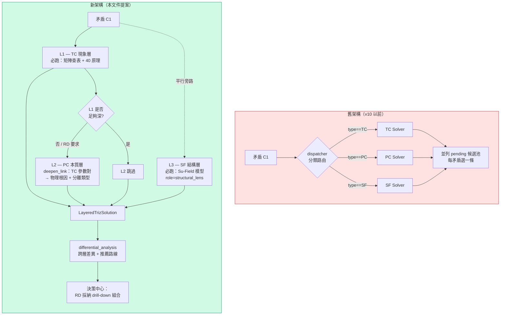

# TRIZ 分層 Drill-Down 求解架構：診斷與優化方案

> **版本**：v1.0 | **日期**：2026-04-08 | **觀點**：方法論審視 + 系統架構修正
> **對齊依據**：
>
> - `docs/e2e/Forward_TRIZ_Solver_Architecture.md` v1.0
> - `docs/e2e/module/Forward_Subsystem_Discovery_Architecture.md` v2.1（F2 樹階 vs F1 分析層、`related_contradictions` 主綁定）
> - `docs/e2e/TRIZ_Multi_Solution_Adoption_Strategy.md`
> - `docs/diagrams/triz-to-scamper-flow.md` v11
>
> **文件目的**：以蘇格拉底式批判思考檢視目前 F1（TRIZ 解矛盾）階段的三份設計文件，揭露把 TC/PC/SF 誤用為「互斥分類」的核心謬誤，並提出**分層 drill-down** 的優化架構，讓 RD 收到的不再是單一表面解法，而是「現象層 → 本質層 → 結構層」的遞進式建議組合。

---

## §0 導讀


| 章節  | 內容                             | 讀者            |
| --- | ------------------------------ | ------------- |
| §1  | 背景：傳統 TRIZ 方法論對 TC/PC/SF 的正解   | 所有人           |
| §2  | 蘇格拉底診斷：五個邏輯謬誤                  | SA、RD Lead    |
| §3  | 差異性分析（觀點 vs 現況）                | PM、Tech Lead  |
| §4  | 優化架構：三層 Drill-Down TRIZ Solver | SA            |
| §5  | `LayeredTrizSolution` 資料模型完整規格 | SA、Backend RD |
| §6  | 對三份現有文件的修改指引（章節級）              | Doc owner     |
| §7  | 案例演練：e-bike 馬達散熱的分層求解          | 所有人           |
| §8  | 與下游（F2 / 決策中心）的契約修訂            | Backend RD    |
| §9  | 實作影響面與遷移路徑                     | Backend RD    |
| §10 | Anti-Pattern：何時不應分層            | SA            |
| §11 | 驗證方式                           | QA            |


---

## §1 背景：傳統 TRIZ 對 TC / PC / SF 的正解

TRIZ 經典體系裡，這三者**不是三個互斥的標籤**，而是「同一個問題的三種視角 + 兩層深度」的組合：


| 維度       | 技術矛盾 (TC)    | 物理矛盾 (PC)     | 物場分析 (SF)     |
| -------- | ------------ | ------------- | ------------- |
| **分析視角** | 系統表現的「交換代價」  | 單一參數的「兩難要求」   | 能量與物質的「功能完整性」 |
| **層次**   | **現象層**（表象）  | **本質層**（根因）   | **結構層**（旁路）   |
| **適用時機** | 初步掃描、優化既有設計  | TC 碰到天花板、尋找突破 | 檢查功能鏈是否有缺口    |
| **核心工具** | 39 參數 + 矛盾矩陣 | 4 大分離原理       | 76 個標準解       |


**實務流程（ARIZ 精神的簡化版）**：

```
TC 快速掃描（看有沒有現成原理可套）
    │
    ├─(有好解)─▶ 採用 TC 解，結束
    │
    └─(不夠深)─▶ 深挖 PC（把 TC 的 trade-off 追到同一物理參數的兩難要求）
                       │
                       └─▶ 套用時間/空間/條件/整體-局部分離原則
                                │
                                └─▶（同時）用 SF 旁路檢查系統結構是否有缺場、有害作用、或測量不足
```

**關鍵洞察**：三者不是「三選一」，而是「TC 是入口、PC 是深挖、SF 是旁路結構檢查」的**組合拳**。

---

## §2 蘇格拉底診斷：五個邏輯謬誤

### 謬誤 1：把「分析層次」誤編為「分類路由」（核心）

**出處**：`Forward_TRIZ_Solver_Architecture.md` §6.2

```
兩個工程指標互相拖累? → TC
否 → 同一物件需要相反屬性? → PC
否 → 物場交互有問題? → SF
```

**詰問**：

- 同一個 e-bike「輕量 vs 強度」矛盾，真的只能是 TC 或 PC 或 SF **之一**嗎？事實上它既是 TC（參數 #1 vs #14），也可以深挖為 PC（同一片材料在抗拉時要硬、在吸震時要韌），還可以抽象為 SF（車架-負荷-應力場，系統狀態 insufficient）。
- ARIZ 的精神就是「TC 不好解 → 深挖成 PC」。如果架構把 TC/PC 當成互斥分類，ARIZ 的深挖路徑**在這個系統裡根本無法表達**。
- 決策樹的「否則分支」讓 PC 變成「TC 判不成才會走到」的 fallback — 這徹底顛倒了 TRIZ：PC 應該是 TC 的**深化**，不是 TC 的**備胎**。

**診斷**：這是「方法論類別」與「資料類別」的 **category error**。把分析視角選擇錯誤編碼為矛盾類型的單選題。

---

### 謬誤 2：「同矛盾多路徑警告」以症狀代替病因

**出處**：`docs/diagrams/triz-to-scamper-flow.md` §0

```
❌ v6：TC解 + PC解 + SF解 全部送 Phase B → 二次矛盾 → 無限 re-scan
✅ v7：每矛盾只 adopt 一條 → 同矛盾多路徑警告
```

**詰問**：

- 無限 re-scan 的**真因**是什麼？是 TC/PC/SF 本質衝突，還是 Phase B **把三條路徑當成彼此獨立、會互相產生二次矛盾的候選**？
- 如果 TC、PC、SF 是同一矛盾的三種視角，它們的解法本來就應該指向同一方向（或至少可協調），怎麼可能自相衝突到需要 re-scan？
- 「同矛盾多路徑 → 警告」這條規則，有沒有可能正是把 TRIZ **最有力的工具**（表象 + 本質 + 結構三重驗證）當成 bug 來迴避？

**診斷**：v7 的修復是**治標不治本**。真正該修的是 Phase B 的比對邏輯 — 它應該辨識「同矛盾的多層解是 drill-down 組合，不該互相比對互斥」，而不是一刀切禁止多路徑採納。

---

### 謬誤 3：多解策略只覆蓋「同路徑內合併」，完全遺漏「跨層次整合」

**出處**：`TRIZ_Multi_Solution_Adoption_Strategy.md` §5 案例

該文件的 e-bike 馬達散熱範例，把 #19 + #36 + #3 + #35 合併為 composite route — **四者全部來自同一 TC 矩陣 cell**，同一層次內的原理合併。

**詰問**：

- M1 – M5 的判斷矩陣討論「作用維度」、「互相強化」、「互斥」— 但從未討論「表象層 vs 本質層」的上下層級關係。一個 TC 解和對應的 PC 解之間是什麼關係？它不是 M1 – M5 任何一類，而是**drill-down 上下層**。
- 此文件所有範例都是**同路徑內**的合併。跨路徑（TC → PC 深挖、或 TC + SF 結構補強）的合併**完全沒有被討論**。
- 該文件與 `triz-to-scamper-flow.md` 的「每矛盾選一路徑」規則在 surface 層面一致 — 但這一致是建立在**雙方共同遺漏跨層次整合**之上。

**診斷**：多解策略與主流程在「same path only」達成一致，但這是**共同盲點**，不是正確設計。系統的知識庫工具完整，但 RD 仍只能拿到單層答案。

---

### 謬誤 4：「TRIZ KB 三大解法系統」→「三條路徑剛好覆蓋」的循環論證

**出處**：`Forward_TRIZ_Solver_Architecture.md` §6.6

> 「不能合併：三條路徑的形式化結構完全不同」
> 「不需新增：多出來的工具（如 ARIZ、Trends of Evolution）都是這三條路徑的組合」

**詰問**：

- **ARIZ 本質就是 TC → PC 深挖的算法**。如果自承 ARIZ 是「TC + PC 的組合」，為什麼架構上 TC 與 PC 不能合作？這段論述**自相矛盾**。
- 「形式化結構不同 → 不能合併」把「資料結構共享」與「分析流程協同」混為一談。兩個 solver 完全可以各自保有獨立 schema，卻仍構成 TC → PC 的 drill-down 管線。
- 要落實 ARIZ 精神，架構上**只需要新增一條 `deepen_link` 關聯**，不需要打破現有三條 solver 的獨立性。

**診斷**：§6.6 用「工程實作獨立」推導出「方法論不能協同」— 從工程結構推導方法論邊界，**本末倒置**。

---

### 謬誤 5：創意／演繹的二分法，掩蓋了「演繹分層」的缺失

**出處**：`docs/diagrams/triz-to-scamper-flow.md` §11 v9 差異摘要

> 「方法獨立：創意(反向) vs 演繹(正向)，不應混用」

**詰問**：

- 反向（跨域去錨定創意，原 Anti-Anchor，v10 已合併為 TRIZ L1 內建步驟）與正向（TRIZ 演繹）的二分本身是對的。但是**正向路徑內部**的「演繹分層」（現象 → 本質 → 結構）在哪裡？
- 主流程圖畫的是 F1（TRIZ）→ F2（子系統）→ 決策中心 **水平步驟** *(v9: F3 SCAMPER 已移除)*。F1 內部的垂直深度（TC 淺層 → PC 深層 → SF 旁路結構診斷）**沒有任何機制**。
- RD 拿到一堆並列的 pending 候選，只能**在自己的腦袋裡做 drill-down** — 這違反了 Copilot「把專家思路工程化」的核心承諾。

**診斷**：主流程有水平拆分，沒有垂直分層。F1 內部沒有「如果 TC 解顯然不夠深，自動觸發 PC 深挖」的邏輯。

---

## §3 差異性分析：使用者觀點 vs 現有系統


| 議題                 | 傳統 TRIZ 觀點（使用者立場）            | 現有系統              | 差距                |
| ------------------ | ---------------------------- | ----------------- | ----------------- |
| **TC/PC/SF 關係**    | 遞進 + 互補的三層分析鏡                | 互斥的分類標籤           | 方法論層次被壓扁成水平分類     |
| **ARIZ 地位**        | 核心算法：TC → PC 深挖              | 宣稱是「三路徑的組合」但無實作機制 | 宣稱與實作不一致          |
| **多解整合**           | 同層內可合併；跨層為 drill-down        | 只有同層合併；跨層明文禁止     | 缺 drill-down 資料模型 |
| **輸出給 RD**         | 分層建議（表象 + 本質 + 結構旁證）         | 並列候選池，每矛盾選一條      | 表面解與根因解**同級競爭**   |
| **二次矛盾 / re-scan** | 是深化過程的正常徵兆                   | 被當成缺陷，禁止多路徑採納     | 以警告迴避，而非從結構修正     |
| **RD 認知負擔**        | 系統呈現 drill-down 邏輯，RD 判斷採納深度 | RD 要自己在腦中重建層次關係   | 違反 Copilot 承諾     |


---

## §4 優化架構：三層 Drill-Down TRIZ Solver

### §4.1 核心概念轉變




### §4.2 三層的職責與觸發條件


| 層      | 類型      | 觸發條件                                                                                                                            | 必跑     | 角色                                         |
| ------ | ------- | ------------------------------------------------------------------------------------------------------------------------------- | ------ | ------------------------------------------ |
| **L1** | TC（現象層） | 矛盾一進 F1                                                                                                                         | ✅ 永遠跑  | 快速掃描既有矩陣 + 40 原理                           |
| **L2** | PC（本質層） | 以下任一成立：(a) L1 產出全被 critic 或 RD 判為「trade-off 折衷」；(b) L1 的 `principle hits <= 2`；(c) RD 點擊「深挖」按鈕；(d) 矛盾 severity 標記 `fatal/major` | ⛔ 有條件跑 | 把 TC 的衝突對 deepen 成單一物理參數的兩難，套分離原則          |
| **L3** | SF（結構層） | 矛盾一進 F1                                                                                                                         | ✅ 永遠跑  | 以 Su-Field 做旁路結構檢查；即使 L1/L2 已解，仍可能揭露隱性功能缺口 |


### §4.3 L1 → L2 的 deepen_link 契約（ARIZ 落地）

當 L2 被觸發時，系統必須從 L1 的 TC 資訊自動產生 PC 的候選：

```
L1 輸入:
  improving_param: #1 weight (e.g. 10 kg → 8 kg)
  worsening_param: #14 strength (e.g. 1200 N → 900 N)

推導 L2 的 PC 候選:
  derived_physical_parameter: "結構斷面厚度 t"
  contradiction_statement: "t 必須大（滿足強度）且必須小（滿足輕量）"
  separation_type_candidates: [space, condition, whole_part]
  reason_map:
    space: "承力區域厚、非承力區薄"
    condition: "受力時剛性、不受力時可彈性"
    whole_part: "整體薄殼 + 局部加強肋"
```

這個 `deepen_link` 讓 RD 看到**表象衝突如何被追到單一物理參數的兩難**，而不是兩個解法並列請他挑一個。

### §4.4 L3 的「structural_lens」定位

L3 不與 L1/L2 競爭。它的輸出永遠是**旁證**形式：

```
L3 Su-Field diagnosis:
  model: S1=散熱片, S2=MOSFET, F=熱場
  state: insufficient
  finding: "Su-Field 完整但效能不足，Class 2.2 建議引入 S3 中介物（熱管）"
  relationship_to_L1_L2:
    - if L1 adopted (#19 週期性動作): "L3 補完 — 週期脈衝需要熱容緩衝，S3 熱管剛好提供"
    - if L2 adopted (空間分離散熱結構): "L3 驗證 — 空間分離後 Su-Field 仍 insufficient，需再補 S3"
    - if both skipped: "L3 獨立建議 — 單靠補 S3 也是一條可行路"
```

L3 的價值是**揭露 L1/L2 可能沒看到的結構缺口**，並提供補強建議。

---

## §5 `LayeredTrizSolution` 資料模型

取代現有「三條獨立 TrizSuggestion pending 候選」的輸出單元。

```yaml
LayeredTrizSolution:
  id: "LTS-{project}-{seq}"
  contradiction_id: "C-EBIKE-012"
  contradiction_natural_description: "馬達功率密度提升導致溫升過高"

  # ─── L1 現象層（永遠存在）────────────────
  L1_surface:
    layer_role: "phenomenon"
    type: "TC"
    input:
      improving_param: 21   # #21 功率
      worsening_param: 17   # #17 溫度
    principles: [19, 35, 3, 36]
    suggestions:
      - principle_id: 19
        concrete: "脈衝冷卻：溫控觸發高速風扇"
        cross_domain_example: "..."
        effort: low
        expected_gain: "-5°C @ 瞬態"
      - ...
    depth_indicator: "trade-off 改良"
    evidence_level_floor: "E1"

  # ─── L2 本質層（有條件存在）───────────────
  L2_root_cause:
    layer_role: "root_cause"
    type: "PC"
    triggered: true
    trigger_reason: "L1 的 4 條建議被 critic 判為 trade-off 折衷（修補而非突破）"
    deepen_link:
      from_layer: "L1_surface"
      from_tc_pair: [21, 17]
      derived_physical_parameter: "瞬時功率 P(t)"
      contradiction_statement: "P(t) 必須高（爬坡需求）且必須低（散熱上限）"
      separation_type_candidates:
        - type: "time"
          rationale: "爬坡時高、巡航時低（時段分離）"
        - type: "condition"
          rationale: "溫度 < 60°C 時允許高功率，> 60°C 時降額"
    suggestions:
      - separation_type: "time"
        principle_refs: [9, 15, 19]
        concrete: "雙模態功率管理器 + 預熱管理"
        effort: "medium-high"
        expected_gain: "峰值功率 +30%，平均溫升 -8°C"
    depth_indicator: "根因突破"

  # ─── L3 結構層（永遠存在，角色為旁路）──
  L3_structural_check:
    layer_role: "structural_lens"
    type: "SF"
    su_field_model:
      S1: "定子繞線"
      S2: "外殼"
      F: "熱場（Fourier 傳導）"
      state: "insufficient"
    matched_standard_solutions: ["2.2.1", "2.4.1"]
    suggestions:
      - standard_id: "2.2.1"
        concrete: "引入 S3 = 熱管陣列作為中介物"
        relationship_to_other_layers:
          supports_L1: "為 #19 的脈衝冷卻提供熱容緩衝"
          supports_L2: "為時間分離的降額策略延長峰值窗口"
          standalone_value: "即使 L1/L2 皆不採用，此方案本身可獨立改善 15%"
    depth_indicator: "功能鏈缺陷修補"

  # ─── 跨層差異分析（本優化方案的關鍵新欄位）──
  differential_analysis:
    L1_vs_L2:
      on_solving_degree: "L1 在既有 trade-off 上優化 10-15%；L2 透過時間分離可消除主矛盾本身"
      on_effort: "L1 小改 BOM；L2 需新增感測與控制韌體"
      on_risk: "L1 低；L2 需驗證感測可靠度"
    L1_vs_L3:
      orthogonality: "L1 處理時間維度（何時冷卻），L3 處理結構維度（熱傳路徑），互補不衝突"
    L2_vs_L3:
      synergy: "L2 時間分離 + L3 熱管中介物 = 延長高功率窗口 40%"
    recommended_route:
      primary: "L2 + L3 組合（突破路線）"
      fallback: "L1 單獨（快速路線，若韌體資源不足）"
      rationale: "RD 當前階段有韌體資源，且矛盾標記為 major，建議採突破路線"

  # ─── Phase B 行為宣告 ─────────────────
  phase_b_directive:
    same_contradiction_intra_layer_conflict: "skip"    # 同矛盾內跨層不做互斥檢查
    cross_contradiction_conflict: "check"              # 跨矛盾才做互斥檢查
```

### §5.1 與 `TRIZ_Multi_Solution_Adoption_Strategy.md` 既有模型的關係

- `Concept Route` 在舊設計是**單一路徑內的合併**；本模型的 `LayeredTrizSolution` 是**跨路徑的分層組合**。
- 兩者可並存：一個 `LayeredTrizSolution` 的 L1 內部仍可套用 M1 – M5 把多個 TC 原理合併為 composite；L1 的 composite 再與 L2、L3 形成 drill-down。
- 本文件 §6.3 會建議多解策略文件新增 **M6 情境：跨層次 drill-down 組合**。

---

## §6 對三份現有文件的修改指引

> **原則**：以最小侵入性做結構修正。既有章節保留可追溯性，變更點集中標註。

### §6.1 `docs/e2e/Forward_TRIZ_Solver_Architecture.md`


| 章節                            | 動作        | 說明                                                                                                |
| ----------------------------- | --------- | ------------------------------------------------------------------------------------------------- |
| §1.2 系統使命                     | 增補        | 使命加一條：「對同一矛盾同時提供現象層、本質層、結構層的 drill-down 建議組合」                                                     |
| §6.2 三類矛盾的定義                  | **重寫決策樹** | 從「互斥分類樹」改為「預設三層分析 + L2 觸發條件樹」；TC/PC/SF 不再是互斥選擇                                                    |
| §6.6 為什麼是這三條路徑                | **重寫**    | 刪除「不能合併」論述；替換為「三條 solver 實作獨立，F1 輸出必須為 `LayeredTrizSolution` 分層聚合」                                |
| §6.7（新增）                      | 新增        | ARIZ 深挖契約：`deepen_link` 如何從 TC 的 (improving, worsening) 自動產生 PC 候選                                |
| §7.1 solve_triz dispatcher 時序 | 修訂        | dispatcher 仍可存在作為底層 primitive，但上層要新增 `solve_triz_layered` orchestrator，依 §4 觸發 L1/L2/L3           |
| §7.5 三條路徑差異總覽                 | 增補        | 在三條路徑旁新增一張「Layered Orchestrator」總圖，呈現 deepen_link 與 structural_lens 關係                            |
| §10 對下游 F2 的契約                | 增補        | F1 hand-off 物件從 `TrizSuggestion[]` 升級為 `LayeredTrizSolution[]`；F2 消費 `differential_analysis` 推薦路線 |
| §12.1 已知風險                    | 增補        | 加入「分層 orchestrator 的 L2 觸發門檻誤判」風險                                                                 |


### §6.2 `docs/diagrams/triz-to-scamper-flow.md`


| 章節                     | 動作     | 說明                                                                                                             |
| ---------------------- | ------ | -------------------------------------------------------------------------------------------------------------- |
| §0 第一性原理               | **重寫** | 「為什麼三路徑不能同時收斂」論述錯誤。改為：「同矛盾多層 drill-down 是正常路徑；Phase B 的衝突應限縮為跨矛盾檢查」                                            |
| §1 主流程圖                | 修訂     | F1 節點的產出標註改為 `LayeredTrizSolution[]`；決策中心的「RD 挑選：每矛盾選一條路徑」改為「RD 採納：分層組合或單層」                                    |
| §3 Phase B 收斂邏輯        | 修訂     | 檢查項 5「同矛盾多路徑風險」改為「跨矛盾解法衝突（同矛盾的分層組合不計入）」                                                                        |
| ~~§5 SCAMPER 定位~~      | ~~不變~~ | *(v9: SCAMPER 已移除，§5 改為移除說明)*                                                                                  |
| §7 完整狀態轉換表             | 修訂     | TRIZ 產出候選一列的「全部 pending」→「以 `LayeredTrizSolution` 聚合 pending」；決策中心選擇一列的「RD 挑選每矛盾一條路徑」→「RD 採納 drill-down 組合或單層」 |
| §11（新增 v10 → v11 差異摘要） | 新增     | 完整列出分層化的變更                                                                                                     |


### §6.3 `docs/e2e/TRIZ_Multi_Solution_Adoption_Strategy.md`


| 章節               | 動作        | 說明                                                                                         |
| ---------------- | --------- | ------------------------------------------------------------------------------------------ |
| §1 為什麼一個問題會產出多個解 | 增補        | 明確區分「同層內多解（M1 – M5）」與「跨層次 drill-down（M6）」                                                  |
| §2 情境矩陣          | **新增 M6** | 「跨層次 drill-down 組合」策略 — 不是合併而是分層，Phase B 不做互斥檢查。判斷準則：L1 (TC) 是表象、L2 (PC) 是根因、L3 (SF) 是結構旁證 |
| §3 判斷流程          | 修訂        | 在流程圖最前端加一個 fork：「先判斷是否為同矛盾多層 → 是 → M6 分層；否 → 走 M1 – M5 原流程」                                |
| §4 與 E2E 流程的整合點  | 修訂        | Concept Route 資料模型擴展：`type` 新增 `layered`；新增 `layers` 欄位映射到 `LayeredTrizSolution`           |
| §5 實務案例          | 增補        | 現有 e-bike 馬達散熱案例是同層合併（M1）；新增第二個跨層案例展示 M6（對應本文件 §7）                                         |
| §6 Anti-Pattern  | 增補        | 加一條：「強行對微調矛盾跑 L2 深挖 → 工程資源浪費」                                                              |


---

## §7 案例演練：e-bike 馬達散熱的分層求解

### §7.1 矛盾描述

> 馬達功率密度要提升 30%（改善 #21 功率），但既有散熱邊界會讓定子溫度超過 145°C 絕緣上限（惡化 #17 溫度）。

### §7.2 L1 產出（TC 現象層，永遠跑）

```
查矩陣 cell (#21, #17) → 推薦原理 [19, 35, 3, 36]
LLM 具體化：
  #19 週期性動作 → 間歇式高速風扇 + PWM 冷卻（effort: low）
  #35 參數變化 → 溫控可變黏度冷卻液（effort: medium）
  #3 局部品質 → 定子繞線末端局部強化散熱路徑（effort: low）
  #36 相變 → 定子端蓋填充相變材料（效應瞬態）（effort: medium）

depth_indicator: "trade-off 改良"
critic 評估: "四條皆屬折衷修補，無本質突破"  ← 觸發 L2
```

### §7.3 L2 產出（PC 本質層，被 L1 critic 觸發）

```
deepen_link:
  from_tc_pair: (#21, #17)
  derived_physical_parameter: "瞬時功率 P(t)"
  contradiction_statement: "P(t) 必須 ≥ P_peak（爬坡）且必須 ≤ P_thermal（散熱上限）"
  separation_type_candidates:
    time:     "爬坡 10 秒允許 P_peak；巡航降回 P_thermal"        ← 最合身
    condition: "溫度 T < 100°C 允許 P_peak；T ≥ 100°C 降額"       ← 合身

LLM 套分離原則:
  time + #15 動態化: "雙模態控制器：爬坡模式 vs 巡航模式自動切換"
  condition + #35: "連續溫度回授降額策略"

depth_indicator: "根因突破"
```

### §7.4 L3 產出（SF 結構層，平行旁路必跑）

```
Su-Field model:
  S1 = 定子繞線
  S2 = 外殼
  F = 熱場
  state = insufficient

matched standard solutions:
  2.2.1 引入 S3 中介物 → 熱管陣列
  2.4.1 強化 F → 相變熱源緩衝

旁路建議:
  "主系統缺少 S3 中介物導致熱阻瓶頸，無論 L1/L2 採何策略皆受限"
  "建議加入熱管陣列作為 S3"

relationship_to_other_layers:
  supports_L1 (#19): "為脈衝冷卻提供熱容緩衝"
  supports_L2 (time 分離): "延長峰值功率窗口 40%"
  standalone: "即使不採 L1/L2，本身改善 15%"
```

### §7.5 differential_analysis 產出


| 對比        | 內容                                                                |
| --------- | ----------------------------------------------------------------- |
| L1 vs L2  | L1 可取 10-15% 瞬時改善但無法擴大操作包絡；L2 以時間分離**重新定義功率 envelope**，峰值可再提 +30% |
| L1 vs L3  | 正交：L1 處理「何時冷卻」，L3 處理「熱如何傳」                                        |
| L2 vs L3  | 強增效：L2 時間分離 + L3 熱管緩衝 → 峰值窗口 +40%                                 |
| **推薦路線**  | **L2 + L3 組合（突破路線）**                                              |
| fallback  | L1 單獨（快速路線）                                                       |
| rationale | 矛盾標記為 major；RD 階段有韌體資源；L3 的 S3 熱管對 BOM 影響可控                       |


### §7.6 RD 看到的 UI（概念）

```
┌─ C-EBIKE-012：馬達功率密度 vs 散熱 ──────────┐
│                                             │
│ 🔵 L1 現象層（快速改良）  [展開 ▼]           │
│    4 條 TC 原理建議 • effort: low-medium     │
│    └ 選擇採納 │ ⚠ critic：trade-off 折衷    │
│                                             │
│ 🟡 L2 本質層（突破性深挖） [展開 ▼]          │
│    └ deepen_link: (#21,#17) → P(t) 兩難     │
│    └ 分離策略：time（雙模態）                │
│                                             │
│ 🟢 L3 結構層（功能鏈檢查） [展開 ▼]          │
│    └ SF diagnosis: 缺 S3 中介物              │
│    └ 建議加入熱管陣列                         │
│                                             │
│ ─── differential analysis ───                │
│ ✨ 推薦路線：L2 + L3 組合（突破路線）         │
│    fallback：L1 單獨                         │
│                                             │
│ [採納推薦]  [自訂組合]  [只採 L1]            │
└─────────────────────────────────────────────┘
```

關鍵差別：RD 不是在「選擇題」前作答，而是在**一份分層診斷報告**上做採納決策。

---

## §8 與下游（F2 / 決策中心）的契約修訂

### §8.1 F1 → F2 hand-off

舊契約：

```
TrizSuggestion[] + affected_modules[] + secondary_contradictions[]
```

新契約：

```
LayeredTrizSolution[]
  ├── 每個 LayeredTrizSolution 攜帶 L1/L2/L3 層次資訊
  ├── 每層仍可產生 affected_modules 與 secondary_contradictions
  └── differential_analysis.recommended_route 用於 F2 預設綁定
```

F2 行為變化：

- F2 預設依 `differential_analysis.recommended_route` 的 primary 路線綁定到子系統。
- RD 可在 F2 覆寫選擇（例：改採 fallback 或自訂組合）。
- 若 L2 的 secondary_contradictions 產生新矛盾 → 透過 `is_confirmatory` 語意去重追蹤（Phase A 已於 v8 退役）。

#### §8.1.1 與 `Forward_Subsystem_Discovery_Architecture.md`（F2 SA）的用語與資料銜接

- **兩套「層級」不可混用**：本文件 **L1 / L2 / L3** 僅表示 **F1** 的 TC 現象層、PC 本質層、SF 結構旁路。F2 文件中的 **System / Module / Component** 是 **子系統樹階（tree tier）**；該文件已將 Mermaid 子圖改為「樹階 — …」標題，避免與本處代號對撞。
- `**related_contradictions`（F2）**：以 **採納路線**（`adopted_route`，未採納前用 `recommended_route`）作為**主綁定**；同一 `LayeredTrizSolution` 內其餘層可進 `related_contradictions_context` 類欄位供說明，預設不當成影響範圍的多條互斥解。詳見 F2 文件 §6.4.4。*(v9: SCAMPER 影響範圍已無需計算)*
- **Orchestrator 輸入**：F2 的 `suggest_subsystems` 請求體應優先攜帶 `layered_triz_solutions`（與 Brief）；僅有扁平 `contradictions` 時為向後相容路徑。

### §8.2 F1 → 候選方案決策中心

舊規則：「每矛盾選一條路徑，同矛盾多條 → 警告」
新規則：

1. **同矛盾 drill-down 組合**被 Phase B 識別為合法採納（透過 `phase_b_directive.same_contradiction_intra_layer_conflict: skip`）。
2. **跨矛盾衝突**仍正常檢查。
3. UI 上，同一 `LayeredTrizSolution` 的多層解以「堆疊卡片」呈現，而非平行候選。

### §8.3 Phase B 掃描邏輯修訂

```python
# 偽代碼：修訂後的衝突檢查
def phase_b_check_conflict(sol_a, sol_b):
    if sol_a.contradiction_id == sol_b.contradiction_id:
        if sol_a.lts_id == sol_b.lts_id:
            # 同一 LayeredTrizSolution 的不同層 → drill-down 組合
            return "SKIP"
        else:
            # 同矛盾但不同 LTS（異常情況）
            return "WARN: same contradiction but different LTS"
    # 跨矛盾 → 正常衝突分析
    return analyze_cross_contradiction_conflict(sol_a, sol_b)
```

---

## §9 實作影響面與遷移路徑

### §9.1 Backend 影響面


| 檔案                                   | 動作                                      | 說明                                                                                           |
| ------------------------------------ | --------------------------------------- | -------------------------------------------------------------------------------------------- |
| `backend/app/agents/triz_solver.py`  | 新增 `solve_triz_layered` orchestrator    | 呼叫既有 `_solve_tc` / `_solve_pc` / `_solve_sf` 作為 L1/L2/L3 的底層 primitive。新增 L2 觸發判斷與 critic 邏輯 |
| `backend/app/agents/triz_solver.py`  | 新增 critic helper                        | 對 L1 產出判「是否 trade-off 折衷」，觸發 L2。可實作為規則 + LLM 複合判斷                                            |
| `backend/app/agents/triz_solver.py`  | 新增 `_derive_pc_from_tc`                 | 從 (improving, worsening) 自動產出 PC 候選的 derived_parameter 與 separation_type_candidates          |
| `backend/app/models/schemas.py`      | 新增 `LayeredTrizSolution` Pydantic model | 含 L1/L2/L3、deepen_link、differential_analysis、phase_b_directive                               |
| `backend/app/routers/triz.py`        | 新增 `POST /triz/solve-layered`           | 新入口；舊 `/triz/solve` 保留為 primitive API                                                        |
| `backend/app/prompts/triz_solver.py` | 新增 differential_analysis prompt         | LLM 產生跨層比較與推薦路線                                                                              |
| `backend/triz_knowledge_base/`       | 不動                                      | KB 本身不變                                                                                      |


### §9.2 前端影響面

- 矛盾識別頁面：結果區塊改為「分層卡片」而非「平列候選」。
- 決策中心：新增「採納 drill-down 組合」互動，同步更新 Phase B 呼叫時附帶 `phase_b_directive`。
- UI 狀態：`LayeredTrizSolution` 的層可獨立 pending/adopted/skipped，但採納時提示「是否採納推薦路線」。

### §9.3 遷移路徑（feature flag）

```
階段 1：前置（不切流量）
  - 新增 LayeredTrizSolution schema、solve_triz_layered、新 API endpoint
  - 加入 feature flag: triz_layered_mode（預設 off）
  - 舊 /triz/solve 與舊 UI 不變

階段 2：灰度（內部）
  - 為少數測試專案開啟 flag
  - 同時記錄新舊輸出供對照
  - 驗證 §11 的案例

階段 3：文件與既有流程對齊
  - 依 §6 修訂三份文件
  - Phase B 掃描邏輯切換為新規則

階段 4：全面切換
  - flag 預設 on
  - 舊 /triz/solve 保留為 primitive，不再由 UI 直接呼叫
```

---

## §10 Anti-Pattern：何時**不應**分層


| 情境                                        | 為什麼不該分層            | 建議做法                                                |
| ----------------------------------------- | ------------------ | --------------------------------------------------- |
| **微調型矛盾**（只是要把某參數優化 5%）                   | L2 深挖成本 > 邊際效益     | 只跑 L1，critic 判定為「修補即可」時不觸發 L2                       |
| **矛盾資訊不完整**（連 improving/worsening 都不齊全）   | L1 都跑不好，更無從 deepen | 退回 D4 補資訊                                       |
| **同矛盾已有歷史採納記錄**                           | 避免重複深挖浪費           | 先查 project 歷史，若已有 L2 採納則重用                          |
| **LLM critic 信心低**（e.g. confidence < 0.5） | L2 觸發可能誤判          | 顯示「是否深挖」按鈕讓 RD 手動決定                                 |
| **資源極度受限的衝刺期**                            | 分層輸出增加 RD 認知負擔     | 加一個 project-level flag `triz_quick_mode`，只跑 L1 + L3 |


**經驗法則**：

- 矛盾 severity 標記為 `fatal` 或 `major` → 預設跑 L1+L2+L3 完整分層
- 標記為 `minor` → 預設只跑 L1 + L3（L3 便宜且不會錯過結構盲點）

**UI 對應**（2026-04-15 補實作）：

- **severity 編輯**：ContradictionTab 的每張矛盾卡片在編輯模式顯示 `致命 / 重要 / 輕微` 三選一下拉，非編輯模式以 badge（紅 / 橘 / 灰）呈現。值直接寫回 `contradictions.severity` 欄位。
- **quick_mode**：Create 頁 TRIZ 區塊右上角 checkbox「quick_mode（minor 跳 L2）」，對整個 project 的本次分層求解生效。
- **force_l2**：LayeredSolutionCard 上的「🔽 深挖 L2」按鈕，對單一矛盾強制觸發 L2（呼叫 `trizSolveLayered` 時帶 `force_l2=true`）。
- 三個旗標在 `_should_trigger_l2`（triz_solver.py:660）依「quick_mode → force_l2 → severity → critic」的優先序決定 L2 是否執行。

**持久化（2026-04-15 補實作）**：

- 後端 `solve_triz_layered`（triz_solver.py）回傳 LayeredTrizSolution 前會呼叫 `_persist_layered_solution`，透過 Supabase service client `upsert` 到 `layered_triz_solutions` 表，`id` 作為 primary key（`LTS-<contradiction_id>`），同矛盾重算自動覆蓋。
- 寫入失敗不中斷 API 回應，僅記 warning log（昂貴的 LLM 結果優先保全到前端）。
- 前端 `useLayeredTrizSolutions(projectId)` hook（src/hooks/api/useLayeredTrizSolutions.ts）在 Create 頁掛載時 `SELECT *` 拉回整個專案的 LTS，hydrate 到 `layeredSolutions` state，解決「換頁資料不見」問題。
- 矛盾被刪除時（ContradictionTab 與 useDeleteContradiction），會連帶刪除同 `contradiction_id` 的 LTS 列，避免孤兒資料。

---

## §11 驗證方式

### §11.1 文件內部一致性檢查

修訂 §6 列出的三份文件後，確認：

- 不再有「TC/PC/SF 互斥」或「三選一」語句留存
- `LayeredTrizSolution` 的 schema 定義在四份文件中一致
- Phase B 對「同矛盾 drill-down」的處理邏輯前後一致
- ARIZ 被明確標註為 L1 → L2 的 deepen_link 實作

### §11.2 案例可走通性

用 §7 的「e-bike 馬達散熱」案例跑一次紙上流程：

- 輸入：TC (#21 vs #17)
- 產出：L1（4 原理）+ L2（時間分離的雙模態控制）+ L3（Su-Field 補 S3）+ differential_analysis
- RD 拿到的是分層診斷報告，不是並列選擇題
- 推薦路線有明確的 rationale

### §11.3 與傳統 TRIZ 對照

對照使用者提供的方法論基準：

- 「TC 是現象」→ L1 對應
- 「PC 是核心」→ L2 對應，且有 deepen_link 從 L1 推導
- 「SF 是結構」→ L3 對應，以 structural_lens 角色旁路
- ARIZ 的 TC→PC 深挖 → 由 critic 觸發條件 + deepen_link 實現
- 組合拳（不是三選一）→ 由 `LayeredTrizSolution` 與 `differential_analysis` 呈現

### §11.4 回歸檢查

- 現有 `POST /triz/solve`（單路徑）行為不變，作為 primitive API
- 現有前端行為透過 feature flag 保留
- 既有 F2 介面對 `TrizSuggestion[]` 的消費路徑在 flag off 時仍正常

### §11.5 端到端驗證步驟

1. 啟動 backend + frontend（flag off）→ 跑舊案例確認無退化
2. 切換 `triz_layered_mode = on`
3. 用 §7 案例輸入 → 確認產出 `LayeredTrizSolution`
4. 進入決策中心採納「推薦路線」→ 確認 Phase B 不跳「同矛盾多路徑警告」
5. 進入 F2 → 確認 subsystem 綁定到 L2 + L3 的組合建議
6. 產生 secondary_contradictions → 確認 `is_confirmatory` 語意去重追蹤正常

---

## §12 摘要：本方案解決什麼


| 問題                   | 舊設計缺陷           | 本方案對策                              | 參考章節      |
| -------------------- | --------------- | ---------------------------------- | --------- |
| RD 只收到單層表面解法         | TC/PC/SF 被強制三選一 | L1/L2/L3 分層輸出                      | §4        |
| ARIZ 精神無處安放          | TC/PC 被編碼成互斥    | deepen_link 落地 ARIZ                | §4.3 §6.1 |
| 結構盲點被忽略              | SF 淪為 fallback  | L3 以 structural_lens 永遠跑           | §4.4      |
| 多解策略缺跨層整合            | 只有 M1-M5 同層合併   | 新增 M6 跨層 drill-down                | §6.3      |
| 同矛盾多路徑警告誤傷           | Phase B 粗暴一刀切   | phase_b_directive 精準識別             | §8.3      |
| RD 自己在腦內做 drill-down | 系統不輔助層次推理       | differential_analysis 明示推薦路線       | §5 §7.5   |
| 現有實作不能沿用             | —               | orchestrator 復用既有 solver primitive | §9.1      |


---

## §13 與既有 E2E 文件對齊


| 文件                                          | 對齊方式                                                            |
| ------------------------------------------- | --------------------------------------------------------------- |
| `Forward_TRIZ_Solver_Architecture.md`       | 本文件 §4 是其 §6.2 的替代方案；§6.1 列出章節級修改指引                             |
| `TRIZ_Multi_Solution_Adoption_Strategy.md`  | 本文件 §5 擴展其 Concept Route 模型；§6.3 新增 M6 情境                       |
| `docs/diagrams/triz-to-scamper-flow.md`     | 本文件 §4.1 是其 §0-§1 的替代論述；§8.3 修訂其 Phase B 邏輯                     |
| `AI_Agent_Architecture.md`                  | 新增 `solve_triz_layered` orchestrator 屬於 TRIZ Solver Agent 的能力擴充 |
| `RD_Design_Copilot_整合流程.md`                 | F1 → F2 hand-off 契約依 §8.1 升級                                    |
| `Evidence_Matrix_Risk_Register_Template.md` | 不變，仍沿用 E0-E4 作為每層 suggestions 的 evidence floor                  |


---

**文件結束。**

> 本方案的核心主張：
> **TC 是現象、PC 是核心、SF 是結構 — 這不是選擇題，是診斷報告的三層。**
> 讓 Copilot 的輸出從「一堆候選」升級為「一份分層診斷 + 推薦路線」，是把 TRIZ 方法論真正工程化的關鍵一步。

---

## Changelog

### v1.2（2026-04-09）— Explore 階段 L1 critic + 多 PC 深挖上線

- **新增**：Explore 階段 TC→多 PC 分解能力（`POST /contradictions/{cid}/decompose`）
  - L1 critic 5 條規則自動判斷是否觸發深挖（severity / hits / rd_manual / 同屬性互斥語言 / LLM trade-off critic）
  - `TC_TO_MULTI_PC_DECOMPOSITION` prompt 產出 2-5 個互異 `derived_parameter`，各自綁 16 項分離原則之一
  - 防退化硬約束：每個 PC 必須是同屬性 A/¬A 互斥，不得退化為 N 個小 TC
  - 子 PC 以 `parent_contradiction_id` FK 掛回父 TC（migration 009）
- **新增**：`_solve_pc` hint-path（§9.1）— Explore 產出的 `separation_principle_id` 作為下游 TRIZ solver 的 pre-filter
- **新增**：CLD 增加 derived_parameter 提示（§9.3.3）— 指引 LLM 用子 PC 的物理變數作為 CLD 節點名 *(§9.4.1 Anti-Anchor 部分已於 v10 退役，合併為 TRIZ L1 跨域去錨定)*
- **差異**：與 §6.7 `deepen_link` 契約的差異 — 本實作擴充為 `list[DeepenLink]`（一 TC 可推導多個 derived_parameter），原 spec 為單一
- **未實作**：L3 (SF) 平行旁路、`solve_triz_layered` orchestrator、`differential_analysis` — 延後至 L3 WBS（`Explore_L3_SF_Parallel_Check_WBS.md`）
- **WBS 參照**：`docs/e2e/module/Explore_TC_to_MultiPC_Decomposition_WBS.md`

