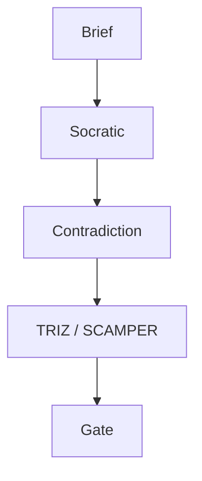

# E9x — Documentation and Maintenance Guide

| 項目 | 內容 |
|------|------|
| **文件版本** | v1.0 |
| **最後更新** | 2026-04-15 |
| **狀態** | Draft |
| **擁有者** | Tech Writer / 技術負責人 TBD by 2026-Q3 TBD |

> 本指南將 VibeCoding 模板 `15_documentation_and_maintenance_guide.md` 對應至 RD Design Copilot 專案的 5D 文件體系（DISCOVER → DELIVER）。

---

## 🎯 Purpose

為 RD Design Copilot 專案提供文件撰寫、維護、版本管理的統一規範，確保：
- 5D 架構（`docs/00-discover` → `docs/04-deliver`）內部一致
- ADR 與 E 系列文件交叉引用正確
- 面向開發者、使用者、利害關係人的三條閱讀路徑（見 `docs/README.md` Reading Paths A/B/C/D）皆可用

---

## 📖 Documentation Types

### 1. API Documentation
- **OpenAPI (FastAPI 自動產生)**：後端 `/docs` 端點，16 個 AI endpoint 自動文件（ADR-004）
- **Endpoint 說明**：request/response Pydantic schema 在 `backend/app/models/schemas.py`
- **Authentication**：Supabase JWT bearer（ADR-001）
- **Rate Limiting**：目前依 Anthropic 上游；專案層 TBD by 2026-Q2 TBD
- **Error Codes**：Pydantic validation error + FastAPI HTTPException

OpenAPI 文件由 FastAPI runtime 自動產出，不再手寫 `openapi.yaml`。

### 2. Technical Architecture Documentation
- **E1 Brief & PRD**：[`docs/00-discover/E1--project-brief-and-prd.md`](../00-discover/E1--project-brief-and-prd.md)
- **E2 SOW + ADRs**：[`docs/01-define/E2--statement-of-work.md`](../01-define/E2--statement-of-work.md) + [`adrs/`](../01-define/adrs/)
- **E3 Architecture & Design**：[`docs/01-define/E3--architecture-and-design.md`](../01-define/E3--architecture-and-design.md)
- **E5 System Design Overview**：[`docs/02-design/E5--system-design-overview.md`](../02-design/E5--system-design-overview.md)
- **ERD / Diagrams**：`docs/01-define/diagrams/`（E4 TBD）

### 3. User Documentation
- **使用者手冊**：[`E9x--user-manual-v0.1.md`](E9x--user-manual-v0.1.md)（v0.1，持續演進）
- **Getting Started / Tutorials**：尚未獨立成篇 — TBD by 2026-Q3 TBD

### 4. Developer Documentation
- **Setup**：`README.md`（專案根）+ `backend/pyproject.toml` + `package.json`
- **Code Review / Style**：[`GR6x Code Review Guide`](../03-develop/GR6x--code-review-guide.md)
- **Contributing**：TBD — Tech Writer TBD by 2026-Q3 TBD
- **Troubleshooting**：分散於 `docs/04-deliver/operations/*.md`

---

## 📚 本專案文檔清單 (Documentation Inventory)

> 由 `docs/**/*.md` 掃描於 2026-04-15 產出。`_superseded/` 與 `_meeting-minutes/` 內容略。Owner 為 TBD 者皆 `TBD — <owner TBD> by 2026-Q3 TBD`。

### Hub & MOC

| 路徑 | 類型 | Owner | 上次審查 |
|------|------|-------|----------|
| `docs/README.md` | Hub / Reading Paths | Tech Lead | 2026-04-15 |
| `docs/00-discover/_MOC.md` | MOC | Product TBD | 2026-04-15 |
| `docs/01-define/_MOC.md` | MOC | Tech Lead | 2026-04-15 |
| `docs/02-design/_MOC.md` | MOC | Tech Lead | 2026-04-15 |
| `docs/03-develop/_MOC.md` | MOC | Tech Lead | 2026-04-15 |
| `docs/04-deliver/_MOC.md` | MOC | DevOps TBD | 2026-04-15 |
| `docs/_domain-knowledge/DK-00--index.md` | MOC | Tech Lead | 2026-04-21 |

### 00-discover

| 路徑 | 類型 | Owner | 上次審查 |
|------|------|-------|----------|
| `docs/00-discover/E1--project-brief-and-prd.md` | Essential | Product | 2026-04-15 |
| `docs/00-discover/E1x--stakeholder-brief.md` | Supplement | Product TBD | 2026-04-15 |
| `docs/00-discover/E1x--user-research-synthesis.md` | Supplement | Product TBD | 2026-04-15 |
| `docs/00-discover/E1x--competitive-landscape.md` | Supplement | Product TBD | 2026-04-15 |
| `docs/00-discover/E1x--market-sizing.md` | Supplement | Product TBD | 2026-04-15 |
| `docs/00-discover/E1x--user-journey-map.md` | Supplement | UX TBD | 2026-04-15 |
| `docs/00-discover/E1x--privacy-compliance-seed.md` | Supplement | Legal TBD | 2026-04-15 |
| `docs/00-discover/E1x--assumption-risk-register.md` | Supplement | Tech Lead | 2026-04-15 |
| `docs/00-discover/E3x--first-principles-analysis.md` | Supplement | Tech Lead | 2026-04-15 |

### 01-define

| 路徑 | 類型 | Owner | 上次審查 |
|------|------|-------|----------|
| `docs/01-define/E2--statement-of-work.md` | Essential | Tech Lead | 2026-04-15 |
| `docs/01-define/E3--architecture-and-design.md` | Essential | Tech Lead | 2026-04-15 |
| `docs/01-define/E3--wbs-development-plan.md` | WBS Primary | Tech Lead | 2026-04-21 |
| `docs/01-define/wbs-workstreams/README.md` | WBS Index | Tech Lead | 2026-04-21 |
| `docs/01-define/E3--system-interaction-flow.md` | Flow | Backend | 2026-04-15 |
| `docs/01-define/adrs/ADR-001-baas-first-architecture.md` | ADR | Tech Lead | 2026-04-15 |
| `docs/01-define/adrs/ADR-002-server-side-business-logic.md` | ADR | Tech Lead | 2026-04-15 |
| `docs/01-define/adrs/ADR-003-llm-service-hardening.md` | ADR | Backend | 2026-04-15 |
| `docs/01-define/adrs/ADR-004-qa-devops-infrastructure.md` | ADR | DevOps TBD | 2026-04-15 |
| `docs/01-define/adrs/ADR-005-scope-expansion.md` | ADR | Tech Lead | 2026-04-15 |
| `docs/01-define/wbs-workstreams/WS-D--triz-layered-drilldown-development.md` | WBS | Feature Owner | 2026-04-15 |
| `docs/01-define/wbs-workstreams/WS-E--subsystem-interface-development.md` | WBS | Feature Owner | 2026-04-15 |
| `docs/01-define/wbs-workstreams/WS-F--tc-to-multipc-decomposition.md` | WBS | Feature Owner | 2026-04-15 |
| `docs/01-define/wbs-workstreams/WS-G--l3-sf-parallel-check.md` | WBS | Feature Owner | 2026-04-15 |
| `docs/01-define/wbs-workstreams/WS-H--playwright-e2e-followup.md` | WBS | QA TBD | 2026-04-15 |

### 02-design

| 路徑 | 類型 | Owner | 上次審查 |
|------|------|-------|----------|
| `docs/02-design/E5--api-design-specification.md` | Essential | Backend | 2026-04-15 |
| `docs/02-design/E5x--system-design-overview.md` | Supplement | Tech Lead | 2026-04-15 |
| `docs/02-design/E5x--bdd-scenarios.md` | Supplement | QA TBD | 2026-04-15 |
| `docs/02-design/E5x--project-structure-guide.md` | Supplement | Tech Lead | 2026-04-15 |
| `docs/02-design/E5x--frontend-architecture.md` | Supplement | Frontend | 2026-04-15 |
| `docs/02-design/E5x--frontend-information-architecture.md` | Supplement | Frontend | 2026-04-15 |
| `docs/02-design/E6x--schema-codegen-workflow.md` | Supplement | Backend | 2026-04-15 |
| `docs/02-design/E7x--e2e-manual-scripts/explore_pc_decomposition.md` | Supplement | QA TBD | 2026-04-15 |
| `docs/02-design/specs/E5x--file-dependencies.md` | Spec | Tech Lead | 2026-04-15 |
| `docs/02-design/specs/E5x--class-relationships.md` | Spec | Tech Lead | 2026-04-15 |
| `docs/02-design/specs/modules/E5x--module-spec-index.md` | Spec | Tech Lead | 2026-04-15 |
| `docs/02-design/specs/modules/triz-solver.md` | Spec | Backend | 2026-04-15 |
| `docs/02-design/specs/modules/anti-anchor.md` | Spec | Backend | 2026-04-15 |
| `docs/02-design/specs/modules/subsystem-decomposer.md` | Spec | Backend | 2026-04-15 |
| `docs/02-design/specs/explore/E5x--subsystem-persistence-policy.md` | Spec | Backend | 2026-04-15 |
| `docs/02-design/specs/explore/E5x--tc-to-multipc-type-alignment.md` | Spec | Backend | 2026-04-15 |
| `docs/02-design/specs/explore/E5x--three-tier-tree-review-checklist.md` | Spec | Tech Lead | 2026-04-15 |
| `docs/02-design/specs/triz/E5x--triz-layered-drilldown-optimization.md` | Spec | Backend | 2026-04-15 |
| `docs/02-design/specs/triz/E5x--triz-multi-solution-adoption-strategy.md` | Spec | Backend | 2026-04-15 |
| `docs/02-design/specs/ux/E5x--create-ux-spec.md` | Spec | UX TBD | 2026-04-15 |
| `docs/02-design/specs/review-templates/E5x--pre-cad-review-template.md` | Template | Tech Lead | 2026-04-15 |
| `docs/02-design/specs/review-templates/E5x--must-rulebook-template.md` | Template | Tech Lead | 2026-04-15 |
| `docs/02-design/specs/review-templates/E5x--evidence-matrix-risk-register-template.md` | Template | Tech Lead | 2026-04-15 |

### 03-develop

| 路徑 | 類型 | Owner | 上次審查 |
|------|------|-------|----------|
| `docs/03-develop/GR6x--code-review-guide.md` | Gate Review | Tech Lead | 2026-04-15 |

### 04-deliver

| 路徑 | 類型 | Owner | 上次審查 |
|------|------|-------|----------|
| `docs/04-deliver/E8--security-and-readiness-checklists.md` | Essential | Security Lead TBD | 2026-04-15 |
| `docs/04-deliver/E9--deployment-and-operations-guide.md` | Essential | DevOps TBD | 2026-04-15 |
| `docs/04-deliver/E9x--documentation-maintenance-guide.md` | Essential | Tech Writer TBD | 2026-04-15 |
| `docs/04-deliver/E9x--user-manual-v0.1.md` | User Doc | Product / Tech Writer TBD | 2026-04-15 |
| `docs/04-deliver/operations/TRIZ_Layered_Rollout_Runbook.md` | Runbook | TRIZ Feature Team | 2026-04-15 |
| `docs/04-deliver/operations/runbook_pc_decomposition.md` | Runbook | Backend Lead | 2026-04-15 |

### _domain-knowledge

| 路徑 | 類型 | Owner | 上次審查 |
|------|------|-------|----------|
| `docs/_domain-knowledge/DK-01--design-philosophy-and-process.md` | Methodology | Tech Lead | 2026-04-21 |
| `docs/_domain-knowledge/DK-02--triz-scamper-divergence-engine.md` | Methodology | Tech Lead | 2026-04-21 |
| `docs/_domain-knowledge/DK-03--kt-decision-framework.md` | Methodology | Tech Lead | 2026-04-21 |
| `docs/_domain-knowledge/DK-04--data-model-and-gate-reference.md` | Methodology | Tech Lead | 2026-04-21 |
| `docs/01-define/VC00--workflow-manual.md` | Process | Tech Lead | 2026-04-15 |
| `docs/01-define/VC01--development-workflow-cookbook.md` | Process | Tech Lead | 2026-04-15 |
| `docs/02-design/specs/E5x--system-spec.md` | Spec | Tech Lead | 2026-04-15 |

**總計**：約 60+ 份（不計 `_superseded/`）。Ownership 盤點 TBD — Tech Writer TBD by 2026-Q3 TBD。

---

## 📝 Documentation Standards

### Writing Guidelines

#### 1. Structure and Organization
- 每份文件開頭 metadata 表：文件版本 / 最後更新 / 狀態 / 擁有者
- H1 為文件主標題（對應檔名），H2 分章節
- 內文使用繁體中文（面向內部）；專有名詞保留英文（TRIZ, SCAMPER, Supabase, RLS）

#### 2. Content Guidelines
- **Be Concise**：E1 / E2 已壓縮至 PRD / SOW 核心；避免重複
- **Evidence-based**：未知處使用 `TBD — <owner TBD> by <YYYY-MM-DD TBD>`，不杜撰
- **Update Regularly**：每次 PR 檢查相關 _MOC.md
- **Version Everything**：metadata 的「文件版本」為手動維護；git 為真實來源

#### 3. Visual Elements
- 架構圖：Mermaid（優先）或 draw.io（若複雜）
- Screenshot：放 `docs/<phase>/images/` 並相對連結

### Documentation as Code

#### Version Control

本專案文件結構（5D）：

```
docs/
├── README.md                    # Hub：TR Gate View + Reading Paths
├── 00-discover/                 # WHY — E1, E1x（journey, privacy, risk...）
├── 01-define/                   # HOW — E2 SOW, E3 Architecture, ADRs
├── 02-design/                   # WHAT TO BUILD — E5, E6x, E7x
├── 03-develop/                  # DOES CODE WORK — GR6x, migrations
├── 04-deliver/                  # SHIP & OPERATE — E8, E9, E9x, operations
├── _domain-knowledge/           # DK-01~04 MECE 方法論知識庫
├── _gap-analysis/
├── _meeting-minutes/
└── _superseded/
```

每個 Phase 資料夾含 `_MOC.md`（Map of Content）作為入口。

#### Automated Generation
- FastAPI `/docs` 自動產生 OpenAPI UI
- GitHub Pages / MkDocs 靜態站 — TBD by 2026-Q4 TBD

---

## 🔄 Documentation Maintenance

### Regular Maintenance Tasks

#### Monthly Reviews
- [ ] 檢查所有文件 metadata 的「最後更新」是否過時（>3 個月 flag）
- [ ] 更新 `docs/README.md` 的 TR Gate 進度標記（`*` / `~` / `.`）
- [ ] 檢查外部連結有效性（Anthropic / Supabase / GitHub）
- [ ] 回應 PR review 中的 documentation 標註

#### Quarterly Updates
- [ ] 審視 ADR 是否仍然反映實況；不符則寫新 ADR supersede
- [ ] 更新架構圖（E3 / E5）
- [ ] Refresh 使用者手冊（E9x user manual）
- [ ] 檢視 _gap-analysis/ 的待辦項
- [ ] 分析文件使用度（若已上 GitHub Pages / 類似平台）

### Documentation Metrics

本專案以「**可重複量測且低成本**」為原則，選 5 個具體指標：

| # | 指標 | 目標 | 蒐集方式 | 頻率 | Owner |
|:-:|------|------|----------|------|-------|
| M1 | **Broken link 數** | 每季 = 0 | `markdown-link-check docs/**/*.md`（可寫入 CI）；v1.0 手動執行 | 每季 | Tech Writer TBD by 2026-Q3 TBD |
| M2 | **文件過期率** | >3 個月未更新文件占比 < 20% | 腳本掃 metadata「最後更新」欄位 vs `git log -1 --format=%cd` 比對 | 每季 | Tech Writer TBD by 2026-Q3 TBD |
| M3 | **MOC 覆蓋率** | 所有 `.md` 皆被某 `_MOC.md` 連到（孤島 = 0） | `grep` 比對 glob 清單 vs MOC 內連結 | 每季 | Tech Writer TBD by 2026-Q3 TBD |
| M4 | **ADR 補完率** | 每個 architectural decision 有 ADR 或 supersede 紀錄 | code review 時交叉核對；季度 retrospective | 每季 | Tech Lead |
| M5 | **頁面瀏覽量 / 搜尋關鍵字**（v1.1） | 建立 baseline 後定目標 | GitHub Pages + Plausible / GA4（匿名） | 月 | Tech Writer TBD by 2026-Q4 TBD |

v1.0 先落地 M1-M4（皆可從 repo 量測，無須外部平台）；M5 於 MkDocs 上線後啟動。

---

## 🛠️ Tools and Platforms

### 本專案採用

| 工具 | 用途 | 備註 |
|------|------|------|
| **Git + Markdown** | 所有文件（docs/**/*.md） | 主要真實來源 |
| **FastAPI /docs** | API 互動文件 | 自動產生 |
| **Mermaid** | 架構圖 / 流程圖 | 內嵌於 `.md` |
| **ADR（Markdown）** | 決策紀錄 | `docs/01-define/adrs/ADR-*.md` |
| **_MOC.md** | 各資料夾入口 | 對齊 Zettelkasten 風格 |

### 工具選型比較（v1.1 決策）

針對「是否加一層靜態文件站？」的決策，依本專案 **BaaS-First + 少量 engineer（<10 人）** 情境比較：

| 工具 | 授權 / 託管 | 學習成本 | 與 Git 整合 | 適合情境 | 本專案評估 |
|------|-------------|----------|-------------|----------|------------|
| **純 Git + Markdown + _MOC.md（現況）** | Free / self | 低 | 原生 | 小型團隊、engineer-centric | ✅ v1.0 採用；MOC 可手動維護 |
| **MkDocs + Material theme** | Apache-2.0 / self-host（GitHub Pages） | 低（YAML 配置） | 一鍵 build → Pages | engineer 友善、搜尋 / 導航好 | 🟢 **推薦 v1.1 目標** |
| **Docusaurus** | MIT / self-host | 中（React-based） | GitHub Actions | 多版本文件、多語系 | 🟡 過度 — 無多版本需求 |
| **GitBook** | SaaS（Free tier 受限）/ 付費 | 極低（WYSIWYG） | Git sync 但非核心 | 非技術貢獻者為主 | 🟡 SaaS 成本 + 非 engineer-centric |
| **Confluence** | 付費 SaaS | 中 | 差（export-based） | 企業客戶對接 | 🔴 Git 脫鉤、成本高 |

**決策建議**（v1.1）：

1. **保留**純 Git + Markdown + `_MOC.md` 作為真實來源（source of truth）。
2. **新增** MkDocs-Material 作為靜態站產出器：`mkdocs.yml` 指向 `docs/`，CI 自動 build 並 deploy 至 GitHub Pages。
3. 不改變 engineer workflow（仍在 repo 內編輯 `.md`），外部讀者獲得搜尋 / 導航。
4. Owner：Tech Writer TBD by 2026-Q4 TBD。

### Diagram Tools

**Mermaid（優先）** — 內嵌範例：



**draw.io** — 複雜架構圖存於 `docs/01-define/diagrams/`。

---

## 📋 Documentation Templates

### README Template（專案根 README.md）

範例見專案根 `README.md`。每份子模組若需 README，採：

```markdown
# Module Name

## Description
一段話描述目的。

## Installation / Setup
安裝或啟動步驟。

## Usage
典型使用方式。

## Reference
連結至 `docs/` 內相關 E / ADR 文件。
```

### CHANGELOG Template

目前無集中 `CHANGELOG.md`。變更經由 git commit history 追蹤（commits 遵循 conventional commits 風格：`feat:`, `fix:`, `docs:`, `refactor:`）。

集中化 CHANGELOG — TBD by 2026-Q3 TBD。

### ADR Template
見 [`docs/01-define/adrs/ADR-001-baas-first-architecture.md`](../01-define/adrs/ADR-001-baas-first-architecture.md) 作為參考格式：Status / Date / Deciders / Context / Decision / Consequences / Related。

---

## 🎯 Best Practices

### Documentation Strategy（本專案紀律）

1. **Start Early**：E1 Brief 先於 code；ADR 與實作同時提交
2. **Keep It Updated**：每個 PR 檢查 `_MOC.md` 與 `README.md` 是否需同步
3. **Make It Searchable**：善用 H1/H2 hierarchy；關鍵字置於標題
4. **Get Feedback**：在 _meeting-minutes/ 記錄討論；ADR 可被 supersede
5. **Measure Success**：TR Gate 進度（0-10）為交付里程碑

### Team Practices
- **Documentation Reviews**：code review 同時 review 相關文件變更（見 GR6x）
- **Shared Responsibility**：每位 engineer 皆為 doc owner
- **Templates**：5D metadata 表 + ADR 格式一致
- **Continuous Improvement**：每季 retrospective 檢討文件流程

---

## 附錄 — 文件治理責任矩陣（RACI 摘要）

| 文件類型 | Responsible | Accountable | Consulted | Informed |
|----------|-------------|-------------|-----------|----------|
| E1 Brief / PRD | Product | Tech Lead | RD / Legal | All |
| E2 SOW / ADR | Tech Lead | Tech Lead | RD | All |
| E3 / E5 Architecture | Tech Lead | Tech Lead | Backend / Frontend | All |
| GR6x Code Review | Tech Lead | Tech Lead | RD | All |
| E8 Security | Security Lead TBD | Tech Lead | Legal | All |
| E9 Deployment | DevOps TBD | Tech Lead | Backend | All |
| E9x User Manual | Tech Writer TBD | Product | RD / Support | Customers |
| Operations Runbook | On-call / Feature Owner | Tech Lead | DevOps | All |

Owner 欄位中 TBD 皆 by 2026-Q3 TBD。

---

**Remember**：好文件是對專案未來的投資。本專案以 5D + ADR + _MOC 三層結構確保可追溯性。
