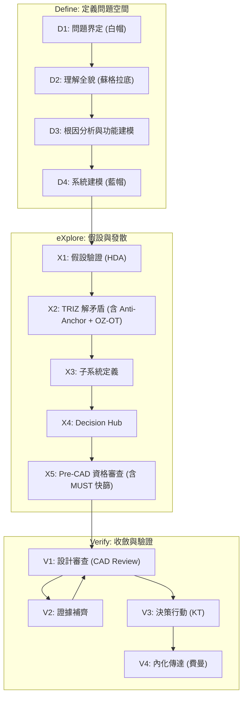

# RD Design Copilot 設計哲學與流程

> **v2.0 — D/X/V 步驟編號體系**
> 自本版起，流程步驟改用三區段編號：**D** (Define)、**X** (eXplore)、**V** (Verify)。
> 舊 Step 1-8 對照：D1-D4 / X1-X5 / V1-V4。

**一句話 insight**：在「什麼都還不確定」的早期，AI 最可行的用法是把混沌變成「可追蹤的假設 + 可比較的方案集合 + 可驗證的最小實驗」，用流程逼出**最不怕未知**的設計，而不是用模型假裝自己算得很準。

**代碼對齊**：`backend/app/agents/analyst.py` · `backend/app/routers/brief.py`, `socratic.py`, `cld.py`, `contradictions.py`, `assumptions.py`, `gates.py`, `action.py`, `exports.py` · `src/types/explore.ts`, `create.ts`

---

## 核心哲學

```
混沌 → 結構 → 證據 → 決策 → 資產
      ↑              ↓
   TRIZ            Robust篩選
   (擴大可能性)    (殺掉脆弱)
```

**四個不變原則**：

1. **先把未知寫下來**（假設台帳）
2. **先留多條路**（Set-Based + TRIZ 變體）
3. **先切斷連鎖死法**（失效路徑 + 最小實驗）
4. **產出與選擇分離**（TRIZ/Anti-Anchor 負責產出，選擇統一在決策中心由 RD 執行）

---

## AI 可行性邊界

### 高可行（AI 擅長）

- **需求與限制的「審訊」**：把模糊想法變成可檢查的硬/軟約束
- **設計空間的「集合式探索」**：產出多條架構路線 (Set-Based)
- **失效路徑與風險排序 (FFIP/FMEA)**：先找怎麼死、怎麼連鎖
- **假設台帳與證據鏈 (Assumption Ledger)**：每個結論都能追溯
- **最小實驗設計 (MVP Experiments)**：用最少試做換最大資訊量

### 低可行（必須誠實設限）

- 精準噪音分貝、壽命、共振頻率、熱阻數值等「可簽名的工程數字」
- 「最優解」的唯一答案（目標函數、約束、未知集合都未定型）

> AI 的策略定位：**結構化推理 + 風險治理 + 迭代設計**，不是「變更強」。

---

## 雙層狀態機

- **上層：流程狀態機** (D1~V4) — 描述團隊活動的推進
- **下層：工件狀態機** — 描述每個設計工件的生命週期
  - Draft → Reviewed → Verified (with Evidence) → Baseline → Released

## 數位線索 (Digital Thread)

所有設計工件及其相關數據、版本、證據都被系統性連結，確保可追溯、可驗證。

## 7 個核心工件

| # | 工件 | 說明 |
|---|------|------|
| 1 | **Constraint** | 需求、硬限制、軟目標、非目標 |
| 2 | **Contradiction** | TC/PC/SF、改善/惡化參數、物理矛盾、Su-Field |
| 3 | **FunctionModel** | 物質-場模型：S1, S2, F, 交互作用類型 |
| 4 | **Breakpoint** | 斷路點：介入位置、可操作參數 |
| 5 | **Concept Route** | 架構路線：機制、介面契約、BOM、風險、Validation Passport |
| 6 | **Evidence** | 仿真報告、計算書、測試報告、供應商回覆 |
| 7 | **Risk** | 風險登錄 (FMEA-like)：失效模式、機率、嚴重度、緩解 |

---

## 知識增強層

Copilot 在各階段透過兩條知識通道自動注入佐證：

| 通道 | 內容 |
|------|------|
| **企業知識庫 (RAG)** | 歷史失效案例、過往設計決策、內部規範/SOP、測試報告、FMEA/8D |
| **網路文獻搜尋 (Web)** | 學術論文/專利、產業標準/法規、競品分析、材料/製程資料庫 |

### 知識引用格式

```yaml
RAG來源:
  引用ID: "KB-{領域}-{序號}"     # e.g., KB-FMEA-042
  來源文件: "{文件名稱}"
  相關性: "High / Medium / Low"
  摘要: "{引用內容}"

Web來源:
  引用ID: "WEB-{類型}-{序號}"    # e.g., WEB-PAT-003
  URL: "{來源網址}"
  類型: "論文 / 專利 / 標準 / 白皮書"
  相關性: "High / Medium / Low"
  摘要: "{引用內容}"
```

---

## E2E 流程對齊：PPT 與 Copilot 語言 Mapping

| 高階流程 (PPT/NPI) | Copilot Phase |
|-------------------|---------------|
| 設計發想 (Design Ideation) | Define & eXplore |
| CAD / 模擬驗證 | eXplore & Verify (Evidence Closure) |
| 打樣 / 測試驗證 | Verify (Evidence Closure) |
| 設計審查 (Design Review) | Verify (V1 & V3) |
| NPI | Verify (Decision & Assetization) |

---

## Phase & Gate 結構

| Gate | 位置 | 類型 | Phase 轉換 |
|------|------|------|-----------|
| Gate D1 | D1 完成 | 內部 | DRAFT → DEFINE |
| Gate D2 | D2 完成 | 內部 | Define 內部 |
| Gate D3 | D3 完成 | 內部 | Define 內部 |
| Gate D4 | D4 完成 | 內部 | DEFINE → EXPLORE |
| Gate X1 | X1 完成 | 內部 | eXplore 內部 |
| Gate X2 | X2 完成 | 內部 | eXplore 內部 |
| Gate X3 | X3 完成 | 內部 | eXplore 內部 |
| Gate X4 | X4 完成 | 內部 | eXplore 內部 |
| **Gate X5** | X5 完成 | Pre-CAD Gate | EXPLORE → VERIFY |
| Gate V1 | V1 審查中 | 內部 | 觸發 V2 證據補齊 |
| **Gate C** | V1 完成 | CAD Gate | Verify 內部 (→ KT 決策) |
| Gate V3 | V3 完成 | 內部 | Verify 內部 |
| Gate V4 | V4 完成 | 內部 | VERIFY → COMPLETED |

---

## 證據品質定義 (E0-E4)

| 等級 | 說明 |
|------|------|
| **E0** | 只有推論 (Only inference) |
| **E1** | 有計算/估算 (Calculation available) |
| **E2** | 有仿真或 Bench Test |
| **E3** | 有實測 (接近真實情境) |
| **E4** | 量產條件下證據 |

---

## D1-V4 流程總覽



---

## D1: 問題界定 (白帽 + 5W1H)

**目的**：把模糊需求變成「可檢查句」。
**核心工件**：Constraint (Draft)

### 輸入
- 客戶/PM 需求描述、過往類似案例
- 空間/成本/製程約束
- 用戶上傳的多模態素材（PDF/圖片/Excel/規格書）
- [RAG] 過往類似案約束、歷史 KPI | [Web] 產業基準、法規

### AI 協助任務
- 將需求改寫成約束句
- 生成缺口問卷
- 列出已知事實 vs 未知缺口
- 從上傳素材中自動提取約束、假設、歷史數據

### 產出格式

- **任務句 (Mission)**：在【情境】下，系統必須【達成行為】，且【三指標】不得超標
- **硬限制 (Hard constraints)**：一定要滿足
- **軟目標 (Soft objectives)**：可 trade-off
- **非目標 (Non-goals)**：這版先不追求

### Gate D1 檢查點
> ✅ 「三個最不能失敗的指標」被明確說出，每個有判斷方式。
> ✅ 核心工件 Constraint 狀態: Draft。

---

## D2: 理解全貌 (蘇格拉底問答)

**目的**：把「大家以為理所當然」的前提逐一翻出來。
**核心工件**：Contradiction (Draft), Assumption (Draft)

### 蘇格拉底六類提問

1. **澄清**：你說的「小空間」是體積還是外形約束？
2. **假設**：你假設熱可以靠外殼散掉，證據是什麼？
3. **證據**：過去類似產品在相同功率下的溫升記錄？
4. **觀點**：若把控制器外置，誰會反對？原因？
5. **後果**：若 NVH 超標，最壞代價是什麼？
6. **反思**：我們現在最可能「自欺欺人」的是哪一條？

### Gate D2 檢查點
> ✅ 至少列出 10 條關鍵假設，標出 Top 3「錯了就翻車」。
> ✅ 至少識別 3 條核心矛盾。
> ✅ 核心工件 Contradiction, Assumption 狀態: Draft → Reviewed。

---

## D3: 根因分析與功能建模

**目的**：從症狀深挖根因，建構 Function Model (FA+SF)，完成矛盾正式化。
**核心工件**：FunctionModel (Draft → Reviewed), Contradiction (Reviewed)

> 舊 Step 2b (根因分析) 與 Step 2c (FA) 合併為 D3。

### 根因分析
- 5Why / KT Is-IsNot / CECA
- 識別可操作的因果節點

### Function Analysis (FA) + Su-Field
- 建構物質-場模型，識別 Su-Field 交互
- 規則引擎分類矛盾類型（TC/PC/SF）

> TRIZ 矛盾正式化與分類的完整規範：見 DK-02。

### Gate D3 檢查點
> ✅ 根因分析完成，因果節點已識別。
> ✅ Function Model 已建構，Su-Field 交互已識別。
> ✅ 核心工件 FunctionModel: Draft → Reviewed; Contradiction: Draft → Reviewed。

---

## D4: 系統建模 (因果迴路 + TRIZ 正式化)

**目的**：找到耦合點（未知會放大的地方），將矛盾正式化為 TRIZ 句式，完成矛盾類型分類（TC/PC/SF）。
**核心工件**：Contradiction (Verified), FunctionModel (Reviewed), Breakpoint (Draft)

### 因果迴路圖
- 識別正回饋迴路（越來越糟）
- 識別斷路點（design levers）

### 矛盾分類
- 規則引擎分類矛盾類型（TC/PC/SF）——決定 X2 解法路徑

> TRIZ 矛盾正式化與分類的完整規範：見 DK-02。

### Gate D4 檢查點
> ✅ 明確點名 3 個斷路點，每個有 TRIZ 原理提示。
> ✅ 每條矛盾有 TRIZ 正式句，標註類型（TC/PC/SF）與解法路徑。
> ✅ Function Model 已建構，Su-Field 交互已識別。
> ✅ 核心工件 Contradiction: Reviewed → Verified; FunctionModel: Draft → Reviewed; Breakpoint: Draft → Reviewed。

---

## X1: 假設與驗證規劃 (HDA)

**目的**：把未知集合寫出來，對致命假設設計最小驗證。
**核心工件**：Assumption (Verified)

### 假設台帳 (6 欄)

| 假設編號 | 假設內容 | 依據來源 (Artifact ID) | 若錯了最壞後果 | 最小驗證方法 | 驗證成本/週期 |
|---------|---------|---------------------|--------------|------------|------------|
| A001 | ... | Data-HT001 | ... | ... | 1週/$500 |

### 未知集合 (U) — 區間＋等級即可

```yaml
未知因子:
  u1_負載變化: [低, 中, 高]
  u2_環境溫度: [常溫, 高溫]
  u3_裝配偏心: [小, 中, 大]
```

### Gate X1 檢查點
> ✅ Top 3 假設每個都有「可在 1-2 週內完成」的驗證設計。
> ✅ 核心工件 Assumption: Reviewed → Verified。

---

## X2: TRIZ 解矛盾 (含 Anti-Anchor 並行 + OZ-OT)

**目的**：用 TRIZ 解矛盾找方向，產出結構化可審查的方案集合。（~~SCAMPER 已於 v9 移除 — 其 7 動作為 TRIZ 40 原理子集~~）
**核心工件**：Concept Route (Draft → Reviewed), Interface (Draft)

> 舊 Step 5-0 (Anti-Anchor) 與 Step 5a-0 (OZ-OT) 合併入 X2。

### 流程
1. (X2.1) **Anti-Anchor Sprint** → 產出 3 種非典型架構
2. (X2.2) **TRIZ 解矛盾** → 依矛盾類型分派 (TC→矩陣 / PC→分離 / SF→76標準解)
3. (X2.3) **OZ-OT 提取** → 從 TRIZ 原理具體化操作區/操作時間
4. (X2.4) **候選池匯聚** → 所有來源概念統一進入候選池

> TRIZ 執行細節與候選池管理：見 DK-02。

### Gate X2 檢查點
> ✅ 至少保留 3 條架構級路線（含至少 1 條 Anti-Anchor）。
> ✅ 每條有完整方案規格（機制、假設、風險、最小驗證）。
> ✅ 每條產出初步 Interface Contract。
> ✅ 核心工件 Concept Route: Draft → Reviewed。

---

## X3: 子系統定義

**目的**：定義子系統邊界，建立 3 層階層 + 6 維介面契約。
**核心工件**：Interface (Draft → Reviewed)

### Gate X3 檢查點
> ✅ 子系統邊界明確，介面契約完整。

---

## X4: Decision Hub

**目的**：候選池匯聚 + RD 審核，決策中心統一評選。
**核心工件**：Concept Route (Reviewed)

### Gate X4 檢查點
> ✅ 所有候選方案已進入決策中心並完成初步評選。

---

## X5: Pre-CAD 資格審查

**目的**：在投入 CAD 前，用「可驗證的最小資訊」確認探索完整度並收斂至存活路線。含 P1 auto-screen（MUST 快篩 Go/No-Go + 探索完整度）。
**核心工件**：Concept Route (Verified), Pre-CAD Review Report (Draft → Reviewed)

> 舊 Step 5e (MUST 快篩) 合併入 X5 作為 P1 auto-screen。

### 審查維度
1. MUST (硬限制) 可行性 — P1 auto-screen
2. 解耦程度 (Decoupling)
3. 可驗證性 (Testability)
4. 主要風險機制 (Failure Mechanism)
5. 最小 CAD 工作量 (MVP CAD Effort)

> MUST 快篩的完整 KT 框架背景：見 DK-03。

### Pre-CAD Confidence Score
```
Confidence = 已收斂的 (Fatal + Major) / 總 (Fatal + Major) × 100%
```
Gate X5 門檻：100%（所有 Fatal + Major 矛盾完全收斂）。

### Gate X5 檢查點
> ✅ 探索完整度通過（TRIZ 三路徑 + AA Sprint 皆執行）+ ≥1 條存活。
> ✅ 每條 Interface Contract 已更新。
> ✅ 每條明確了 MVP CAD 的最小幾何範圍。
> ✅ 核心工件 Concept Route: Reviewed → Verified。

---

## V1: 設計審查 (CAD Gate - MVP CAD Review)

**目的**：針對通過 Gate X5 的方案，進行 MVP CAD 初步審查，識別設計缺陷，將「證據缺口」轉化為最小實驗。
**核心工件**：Evidence Matrix (Draft → Verified), Risk (Draft → Reviewed), MVP CAD Model

### Evidence Matrix (DR EM)

| 類別 | 要求/規格 | 目前證據 (Artifact ID) | 證據品質 (E0-E4) | 缺口 | 下一步最小實驗 | Owner | Due |
|------|---------|---------------------|----------------|------|-------------|-------|-----|

### 歷史失效案例比對 (3 層)
1. 同產品/同平台
2. 同模組 (齒輪/軸承/油封/感測器)
3. 同機制 (磨耗、污染、疲勞、共振、熱衰退)

### Gate C 檢查點
> ✅ 北極星指標證據等級 ≥ E2。
> ✅ Top 10 風險都對應「證據缺口」與「最小實驗」。
> ✅ 核心工件 Evidence Matrix: Reviewed → Verified。

---

## V2: 證據補齊 (Evidence Closure)

**目的**：針對 V1 發現的證據缺口，執行最小實驗/仿真/供應商確認，提升證據等級至 Gate V3 要求。

- **觸發**：發現「可在 1-2 週內補足」的證據缺口
- **活動**：最小實驗、快速仿真、供應商數據收集
- **迴圈**：完成後返回 V1 重新審查 Evidence Matrix

---

## V3: 決策與行動 (KT Decision Analysis)

**目的**：用 KT 結構化決策選出「最不怕未知」的設計。
**核心工件**：Decision Record (Draft → Reviewed), Concept Route (Verified → Baselined)

### 流程
1. MUST 篩選（已在 X5 P1 auto-screen 執行）
2. WANT 評分（權重 × 滿足程度，基於證據）
3. Adverse Consequences（風險調整）
4. 決策記錄 + 行動計畫

> KT 決策分析完整框架（MUST/WANT/AC 定義、7 大 WANT 條件、權重設定、風險矩陣）：見 DK-03。

### 行動計畫 (三階段)

| Phase | 週期 | 目標 |
|-------|------|------|
| Phase 1 | Week 1-2 | 把混沌變結構（需求模板、問題樹、假設台帳、方案集合 v0） |
| Phase 2 | Week 3-6 | 把結構變證據（完成實驗、KT 決策、方案縮至 1-2 條） |
| Phase 3 | Week 7-8 | 把證據變資產（約束庫/失效路徑庫沉澱、playbook 形成） |

### Gate V3 檢查點
> ✅ 所有方案都經過 MUST 篩選。
> ✅ 每個 WANT 評分都有證據 (Artifact ID) 支撐（不可為 E0）。
> ✅ 所有 H 風險都有緩解措施（證據等級 ≥ E1）。
> ✅ KT 決策記錄完整且已簽核。
> ✅ 核心工件 Concept Route: Verified → Baselined。

---

## V4: 內化與傳達 (費曼)

**目的**：知識回寫 + 對齊團隊。
**核心工件**：Knowledge Assets (Released), Decision Record (Released)

### 知識回寫 (Knowledge Writeback)

| 回寫內容 | 知識庫分類 | 用途 |
|---------|-----------|------|
| Decision Record | 決策紀錄庫 | 未來類似專案參考 |
| 被推翻的假設 | Lessons Learned | 避免重複犯錯 |
| Evidence Matrix | 證據範本庫 | 加速審查 |
| Risk Register + 緩解 | FMEA/風險庫 | 歷史失效比對 |
| MUST/WANT 條件模板 | 約束庫 | 可複用篩選條件 |
| Interface Contract (定版) | 介面規範庫 | 標準化介面 |

### 一頁式 (給老闆/跨部門)
- 我們選了什麼？→ 主路線簡述
- 為何它最 Robust？→ 三點關鍵理由
- 未知有哪些？怎麼管理？→ Top 3 風險 + 緩解
- 下一步？→ 最小實驗計畫 + 時程

### RD FAQ
| 問題 | 答案 |
|------|------|
| AI 會取代我？ | 不會。AI 是副駕，工程師做最終判斷。 |
| AI 錯了誰負責？ | 人負責。AI 要有證據鏈。 |
| 為什麼要填假設台帳？ | 因為返工最貴。 |
| TRIZ 不就是喊創意？ | 不是。它有固定輸出格式，必須附機制、風險、驗證。 |

### Gate V4 檢查點
> ✅ 新人看得懂、老闆聽得懂、工程師願意用。
> ✅ 所有核心工件: Baselined → Released。

---

## 可行性評分卡 (務實版)

把可行性拆成 5 類，每類 0-2 分（總分 10）：

1. **輸入可得性**：需求/限制/過往案例拿得到嗎？
2. **可追溯性**：結論能連到假設台帳與來源嗎？
3. **可驗證性**：Top 3 假設能在 1-2 週內驗證嗎？
4. **可採納性**：工程師願意當副駕嗎？制度有寫嗎？
5. **可沉澱性**：做完一案能留下可重用資產嗎？

---

**版本**: v2.0
**最後更新**: 2026-04-27
**變更紀錄**: 整合 E3x methodology-overview 與系統性決策流程為 MECE 文件；TRIZ 執行細節移至 DK-02，KT 決策框架移至 DK-03；v9 移除 SCAMPER（7 動作為 TRIZ 40 原理子集）；v2.0 採用 D/X/V 步驟編號體系，合併 Step 2c→D3、Step 5-0/5a-0→X2、Step 5e→X5
