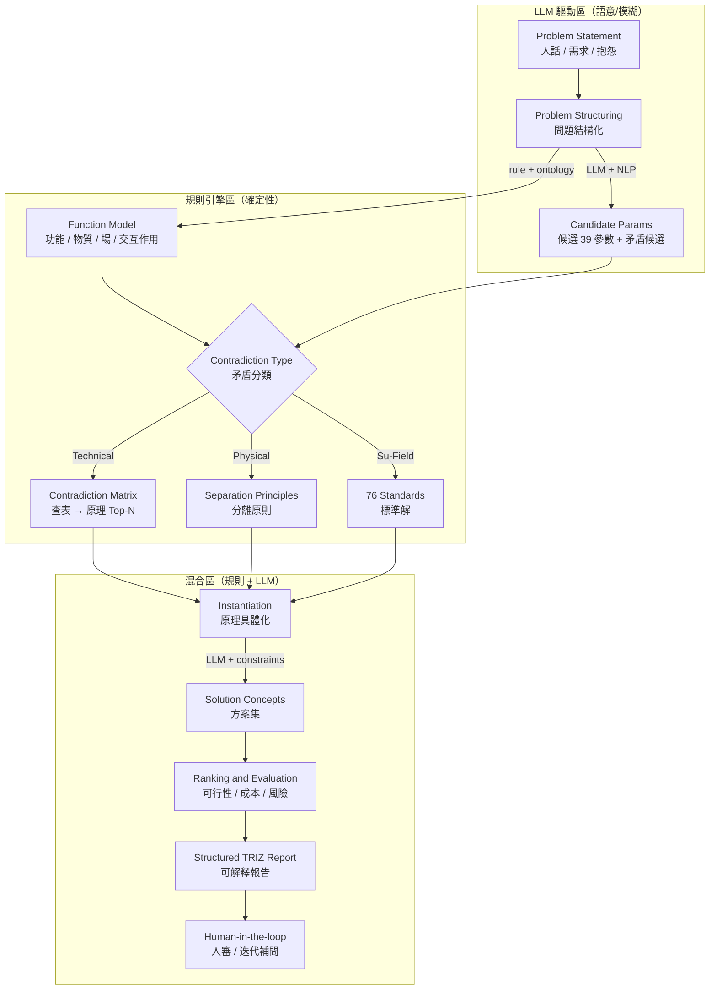

# TRIZ 結構化發散引擎

**一句話定位**：TRIZ 不是「替你變出創意」的魔法，而是把 AI 變成「跨域知識 + 大量組合生成 + 嚴格約束篩選」的引擎——讓創意不靠腦內庫存，靠流程把可能性擴大、把不可行快速淘汰。

> **v9 移除說明**：SCAMPER 已於 v9 移除 — 其 7 動作為 TRIZ 40 原理的子集，由 TRIZ L1/L2/L3 + Anti-Anchor 完全覆蓋。本文件標題由「TRIZ / SCAMPER 結構化發散引擎」更名。

**核心哲學**：**Bounded Divergence（有邊界的發散）**——先把設計語法/約束/風險寫清楚，AI 再在這些欄位裡生方案；生完立刻做黑帽式淘汰。

**代碼對齊**：`backend/app/agents/triz_solver.py` · `triz_critic.py` · `backend/app/tools/triz_kb.py`, `separation_principles.py`, `contradiction_tree.py` · `backend/app/prompts/triz_solver.py` · `src/types/layeredTriz.ts`, `solution.ts`

---

## 核心分工

| 角色 | 負責 |
|------|------|
| **TRIZ** | 把矛盾講清楚，不靠靈感找到發明原理方向 |
| **AI** | 擴大可用知識庫 + 組合搜索 + 嚴格淘汰 |
| **工程師** | 把不可能殺掉、把可行變成可驗證的實驗與設計決策 |

> **口訣**：框架出題，AI 供庫；發散要有邊界，輸出要可審查；不求最優，先求不翻車。

---

## 1. AutoTRIZ 混合架構

> **設計原則**：TRIZ 推理骨架高度規則化（矛盾矩陣、分離原則、76 標準解、ARIZ），但「把人話翻成 TRIZ 結構」與「把抽象原理落地成具體設計」這兩端永遠需要語意理解。Copilot 採用 **AutoTRIZ 混合式架構**：規則引擎管流程，LLM 負責模糊地帶。
>
> 參考：Jiang et al. (2025) AutoTRIZ — Automating engineering innovation with TRIZ and large language models.



### 模組分工：規則 vs LLM

| 模組 | 執行方式 | 說明 |
|------|---------|------|
| **矛盾類型分類** (TC/PC/SF) | 規則引擎 | 基於功能模型結構判斷，確定性高 |
| **矛盾矩陣查表 → 原理推薦** | 規則引擎 | 39×39 矩陣查表 + Top-N 推薦 |
| **分離原則映射** (時間/空間/條件/整體局部) | 規則引擎 | 規則分類後套策略 |
| **76 標準解選取** | 規則引擎 | Su-Field 模型 → 標準解匹配 |
| **報告結構模板** | 規則引擎 | 固定章節與欄位 |
| **自然語言 → 功能模型/參數/矛盾** | **LLM** | 語意歧義、領域隱含知識 |
| **39 參數映射** | **LLM** | 同一句話可能對應多個參數，需語意消歧 |
| **原理具體化** (抽象→工程設計) | **LLM + RAG** | 把「原理 #15 動態化」變成可執行的工程手段 |
| **方案品質控管** | **LLM + 規則** | 避免幻覺、確保符合約束條件 |

### TRIZ 知識庫結構

```
rd_assistant_design_system/triz_knowledge_base/
├── 01_39_parameters.md          # 39 工程參數 + LLM 語意映射提示
├── 02_contradiction_matrix.md   # 39×39 矛盾矩陣 (row-based lookup)
├── 03_40_principles.md          # 40 發明原理 + 子原理 + 工程提示
├── 04_separation_principles.md  # 物理矛盾 4 大分離原則
└── 05_76_standard_solutions.md  # Su-Field 76 標準解 (5 大類)
```

> **注入策略**：39 參數 + 分離原則 + 40 原理 → 全量注入（~6,500 token）；矛盾矩陣 + 76 標準解 → RAG 按需檢索相關行。

---

## 2. 矛盾類型系統 (TC / PC / SF)

### 2.1 矛盾類型分類規則 (規則引擎)

| 判定條件 | 矛盾類型 | 解法路徑 |
|---------|---------|---------|
| 兩個不同參數改善/惡化衝突 | **Technical Contradiction (TC)** | 矛盾矩陣 → 40 原理 |
| 同一物件需同時具備矛盾屬性 | **Physical Contradiction (PC)** | 分離原則 (時間/空間/條件/整體局部) |
| Su-Field 交互不完整/有害/不足 | **Su-Field Problem (SF)** | 76 標準解 |

> 同一工程問題可能同時被歸為多種類型。此時保留所有適用的分類，但每種類型走各自路徑——**不是每條矛盾都跑三路**。

### 2.2 Function Model 建構 (Su-Field 分析)

```
Function Model [編號]:
  系統功能: [系統要達成的主要功能]
  物質1 (S1): [工具物質 — 施加作用的物件]
  物質2 (S2): [產品物質 — 被作用的物件]
  場 (F): [場類型: 機械場/熱場/電場/磁場/化學場/...]
  交互作用類型: [有用/有害/不足/缺失]
  Su-Field 完整性: [完整 / 不完整 / 有害完整]
```

### 2.3 TRIZ 矛盾正式化模板

**Technical Contradiction (TC)**
```yaml
矛盾 [編號]:
  矛盾類型: Technical Contradiction
  改善參數: [TRIZ 39參數之一]
  惡化參數: [TRIZ 39參數之一]
  工程表述: 當 [動作] 時，[指標A] 改善，但 [指標B] 惡化
  解法路徑: 矛盾矩陣 → 40 原理
```

**Physical Contradiction (PC)**
```yaml
矛盾 [編號]:
  矛盾類型: Physical Contradiction
  物理矛盾: [同一物件] 需要同時具備 [屬性X] 和 [非屬性X]
  工程表述: [物件] 在 [情境A] 下需要 [屬性X]，在 [情境B] 下需要 [非屬性X]
  解法路徑: 分離原則 (時間/空間/條件/整體局部)
```

**Su-Field Problem (SF)**
```yaml
問題 [編號]:
  矛盾類型: Su-Field Problem
  關聯 Function Model: [FM-xxx]
  S1 (工具): [物質1]
  S2 (產品): [物質2]
  F (場): [場類型]
  問題描述: [交互作用不完整/有害/不足的具體描述]
  Su-Field 問題類別: [不完整系統 / 有害效應 / 效應不足]
  解法路徑: 76 標準解
```

### 2.4 嚴重度分級

| 等級 | 含義 | 後果 |
|------|------|------|
| **Fatal** | 若不解決，MUST 條件無法通過 | 必須求解到收斂 |
| **Major** | 影響 WANT 評分 > 20% | 強烈建議求解 |
| **Minor** | 影響 WANT ≤ 20%，有已知緩解 | 記入 Risk Register |

---

## 3. TRIZ 解法流程 (X2a)

每條矛盾依 D4 標註的類型分派路徑：

| 子步驟 | 適用類型 | 執行方式 | 動作 |
|--------|---------|---------|------|
| 5a-1 矛盾矩陣查表 | **TC** | 規則引擎 `trizSolve` | 改善×惡化 → Top-N 原理 |
| 5a-2 分離原則映射 | **PC** | 規則引擎 | 物理矛盾 → 4 大分離策略 |
| 5a-3 Su-Field 標準解 | **SF** | 規則引擎 `suFieldAnalyze` | Function Model → 76 標準解匹配 |
| 5a-4 原理具體化 | 各自產出 | **LLM + RAG** | 抽象原理 → 工程手段 |
| 5a-5 品質校驗 | 所有候選 | 規則 + 人審 | 是否違反已知約束 |
| 5a-6 二次矛盾掃描 | 所有候選 | LLM + 規則 | 與 CLD/Interface 交叉比對，識別新矛盾 |

### TRIZ 輸出規格 (固定欄位)

```yaml
TRIZ_解法_[編號]:
  矛盾句: 改善 [X] 惡化 [Y]
  矛盾類型: [TC / PC / SF]
  來源矛盾/問題: [C-xxx / SF-xxx]
  採用原理: [40原理編號 / 分離原則 / 76標準解編號]
  推薦來源: [矛盾矩陣 / 分離原則 / 76標準解]
  抽象策略: [原理的抽象描述]
  工程對映:
    - 手段1: [具體機構/材料/佈局]
    - 手段2: [具體機構/材料/佈局]
  具體化佐證:
    - [KB-xxx / WEB-xxx 引用ID]
  代價: [重量/成本/複雜度/維修性]
  robust評分預估: [Margin/Decoupling/Recoverability]
  最小實驗: [驗證哪個假設]
```

---

## 4. 矛盾收斂圖 (Convergence Graph)

> **v8 變更**：Phase A（矛盾空間健康度）已退役，其職責由 L1 critic badge（per-card 品質閘門）取代。僅保留 Phase B。

### Phase B：方案交叉檢查 (Decision Hub 手動觸發)

- 完整的 alternative × contradiction 交叉比對
- 每個解法與 CLD/Interface Contract 交叉比對，識別受影響模組
- 新矛盾分級：Fatal → 回到 5a 求解；Major → 建議求解；Minor → Risk Register
- API: `POST /convergence/scan` (phase=B)

### 架構健康度監控

| 信號 | 含義 | AI 行為 |
|------|------|---------|
| 節點 ≤ 3 | 架構健康 | 正常求解 |
| 節點 4-5 | 有壓力 | 告警：建議檢視更簡潔的架構 |
| 節點 > 5 | 根本性問題 | **強制暫停**：架構問題，非 TRIZ 問題 |
| 循環矛盾 | 內在矛盾 | **強制暫停**：A→B→A，必須重構 |

> **核心洞察**：最好的設計流程不是「解矛盾的能力最強」，而是「選到矛盾最少的架構」。

### Pre-CAD Confidence Score

```
Confidence = 已收斂的 (Fatal + Major) / 總識別的 (Fatal + Major) × 100%
```

Gate X5 門檻：Confidence = 100%（所有 Fatal + Major 完全收斂）。

---

## 5. 子系統定義 (3 層階層)

**System → Module → Component**，每層之間以 **6 維介面契約** 定義邊界：

| 維度 | 說明 |
|------|------|
| **Envelope** | 幾何包絡 (CAD Model ID) |
| **Load path** | 主要載荷/扭矩路徑 |
| **Signal path** | 感測/控制訊號 (Protocol) |
| **Thermal path** | 熱路徑 |
| **Datum / tolerance** | 製造裝配基準 |
| **Serviceability** | 服務維修拆解路徑 |

子系統清單（依專案調整）：散熱系統、支撐結構、傳動機構、控制器、隔振系統。

---

## ~~6. SCAMPER 模組級變形~~ (v9 移除)

> **v9 移除說明**：SCAMPER 已於 v9 移除 — 其 7 動作（Substitute / Combine / Adapt / Modify / Put to other uses / Eliminate / Rearrange）為 TRIZ 40 原理的子集，由 TRIZ L1/L2/L3 + Anti-Anchor 完全覆蓋。原 SCAMPER 在候選池中的創意發散角色由 Anti-Anchor Sprint 承接。

---

## 7. Anti-Anchor Sprint (反路徑依賴)

**目的**：刻意打破資深 RD 的路徑依賴和對標思維，主動探索非典型架構。

**Prompt 設計（第一性原理）**：
- 每個概念必須聲明其依賴的物理定律/原理
- 因果鏈量化預期（數量級即可）
- 明確在什麼條件下此概念會失效
- AI 自我檢查邏輯謬誤（循環論證、訴諸權威、類比過度）

**產出 3 種「非典型架構」概念**：
1. 不同能量傳遞/減速概念 (e.g., 磁力傳動)
2. 不同感測/控制閉環概念 (e.g., 無感測器控制)
3. 不同模組拆分/維修策略概念 (e.g., 模組化快拆)

**規則**：至少 1 條必須是「跟競品在物理介面或核心機制上不相容」的路線。

**保留欄位**：`mechanism`、`cross_domain_source`、`validation_passport`（含 assumptions[]、weak_points[]、required_verifications[]、confidence_level）。

**晉升機制**：通過 Anti-Anchor Gate 的概念可被標記為「晉升」，進入候選池 (source: `anti_anchor`)。

---

## 8. 決策中心 (Decision Hub)

候選池自動匯聚兩類來源：

| 來源 | 徽章 | Source 值 |
|------|------|-----------|
| Anti-Anchor 晉升路線 | 🟠 amber (reverse) | `anti_anchor` |
| TRIZ 三路徑候選 | 🔵 blue (forward) | `triz` (sub: TC/PC/SF) |

**三層資訊展開**：
- 第 1 層：名稱 / 來源徽章 / confidence level
- 第 2 層：物理機制說明
- 第 3 層：assumptions 清單 / Validation Passport 完整內容

**同矛盾多路徑警告**：同一條矛盾有多條 TRIZ 路徑同時存在時，系統顯示警告提示 RD 擇一。

**Phase B 手動觸發**：RD 選定每條矛盾的路徑後，手動觸發 Phase B 收斂掃描。

### Validation Passport (每個候選方案必備)

```yaml
validation_passport:
  assumptions:
    - content: [假設內容]
      category: [structural | thermal | manufacturing | ...]
      evidence_level: [E0-E4]
      worst_consequence: [若假設錯誤的最壞後果]
      worst_severity: [critical | major | minor]
      suggested_experiment: [建議驗證實驗]
  weak_points:
    - [已知弱點/限制]
  required_verifications:
    - [最高優先驗證項目]
    - [次優先驗證項目]
  confidence_level: [0-1]
```

---

## 9. MUST 快篩 (X2e)

> MUST 快篩是 KT 框架的「前哨站」——完整 KT 決策在 V3。詳見 DK-03。

**快篩 MUST 條件清單**

| MUST | 條件 | 判斷方式 | 證據類型 |
|------|------|---------|---------|
| M1 | 空間約束：可塞進目標空間 | 3D 干涉檢查 | CAD Model |
| M2 | 成本預估：BOM ≤ 目標上限 | BOM 粗估 | Spreadsheet |
| M3 | 安全餘裕：三指標有合理 margin | 粗估 | Calculation |
| M4 | 解耦程度：無致命耦合迴路 | CLD 分析 | Diagram |
| M5 | 可行性：製程/供應基本可行 | 經驗判斷 | SC-Response |
| M6 | 製造路徑可行性 | 關鍵製程初步評估 | DFM 報告 |

**篩選規則**：
1. 任一 MUST 不通過 = 直接淘汰
2. 通過者進入 Set-Based 集合（3-5 條，含至少 1 條 Anti-Anchor）
3. 完整 KT Decision Analysis 在 V3 執行

---

## 10. AI 角色邊界

### AI 的有用發散

- 跨域類比、組合爆搜
- 把抽象原理解釋成多種工程手段
- 用 TRIZ 原理提示出多條常見的解矛盾路徑

### AI 的危險發散

- 講得很像、做不到
- 忽略製程與物理
- 把風險藏起來（尤其早期最常發生）

> **RD 對齊話術**：「我們導入 TRIZ 不是要取代經驗，而是要把經驗結構化，並用 AI 補足跨域模式庫。所有 AI 方案都必須附帶：機制、假設、風險、最小驗證。你們仍然做最終工程判斷。」

---

**版本**: v2.0
**最後更新**: 2026-04-21
**變更紀錄**: 整合 E3x AutoTRIZ 架構、矛盾收斂圖、Anti-Anchor、決策中心為單一 MECE 文件；v9 移除 SCAMPER（7 動作為 TRIZ 40 原理子集）
