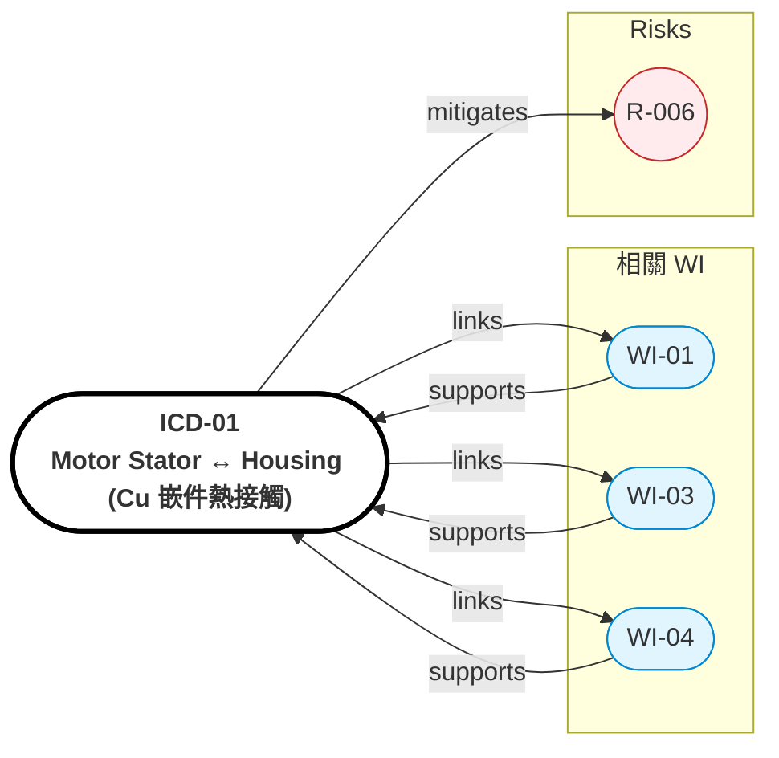

# ICD-01: Motor Stator ↔ Housing（Cu 嵌件熱接觸）

> **版本**: 1.0 | **日期**: 2026-04-28
> **相關 WI**: WI-01 (Motor), WI-03 (Thermal), WI-04 (Housing)
> **介面雙方**: SMC Stator + Cu 嵌件 ↔ Al-6061 Housing


## Relations Graph (auto-generated)

<!-- AUTO-GRAPH:START view=ego -->



<!-- AUTO-GRAPH:END -->

---

## 介面概述

```
   SMC Stator (Iron)               Al-6061 Housing
   ┌─────────────────┐            ┌──────────────────┐
   │  Cu Hairpin Coil│            │                  │
   │  ┌──────────┐   │            │                  │
   │  │SMC Yoke  │   │←─Cu Insert─→│ k_eff > 250 W/mK│
   │  └──────────┘   │            │                  │
   │  OD ≤ 92        │            │  ID 92.05~92.10  │
   └─────────────────┘            └──────────────────┘
                  ↑                            ↑
                  └─── 過盈 0.05 mm 熱嵌 ────────┘
```

## 配合規格

| 參數 | Stator 側 | Housing 側 | 公差 |
|:-----|:----------|:-----------|:-----|
| OD / ID | 92.00 mm | 91.95 mm (前嵌) → 92.05 (後) | -0.05 / +0.10 過盈熱嵌 |
| Cu 嵌件 vol fraction | 嵌入 housing | — | 3~5% of 內襯體積 |
| 接觸面積 A_contact | — | — | ≥ 4500 mm²（per WI-03 計算） |
| 介面熱阻 R_th | — | — | ≤ 0.05 K/W |

## GD&T

| 特徵 | 基準 | 公差類型 | 值 |
|:-----|:-----|:---------|:---|
| Stator 外圓 圓柱度 | A | 圓柱度 | 0.01 mm |
| Housing 內圓 圓柱度 | A | 圓柱度 | 0.01 mm |
| Stator 外圓 對 軸線同軸度 | A | 同軸度 | 0.02 mm |
| Cu 嵌件溝槽 對 軸線同軸度 | A | 同軸度 | 0.03 mm |

## 熱路徑

```
Winding (Cu) → SMC Stator yoke → SMC outer surface → Cu 嵌件 → Al housing → 內襯 PCM 層 → Al housing 外表面 → Ambient
                                                    ↘                                ↗
                                              k_eff 局部 > 250 W/mK         自然對流 + 風冷
```

## 電氣/磁路注意

- Cu 嵌件 vs Halbach magnet：必須在 stator 外側、不進入 air gap 路徑
- Cu 嵌件不可短接 SMC 段間絕緣（避免增加 eddy current）

## 驗收條件

| 項目 | 方法 | 判定標準 |
|:-----|:-----|:---------|
| 過盈配合 | 熱嵌組裝後拉脫力測試 | ≥ 5000 N 軸向 |
| 同心度 | CMM | ≤ 0.02 mm 軸線基準 |
| 介面熱阻 | thermal transient test | R_th ≤ 0.05 K/W |
| 局部 k_eff | TR1 CFD 對照 | ≥ 250 W/mK |

## 變更管控

- 公差變更需 WI-01 + WI-03 + WI-04 三方簽核
- Cu 嵌件 vol fraction 變更 → 重算 PCM 容量（WI-03）
- 影響分析更新 risk_register.md（R-006）
