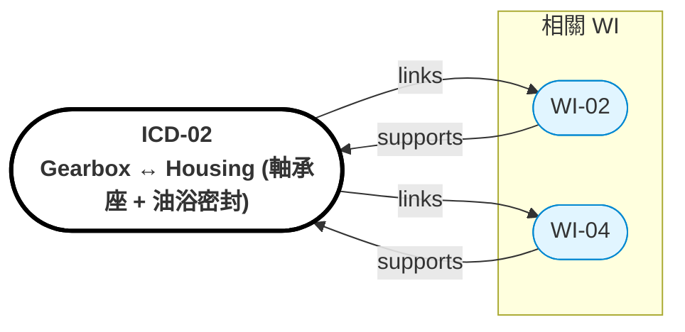

# ICD-02: Gearbox ↔ Housing（軸承座 + 油浴密封）

> **版本**: 1.0 | **日期**: 2026-04-28
> **相關 WI**: WI-02 (Gear), WI-04 (Housing)
> **介面雙方**: 雙級齒輪箱 ↔ Al Housing 軸承座 + 油浴腔


## Relations Graph (auto-generated)

<!-- AUTO-GRAPH:START view=ego -->



<!-- AUTO-GRAPH:END -->

---

## 介面概述

```
                   ┌──────────────────┐
   Stage 1 行星 ──→ │ 軸承座 (前)      │
                   │  (角接觸 BB)     │
                   ├──────────────────┤
   Stage 2 偏心   →│ 軸承座 (中)      │
   擺線輸出       │  (圓柱滾子 RB)   │
                   ├──────────────────┤
                   │ 油浴腔（PAO+MoS₂）│  ← V-ring + O-ring 密封
                   ├──────────────────┤
                   │ 軸承座 (後)      │
                   │  (角接觸 BB)     │
                   └──────────────────┘
```

## 配合規格

| 參數 | Gearbox 側 | Housing 側 | 公差 |
|:-----|:-----------|:-----------|:-----|
| 主軸承外圓 | 標準軸承 OD | H7 配合孔 | k6/H7 |
| 軸承同心度 | — | — | ≤ 0.02 mm 基準 A |
| 油浴容量 | — | ~30 mL | ±5% |
| 油位高度 | — | 浸沒 stage 2 30% | TR1 確認 |
| IP 等級 | — | IP67 | 浸 1m 30min |

## GD&T

| 特徵 | 公差 |
|:-----|:-----|
| 主軸承座 同軸度（前後） | ≤ 0.02 mm |
| 軸承座圓柱度 | ≤ 0.01 mm |
| 端面平面度（油封座）| ≤ 0.05 mm |
| O-ring 槽尺寸 | per ISO 3601 標準 |

## 油浴密封路徑

```
動態密封：V-ring + lip seal（軸出口處，油壓 + 旋轉）
靜態密封：O-ring（housing 分模面）
通氣：迷宮式 breather（防壓力差導致洩漏）
```

## 軸承預壓

| 軸承位置 | 預壓策略 | 數值 |
|:---------|:---------|:-----|
| 前主軸承（角接觸成對 O 排列）| 調整片或 spring washer | 80~120 N 軸向 |
| 中軸承（圓柱滾子）| 徑向遊隙 C3 | 標準 |
| 後主軸承 | 同前 | 80~120 N |

## 驗收條件

| 項目 | 方法 | 判定標準 |
|:-----|:-----|:---------|
| 同軸度 | CMM | ≤ 0.02 mm |
| 油浴密封 | 加壓 0.2 bar / 5 min | 無洩漏、無壓降 |
| IP67 | 浸泡測試 | 無進水 |
| 預壓力 | 力矩扳手 + 標定 | 80~120 N ±10% |

## 變更管控

- 軸承選型變更 → WI-02 + WI-04 雙方簽核
- 油選變更（黏度、添加劑）→ WI-02 主導，更新 ICD
