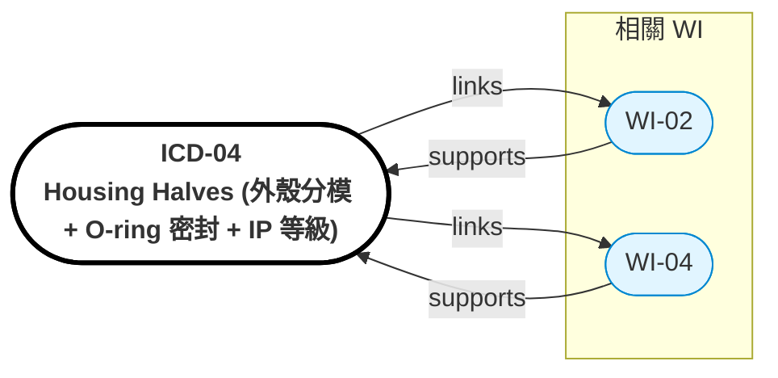

# ICD-04: Housing Halves（外殼分模 + O-ring 密封 + IP 等級）

> **版本**: 1.0 | **日期**: 2026-04-28
> **相關 WI**: WI-04 (Housing 主)、WI-02 (油浴密封)、WI-03 (PCM 腔體)
> **介面雙方**: Housing 前半 ↔ Housing 後半（含 endcap）


## Relations Graph (auto-generated)

<!-- AUTO-GRAPH:START view=ego -->



<!-- AUTO-GRAPH:END -->

---

## 介面概述

```
              軸向分模面
                  │
   ┌──────────────┼──────────────┐
   │  前半        │   後半 + Endcap │
   │  (含 Motor   │   (含 Gearbox + │
   │   stator)    │    PCB)         │
   │              │                 │
   │   ←─PCM─→   │                 │
   │  ──Cu嵌件──  │                 │
   └──────────────┴──────────────────┘
                  ↑
              O-ring 雙重密封（IP67）
```

## 分模策略

| 選項 | 優點 | 缺點 |
|:-----|:-----|:-----|
| **軸向分模（推薦）**| 馬達/齒輪箱獨立組裝、PCM 腔體易製 | 分模面長、密封要求高 |
| 徑向分模 | 製程簡單 | 同心度難保證、組裝困難 |

選擇：軸向分模 + 整合 endcap（含 PCB）

## 配合規格

| 參數 | 前半 | 後半 | 公差 |
|:-----|:-----|:-----|:-----|
| 分模面平面度 | — | — | ≤ 0.05 mm |
| O-ring 槽 | per ISO 3601 | per ISO 3601 | groove tol ±0.05 |
| 雙 O-ring（內外） | NBR 70 + FKM 90（內油浴用 FKM） | 同 | datasheet |
| 螺絲 | M5×16 | 8 顆周向 | 扭矩 4 Nm ±10% |
| 對位銷 | Ø3 mm × 2 | dowel pin H7 | 緊配 |

## GD&T

| 特徵 | 公差 |
|:-----|:-----|
| 分模面平面度 | ≤ 0.05 mm |
| 對位銷孔位置度 | ≤ 0.05 mm |
| 軸承座（跨分模面）同軸度 | ≤ 0.02 mm（核心要求）|
| 螺絲孔位置度 | ≤ 0.1 mm |

## 密封路徑

```
外環境 → 外 O-ring (NBR70) → 中介腔 → 內 O-ring (FKM) → 油浴腔
PCM 腔體 → 獨立微囊封裝（不依賴 O-ring）
```

## IP 等級驗證

| 測試 | 標準 | 結果要求 |
|:-----|:-----|:---------|
| IP67 | IEC 60529 | 浸泡 1m 30min 無進水 |
| 高壓水柱 IPX5 | — | 騎乘洗車情境 |

## 驗收條件

| 項目 | 方法 | 判定 |
|:-----|:-----|:-----|
| 分模面接觸 | 著色法 | 連續接觸 ≥ 90% |
| O-ring 壓縮率 | 槽深 vs O-ring 截面 | 15~25% |
| 加壓密封測試 | 0.5 bar / 5 min | 無壓降 |
| IP67 | 浸泡 | 無進水（內部 silica gel 變色檢查）|
| 螺絲扭矩 | torque wrench | 4 Nm ±10% |

## 變更管控

- 分模策略變更（軸向 vs 徑向）→ 全 WI 重新評估
- O-ring 材料變更（vs 油浴相容性）→ WI-02 + WI-04 + 化學相容性測試
