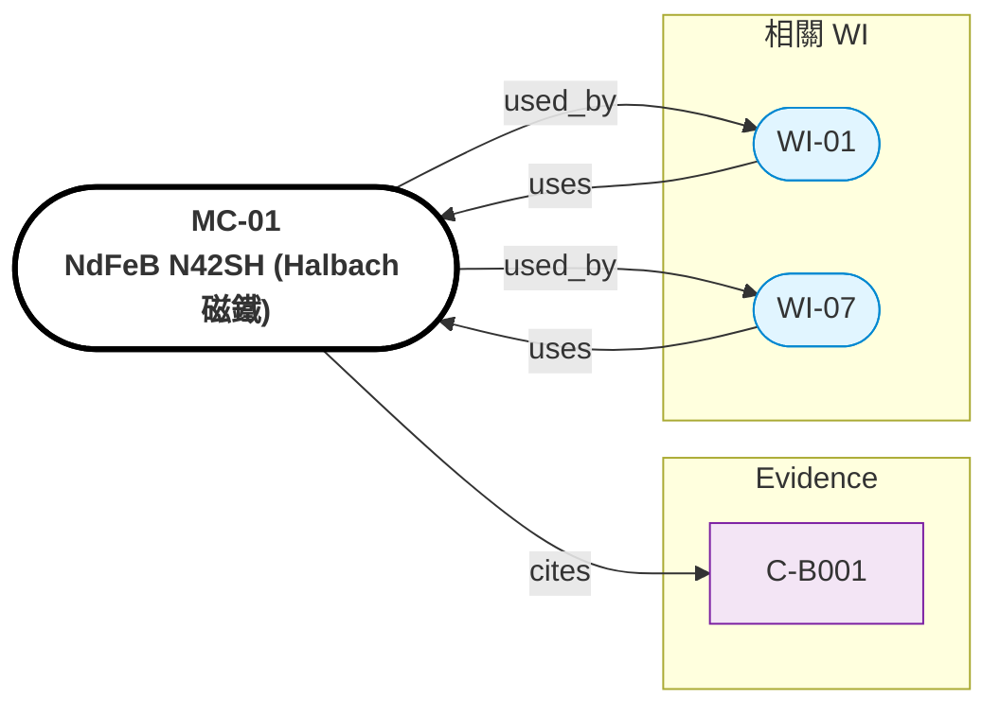

# MC-01: NdFeB N42SH（Halbach 磁鐵）

> **版本**: 1.0 | **日期**: 2026-04-28
> **來源**: Evidence C-B001
> **適用 WI**: WI-01
> **FEA 軟體**: ANSYS Maxwell, Altair Flux, COMSOL


## Relations Graph (auto-generated)

<!-- AUTO-GRAPH:START view=ego -->



<!-- AUTO-GRAPH:END -->

---

## 材料概述

燒結釹鐵硼永磁體，N42SH 牌號（H 級高溫穩定性）。Halbach 排列分段供應，磁化角度依設計。

選用理由：B_r=1.32T 高磁通密度，配合 Halbach 排列達 +30~40% air gap 增益（C-B002，TC-B 解法核心）。SH 等級在 150°C 仍維持 90% 磁通，匹配 R-008 退磁邊界。

## 磁性質

| 性質 | 值 | 單位 | 條件 | 來源 | Confidence |
|:-----|:---|:-----|:-----|:-----|:-----------|
| 剩磁 (B_r) | 1.32 | T | 20°C | Hitachi/Arnold datasheet | HIGH |
| 矯頑力 (HcB) | 995 | kA/m | 20°C | datasheet | HIGH |
| 內稟矯頑力 (HcJ) | 1750 | kA/m | 20°C | datasheet | HIGH |
| 最大能積 (BHmax) | 318~342 | kJ/m³ | 20°C | datasheet | HIGH |
| 退磁溫度 (Tw) | 150 | °C | — | datasheet | HIGH |
| 居禮溫度 | 340 | °C | — | datasheet | HIGH |
| 溫度係數 α(B_r) | -0.10 | %/K | 20-100°C | datasheet | HIGH |
| 溫度係數 β(HcJ) | -0.50 | %/K | 20-100°C | datasheet | HIGH |

## 機械性質

| 性質 | 值 | 單位 |
|:-----|:---|:-----|
| 密度 | 7400~7600 | kg/m³ |
| 楊氏模量 | 160 | GPa |
| 抗彎強度 | 250 | MPa |
| 硬度 | 600~620 | HV |

## 熱性質

| 性質 | 值 | 單位 |
|:-----|:---|:-----|
| 熱傳導 | 9 | W/mK |
| 比熱 | 502 | J/kg·K |
| CTE 平行磁化方向 | 5.2 | 1e-6 /K |
| CTE 垂直磁化方向 | -1.0 | 1e-6 /K（負膨脹）|

## FEA 輸入指引

### ANSYS Maxwell
```
Material: NdFeB_N42SH
Magnetic_Coercivity = -1.05e6 A/m (B_r/μ_0)
Br = 1.32 T
Conductivity = 6.25e5 S/m
Mass_Density = 7500 kg/m^3
```

### Altair Flux
```
B-H curve: Linear (μ_r = 1.05)
Br = 1.32 T (varying with magnetization angle for Halbach)
```

### Halbach 配置
- 段數 N = 8 (4 極對 × 2 段/極對)
- 磁化角度增量 = 360° / N = 45° per segment
- 每段方向依 Halbach formula 設定

## 注意事項

- **退磁風險（R-008）**：T_winding > 150°C → 不可逆退磁。設計上 winding 限 < 120°C，PCM/熱保護必須有效
- **公差**：Halbach 段磁化方向公差 ≤ ±0.5° 對 B_g 增益影響大（R-005）
- **加工**：NdFeB 不可切割（破壞磁路），燒結後鍍鎳防鏽
- **供應商**：Bomatec、Arnold、Hitachi Metals；交期 4~8 週
- **環保**：稀土含量受 REACH 法規關注，採購時確認 RoHS

## 驗收

- 每段 B_r 量測（probe）：±2% nominal
- 磁化方向角度量測：±0.5°
- 表面鍍層附著力：cross-cut tape test pass
