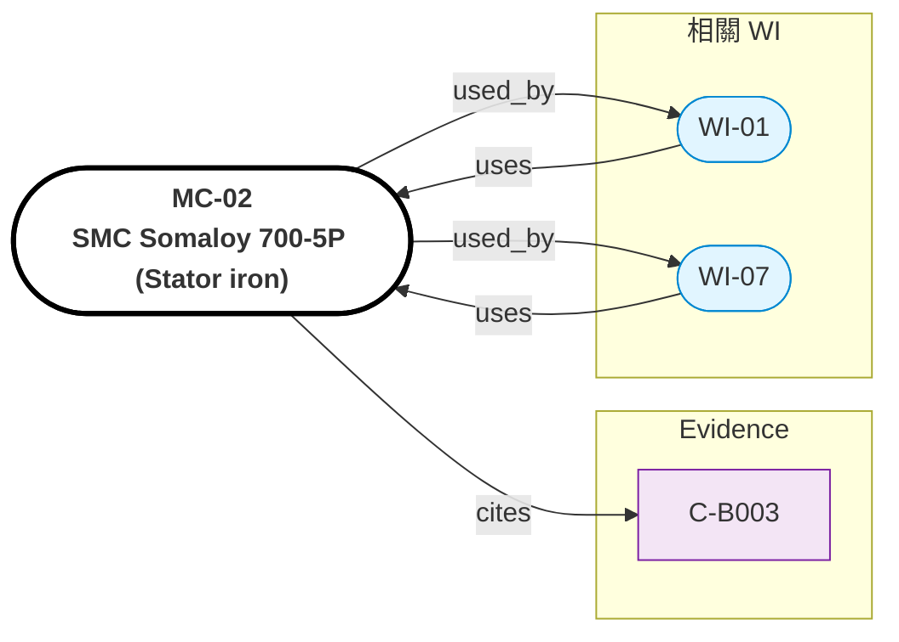

# MC-02: SMC Somaloy 700-5P（Stator iron）

> **版本**: 1.0 | **日期**: 2026-04-28
> **來源**: Evidence C-B003
> **適用 WI**: WI-01
> **FEA 軟體**: ANSYS Maxwell, Altair Flux


## Relations Graph (auto-generated)

<!-- AUTO-GRAPH:START view=ego -->



<!-- AUTO-GRAPH:END -->

---

## 材料概述

軟磁複合材料（SMC），鐵粉表面絕緣後模壓成型。各向同性、低 eddy current（介電隔離）、3D 磁路自由度大。

選用理由：替代傳統矽鋼片層壓 stator，避免層壓方向限制 + 降低高頻 eddy 損；配合 hairpin 繞組可達高槽滿率。SOL-TCB 標準解 2.4.5 複合鐵磁結構。

## 磁性質

| 性質 | 值 | 單位 | 條件 | 來源 | Confidence |
|:-----|:---|:-----|:-----|:-----|:-----------|
| 飽和磁通密度 (B_sat) | ~1.6 | T | 10 kA/m | Höganäs datasheet | HIGH |
| 相對磁導率 (μ_r,max) | 850 | — | — | datasheet | HIGH |
| 矯頑力 (Hc) | 200 | A/m | — | datasheet | HIGH |
| 鐵損 @ 1T, 400 Hz | ~9 | W/kg | — | datasheet | HIGH |
| 鐵損 @ 1T, 1 kHz | ~30 | W/kg | — | datasheet | HIGH |
| 電阻率 | ~400 | μΩ·m | 比矽鋼片高 100× | datasheet | HIGH |

## 機械性質

| 性質 | 值 | 單位 |
|:-----|:---|:-----|
| 密度（壓實後）| 7.45 | g/cm³ |
| 抗拉強度 (TS) | 80~120 | MPa（脆性，需注意應力集中）|
| 楊氏模量 | 165 | GPa |

## 熱性質

| 性質 | 值 | 單位 |
|:-----|:---|:-----|
| 熱傳導 (各向同性) | ~25 | W/mK |
| 比熱 | 500 | J/kg·K |
| CTE | 11.8 | 1e-6 /K |
| 最高工作溫度 | 250 | °C |

## FEA 輸入指引

### ANSYS Maxwell
```
Material: Somaloy_700_5P
B-H Curve: Lookup table from Höganäs
Conductivity = 2500 S/m (~ 1/ρ)
Core Loss: Steinmetz coefficients
  k_h = 0.005 (hysteresis)
  k_e = 1e-6 (eddy)
  α = 1.5
  β = 2.0
```

## 製程要點

- 模壓壓力：800 MPa
- 後熱處理：500°C / 30 min（去除應力 + 提升 μ_r）
- 模具開發週期：8~12 週
- 模具成本高，單件成本中

## 注意事項

- **脆性**：SMC 抗拉強度低（~100 MPa），應避免拉應力設計，可承受壓應力
- **3D 自由度**：可做傳統層壓不可行的 3D 磁路（如徑向 + 軸向結合）
- **高頻優勢**：在 PWM 換向頻率（10~20 kHz）區段，鐵損遠低於矽鋼片
- **採購**：Höganäs 為主供（瑞典），國產替代待驗證
- **單供風險**：列入 R-003 替代材料計畫

## 驗收

- 抽樣 B-H 曲線量測（每批次 3 件）
- 飽和點 ≥ 1.55 T @ 10 kA/m
- 鐵損測試 1 T / 400 Hz ≤ 10 W/kg
- 抗拉強度 ≥ 80 MPa
