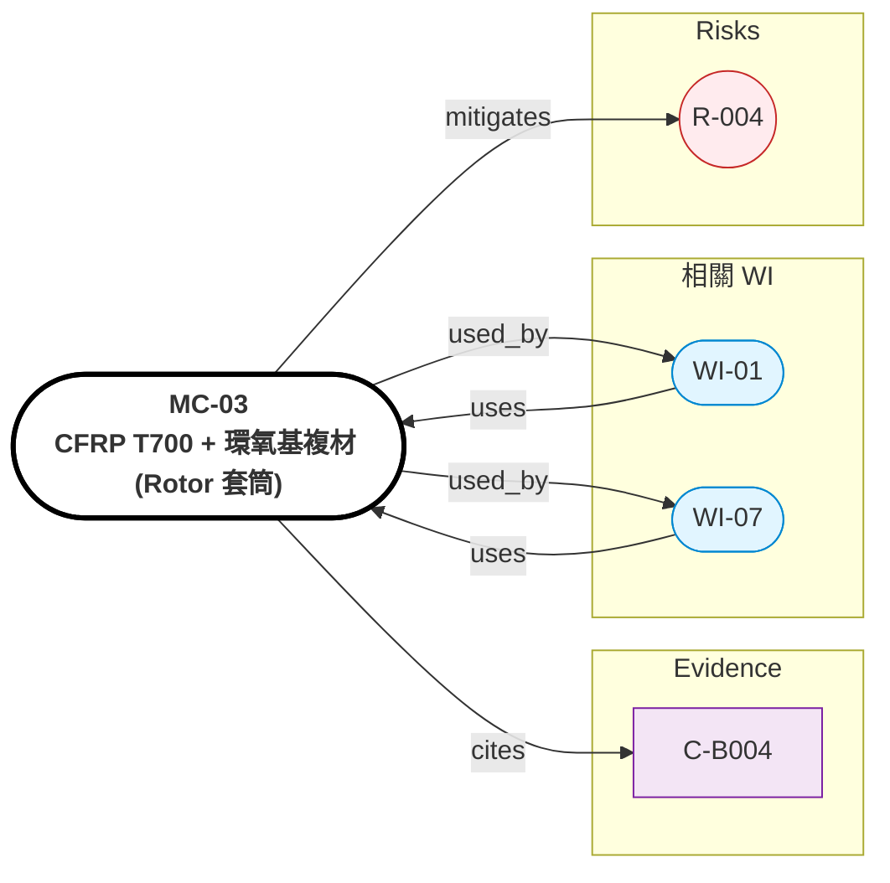

# MC-03: CFRP T700 + 環氧基複材（Rotor 套筒）

> **版本**: 1.0 | **日期**: 2026-04-28
> **來源**: Evidence C-B004
> **適用 WI**: WI-01
> **FEA 軟體**: ANSYS Composite PrePost, Altair HyperWorks


## Relations Graph (auto-generated)

<!-- AUTO-GRAPH:START view=ego -->



<!-- AUTO-GRAPH:END -->

---

## 材料概述

碳纖維增強環氧複材，T700 12K 纖維 + 環氧樹脂基體，纖維體積率 50%。預張力纏繞於 NdFeB rotor 外圓，提供高轉速時的 hoop 約束。

選用理由：高比強度（~1500 MPa / 1.6 g/cm³ = 940 kN·m/kg），輕量支撐 Halbach 在 12,000 rpm（tip speed ~58 m/s @ OD92）。

**Confidence: LOW（C-B004）** — 容許 tip speed 200 m/s 為 LLM_estimate，需供應商實測 datasheet 補強（R-004）。

## 機械性質（設計用估值，需驗證）

| 性質 | 值 | 單位 | 方向 | 來源 | Confidence |
|:-----|:---|:-----|:-----|:-----|:-----------|
| 縱向拉伸強度 (σ_t,L) | 1500~2000 | MPa | 纖維方向 | LLM_estimate | LOW |
| 縱向楊氏模量 (E_L) | 130 | GPa | 纖維方向 | typical 50% V_f | MEDIUM |
| 橫向楊氏模量 (E_T) | 8 | GPa | 垂直纖維 | typical | MEDIUM |
| 剪切模量 (G_LT) | 4.5 | GPa | — | typical | MEDIUM |
| 蒲松比 (ν_LT) | 0.30 | — | — | typical | MEDIUM |

## 熱性質

| 性質 | 值 | 單位 |
|:-----|:---|:-----|
| 熱傳導（縱向）| 7 | W/mK |
| 熱傳導（橫向）| 0.7 | W/mK |
| CTE 縱向 | -0.5 | 1e-6 /K（負）|
| CTE 橫向 | 30 | 1e-6 /K |
| 最高工作溫度 | 120 | °C（環氧基體限制）|

## 電磁性質

| 性質 | 值 |
|:-----|:---|
| 電阻率（縱向纖維方向）| ~1e-3 Ω·m |
| 電阻率（橫向）| ~1e+3 Ω·m |
| 相對磁導率 | 1（非磁性）|

備註：縱向（纖維方向）有導電性，但若纏繞方向為 hoop 方向（垂直軸線），對軸向 eddy 影響有限。WI-01 FEA 中可忽略 CFRP eddy 影響。

## 密度

| 性質 | 值 | 單位 |
|:-----|:---|:-----|
| 密度（V_f=50%）| 1.55 | g/cm³ |

## FEA 輸入指引

### ANSYS Composite PrePost
```
Material: CFRP_T700_50Vf
Element: SHELL181 with Layered Section
Layup: Hoop (90°) primary
Failure Criteria: Tsai-Wu
σ_t,L = 1500 MPa (conservative)
E_L = 130 GPa, E_T = 8 GPa
```

### Hoop Stress 計算
```
σ_hoop = ρ · ω² · r²  (centrifugal)
@ 12,000 rpm, r = 46 mm:
  v_tip = 58 m/s
  σ_hoop ≈ 1.55e3 × (1257)² × (0.046)² = 5.2 MPa  (低)
@ 200 m/s tip speed limit:
  σ_hoop ≈ 1.55e3 × v² ≈ 62 MPa per m/s² ratio
  → safety factor 對 1500 MPa = 24×（充足）
```

實際限制可能不在 hoop stress，而是：
- 環氧樹脂玻璃化轉變溫度（Tg）
- 預張力衰減（creep）
- 纏繞工藝公差

## 注意事項

- **R-004**：tip speed 200 m/s 必須委外複材廠 datasheet 確認
- **替代方案**：Inconel 薄壁 sleeve（重但可靠）/ 玻碳混編
- **製程**：濕法纏繞 + 預張力（30~50% UTS）+ 烘箱固化
- **環氧基體限制**：> 120°C 性能急遽下降（玻璃化轉變）
- **與 PCM 距離**：避免 PCM 熱量直接傳到 CFRP（housing 隔絕）
- **採購**：委外複材纏繞廠，交期 6~10 週

## 驗收

- 供應商 datasheet 確認 σ_t,L、E_L
- 抽樣 hoop tensile test
- 檢查 V_f（樹脂燒失法）
- 表面光潔度（影響 air gap 均勻性）
