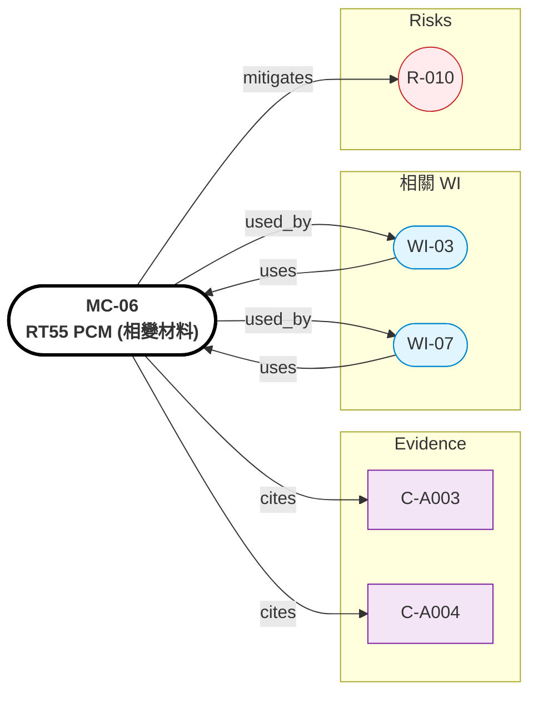

# MC-06: RT55 PCM（相變材料）

> **版本**: 1.0 | **日期**: 2026-04-28
> **來源**: Evidence C-A003, C-A004
> **適用 WI**: WI-03, WI-04
> **FEA 軟體**: ANSYS Fluent (solidification/melting), COMSOL Heat Transfer


## Relations Graph (auto-generated)

<!-- AUTO-GRAPH:START view=ego -->



<!-- AUTO-GRAPH:END -->

---

## 材料概述

Rubitherm RT55 — 石蠟基相變材料，熔點 55°C，潛熱 ~200 kJ/kg。housing 內襯夾層用，吸收 peak torque 期間的尖峰熱量（SOL-TCA 標準解 5.3.1 利用相變）。

選用理由：T_melt 55°C 落在 winding T_max 120°C 與 housing T_max 80°C 之間的緩衝帶；潛熱密度高；化學穩定；商用成熟。

## 熱性質（核心）

| 性質 | 值 | 單位 | 條件 | 來源 | Confidence |
|:-----|:---|:-----|:-----|:-----|:-----------|
| **熔點 (T_melt)** | **55** | °C | 主峰 | C-A004 Rubitherm | HIGH |
| 凝固點 | 55 | °C | 微滯後 | datasheet | HIGH |
| **潛熱 (ΔH)** | **~200** | kJ/kg | 50–60°C 範圍 | C-A003 datasheet | MEDIUM |
| 比熱（液相）| 2.0 | kJ/kg·K | 70°C | datasheet | MEDIUM |
| 比熱（固相）| 2.0 | kJ/kg·K | 25°C | datasheet | MEDIUM |
| 熱傳導（液相）| 0.20 | W/mK | 70°C | datasheet | MEDIUM |
| 熱傳導（固相）| 0.20 | W/mK | 25°C | datasheet | MEDIUM |
| 工作溫度範圍 | 30~75 | °C | — | datasheet | HIGH |

## 物理性質

| 性質 | 值 | 單位 |
|:-----|:---|:-----|
| 密度（液相）| 770 | kg/m³ |
| 密度（固相）| 880 | kg/m³ |
| 體積膨脹（fusion）| ~12 | % |
| 蒸氣壓 (200°C) | < 0.01 | bar |
| 沸點 | > 250 | °C |

## 化學性質

- **成分**：石蠟混合物（C20–C30 alkanes）
- **化學穩定**：無腐蝕、無毒、可重複熔凝 1000+ 次無衰減
- **可燃性**：閃點 > 145°C（不易燃但需注意）
- **與 Al/Cu 相容性**：HIGH（不腐蝕金屬）

## FEA 輸入指引

### ANSYS Fluent (Solidification/Melting Model)
```
Material: RT55_PCM
Liquidus Temp = 55 + 1 = 56°C
Solidus Temp = 55 - 1 = 54°C
Latent Heat = 200,000 J/kg
Pure Solvent Melting Heat: enable
Thermal Conductivity: 0.2 W/mK (treat as constant)
Density: 770 kg/m³ (use Boussinesq for natural convection)
Specific Heat: 2000 J/kg·K
```

### COMSOL Heat Transfer (Phase Change)
```
Use "Heat Transfer in Solids and Fluids" + "Phase Change Material" subnode
Phase 1: Solid (T < 54°C)
Phase 2: Liquid (T > 56°C)
Mushy zone: 54–56°C
L = 200 kJ/kg
```

## 容量計算範例

假設 PCM 層厚度 2 mm × OD 95 內襯面：
- V_layer ≈ π × 0.092 × 0.080 × 0.002 ≈ 4.6e-5 m³
- m_pcm ≈ 880 × 4.6e-5 ≈ 40 g
- Q_pcm = 40e-3 × 200,000 ≈ 8 kJ

對照 peak loss（假設 500 W × 30s）= 15 kJ → 容量不足，需增厚 PCM 或擴大面積

**WI-03 計算詳細容量並 size**

## 注意事項

- **R-010 PCM 飽和**：超過容量 → 退化為 Al only 散熱模式，產品文件需標註連續扭力上限
- **微囊封裝**：避免液相洩漏 + 防止軸向流動；Rubitherm 提供 microencapsulated 版本
- **體積膨脹 12%**：腔體必須留膨脹空間 + 柔性緩衝層
- **熱導率低（0.2 W/mK）**：是 Al 的 1/800，所以 PCM 層厚度不宜過大 → 影響傳熱速度
- **單供風險**：列入 R-003 替代材料計畫（Croda Crodatherm、PureTemp）
- **採購**：Rubitherm 德國，6~12 週交期含微囊化

## 驗收

- 每批次 DSC 測量：T_melt = 55°C ±1，ΔH ≥ 190 kJ/kg
- 微囊外殼完整性：50 cycles 熔凝後無洩漏
- 化學相容性：與 Al-6061 + Cu 接觸 30 天 25/55/75°C 無腐蝕
