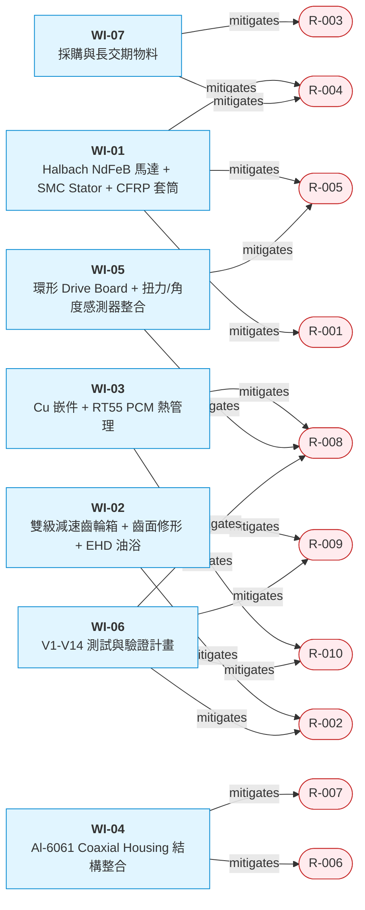

# Risk Register — e-Bike Mid-Drive (v3)

> **TRIZ Session**: 2026-04-28-1500-eBike-MidDrive-Coaxial
> **更新日期**: 2026-04-28
> **整體信心**: Weak Evolution (CCI=0.3125)

---

## 風險來源分類

1. **Step 4 observation_items** (3 條) → R-001~003
2. **Evidence Registry LOW confidence** (2 條) → R-004~005
3. **Weak Evolution 高分維度** (Q1=0.50, Q3=0.50) → R-006~007

---

## Risk × WI Mitigation Matrix（auto-generated）

> 由 `tools/build_graph.py --inject` 自動產生。

<!-- AUTO-GRAPH:START view=risk-matrix -->

<!-- AUTO-GRAPH:END -->

---

## 風險清單

| Risk ID | 風險描述 | 來源 | 影響域 | 可能性 | 衝擊度 | 緩解措施 | 負責 WI |
|:--------|:---------|:-----|:-------|:-------|:-------|:---------|:--------|
| **R-001** | Halbach B_g 增益 +30~40% 為 LLM/paper 估計，實際值依排列段數、磁化角度、air gap 而異，可能僅 +20% | observation C-B002 | 馬達/扭力密度 | M | H | 在 WI-01 強制 3D FEA-Mag（ANSYS Maxwell 或 Altair Flux）驗證；以最低估計 +20% 設計 baseline，+40% 為 stretch | WI-01 |
| **R-002** | TQ HPR50 噪音基準（~55 dB(A)）為 LLM 估計，無 spec sheet 佐證，比較基準不確定 | observation C-C002 | 噪音/競爭 | H | M | TR1 前購買競品實機 + 委外半消音室實測；若實際更低（~52），需重新評估目標 | WI-02, WI-06 |
| **R-003** | TC-B × TC-C 製造工序累積（Halbach 黏結 + SMC 模具 + 齒面修形 + Cu 嵌件熱嵌 + CFRP 套筒纏繞 + PCM 注入），DFM 風險高 | observation SIM | 製造/成本 | H | H | TR2 即啟動 DFM pre-review；TR7 強制 PFMEA + Control Plan；考慮工序合併（如 Halbach 與 SMC stator 同模具） | WI-07, TR-DFM |
| **R-004** | CFRP 套筒容許 tip speed 200 m/s 為 LLM 估計，未驗證；若實際僅 150 m/s 將限制 max RPM | C-B004 LOW | 馬達上限 | M | M | WI-01 補強：T700 + 環氧基複材 50% V_f 配方 + 預張力纏繞；委外 CFRP 廠 spec sheet 取得 | WI-01 |
| **R-005** | Halbach 製造（segment 角度 ±0.5° 容差）+ SMC 模壓對齊累積，磁路偏心 → 扭力波動 / 軸向力 | LOW confidence + 製造 | 馬達品質 | M | M | TR2 鎖定供應商（Bomatec/Arnold），TR3 公差鏈分析含 Halbach；TR6 dyno 量測 cogging torque + ripple | WI-01, ICD-01 |
| **R-006** | 結構複雜度 Q1=0.50：新增 Cu 嵌件、CFRP 套筒、PCM 層共 3 件，組裝順序複雜 | Weak Evolution | 結構/組裝 | M | M | WI-04 強制 DFA 審查（MTM 評分）；組裝順序固化 SOP；考慮一體式預組合模組 | WI-04 |
| **R-007** | 認知複雜度 Q3=0.50：R&D 階段需 FEA-Mag、CFD-PCM、KISSsoft 三軸並行；維修人員需要 PCM 熱管理培訓 | Weak Evolution | R&D/支援 | M | L | 建立內部知識庫（FEA template、模擬手冊）；維修文件強調 PCM 工作溫度上限 | WI-04, WI-06 |
| **R-008** | NdFeB 退磁邊界（T_winding < 120°C @ peak）若散熱失效將觸發 → 不可逆扭力衰減 | TRIZ 約束 | 馬達可靠性 | L | H | WI-03 強制熱保護策略：MCU 監測 winding 熱敏電阻，>110°C 限流；PCM 是 backup 不可單獨依賴 | WI-01, WI-03, WI-05 |
| **R-009** | EHD 油膜在低速啟動或冷油（-20°C）時尚未形成，齒輪噪音 / 磨耗風險 | TRIZ 條件分離邊界 | 噪音/壽命 | M | M | WI-02 補：MoS₂ 邊界潤滑添加劑保證乾運轉 30s；TR9 -20°C 環境測試 | WI-02 |
| **R-010** | PCM RT55 熔點 55°C，若環境溫度 + 連續高負載超過容量，PCM 飽和後散熱僅靠 Al housing 自然對流 | TC-A 設計邊界 | 熱可靠性 | M | M | WI-03 計算 PCM 容量與峰值能量比；TR1 CFD 含飽和情境；產品文件標註連續扭力上限 | WI-03 |

---

## 統計

| 衝擊度\\可能性 | High | Medium | Low |
|:--------------|:-----|:-------|:----|
| **High** | R-002, R-003, R-008 | R-001 | — |
| **Medium** | R-007 | R-004, R-005, R-006, R-009, R-010 | — |
| **Low** | — | — | — |

| 等級 | 數量 |
|:-----|:-----|
| 致命 (H/H) | 1 (R-003) |
| 高 (H/M, M/H) | 4 (R-001, R-002, R-008) + R-007 (M/L 但需關注) |
| 中 (M/M) | 5 |
| 低 | 0 |

---

## TR Gate 阻塞性

| Gate | 必須關閉的風險 |
|:-----|:--------------|
| TR1 | R-001 (Halbach FEA), R-002 (HPR50 實測), R-004 (CFRP spec) |
| TR2 | R-003 (DFM pre-review), R-005 (Halbach 供應商) |
| TR6 | R-008 (熱保護驗證), R-010 (PCM 飽和測試) |
| TR9 | R-009 (-20°C 環境), R-008 (耐久退磁) |
