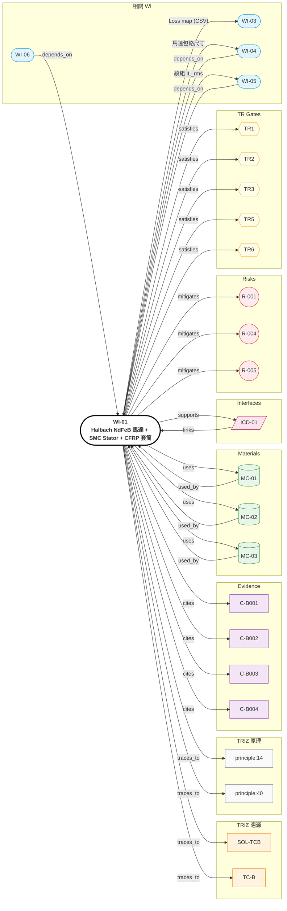

# WI-01: Halbach NdFeB 馬達 + SMC Stator + CFRP 套筒

> **版本**: 1.0 | **日期**: 2026-04-28
> **負責域**: 電磁（馬達）
> **前置條件**: TRIZ Step 4 通過（SOL-TCB），系統規格鎖定
> **產出物**: 3D EM FEA 結果、Loss map、繞組規格、Halbach 配置圖、CFRP 套筒規格
> **預估工時**: 6 週
> **阻塞下游**: WI-03（Loss map 為 thermal CFD 邊界條件）、WI-04（包絡尺寸）、ICD-01

## Relations Graph (auto-generated)

<!-- AUTO-GRAPH:START view=ego -->

<!-- AUTO-GRAPH:END -->

---

## 溯源

| WI 章節 | TRIZ 來源 | 類型 | 說明 |
|:--------|:----------|:-----|:-----|
| Halbach 排列設計 | SOL-TCB / 原理 #14 曲面化 | TC | 空間分離 — 有效側集中磁通、無效側近零 |
| NdFeB N42SH 選材 | C-B001 | Evidence | B_r 1.32 T HIGH confidence |
| SMC stator 替代層壓鋼 | SOL-TCB / 標準解 2.4.5 | SF | 複合鐵磁結構，介電隔離降 eddy |
| CFRP 套筒 | SOL-TCB / 原理 #40 複合材料 | TC | 高轉速支撐磁鐵 |
| Halbach 增益 +30~40% | C-B002 | Evidence | MEDIUM — 必須 FEA 驗證（**R-001**） |

## 設計輸入

| 參數 | 值 | 單位 | 來源 | Confidence |
|:-----|:---|:-----|:-----|:-----------|
| OD (motor) | ≤ 92 | mm | 系統規格（封裝預留齒輪箱） | HIGH |
| Axial (motor) | ≤ 40 | mm | 系統規格 | HIGH |
| Peak torque @ rotor | ≥ 4 | Nm | 125 Nm output / 32.5 ratio | HIGH |
| Max RPM | ~12,000 | rpm | 25 rpm cadence × 32.5 + 高速保護 | HIGH |
| Tip speed | < 200 | m/s | C-B004 LOW，需 datasheet 確認 | LOW |
| Winding T_max | < 120 | °C | NdFeB 退磁邊界 | HIGH |
| B_r (N42SH) | 1.32 | T | C-B001 datasheet | HIGH |
| SMC sat | 1.6 | T | C-B003 datasheet | HIGH |

## Step 1: Halbach 拓撲設計

1. 採用 **8 段 Halbach** 排列（4 極對 × 2 段/極對）
2. 每段磁化角度 = 180° / N_segments = 22.5° increment
3. 用 ANSYS Maxwell 或 Altair Flux 進行 2D 磁路初設：
   - 設 air gap = 1.0 mm（後續調整）
   - 求 B_g (air gap 中心磁通密度)
4. **判定標準**：B_g ≥ 0.85 T（vs 傳統徑向磁化 baseline ~0.65 T，預期 +30%）

## Step 2: 3D FEA-Mag（**強制 — 關閉 R-001**）

1. 建模含 SMC stator + Halbach rotor + air gap + CFRP 套筒
2. 邊界條件：
   - 外部空氣域 ≥ 3× rotor OD
   - 設 SMC B-H curve（從 Höganäs 取得）
   - 設 NdFeB N42SH B_r = 1.32 T、HcJ = 1750 kA/m @ 20°C
3. 求解：peak current 條件下 air gap B_g、torque、cogging
4. **判定標準**：
   - B_g ≥ 0.85 T（baseline 對照組做傳統徑向磁化）
   - Peak torque @ rotor ≥ 4.0 Nm
   - Cogging torque < 5% peak torque
5. 若 B_g 增益 < 25%，回 Step 1 調整段數或 air gap

## Step 3: Loss Map 產出

1. 不同 (RPM, torque) 工況下計算：
   - 銅損 P_cu = I² × R_phase（含 skin effect @ 高頻 PWM）
   - 鐵損 P_fe = Steinmetz: k·f^α·B^β（SMC 參數）
   - 渦流損（CFRP 套筒導電性近零，忽略）
2. 輸出 Loss map（CSV：RPM × torque × P_loss W）
3. **交付給 WI-03** 作為 CFD 熱源邊界

## Step 4: 繞組設計（Cu Hairpin）

1. 採 hairpin 矩形繞組，槽滿率目標 ≥ 60%
2. 計算 phase resistance @ 25°C 與 @ 100°C
3. 確認 IL_rms ≤ MOSFET 額定（WI-05 對接）

## Step 5: CFRP 套筒設計

1. T700 12K + 環氧基複材，纖維 50% V_f
2. 預張力纏繞，計算 hoop stress @ max RPM tip speed
3. **判定**：safety factor ≥ 1.5（vs CFRP 容許 σ_hoop = 1500 MPa）
4. 取得供應商實測 datasheet（**關閉 R-004**）

## FEA 設定指引

| 項目 | 設定 |
|:-----|:-----|
| 軟體 | ANSYS Maxwell（首選）/ Altair Flux |
| 分析類型 | Transient 3D Magnetic |
| 網格 | Air gap 加密至 < 0.2 mm；磁鐵內 0.5 mm |
| 邊界條件 | Vector potential = 0 @ outer boundary，週期對稱 |
| 材料卡 | MC-01 (NdFeB)、MC-02 (SMC)、MC-03 (CFRP) |
| 收斂 | Energy error < 1% |

## 設計凍結與交付

### 交付物

| # | 交付物 | 格式 | 接收者 |
|:--|:-------|:-----|:-------|
| 1 | 3D FEA report（B_g, torque, cogging） | PDF + 模型檔 | WI-04, TR1 review |
| 2 | Loss map | CSV | **WI-03** |
| 3 | Halbach 段數/角度規格 | DXF + 物料表 | 採購 (WI-07) |
| 4 | 繞組規格（hairpin layout、IL/IR） | PDF + 線材表 | 採購、WI-05 |
| 5 | CFRP 套筒 spec（厚度、纖維配方、預張力） | PDF + datasheet | 採購、WI-04 |

### TR Gate Checklist

| Gate | 檢查項目 | 狀態 |
|:-----|:---------|:-----|
| TR1 可行性 | 3D FEA-Mag B_g ≥ baseline +30%、peak torque ≥ 4 Nm、CFRP safety factor ≥ 1.5 | [ ] |
| TR1 可行性 | Loss map 已交付 WI-03 | [ ] |
| TR2 參數鎖定 | Halbach 供應商 nominated；磁化角度公差 ≤ ±0.5° | [ ] |
| TR3 詳細設計 | 繞組 GD&T + 套筒公差鏈分析；BOM 凍結 | [ ] |
| TR5 Alpha | 磁鐵組裝、繞組嵌入完成；可旋轉 | [ ] |
| TR6 驗證 | dyno 實測 V1 (B_g)、V2 (peak torque)、V3 (cogging)、V4 (efficiency map) | [ ] |

### Weak Evolution 改進方向

> Q1=0.50（新增 CFRP 套筒）：未來可探索 Halbach + 整合磁路套筒一體化（消除 CFRP）→ 推到 Strong Evolution
