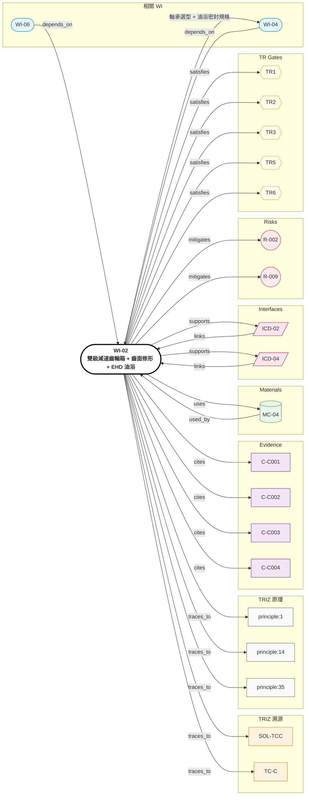

# WI-02: 雙級減速齒輪箱（行星 1:5 × 偏心擺線 1:6.5）+ 齒面修形 + EHD 油浴

> **版本**: 1.0 | **日期**: 2026-04-28
> **負責域**: 機械（齒輪/機構）
> **前置條件**: TRIZ Step 4 通過（SOL-TCC），WI-01 提供轉子輸出 RPM/torque
> **產出物**: 齒輪參數表、修形 KISSsoft 報告、軸承選型、油浴密封規格、NVH 模態分析
> **預估工時**: 6 週
> **阻塞下游**: WI-04（軸承座+油浴密封）、ICD-02、ICD-04

## Relations Graph (auto-generated)

<!-- AUTO-GRAPH:START view=ego -->

<!-- AUTO-GRAPH:END -->

---

## 溯源

| WI 章節 | TRIZ 來源 | 類型 |
|:--------|:----------|:-----|
| 雙級分配 1:5 × 1:6.5 = 1:32.5 | SOL-TCC / 原理 #1 分割 | TC |
| 齒面修形 Δδ 5~15 μm 齒廓 + 3~8 μm 齒向 | SOL-TCC / 原理 #14, #35 | TC |
| EHD 油膜 0.1~1 μm | SOL-TCC / 標準解 1.3.5 微量添加物 | SF |
| 噪音降 6~12 dB(A) | C-C001 Niemann/Winter | Evidence MEDIUM |
| 避封裝模態共振 | SOL-TCC / 標準解 2.3.1 場節奏匹配 | SF |

## 設計輸入

| 參數 | 值 | 單位 | 來源 | Confidence |
|:-----|:---|:-----|:-----|:-----------|
| 總減速比 | 1:30 ~ 1:35 | — | 系統規格 | HIGH |
| 設計選擇 | 1:5 行星 × 1:6.5 偏心擺線 = 1:32.5 | — | C-C004 | HIGH |
| Output peak torque | 125 | Nm | 系統規格 | HIGH |
| Output continuous torque | 100 | Nm | 系統規格 | HIGH |
| Cadence (input from human) | 60–90 | rpm | 騎乘工況 | HIGH |
| Mesh frequency | 1.5~3 | kHz | cadence × stage 1 ratio × tooth count | HIGH |
| 噪音目標 | ≤ HPR50 baseline | dB(A) | 系統規格（**R-002 待實測**） | LOW |
| Δδ 齒廓修緣 | 5~15 | μm | C-C001 | MEDIUM |
| Δδ 齒向鼓形 | 3~8 | μm | C-C001 | MEDIUM |
| EHD 膜厚 | 0.1~1 | μm | C-C003 | MEDIUM |

## Step 1: Stage 1 行星齒輪設計（1:5）

1. 太陽輪/行星輪/環齒輪齒數選擇（避免共因子，禁忌組合）
2. 模數選擇：M = 0.8~1.0（受 OD 限制）
3. 行星數 N_p = 3 或 4（扭力分擔）
4. 齒根應力檢核（KISSsoft / GearPro）：
   - σ_F < S-N 安全係數 3× @ 125 Nm peak
   - σ_H < pitting limit
5. 動態因子 K_v 估算（高速側 ~12,000 rpm input）

## Step 2: Stage 2 偏心擺線減速器（1:6.5）

1. RV-style cycloidal disc + 偏心軸 + 出力盤針孔
2. 齒數 Z = 6.5 → ~13 拐點/圈（精算 z_pin × ε）
3. 雙偏心相位差 180°（消振動）
4. 接觸應力檢核 + 拐點滑動率最佳化

## Step 3: 齒面修形（**核心 TRIZ 解法**）

採 KISSsoft 進行 modification analysis：

| 修形類型 | 範圍 | 用途 |
|:---------|:-----|:-----|
| 齒廓修緣 (tip relief) | 5~15 μm | 降低嚙合進入/退出衝擊 |
| 齒向鼓形 (crowning) | 3~8 μm | 補償組裝偏斜 + 接觸載荷分布 |
| 齒根修整 | 0 μm | 不修，集中應力風險 |

**判定**：
- PEE (Peak-to-peak transmission error) < 5 μm
- 預測噪音降幅 ≥ 6 dB(A)（per C-C001 baseline）

## Step 4: 軸承選型

| 位置 | 類型 | 額定 | 備註 |
|:-----|:-----|:-----|:-----|
| 馬達轉子（兩端） | 深溝球軸承 | C ≥ peak axial × 5 | 預壓 0 軸向、徑向 ~10 N |
| Stage 1 行星支撐 | 滾針軸承 | 行星輪內側 | 緊湊空間 |
| Stage 2 偏心軸 | 圓柱滾子 | 抗高徑向力 | RV 標配 |
| Output shaft | 角接觸球軸承（成對 O 排列） | 抗 chain pull | 承受踩踏側向力 |

## Step 5: 油浴設計（EHD + 散熱次要功能）

1. 油選 PAO 8（合成基礎油，黏度指數 > 140）+ MoS₂ 固態潤滑添加 1~3%
2. 油位：浸沒 stage 2 偏心擺線 ~30%；甩油到 stage 1
3. 油溫工作範圍：-20°C（cold start, MoS₂ 邊界保證）~ 90°C
4. 密封：V-ring + dynamic O-ring，IP67 等級
5. **R-009 緩解**：MoS₂ 提供乾運轉 30s 邊界潤滑

## Step 6: NVH 模態分析

1. 計算齒輪嚙合頻率（mesh freq, sideband）
2. 計算 housing 一階扭轉/彎曲模態（FEA-Modal）
3. **判定**：嚙合 fundamental 與 housing 模態 ≥ ±15% 分離
4. 若衝突 → 調整 housing 肋條或齒輪 helix angle

## FEA / 模擬設定

| 項目 | 設定 |
|:-----|:-----|
| 軟體 | KISSsoft（齒輪）+ ANSYS Mechanical（housing modal） |
| 分析 | Static / fatigue / modal |
| 修形 | profile + helix per Step 3 |
| 材料卡 | MC-04 (Al housing)，齒輪鋼 20MnCr5 滲碳（標準） |
| 油膜 | EHD：使用 KISSsoft 內建 Hertz + λ_min 計算 |

## 交付物

| # | 交付物 | 接收者 |
|:--|:-------|:-------|
| 1 | 齒輪參數表（齒數、模數、修形、材料、熱處理） | 採購 (WI-07)、ICD-02 |
| 2 | KISSsoft 修形報告（PEE、噪音預測） | TR1 review |
| 3 | NVH modal report（嚙合 vs housing 分離度） | WI-04 |
| 4 | 軸承選型表（型號、廠商、預壓） | 採購 |
| 5 | 油浴規格（油選、油位、密封） | WI-04, ICD-04 |

### TR Gate Checklist

| Gate | 檢查項目 |
|:-----|:---------|
| TR1 | KISSsoft σ_F/σ_H 安全係數通過、修形 PEE < 5 μm、噪音預測 ≤ HPR50 baseline |
| TR2 | 軸承型號 nominated、齒形參數凍結、磨齒供應商 nominated |
| TR3 | 公差鏈分析（背隙、同心度、軸向間距） |
| TR5 | 齒輪箱可手轉、無干涉 |
| TR6 | dyno 實測 V5 (peak torque hold)、V6 (efficiency)、V7 (NVH dB(A))、V8 (durability initial) |
