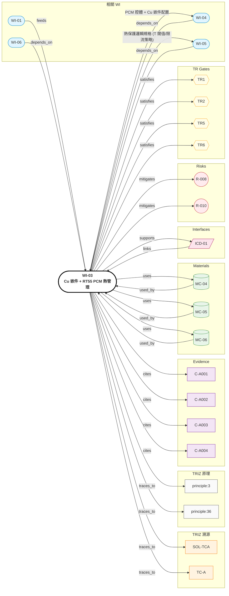

# WI-03: Cu 嵌件 + RT55 PCM 熱管理

> **版本**: 1.0 | **日期**: 2026-04-28
> **負責域**: 熱管理
> **前置條件**: WI-01 提供 Loss map（馬達熱源）；WI-04 housing 幾何
> **產出物**: CFD-PCM 模擬報告、Cu 嵌件 spec、PCM 層配置圖、熱保護策略
> **預估工時**: 5 週
> **阻塞下游**: WI-04（housing 內襯設計）、WI-05（過熱保護邏輯）

## Relations Graph (auto-generated)

<!-- AUTO-GRAPH:START view=ego -->

<!-- AUTO-GRAPH:END -->

---

## 溯源

| WI 章節 | TRIZ 來源 | 類型 |
|:--------|:----------|:-----|
| Cu 嵌件梯度熱導 (k=401 局部 vs Al k=167 整體) | SOL-TCA / 原理 #3 局部品質 | TC |
| RT55 PCM 相變吸熱 | SOL-TCA / 原理 #36 相變 | TC |
| 空間分離（徑向局部高 k） | SOL-TCA / 標準解 1.1.2 內部添加物 | SF |
| 整體局部分離（嵌件 vol fraction < 5%） | Px 分離驗證 | SF |
| 熱保護策略 | R-008 NdFeB 退磁邊界 | 風險緩解 |

## 設計輸入

| 參數 | 值 | 單位 | 來源 | Confidence |
|:-----|:---|:-----|:-----|:-----------|
| 馬達 peak loss | 從 WI-01 Loss map | W | WI-01 | HIGH |
| Peak duration | 5–30 | s | 騎乘工況（爬坡/加速） | HIGH |
| Cont loss @ 100 Nm | TBD（從 Loss map） | W | WI-01 | HIGH |
| Winding T_max | < 120 | °C | NdFeB 退磁 | HIGH |
| Housing T_max | < 80 | °C | 使用者觸碰安全 | HIGH |
| Ambient | -20 ~ +40 | °C | 騎乘環境 | HIGH |
| Cu k | 401 | W/mK | C-A001 | HIGH |
| Al-6061 k | 167 | W/mK | C-A002 | HIGH |
| RT55 ΔH | 200 | kJ/kg | C-A003 | MEDIUM |
| RT55 T_melt | 55 | °C | C-A004 | HIGH |

## Step 1: 熱模型建立

1. 一階集中參數模型（lumped capacitance）：
   - Node 1: Winding (m_cu × Cp_cu)
   - Node 2: Housing wall (m_al × Cp_al)
   - Node 3: PCM 層（m_pcm × Cp_pcm + ΔH @ T_melt）
   - Node 4: Ambient
2. 熱阻網絡：R_winding-housing (with Cu insert), R_housing-PCM, R_housing-ambient
3. **判定（初算）**：peak 30s 累積能量 vs PCM 容量；確認不過熔範圍

## Step 2: Cu 嵌件配置設計

1. 徑向嵌件：stator 外圓 ↔ housing 內圓，Cu 條形或 ring 嵌入 Al housing
2. 嵌件 vol fraction：3~5%（保 OD111 不超）
3. 介面結合：熱嵌（過盈 0.05 mm）+ 螺紋鎖固
4. **判定**：等效徑向 k_eff > 250 W/mK（vs 全 Al = 167）

## Step 3: PCM 層配置

1. 位置：housing 內襯 1.5~2.5 mm 厚 PCM 夾層（容納在 housing 內壁與 stator 之間預留腔體）
2. 封裝方式：Al 微囊化或 vacuum-sealed packet
3. 容量計算：
   - 質量 m_pcm = ρ_pcm × V_layer
   - 可吸熱量 Q_pcm = m_pcm × ΔH = m_pcm × 200 kJ/kg
   - **判定**：Q_pcm ≥ peak 30s 累積熱量 × 1.3 安全係數

## Step 4: CFD-PCM 模擬

1. 軟體：ANSYS Fluent（含 solidification/melting model）或 COMSOL
2. 邊界條件：
   - 熱源：WI-01 Loss map（spatially distributed 在 winding/stator/iron）
   - 外表面：自然對流 h ≈ 5–10 W/m²K（騎乘風冷另計）
3. 求解：peak 5、10、30s + cont 1 hr 工況
4. **判定**：
   - V1 (peak 5s)：T_winding < 100°C
   - V2 (peak 30s)：T_winding < 120°C，PCM 開始熔化
   - V3 (cont 100 Nm × 1 hr)：housing surface < 80°C，PCM 完全熔化前回到平衡
   - V4 (PCM 飽和)：standby 30 min 後 PCM 凝固恢復（**R-010 緩解**）

## Step 5: 熱保護策略（軟體層 — 對接 WI-05）

1. NTC 熱敏電阻嵌入 winding（每相 1 顆）
2. MCU 監測：
   - T_winding > 110°C → 限流 80%
   - T_winding > 115°C → 限流 50% + 提示騎士降功率
   - T_winding > 118°C → 切斷輸出（保護 NdFeB 不退磁）
3. PCM 層作為 **passive backup**，不可單獨依賴
4. 與 WI-05 確認 NTC 信號鏈精度 ≤ ±2°C

## Step 6: PCM 飽和情境設計

- 連續高負載超過 PCM 容量 → 進入 "Al only" 散熱
- 計算 Al only 的穩態最大連續扭力（T_cont_max_no_pcm）
- 在產品文件標註此邊界

## CFD 設定

| 項目 | 設定 |
|:-----|:-----|
| 軟體 | ANSYS Fluent (解凍模型) / COMSOL Heat Transfer |
| 元素 | Hexa 為主，PCM 區六面體加密 |
| 網格 | < 0.5 mm 在 winding/stator；< 0.3 mm 在 PCM 層 |
| 材料卡 | MC-04 (Al), MC-05 (Cu), MC-06 (RT55 PCM) |
| 收斂 | Energy residual < 1e-6 |

## 交付物

| # | 交付物 | 接收者 |
|:--|:-------|:-------|
| 1 | CFD-PCM 報告（V1-V4 工況） | TR1 review |
| 2 | Cu 嵌件配置圖（位置、vol fraction、介面） | WI-04, ICD-01 |
| 3 | PCM 層 spec（厚度、封裝、容量） | WI-04, MC-06 |
| 4 | 熱保護邏輯規格（T 閾值、限流策略） | **WI-05** |
| 5 | PCM 飽和邊界（T_cont_max_no_pcm） | 產品手冊 |

### TR Gate Checklist

| Gate | 檢查項目 |
|:-----|:---------|
| TR1 | CFD V1-V4 通過、Cu 嵌件等效 k_eff > 250、PCM 容量安全係數 ≥ 1.3 |
| TR2 | PCM 微囊封裝供應商 nominated；NTC 規格鎖定 |
| TR5 | 嵌件熱嵌 + PCM 注入製程驗證 |
| TR6 | dyno V10（peak 30s 溫升）、V13（cont 1 hr housing T） |
