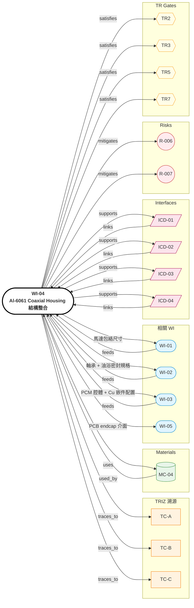

# WI-04: Al-6061 Coaxial Housing 結構整合

> **版本**: 1.0 | **日期**: 2026-04-28
> **負責域**: 結構（外殼/框架）
> **前置條件**: WI-01/02/03/05 子系統規格凍結
> **產出物**: 完整 3D CAD 組裝、GD&T、BOM、公差鏈分析、Design FMEA
> **預估工時**: 4 週（前置等子系統設計）
> **阻塞下游**: TR3 詳細設計凍結

## Relations Graph (auto-generated)

<!-- AUTO-GRAPH:START view=ego -->

<!-- AUTO-GRAPH:END -->

---

## 溯源

| WI 章節 | TRIZ 來源 |
|:--------|:----------|
| Coaxial 封裝 OD111×axial92 | 系統規格 + Phase 6 Gate P |
| 內襯 Cu 嵌件 + PCM 層配置 | SOL-TCA / WI-03 |
| 軸承座 + 油浴密封 | SOL-TCC / WI-02 |
| Halbach rotor 包絡 + air gap | SOL-TCB / WI-01 |
| 多 TC 整合介面 | SIM 矩陣協同 (TC-A×B、A×C) |

## 設計輸入

| 參數 | 值 | 單位 | 來源 |
|:-----|:---|:-----|:-----|
| OD | ≤ 111 | mm | 系統規格 |
| Axial | ≤ 92 | mm | 系統規格 |
| 系統重量 | ≤ 2500 | g | 系統規格 |
| Material | Al-6061-T6 | — | MC-04 |
| 製程 | 壓鑄 + CNC 精修 | — | DFM 後續 |
| IP | IP67 | — | 騎乘需求 |

## Step 1: 包絡規劃

1. 軸向分配：
   - 馬達區: ~40 mm
   - Stage 1 行星: ~18 mm
   - Stage 2 偏心擺線: ~22 mm
   - Drive Board endcap: ~12 mm
   - 合計 92 mm（含壁厚與配合間隙）
2. 徑向：OD 111 含壁厚 2.5~3 mm + 內襯 PCM 1.5~2.5 mm
3. 確認 air gap 1.0 mm + Halbach rotor + CFRP 套筒可塞入

## Step 2: 軸承座 + 同心度

1. 主軸承座：行星齒輪箱兩端
2. 公差：同心度 ≤ 0.02 mm（影響 air gap 均勻性）
3. 油浴密封座：V-ring + O-ring 雙重

## Step 3: PCM 腔體 + Cu 嵌件介面

1. PCM 內襯腔體：housing 內壁開槽，深 1.5~2.5 mm
2. Cu 嵌件熱嵌槽：stator 外圓 ↔ housing 內圓，過盈配合 0.05 mm
3. 注意：PCM 腔體與 Cu 嵌件不可在同一徑向截面（避免製程衝突）

## Step 4: GD&T (per ASME Y14.5)

| 特徵 | 公差 | 基準 |
|:-----|:-----|:-----|
| 馬達 air gap 同心度 | ≤ 0.02 mm | 軸承座 A-B |
| Housing 兩端面平行度 | ≤ 0.05 mm | A |
| 軸承座圓柱度 | ≤ 0.01 mm | — |
| PCM 腔體深度 | +0.1/-0.0 mm | 內壁基準 |
| Cu 嵌件槽過盈 | -0.05/-0.10 mm | — |

## Step 5: 公差鏈分析

1. 軸向堆疊：Worst case + RSS（Root Sum Square）
2. 徑向：air gap、Cu 嵌件介面、PCM 腔體
3. 若任一鏈超過容差預算 → 回 Step 4 重分配

## Step 6: Design FMEA

依 AIAG VDA standard：
- 識別 ~30~50 個失效模式
- RPN = S × O × D
- 排序前 10 項，設計改善對策

關鍵失效模式（範例）：
- Air gap 偏心 → cogging torque 上升
- PCM 腔體洩漏 → 散熱失效
- 軸承預壓不足 → 振動與壽命下降
- 油封失效 → 油浴洩漏污染馬達

## Step 7: Pedaling Shaft 整合

中軸貫穿整個 coaxial 結構：
- Through-hole 設計
- 不影響 air gap（中軸兩端用獨立軸承支撐）
- 扭力/角度感測器位置（WI-05 對接）

## 交付物

| # | 交付物 | 接收者 |
|:--|:-------|:-------|
| 1 | 完整 3D CAD 組裝（含 BOM） | TR3 review |
| 2 | GD&T 圖面 | 加工/檢驗 |
| 3 | 公差鏈分析報告 | TR3 |
| 4 | Design FMEA | TR3 + Risk Register |
| 5 | 4 份 ICD（介面控制） | 各域 WI |

### TR Gate Checklist

| Gate | 檢查項目 |
|:-----|:---------|
| TR2 | 軸承座、PCM 腔體、Cu 嵌件介面定案 |
| TR3 | 完整 3D CAD + GD&T + BOM 凍結 + Design FMEA |
| TR5 | Alpha 原型可組裝、無干涉 |
| TR7 | DFM review (壓鑄供應商) 完成 |

### Weak Evolution 改進方向

> Q1=0.50（多件新增）+ Q3=0.50（DFA 複雜）：未來可探索 housing 一體式壓鑄含 Cu 嵌件（in-mold insert）→ 工序合併 + DFA 簡化
