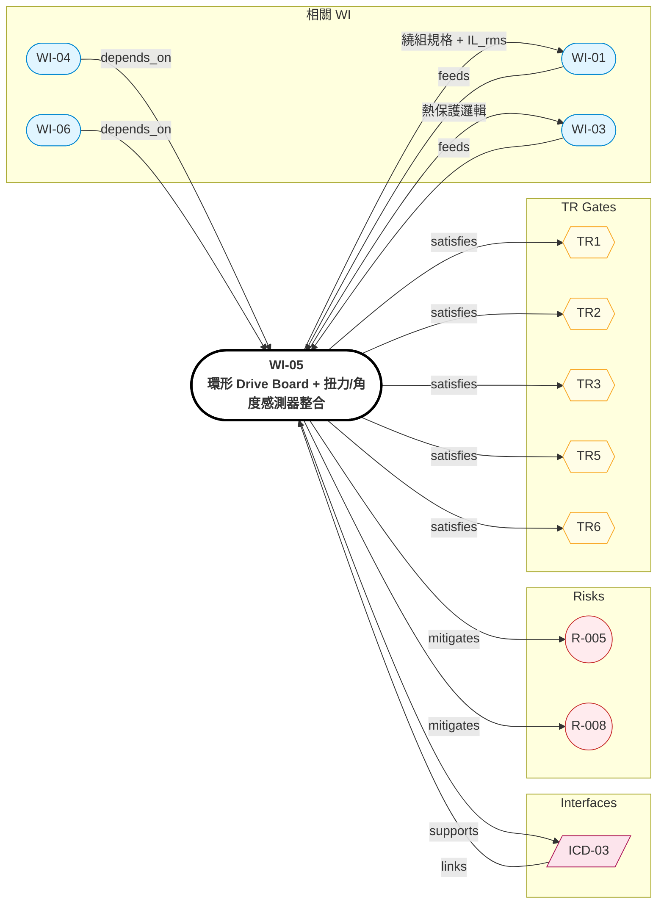

# WI-05: 環形 Drive Board + 扭力/角度感測器整合

> **版本**: 1.0 | **日期**: 2026-04-28
> **負責域**: 電子（PCB/控制）
> **前置條件**: WI-01 繞組規格、WI-03 熱保護策略
> **產出物**: PCB layout、MCU firmware spec、感測器規格、EMI 屏蔽方案
> **預估工時**: 4 週
> **阻塞下游**: WI-04（endcap 設計）、ICD-03

## Relations Graph (auto-generated)

<!-- AUTO-GRAPH:START view=ego -->

<!-- AUTO-GRAPH:END -->

---

## 溯源

| WI 章節 | TRIZ 來源 |
|:--------|:----------|
| 環形 PCB 配合 coaxial 封裝 | 系統規格 + WI-04 |
| MCU 過熱保護邏輯 | WI-03 Step 5 |
| Pedaling Torque/Angle 感測 | FA components / 系統規格 |
| EMI 屏蔽（vs Halbach 漏磁） | R-005 緩解 |

## 設計輸入

| 參數 | 值 | 單位 | 來源 |
|:-----|:---|:-----|:-----|
| Form factor | 環形 OD ≤ 105 mm，內徑 ≥ 30 mm（讓中軸通過） | mm | WI-04 |
| Power input | 36V/48V battery | V | 標準 e-bike |
| Phase current | 從 WI-01 IL_rms | A | WI-01 |
| MOSFET T_j_max | 150 | °C | datasheet |
| Operating ambient | -20 ~ +60 | °C | 工況 |

## Step 1: PCB Layout

1. 環形 4 層板（power plane + signal + GND）
2. 6 顆 MOSFET（3-phase H-bridge）配置在外環，散熱面朝外（接 Al endcap heat path）
3. MCU + gate driver 內環
4. 扭力感測器接口 + 角度感測器接口在內環

## Step 2: MCU 韌體規格

依 WI-03 Step 5 實作熱保護：

| T_winding | 動作 |
|:----------|:-----|
| < 110°C | Normal |
| 110~115°C | 限流 80% |
| 115~118°C | 限流 50% + 騎士告警 |
| > 118°C | 切斷輸出 |

NTC 訊號鏈：3-wire bridge，ADC 12-bit，精度 ≤ ±2°C @ 工作範圍

## Step 3: 扭力/角度感測

| 元件 | 類型 | 廠商範例 |
|:-----|:-----|:---------|
| 扭力感測器 | NCTE 磁致伸縮（hollow shaft） | NCTE 2400 series |
| 角度感測器 | 磁編碼器 + 12-bit | AS5048 / AMS |

整合於中軸：
- NCTE sensor 環繞中軸 ~10 mm 段
- AS5048 + 軸端磁鐵 4 mm OD

## Step 4: EMI 屏蔽（R-005 緩解）

1. Halbach 漏磁進入 PCB 區估算（FEA-Mag from WI-01）
2. PCB 與 rotor 間距離 ≥ 8 mm + 軟磁屏蔽片（mu-metal 0.3 mm）
3. 訊號線雙絞 + ferrite bead
4. ADC 訊號線遠離 MOSFET PWM 路徑

## Step 5: 散熱介面

1. MOSFET TIM (thermal interface material) + endcap Al 散熱
2. 電解電容遠離 NdFeB 區（避高溫）

## 驗證

- V11 PCB 功能：基本通訊、PWM 輸出
- V12 EMI：訊號雜訊 < 5% baseline
- V14 系統整合：全功率輸出 + 熱保護觸發

## 交付物

| # | 交付物 | 接收者 |
|:--|:-------|:-------|
| 1 | PCB schematic + layout (Gerber) | 採購 |
| 2 | MCU firmware spec (熱保護 + control loop) | EE |
| 3 | 感測器選型 + spec sheet | 採購 |
| 4 | EMI 屏蔽方案 | WI-04, ICD-03 |
| 5 | BOM 元件清單 | 採購 |

### TR Gate Checklist

| Gate | 檢查項目 |
|:-----|:---------|
| TR1 | PCB block diagram + 熱保護邏輯確認 |
| TR2 | 元件 nominated（MOSFET、MCU、sensor）；EMI 模擬通過 |
| TR3 | Layout + Gerber 凍結；DFM PCB review |
| TR5 | PCB 上電功能 + sensor signal 確認 |
| TR6 | V11、V12、V14 |
