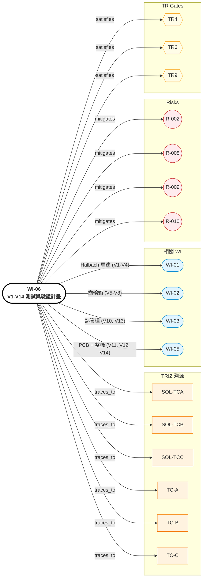

# WI-06: V1-V14 測試與驗證計畫

> **版本**: 1.0 | **日期**: 2026-04-28
> **負責域**: 測試與驗證
> **前置條件**: WI-01~05 子系統設計凍結
> **產出物**: 驗證矩陣、測試規格、治具設計、Pass/Fail 判定
> **預估工時**: 4 週測試治具 + 4-6 週實測
> **阻塞下游**: TR6 Alpha 驗證 → TR9 DVP&R

## Relations Graph (auto-generated)

<!-- AUTO-GRAPH:START view=ego -->

<!-- AUTO-GRAPH:END -->

---

## 溯源（從 Step 4 驗證計畫）

| 驗證 ID | 對應 TC / SOL | TRIZ 來源 |
|:--------|:--------------|:----------|
| V1 (B_g) | SOL-TCB | TC-B Halbach 增益 |
| V2 (peak torque density) | SOL-TCB | TC-B 扭力密度 |
| V3 (cogging) | SOL-TCB | Halbach 製造容差 R-005 |
| V4 (efficiency map) | SOL-TCB / Loss map | WI-01 |
| V5 (peak torque hold) | SOL-TCC | TC-C |
| V6 (gearbox efficiency) | SOL-TCC | EHD |
| V7 (NVH dB(A)) | SOL-TCC | 噪音目標（**R-002 待 baseline**） |
| V8 (durability initial 1k cycles) | SOL-TCC | 修形齒疲勞 |
| V9 (system efficiency) | 全 TC | 整機 |
| V10 (peak 30s 溫升) | SOL-TCA | TC-A PCM |
| V11 (PCB function) | WI-05 | 控制 |
| V12 (EMI) | R-005 | 漏磁干擾 |
| V13 (cont 1hr housing T) | SOL-TCA | PCM 飽和邊界 |
| V14 (system integrated) | 全 TC + SIM 協同 | A×B、A×C |

## 驗證矩陣

| ID | 項目 | 量測指標 | Pass 標準 | 設備 | TR Gate |
|:---|:-----|:---------|:----------|:-----|:--------|
| **V1** | Halbach B_g | T (air gap 中心) | ≥ 0.85 T | Hall probe (Lakeshore) | TR6 Phase A |
| **V2** | Peak torque density | T_peak / m | ≥ 50 Nm/kg | Dyno (Magtrol) + 重量 | TR6 Phase A |
| **V3** | Cogging torque | % peak | ≤ 5% | Dyno 微調轉速 | TR6 Phase A |
| **V4** | Efficiency map | η vs (RPM, T) | ≥ 88% peak | Dyno + power analyzer | TR6 Phase A |
| **V5** | Gearbox peak hold | torque @ 125 Nm × 10s | 無破壞 | Dyno | TR6 Phase B |
| **V6** | Gearbox efficiency | η_gear | ≥ 92% (1:32.5) | Dyno 雙端扭矩 | TR6 Phase B |
| **V7** | NVH | dB(A) @ 1m, 60 rpm cadence | ≤ HPR50 baseline | 半消音室 + microphone array | TR6 Phase B |
| **V8** | Durability initial | 1,000 cycles 100 Nm | 無齒面磨耗超 spec | Dyno cycle | TR6 Phase B |
| **V9** | System efficiency | wheel power / battery power | ≥ 80% | 整機 dyno | TR6 Phase D |
| **V10** | Peak 30s 溫升 | T_winding | < 120°C | 嵌入式 NTC + IR | TR6 Phase C |
| **V11** | PCB function | Phase current, comm | 基本功能 | bench test | TR6 Phase D |
| **V12** | EMI | sensor noise | < 5% signal | scope + EMI 環境 | TR6 Phase D |
| **V13** | Cont 1hr housing T | T_surface | ≤ 80°C | thermal couple + IR | TR6 Phase C |
| **V14** | Integrated | 同步通過 V1-V13 | 全 PASS | full setup | TR6 Phase D |

## DVP&R 計畫骨架（TR9）

| 類別 | 測試 | 標準 |
|:-----|:-----|:-----|
| 耐久 | 100,000 cycles 125 Nm peak | 無破壞、無 retention loss > 5% |
| 環境 | -20 / +50°C 全溫域功能 | spec 達標 |
| 防水 | IP67 浸泡 30 min | 無進水 |
| 安全 | EN 15194 / ISO 4210 | 通過 |
| EMC | EN 15194 EMC 部分 | 通過 |

## 測試治具

| 治具 | 用途 | 備註 |
|:-----|:-----|:-----|
| Coaxial dyno 接口 | 接 motor input + output sprocket | 兩端扭矩量測 |
| Hall probe fixture | air gap 量測 | 可旋轉量測軸向均勻性 |
| 半消音室固定架 | NVH | 振動隔離 + microphone 1m 標定 |
| Climatic chamber | -20/+50 環境測試 | TR9 |

## 交付物

| # | 交付物 | 接收者 |
|:--|:-------|:-------|
| 1 | V1-V14 測試規格 + 治具 | 測試實驗室 |
| 2 | 測試報告（每項 1 份） | TR6 review |
| 3 | DVP&R 計畫（TR9 用） | TR9 |
| 4 | FEA-vs-實測對比報告 | 模型修正 |

### TR Gate Checklist

| Gate | 檢查項目 |
|:-----|:---------|
| TR4 | 治具設計完成；測試實驗室排程 |
| TR6 | V1-V14 全 pass；FEA 偏差 < 20% |
| TR9 | DVP&R 全項通過 |
