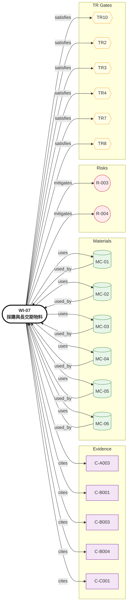

# WI-07: 採購與長交期物料

> **版本**: 1.0 | **日期**: 2026-04-28
> **負責域**: 採購 / 供應鏈
> **前置條件**: WI-01~05 BOM 草稿
> **產出物**: 供應商評估報告、長交期物料清單、替代材料計畫、Beta BOM
> **預估工時**: 持續，與 TR1-TR4 並行
> **阻塞下游**: TR4 原型備料、TR8 量產 BOM 凍結

## Relations Graph (auto-generated)

<!-- AUTO-GRAPH:START view=ego -->

<!-- AUTO-GRAPH:END -->

---

## 溯源

採購 BOM 從 Step 4 evidence_registry 展開：

| Evidence | 材料 | MC | Confidence | 採購策略 |
|:---------|:-----|:---|:-----------|:---------|
| C-A001 Cu k=401 W/mK | Cu C11000 條材 | MC-05 | HIGH | 現貨 |
| C-A002 Al-6061 k=167 | Al-6061-T6 鑄錠/壓鑄件 | MC-04 | HIGH | 現貨 |
| C-A003 RT55 PCM ΔH=200 kJ/kg | Rubitherm RT55 微囊化 | MC-06 | MEDIUM | 中歐進口，6-12週 |
| C-A004 RT55 T_melt 55°C | 同上 | MC-06 | HIGH | — |
| C-B001 NdFeB N42SH B_r=1.32T | NdFeB Halbach 段 | MC-01 | HIGH | 中日廠商，4-8週 |
| C-B002 Halbach +30~40% | (FEA 驗證) | — | MEDIUM | 製造工藝 |
| C-B003 SMC Somaloy 700-5P sat=1.6T | Höganäs SMC 模壓件 | MC-02 | HIGH | 瑞典進口 + 模具開發，10-16週 |
| C-B004 CFRP tip speed 200 m/s | T700 + 環氧複材纏繞 | MC-03 | LOW | 委外纏繞廠，需 datasheet 驗證 |
| C-C001 修形降噪 6~12 dB(A) | 20MnCr5 + 磨齒修形 | (內部齒輪) | MEDIUM | 國內精密齒輪廠，6-10週 |
| C-C003 EHD 油膜 0.1~1μm | PAO 8 + MoS₂ 1~3% | (油料) | MEDIUM | 現貨 |

## 長交期物料清單（依交期排序）

| 物料 | 交期 (週) | 供應商候選 | 風險 | TR Gate |
|:-----|:----------|:-----------|:-----|:--------|
| **SMC Somaloy 700-5P 模壓 stator** | 10–16 | Höganäs（材料）+ 國內模壓廠 | 模具開發成本高 | TR4 必須下單 |
| **NdFeB N42SH Halbach segments** | 4–8 | Bomatec / Arnold / Hitachi | 磁化角度公差 ±0.5° | TR4 |
| **CFRP 套筒纏繞** | 6–10 | 委外複材廠 | spec sheet 取得（**R-004**） | TR4 |
| **修形齒輪（行星 + 偏心擺線）** | 6–10 | 國內精密齒輪廠 | 修形設備能力 | TR4 |
| **AS5048 / NCTE 感測器** | 4–6 | AMS / NCTE | 商用品 | TR3-4 |
| **環形 PCB 4 層 + MOSFET** | 4–6 | 國內 PCB 廠 + Infineon | 環形佈局工藝 | TR4 |
| **RT55 PCM 微囊** | 6–12 | Rubitherm（德國） | 進口物流 | TR4-5 |
| **軸承（角接觸 + 圓柱滾子 + 滾針）** | 4 | NSK / SKF / 國產 | 商用 | TR3 |
| **Cu C11000 嵌件加工件** | 3–4 | 國內精密加工 | 過盈配合公差 | TR3 |

## 替代材料計畫（Confidence = LOW 物料）

| 主案 | 風險 | 替代方案 |
|:-----|:-----|:---------|
| CFRP T700 50%V_f 套筒（C-B004 LOW） | 容許 tip speed 未驗證 | A) Inconel 薄壁 sleeve（重但驗證充分） B) 玻璃纖維 + 碳混編 |
| RT55 PCM（單一供應商）| 物流風險、單供 | A) Croda Crodatherm 系列 B) PureTemp 系列 |
| SMC Somaloy（單一）| 進口 + 模具 | A) M-19 矽鋼片層壓 stator（傳統，鐵損高）B) 國產 SMC 替代 |

## 供應商評估流程

1. RFQ 發出（TR2 起）
2. 樣品 + datasheet review（TR3）
3. 製程能力 audit（TR7 前必須完成）
4. PPAP-style 等效文件包（TR10）

## 量產採購策略

| 階段 | 策略 |
|:-----|:-----|
| TR3 詳設 | 1 主供應商 + 1 替代供應商 nominated |
| TR4 備料 | 主供應商正式下單，替代供應商備案 |
| TR8 Beta | 量產 BOM 凍結（含正式量產供應商） |
| TR10 量產 | 第二供應商雙料源建立（critical 物料） |

## 交付物

| # | 交付物 | 接收者 |
|:--|:-------|:-------|
| 1 | 完整 BOM（Alpha + Beta） | 全部 WI |
| 2 | 供應商評估報告 | TR2-TR8 |
| 3 | 長交期物料追蹤表（每週更新） | TR4 |
| 4 | 替代材料計畫 | Risk Register |

### TR Gate Checklist

| Gate | 檢查項目 |
|:-----|:---------|
| TR2 | 關鍵物料供應商 nominated |
| TR3 | 全部 BOM 凍結 |
| TR4 | 長交期物料下單；交期確認 |
| TR7-8 | DFM review with 供應商；Beta BOM 量產 supplier |
| TR10 | 雙料源建立（critical）；PPAP 簽核 |
