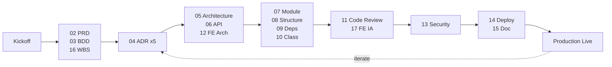

# 工作流程手冊 — RD Design Copilot

---

**文件版本**：`v1.0`
**最後更新**：`2026-04-28`
**狀態**：`Active`
**模板來源**：`VibeCoding_Workflow_Templates/00_workflow_manual.md`

---

## 1. 模式選擇

VibeCoding 工作流提供兩種模式：

| Mode | 適用 | 文件數量 | 預估時程 |
|:-----|:-----|:---------|:---------|
| **Full Process** (A0-A6) | 多團隊、長期、關鍵任務 | 17 份 | 數週至數月 |
| **MVP Lean** (B0-Bx) | 快速驗證、單人/小團隊 | 3 份核心 + 必要支援 | 數天至數週 |

### RD Design Copilot 採用：**Full Process**

**理由**：
- 跨團隊（前端、後端、AI、SRE、TRIZ-SME、RD-SME）
- 長期專案（MVP→Beta→GA 至少 9 個月）
- 嵌入企業關鍵業務流程（設計審查、Gate 簽核、知識資產）
- 需通過 OWASP / WCAG 合規

---

## 2. Full Process 階段（A0-A6）

```
A0 Kickoff
  ├── 02_prd                  ✅ FULL
  ├── 03_bdd_guide            ✅ FULL
  └── 16_wbs                  ✅ FULL

A1 Architecture Decision
  └── 04_adr (5 ADRs)         🔄 stub

A2 System & API Design
  ├── 05_architecture         ✅ FULL
  ├── 06_api_spec             ✅ FULL
  └── 12_frontend_architecture ✅ pointer

A3 Detailed Design
  ├── 07_module_spec          ⏳ skeleton
  ├── 08_project_structure    ⏳ skeleton
  ├── 09_file_dependencies    ⏳ skeleton
  └── 10_class_relationships  ⏳ skeleton

A4 Development & Quality
  ├── 11_code_review          ⏳ skeleton
  └── 17_frontend_ia          ✅ pointer

A5 Security
  └── 13_security_checklist   ⏳ skeleton

A6 Deployment & Ops
  ├── 14_deployment_ops       ⏳ skeleton
  └── 15_documentation_guide  ⏳ skeleton
```

---

## 3. Gate 條件與里程碑

### 3.1 文件 Gate（產品開發階段）

| Gate | 條件 | 簽核 |
|:-----|:-----|:-----|
| Kickoff Approved | PRD + BDD + WBS 完成審核 | PM + TL + PO |
| Architecture Approved | Architecture + API + 5 ADRs 完成 | TL + ARCH + Security |
| Design Approved | Module Spec + Structure + Dependencies + Class | TL + ARCH |
| Pre-Launch Approved | Security Checklist 全綠燈 | SEC + SRE |
| Production Live | Deployment 完成 + Monitor 上線 | SRE + PM |

### 3.2 業務 Gate（用戶專案運行時，每個用戶專案會走）

引用 [`02_prd.md §4.1`](./02_prd.md) + [`03_bdd_guide.md`](./03_bdd_guide.md)：
- Phase I: D1 (Brief) → D2 (Explore) → Phase Gate D
- Phase II: X1 (Track) → X2 (Create) → P (PreCAD) → Phase Gate X
- Phase III: G5 (Review) → G6 (Decide) → G7 (Feynman) → Phase Gate V

> **Flow Contract 對齊（[18_flow_contract.md §2](./18_flow_contract.md)）**：
> 以上為 PRD 完整遠景。TR0 階段 Gate 層級分析結論：
> - **COVERED**（由 TRIZ 內部 gates 覆蓋）：D1 → G0, D2 → G1, X1 → navigation, X2 → G2
> - **SIMPLIFIED**：P → 合併至 triz-verify `cad_readiness`（Phase 6）
> - **DEFERRED**：G5 → Beta, G6 → Beta, G7 → GA

### 3.3 工程 Gate（TR0-TR10）

詳見 [`16_wbs.md §4`](./16_wbs.md) + `docs/_harness/engineering/tr_gate_framework.md`。

---

## 4. 文件職責矩陣 (RACI)

| 文件 | R | A | C | I |
|:-----|:--|:--|:--|:--|
| 02_prd | PO | PM | TL, UX | All |
| 03_bdd_guide | TL | PO | QA, UX | All |
| 04_adr | ARCH | TL | All TL+ | All |
| 05_architecture | ARCH | TL | BE, FE, SRE | All |
| 06_api_spec | TL | ARCH | BE, FE | All |
| 16_wbs | PM | PM | All | All |
| 13_security_checklist | SEC | SRE | All | All |
| 14_deployment_ops | SRE | TL | BE, FE | All |

R = Responsible（執行者）, A = Accountable（最終負責）, C = Consulted（諮詢）, I = Informed（知會）

---

## 5. 流程圖



---

## 文件溯源

- 模板：`VibeCoding_Workflow_Templates/00_workflow_manual.md`
- 後續：[`01_cookbook.md`](./01_cookbook.md) 哲學對齊
