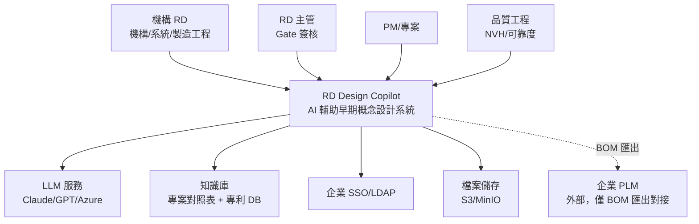
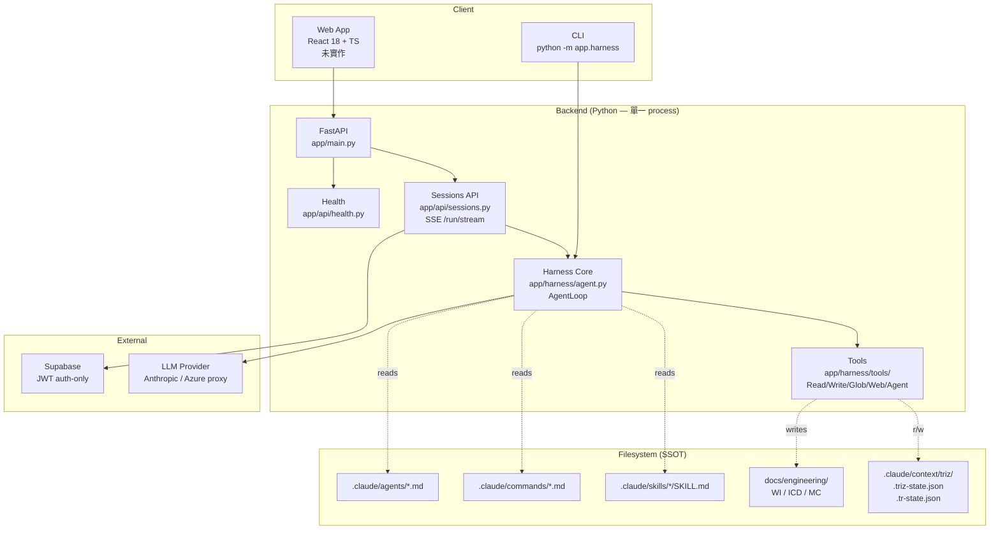
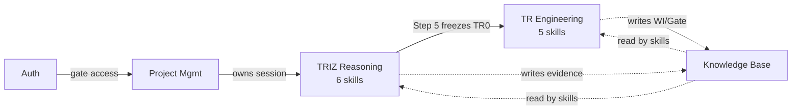
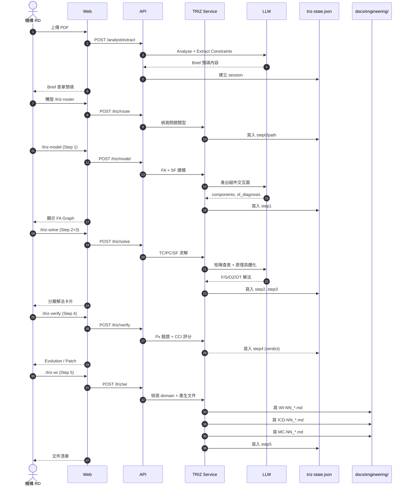
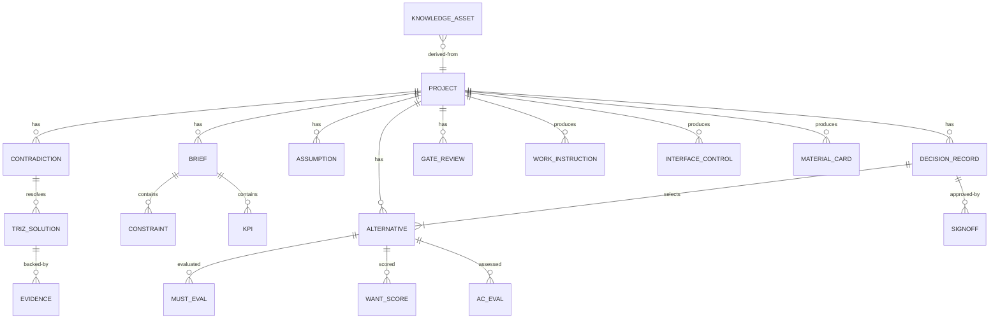

# 系統架構與設計文件 — RD Design Copilot

---

**文件版本**：`v1.1`（對齊 08 v2.0 harness-first 現況）
**最後更新**：`2026-04-28`
**主要作者**：架構師（草稿由 AI Agent 整合產出）
**審核者**：技術負責人、產品經理
**狀態**：`Active`
**模板來源**：`templates/vibecoding/05_architecture_and_design_document.md`

> ## ⚠️ 現況 vs 演化目標
>
> 本檔混合 **「現況」與「演化目標」** 兩類陳述。請依以下原則閱讀：
>
> - **現況（M1-M4 已建構）**：§1.1（C4 Context + Container 簡化版）、§1.4 ADR 列表、§2 NFR 表、§3.2 TRIZ Step 序列圖、§4 技術棧（FastAPI + Anthropic SDK + Supabase auth + harness）、§7 跨切面、§8 風險。對齊 [`08_project_structure.md`](./08_project_structure.md) v2.0。
> - **演化目標（v2/v3 規劃，尚未實作）**：§1.2 DDD 概念域圖（**markdown-only，不是 Python class**）、§5 Data architecture（pgvector + Redis 為未來）、§6.3 多服務拓撲、§9 v2.0/v3.0 路線。**今天 backend 沒有 Domain class、沒有 PostgreSQL、沒有 Redis、沒有微服務**。
> - **Clean Architecture 章節（§1.3）已替換**：本系統採 **harness-first**（業務邏輯在 markdown skills），不採 Domain/Application/Infrastructure 三層 Python class 切分。
>
> **新功能加入時務必對齊 08 v2.0**：先寫 SKILL.md → 不夠加 Tool → 最後改 AgentLoop。不引入 Domain class / Repository / Use Case 層。

---

## 目錄

- [Part 1：架構總覽](#part-1架構總覽)
  - [1.1 C4 模型](#11-c4-模型)
  - [1.2 DDD 戰略設計](#12-ddd-戰略設計)
  - [1.3 Clean Architecture 分層](#13-clean-architecture-分層)
  - [1.4 技術選型與 ADR 連結](#14-技術選型與-adr-連結)
- [2. 需求摘要](#2-需求摘要)
- [3. 高層架構](#3-高層架構)
- [4. 技術棧](#4-技術棧)
- [5. 資料架構](#5-資料架構)
- [6. 部署與基礎設施](#6-部署與基礎設施)
- [7. 跨切面關注](#7-跨切面關注)
- [8. 風險與緩解](#8-風險與緩解)
- [9. 架構演化路線](#9-架構演化路線)
- [Part 2：詳細設計](#part-2詳細設計)
  - [2.1 MVP 與模組優先級](#21-mvp-與模組優先級)
  - [2.2 核心模組設計](#22-核心模組設計)
  - [2.3 NFR 設計](#23-nfr-設計)

---

## Part 1：架構總覽

### 1.1 C4 模型

#### 1.1.1 Context Diagram



#### 1.1.2 Container Diagram（現況 — M1-M4）



**演化目標（未實作）**：拆 TRIZ Service / Knowledge Service 為獨立 process、引入 PostgreSQL + pgvector + Redis、加 S3/MinIO 大檔。觸發條件見 [`04_adr/ADR-006`](./04_adr/ADR-006_production_persistence.md) 與 [`ADR-007`](./04_adr/ADR-007_multi_tenancy.md)。

#### 1.1.3 Component Diagram（TRIZ Service 內部）

```
TRIZ Service
├── triz-router       (主入口路由)
├── triz-scoping      (Step 0 — 5Why/KT/CECA)
├── triz-model        (Step 1 — FA + SF 建模)
├── triz-contradict   (Step 2+3 — TC/PC/SF 求解)
├── triz-verify       (Step 4 — Px 驗證 + CCI 評分)
├── triz-wi           (Step 5 — WI/ICD/MC 產出)
└── State Machine     (.triz-state.json 持久化)
```

完整 11 張 UML 流程圖見 `docs/methodology/uml/`。

---

### 1.2 概念域圖（**markdown-only，不是 Python class**）

> **重要**：以下「Bounded Context」是 **思考工具**，幫團隊討論職責邊界。實作上**不存在 Python Domain class**，每個 context 的業務邏輯活在 `.claude/skills/*/SKILL.md` 與 `docs/engineering/` 的 markdown 檔。

| Context | 職責 | 實作位置 |
|:--------|:-----|:---------|
| **Project Management** | 專案生命週期、Phase Gate 進展 | `app/api/sessions.py` 內 SessionRecord（in-memory）+ 未來 Supabase persistence（ADR-006） |
| **TRIZ Reasoning** | Step 0-5 推理閉環 | `.claude/skills/triz-{router,scoping,model,contradict,verify,wi}/SKILL.md` body + `.claude/context/triz/.triz-state.json` |
| **TR Engineering** | TR0-TR10 工程執行 | `.claude/skills/tr-{router,gate,fea-assist,test-report,dfm}/SKILL.md` + `docs/engineering/` 寫入產物 |
| **Knowledge Base** | 6 類資產管理 | `docs/methodology/` + `knowledge/triz/`（人撰寫，Skill 透過 Read tool 讀） |
| **User & Permission** | 認證、授權 | `app/middleware/auth.py`（Supabase JWT） |
| **Analyst** | AI 約束萃取、蘇格拉底提問、多 TC fan-out | `triz-analyst` subagent（TRIZ Step 2 fan-out worker，設計依據 DK-03 §6-7）；黑帽質疑延後至 Beta（[18_flow_contract.md §3](./18_flow_contract.md)） |



**關鍵邊界**：Triz Step 5 → TR0 是強邊界，TRIZ 概念凍結（產出 WI/ICD/MC）後才進入 TR0-TR10。

---

### 1.3 Harness 分層（取代 Clean Architecture）

```
┌──────────────────────────────────────────────────────┐
│  Interface Layer                                     │
│  CLI (app/harness/cli.py) | HTTP (app/api/sessions.py)│
├──────────────────────────────────────────────────────┤
│  Agent Loop                                          │
│  app/harness/agent.py — AgentLoop（run + stream）   │
├──────────────────────────────────────────────────────┤
│  Skill / Command / CustomAgent Loaders               │
│  app/harness/{skill,command,agents}.py               │
├──────────────────────────────────────────────────────┤
│  Tool Registry + Tools                               │
│  app/harness/tools/{base,registry,fs,web,agent}.py   │
├──────────────────────────────────────────────────────┤
│  Client Adapter                                      │
│  app/harness/config.py — Anthropic SDK / Azure proxy │
├──────────────────────────────────────────────────────┤
│  Filesystem SSOT                                     │
│  .claude/{skills,commands,agents,context}/           │
│  docs/{engineering,docs/methodology,_harness}/      │
└──────────────────────────────────────────────────────┘
```

**核心原則**：
- 業務邏輯活在 markdown（SKILL body），不在 Python class
- Tools 是基礎設施 action，永遠域無關
- State 在 filesystem JSON（`.claude/context/`），不在 ORM

詳見 [`08_project_structure.md`](./08_project_structure.md) §1-3。

---

### 1.4 技術選型與 ADR 連結

| 決策 | 選擇 | ADR |
|:-----|:-----|:----|
| 前端框架 | React 18 + TypeScript | [ADR-001](./04_adr/ADR-001_frontend_stack.md) |
| 狀態管理 | Zustand + React Query + React Hook Form | [ADR-001](./04_adr/ADR-001_frontend_stack.md) |
| TRIZ 推理 | Skill-based（6 triz-* + 5 tr-*） | [ADR-002](./04_adr/ADR-002_triz_skill_architecture.md) |
| 後端框架 | Python + FastAPI | [ADR-003](./04_adr/ADR-003_backend_stack.md) |
| 資料庫 | （現況）Supabase auth-only；（未來）PostgreSQL + pgvector + Redis | [ADR-004](./04_adr/ADR-004_data_storage.md) |
| LLM 抽象層 | （現況）`harness/config.py` 偵測 Anthropic / Azure；（未來）LangChain | [ADR-005](./04_adr/ADR-005_llm_abstraction.md) |
| Sessions 持久化 | （現況）in-memory dict；（未來）Supabase | [ADR-006](./04_adr/ADR-006_production_persistence.md) |
| 多租戶 | （現況）單租戶 PoC；（未來）專案級 RLS | [ADR-007](./04_adr/ADR-007_multi_tenancy.md) |

---

## 2. 需求摘要

### 2.1 功能性需求（從 PRD §3 整理）

| Epic | 對應模組 | 對應 Skill |
|:-----|:---------|:-----------|
| 早期問題定義 | Analyst, Project Management | analyst, triz-scoping |
| 矛盾收斂 | TRIZ Reasoning | triz-model, triz-contradict |
| 方案發散 | TRIZ Reasoning | triz-contradict, triz-verify |
| 收斂決策 | TRIZ Reasoning, Project Management | triz-verify, KT pattern |
| 知識回寫 | Knowledge Base | knowledge agent |
| TR 工程執行 | TR Engineering | tr-*（5 個 skill） |

### 2.2 非功能性需求 (NFR Table)

| NFR | 類別 | 目標值 | 來源 |
|:----|:-----|:-------|:-----|
| LCP < 2.5 s | 效能 | < 2.5 s | KPI |
| INP < 200 ms | 效能 | < 200 ms | KPI |
| TRIZ Skill 響應 | 效能 | < 60 s | KPI-7 |
| 並發用戶 | 效能 | ≥ 50 | NFR-12 |
| 系統可用性 | 可靠性 | ≥ 99.5% | NFR-10 |
| 資料恢復時間 | 可靠性 | ≤ 4 hr | NFR-11 |
| WCAG 2.1 AA | 可用性 | 100% 合規 | NFR-15 |
| OWASP Top 10 | 安全 | 100% 覆蓋 | NFR-7-9 |
| SSO 支援 | 安全 | LDAP/SAML | NFR-8 |
| i18n | 可用性 | TC + EN | NFR-16 |

---

## 3. 高層架構

### 3.1 架構模式

**選擇**：Modular Monolith → Service-Oriented（漸進演化）

**理由**：
- MVP 階段業務邏輯耦合度高（TRIZ 推理閉環跨多模組），Monolith 開發快
- v2 階段拆出 TRIZ Service 為獨立服務（重 LLM 計算負載）
- 不採用 Microservices first，避免分散式複雜度過早引入

### 3.2 關鍵互動序列

#### TRIZ Step 0 → Step 5 完整流程



---

## 4. 技術棧

### 4.1 前端

| 項目 | 選擇 | 理由 |
|:-----|:-----|:-----|
| 框架 | React 18 | 既有設計系統規範、生態成熟 |
| 語言 | TypeScript | 大型專案必要 |
| 樣式 | Tailwind CSS | Atomic CSS、與 design-system 整合 |
| 狀態 | Zustand（全局）+ React Query（伺服器）+ React Hook Form（表單） | 輕量、各司其職 |
| 動畫 | Framer Motion | 聲明式 |
| 圖表 | Recharts | RWD 支援好 |
| 表格 | React Table | 大資料 + 排序/篩選 |
| 構建 | Vite + pnpm | 快速、節省磁碟 |
| 測試 | Vitest + Testing Library + Playwright | 三層測試 |

### 4.2 後端

| 項目 | 選擇 | 理由 |
|:-----|:-----|:-----|
| 語言 | Python 3.11+ | LLM 生態系成熟、TRIZ skill 用 Python |
| 框架 | FastAPI | 異步、自動 OpenAPI |
| ORM | SQLAlchemy 2.x | 主流、async 支援 |
| LLM 抽象 | LangChain / 自建 adapter | 多 provider 切換 |
| 任務佇列 | Celery + Redis | 長任務（TRIZ 求解）後台處理 |

### 4.3 資料

| 項目 | 選擇 | 用途 |
|:-----|:-----|:-----|
| 主資料庫 | PostgreSQL 15+ | 關聯資料 |
| 向量檢索 | pgvector | 知識庫 RAG |
| 快取 | Redis | session、API 快取 |
| 檔案儲存 | S3（雲）/ MinIO（本地） | 上傳檔案 |

### 4.4 基礎設施

| 項目 | 選擇 |
|:-----|:-----|
| 容器化 | Docker + Docker Compose（dev）/ Kubernetes（prod） |
| CI/CD | GitHub Actions |
| 監控 | Prometheus + Grafana |
| 日誌 | Loki / ELK |
| 錯誤追蹤 | Sentry |

---

## 5. 資料架構

### 5.1 核心實體模型



### 5.2 持久化策略

| 資料類型 | 儲存 | 持久化 |
|:---------|:-----|:-------|
| 用戶偏好 | LocalStorage | 否 |
| 認證 Token | HttpOnly Cookie | 否 |
| 專案核心資料 | PostgreSQL | 是 |
| 上傳檔案 | S3/MinIO | 是 |
| 向量索引 | pgvector | 是 |
| TRIZ session 工作記憶 | `.claude/context/triz/.triz-state.json` | 否（session 級） |
| TR gate 進展 | `.claude/context/triz/.tr-state.json` | 是（專案級） |
| 工程交付物 | `docs/engineering/`（Markdown） | 是 |

### 5.3 一致性策略

- **強一致性**：Project 核心資料（一個 PostgreSQL transaction）
- **最終一致性**：Knowledge Base 向量索引（async 更新，5-10 秒延遲可接受）
- **離線優先**：Skill 內部 state JSON 在 session 結束時 commit 到 git

### 5.4 內容位置邊界（重要）

引用 `.claude/CLAUDE.md` 政策：

| 內容性質 | 產出者 | 消費者 | 存放位置 |
|:---------|:-------|:-------|:---------|
| Session 過程記錄 | Skill | Skill | `.claude/context/triz/session-*.md` |
| 流程狀態（TRIZ） | Skill | Skill | `.claude/context/triz/.triz-state.json` |
| 流程狀態（TR） | Skill | Skill | `.claude/context/triz/.tr-state.json` |
| 工程交付物 | Skill（triz-wi） | 工程師（人） | `docs/engineering/` |
| 方法論知識庫 | 人 | Skill（參考） | `docs/methodology/` 或 `knowledge/triz/` |
| Gate review 報告 | Skill（tr-gate） | 工程師（人） | `docs/engineering/gate_reviews/` |

**核心原則**：狀態 JSON 只能由 Skill 修改，不可手動編輯。

### 5.5 Engineering Knowledge Graph Layer

`docs/engineering/` 下的工程交付物（WI/ICD/MC/Risk/KC）構成 **typed property graph**（17 nodes / 161 edges 於本實作；隨 session 增長）。本層補充 §5.1 ER 模型外的「跨檔案語義關聯」。

**設計三要素**：

```
YAML frontmatter   ──scan──▶  _graph.json  ──inject──▶  mermaid views
(SSOT, 人讀人寫)               (衍生 artifact)            (README / risk / ego)
        ▲                            ▲                          ▲
        │                            │                          │
   git diff 友善             tools/build_graph.py         GitHub/VSCode 自動渲染
```

| 元素 | 位置 | 角色 |
|:-----|:-----|:-----|
| frontmatter | 各 WI/ICD/MC 檔頭 YAML | **Single Source of Truth** |
| `_graph.json` | `docs/engineering/_graph.json` | 衍生 artifact（CI / 未來 skill 消費） |
| mermaid views | 注入到 README / risk_register / 各檔 ego marker | 人類視覺投影 |
| `tools/build_graph.py` | `tools/build_graph.py` | 維護工具（scan / lint / inject / scaffold） |

**節點類型**：WI / ICD / MC / KC / Risk / Gate / Claim / TC / SOL / Principle（10+ 種）
**邊類型**：traces_to / cites / uses / used_by / feeds / depends_on / supports_icd / links / mitigates / satisfies_gates / blocks / measures（11+ 種）

**為什麼不是 ER 模型？** §5.1 的 ER 是 PostgreSQL 持久化目標（多專案、多用戶），對應 ADR-006/007 的 Production 演化。**§5.5 是 markdown-first 知識圖**，活在 git 倉庫裡，per-session 產出，跟 PostgreSQL 並行不衝突。兩者交集是「Engineering 交付物」概念，但實作層完全分離。

**架構決策**：見 [`04_adr/ADR-008_knowledge_graph_as_ssot.md`](./04_adr/ADR-008_knowledge_graph_as_ssot.md)
**Schema**：見 [`15_documentation_guide.md §2.5`](./15_documentation_guide.md)
**工具行為**：見 [`09_file_dependencies.md §3`](./09_file_dependencies.md)

---

## 6. 部署與基礎設施

### 6.1 環境策略

| 環境 | 用途 | 部署 |
|:-----|:-----|:-----|
| Dev | 開發 | Docker Compose（本地） |
| Staging | 整合測試 | Kubernetes（小規模） |
| Production | 正式 | Kubernetes（HA） |

### 6.2 CI/CD Pipeline

```
git push
   ↓
GitHub Actions:
   ├── Lint (ESLint + ruff)
   ├── Type Check (tsc + mypy)
   ├── Unit Tests (Vitest + pytest)
   ├── Component Tests (Testing Library)
   ├── Build (Vite + Docker)
   ├── E2E Tests (Playwright)
   ├── Security Scan (npm audit + Snyk + Trivy)
   ├── Deploy to Staging (auto)
   └── Deploy to Production (manual approval)
```

### 6.3 部署拓撲

```
Internet → CloudFlare CDN → Load Balancer → Kubernetes Cluster
                                              ├── Web Pods (3 replicas)
                                              ├── API Pods (5 replicas)
                                              ├── TRIZ Pods (2 replicas, GPU optional)
                                              ├── Worker Pods (Celery, 3 replicas)
                                              └── Database (managed PG / RDS)
                                              └── Redis (managed / ElastiCache)
                                              └── S3 / MinIO
```

詳見 [`14_deployment_ops.md`](./14_deployment_ops.md)。

---

## 7. 跨切面關注

### 7.1 可觀測性

| 類別 | 指標 | 工具 |
|:-----|:-----|:-----|
| 性能 | LCP / INP / CLS | Web Vitals → Sentry |
| 錯誤 | JS 錯誤率、API 錯誤率 | Sentry |
| 業務 | KPI-1-8（PRD §2.3） | 自建儀表板 |
| LLM 用量 | Token 數、延遲、成本 | LangSmith / 自建 |

### 7.2 安全

詳見 [`13_security_checklist.md`](./13_security_checklist.md)。

### 7.3 隱私 by Design

- 用戶上傳檔案僅供本專案使用（不跨專案分享）
- 敏感欄位（如成本、專利）依 RBAC 控制存取
- LLM 呼叫不傳送用戶識別資訊（若使用第三方 LLM）

---

## 8. 風險與緩解

| 風險 | 影響 | 機率 | 緩解 |
|:-----|:-----|:-----|:-----|
| LLM 服務不穩定 | TRIZ skill 無法運作 | 中 | 多 provider fallback、cache 重複 query |
| TRIZ 推理品質不穩 | 方案誤導用戶 | 中 | Evidence Registry 強制要求、CCI 評分過濾 |
| 用戶不接受 AI 主動挑戰 | 採納率低（KPI-6 < 70%） | 中 | Onboarding 培訓、可關閉黑帽質疑 |
| 知識庫資料不全 | RAG 檢索失敗 | 高（初期） | MVP 階段允許手動上傳、漸進式累積 |
| 內網部署複雜度 | 客戶採用率低 | 中 | 提供 Docker Compose all-in-one |

---

## 9. 架構演化路線

```
v1.0 (MVP)：Modular Monolith
  ├── Web (React)
  ├── Backend (FastAPI Monolith)
  └── Skill = function calls in same process

v2.0 (Beta)：拆 TRIZ Service
  ├── Web
  ├── Backend
  └── TRIZ Service (獨立部署，gRPC)

v3.0 (GA)：完整微服務化
  ├── Web (CDN)
  ├── API Gateway
  ├── Project Service
  ├── TRIZ Service
  ├── TR Service
  ├── Knowledge Service
  └── Analyst Service
```

---

## Part 2：詳細設計

### 2.1 MVP 與模組優先級

| 優先級 | 模組 | MVP 必要 | 對應 Skill | 對應頁面 |
|:-------|:-----|:---------|:-----------|:---------|
| P0 | Project Management | ✓ | — | P03/P04 |
| P0 | Analyst (Brief 萃取) | ✓ | — | P05 |
| P0 | TRIZ Reasoning Step 0-3 | ✓ | triz-router/scoping/model/contradict | P06/P08 |
| P0 | TRIZ Step 4 (CCI) | ✓ | triz-verify | P09 |
| P1 | TRIZ Step 5 (WI 產出) | — | triz-wi | (CLI for now) |
| P1 | TR Engineering | — | tr-*（5 skill） | (CLI for now) |
| P1 | Knowledge Base | — | knowledge agent | P13/P14 |
| P2 | 協作審查（評論） | — | — | 多頁面 |

### 2.2 核心模組設計

詳見各 BC 的設計文件：
- TRIZ Reasoning：`docs/methodology/auto_triz_strategy.md` + `.claude/skills/triz-*/SKILL.md`
- TR Engineering：`docs/engineering/tr_gate_framework.md` + `.claude/skills/tr-*/SKILL.md`
- Project Management：[`07_module_spec.md`](./07_module_spec.md) §Project
- Analyst：[`07_module_spec.md`](./07_module_spec.md) §Analyst
- Knowledge Base：[`07_module_spec.md`](./07_module_spec.md) §Knowledge

### 2.3 NFR 設計

#### 性能（LCP < 2.5 s, INP < 200 ms）
- 路由級 code splitting（lazy + Suspense）
- 圖片 WebP + srcset + lazy loading
- 字體 woff2 + 子集化 + font-display: swap
- React.memo / useMemo 避免不必要 re-render
- 長列表用 react-virtuoso 虛擬化

#### TRIZ Skill < 60 s
- LLM 呼叫設 timeout（55 s）
- Cache LLM 結果（同 TC 重複求解 → 直接返回）
- 大 KB 檔（39 參數、矩陣、76 標準解）預載入記憶體
- 長任務（Step 5 WI 產生）轉 Celery 後台

#### 可靠性（≥ 99.5%）
- DB 主從複製
- App Server HA（≥ 2 replicas）
- Health check + auto-restart
- 每日備份 → 異地保存 7 天

---

## 文件溯源

- 模板：`templates/vibecoding/05_architecture_and_design_document.md`
- TRIZ 策略：`docs/methodology/auto_triz_strategy.md`
- 設計系統：`templates/design-system/specs/`
- UML：`docs/methodology/uml/00_domain_model.md` 至 `11_kb_integration.md`
- Skill 規格：`.claude/skills/triz-*/SKILL.md`、`.claude/skills/tr-*/SKILL.md`
- ADR：[`04_adr/`](./04_adr/)
- 結構 SSOT：[`08_project_structure.md`](./08_project_structure.md) v2.0

## 變更紀錄

| 日期 | 版本 | 變更 |
|:-----|:-----|:-----|
| 2026-04-28 | v1.1 | 對齊 08 v2.0：頂部加現況/演化警告；§1.1.2 Container Diagram 改為實際單一 process + filesystem SSOT；§1.2 改為「概念域圖（markdown-only）」；§1.3 改為 Harness 分層；§1.4 ADR 表加 ADR-006/007。§5 資料架構與 §9 演化路線維持為演化目標供日後規劃。 |
| 2026-04-28 | v1.0 | 初版（含 Clean Arch 與微服務拓撲；v1.1 已修正方向） |
