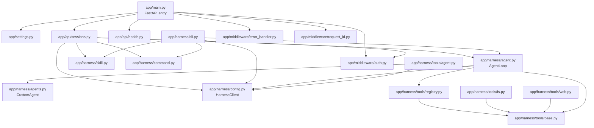
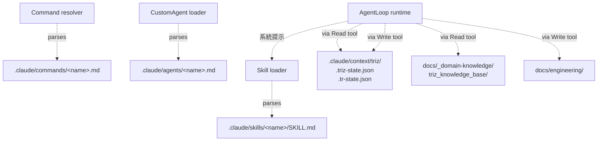

# 檔案依賴分析 — RD Design Copilot

---

**文件版本**：`v2.0`（完全覆寫，對齊 08 v2.0 harness-first）
**最後更新**：`2026-04-28`
**狀態**：`Active — replaces v1.0 Clean Arch DAG`
**模板來源**：`VibeCoding_Workflow_Templates/09_file_dependencies_template.md`

> **本檔定位**：依賴分析應反映實際 `backend/app/` 與 `.claude/` 的關係，不是虛構的 `api → application → domain → infrastructure` 層次。先前 v1.0 提的 layered DAG 與實際零相關，已棄用。

---

## 1. 核心依賴原則

1. **無 Python 循環**：`harness/` 與 `api/` 之間單向（api → harness）
2. **業務邏輯解耦**：Python 不依賴領域語義（TRIZ / TR 概念），語義在 `.claude/` markdown
3. **Tool 互不依賴**：每個 Tool 獨立、可單測；Tool 之間呼叫只透過 Registry dispatch
4. **Filesystem dependency 是運行時**：harness 啟動才讀 `.claude/`，不在 import 時

---

## 2. 後端依賴 DAG（現況）

### 2.1 Python 層



**核心規則**：
- `harness/*` 不可 import `api/*` 或 `middleware/*`（單向：api → harness）
- `harness/tools/*` 不可 import `harness/agent.py`（避免循環）— 唯一例外是 `tools/agent.py`（AgentTool）需 `Config` + `Agents`，但**不**需 `AgentLoop`（它自建內部 loop）
- `tools/agent.py::AgentTool` 的 sub registry 必須**排除** Agent tool 自己（防遞迴）

### 2.2 Filesystem 依賴（運行時）



**規則**：
- Python 程式碼**不直接** import / read `.claude/` 內任何檔；都透過 Skill/Command/CustomAgent loader 或 ToolRegistry dispatch
- 狀態 JSON 只能由 Skill 透過 Read/Write tool 操作；Python middleware 不直接讀寫

---

## 3. 模組職責定義

| 層 | 後端目錄 | 主要職責 | 輸出 |
|:---|:---------|:---------|:-----|
| Interface | `app/api/` + `app/harness/cli.py` | 接收 HTTP / CLI 請求，包成 AgentLoop 呼叫 | HTTP response / SSE / stdout |
| Loop | `app/harness/agent.py` | messages → tool dispatch → loop | AgentResult / HarnessEvent stream |
| Loaders | `app/harness/{skill,command,agents}.py` | 解析 markdown frontmatter + body | Skill / Command / CustomAgent dataclass |
| Tools | `app/harness/tools/` | 基礎 IO + 子代理 | ToolResult |
| Client | `app/harness/config.py` | LLM client 工廠 | HarnessClient |
| Middleware | `app/middleware/` | Auth / RequestID / ErrorHandling | (cross-cutting) |

前端目錄留待 `frontend/` 建立後另開（見 [`08_project_structure.md`](./08_project_structure.md) §11）。

---

## 4. 關鍵呼叫鏈

### 4.1 「使用者 HTTP /run 觸發 TRIZ 求解」

```
POST /api/v1/sessions/{id}/run
  ↓ app/api/sessions.py::run_session
  ↓   1. middleware.auth 驗 JWT
  ↓   2. 取 SessionRecord（in-memory dict）
  ↓   3. resolve_command(<cmd>)        ← app/harness/command.py
  ↓   4. load_skill(referenced_skill)  ← app/harness/skill.py
  ↓   5. registry = default_registry_with_agent(...)  ← app/harness/tools/registry.py
  ↓   6. AgentLoop(skill_body, registry, client, model)  ← app/harness/agent.py
  ↓   7. result = loop.run(user_input)
  ↓   8. 寫 SessionRecord.runs.append(...)
  ↓ HTTP 200 { final_text, iterations, tool_calls, stop_reason }
```

### 4.2 「CLI 觸發 TRIZ Step 1」

```
python -m app.harness /triz-model "問題描述"
  ↓ app/__main__.py → app/harness/cli.py::main
  ↓   1. 找 project root（含 .claude/）
  ↓   2. resolve_command("triz-model")
  ↓   3. load_skill 對應 skill
  ↓   4. 建 AgentLoop（含 Environment header: project_root + date）
  ↓   5. loop.run() → stdout
  ↓ exit 0 / 1 / 2
```

### 4.3 「Skill 寫入 .triz-state.json」

```
LLM 在 SKILL body 指示下決定呼叫 Write tool
  ↓ AgentLoop dispatch → ToolRegistry.dispatch("Write", input)
  ↓ WriteTool.run(path=".../.triz-state.json", content="...")
  ↓ Path.write_text → ToolResult(content="written N bytes")
  ↓ AgentLoop 將 ToolResult 寫回 messages，繼續迭代
```

### 4.4 「Subagent fan-out（Agent tool）」

```
AgentLoop 主迴圈呼叫 Agent tool
  ↓ AgentTool.run(subagent_name, prompt)
  ↓   1. 解析 .claude/agents/<name>.md
  ↓   2. 建 sub_registry（排除 Agent tool 自己）
  ↓   3. 建 inner AgentLoop（不同 system prompt）
  ↓   4. inner.run(prompt) → ToolResult.content
  ↓ 主迴圈拿到 ToolResult，繼續
```

---

## 5. 依賴風險與管理

### 5.1 風險

| 風險 | 後果 | 緩解 |
|:-----|:-----|:-----|
| 業務邏輯洩漏到 `harness/*` Python | 失去 domain-agnostic 性質 | Code review 鐵律：harness/ 不出現 TRIZ/TR/工程術語 |
| Agent tool 遞迴失控 | 無限子代理生成 | sub_registry_factory **強制**排除 Agent tool |
| Tool 互相 import | 失去獨立可測性 | Registry dispatch 為唯一 tool 之間互動方式 |
| Skill 直接 Python file IO | 違反 state 邊界 | Skill body 只能透過 Read/Write tool 操作 fs |
| LLM provider 寫死 Anthropic SDK | 換 provider 困難 | 統一透過 `harness/config.py::HarnessClient` |

### 5.2 自動化檢查

- 後端：`ruff` + `mypy --strict app/harness/`（強型別）
- 循環依賴：`pydeps app/ --max-bacon 3`
- CI 失敗條件：偵測到 `harness/*` import `api/*` 或 `middleware/*`
- Pre-commit hook：擋 `.claude/` 被 Python `open()` 直接讀（找字串 `.claude/skills/` 等）

---

## 6. 外部依賴管理

| 依賴 | 鎖定版本 | 升級策略 |
|:-----|:---------|:---------|
| FastAPI | 0.115.x | minor 自動、major 須 ADR |
| Anthropic SDK | 0.42.x | minor 自動；新 model 釋出時優先測試 |
| mcp | 1.0.x | minor 自動 |
| Supabase | 2.12.x | minor 自動（auth-only） |
| PyJWT | 2.8.x | minor 自動 |
| httpx | 0.28.x | minor 自動 |
| pydantic | 2.10.x | minor 自動 |
| tavily-python | 0.5.x | optional 依賴；缺失時 WebSearch 自動降級 |

**未引入**（v1.0 計畫但實際沒用）：
- ~~SQLAlchemy~~（無 DB 層）
- ~~LangChain~~（直接用 Anthropic SDK；ADR-005 為演化目標）
- ~~Celery~~（無背景任務）
- ~~React~~（前端尚未實作）

工具：Dependabot（已啟用）、Snyk（待加入）。

---

## 文件溯源

- 模板：`VibeCoding_Workflow_Templates/09_file_dependencies_template.md`
- 對齊：[`08_project_structure.md`](./08_project_structure.md) v2.0、[`05_architecture.md`](./05_architecture.md) v1.1
- 實作驗證：`backend/app/` 全樹

## 變更紀錄

| 日期 | 版本 | 變更 |
|:-----|:-----|:-----|
| 2026-04-28 | v2.0 | 完全覆寫：DAG 改為實際 harness 內部依賴 + filesystem 運行時依賴。先前 v1.0 的 `api → application → domain → infrastructure` 分層 DAG 與實際零相關，已棄用。 |
| 2026-04-28 | v1.0 | 初版（Clean Arch 分層 DAG；方向錯誤被 v2.0 取代） |
