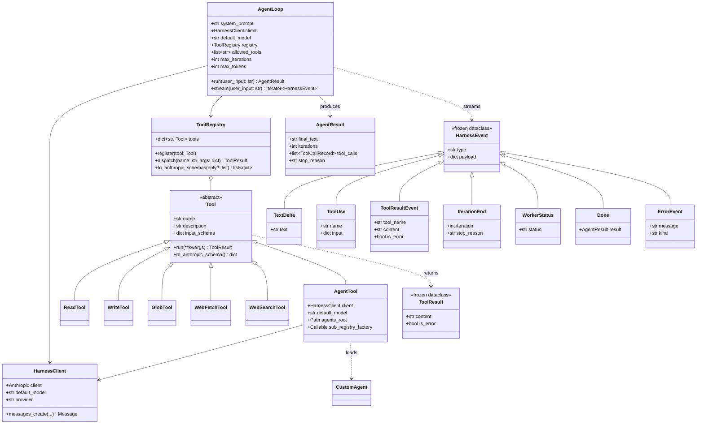
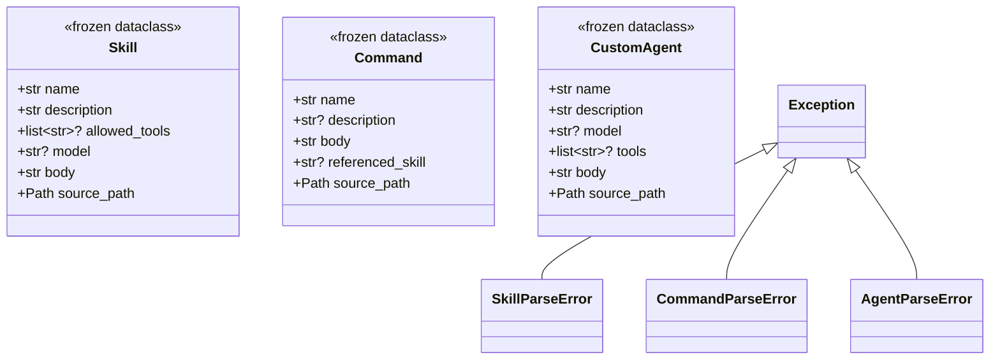
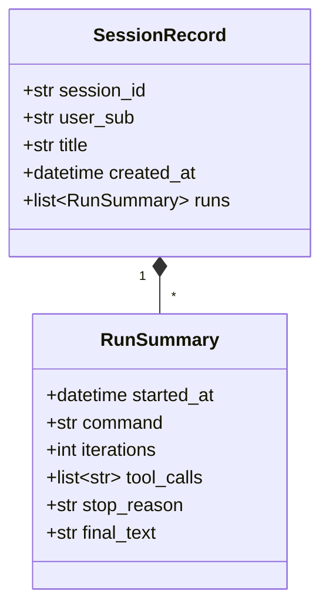

# 類別關係圖 — RD Design Copilot

---

**文件版本**：`v2.0`（完全覆寫，對齊 08 v2.0 harness-first）
**最後更新**：`2026-04-28`
**狀態**：`Active — replaces v1.0 fictional Domain UML`
**模板來源**：`VibeCoding_Workflow_Templates/10_class_relationships_template.md`

> **本檔定位**：UML 類別圖反映**實際存在的 Python class**（harness runtime + dataclasses），不是虛構的 Domain entities。先前 v1.0 提的 `Project / Brief / Contradiction / TrizSolution` Python class 在 backend 不存在 — 這些概念活在 `.claude/skills/` markdown 與 `.claude/context/triz/.triz-state.json`，已從本檔刪除。

---

## 1. 範圍

本檔聚焦於 `backend/app/harness/` 與相關 dataclass，這些是現行 backend 唯一存在的 OO 結構。
TRIZ / TR 領域的「類別」其實是 markdown 與 JSON state — 見 [`08_project_structure.md`](./08_project_structure.md) §2-3。

---

## 2. Harness 核心類別圖



---

## 3. Loaders（解析 markdown frontmatter + body）



**Loader functions**：

```python
# app/harness/skill.py
def parse_skill(path: Path) -> Skill: ...
def load_skill(skills_root: Path, name: str) -> Skill: ...

# app/harness/command.py
def parse_command(path: Path) -> Command: ...
def resolve_command(commands_root: Path, name: str) -> Command: ...
def extract_referenced_skill(body: str) -> str | None: ...

# app/harness/agents.py
def parse_agent(path: Path) -> CustomAgent: ...
def load_agent(agents_root: Path, name: str) -> CustomAgent: ...
```

---

## 4. Session（in-memory，未來 Supabase — ADR-006）



**儲存**：`app/api/sessions.py::_SESSIONS: dict[str, SessionRecord]`（thread-locked）；遷移 Supabase 計畫見 [`ADR-006`](./04_adr/ADR-006_production_persistence.md)。

---

## 5. 設計 Pattern（實際採用）

| Pattern | 用途 | 實例 |
|:--------|:-----|:-----|
| **Strategy** | LLM provider 切換 | `HarnessClient`（偵測 Anthropic SDK / Azure proxy） |
| **Registry** | Tool dispatch | `ToolRegistry.dispatch(name, args)` |
| **Template Method** | Tool 契約 | `Tool` ABC + `run()` |
| **Frozen Dataclass** | event/result/loaded entity 不可變 | `HarnessEvent`、`ToolResult`、`AgentResult`、`Skill`、`Command`、`CustomAgent` |
| **Factory** | Registry 工廠 | `default_registry()`、`default_registry_with_agent()` |
| **Composite Loop** | Subagent dispatch | `AgentTool` 內建獨立 sub-loop（不可遞迴 Agent） |

**未採用**（v1.0 提了但不適用）：
- ~~Repository~~（無 DB 層）
- ~~Aggregate Root~~（無 Domain 聚合）
- ~~Value Object~~（採 frozen dataclass 即足夠）
- ~~Domain Event~~（用 HarnessEvent 串流取代）

---

## 6. SOLID 檢查

| 原則 | 應用 |
|:-----|:-----|
| **S** Single Responsibility | Tool 只做一件事；AgentLoop 只負責迴圈；Loader 只負責解析 |
| **O** Open/Closed | 新 Tool 透過 `Tool` ABC 擴充；新 Skill 透過新增 markdown 擴充；不改 AgentLoop |
| **L** Liskov | 所有 Tool 子類可互換（`registry.dispatch` 不關心型別） |
| **I** Interface Segregation | `Tool` ABC 極小（4 個成員）；不強加 unused 介面 |
| **D** Dependency Inversion | `AgentLoop` 依賴 `HarnessClient` / `ToolRegistry` / `Tool` 抽象，不依賴 Anthropic SDK 具體 |

---

## 7. 關鍵介面契約

### 7.1 HarnessClient（Strategy）

```python
@dataclass
class HarnessClient:
    client: Anthropic            # Anthropic SDK 實例（可指向 Azure proxy）
    default_model: str
    provider: Literal["anthropic", "azure"]

    def messages_create(self, **kwargs) -> Message:
        """直接呼叫 self.client.messages.create(**kwargs)"""

# Factory
def build_harness_client(env: dict[str, str] | None = None) -> HarnessClient:
    """從 env 偵測 provider；LLM_PROVIDER=azure_openai + 'anthropic' in BASE_URL → Azure"""
```

### 7.2 Tool ABC（Template Method）

```python
class Tool(ABC):
    name: ClassVar[str]
    description: ClassVar[str]
    input_schema: ClassVar[dict]

    @abstractmethod
    def run(self, **kwargs) -> ToolResult:
        """
        Pre: kwargs 對齊 input_schema（registry.dispatch 自動做基本檢查）
        Post: 永遠返回 ToolResult（is_error=True 表失敗，不丟例外）
        """

    def to_anthropic_schema(self) -> dict:
        return {"name": self.name, "description": self.description, "input_schema": self.input_schema}
```

### 7.3 ToolRegistry（Registry）

```python
class ToolRegistry:
    def __init__(self) -> None:
        self.tools: dict[str, Tool] = {}

    def register(self, tool: Tool) -> None: ...

    def dispatch(self, name: str, args: dict) -> ToolResult:
        """未知 tool 或 run 拋例外 → 轉 ToolResult(is_error=True)"""

    def to_anthropic_schemas(self, only: list[str] | None = None) -> list[dict]:
        """產出 Anthropic Messages API 所需的 tools 陣列；only 為白名單"""
```

---

## 文件溯源

- 模板：`VibeCoding_Workflow_Templates/10_class_relationships_template.md`
- 對齊：[`08_project_structure.md`](./08_project_structure.md) v2.0、[`05_architecture.md`](./05_architecture.md) v1.1、[`07_module_spec.md`](./07_module_spec.md) v2.0、[`09_file_dependencies.md`](./09_file_dependencies.md) v2.0
- 實作對照：`backend/app/harness/{agent,skill,command,agents,config}.py`、`backend/app/harness/tools/{base,registry,fs,web,agent}.py`、`backend/app/api/sessions.py`

## 變更紀錄

| 日期 | 版本 | 變更 |
|:-----|:-----|:-----|
| 2026-04-28 | v2.0 | 完全覆寫：UML 改為實際 harness 類別（AgentLoop、Tool、ToolRegistry、HarnessClient、Skill、Command、CustomAgent、HarnessEvent 系列、SessionRecord）。先前 v1.0 的 Domain UML（Project / Contradiction / TrizSolution class）虛構，與實際零相關，已棄用。 |
| 2026-04-28 | v1.0 | 初版（虛構 Domain UML；方向錯誤被 v2.0 取代） |
