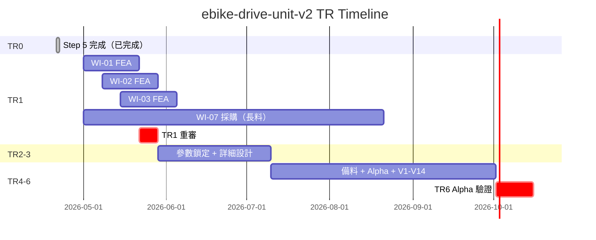

# 工作分解結構 (WBS) 開發計劃 — RD Design Copilot

---

**文件版本**：`v1.0`
**最後更新**：`2026-04-28`
**主要作者**：專案經理 + AI Agent
**審核者**：技術負責人、產品經理
**狀態**：`Draft`
**模板來源**：`VibeCoding_Workflow_Templates/16_wbs_development_plan_template.md`
**雙軸結構**：TRIZ Step 0-5（推理閉環）+ TR0-TR10（工程執行里程碑）

---

## 目錄

1. [專案總覽](#1-專案總覽)
2. [雙軸 WBS 總覽](#2-雙軸-wbs-總覽)
3. [TRIZ Step 0-5 推理任務分解](#3-triz-step-0-5-推理任務分解)
4. [TR0-TR10 工程執行任務分解](#4-tr0-tr10-工程執行任務分解)
5. [產品開發任務分解](#5-產品開發任務分解)
6. [風險與議題管理](#6-風險與議題管理)
7. [品質指標與里程碑](#7-品質指標與里程碑)

---

## 1. 專案總覽

### 1.1 專案基本資訊

| 項目 | 內容 |
|:-----|:-----|
| **專案名稱** | RD Design Copilot — AI 輔助早期概念設計系統 |
| **專案經理** | TBD |
| **技術主導** | TBD |
| **專案狀態** | 規劃中（PoC 完成 / TR1 NO-GO） |
| **文件版本** | v1.0 |
| **最後更新** | 2026-04-28 |
| **PRD 連結** | [`02_prd.md`](./02_prd.md) |

### 1.2 時程規劃

| 里程碑 | 日期 | 狀態 |
|:-------|:-----|:-----|
| Kickoff | 2026-Q2 | ✅ 完成 |
| TRIZ PoC（ebike-drive-unit-v2） | 2026-04-21 | ✅ Step 0-5 全部完成 |
| TR1 Gate Review | 2026-04-28 | 🔴 NO-GO（WI-01/02/03 FEA 未開始） |
| MVP（P03-P09 核心 6 頁 + TRIZ Step 0-3） | 2026-Q3 | 🔄 規劃中 |
| Beta（含 P10-P13 + TR Gate） | 2026-Q4 | ⏳ 計劃中 |
| GA（含 P14-P18 + 知識回寫 + TR0-TR10 完整） | 2027-Q1 | ⏳ 計劃中 |

### 1.3 專案角色與職責 (RACI)

| 角色 | 縮寫 | 主要職責 |
|:-----|:-----|:---------|
| 專案經理 | PM | 協調、進度、風險、Gate review |
| 技術負責人 | TL | 技術決策、架構、Code Review |
| 產品經理 | PO | 需求、user story、UAT |
| 架構師 | ARCH | 系統架構、技術選型、ADR |
| 後端開發 | BE | API、Skill 實作、資料庫 |
| 前端開發 | FE | UI、互動、設計系統實施 |
| AI 工程師 | AI | LLM 整合、prompt 工程、RAG |
| 質量控制 | QA | 測試策略、BDD 驗收、合規 |
| 安全工程 | SEC | 安全審查、滲透測試 |
| SRE | SRE | 部署、監控、Runbook |
| TRIZ 領域顧問 | TRIZ | TRIZ 方法學審查、KB 維護 |
| RD 領域顧問 | RD-SME | 機構/系統工程驗證 |

---

## 2. 雙軸 WBS 總覽

```
RD Design Copilot 開發
│
├── 軸 A：產品開發 WBS（傳統軟體開發）
│   ├── 1.0 專案管理與規劃
│   ├── 2.0 系統架構與設計
│   ├── 3.0 後端開發（API + Skill）
│   ├── 4.0 前端開發（18 頁 IA）
│   ├── 5.0 測試與品質
│   ├── 6.0 部署與上線
│   └── 7.0 文件與培訓
│
├── 軸 B：TRIZ 推理 WBS（針對每個用戶專案）
│   ├── B0  Session 啟動（triz-router）
│   ├── B1  Step 0 問題定向（triz-scoping）
│   ├── B2  Step 1 功能建模（triz-model）
│   ├── B3  Step 2+3 TC/PC/SF 求解（triz-contradict）
│   ├── B4  Step 4 驗證 + CCI（triz-verify）
│   └── B5  Step 5 WI/ICD/MC 產出（triz-wi）
│
└── 軸 C：TR 工程執行 WBS（TR0 凍結後）
    ├── C0  TR0 概念凍結（Step 5 完成）
    ├── C1  TR1 可行性
    ├── C2  TR2 參數鎖定
    ├── C3  TR3 詳細設計
    ├── C4  TR4 備料
    ├── C5  TR5 Alpha 建構
    ├── C6  TR6 Alpha 驗證
    ├── C7  TR7-8 Beta
    └── C8  TR9-10 量產
```

### 2.1 軸關係

```
軸 A（產品開發）建構 RD Copilot 系統本身
   ↓ 系統建好後
軸 B（TRIZ 推理）跑在系統內，產出 TR0 凍結的概念
   ↓ TR0 完成後
軸 C（TR 工程執行）追蹤每個用戶專案的工程交付
```

---

## 3. TRIZ Step 0-5 推理任務分解

> 每個用戶專案都會跑這軸。範例：ebike-drive-unit-v2（已 100% 完成）。

### 3.1 B0：Session 啟動

| 任務 | 負責 | 工時 | 依賴 | Skill |
|:-----|:-----|:-----|:-----|:------|
| 偵測問題類型 | RD | 5 min | — | triz-router |
| 路由至適當 Step | System | auto | B0.1 | triz-router |
| 建立 .triz-state.json | System | auto | B0.2 | triz-router |

### 3.2 B1：Step 0 問題定向（如需要）

| 任務 | 負責 | 工時 | Skill |
|:-----|:-----|:-----|:------|
| 5Why 根因分析 | RD + AI | 30 min | triz-scoping |
| KT Is/IsNot 範圍界定 | RD + AI | 20 min | triz-scoping |
| CECA 因果鏈分析 | RD + AI | 30 min | triz-scoping |
| 確定子系統 + TC 假設 | RD | 15 min | triz-scoping |

### 3.3 B2：Step 1 功能建模

| 任務 | 負責 | 工時 | Skill |
|:-----|:-----|:-----|:------|
| 建立組件交互圖（FA） | RD + AI | 1 hr | triz-model |
| SF 三角診斷 | RD + AI | 30 min | triz-model |
| Improve / Worsen 自然語句 | RD | 15 min | triz-model |

### 3.4 B3：Step 2+3 TC/PC/SF 求解

| 任務 | 負責 | 工時 | Skill |
|:-----|:-----|:-----|:------|
| 39 參數映射 | AI | 5 min | triz-contradict |
| 矛盾矩陣查表 | AI | auto | triz-contradict |
| 原理具體化（含 L1 跨域去錨定） | RD + AI | 30 min/TC | triz-contradict |
| OZ-OT-Px 提取 | AI | 5 min | triz-contradict |
| 分離策略選擇（PC） | RD + AI | 20 min | triz-contradict |
| SF 標準解匹配 | AI | 5 min | triz-contradict |
| SIM 矩陣（多 TC 時） | AI | 10 min | triz-contradict |

### 3.5 B4：Step 4 驗證 + CCI

| 任務 | 負責 | 工時 | Skill |
|:-----|:-----|:-----|:------|
| Px 分離邏輯驗證 | RD + AI | 30 min | triz-verify |
| Web 經驗證據查證 | AI | 15 min | triz-verify |
| 四問複雜度評分（CCI） | RD + AI | 30 min | triz-verify |
| Evidence Registry 寫入 | System | auto | triz-verify |
| Verdict（Evolution / Patch） | RD | 10 min | triz-verify |

### 3.6 B5：Step 5 WI/ICD/MC 產出

| 任務 | 負責 | 工時 | Skill |
|:-----|:-----|:-----|:------|
| Domain 偵測（motor/gear/thermal/...） | AI | 1 min | triz-wi |
| Framework 文件（README + critical_path + risk_register） | AI | 5 min | triz-wi |
| WI 文件平行產出 | AI | 10 min/domain | triz-wi |
| ICD 文件平行產出 | AI | 10 min/interface | triz-wi |
| Material Card 平行產出 | AI | 10 min/material | triz-wi |
| RD 審閱 + commit | RD | 1-2 hr | manual |

### 3.7 案例：ebike-drive-unit-v2 進度

| Step | 狀態 | 產出 |
|:-----|:-----|:-----|
| Step 0 | ✅（路由到 step1，無需挖根因） | — |
| Step 1 | ✅ | 9 components FA + 9 SF diagnoses |
| Step 2 | ✅ | 5 TCs（TC1 bottleneck），multi-TC strategy |
| Step 3 | ✅ | 4 principal solutions + synergy check |
| Step 4 | ✅ | Evolution（CCI 0.35），Evidence 91% coverage |
| Step 5 | ✅ | 8 WI + 4 ICD + 6 MC（全部寫到 `docs/_harness/engineering/`） |

---

## 4. TR0-TR10 工程執行任務分解

> 每個用戶專案在 TRIZ Step 5 完成後進入 TR0，再依序 TR1-TR10。
> 完整框架見 `docs/_harness/engineering/tr_gate_framework.md`。

### 4.1 TR Gate 概覽

| TR | 名稱 | 退出條件主軸 | 對應 Skill |
|:---|:-----|:-------------|:-----------|
| TR0 | 概念凍結 ≡ Gate P | TRIZ Step 5 完成 + WI/ICD/MC 確定 + `cad_readiness` Go | triz-wi + triz-verify |
| TR1 | 可行性 | 架構 PoC + FEA 初算（≥ 8 條件） | tr-gate, tr-fea |
| TR2 | 參數鎖定 | 主要設計參數凍結 | tr-gate |
| TR3 | 詳細設計 | 機構/電子/軟體圖紙完成 | tr-gate, tr-fea |
| TR4 | 備料 | 長料採購到位 | tr-gate |
| TR5 | Alpha 建構 | Alpha 機完成 | tr-gate |
| TR6 | Alpha 驗證 | V1-V14 測試通過 | tr-test |
| TR7 | Beta 建構 | Beta 機（含 DFM） | tr-gate, tr-dfm |
| TR8 | Beta 驗證 | DVP&R 通過 | tr-test |
| TR9 | 量產試流 | PV 試流通過 | tr-gate |
| TR10 | 量產釋放 | PPAP 完成 | tr-gate |

### 4.2 ebike-drive-unit-v2 TR1 進度（NO-GO 案例）

引用 `docs/engineering/gate_reviews/TR1_review_2026-04-28.md`：

| TR1 退出條件 | 狀態 | 阻擋原因 |
|:-------------|:-----|:---------|
| WI-01 馬達磁路圖完成 | ❌ | FEA 未開始 |
| WI-02 諧波減速器設計 | ❌ | FEA 未開始 |
| WI-03 PCM 熱管理模擬 | ❌ | FEA 未開始 |
| WI-04 結構整合 CAD | ⚠️ | 部分完成 |
| WI-05 環形 PCB 設計 | ⚠️ | 部分完成 |
| WI-06 原型建構測試規劃 | ⚠️ | 規劃中 |
| WI-07 材料採購啟動 | 🔄 | 進行中 |
| WI-08 電化學腐蝕預防 | ❌ | 未開始 |

**判定**：NO-GO（20% 通過率）。回流：完成 WI-01/02/03 FEA → 重審 TR1。

### 4.3 TR Critical Path



---

## 5. 產品開發任務分解

### 5.1 1.0 專案管理與規劃

| 任務 ID | 任務名稱 | 負責 | 工時(h) | 狀態 |
|:--------|:---------|:-----|:--------|:-----|
| 1.1.1 | 專案章程制定 | PM | 8 | ✅ |
| 1.1.2 | WBS 結構設計 | PM | 16 | ✅（本文件） |
| 1.1.3 | 風險識別 | TL+PM | 8 | 🔄 |
| 1.2.1 | PRD 撰寫 | PO | 24 | ✅（[02_prd](./02_prd.md)） |
| 1.2.2 | BDD 情境定義 | PO+QA | 24 | ✅（[03_bdd_guide](./03_bdd_guide.md)） |
| 1.3.1 | 週報告制度 | PM | 4 | ⏳ |

### 5.2 2.0 系統架構與設計

| 任務 ID | 任務名稱 | 負責 | 工時(h) | 狀態 |
|:--------|:---------|:-----|:--------|:-----|
| 2.1.1 | 技術選型決策（5 ADRs） | ARCH | 16 | 🔄 |
| 2.1.2 | C4 + DDD 架構設計 | ARCH | 32 | ✅（[05_architecture](./05_architecture.md)） |
| 2.1.3 | API Spec | TL | 24 | ✅（[06_api_spec](./06_api_spec.md)） |
| 2.2.1 | ER 圖 / Schema | Data | 24 | ⏳ |
| 2.3.1 | OpenAPI 完整定義 | TL | 16 | ⏳ |

### 5.3 3.0 後端開發（API + Skill）

| 任務 ID | 任務名稱 | 負責 | 工時(h) | 依賴 |
|:--------|:---------|:-----|:--------|:-----|
| 3.1.1 | FastAPI 專案結構建置 | BE | 8 | 2.1.2 |
| 3.1.2 | DB schema + ORM | BE | 24 | 2.2.1 |
| 3.1.3 | Auth + JWT + RBAC | BE+SEC | 32 | 3.1.2 |
| 3.2.1 | Project + Brief CRUD | BE | 32 | 3.1.3 |
| 3.2.2 | Analyst Service（AI 萃取） | BE+AI | 40 | 3.1.3 |
| 3.2.3 | Socratic + Contradiction CRUD | BE | 24 | 3.2.1 |
| 3.3.1 | TRIZ Service: triz-router/scoping | BE+AI | 32 | 3.2.3 |
| 3.3.2 | TRIZ Service: triz-model | BE+AI | 40 | 3.3.1 |
| 3.3.3 | TRIZ Service: triz-contradict（核心） | BE+AI | 80 | 3.3.2 |
| 3.3.4 | TRIZ Service: triz-verify | BE+AI | 40 | 3.3.3 |
| 3.3.5 | TRIZ Service: triz-wi | BE+AI | 40 | 3.3.4 |
| 3.4.1 | KT 決策模組 `[DEFERRED → Beta]` | BE | 32 | 3.2.1 |
| 3.4.2 | Pre-CAD Review 評分 `[MERGED → triz-verify Phase 6]` | BE | 24 | 3.4.1 |
| 3.4.3 | Knowledge Agent（Feynman）`[DEFERRED → GA]` | BE+AI | 40 | 3.4.1 |
| 3.5.1 | TR Service（5 skill） | BE | 60 | 3.3.5 |

### 5.4 4.0 前端開發（18 頁 IA）

> 詳見 `docs/01-define/pages/INDEX.md` § 18 頁規格。

| 任務 ID | 頁面 | 負責 | 工時(h) | 依賴 |
|:--------|:-----|:-----|:--------|:-----|
| 4.1 | 設計系統建置 | FE | 24 | `design-system-specs/` |
| 4.2 | P01-P02 Auth + Reset | FE | 16 | 3.1.3 |
| 4.3 | P03 ProjectList | FE | 24 | 3.2.1 |
| 4.4 | P04 ProjectDashboard | FE | 32 | 3.2.1 |
| 4.5 | P05 TaskDefinition | FE | 40 | 3.2.2 |
| 4.6 | P06 Explore（含 Conditional Stepper） | FE | 60 | 3.3.1, 3.3.2 |
| 4.7 | P07 Track | FE | 24 | 3.2.3 |
| 4.8 | P08 Create（最複雜頁） | FE | 100 | 3.3.3 |
| 4.9 | P09 PreCadReview | FE | 32 | 3.4.2 |
| 4.10 | P10 CadInProgress | FE | 16 | — |
| 4.11 | P11 DesignReview | FE | 40 | 3.4.1 |
| 4.12 | P12 DecisionRecord | FE | 40 | 3.4.1 |
| 4.13 | P13 Feynman | FE | 32 | 3.4.3 |
| 4.14 | P14 KnowledgeBase | FE | 32 | 3.4.3 |
| 4.15 | P15 ConstraintLabelDictionary | FE | 24 | — |
| 4.16 | P16-P18 Settings/DevSeed/404 | FE | 16 | — |

**前端總工時**：~552 hr（≈ 14 週 × 1 FE）

### 5.5 5.0 測試與品保

| 任務 | 負責 | 工時(h) |
|:-----|:-----|:--------|
| 單元測試（70% 覆蓋） | BE+FE | 並行 |
| 元件測試 | FE | 並行 |
| BDD 整合測試（7 features） | QA | 80 |
| E2E 測試（10 關鍵 path） | QA | 60 |
| 效能測試（LCP/INP） | QA+SRE | 40 |
| 安全測試（OWASP） | SEC | 40 |

### 5.6 6.0 部署與上線

| 任務 | 負責 | 工時(h) |
|:-----|:-----|:--------|
| Docker Compose（dev） | SRE | 16 |
| Kubernetes manifests（staging/prod） | SRE | 40 |
| CI/CD pipeline | SRE | 32 |
| 監控 + 告警 | SRE | 24 |
| Production deploy + 驗證 | SRE | 16 |

### 5.7 7.0 文件與培訓

| 任務 | 負責 | 工時(h) |
|:-----|:-----|:--------|
| API docs（auto） | TL | 8 |
| 用戶手冊 | PO+UX | 40 |
| 開發者文件 | TL | 24 |
| Onboarding 培訓教材 | PM | 24 |
| 知識庫初始 seed | TRIZ-SME | 80 |

---

## 6. 風險與議題管理

### 6.1 主要風險

| ID | 風險 | 影響 | 機率 | 緩解 | 負責 |
|:---|:-----|:-----|:-----|:-----|:-----|
| R-001 | LLM 服務不穩定 | TRIZ skill 中斷 | 中 | 多 provider fallback、cache | TL |
| R-002 | TRIZ 推理品質不穩 | 用戶誤導 | 中 | Evidence Registry、CCI 過濾 | AI |
| R-003 | 用戶不接受 AI 挑戰 | KPI-6 < 70% | 中 | Onboarding、可關閉黑帽 | PO |
| R-004 | KB 資料不全 | RAG 失敗 | 高 | MVP 允許手動上傳 | KB-Owner |
| R-005 | 內網部署複雜 | 採用率低 | 中 | Docker Compose all-in-one | SRE |
| R-006 | TR1 NO-GO 持續 | ebike 案例阻擋 | 高（已發生） | WI-01/02/03 FEA 加速 | RD |

### 6.2 議題追蹤

引用 `docs/_harness/engineering/risk_register.md` 與 `docs/engineering/gate_reviews/TR1_review_2026-04-28.md`。

---

## 7. 品質指標與里程碑

### 7.1 KPI 對應（PRD §2.3）

| KPI | 目標 | 測量點 |
|:----|:-----|:-------|
| KPI-1 架構返工次數 | ≤ 2 次 | 每次 Major refactor 計次 |
| KPI-2 評審效率 | ≤ 2 hr | 從上傳到完成 review 的時間 |
| KPI-3 假設驗證覆蓋 | ≥ 80% | 配實驗的假設比例 |
| KPI-4 方案探索數 | ≥ 3 條 | Phase II 結束時 |
| KPI-5 Brief 生成 | ≤ 30 s | 上傳到預填完成 |
| KPI-6 採納率 | ≥ 70% | 主動使用比例 |
| KPI-7 TRIZ Skill | ≤ 60 s | 求解 API 響應時間 |
| KPI-8 方案集合載入 | ≤ 3 s | Decision Hub LCP |

### 7.2 Phase Gate Quality Gate

| Phase | 退出 Gate | 必要條件 |
|:------|:----------|:---------|
| Phase I | D1 + D2 + Phase Gate D | Brief 完成、矛盾分類、CLD 建立。D1/D2 由 TRIZ G0/G1 覆蓋 |
| Phase II | X1 + X2 + Gate P | 假設追蹤、TRIZ 求解、Pre-CAD 通過。X1/X2 由 TRIZ G2 覆蓋；Gate P 簡化至 triz-verify `cad_readiness` |
| Phase III | G5 + G6 + G7 | 設計審查、KT 決策、知識回寫。G5/G6 延後至 Beta，G7 延後至 GA |

> Gate 層級分析詳見 [18_flow_contract.md §2](./18_flow_contract.md)。擴展路線見 §3。

### 7.3 里程碑與交付

| Milestone | 日期 | 主要交付 |
|:----------|:-----|:---------|
| Kickoff | 2026-Q2 | PRD + Architecture |
| MVP-Alpha | 2026-Q3 | 6 核心頁 + TRIZ Step 0-3 + 內測 |
| Beta | 2026-Q4 | 含 Phase III + TR Gate（CLI）|
| GA | 2027-Q1 | 全 18 頁 + 知識回寫 + TR0-TR10 完整 |

---

## 文件溯源

- 模板：`VibeCoding_Workflow_Templates/16_wbs_development_plan_template.md`
- PRD：[`02_prd.md`](./02_prd.md)
- TRIZ 策略：`docs/_harness/auto_triz_strategy.md`
- TR 框架：`docs/_harness/engineering/tr_gate_framework.md`
- 既有 active state：`.claude/context/triz/.triz-state.json` + `.tr-state.json`
- 既有 TR1 review：`docs/engineering/gate_reviews/TR1_review_2026-04-28.md`
- 18 頁 IA：`docs/01-define/pages/INDEX.md`
