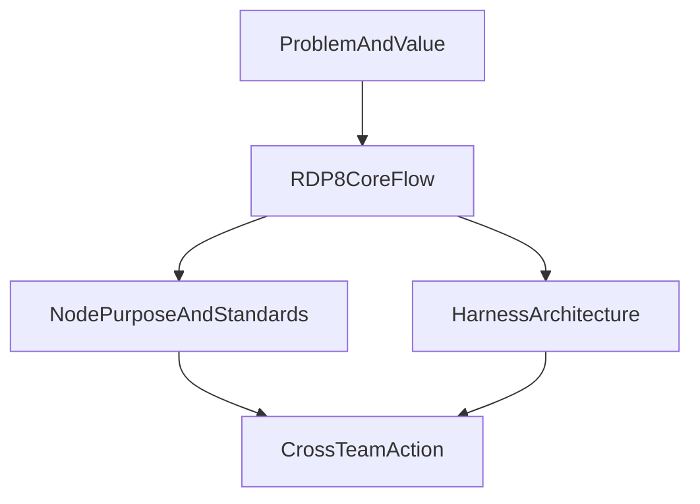

# One-Page 簡報骨架 — RD Design Copilot

---

**文件版本**：`v1.0`
**最後更新**：`2026-04-28`
**狀態**：`Active`
**用途**：面向跨部門與內部技術架構受眾的 one-page 簡報骨架

---

## 1. 這頁要解的真問題

這不是一頁產品介紹，而是一頁高層對齊圖。

這頁要讓讀者在很短時間內理解：

1. 這個專案在解什麼高成本問題
2. 產品流程是如何被重新定義
3. 系統節點與 gate 到底在做什麼
4. 系統架構是如何支撐這條流程
5. 跨部門接下來可以怎麼協作

## 2. One-Page 一句話定位

> RD Design Copilot 正在把 RD 前期高試錯、低追溯、知識分散的設計流程，轉成一條可追溯、可驗證、可累積的工程決策與執行管線。

## 3. 建議頁面總標題

建議擇一：

1. **RD Design Copilot：把前端設計決策流程變成可工程化的系統**
2. **從試錯式設計，到可追溯的產品開發管線**
3. **RDP-8 + Harness：把產品流程與系統架構接起來**

## 4. One-Page 版面配置

建議切成 5 塊，不超過 1 頁：

### 版面建議

- 左上：問題與價值
- 中央：RDP-8 核心 flow
- 右上：節點目的與國際標準對標
- 左下：harness-first 系統架構
- 右下：跨部門協作接口與下一步

## 5. 各區塊內容

### Block 1 — Problem And Value

- **要回答的問題**：為什麼這件事值得跨部門與架構角色花時間理解？
- **Key message**：RD 前期最大的浪費不是工具不夠，而是問題太晚被看見、決策太難追溯、知識沒有留在系統裡。
- **建議文案**：
  - 高試錯成本
  - 初期方向不明
  - 知識分散難利用
  - 對應價值：返工降低、判斷加快、知識沉澱
- **建議視覺**：三重困境對四個價值支柱的對照卡
- **主要來源**：
  - `docs/planning/02_prd.md`
  - `docs/planning/ppt/19_internal_pitch_strategy.md`

### Block 2 — RDP-8 Core Flow

- **要回答的問題**：產品開發流程被重構成什麼樣子？
- **Key message**：RDP-8 不是多一套術語，而是把產品開發拆成 8 種不確定性的依序消除。
- **建議文案**：
  - P0 `SCOPE`：定義真正的問題
  - P1 `MAP`：理解系統怎麼運作
  - P2 `RESOLVE`：找出矛盾怎麼解
  - P3 `SPECIFY`：把概念凍結成規格
  - P4-P7：從物理驗證一路走到量產釋放
- **建議視覺**：一條水平箭頭 flow，標示 `P0 → P7`
- **主要來源**：
  - `docs/planning/18_flow_contract.md`

### Block 3 — Node Purpose And Standards

- **要回答的問題**：系統上每個主要節點的目的與信心檢查點是什麼？它跟外部標準怎麼對齊？
- **Key message**：每個 phase/gate 都不是為了流程好看，而是確認某一種不確定性已被消除。
- **建議文案**：
  - `G0`：我知道問題在哪
  - `G1`：我知道系統怎麼運作
  - `G2`：我知道怎麼解矛盾
  - `G3`：規格已凍結，可以開始做
  - `G4-G7`：一路驗證物理、整合、製程與量產能力
  - 對標：`APQP / VDA MLA / NASA TRL / Stage-Gate`
- **建議視覺**：一個小表格或雙欄對照圖
- **主要來源**：
  - `docs/planning/18_flow_contract.md`
  - `docs/methodology/DK-04--data-model-and-gate.md`

### Block 4 — Harness Architecture

- **要回答的問題**：這套流程不是只存在概念上，系統主體怎麼把它跑起來？
- **Key message**：系統採 harness-first，流程知識主要活在 markdown skills，Python runtime 負責執行、載入與工具調度。
- **建議文案**：
  - Interface：CLI / HTTP
  - Core：`AgentLoop`
  - Loader：skill / command / agent loaders
  - Tools：filesystem / web / agent / TRIZ tools
  - SSOT：`.claude/` + `docs/engineering/`
  - 原則：業務邏輯在 markdown，state 在 filesystem
- **建議視覺**：5 層堆疊圖
- **主要來源**：
  - `docs/planning/05_architecture.md`
  - `docs/planning/08_project_structure.md`

### Block 5 — Cross-Team Action

- **要回答的問題**：不同部門現在可以怎麼參與？
- **Key message**：這個系統要成為組織能力，需要的不只是模型，而是流程、資料、驗證與工程接口的共同補位。
- **建議文案**：
  - 產品 / PM：定義場景、優先級、導入節點
  - RD / Domain：提供真實案例、約束、設計規則
  - 架構 / Backend：穩定 harness runtime、tooling、擴充邊界
  - 測試 / 品質 / 製造：補後段 gate 驗證與實際導入接口
- **建議視覺**：角色到接口的 mapping
- **CTA**：
  - 選一個試點場景
  - 選一個合作接口
  - 確認下一輪要驗證的 gate / capability

## 6. 建議閱讀順序

one-page 內的視線順序建議如下：

1. 先看左上問題與價值
2. 再看中央 RDP-8 flow
3. 接著看右上節點目的與標準對標
4. 再看左下 harness 架構
5. 最後看右下跨部門 action

## 7. 發表口條骨架

### 開頭 20 秒

> 這個專案不是多做一個 AI 工具，而是想把 RD 前期高成本、低追溯的設計決策，變成一條能被系統化管理的流程。

### 中段 30 秒

> 中間這條 RDP-8 流程，代表我們把產品開發拆成 8 種不確定性的消除；右上角是每個節點在確認什麼；左下角則是系統架構如何把這件事落成可執行的 harness。

### 收尾 15 秒

> 所以這一頁真正要問的不是「工具酷不酷」，而是哪些部門要一起把哪個節點補成真正可運作的組織能力。

## 8. 本版涵蓋與不涵蓋

### 本版涵蓋

- one-page 版面邏輯
- 每區塊的目的與 key message
- 對應文件來源
- 跨部門 / 架構受眾口條

### 本版不涵蓋

- 實際投影片視覺設計稿
- 真實案例圖表
- 詳細技術 appendix
- speaker note 完整逐字稿

