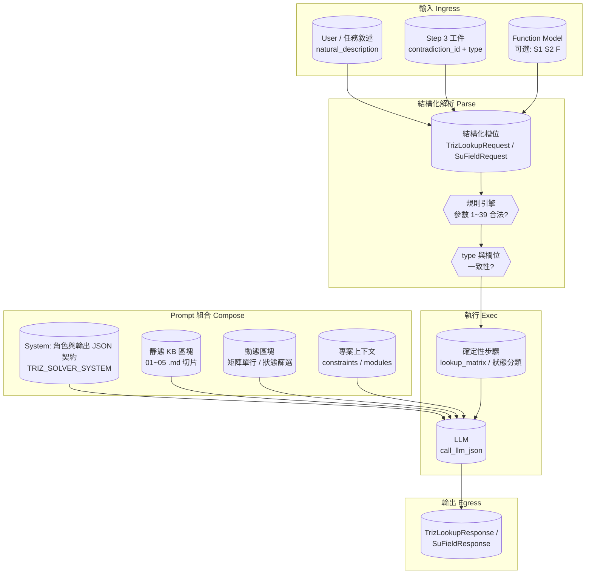
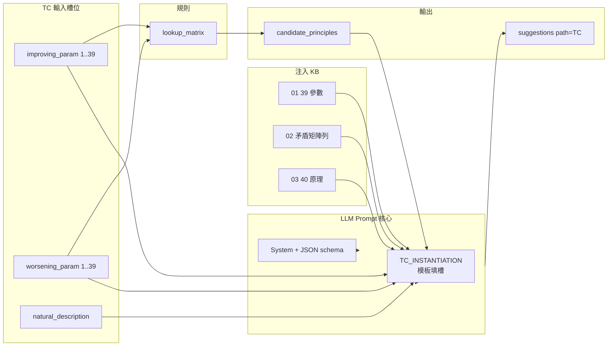
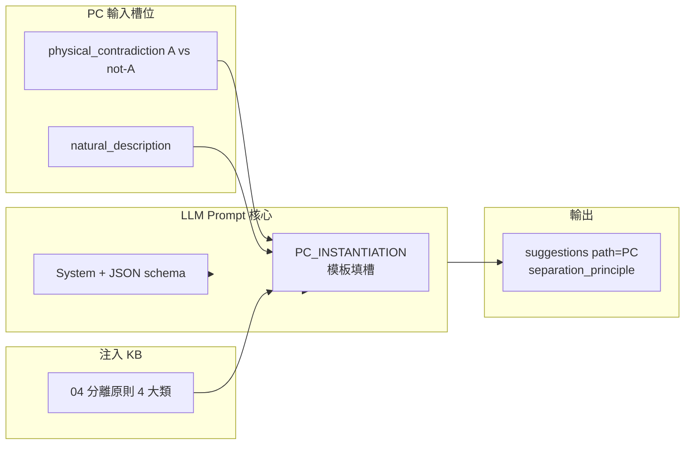
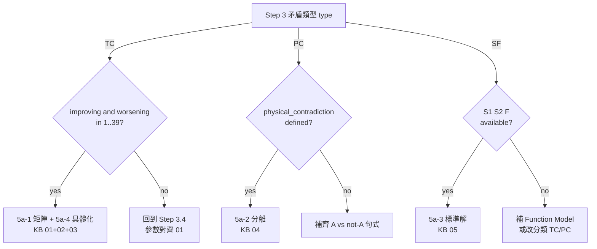

# TC / PC / SF 三徑流程與 Prompt 解析（Block Diagram）

> **定位**：對齊本資料夾 `README.md` 與後端 `TrizLookupRequest.type` 路由（`TC` / `PC` / `SF`），將 **AutoTRIZ 混合架構** 中「導入的 Prompt 如何組合、如何被解析成結構化欄位」以 **流程 + 區塊圖** 展開。  
> **對應知識檔**：`01`～`05`；**對應 Step**：整合流程 §1.5 Step 5a（5a-1～5a-4）。

---

## 1. 術語與知識檔對照

| 代碼 | 全名 | 矛盾/問題形態 | Step 5a 子路徑 | 主要參照 MD |
|------|------|-----------------|----------------|-------------|
| **TC** | Technical Contradiction（技術矛盾） | 改善參數 A → 惡化參數 B | 5a-1 矩陣查表 → 5a-4 原理具體化 | `01`, `02`, `03` |
| **PC** | Physical Contradiction（物理矛盾） | 同一物件需同時滿足 P 與 ¬P | 5a-2 分離策略 | `04` |
| **SF** | Su-Field（物質-場） | S1–S2–F 不完整 / 有害 / 不足 | 5a-3 標準解匹配 | `05` |

---

## 2. 邏輯流程（偽代碼，三徑共用骨架）

```text
INPUT: raw_user_text, project_context, contradiction_record (from Step 3)

// ── 階段 A：類型已鎖定（Step 3 產出 type ∈ {TC, PC, SF}）──
SWITCH type:
  CASE TC:
    REQUIRE improving_param ∈ [1..39], worsening_param ∈ [1..39]   // 規則引擎可驗證對照 01
    candidates ← MatrixLookup(improving_param, worsening_param)     // 02
    kb_inject ← slice(01) + row_or_RAG(02, improving, worsening) + slice(03)
    llm_prompt ← f(system, kb_inject, natural_description, improving, worsening)
    OUT ← JSON { candidate_principles, suggestions[] }              // 每條 path="TC"

  CASE PC:
    REQUIRE physical_contradiction string (屬性 A vs ¬A)
    kb_inject ← full(04)
    llm_prompt ← f(system, kb_inject, natural_description, physical_contradiction)
    OUT ← JSON { suggestions[] with separation_principle }

  CASE SF:
    REQUIRE substance_1, substance_2, field (與 Function Model 對齊)
    state ← ClassifySuField(S1, S2, F)   // incomplete | effective | harmful | insufficient
    kb_inject ← RAG_or_full(05) filtered by state / class
    llm_prompt ← f(system, kb_inject, system_description, S1, S2, F, issues[])
    OUT ← JSON { su_field, system_state, matched_solutions[] }

// ── 階段 B：後處理（與產品一致）──
normalize_paths(OUT)
optional: secondary_contradiction_scan  // Step 5a-6
```

**MVP 優先順序**：① 欄位齊全與型別合法（規則驗證）→ ② 查表 / 分類（確定性）→ ③ LLM 具體化（語意）→ ④ 輸出結構校驗。

---

## 3. 導入 Prompt 解析 — 總區塊圖（共用）

下列圖示將一次推論請求拆成 **區塊**：何者來自「靜態知識」、何者來自「執行期上下文」、何者由 **LLM 解析/生成**。



**區塊說明（對照實作概念）**

| 區塊 | 內容 | 誰負責 |
|------|------|--------|
| **Ingress** | 自然語言 + Step 3 已判定的 `type` + 可選 Su-Field 三要素 | 前端 / 流程狀態機 |
| **Compose** | System prompt + 注入的 `01`～`05` 片段 + 矩陣行或 RAG 命中 | Orchestrator + `build_triz_*_context` |
| **Parse** | 將敘述對應到 `improving_param` / `worsening_param` / `physical_contradiction` / `sf_*` | LLM 輔助 + 規則驗證（Step 3.4） |
| **Exec** | TC：`lookup_matrix`；SF：狀態分類；再交 LLM 具體化 | 規則引擎 + LLM |
| **Egress** | 帶 `path` 的 `suggestions`、或 `matched_solutions` | API 回應模型 |

---

## 4. TC（技術矛盾）— 結構化流程與 Prompt 區塊

### 4.1 步驟展開

1. **輸入槽位**：`type=TC`，`improving_param`，`worsening_param`，`natural_description`。  
2. **KB 注入**：`01_39_parameters.md`（驗證語意對齊）、`02` 的 **單行/子矩陣**（降 token）、`03_40_principles.md`（候選原理全文或子集）。  
3. **規則查表**：`lookup_matrix(improving, worsening)` → `candidate_principles: int[]`。  
4. **LLM**：在固定 JSON 契約下，將候選原理 **具體化** 為工程手段（`suggestions`）。  
5. **輸出**：每條建議標記 `path: "TC"`，可附 `principle_number`。

### 4.2 Block diagram（TC 專用）



---

## 5. PC（物理矛盾）— 結構化流程與 Prompt 區塊

### 5.1 步驟展開

1. **輸入槽位**：`type=PC`，`physical_contradiction`（同一參數的 A / ¬A），`natural_description`。  
2. **KB 注入**：`04_separation_principles.md`（時間 / 空間 / 條件 / 整體-局部）。  
3. **無矩陣查表**：解法方向來自 **分離維度** 的選擇與組合。  
4. **LLM**：輸出 `suggestions`，填 `separation_principle`（如 time / space / condition / system_level）。  
5. **輸出**：`path: "PC"`；`principle_number` 可空（非 40 原理編號語意時由模型別填或後處理）。

### 5.2 Block diagram（PC 專用）



---

## 6. SF（Su-Field）— 結構化流程與 Prompt 區塊

### 6.1 步驟展開

1. **輸入槽位**：`type=SF` 或獨立 `SuFieldRequest`：`substance_1`，`substance_2`，`field_type`，`system_description`，`current_issues[]`。  
2. **模型化**：判定 **不完整 / 有效完整 / 有害完整 / 不足效應**（見 `05` 開頭狀態表）。  
3. **KB 注入**：`05_76_standard_solutions.md` — 全量或 **依 Class / 問題狀態 RAG**。  
4. **LLM**：匹配標準解編號與敘述，產出 `matched_solutions[]`（`standard_id`, `standard_name`, `suggestion`）。  
5. **輸出**：結構化 `su_field` + `system_state` + 建議清單。

### 6.2 Block diagram（SF 專用）

```mermaid
flowchart LR
  subgraph SF_In["SF 輸入槽位"]
    S1[sf_substance_1 / S1]
    S2[sf_substance_2 / S2]
    F[sf_field / F]
    SD[system_description]
    IS[current_issues]
  end

  subgraph SF_Class["確定性分類"]
    ST[system_state\nincomplete|effective|harmful|insufficient]
  end

  subgraph SF_KB["注入 KB"]
    P05[05 76 標準解\n按需切片或 RAG]
  end

  subgraph SF_LLM["LLM Prompt 核心"]
    SYS3[System + JSON schema]
    CTX3[SUFIELD_ANALYSIS\n模板填槽]
  end

  subgraph SF_Out["輸出"]
    SU[su_field dict]
    MS[matched_solutions]
  end

  S1 --> ST
  S2 --> ST
  F --> ST
  S1 --> CTX3
  S2 --> CTX3
  F --> CTX3
  SD --> CTX3
  IS --> CTX3
  ST --> P05
  P05 --> CTX3
  SYS3 --> SF_LLM
  CTX3 --> SF_LLM
  SF_LLM --> SU
  SF_LLM --> MS
```

---

## 7. 三徑對照總圖（決策 → Prompt 槽位）



---

## 8. 本版涵蓋 / 不涵蓋

| 涵蓋 | 不涵蓋（另見整合流程與 Agent 規格） |
|------|-------------------------------------|
| TC / PC / SF 的 **流程步驟**、**KB 檔對應**、**Prompt 區塊拆解** | ARIZ 全程序、Step 5d Phase B 決策中心 UI 細節 |
| 與 `TrizLookupRequest` / `SuFieldRequest` 欄位對齊 | 各 LLM 模板的逐字原文（見 `backend/app/prompts/`） |
| RAG 策略在圖中以「動態區塊」標示 | 向量庫 schema 與索引實作 |

---

## 9. 維護建議

- 若 Step 編號變更：同步更新本檔 §1 表與 `README.md` 的 Copilot Step 欄。  
- 若 API 欄位變更：以 `backend/app/models/schemas.py` 為準，調整 §3～§6 槽位名稱。
