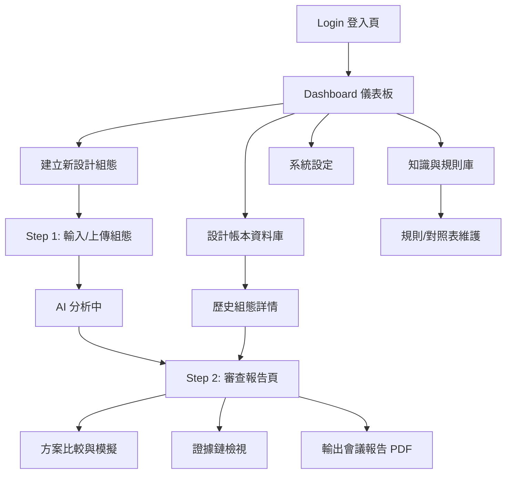

這是一份針對 **RD 設計審查 Copilot (Design Review Copilot)** 的完整 UI/UX 設計與 IA 架構規劃。

本設計緊扣你的核心策略：**「Day 1 介入」、「資訊閉環」、「非生成式幾何，而是輔助決策」**。

視覺風格採用 **台達電 (Delta Electronics)** 的企業識別系統（CIS）概念：**專業、穩重、環保節能（藍色與綠色為主調）**，強調工程軟體的**高資訊密度**與**清晰易讀性**。

-----

### 1\. 設計系統與規範 (Design System & Guidelines)

在進入架構前，先定義視覺語言，確保 RD 在使用時感到熟悉且專業。

#### 🎨 色彩系統 (Delta Color Palette)

  * **Primary Blue (台達藍 - 品牌主色):** `#0066B3`
      * 用於：主導航列、主要按鈕 (Primary Button)、選中狀態、強調標題。
      * *意義：科技、可靠、專業智慧。*
  * **Secondary Green (台達綠 - 節能/通過):** `#7AB800`
      * 用於：Pass 指標、成本節省數值、推薦方案、成功狀態 Toast。
      * *意義：環保、效率、安全。*
  * **Alert Red (警示紅 - 風險/失敗):** `#D93025`
      * 用於：高風險雷點、Fail 指標、嚴重干涉警告。
  * **Neutral Greys (中性灰 - 背景/框線):**
      * 背景: `#F4F6F9` (護眼工程灰)
      * 卡片背景: `#FFFFFF`
      * 文字: `#333333` (主文), `#666666` (次文)
      * 邊框: `#E0E0E0`

#### 🔣 字體 (Typography)

  * **Font Family:** `Noto Sans TC` (繁體中文), `Roboto` (英文/數字)。
  * **特點:** 數字必須使用 **Monospaced (等寬字體)**，方便工程數據對齊比較。

#### 🧩 Icon 風格 (Iconography)

  * **Style:** Outline (線條風格)，線條粗細一致 (1.5px)，銳利導角。
  * **Metaphor:**
      * 組態卡: 📄 (文件)
      * AI 審查: 🤖 (機器人頭) 或 🧠 (大腦)
      * 風險/雷點: ⚠️ (三角驚嘆號)
      * 證據/連結: 🔗 (鎖鏈)
      * 比較: ⚖️ (天平) 或 📊 (圖表)

-----

### 2\. 網站資訊架構 (Information Architecture - IA)

網站結構採用 **「扁平化工具型」** 架構，減少層級，讓 RD 能在 3 次點擊內完成「上傳 -\> 審查 -\> 決策」。

-----

### 3\. 使用者流程 (User Experience Flow)

**核心路徑 (The Happy Path):**

1.  **Trigger:** RD 有了一個齒輪箱初步構想。
2.  **Input:** 進入「建立組態」，上傳簡易 STEP 或填寫 15 個關鍵參數（轉速、扭矩、尺寸）。
3.  **Analysis:** AI 進行「Day 1 審查」（類似設計檢索）。
4.  **Insight:** 系統顯示：「此設計與 2023 年專案 B 有 90% 相似，但存在過熱風險 (參考報告 \#123)」。
5.  **Decision:** RD 調整參數，查看對比，決定採用方案 B 的改良版。
6.  **Action:** 輸出報告，帶去下午的 Review 會議。

-----

### 4\. 詳細頁面佈局與邏輯 (Page Layouts)

#### 頁面 A：Dashboard (儀表板) - 戰情中心

**佈局邏輯：** 左側固定導航 (Nav Rail)，右側主要內容。

  * **主要區域 (Main Content):**
      * **Hero Section:** 顯示搜尋框 (全域檢索歷史設計) + 「建立新組態」大按鈕 (Primary Blue)。
      * **近期工作 (Recent Work):** 卡片式列表，顯示最近審查的 5 個 Config (狀態：草稿 / 已審查 / 待驗證)。
      * **知識庫動態 (Knowledge Pulse):** 跑馬燈或列表，「本週新增 3 條馬達過熱失效案例」、「更新齒輪設計規範 V2.1」。*目的：被動推播知識。*

#### 頁面 B：建立新設計組態 (Create Configuration) - 輸入

**佈局邏輯：** 分步引導 (Stepper) 或 分割視窗 (Split View)。

  * **步驟條:** 1. 基礎資訊 -\> 2. 幾何與規格 -\> 3. 約束條件。
  * **左側 (輸入區):**
      * **快速導入:** 支援 Drag & Drop 上傳 Excel (BOM) 或 STEP 檔。系統自動解析填入欄位。
      * **關鍵欄位 (Form):**
          * `Config_ID`: 自動生成 (例: 20251216\_Gearbox\_V1)
          * `機構拓撲`: 下拉選單 (行星齒輪 / 平行軸 / 蝸桿...)
          * `關鍵尺寸`: 長/寬/高/軸距 (支援公差輸入)
          * `預估成本/重量`: 數值輸入
  * **右側 (AI 輔助提示):**
      * 當 RD 選擇「行星齒輪」時，右側跳出提示卡片：「⚠️ 注意：近期行星齒輪專案常發生潤滑不足問題，建議檢查油路設計。」*(即時反饋)*

#### 頁面 C：AI 審查報告頁 (Review Report) - 核心 MVP

**這是價值最高的頁面，佈局採用「儀表板 + 三欄式詳情」。**

  * **頂部摘要 (Header Summary):**

      * **健康度分數:** 85分 (綠色圓環)。
      * **三大指標:** 預估成本 ($USD), 預估重量 (kg), 預估開發週數。
      * **主要結論:** AI 生成的一句話摘要 (例：「設計可行，主要風險在於軸承壽命，建議參考專案 X 的配置」)。

  * **中段：三欄式資訊 (3-Column Layout):**

      * **左欄：相似設計召回 (Similarity Recall)**
          * 標題：「歷史上最像的 3 個設計」
          * 卡片內容：縮圖 + 相似度 % + 當年測試結論 (Pass/Fail)。
          * *Action:* 點擊「載入比較」將其加入對比籃。
      * **中欄：風險雷點掃描 (Risk Radar)**
          * 列表呈現：
              * 🔴 [高風險] 專利侵權疑慮 (結構特徵命中專利 US12345) -\> 點擊看詳情
              * 🟠 [中風險] 軸向長度超出目標 5mm
              * 🟢 [優勢] 共用件比例達 70% (成本優勢)
          * *UX 重點:* 每一條風險後面都有一個「證據連結 (Evidence Link)」，點擊跳轉到該失效報告或規範。
      * **右欄：下一步建議 (Next Step Recommendations)**
          * 清單：「最小驗證路徑」
          * 1.  優先打樣：外殼 (確認干涉)
          * 2.  推薦測試：高溫運轉測試 (T-102)
          * 3.  需諮詢專家：請教熱流部門關於散熱鰭片的設計

#### 頁面 D：方案比較與決策 (Comparison & Decision)

**佈局邏輯：** 並排比較表 (Side-by-Side Comparison Table)。

  * **表格設計:**
      * **Column 1:** 當前設計 (Draft V1)
      * **Column 2:** 歷史相似設計 (Project A - 2023)
      * **Column 3:** AI 推薦改良版 (AI Suggestion)
  * **Row (比較維度):**
      * 規格 (尺寸、重量、扭矩) - *差異處用紅/綠色底色標示 (Delta)*
      * 成本估算 (BOM Cost)
      * 風險評級
      * 測試歷史 (當前設計為「預測」，歷史設計為「實測數據」)
  * **底部行動列 (Sticky Footer):**
      * 按鈕群：「輸出對比報告 (PDF)」、「採納 AI 建議並另存新版」。

-----

### 5\. UI 元件庫規格 (Component Library Specs) - 台達風格

為了加速開發，定義以下標準元件：

#### 1\. 卡片 (Data Card)

  * **樣式:** 白色背景，微陰影 (`box-shadow: 0 2px 4px rgba(0,0,0,0.05)`), 圓角 4px (工程軟體不宜過圓)。
  * **內容:** 左側色條 (Color Bar) 指示狀態 (綠=Pass, 紅=Fail, 藍=Info)。

#### 2\. 狀態標籤 (Status Badges)

  * **高風險:** 背景 `#FDE7E9`, 文字 `#D93025` (Red)
  * **安全/推薦:** 背景 `#EAF6DE`, 文字 `#5D9C23` (Delta Green)
  * **證據/文件:** 背景 `#E3F2FD`, 文字 `#0066B3` (Delta Blue)

#### 3\. 數據表格 (Smart Table)

  * **Header:** 深灰色背景 `#EAEAEA`，粗體字。
  * **Rows:** 斑馬紋 (Zebra striping)，Hover 時顯示淺藍色高亮。
  * **互動:** 點擊單元格可「備註/留言」，支援 RD 協作討論。

#### 4\. 證據氣泡 (Evidence Tooltip)

  * 當滑鼠移到風險項目時，懸浮顯示：
      * *來源:* 2023-10-15 測試報告 T-Result-998
      * *摘錄:* "軸承在 5000rpm 時產生異音..."
      * *連結:* [查看原始文件]

-----

### 6\. 總結：為何這樣設計符合台達電與 RD 需求？

1.  **色彩心理學:** 大量的白色與灰色背景減少視覺疲勞（RD 需長時間看螢幕），**台達藍**建立專業信任感，**台達綠**作為正向回饋（Cost down, Efficiency up）。
2.  **階層清晰:** 先看「總分與風險」(Level 1)，再看「相似案例」(Level 2)，最後看「詳細參數比較」(Level 3)。符合工程師「先抓大方向，再摳細節」的思考模式。
3.  **證據導向 UI:** 介面中處處充滿「連結符號 (🔗)」，強調這不是 AI 瞎掰的，而是有憑有據（Data-Driven），解決 RD 對 AI 不信任的痛點。
4.  **MVP 聚焦:** 沒有畫圖工具列，只有「輸入」與「決策」，將資源集中在「資訊閉環」的呈現上。

這套 IA 與 UI 流程設計，可以直接交給前端工程師使用 Tailwind CSS 或 Ant Design (修改主題色) 快速實作 MVP。