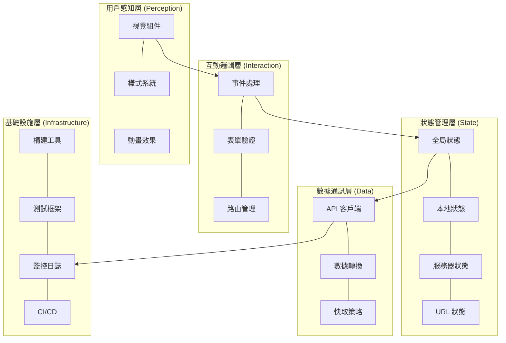
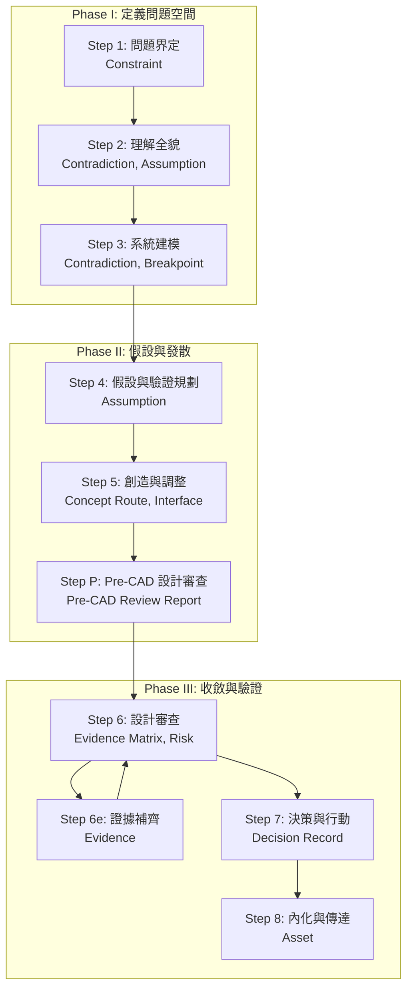
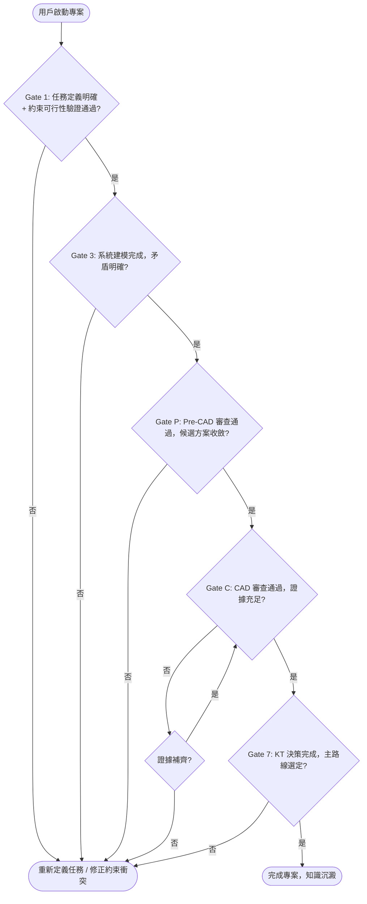

# 前端設計藍圖 (Frontend Design Blueprint) - RD Design Copilot

---

**文件版本:** `v1.1`
**最後更新:** `2026-03-12`
**主要作者:** `AI Agent`
**審核者:** `User/AI Agent`
**狀態:** `Draft`

**相關文檔:**
- 專案 PRD: `/home/os-sunnie.gd.weng/python_workstation/delta-project/ebike/rd_design_copilot/docs/e2e/PRD_RD_Design_Copilot.md`
- 系統架構文檔 (SA): 
    - `/home/os-sunnie.gd.weng/python_workstation/delta-project/ebike/rd_design_copilot/docs/e2e/RD_Design_Copilot_整合流程.md`
    - `/home/os-sunnie.gd.weng/python_workstation/delta-project/ebike/rd_design_copilot/docs/e2e/RD_Design_Copilot_State_Machine.md`
- API 設計規範: `N/A`

---

## 目錄

**Part A — 架構與技術基礎** (從 PRD + SA 萃取)
- [1. 架構目標與決策原則](#1-架構目標與決策原則)
- [2. 系統分層架構](#2-系統分層架構)
    - [2.1 用戶感知層](#21-用戶感知層)
    - [2.1.1 積極反饋機制 (Positive Feedback Mechanisms)](#211-積極反饋機制-positive-feedback-mechanisms)
    - [2.2 互動邏輯層](#22-互動邏輯層)
    - [2.2.1 複雜互動模式 (Complex Interaction Patterns)](#221-複雜互動模式-complex-interaction-patterns)
    - [2.3 狀態管理層](#23-狀態管理層)
    - [2.4 數據通訊層](#24-數據通訊層)
    - [2.5 基礎設施層](#25-基礎設施層)
- [3. 設計系統 (Design System)](#3-設計系統-design-system)
- [4. 技術選型](#4-技術選型)
- [5. 效能與優化策略](#5-效能與優化策略)
- [6. 可用性與無障礙](#6-可用性與無障礙)
- [7. 工程化實踐](#7-工程化實踐)
- [8. 前後端協作契約](#8-前後端協作契約)
- [9. 監控與安全](#9-監控與安全)

**Part B — 資訊架構與頁面規格** (從 PRD + Part A 萃取)
- [10. 核心設計原則與 IA 策略](#10-核心設計原則與-ia-策略)
- [11. 資訊架構總覽](#11-資訊架構總覽)
- [12. 核心用戶旅程](#12-核心用戶旅程)
- [13. 網站地圖與導航結構](#13-網站地圖與導航結構)
- [14. 頁面詳細規格](#14-頁面詳細規格)
- [15. 數據流與狀態管理](#15-數據流與狀態管理)
- [16. URL 結構與路由規範](#16-url-結構與路由規範)

**Part C — 整合檢查清單**
- [17. 開發與品質檢查清單](#17-開發與品質檢查清單)

---

# Part A — 架構與技術基礎

---

## 1. 架構目標與決策原則

> 每一個前端技術決策都應能追溯到其對商業目標的貢獻。

### 1.1 根本目的

| 目的類別 | 核心目標 | 可衡量指標 (KPIs) |
|:---------|:---------|:------------------|
| **商業轉換** | 提升早期設計決策效率與方案品質 | 概念評審效率 ≤2 hr/次 (KPI-2)、方案探索數量 ≥3 條 (KPI-4) |
| **內容消費** | N/A | N/A |
| **工具效率** | 提高早期設計階段的生產力與準確性 | 假設驗證覆蓋率 ≥80% (KPI-3)、用戶採納率 ≥70% (KPI-6) |
| **品牌體驗** | N/A | N/A |

### 1.2 架構終極目標

四個核心維度的平衡：

| 維度 | 定義 | 衡量方式 |
|:-----|:-----|:---------|
| **性能** | 系統響應速度與處理能力 | 任務定義表生成時間 ≤30s, TRIZ 解法生成時間 ≤60s, 方案集合載入時間 ≤3s, 並發用戶數 ≥50 |
| **可用性** | 用戶學習曲線、操作便利性與多語言支援 | 新用戶 2 小時內完成首個專案, 支援繁體中文/英文, 匯出格式多樣性 |
| **可維護性** | 系統配置彈性與知識庫更新能力 | 模板可配置, 知識庫可更新, API 文件完整性 |
| **可靠性** | 系統穩定運行與資料安全性 | 系統可用性 ≥99.5%, 資料每日備份, 資料恢復時間 ≤4hr |

### 1.3 決策因果鏈

```
明確的商業目標 → 設計與技術決策 → 用戶體驗指標 → 商業成果
```

**本專案關鍵決策：**

| 決策 | 原因 | 預期結果 | 商業影響 |
|:-----|:-----|:---------|:---------|
| 引入 AI 輔助的結構化設計流程 | 解決早期概念設計「三重困境」（未知最多、決策最重、時間最緊），避免高昂返工成本 | 擴大設計可能性空間，使未知可見可追蹤，前置風險驗證，決策可審查可複用，提升溝通效率 | 降低架構級返工次數 (KPI-1 ≤2 次), 提升概念評審效率 (KPI-2 ≤2 hr/次), 增加用戶採納率 (KPI-6 ≥70%) |

---

## 2. 系統分層架構

> 將前端解構為清晰的職責層次，確保關注點分離。



### 2.1 用戶感知層

- **職責**：渲染 UI 組件、應用視覺設計系統、動畫效果
- **原則**：組件化、單一職責、無狀態優先
- **設計模式**：原子設計 (Atoms → Molecules → Organisms → Templates → Pages)

| 方案類別 | 本專案選擇 | 選擇理由 |
|:---------|:-----------|:---------|
| **組件框架** | React | PRD 推薦，生態系統成熟，利於構建複雜 UI |
| **樣式方案** | Tailwind CSS | 快速開發，原子化 CSS，與 React 生態整合良好 |
| **動畫庫** | Framer Motion | 聲明式動畫，易於與 React 組件結合 |

### 2.1.1 積極反饋機制 (Positive Feedback Mechanisms)

- **職責**：通過及時、清晰、積極的反饋，增強用戶的操作信心和滿意度。
- **原則**：明確告知用戶操作結果，避免不確定性，提升用戶體驗的愉悅感。

| 反饋類型 | 設計考量 | 預期行為 |
|:---------|:---------|:---------|
| **成功訊息** | 簡潔、明確、不干擾用戶流程、支持自動消失 | 用戶完成關鍵操作 (如保存、提交) 後，介面能即時顯示成功提示，讓用戶安心。 |
| **確認模式** | 用於高風險或不可逆操作、提供再次確認機會 | 用戶執行刪除、發布等操作前，提供模態框或輕量級提示再次確認，防止誤操作。 |
| **微互動/動畫** | 輕量、快速、視覺愉悅、不分散主要注意力 | 用戶點擊按鈕、完成表單等操作時，通過按鈕動效、勾選動畫、載入動畫等增加趣味性和即時反饋。 |

### 2.2 互動邏輯層

- **職責**：用戶輸入處理、客戶端驗證、路由導航
- **原則**：事件委派、防抖節流、可訪問性優先

**路由設計：**
```javascript
const routes = [
  { path: '/projects', component: ProjectList, meta: { title: '專案列表', requiresAuth: true } },
  { path: '/projects/:id/define', component: TaskDefinitionPage, meta: { title: '任務定義', requiresAuth: true } },
  { path: '/decisions/:id', component: DecisionRecordPage, meta: { title: '決策記錄', requiresAuth: true } },
];
```

### 2.2.1 複雜互動模式 (Complex Interaction Patterns)

- **職責**：處理拖放、實時更新、互動式圖表等高階用戶互動。
- **原則**：提供清晰的反饋、確保操作流暢、支持鍵盤導航、考慮性能開銷。

| 互動類型 | 設計考量 | 預期行為 |
|:---------|:---------|:---------|
| **拖放** | 視覺提示 (拖動元素樣式變化, 放置區域高亮)、操作取消 (ESC 鍵)、性能優化 (虛擬化列表) | 用戶可直觀地重新排序列表或移動元素，並獲得即時視覺反饋。 |
| **實時更新** | 更新頻率、數據同步策略、衝突解決、視覺提示 (新數據標記) | 多用戶協作或數據頻繁變更時，介面能流暢且一致地顯示最新信息。 |
| **互動式圖表** | 縮放、平移、點擊事件、工具提示、性能優化 (數據抽樣) | 用戶能探索數據、篩選信息，並從圖表中獲取詳細見解。 |

### 2.3 狀態管理層

- **職責**：全局/局部狀態管理、持久化、異步操作

| 狀態類型 | 存儲位置 | 持久化 | 技術方案 |
|:---------|:---------|:-------|:---------|
| 組件 UI 狀態 | Local State | 否 | useState |
| 跨組件共享 | Global Store | 選擇性 | Zustand |
| 服務器數據 | 查詢緩存 | 選擇性 | React Query |
| 表單狀態 | 表單庫 | 否 | React Hook Form |
| URL 狀態 | URL 參數 | 自動 | React Router |
| 持久化狀態 | LocalStorage | 是 | Zustand persist middleware |

### 2.4 數據通訊層

- **職責**：API 通訊、數據轉換、快取與重試

**錯誤分類處理：**

| 錯誤類型 | HTTP 狀態碼 | 用戶提示 | 技術處理 |
|:---------|:------------|:---------|:---------|
| 網絡錯誤 | - | 連接失敗 + 重試 | 自動重試 (如 SWR/React Query 內建) |
| 客戶端錯誤 | 400/422 | 表單級錯誤 | 映射到表單字段 |
| 未授權 | 401 | 重定向登入 | 清除 Token, 跳轉登入頁 |
| 權限不足 | 403 | 無權限提示 | 記錄日誌, 顯示權限不足頁 |
| 資源不存在 | 404 | 404 頁面 | 導航到自定義 404 頁面 |
| 服務器錯誤 | 500/503 | 服務不可用 | 錯誤報告至 Sentry |

### 2.5 基礎設施層

- **職責**：構建打包、代碼質量、測試自動化、CI/CD、監控

```
源碼 → Linter → Type Check → Build → Test → Bundle → Deploy
```

| 方案類別 | 本專案選擇 | 選擇理由 |
|:---------|:-----------|:---------|
| **構建工具** | Vite | 開發體驗佳，啟動速度快 |
| **包管理器** | pnpm | 節省磁碟空間，提升安裝速度 |
| **代碼檢查** | ESLint + Prettier | 統一代碼風格，減少潛在錯誤 |
| **類型檢查** | TypeScript | 提升代碼可靠性與可維護性 |
| **測試框架** | Vitest + Testing Library | 快速單元測試，模擬用戶行為 |
| **E2E 測試** | Playwright | 跨瀏覽器測試，提供強大調試能力 |
| **Git Hooks** | Husky + lint-staged | 在提交前執行檢查，確保代碼質量 |
| **提交規範** | Conventional Commits | 統一提交訊息格式，自動生成變更日誌 |

---

## 3. 設計系統 (Design System)

> 設計系統是設計與開發之間的共享語言。

### 3.1 設計原則

| 原則 | 定義 | 實踐指南 | 可衡量指標 |
|:-----|:-----|:---------|:-----------|
| **清晰優於炫技** | 功能性優先於複雜度 | 標準 UI 模式、高對比度 | 任務完成時間、錯誤率 |
| **一致性** | 相同功能表現一致 | 統一按鈕/圖標/互動模式 | 組件複用率 |
| **可訪問性** | 所有人都能使用 | WCAG 2.1 AA、鍵盤導航 | A11y 審計得分 |
| **性能優先** | 速度是功能的一部分 | 圖片優化、代碼分割 | Core Web Vitals |

### 3.2 視覺語言系統

#### 色彩系統

```scss
// 品牌色
$color-primary: #007bff; // Blue
$color-secondary: #6c757d; // Gray
$color-tertiary: #fd7e14; // Orange

// 語義色
$color-success: #28a745; // Green
$color-warning: #ffc107; // Yellow
$color-error: #dc3545; // Red
$color-info: #17a2b8; // Cyan

// 中性色
$color-text-primary: #212529; // Dark Gray
$color-text-secondary: #6c757d; // Medium Gray
$color-background: #f8f9fa; // Light Gray
$color-surface: #ffffff; // White
$color-divider: #e9ecef; // Lighter Gray
```

**對比度檢查：**
- [x] 正常文字 ≥ 4.5:1 (WCAG AA)
- [x] 大號文字 ≥ 3:1
- [x] 互動元素 ≥ 3:1

#### 字體排印系統

```css
:root {
  /* 字體家族 */
  --font-family-base: "Noto Sans TC", "Helvetica Neue", Arial, "Segoe UI", sans-serif;
  --font-family-heading: "Noto Sans TC", "Helvetica Neue", Arial, "Segoe UI", sans-serif;
  --font-family-monospace: "SFMono-Regular", Menlo, Monaco, Consolas, "Liberation Mono", "Courier New", monospace;

  /* 字體大小 - 模塊化比例 1.25 (Major Third) */
  --font-size-xs: 0.64rem;  /* ~10px */
  --font-size-sm: 0.8rem;   /* ~12.8px */
  --font-size-base: 1rem;   /* 16px */
  --font-size-md: 1.25rem;  /* ~20px */
  --font-size-lg: 1.563rem; /* ~25px */
  --font-size-xl: 1.953rem; /* ~31px */
  --font-size-2xl: 2.441rem;/* ~39px */

  /* 行高 */
  --line-height-tight: 1.2;
  --line-height-normal: 1.5;
  --line-height-relaxed: 1.75;

  /* 字重 */
  --font-weight-normal: 400;
  --font-weight-medium: 500;
  --font-weight-bold: 700;
}
```

#### 間距系統

```css
:root {
  /* 8pt 網格系統 */
  --spacing-1: 0.25rem;  /* 4px */
  --spacing-2: 0.5rem;   /* 8px */
  --spacing-3: 0.75rem;  /* 12px */
  --spacing-4: 1rem;     /* 16px */
  --spacing-6: 1.5rem;   /* 24px */
  --spacing-8: 2rem;     /* 32px */
  --spacing-12: 3rem;    /* 48px */
  --spacing-16: 4rem;    /* 64px */
}
```

### 3.3 組件庫架構

```
components/
├── atoms/           # 原子：Button, Input, Icon, Badge
├── molecules/       # 分子：FormField, SearchBox, Card
├── organisms/       # 組織：Header, Footer, DataTable
├── templates/       # 模板：DashboardLayout, AuthLayout
└── pages/           # 頁面：完整視圖
```

**組件檢查清單：**
- [ ] 單一職責、可組合
- [ ] Props 用 TypeScript 定義
- [ ] 包含 ARIA 屬性
- [ ] 有 Storybook 文檔 (若有導入)
- [ ] 有單元/快照測試

### 3.4 設計令牌 (Design Tokens)

```json
{
  "color": { "brand": { "primary": { "value": "#007bff" } } },
  "spacing": { "scale": { "4": { "value": "1rem" } } },
  "typography": { "fontSize": { "base": { "value": "1rem" } } }
}
```

**轉換流程：** Figma → Tokens Studio → JSON → Style Dictionary → CSS/SCSS/JS (若有導入設計令牌流程)

---

## 4. 技術選型

### 4.1 框架選擇

| 項目 | 選擇 | 理由 |
|:-----|:-----|:-----|
| **前端框架** | React | PRD 推薦，生態系統成熟，社群活躍 |
| **狀態管理** | Zustand | 輕量、快速、易於學習和使用 |
| **服務器狀態** | React Query | 強大的數據同步、緩存和優化功能 |
| **表單庫** | React Hook Form | 性能優異，靈活且易於整合 |

### 4.2 構建與工具鏈

| 項目 | 選擇 |
|:-----|:-----|
| 構建工具 | Vite |
| 包管理器 | pnpm |
| 代碼檢查 | ESLint + Prettier |
| 類型檢查 | TypeScript |
| 測試框架 | Vitest + Testing Library |
| E2E 測試 | Playwright |
| Git Hooks | Husky + lint-staged |
| 提交規範 | Conventional Commits |

### 4.3 樣式方案

| 項目 | 選擇 | 理由 |
|:-----|:-----|:-----|
| **基礎樣式** | Tailwind CSS | Utility-first 框架，加速 UI 開發 |
| **組件樣式** | CSS Modules | 提供組件級別的樣式隔離，避免衝突 |
| **動畫** | Framer Motion | 聲明式動畫 API，與 React 完美結合 |

---

## 5. 效能與優化策略

### 5.1 核心網頁指標目標

| 指標 | 全名 | 目標值 | 優化重點 |
|:-----|:-----|:-------|:---------|
| **LCP** | Largest Contentful Paint | < 2.5s | 資源優化、關鍵渲染路徑優化、CDN |
| **INP** | Interaction to Next Paint | < 200ms | JS 執行時間優化、長任務拆分、避免過度渲染 |
| **CLS** | Cumulative Layout Shift | < 0.1 | 圖片/媒體尺寸預留、字體加載策略、動態內容管理 |

### 5.2 優化策略清單

**載入優化：**
- [ ] 路由級代碼分割 (lazy / Suspense)
- [ ] 組件級延遲加載 (如非首屏關鍵組件)
- [ ] 圖片：WebP/AVIF 格式 + srcset 響應式圖片 + loading="lazy"
- [ ] 字體：woff2 + 子集化 + font-display: swap + preload 關鍵字體
- [ ] JS：Tree-shaking + 壓縮混淆，減少包體積
- [ ] 預連接/預取：preconnect, dns-prefetch, prefetch 關鍵資源

**運行時優化：**
- [ ] 避免不必要重渲染 (React.memo, useMemo, useCallback)
- [ ] 虛擬化長列表 (如 react-window / react-virtuoso)
- [ ] Service Worker 緩存策略 (PWA 考慮)
- [ ] Web Workers 處理計算密集型任務
- [ ] 妥善利用瀏覽器緩存 (Cache-Control, ETag)

---

## 6. 可用性與無障礙

### 6.1 響應式設計

```css
:root {
  --breakpoint-sm: 640px;   /* 大手機 */
  --breakpoint-md: 768px;   /* 平板 */
  --breakpoint-lg: 1024px;   /* 筆電 */
  --breakpoint-xl: 1280px;   /* 桌面 */
}
```

**策略：** Mobile-first

### 6.2 無障礙 (WCAG 2.1)

**Level A (必須)：**
- [x] 非文本內容有替代文本 (圖片 alt 屬性)
- [x] 顏色不是唯一傳達方式 (需輔以文字或圖標)
- [x] 所有功能可鍵盤操作 (焦點管理、Tab 順序)

**Level AA (推薦)：**
- [x] 文本對比度 ≥ 4.5:1
- [x] 頁面標題準確
- [x] 焦點順序合邏輯
- [x] 可跳過重複內容 (Skip Link)

### 6.3 國際化 (i18n)

- 主要語言：繁體中文
- 回退語言：英文
- 方案：react-i18next

---

## 7. 工程化實踐

### 7.1 項目結構

```
src/
├── assets/          # 圖片、字體、靜態資源
├── components/      # 通用 UI 組件 (atoms/molecules/organisms)
├── features/        # 功能模塊（按業務領域劃分，如 project, decision, assumption）
├── layouts/         # 布局組件 (如 Header, Footer, Sidebar)
├── pages/           # 頁面組件 (直接對應路由)
├── hooks/           # 共享 Hooks (如 useAuth, useDebounce)
├── utils/           # 工具函數 (如日期格式化, 數據處理)
├── services/        # API 服務層 (如 api.ts, auth.ts)
├── stores/          # 狀態管理 (Zustand store)
├── styles/          # 全局樣式 (如 base.css, variables.css)
├── types/           # TypeScript 類型定義
└── config/          # 配置文件 (如環境變數, 常量)
```

### 7.2 測試策略

```
       /
      /E2E\          10% - 關鍵用戶旅程
     /------
    /Integration\    20% - 功能模塊、API 集成
   /------------
  /  Unit Tests  \   70% - 工具函數、Hooks、核心邏輯
 /----------------
```

| 類型 | 覆蓋率目標 | 工具 | 重點 |
|:-----|:-------|:-----|:-----|
| 單元測試 | 80%+ | Vitest + Testing Library | 工具函數、Hooks、純函數邏輯 |
| 組件測試 | 70%+ | Testing Library | 組件渲染、互動、可訪問性 |
| E2E 測試 | 關鍵路徑 | Playwright | 用戶關鍵業務流程，跨頁面互動 |

### 7.3 CI/CD

- 觸發：push to main/develop, Pull Request 合併
- 流程：Install Dependencies → Lint Check → Type Check → Run Tests (Unit/Component) → Build Application → Run E2E Tests → Deploy to Staging/Production
- 覆蓋率上傳：Codecov (或類似工具)
- 自動化部署：Jenkins / GitHub Actions / GitLab CI

---

## 8. 前後端協作契約

### 8.1 API 通訊規範

```typescript
// 統一響應格式
interface ApiResponse<T> {
  success: boolean;
  data: T;
  message?: string;
  errors?: { field?: string; code: string; message: string }[];
}
```
- **RESTful API**：遵循 RESTful 設計原則，使用標準 HTTP 方法。
- **數據格式**：請求和響應均採用 JSON 格式。
- **錯誤處理**：統一的錯誤響應格式，包含錯誤碼和描述。

### 8.2 認證與授權

- 方案：JWT (JSON Web Tokens) / OAuth (若整合 SSO/LDAP)
- Token 存儲：HttpOnly Cookie (防止 XSS 攻擊) 或 Local Storage (需搭配額外安全措施)
- 刷新機制：自動刷新 (使用 Refresh Token) / 手動重新登入 (Refresh Token 過期後)

---

## 9. 監控與安全

### 9.1 監控

| 類別 | 指標 | 工具 |
|:-----|:-----|:-----|
| 性能 | LCP, INP, CLS (Core Web Vitals) | Google Analytics / Web Vitals Reporting |
| 錯誤 | JS 錯誤率、API 錯誤率、崩潰率 | Sentry |
| 業務 | 概念評審效率, 假設驗證覆蓋率, 用戶採納率 | Google Analytics / 自定義儀表板 |

### 9.2 安全檢查清單

- [x] XSS：框架自動轉義 + CSP Headers 配置 + 避免使用 `dangerouslySetInnerHTML`
- [x] CSRF：使用 HttpOnly Cookie + SameSite 屬性 (Lax/Strict) 或 CSRF Token
- [x] 數據：敏感資料透過 HTTPS 傳輸，後端加密存儲；前端不直接處理敏感數據
- [x] 依賴：定期執行 `npm audit` 或 `pnpm audit`，並使用 Dependabot 等工具自動化檢查和更新依賴
- [x] 用戶認證：遵循 PRD NFR-8 (支援 SSO/LDAP 整合) 提供的方案
- [x] 權限控制：前端基於用戶角色顯示/隱藏功能，並在 API 層嚴格驗證權限

---

# Part B — 資訊架構與頁面規格

---

## 10. 核心設計原則與 IA 策略

### 10.1 核心價值主張

> 「RD Design Copilot 是一套 AI 輔助的早期概念設計系統，把「未知」變成「可追蹤的假設」，把「靈感」變成「可審查的方案」，把「試錯」變成「最小實驗」。 」

**第一性原理推演：**
```
商業目標：解決早期概念設計「三重困境」（未知最多、決策最重、時間最緊），降低返工成本。
    ↓
用戶需求：擴大設計可能性，使假設可追蹤，前置風險驗證，決策有依據。
    ↓
設計策略：結構化發散、嚴格收斂、最小驗證。
    ↓
架構決策：採用雙層狀態機管理流程與工件生命週期，利用數位線索串聯，並提供 AI 輔助的方法論工具箱。
```

### 10.2 資訊架構原則

#### 簡化原則
- ✅ **保留**：任務定義、假設台帳、矛盾識別、TRIZ/SCAMPER 變形、方案集合、KT 決策記錄等核心功能。
- ❌ **移除**：不直接服務於概念設計核心流程（如自動生成可簽核 CAD/CAE 文件）的功能。
- 🎯 **專注**：於結構化早期設計流程，將風險管理前置化，實現可追溯的決策。

#### 認知負荷優化
- **決策點數量**：從模糊、無限的決策點，收斂到 KT 決策分析框架下有限且有證據支撐的決策點。
- **每頁專注度**：每個頁面或功能模塊聚焦於一個核心任務（例如：任務定義頁面、假設台帳頁面、方案探索頁面）。
- **資訊分層**：透過清晰的流程階段（Phase I-III）和工件生命週期管理，將複雜資訊分層呈現。

#### 架構模式
- **選擇：** 混合架構 — **理由：** 主體導航採用層級結構以符合專案管理邏輯，而核心設計流程則以中心輻射模式支持迭代發散與收斂。

---

## 11. 資訊架構總覽

### 11.1 系統層次結構



### 11.2 頁面總覽矩陣

| # | 頁面檔名 | 頁面名稱 | 主要職責 | 用戶目標 | 預期停留 | 導航深度 |
|:--|:---------|:---------|:---------|:---------|:---------|:---------|
| 0 | `project-list` | 專案列表 | 管理所有專案 | 選擇或創建專案 | 短 | Level 0 |
| 1 | `project-dashboard` | 專案儀表板 | 總覽專案進度與決策記錄 | 了解專案狀態 | 中 | Level 1 |
| 2 | `task-definition` | 任務定義 | 定義需求與約束 | 結構化任務邊界 | 中 | Level 2 |
| 3 | `assumption-ledger` | 假設台帳 | 管理設計假設 | 追蹤不確定性與風險 | 長 | Level 2 |
| 4 | `contradiction-identification` | 矛盾識別 | 識別並形式化工程矛盾 | 準備 TRIZ 分析 | 中 | Level 2 |
| 5 | `solution-explorer` | 方案探索 | 生成與篩選設計方案 | 擴大設計可能性與收斂 | 長 | Level 2 |
| 6 | `pre-cad-review` | Pre-CAD 審查 | 審查初步設計方案 | 收斂候選方案至 3-5 條 | 中 | Level 2 |
| 7 | `design-review` | 設計審查 | 評估設計成熟度、識別風險與證據缺口 | 確保設計可驗證與可靠 | 長 | Level 2 |
| 8 | `decision-record` | 決策記錄 | 記錄設計決策及理由 | 確保決策可追溯與可解釋 | 中 | Level 2 |
| 9 | `knowledge-base` | 知識庫 | 瀏覽與沉澱設計知識資產 | 知識複用與學習 | 長 | Level 1 |

**總計：** 10 頁

---

## 12. 核心用戶旅程

### 12.1 主要旅程

```mermaid
graph LR
    A[1. 建立專案<br/>(Project List)<br/>短] --> B[2. 定義問題<br/>(Task Definition, Contradiction Identification, Assumption Ledger)<br/>中]
    B --> C[3. 發散方案<br/>(Solution Explorer, Pre-CAD Review)<br/>長]
    C --> D[4. 收斂決策<br/>(Design Review, Decision Record)<br/>長]
    D --> E[5. 沉澱分享<br/>(Knowledge Base)<br/>短]
```

### 12.2 用戶旅程映射表

| 階段 | 頁面 | 用戶心理狀態 | 設計目標 | 主要 CTA | 預期停留 | 轉換率目標 |
|:-----|:-----|:-------------|:---------|:---------|:---------|:-----------|
| 建立專案 | `project-list` | 準備開始新設計 | 簡潔快速建立新專案 | `新增專案` | 短 | N/A |
| 定義問題 | `task-definition` | 尋求方向與邊界 | 上傳多模態素材 → AI 萃取預填 → 完整結構化需求與約束 → 約束可行性檢查通過 | `上傳素材` / `確認任務定義` | 中 | 80% (任務定義完成 + 約束可行性通過) |
| 定義問題 | `contradiction-identification` | 識別設計瓶頸 | 蘇格拉底七類提問 → 將口語問題形式化為 TRIZ 矛盾 → 矛盾分級 | `確認矛盾` | 中 | 75% (核心矛盾辨識) |
| 定義問題 | `assumption-ledger` | 擔憂未知、不確定性 | 因果迴路圖建模 → 窮盡前提假設 → 驗證規劃排序 | `新增假設` | 長 | 90% (關鍵假設皆記錄) |
| 發散方案 | `solution-explorer` | 尋求創意、突破既有框架 | 生成多樣性設計方案 | `生成方案` | 長 | 60% (方案通過 MUST 快篩) |
| 發散方案 | `pre-cad-review` | 篩選、初步收斂 | 縮減候選集，減少早期投資 | `通過審查` | 中 | 80% (方案通過 Pre-CAD Gate) |
| 收斂決策 | `design-review` | 權衡取捨、評估風險 | 確保設計 Robust 且可驗證 | `補齊證據` / `通過審查` | 長 | 70% (設計通過 CAD Gate) |
| 收斂決策 | `decision-record` | 尋求共識、終局判斷 | 確立最終設計方向 | `簽核決策` | 中 | 95% (決策記錄完整) |
| 沉澱分享 | `knowledge-base` | 總結、學習、知識傳承 | 將設計經驗知識資產化 | `匯出報告` | 短 | N/A |

### 12.3 決策點分析



**總決策點：** 5 個主要 Gate (Gate 1, 3, P, C, 7) + 1 個迴圈決策 (Gate 6e: 證據補齊)。

---

## 13. 網站地圖與導航結構

### 13.1 完整網站地圖

```
RD Design Copilot (/)
│
├─ 0. 專案列表 (/projects) [Level 0]
│  └─ → 專案儀表板
│
├─ 1. 專案儀表板 (/projects/:id) [Level 1]
│  ├─ 任務定義頁面 (/projects/:id/task-definition)
│  ├─ 假設台帳頁面 (/projects/:id/assumption-ledger)
│  ├─ 矛盾識別頁面 (/projects/:id/contradiction-identification)
│  ├─ 方案探索頁面 (/projects/:id/solution-explorer)
│  ├─ Pre-CAD 審查頁面 (/projects/:id/pre-cad-review)
│  ├─ 設計審查頁面 (/projects/:id/design-review)
│  ├─ 決策記錄頁面 (/projects/:id/decision-record)
│  └─ → 知識庫 (全局)
│
├─ 2. 知識庫 (/knowledge-base) [Level 1]
│  └─ → 專案儀表板 (特定知識關聯)
│
└─ 設定 (/settings) [Level 1]
    └─ 使用者設定 (/settings/user)
```

### 13.2 導航連結矩陣

| 來源 \ 目標 | 專案列表 | 專案儀表板 | 任務定義 | 假設台帳 | 矛盾識別 | 方案探索 | Pre-CAD 審查 | 設計審查 | 決策記錄 | 知識庫 |
|:------------|:--------|:------------|:--------|:--------|:--------|:--------|:----------|:--------|:--------|:--------|
| **專案列表** | - | ✅ (選擇專案) | ❌ | ❌ | ❌ | ❌ | ❌ | ❌ | ❌ | ✅ (通用入口) |
| **專案儀表板** | ✅ (返回) | - | ✅ (流程入口) | ✅ (流程入口) | ✅ (流程入口) | ✅ (流程入口) | ✅ (流程入口) | ✅ (流程入口) | ✅ (流程入口) | ✅ (相關知識) |
| **任務定義** | ❌ | ✅ (完成返回) | - | ❌ | ✅ (下一步) | ❌ | ❌ | ❌ | ❌ | ✅ (相關知識) |
| **矛盾識別** | ❌ | ✅ (完成返回) | ✅ (上一步) | ✅ (下一步) | - | ❌ | ❌ | ❌ | ❌ | ✅ (相關知識) |
| **假設台帳** | ❌ | ✅ (完成返回) | ❌ | - | ✅ (上一步) | ✅ (下一步) | ❌ | ❌ | ❌ | ✅ (相關知識) |
| **方案探索** | ❌ | ✅ (完成返回) | ❌ | ✅ (上一步) | ❌ | - | ✅ (下一步) | ❌ | ❌ | ✅ (相關知識) |
| **Pre-CAD 審查** | ❌ | ✅ (完成返回) | ❌ | ❌ | ❌ | ✅ (上一步) | - | ✅ (下一步) | ❌ | ✅ (相關知識) |
| **設計審查** | ❌ | ✅ (完成返回) | ❌ | ❌ | ❌ | ❌ | ✅ (上一步) | - | ✅ (下一步) | ✅ (相關知識) |
| **決策記錄** | ❌ | ✅ (完成返回) | ❌ | ❌ | ❌ | ❌ | ❌ | ✅ (上一步) | - | ✅ (相關知識) |
| **知識庫** | ✅ (返回) | ✅ (相關專案) | ✅ (相關任務) | ✅ (相關假設) | ✅ (相關矛盾) | ✅ (相關方案) | ✅ (相關審查) | ✅ (相關審查) | ✅ (相關決策) | - |

> ✅ 推薦路徑 | ⚠️ 需確認（有驗證） | ❌ 不存在

---

## 14. 頁面詳細規格

> 為每個核心頁面複製以下模板填寫。

### 14.1 任務定義頁面

#### 基本信息

| 屬性 | 值 |
|:-----|:---|
| **檔名** | `TaskDefinitionPage.tsx` |
| **URL** | `/projects/:id/task-definition` |
| **URL 參數** | `id=[專案ID]`（必須） |
| **頁面類型** | 功能/表單 |
| **導航深度** | Level 2 |

#### 職責與目標

| 項目 | 內容 |
|:-----|:-----|
| **主要任務** | 協助用戶結構化地定義新專案的需求、約束與目標。 |
| **次要任務** | 識別關鍵 KPI，為後續決策提供依據。 |
| **用戶目標** | 清楚地理解專案的邊界和成功的衡量標準。 |
| **轉換目標** | 80% 的用戶能完整填寫並確認任務定義。 |

#### 關鍵組件結構

```html
<page-structure>
  <!-- 0. 多模態素材上傳區塊 (PRD F1.7, P0) -->
  <section class="source-upload-zone">
    <multi-modal-uploader
      accept=".pdf,.png,.jpg,.jpeg,.xlsx,.xls,.csv,.docx"
      label="上傳設計素材 (PDF/圖片/Excel/規格書)"
      onExtractComplete="handleAIExtraction"
    />
    <ai-extraction-preview>
      <!-- AI 自動萃取結果預覽：約束、假設、歷史數據、矛盾線索 -->
      <extraction-section type="constraints" label="萃取的約束條件" editable />
      <extraction-section type="assumptions" label="萃取的假設" editable />
      <extraction-section type="historical-data" label="歷史數據" editable />
      <extraction-section type="contradiction-clues" label="矛盾線索" editable />
    </ai-extraction-preview>
  </section>

  <!-- 1. 任務定義表單區塊 -->
  <section class="task-definition-form">
    <form-group>
      <input-field label="Mission" name="mission" type="textarea" required />
      <input-field label="Hard Constraints" name="hardConstraints" type="textarea" />
      <input-field label="Soft Objectives" name="softObjectives" type="textarea" />
      <input-field label="Non-Goals" name="nonGoals" type="textarea" />
    </form-group>
    <kpi-input-list label="三個最不能失敗指標" name="criticalKPIs" />
    <button-group>
      <button type="submit">確認任務定義</button>
      <button type="button">取消</button>
    </button-group>
  </section>

  <!-- 2. 約束可行性檢查結果 (PRD F1.8, P0 — AI 三層質疑機制 Layer 1) -->
  <section class="constraint-feasibility-check">
    <feasibility-result-panel>
      <status-badge type="pass|fail|warning" />
      <feasibility-detail label="物理可行性驗證" />
      <conflict-list label="衝突的約束組合" />
      <ai-recommendation label="AI 建議" />
    </feasibility-result-panel>
  </section>
</page-structure>
```

#### 導航出口

```javascript
{
  primary: '/projects/:id/contradiction-identification', // 下一步到矛盾識別
  secondary: '/projects/:id', // 返回專案儀表板
  back: '/projects/:id',
}
```

#### 關鍵指標 (KPIs)

| 指標 | 目標值 | 衡量方式 |
|:-----|:-------|:---------|
| 任務定義完成率 | 80% | 資料庫中 `Constraint` 實體 `status` 為 `reviewed` 的比例 |

#### 驗收標準

- [x] 任務定義表單所有必填欄位可正常填寫與提交。
- [x] 「三個最不能失敗指標」可新增、編輯、刪除，並能設定其判斷方式。
- [x] 提交後數據能正確保存並更新專案狀態。
- [x] 表單驗證邏輯正確，並能提供清晰的錯誤提示。
- [x] 多模態素材上傳支援 PDF/圖片/Excel/規格書，AI 自動萃取結果可預覽與編輯 (F1.7)。
- [x] 約束可行性檢查結果面板正確顯示 pass/fail/warning 狀態與 AI 建議 (F1.8)。
- [x] Gate 1 通過條件包含約束可行性驗證結果。

---

## 15. 數據流與狀態管理

### 15.1 數據流向圖

```mermaid
graph TB
    subgraph "Frontend App"
        A[任務定義頁面] --> B[本地狀態 (UI State)]
        C[方案探索頁面]
        D[決策記錄頁面]
    end
    subgraph "Backend API"
        E[/api/projects/{id}/constraints]
        F[/api/projects/{id}/solutions]
        G[/api/projects/{id}/decisions]
        H[/api/projects/{id}/sources/upload]
        I[/api/projects/{id}/constraints/feasibility-check]
        J[/api/projects/{id}/contradictions/convergence-graph]
    end
    subgraph "Database Layer"
        DB_Constraint[Constraint Entity (PostgreSQL)]
        DB_Solution[Concept Route Entity (PostgreSQL)]
        DB_Decision[Decision Record Entity (PostgreSQL)]
    end

    A -->|POST / PUT| E
    E -->|Writes to| DB_Constraint
    DB_Constraint -- Query --> E
    E -->|Returns Data| A

    C -->|GET| F
    F -->|Reads from| DB_Solution
    DB_Solution -- Query --> F
    F -->|Returns Data| C

    D -->|GET| G
    G -->|Reads from| DB_Decision
    DB_Decision -- Query --> G
    G -->|Returns Data| D

    B -->|Updates UI| A

    A -->|POST (multipart)| H
    H -->|AI extraction results| A
    A -->|POST| I
    I -->|Feasibility result| A
```

### 15.2 狀態持久化策略

| 數據 | 存儲方式 | 有效期 | 說明 |
|:-----|:---------|:-------|:-----|
| 用戶偏好設定 | `localStorage` | 永久 | 用戶自定義的 UI 顯示、篩選條件、主題設定等 |
| 登入 Token | `HttpOnly Cookie` | Session / Expires (配合 Refresh Token) | 用於身份驗證與會話管理，提升安全性 |
| 專案草稿數據 | `localStorage` (選填) | 短暫 / 手動清除 | 用戶在表單中尚未提交的臨時數據，可選擇性持久化 |
| 核心業務數據 | `PostgreSQL` | 永久 | 所有與專案相關的核心實體：Constraint, Assumption, Concept Route, Decision Record, Evidence 等 |
| 大文件證據 | `S3 / MinIO` | 永久 | 仿真報告、測試數據等非結構化大文件 |

---

## 16. URL 結構與路由規範

### 16.1 完整 URL 清單

```
站點根目錄: https://rd-design-copilot.your-domain.com  (示例)

核心頁面:
├── /projects                      [專案列表頁面，可創建新專案]
├── /projects/create               [創建新專案頁面]
├── /projects/:id                  [專案儀表板頁面，`id` 為專案唯一識別符]
├── /projects/:id/task-definition  [任務定義頁面，編輯專案的約束與目標]
├── /projects/:id/assumption-ledger[假設台帳頁面，管理專案假設]
├── /projects/:id/contradiction-identification [矛盾識別頁面，輸入並形式化矛盾]
├── /projects/:id/solution-explorer[方案探索頁面，生成與篩選設計方案]
├── /projects/:id/pre-cad-review   [Pre-CAD 審查頁面，收斂初步方案]
├── /projects/:id/design-review    [設計審查頁面，評估設計成熟度]
├── /projects/:id/decision-record  [決策記錄頁面，查看與簽核設計決策]
├── /knowledge-base                [知識庫總覽頁面，瀏覽 Playbook、案例等]
├── /knowledge-base/:category/:slug[知識庫文章詳情頁，`category` 和 `slug` 用於定位文章]
└── /settings                      [用戶設定頁，包含個人資料、偏好設定等]

API 端點:
├── GET /api/projects              [獲取專案列表]
├── POST /api/projects             [創建新專案]
├── GET /api/projects/:id          [獲取單一專案詳情]
├── PUT /api/projects/:id          [更新專案信息]
├── DELETE /api/projects/:id       [刪除專案]
├── GET /api/projects/:id/constraints   [獲取專案約束]
├── PUT /api/projects/:id/constraints   [更新專案約束]
├── GET /api/projects/:id/assumptions   [獲取專案假設列表]
├── POST /api/projects/:id/assumptions  [創建專案假設]
├── GET /api/projects/:id/contradictions[獲取專案矛盾列表]
├── GET /api/projects/:id/solutions     [獲取專案方案列表]
├── POST /api/projects/:id/solutions    [創建專案方案]
├── GET /api/projects/:id/decisions     [獲取專案決策記錄]
├── POST /api/projects/:id/decisions    [創建專案決策記錄]
├── POST /api/projects/:id/sources/upload [上傳多模態素材 (PDF/圖片/Excel/規格書)，AI 自動萃取約束、假設、矛盾線索]
├── GET  /api/projects/:id/sources     [獲取已上傳素材列表與萃取結果]
├── POST /api/projects/:id/constraints/feasibility-check [約束可行性檢查 (AI 驗證約束組合是否物理可行)]
├── GET  /api/projects/:id/contradictions/convergence-graph [獲取矛盾收斂圖 (DAG 結構)]
├── PUT  /api/projects/:id/contradictions/:cid/severity [更新矛盾分級 (Fatal/Major/Minor)]
├── GET  /api/projects/:id/architecture-health [獲取架構健康度監控狀態]
├── GET  /api/projects/:id/pre-cad-confidence [獲取 Pre-CAD Confidence Score]
└── [METHOD] /api/[其他功能端點]       [根據模塊功能擴展]
```

### 16.2 URL 驗證與錯誤處理

| 情境 | 處理方式 |
|:-----|:---------|
| 缺少必要參數 | 前端路由守衛檢查，若缺少則導航至錯誤頁面或提示。 |
| 參數格式無效 | 前端路由守衛驗證參數類型（如 `:id` 必須為數字或 UUID），若無效則導航至 404 頁面。 |
| 頁面不存在 | 服務器配置 404 頁面，前端捕獲路由錯誤並展示友好的 404 提示。 |
| 用戶無權訪問 | 後端 API 返回 403 Forbidden，前端導航至無權限提示頁面。 |

---

# Part C — 整合檢查清單

---

## 17. 開發與品質檢查清單

### 17.1 開發階段

**設計與規劃：**
- [x] 已審查 PRD 與設計稿，確保理解需求。
- [x] 已定義組件層級與複用策略，促進代碼共享。
- [x] 已規劃狀態管理方案，確保數據流清晰可控。
- [x] 已與後端確認 API 契約，減少前後端集成問題。

**代碼實現：**
- [x] 組件符合單一職責原則，易於維護。
- [x] Props 使用 TypeScript 嚴格類型定義，提升代碼健壯性。
- [x] 實施錯誤邊界 (Error Boundaries)，提升應用穩定性。
- [x] 使用設計令牌而非硬編碼，確保視覺一致性。
- [x] 響應式設計在三種斷點（Mobile, Tablet, Desktop）測試通過。

### 17.2 測試階段

**功能測試：**
- [x] 所有用戶流程端到端可走通。
- [x] 表單驗證正確。
- [x] 錯誤/載入/空狀態正確展示。

**兼容性與無障礙：**
- [x] 主流瀏覽器測試 (Chrome, Firefox, Safari, Edge)。
- [x] 手機平板真機測試。
- [x] 鍵盤導航可用。
- [x] 螢幕閱讀器基本可用。

**性能：**
- [x] Lighthouse Performance Score > 90。
- [x] LCP < 2.5s, INP < 200ms, CLS < 0.1。
- [x] 包體積 < 500KB gzipped (合理目標)。

### 17.3 上線前

**代碼審查：**
- [x] 通過 ESLint + TypeScript 檢查，無警告/錯誤。
- [x] 至少一名同事 Code Review 並批准。
- [x] 無 `console.log` / `debugger` 殘留。

**部署：**
- [x] CI/CD 流程通過所有檢查。
- [x] 環境變數文檔更新。
- [x] 已建立回滾計劃。

**安全與監控：**
- [x] API Keys 不在代碼中硬編碼。
- [x] Sentry / 錯誤監控已設置並正常運行。
- [x] Web Vitals 監控已設置。
- [x] `pnpm audit` 通過，無已知高風險漏洞。

### 17.4 上線門檻 (Go/No-Go)

- [x] 所有 P0 功能完成並測試通過。
- [x] 無阻斷性 Bug (Blocker)。
- [x] 性能指標達標。
- [x] 安全掃描通過。

**角色簽核：**

| 角色 | 責任 | 簽核 | 日期 |
|:-----|:-----|:-----|:-----|
| PM | 需求滿足 | ⬜ | |
| Frontend Lead | 技術品質 | ⬜ | |
| QA | 測試覆蓋 | ⬜ | |

---

## 附錄

### A. 術語表

| 術語 | 英文 | 定義 |
|:-----|:-----|:-----|
| 信息架構 | Information Architecture (IA) | 組織、結構化和標記內容的方法 |
| 設計令牌 | Design Tokens | 設計系統的最小視覺元素 |
| 無障礙性 | Accessibility (A11y) | 確保所有人都能使用產品 |
| **TRIZ** | Theory of Inventive Problem Solving | 發明問題解決理論，用於識別與解決矛盾 |
| **SCAMPER** | SCAMPER Technique | 創意發散工具（Substitute/Combine/Adapt/Modify/Put/Eliminate/Rearrange） |
| **KT Decision Analysis** | Kepner-Tregoe Decision Analysis | Kepner-Tregoe 決策分析框架（MUST/WANT/AC） |
| **Set-Based Design** | Set-Based Design | 保留多條路線並行發展，延遲收斂 |
| **假設台帳** | Assumption Ledger | 追蹤設計假設的結構化文件 |
| **最小實驗** | Minimal Experiment | 用最少成本驗證最關鍵假設的實驗 |
| **矛盾收斂圖** | Contradiction Convergence Graph | DAG 結構的矛盾解決追蹤圖，每個 TRIZ 解法掃描次級矛盾，直到所有葉節點收斂（無新矛盾） |
| **矛盾分級** | Contradiction Severity Classification | 矛盾嚴重度分類：Fatal（影響 MUST，必須解決）、Major（影響 WANT >20%，強烈建議解決）、Minor（影響 WANT ≤20% 且有緩解方案，進入 Risk Register） |
| **Pre-CAD Confidence Score** | Pre-CAD Confidence Score | 收斂信心指數 = converged(Fatal+Major) / total(Fatal+Major) x 100%，Gate P 門檻 = 100% |
| **AI 主動質疑層** | Three-Layer AI Challenge Mechanism | AI 三層質疑機制：Layer 1 約束可行性檢查（Gate 1）、Layer 2 問題重構質疑（Step 2 第七類蘇格拉底提問）、Layer 3 架構健康度監控（Step 5a-6） |
| **架構健康度監控** | Architecture Health Monitor | 矛盾收斂圖節點數監控：≤3 健康、4-5 警告、>5 強制回退 Step 1、循環矛盾強制重構 |
| **多模態素材** | Multi-modal Source Material | 用戶上傳的 PDF/圖片/Excel/規格書等設計素材，AI 自動萃取約束、假設、歷史數據與矛盾線索 |
| **重構提問** | Reframing Question | 第七類蘇格拉底提問，質疑問題本身的框架是否正確 |

### B. 相關文檔

| 文檔 | 路徑 |
|:-----|:-----|
| PRD | `/home/os-sunnie.gd.weng/python_workstation/delta-project/ebike/rd_design_copilot/docs/e2e/PRD_RD_Design_Copilot.md` |
| 系統架構文檔 (SA - 整合流程) | `/home/os-sunnie.gd.weng/python_workstation/delta-project/ebike/rd_design_copilot/docs/e2e/RD_Design_Copilot_整合流程.md` |
| 系統架構文檔 (SA - 狀態機) | `/home/os-sunnie.gd.weng/python_workstation/delta-project/ebike/rd_design_copilot/docs/e2e/RD_Design_Copilot_State_Machine.md` |
| KT 決策框架 | `KT_Robust_決策框架.md` (或內部連結) |
| Figma 設計文件 | `[連結到 Figma Prototype/Spec]` |
| Storybook 組件庫 | `[連結到 Storybook]` |

### C. 變更記錄

| 日期 | 版本 | 作者 | 變更摘要 |
|:-----|:-----|:-----|:---------|
| 2026-02-24 | v1.0 | AI Agent | 初版建立（基於 PRD, SA 文件合併前端架構 + 資訊架構） |
| 2026-03-12 | v1.1 | AI Agent | 新增多模態素材上傳 (F1.7)、約束可行性檢查 (F1.8)、第七類蘇格拉底提問-重構 (F1.9)、矛盾收斂圖與分級、架構健康度監控、Pre-CAD Confidence Score、AI 三層質疑機制；更新 Gate 1 條件、用戶旅程、數據流、API 端點與術語表 |

---

**最後更新：** 2026-03-12
**維護者：** RD Design Copilot Frontend Team